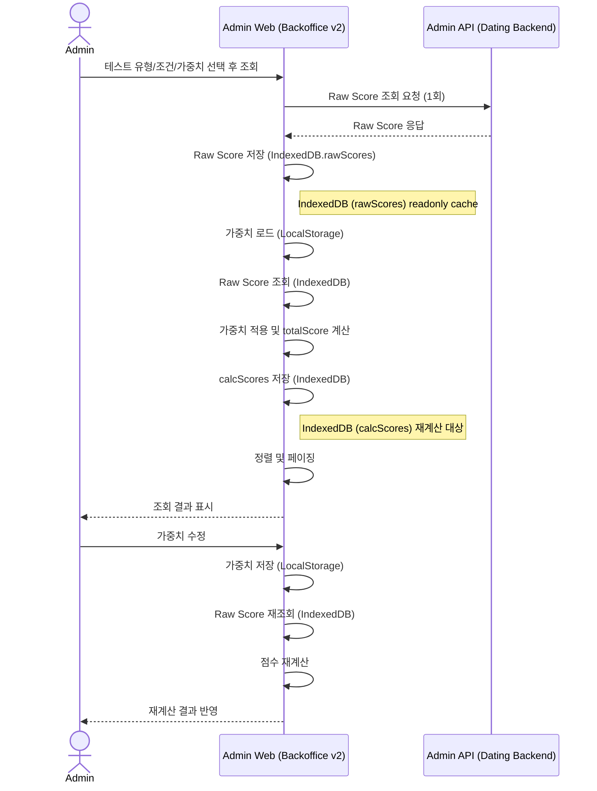
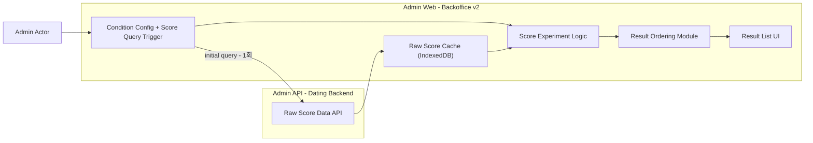

# 백오피스 데이팅 알고리즘 테스트 페이지 구축 Onepager

분류: SRS
작성자: 김세현
최근 수정일: 2026년 2월 24일 오후 2:47
최초 작성일: 2026년 1월 29일 오전 11:25
담당자: 김세현
문서 상태: Active
생성 일시: 2026년 1월 29일 오전 11:25
시작일: 2026/01/29
진행상황: 진행중
최종 편집자: 전규현

<aside>

Project Name : [백오피스] v2 데이팅 매칭 알고리즘 테스트 페이지 구축 

Date : 2026/01/29

Submitter Info : 김세현

</aside>

## 1. Project Description

백오피스 v2에서 데이팅에 사용되는 매칭 알고리즘을 테스트하는 페이지를 구축합니다. 

관리자가 조건에 따른 매칭 알고리즘 결과를 시뮬레이션하기 위한 목적으로 제공됩니다. 

### 1-1. 매칭 알고리즘

🔽  현재 데이팅은 다음과 같은 매칭 알고리즘을 기반으로 사용자 추천을 수행합니다. 

```yaml
### 1. 후보 찾기
- **나이**: 내가 원하는 나이 범위
- **지역**: 내가 원하는 지역  
- **매력도**: 나와 비슷한 점수대 (예: 내가 75점이면 70~80점대)

### 2. 점수 계산
각 후보에게 종합 점수를 부여합니다. 
나이 점수(50%) + 지역 점수(20%) + 매력도 점수(30%) = 최종 점수 
→ 최종 점수가 높을수록 우선순위가 높습니다

### 3. 필터링
다음 사람들은 제외합니다:
- 차단한 사람
- 이미 본 사람
- 이미 매칭된 사람

### 4. 최종 선택
필터링 후 남은 후보 중에서 **점수에 비례한 확률**로 선택합니다.
- 높은 점수 = 선택될 확률 높음
- 낮은 점수 = 선택될 확률 낮음

### 5. 후보가 부족하면?
목표 개수만큼 후보가 없으면 **점수 범위를 넓혀서** 다시 찾습니다.
- 예: 70~80점 → 65~85점 → 60~90점
- 그래도 부족하면 추천 없음으로 종료
```

### 1-2. 알고리즘 테스트

관리자는 매칭 알고리즘에 대하여 설정값을 수정해가며 ***노출 테스트***, ***점수 항목별 테스트***를 진행할 수 있습니다. 

테스트 결과에 따라 **매력도가 높은 순서대로** 유저 정보 리스트가 출력됩니다. 

### 1-2-1. 노출 테스트

→ 가중치를 바꿔서 “노출 우선순위가 어떻게 변하는지” 확인하는 테스트 


🔼 관리자가 테스트 유형(추천/발견)을 선택한 뒤 이미지의 조건들에 가중치를 설정한 뒤 조회하기 버튼을 누르면 

🔽 입력 유형, 조건과 가중치에 따라 ***매력도가 높은 순서대로*** 정렬된 유저 정보 리스트 결과를 확인할 수 있습니다.  

- 결과 리스트는 페이지네이션으로 제공
- 페이지당 노출 개수는 사용자가 **10 / 50 / 100 중 선택**


🔽  출력된 유저 정보 리스트 결과에서 유저의 프로필 이미지/취향 질문을 클릭하면 팝업으로 해당 유저의 프로필 이미지, 취향 질문을 확인할 수 있습니다. 


프로필 이미지 팝업 

### 1-2-2. 점수 항목별 테스트

→ 점수 범위를 기준으로 “어떤 유저가 포함/제외되는지” 확인하는 테스트 


🔼 관리자가 이미지의 항목들을 입력하고 조회하기 버튼을 누르면  

🔽 입력한 항목에 따라 ***매력도가 높은 순서대로*** 정렬된 유저 정보 리스트 결과를 확인할 수 있습니다.

- 결과 리스트는 페이지네이션으로 제공
- 페이지당 노출 개수는 사용자가 **10 / 50 / 100 중 선택**


 

🔽  출력된 유저 정보 리스트 결과에서 유저의 프로필 이미지/취향 질문을 클릭하면 팝업으로 해당 유저의 프로필 이미지, 취향 질문을 확인할 수 있습니다. 


프로필 이미지 팝업 


취향 질문 팝업

---

## 2. Business and Marketing Justification

### 2-1. 프로젝트 배경

현재 데이팅 서비스의 핵심 경쟁력은 매칭 품질임에도 불구하고 다음과 같은 문제를 가지고 있습니다.

- 알고리즘 결과를 눈으로 직접 검증할 수 없어, 알고리즘 개선이 느낌에 의존하게 됨
- 가중치, 조건 변경 시 실제 어떤 유저가 추천되는지 알 수 없음

### 2-2. 프로젝트 목적

관리자는 백오피스 v2에서:

- 조건을 직접 바꾸고
- 점수 가중치를 조정하며
- 그 결과로 **어떤 유저들이 어떤 순서로 추천되는지 즉시 확인**할 수 있습니다.

이를 통해:

- 가중치를 빠르게 변경하며 알고리즘의 영향도를 즉시 검증할 수 있어야 합니다.
- 잘못된 가중치나 조건 설정을 사전에 차단하고 안전하게 시뮬레이션할 수 있어야 합니다.

---

## 3. Risk Assessment

본 기능은 **관리자 전용 백오피스 v2에서만 사용되는 기능**으로,

일반 사용자 대상 서비스 및 실제 서비스 트래픽 흐름과는 **구조적으로 완전히 분리**되어 있습니다.

관리자가 백오피스에서 가중치를 변경하며 산출되는 알고리즘 결과는 **클라이언트 브라우저의 IndexedDB에 일시적으로 저장되어 계산·조회**되며, 별도의 서버 저장이나 처리 과정이 발생하지 않아 서버 부하에는 영향을 미치지 않습니다.

해당 알고리즘 결과는 DB 저장, 서비스 반영, 후속 처리 없이 즉시 폐기됩니다.  

---

### 잠재 리스크 및 검토 결과

1. **서비스 영향 가능성**
    - 실제 매칭 로직 및 사용자 노출 경로와 분리된 구조
    - 조회 결과는 **IndexedDB** 기반이며 서비스 상태에 반영되지 않음
    
    → **서비스 영향 리스크 없음**
    
2. **접근 및 오남용 가능성**
    - 관리자 권한 사용자만 접근 가능
    - 외부 API 및 사용자 앱과 연결 경로 없음
    
    → **외부 노출 및 오남용 리스크 없음**
    

---

## 4. Resource and Scheduling Details

### 투입 리소스

- **백엔드 개발**: 매칭 알고리즘이 사전에 계산하여 저장한 Raw score 데이터 조회 api 구현
    
    [데이팅 알고리즘 테스트 페이지 구축을 위한 API 명세](https://www.notion.so/API-2f7e2bc7639d801da868fd7b26377e63?pvs=21)
    
- **프론트엔드 개발**: 테스트 조건 입력 UI, 가중치 적용에 따른 점수 재계산, 결과 리스트/정렬/페이징 및 상세 팝업 화면 구현
    
    [https://www.figma.com/design/ueFxMzWeXyBsPm2iVQspH8/%EC%96%B4%EB%93%9C%EB%AF%BC?node-id=3356-4070&p=f&m=dev](https://www.figma.com/design/ueFxMzWeXyBsPm2iVQspH8/%EC%96%B4%EB%93%9C%EB%AF%BC?node-id=3356-4070&p=f&m=dev)
    
- **기획/검증**: 테스트 시나리오 정의 및 결과 검증

> 별도의 인프라 증설이나 신규 시스템 도입 없이
> 
> 
> **기존 백오피스 및 서버 환경 내에서 구현** 가능합니다.
> 

### 예상 일정

## Admin API (Dating Backend) 구현 관련 예상 일정

| 항목 | 내용 | 예상 소요 |
| --- | --- | --- |
| 조회 API 구현 | Raw Score 조회, Score 테이블 연동 | 4시간 |

## Admin Web (Backoffice v2) 구현 관련 예상 일정

| 항목 | 내용 | 예상 소요 |
| --- | --- | --- |
| 데이터 캐싱 | IndexedDB 연동 및 캐싱 로직 구현 | 5시간 |
| 계산 | 가중치 적용, total 점수 재계산 로직 | 6시간 |
| 결과 리스트 구현 | 정렬 + 페이지네이션 + 리스트 렌더링 | 5시간 |
| 점수/가중치 입력 UI | 입력 칸/슬라이더/폼 구현 | 4시간 |
| 페이지당 표시 개수 선택 기능 | 10/50/100 선택 기능 구현 | 3시간 |
| 상세 팝업 화면 | 유저 클릭 시 프로필/취향 질문 확인 | 4시간 |

총 31시간 소요 예상됩니다. 

---

## 5. Technical Description

본 기능은 **매칭 알고리즘이 사전에 계산하여 DB에 저장한 점수(Raw Score)를 기반으로**,

관리자가 가중치 및 조건 변경에 따른 **결과 분포를 시뮬레이션**하기 위한

**백오피스 관리자 전용 테스트 기능**입니다.

본 페이지에서 조회되는 결과는 실제 서비스에 반영되지 않으며,

DB 저장이나 사용자 노출 없이 **브라우저의 IndexedDB에 일시적으로 저장된 후 계산·조회**됩니다

---

### Score 테이블 구조

매칭 알고리즘은 사용자별 점수를 사전에 계산한 뒤,

**매칭 유형별로 분리된 Score 테이블**에 저장합니다.

| 테이블 | 용도 |  |
| --- | --- | --- |
| RecommendationUserScore | ‘오늘의 추천’ 매칭 |  |
| ExploreUserScore | 탐색 매칭 |  |

---

### total 점수 정의

`total` 점수는 다음 점수 항목에 가중치를 적용하여 산출한 **최종 매칭 점수**입니다.

- attractiveness
- activity
- revenueTrigger
- spending
- newcomerBonus
- adminOffset

운영 환경에서는 서버에서 해당 계산이 수행되며,

본 테스트 페이지에서는 **사전에 계산된 Raw Score를 기반으로 점수 재조합만 수행**합니다.

발견 : exploreusersccore

추천 : recommendationuserscore


매칭 알고리즘 

[](https://www.notion.so/304e2bc7639d80f0a737db1f3afb4d94?pvs=21)


---

## IndexedDB Schema 설계

```jsx
const dbSchema = {name:"RawScoreDB",version:1,stores: [
        {// 1. 서버에서 가져온 원본 점수 - readonlyname:"rawScores",keyPath:"userId",indexes: [
                {name:"matchType",keyPath:"matchType" },// 추천/탐색 구분
                {name:"gender",keyPath:"gender" },// 성별 필터링
                {name:"timestamp",keyPath:"timestamp" }// 데이터 저장 시점
            ]
        },
        {// 2. 가중치 적용 후 계산된 점수name:"calcScores",keyPath:"userId",indexes: [
                {name:"matchType",keyPath:"matchType" },
                {name:"gender",keyPath:"gender" },
                {name:"totalScore",keyPath:"totalScore" },// 정렬용
                {name:"timestamp",keyPath:"timestamp" }// 계산 시점
            ]
        }
    ]
};
```

---

## 레코드 구조 예시

### 1. rawScores (원본)

```jsx
const rawScoreRecord = {userId:12345,matchType:"Recommendation",// Recommendation / Exploregender:"female",// male / female / unknownscores: {// Raw Score 항목attractiveness:75,activity:60,revenueTrigger:50,spending:40,newcomerBonus:10,adminOffset:5
    },timestamp:Date.now()// 데이터 조회/저장 시점
};
```

### 2. calcScores (계산용)

```jsx
const calcScoreRecord = {userId:12345,matchType:"Recommendation",gender:"female",totalScore:68.5,// RawScore + 가중치 적용appliedWeights: {// LocalStorage에서 가져온 가중치attractiveness:0.3,activity:0.2,revenueTrigger:0.2,spending:0.1,newcomerBonus:0.1,adminOffset:0.1
    },timestamp:Date.now()// 계산 데이터 생성 시점
};
```

---

## 동작 흐름 반영

1. **rawScores**: 서버에서 1회 조회 후 IndexedDB에 저장 → readonly
2. **calcScores**: 사용자가 가중치 변경할 때마다 **재계산 후 저장**
3. **LocalStorage**: 마지막 가중치와 조회 조건 저장 → 새로고침 후에도 저장 가능

---

### 전체 처리 흐름

1. 관리자가 테스트 유형(추천 / 탐색)을 선택합니다.
2. 서버는 선택된 유형에 해당하는 Score 테이블에서 Raw Score 데이터를 조회합니다.
3. 조회 결과는 클라이언트로 1회 전달됩니다.
4. 이후 가중치 변경 및 조회 동작은 **추가 네트워크 요청 없이** 클라이언트 **IndexedDB** 상에서 처리됩니다.

---

### Client-side 데이터 흐름



본 구조의 핵심 설계 원칙은 다음과 같습니다.

- Admin API (Dating Backend): 점수 정의 및 검증된 Raw Score 데이터 제공
- Admin Web (Backoffice v2): 가중치 변경에 따른 재계산 및 정렬을 통한 실험적 시뮬레이션 수행

이는 실제 매칭 결과를 생성하기 위한 구조가 아니라,

**관리자 실험의 즉시성과 반복성을 최우선으로 고려한 설계**입니다.

---

### 계산 로직 공통 모듈화 검토

계산 로직을 Admin API (Dating Backend)/Admin Web (Backoffice v2) 공통 모듈로 관리하는 방안도 검토하였습니다.

해당 방식은 운영 계산식과의 정합성을 유지할 수 있다는 장점이 있으나,

본 페이지에만 존재하는 실험용 입력 구조와 결합되면서 다음과 같은 문제가 발생할 수 있습니다.

- 테스트 전용 가중치 또는 임시 항목 변경 시에도Admin API (Dating Backend)/Admin Web (Backoffice v2) 동시 수정이 필요
- 실험 도구임에도 불구하고 변경 비용이 운영 기능 수준으로 증가
- 테스트 목적의 계산 변경이 운영 로직에 영향을 줄 수 있는 구조적 위험 존재

이에 따라 **운영 로직과 실험 로직의 책임을 명확히 분리**하기 위해,

본 프로젝트에서는 Admin Web (Backoffice v2)에서 독립적인 계산 로직을 유지하는 방식을 최종 선택하였습니다.

이는 계산식 정합성보다 **실험의 자유도와 즉시성을 우선 고려한 의도적인 설계 판단**입니다.

---

## 데이터 볼륨 확장 대응 전략 (IndexedDB 기준)

### 데이터 증가 시 영향 분석 (3,000 ~ 10,000건)

- **점수 재계산**
    - 단순 산술 연산 구조
    - 10,000건 × 30개 항목 기준 약 300,000회 연산 수준으로 성능 영향은 미미
    - **IndexedDB에서 Raw Score 데이터를 조회 후 계산**하므로, 메모리와 DB 접근 간 차이가 있지만 브라우저 환경에서 충분히 처리 가능
- **정렬 및 페이징**
    - 전체 정렬은 O(n log n) 구조
    - 10,000건 기준 브라우저 환경에서 수 ms ~ 수십 ms 내 처리 가능
    - 가중치 변경이 반복될 경우 UI 반응성 저하 가능성 존재
- **IndexedDB 사용 시 메모리 부담**
    - 약 5~10MB 수준
    - 브라우저 메모리와 DB 병행 사용으로도 Admin 페이지 환경에서 충분히 수용 가능

---

### 현재 구조 유지 시 예상 결과

- 데이터 정확성: 서버에서 제공한 Raw Score 기준으로 문제 없음
- 조회 응답성: IndexedDB에서 데이터를 조회 → 네트워크 요청 없이 즉시 반영
- UX: 반복 실험 시 IndexedDB 접근으로 인한 미세한 지연 가능성 존재 (ms 단위)

→ 기술적으로 충분히 동작 가능하며, UX 안정성을 위해 debounce/throttle 적용 권장

---

### 확장 대응 방안 및 최종 판단

### 방안 1. Frontend 재계산 구조 유지 + 최소 보완 (채택)

보완 사항:

- 가중치 변경 이벤트에 debounce / throttle 적용
- 재계산 및 정렬 로직 단일화
- 필요한 페이지만 렌더링
- 조회 데이터 상한선 명시 (최대 10,000건)
- **IndexedDB 캐시 접근 최적화**: 불필요한 read/write 최소화

장점:

- 서버 부하 증가 없음
- 빠른 반복 실험 가능
- 알고리즘 테스트 도구 목적에 최적화
- 페이지 새로고침 후에도 데이터 유지 가능

한계:

- 수만 건 이상 데이터에는 부적합
- IndexedDB 접근 빈도가 과도하면 미세한 UI 지연 가능

### 방안 2. Backend 재계산 구조 전환 (비채택)

- 가중치 변경 시 API 호출 빈도 과도
- UI 즉시성 저하
- 서버 리소스 낭비

→ 본 기능의 목적과 부합하지 않아 비채택

---

### 결론

본 Admin 페이지는 **운영 서비스가 아닌 알고리즘 실험·검증 목적의 도구**로서,

- 데이터 규모 **최대 10,000건으로 제한**,
- **IndexedDB 캐시를 활용한 Frontend 재계산 구조**가 가장 합리적인 선택입니다.

향후 데이터 규모가 수만 건 이상으로 확장되거나

운영 환경에서 실시간 조회 요구가 발생할 경우,

Snapshot 기반 조회 또는 Backend 중심 구조로의 전환을 별도로 검토할 예정입니다.

---

## Component Diagram



---

## IndexDB 선택 이유

### 1️⃣ 목적

- 이전에는 브라우저 메모리에 Raw Score를 임시 저장하고자 했으나, **페이지 새로고침 시 데이터가 사라지는 한계**가 있었음.
- IndexDB는 브라우저 내 **영속 저장**이 가능하여 페이지 새로고침 후에도 데이터를 유지할 수 있음
- 단일 사용자 환경에서 **반복 조회/재계산 시 불필요한 API 호출 최소화** 가능

### 2️⃣ 장점

1. **페이지 새로고침 후에도 유지**
    - 운영자가 테스트 중 실험 결과를 중간에 잃지 않음
2. **오프라인/네트워크 끊김 대응**
    - 네트워크 연결이 일시적으로 끊겨도 Raw Score 데이터 조회 가능

### 3️⃣ 결론

> 이번 관리자 테스트 페이지에서는 운영 서비스와 분리된 **실험·검증 목적**으로,
> 
> 
> 페이지 새로고침 후 데이터 유지와 반복 조회 효율성을 위해 **IndexedDB를 캐시 저장소로 선택**하였습니다.
> 
> 기존 브라우저 메모리보다 안정적이며, 서버 리소스 증가 없이 구현 가능하다는 장점도 있습니다.
> 

ㄹ