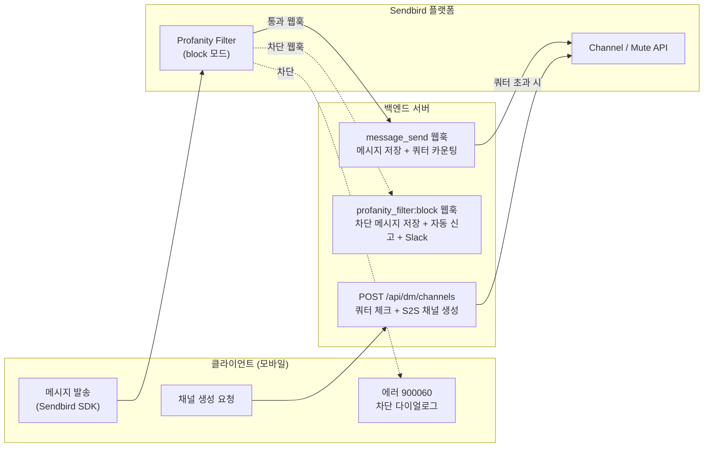
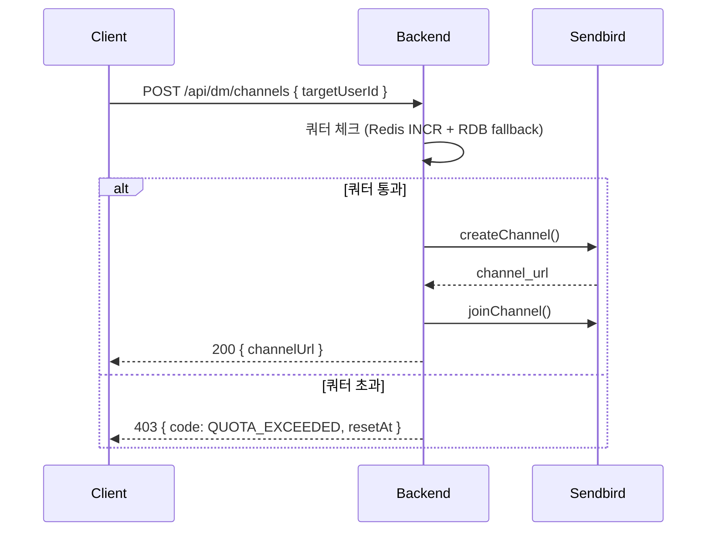
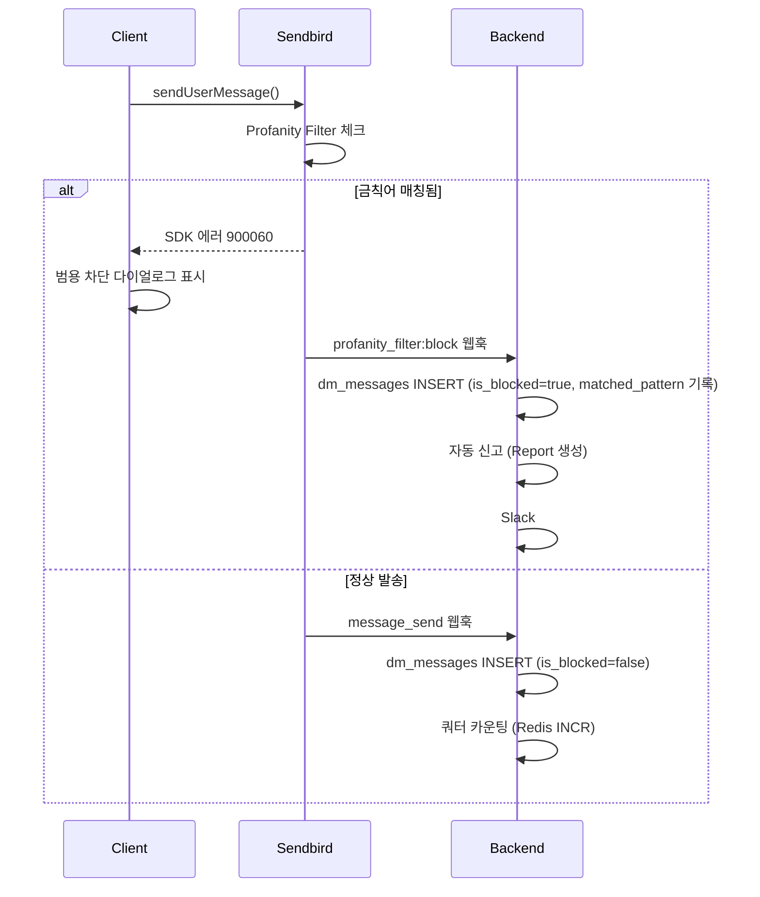
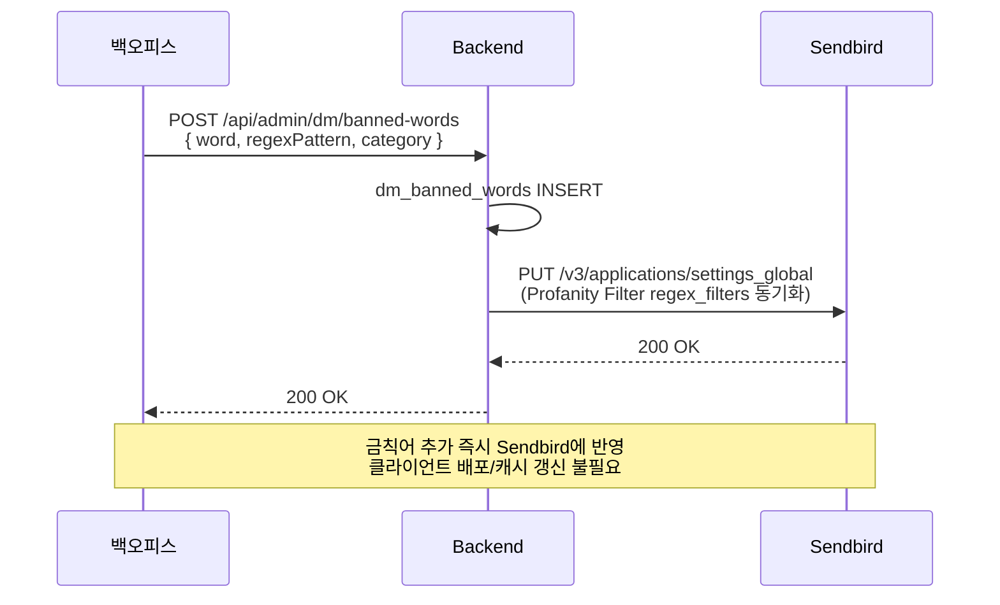
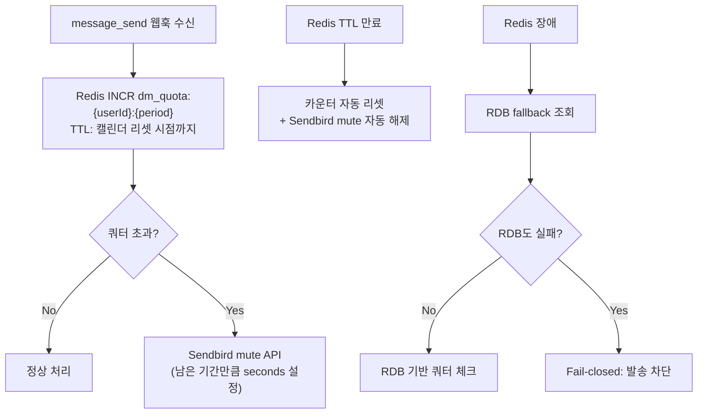

# DM 안전 채팅 — 금칙어 차단 및 발송 제한 통합 OnePager

분류: SRS
작성자: 김범진
최근 수정일: 2026년 3월 10일 오전 11:58
최초 작성일: 2026년 3월 9일 오전 10:16
문서 상태: Active
생성 일시: 2026년 3월 9일 오전 10:16
최종 편집자: 김범진

**Project Name** : DM 안전 채팅 — 금칙어 차단 및 발송 제한 통합

**Date** : 2026-03-10

**Submitter Info** : 김범진 ([beomjin.kim@munto.kr](mailto:beomjin.kim@munto.kr))

**관련 이슈**: https://munto.atlassian.net/browse/WEBB-1126, https://munto.atlassian.net/browse/WEBB-1097

---

## Project Description

DM 채널에서 브로커들이 외부 채널(카카오톡 오픈채팅 등)으로 유저를 유도하는 행위가 지속 발생하고 있다. 현재 클라이언트에서 하드코딩된 금칙어 목록으로 차단하고 있으나, 다음 한계가 있다.

- **금칙어 목록이 클라이언트에 하드코딩** — 업데이트 시 앱 배포 필요
- **변형 패턴**(공백/특수문자 삽입, 대소문자 변형 등) 우회 가능
- **서버 사이드 검증 없음** — 클라이언트 우회 시 차단 불가
- **자동 신고가 클라이언트에서만 동작** — 클라이언트 우회 시 신고 누락, Slack 알림 등 운영 연동 없음
- **DM 메시지가 DB에 저장되지 않아** 사후 조사/분석 불가

### 현재 구현 현황 (As-Is)

| 기능 | 현재 동작 방식 | 한계 |
| --- | --- | --- |
| 금칙어 탐지 | `chat_cautionary_helper.dart`에 금칙어 리스트 하드코딩, 클라이언트 로컬 체크 | 앱 배포 없이 업데이트 불가, 변형 패턴 대응 어려움 |
| 금칙어 차단 | 매칭 시 경고 다이얼로그만 표시 — **신고 접수는 하지 않음** | 운영팀이 금칙어 사용 현황 파악 불가 |
| 외부 링크 자동 신고 | `chat_viewmodel.dart`에서 카카오 오픈채팅 링크 탐지 → **Report API(`POST /reports`)로 서버에 신고** + Slack 알림 | 금칙어와 별도 로직, 금칙어 감지 시에는 신고 안 됨 |
| Sendbird 웹훅 | `group:message_send` 수신 → 푸시 알림 처리만 | 금칙어 체크 없음, 메시지 DB 저장 없음, 쿼터 카운팅 없음 |
| Sendbird 설정 | Profanity Filter, Domain Filter 미설정 | Sendbird 플랫폼 필터링 미사용 |
| DM 메시지 저장 | 없음 (Sendbird 서버에만 보관) | 사후 조사/분석 불가, Grafana/Metabase 조회 불가 |
| DM 발송 제한 | 없음 | 스팸/대량 발송 방지 수단 없음 |

> **핵심**: 현재 자동 신고는 **외부 링크(카카오 오픈채팅) 감지 시에만** 클라이언트 → API → 서버로 동작한다. 금칙어 감지 시에는 경고 다이얼로그만 표시되고 **신고가 접수되지 않는다**. 변경 후에도 신고는 클라이언트 → API → 서버 방식을 유지하되, 금칙어 감지 시에도 자동 신고가 추가된다.
> 

동시에, DM 과다 발송을 통한 스팸/어뷰징 방지를 위해 **발송 제한 정책(쿼터제)**도 함께 도입이 필요하다.

### 왜 두 이슈를 통합하는가

금칙어 차단(WEBB-1126)과 DM 쿼터제(WEBB-1097)는 다음을 공유한다

- **채널 생성 S2S 전환** — 쿼터 체크와 채널 생성을 서버에서 처리
- **Sendbird Webhook 확장** — 메시지 저장, 쿼터 카운팅, 금칙어 감지 모두 webhook 기반
- **DB 스키마** — `dm_messages`, 쿼터/금칙어 테이블 동시 설계
- **백오피스** — 쿼터 정책 + 금칙어 관리를 함께 구축

분리 구현 시 webhook 핸들러, DB 마이그레이션, 모바일 DM 플로우를 두 번 변경해야 하므로 통합이 효율적이다.

### 목표

1. **금칙어 탐지 및 차단** — Sendbird Profanity Filter(block 모드) 기반 플랫폼 레벨 필터링
2. **차단 안내 다이얼로그** — SDK 에러 핸들링 기반 범용 안내 문구 표시
3. **자동 신고** — Sendbird `profanity_filter:block` 웹훅 기반 서버 자동 신고 + Slack 알림
4. **금칙어 동적 관리** — 백오피스에서 실시간 추가/수정/삭제 → Sendbird API 자동 동기화
5. **DM 쿼터제** — 일/주/월 단위 발송 제한, Fail-closed 방식
6. **DM 메시지 DB 저장** — Grafana/Metabase 조회용, 90일 보관
7. **이전 대비 구조 분리** — 웹훅 비즈니스 로직을 Sendbird 비의존으로 분리, 향후 자체 채팅 이전 시 재사용 가능

---

## Business and Marketing Justification

### CX팀 요구사항

**금칙어 목록 (초기)**

| 금칙어 | 유형 |
| --- | --- |
| 무료여성초대 | 브로커 모집 문구 |
| 일반모집형 여성 무료 | 브로커 모집 문구 |
| party_partners | 외부 계정 유도 |
| [https://open.kakao.com](https://open.kakao.com/) | 외부 링크 유도 |

**변형 패턴 탐지**

- 공백 삽입: `무 료 여 성 초 대`
- 특수문자 삽입: `무.료.여.성.초.대`, `무/료/여/성`
- 붙여쓰기 변형: `무료여성초대해요`
- 대소문자 변형: `Party_Partners`, `HTTPS://OPEN.KAKAO.COM`
- → **정규식(regex) 기반** 패턴 매칭으로 대응

**발송 차단** — Sendbird Profanity Filter(block 모드)로 Sendbird 플랫폼에서 차단, 클라이언트 SDK 에러코드 `900060`으로 차단 감지 → 범용 안내 다이얼로그 표시

**차단 안내 문구 (CX팀 확정):**

> 부적절한 채팅이 감지되어 자동 신고 처리됐어요. 반복되는 가이드 위반 시 서비스 이용이 제한될 수 있어요.
> 
- 금칙어별 커스텀 다이얼로그는 Sendbird SDK 제약(어떤 금칙어에 매칭됐는지 미제공)으로 불가하여, CX팀 협의 하에 범용 문구로 통일
- **CS 인입 리스크**: "어떤 게 부적절한 문구인지" 묻는 CS 문의 증가 가능 — CX팀 인지 및 수용 완료

**자동 신고** — Sendbird `profanity_filter:block` 웹훅 수신 시 서버에서 자동 신고 접수, 기존 앱 내 신고 시스템과 동일 처리, 백오피스 신고 관리 탭에서 확인 가능

**Slack 알림** — 채널 `#금칙어_자동신고접수`, 포함 정보: 신고 ID, 탐지된 금칙어, 백오피스 신고 상세 링크

**금칙어 관리** — 백오피스에서 동적으로 금칙어 추가/수정/삭제, 추가 즉시 Sendbird Profanity Filter에 동기화

**채팅 DB 저장** — 정상 발송 메시지와 차단된 메시지 모두 DB에 적재. 관리자 직접 검색 UI는 구축하지 않으며(자체 채팅 전환 시 매몰 비용 방지), Grafana/Metabase에서 SQL 쿼리로 조회

### 비즈니스 임팩트

- 브로커 활동으로 인한 유저 이탈 방지 — 외부 채널 유도 차단
- CX팀 운영 효율화 — 수동 모니터링 → 자동 탐지/신고/알림
- 스팸 DM 방지 — 쿼터제로 어뷰징 원천 차단
- 데이터 기반 의사결정 — DM 메시지 DB 적재로 분석 가능

### 전략적 데이터 확보 — 지능형 대응을 위한 선제 투자

금칙어 필터링은 **일차 방어선**이다. 어뷰저는 공백 삽입, 특수문자 치환 등으로 끊임없이 필터를 우회하므로, "막는 것"을 넘어 **"어떻게 뚫고 있는지 관찰하는 것"**이 핵심이다.

이번 프로젝트에서 **차단된 메시지(원문 + 매칭 패턴)까지 dm_messages에 적재**하는 이유:

1. **우회 패턴 분석** — 차단 로그를 통해 신규 변형 패턴을 조기 발견, 금칙어 목록을 선제적으로 보강
2. **AI 학습 데이터 선제 확보** — 향후 자체 AI 기반 지능형 필터링 도입 시 학습 데이터(정상 메시지 vs 차단 메시지)가 이미 축적되어 있어야 함. 지금 로그를 쌓지 않으면 나중에 AI를 도입하고 싶어도 학습시킬 데이터가 없어 실행 불가
3. **자체 채팅 서버 이전 대비** — 이 로깅 체계와 분석 파이프라인은 Sendbird 종속이 아니며, 자체 채팅 전환 시 그대로 이식 가능

---

## Risk Assessment

### 리스크 및 대응

| 리스크 | 영향 | 대응 |
| --- | --- | --- |
| Sendbird Profanity Filter 정규식 한계 | 복잡한 변형 패턴 미탐지 | 주기적 패턴 업데이트 + 신규 변형 발견 시 백오피스에서 즉시 추가 |
| 범용 다이얼로그로 인한 CS 인입 증가 | "어떤 게 부적절한 문구인지" 문의 | CX팀 인지 및 수용 완료, CS 대응 가이드 사전 마련 |
| Redis 장애 시 쿼터 | 카운터 유실 | RDB fallback + Fail-closed (Redis/RDB 둘 다 실패 시 차단) |
| 쿼터 1건 초과 | webhook 기반이라 발송 후 카운팅 | 허용 가능한 수준 (1건 차이) |
| dm_messages 데이터 증가 | 스토리지 비용 | 월별 파티션 + 90일 보관 + DROP PARTITION |
| Sendbird API 동기화 실패 | 금칙어 백오피스 ↔ Sendbird 불일치 | 재시도 큐 + 동기화 상태 모니터링 + 수동 재동기화 API |
| 모바일 구버전 | S2S 전환 전 버전 사용자 | 앱 강제 업데이트 또는 구버전 graceful degradation |
- **Source of Truth는 반드시 RDB** — Redis는 캐시/성능용, 최종 데이터는 DB
- **Fail-closed 방식** — 쿼터 확인 실패 시 발송 차단 (허용 X)
- **하드코딩 지양** — 쿼터 수치는 `dm_quota_policies` 테이블에서 관리
- **TTL 정확성** — 현재 시점부터 실제 캘린더 리셋 시점까지 남은 시간으로 TTL 설정

---

## Resource and Scheduling Details

> **Phase 전략**: Phase 0은 개발 없이 **즉시 적용**하는 일차 방어선이다. Phase 1~3은 서버 기반 로깅·쿼터·자동 신고 체계를 구축하는 **핵심 인프라**이며, Phase 4~5는 백오피스 관리 도구와 모바일 전환이다. 금칙어 필터링(Phase 0)을 선행 적용하여 즉각적인 위협을 억제한 후, 나머지 Phase를 순차 진행한다.
> 

### Phase 0 — 즉시 적용 (Day 1)

개발 없이 Sendbird 대시보드에서 설정.

| 작업 | 설명 |
| --- | --- |
| Profanity Filter 활성화 | Block 모드, 초기 금칙어 4개 등록 |
| Domain Filter 활성화 | `open.kakao.com` 등 외부 링크 차단 |
| Webhook 설정 확인 | `profanity_filter:block` 이벤트 수신 활성화 |

### Phase 1 — DB 스키마 + 기반

| 작업 | 설명 | 담당 |
| --- | --- | --- |
| DB 마이그레이션 | dm_banned_words, dm_messages, dm_quota_* 테이블 생성 | Backend |
| dm_messages 파티션 | 월별 파티션 + 자동 생성 크론 | Backend |
| DmModule 스캐폴딩 | 모듈, 컨트롤러, 서비스 기본 구조 | Backend |
| DmEventHandler 분리 | 웹훅 비즈니스 로직을 Sendbird 비의존으로 분리 | Backend |

### Phase 2 — 핵심 백엔드

| 작업 | 설명 | 담당 |
| --- | --- | --- |
| POST /api/dm/channels | S2S 채널 생성 + 쿼터 Case 1 체크 | Backend |
| DmQuotaService | Redis 카운터 + RDB fallback + Fail-closed | Backend |
| DmContentFilterService | 금칙어 CRUD + Sendbird Profanity Filter API sync | Backend |
| GET /api/dm/quota/status | 잔여 쿼터 조회 API | Backend |

### Phase 3 — Webhook 확장 + 메시지 저장

| 작업 | 설명 | 담당 |
| --- | --- | --- |
| message_send 웹훅 처리 | Bull Queue → dm_messages INSERT | Backend |
| 쿼터 카운팅 웹훅 | message_send → Redis INCR → 초과 시 mute API | Backend |
| profanity_filter:block 웹훅 | 차단 메시지 dm_messages INSERT (is_blocked=true) + 자동 신고 + Slack 알림 | Backend |
| 파티션 관리 크론 | 월별 파티션 자동 생성 + 90일 초과 파티션 DROP | Backend |

### Phase 4 — 백오피스

| 작업 | 설명 | 담당 |
| --- | --- | --- |
| 금칙어 관리 CRUD UI | 목록, 추가, 수정, 삭제 (정규식 미리보기) | Backoffice |
| 쿼터 정책 관리 UI | 정책 조회/수정 | Backoffice |
| 쿼터 예외 관리 UI | 화이트리스트 추가/삭제 | Backoffice |
| 신고 탭 연동 확인 | 자동 신고 건이 기존 신고 관리에 표시되는지 확인 | Backoffice |

> **스코프 제한**: 자체 채팅 서버 전환이 예정되어 있으므로, DM 메시지 검색/조회 전용 UI는 만들지 않는다. 메시지/차단 로그 조회는 **Grafana/Metabase에서 SQL 쿼리**로 해결한다.
> 

### Phase 5 — 모바일

| 작업 | 설명 | 담당 |
| --- | --- | --- |
| DM 채널 생성 S2S 전환 | `sendbird_helper.dart` → POST /api/dm/channels | Mobile |
| 금칙어 차단 에러 핸들링 | SDK 에러코드 `900060` 캐치 → 범용 차단 다이얼로그 표시 | Mobile |
| 기존 하드코딩 금칙어 로직 제거 | `chat_cautionary_helper.dart` 클라이언트 금칙어 체크 로직 삭제 | Mobile |
| 쿼터 UI | 잔여 쿼터 표시 + 초과 시 안내 | Mobile |
| 에러 핸들링 | 403 Quota Exceeded, 채널 생성 실패 등 | Mobile |

---

## Technical Description

### 1. 아키텍처 비교

메시지 금칙어 필터링을 어디서 처리할 것인지에 대해 3가지 방안을 검토했습니다.

### 1안: S2S 전송 방식 (서버 경유)

모든 DM 메시지를 서버를 거쳐 발송한다.

```
Client → POST /api/dm/messages → 서버 금칙어 체크 → SendbirdService.sendMessage()
                                       ↓ 금칙어 감지
             0 { code: "BANNED_WORD", dialogMessage: "...", dialogImage: "..." }
                                       → 클라이언트 다이얼로그 표시
```

**장점**

- 서버에서 완전한 제어 — 금칙어 체크, 쿼터 체크, 메시지 저장을 한 곳에서 처리
- 금칙어별 커스텀 응답을 서버가 직접 반환 가능
- 정확한 쿼터 카운팅 (발송 전 체크)
- 텍스트 정규화(공백/특수문자 제거) 로직을 서버에서 정교하게 구현 가능

**단점**

- **레이턴시 +100~200ms** — 모든 메시지가 서버를 경유
- **모바일 전면 리라이트** — 현재 Sendbird SDK 직접 발송 → 서버 API 호출로 전환 필요
- **서버 장애 = DM 전체 불가** — 단일 장애점(SPOF) 발생
- **파일/이미지/리플라이 핸들링** — Sendbird SDK가 처리하던 파일 업로드, 메시지 타입 분기 등을 서버에서 모두 구현해야 함
- **실시간성 저하** — 타이핑 인디케이터, 읽음 확인 등 SDK 기능과의 통합 복잡

### 2안: Sendbird Filter Only

Sendbird의 내장 Profanity Filter에 금칙어를 등록하고, 서버는 webhook만 처리한다.

```
Client → Sendbird SDK (직접 발송)
              ↓ Sendbird Profanity Filter (block 모드 — Sendbird 플랫폼 차단)
              ↓ 차단됨
         profanity_filter:block 웹훅 → 자동 신고 + Slack 알림
```

**장점**

- **레이턴시 없음** — 기존과 동일한 SDK 직접 발송
- **모바일 변경 최소** — 기존 발송 로직 유지
- **서버 장애에 강함** — Sendbird가 독립적으로 필터링
- **구현 난이도 낮음** — 서버는 webhook 처리만

**단점**

- **금칙어별 커스텀 다이얼로그 불가** — SDK 에러코드 `900060`은 "금칙어 차단됨"만 알려주고, 어떤 금칙어에 매칭됐는지 정보를 제공하지 않음 → CX팀 협의 하에 범용 문구로 통일하여 해결
- 쿼터 1건 초과 가능 (webhook은 발송 후 처리)
- 정규식 패턴을 Sendbird API 포맷에 맞춰 변환 필요

### 3안: 하이브리드

클라이언트에서 금칙어 목록을 서버에서 받아 로컬 체크 + Sendbird Profanity Filter를 안전망으로 사용한다.

```
[금칙어 목록 동기화]
백오피스 CRUD → dm_banned_words DB
                 ├→ GET /api/dm/banned-words (클라이언트 캐시용)
                 └→ Sendbird Profanity Filter API sync (안전망)

[메시지 발송 흐름]
Client: 앱 시작 시 GET /api/dm/banned-words → 로컬 캐시
           ↓
        유저 메시지 입력
           ↓ 로컬 금칙어 체크 (regex, 레이턴시 0ms)
           ↓
        ┌─ 매칭됨 → 해당 금칙어의 dialog_message + dialog_image 다이얼로그 표시
        │           메시지 발송 차단
        │           POST /api/dm/report/banned-word (자동 신고)
        │
        └─ 매칭 안됨 → Sendbird SDK로 직접 발송
                          ↓ Sendbird Profanity Filter (2차 안전망)
                          ↓ message_send 웹훅 → 메시지 DB 저장 + 쿼터 카운팅
```

**장점**

- **금칙어별 커스텀 다이얼로그** — 서버에서 받은 금칙어 목록에 메시지/이미지 URL 포함
- **레이턴시 0ms** — 클라이언트 로컬 체크
- **Sendbird 안전망** — Sendbird Profanity Filter가 클라이언트 우회/목록 미갱신 대비
- **모바일 변경 범위 최소** — 기존 하드코딩 체크를 API 기반으로 교체 (구조 동일)
- **서버 장애에 강함** — Sendbird SDK 직접 발송 유지
- **동적 관리** — 백오피스에서 금칙어 추가 시 클라이언트 + Sendbird 모두 반영

**단점**

- **금칙어 목록 동기화** — DB → Sendbird API + 클라이언트 3곳 동기화 필요
- **클라이언트 목록 stale 가능** — 앱 재시작 전 신규 금칙어 미반영 (Sendbird 안전망이 커버)
- **쿼터 1건 초과 가능** — 메시지 발송 후 webhook으로 카운팅 (허용 가능한 수준)

### 비교 요약

| 항목 | 1안 (S2S) | 2안 (Sendbird Only) | 3안 (하이브리드) |
| --- | --- | --- | --- |
| 금칙어별 커스텀 다이얼로그 | O | **X (불가)** | **O** |
| 메시지 발송 레이턴시 | +100~200ms | 0ms | **0ms** |
| 서버 장애 시 DM | **전체 불가** | 정상 | **정상** |
| 모바일 변경 범위 | 전면 리라이트 | 최소 | **최소** |
| Sendbird 플랫폼 차단 | X (서버 경유) | O | **O (안전망)** |
| 쿼터 정확도 | 정확 | 1건 초과 가능 | 1건 초과 가능 |
| 구현 난이도 | 높음 | 낮음 | **중간** |
| 파일/리플라이 핸들링 | 서버 구현 필요 | SDK 처리 | **SDK 처리** |

### 결론

**2안(Sendbird Filter 기반)을 채택한다.**

초기 검토 시 CX팀의 "금칙어별 커스텀 다이얼로그" 요구사항 때문에 3안을 고려했으나, CX팀과 협의하여 범용 차단 문구로 통일하기로 결정, 이에 따라 클라이언트 금칙어 캐싱/로컬 체크가 불필요해져 가장 단순한 2안으로 확정했다.

- 금칙어 필터링: Sendbird Profanity Filter (block 모드)
- 클라이언트: SDK 에러코드 `900060` 캐치 → 범용 다이얼로그
- 자동 신고: `profanity_filter:block` 웹훅 → 서버에서 처리
- CS 인입 리스크: CX팀 인지 및 수용 완료
- **채널 생성 S2S 전환**(쿼터 체크와 채널 생성을 서버에서 처리)는 [DM 발송 제한 정책 도입 OnePager](https://www.notion.so/DM-OnePager-31ae2bc7639d8014bb19f1aad28c38ef?pvs=21) 해당 OnePager에서 결정한 사항을 따른다.

---

### 2. 최종 아키텍처

### 2.1 전체 시스템 흐름



### 2.2 채널 생성 흐름 (S2S)



### 2.3 메시지 발송 흐름



### 2.4 금칙어 관리 흐름



### 2.5 쿼터 관리 흐름



---

### 3. DB 스키마

### 3.1 dm_banned_words (금칙어 관리)

```sql
CREATE TABLE dm_banned_words (
    id              SERIAL PRIMARY KEY,
    word            VARCHAR(100) NOT NULL,          -- 원본 금칙어 (예: '무료여성초대')
    regex_pattern   VARCHAR(500) NOT NULL,          -- 변형 탐지용 정규식 (Sendbird Profanity Filter 동기화용)
    category        VARCHAR(50),                    -- 분류 (broker_recruit, external_link 등)
    is_active       BOOLEAN NOT NULL DEFAULT true,  -- 활성 여부
    created_at      TIMESTAMPTZ NOT NULL DEFAULT NOW(),
    updated_at      TIMESTAMPTZ NOT NULL DEFAULT NOW()
);

CREATE INDEX idx_dm_banned_words_active ON dm_banned_words (is_active) WHERE is_active = true;
```

**정규식 예시**:

```
원본: "무료여성초대"
regex: "무\s*[.\-/\\\\]*\s*료\s*[.\-/\\\\]*\s*여\s*[.\-/\\\\]*\s*성\s*[.\-/\\\\]*\s*초\s*[.\-/\\\\]*\s*대"

원본: "party_partners"
regex: "(?i)party[_\s.\-]*partners"

원본: "https://open.kakao.com"
regex: "(?i)(https?://)?\s*open\s*[.\s]*kakao\s*[.\s]*com"
```

### 3.2 dm_messages (메시지 저장)

```sql
CREATE TABLE dm_messages (
    id              BIGSERIAL,
    message_id      BIGINT NOT NULL,                -- Sendbird message_id
    channel_url     VARCHAR(200) NOT NULL,           -- Sendbird channel_url
    sender_id       VARCHAR(100) NOT NULL,           -- Sendbird user_id (= 우리 userId)
    message_type    VARCHAR(20) NOT NULL,            -- MESG, FILE, ADMM
    message_text    TEXT,                            -- 메시지 본문
    file_url        VARCHAR(500),                   -- 파일 URL (FILE 타입)
    data            JSONB,                          -- Sendbird message.data
    is_blocked      BOOLEAN NOT NULL DEFAULT false,  -- 금칙어/도메인 필터에 의해 차단된 메시지 여부
    block_reason    VARCHAR(50),                    -- 차단 사유 (profanity_filter, domain_filter 등)
    matched_pattern VARCHAR(500),                   -- 매칭된 금칙어/패턴 (우회 패턴 분석용)
    created_at      TIMESTAMPTZ NOT NULL,            -- Sendbird created_at (epoch → timestamp)
    stored_at       TIMESTAMPTZ NOT NULL DEFAULT NOW(),
    PRIMARY KEY (id, created_at)
) PARTITION BY RANGE (created_at);

-- 월별 파티션 (자동 생성 크론)
CREATE TABLE dm_messages_2026_03 PARTITION OF dm_messages
    FOR VALUES FROM ('2026-03-01') TO ('2026-04-01');

-- 90일 보관 — 오래된 파티션 DROP으로 효율적 삭제

CREATE INDEX idx_dm_messages_channel_created ON dm_messages (channel_url, created_at DESC);
CREATE INDEX idx_dm_messages_sender_created ON dm_messages (sender_id, created_at DESC);
CREATE INDEX idx_dm_messages_message_id ON dm_messages (message_id);
CREATE INDEX idx_dm_messages_blocked ON dm_messages (is_blocked, created_at DESC) WHERE is_blocked = true;
```

### 3.3 dm_quota_policies (쿼터 정책)

[DM 발송 제한 정책 도입 OnePager](https://www.notion.so/DM-OnePager-31ae2bc7639d8014bb19f1aad28c38ef?pvs=21) 참조

### 3.4 dm_quota_counters (쿼터 카운터 — RDB Source of Truth)

[DM 발송 제한 정책 도입 OnePager](https://www.notion.so/DM-OnePager-31ae2bc7639d8014bb19f1aad28c38ef?pvs=21) 참조

### 3.5 dm_quota_exceptions (쿼터 예외)

[DM 발송 제한 정책 도입 OnePager](https://www.notion.so/DM-OnePager-31ae2bc7639d8014bb19f1aad28c38ef?pvs=21) 참조

---

### 4. API 설계

### 4.1 클라이언트 API

- `POST /api/dm/channels**` — S2S 채널 생성 (쿼터 체크 포함)
- `GET /api/dm/quota/status**` — 잔여 쿼터 조회

[DM 발송 제한 정책 도입 OnePager](https://www.notion.so/DM-OnePager-31ae2bc7639d8014bb19f1aad28c38ef?pvs=21) 참조

- `POST /api/dm/report/banned-word**` — 금칙어 감지 시 자동 신고

```json
// Request
{
  "channelUrl": "sendbird_group_channel_xxx",
  "reportedUserId": 12345,
  "bannedWordId": 1,
  "messageText": "무료여성초대 해드립니다"
}

// Response 201
{
  "reportId": 9999,
  "status": "ACCEPTED"
}
```

### 4.2 백오피스 API

| Endpoint | Method | 설명 |
| --- | --- | --- |
| `/api/admin/dm/banned-words` | GET | 금칙어 목록 조회 (페이지네이션, 필터) |
| `/api/admin/dm/banned-words` | POST | 금칙어 추가 → DB INSERT + Sendbird API sync |
| `/api/admin/dm/banned-words/:id` | PATCH | 금칙어 수정 → DB UPDATE + Sendbird API sync |
| `/api/admin/dm/banned-words/:id` | DELETE | 금칙어 삭제 (soft delete) → DB UPDATE + Sendbird API sync |

---

### 5. 향후 채팅 서비스 이전 대비

### 현재 문제

`SendbirdWebhookService`에 Sendbird 페이로드 파싱과 비즈니스 로직(메시지 저장, 쿼터 카운팅, 자동 신고)이 혼재되어 있다. 자체 채팅 이전 시 비즈니스 로직까지 다시 작성해야 하는 구조.

### 적용할 패턴

기존 코드베이스의 이벤트 이미터 패턴(`PushEventEmitter` → `BullPushEventEmitter` / `KafkaPushEventEmitter`)을 따라, 웹훅 처리에서 **이벤트 변환**과 **비즈니스 로직**을 분리한다.

```
[현재 — 결합됨]
SendbirdWebhookController
  → SendbirdWebhookService (Sendbird 페이로드 파싱 + 메시지 저장 + 쿼터 + 신고)

[개선 — 분리]
SendbirdWebhookController
  → SendbirdWebhookService (Sendbird 페이로드 → 표준 이벤트 DTO 변환만)
  → DmEventHandler (메시지 저장, 쿼터 카운팅, 자동 신고 — Sendbird 무관)

[자체 채팅 이전 시]
MuntoChatEventConsumer (내부 이벤트 → 표준 이벤트 DTO 변환)
  → DmEventHandler (동일한 비즈니스 로직 그대로 재사용)
```

### 핵심 원칙

- **지금 인터페이스를 만들지 않는다** — 구현체가 하나뿐인 인터페이스는 YAGNI
- **비즈니스 로직만 분리한다** — `DmEventHandler`가 Sendbird 타입에 의존하지 않도록
- **채팅 서버 이전 시점에 추상화 도입** — 두 번째 구현체가 필요해질 때 인터페이스 추출
- **데이터는 지금부터 축적한다** — dm_messages(정상+차단)는 향후 AI 학습 데이터이자 자체 채팅 이전 시 방어 로직의 기반. 로깅 체계는 단기성 작업이 아닌 핵심 자산 축적 과정

### 모듈 구조

```
apps/api/src/dm/
├── dm.module.ts                      # DmModule
├── dm.controller.ts                  # API endpoints
├── dm.service.ts                     # 채널 생성 등 비즈니스 로직
├── dm-quota.service.ts               # 쿼터 관리
├── dm-content-filter.service.ts      # 금칙어 관리
├── dm-report.service.ts              # 자동 신고
└── dm-event.handler.ts               # 웹훅 이벤트 처리 (Sendbird 비의존)
```

---

### 6. 참고 자료

- [WEBB-1126: DM 금칙어 차단](https://munto.atlassian.net/browse/WEBB-1126)
- [WEBB-1097: DM 발송 제한 정책](https://munto.atlassian.net/browse/WEBB-1097)
- [DM 발송 제한 정책 OnePager (승인됨)](https://www.notion.so/DM-OnePager-31ae2bc7639d8014bb19f1aad28c38ef?pvs=21)
- [Sendbird DM DB 저장 OnePager](https://www.notion.so/DM-OnePager-31ee2bc7639d80c6972bcacb6ef516bf?pvs=21)
- [Sendbird Profanity Filter API](https://sendbird.com/docs/chat/platform-api/v3/application/managing-profanity-filter)
- [Sendbird Webhook Events](https://sendbird.com/docs/chat/webhook-events/v3/message-send)
- [Figma 디자인 (채팅 차단 다이얼로그)](https://www.figma.com/design/CAql5x1tM0PfXUc1zMcibf/%EC%B1%84%ED%8C%85?node-id=3586-13989)