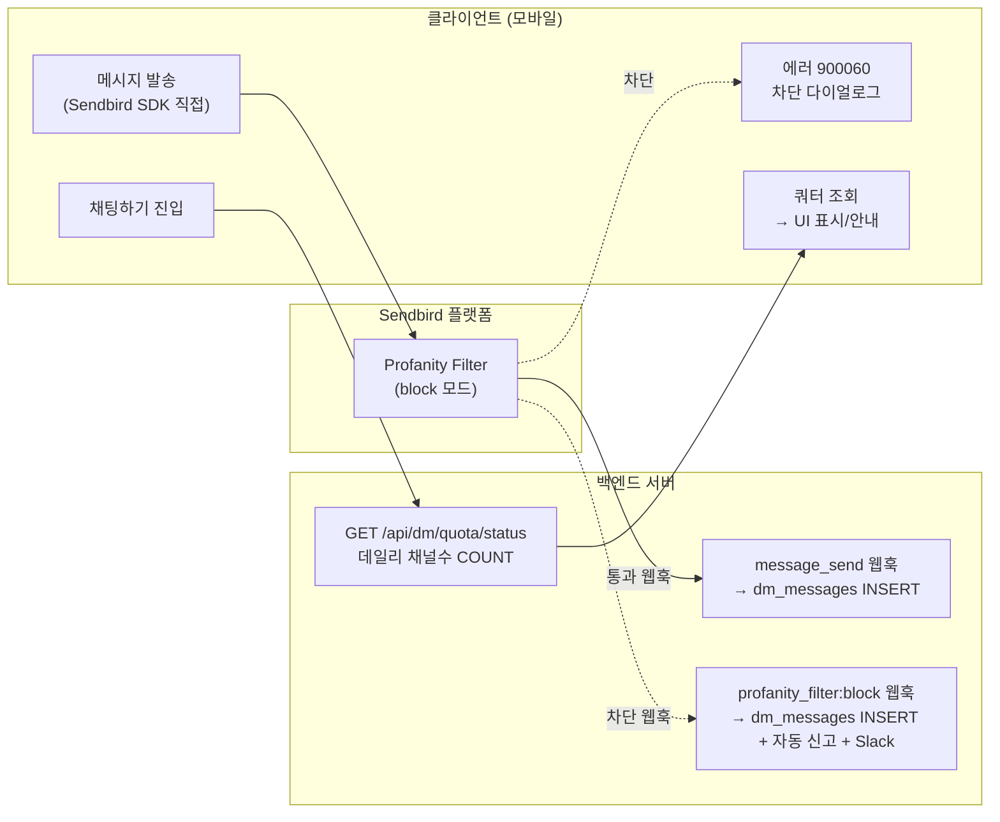
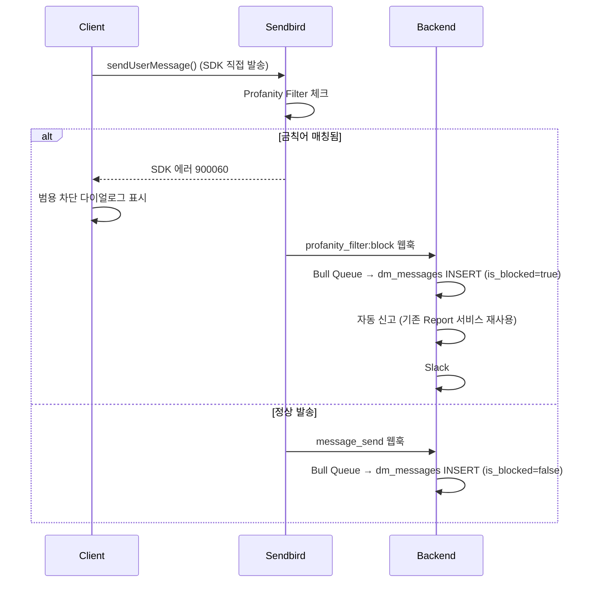
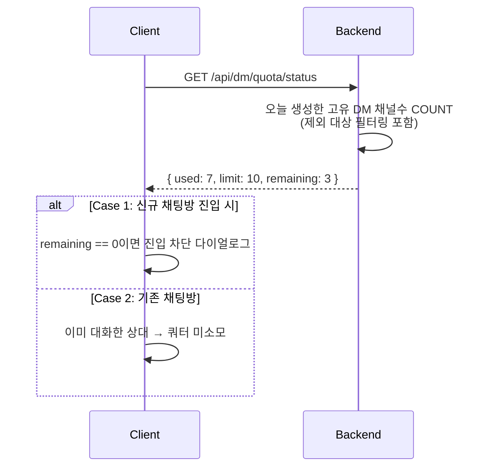

# DM 안전 채팅 — 금칙어 차단 및 발송 제한 통합 OnePager

분류: SRS
작성자: 김범진
최근 수정일: 2026년 3월 10일 오후 2:45
최초 작성일: 2026년 3월 9일 오전 10:16
문서 상태: Active
생성 일시: 2026년 3월 9일 오전 10:16
최종 편집자: 김범진

**Project Name** : DM 안전 채팅 — 금칙어 차단 · 메시지 로깅 · 쿼터 조회

**Date** : 2026-03-10

**Submitter Info** : 김범진 ([beomjin.kim@munto.kr](mailto:beomjin.kim@munto.kr))

관련 이슈: [WEBB-1126](https://munto.atlassian.net/browse/WEBB-1126), [WEBB-1097](https://munto.atlassian.net/browse/WEBB-1097)

---

## Project Description

DM 채널에서 브로커들이 외부 채널(카카오톡 오픈채팅 등)으로 유저를 유도하는 행위가 지속 발생하고 있다. 현재 클라이언트에서 하드코딩된 금칙어 목록으로 차단하고 있으나, 다음 한계가 있다.

- **금칙어 목록이 클라이언트에 하드코딩** — 업데이트 시 앱 배포 필요
- **변형 패턴**(공백/특수문자 삽입, 대소문자 변형 등) 우회 가능
- **서버 사이드 검증 없음** — 클라이언트 우회 시 차단 불가
- **자동 신고가 클라이언트에서만 동작** — 클라이언트 우회 시 신고 누락, Slack 알림 등 운영 연동 없음
- **DM 메시지가 DB에 저장되지 않아** 사후 조사/분석 불가
- **DM 발송 제한 없음** — 스팸/대량 발송 방지 수단 없음

### 현재 구현 현황 (As-Is)

| 기능 | 현재 동작 방식 | 한계 |
| --- | --- | --- |
| 금칙어 탐지 | `chat_cautionary_helper.dart`에 금칙어 리스트 하드코딩, 클라이언트 로컬 체크 | 앱 배포 없이 업데이트 불가, 변형 패턴 대응 어려움 |
| 금칙어 차단 | 매칭 시 경고 다이얼로그만 표시 — **신고 접수는 하지 않음** | 운영팀이 금칙어 사용 현황 파악 불가 |
| 외부 링크 자동 신고 | `chat_viewmodel.dart`에서 카카오 오픈채팅 링크 탐지 → **Report API(`POST /reports`)로 서버에 신고** + Slack 알림 | 금칙어와 별도 로직, 금칙어 감지 시에는 신고 안 됨 |
| Sendbird 웹훅 | `group:message_send` 수신 → 푸시 알림 처리만 | 금칙어 체크 없음, 메시지 DB 저장 없음 |
| Sendbird 설정 | Profanity Filter, Domain Filter 미설정 | Sendbird 플랫폼 필터링 미사용 |
| DM 메시지 저장 | 없음 (Sendbird 서버에만 보관) | 사후 조사/분석 불가 |
| DM 발송 제한 | 없음 | 스팸/대량 발송 방지 수단 없음 |

### 설계 원칙

자체 채팅 서버 전환이 바로 다음 프로젝트이므로, **Sendbird 전용 인프라는 최소로** 쌓고, **어뷰징 패턴 데이터 수집**에 집중한다. 향후 자체 채팅으로 이전해도 재사용할 수 있는 부분(메시지 로깅, 자동 신고, 쿼터 조회)만 서버에 구축한다.

### 목표

1. **금칙어 탐지 및 차단** — Sendbird Profanity Filter(block 모드) 기반 플랫폼 레벨 필터링
2. **차단 안내 다이얼로그** — SDK 에러 핸들링 기반 범용 안내 문구 표시
3. **자동 신고** — Sendbird `profanity_filter:block` 웹훅 기반 서버 자동 신고 + Slack 알림
4. **DM 메시지 DB 저장** — 정상 메시지 + 차단 메시지 모두 적재, 90일 보관
5. **DM 쿼터 조회** — 클라이언트에서 서버로 쿼터 조회, UI 표시용

---

## Business and Marketing Justification

### CX팀 요구사항

**금칙어 목록 (초기)**

| 금칙어 | 유형 |
| --- | --- |
| 무료여성초대 | 브로커 모집 문구 |
| 일반모집형 여성 무료 | 브로커 모집 문구 |
| party_partners | 외부 계정 유도 |
| [https://open.kakao.com](https://open.kakao.com/) | 외부 링크 유도 |

**변형 패턴 탐지**

- 공백 삽입: `무 료 여 성 초 대`
- 특수문자 삽입: `무.료.여.성.초.대`, `무/료/여/성`
- 붙여쓰기 변형: `무료여성초대해요`
- 대소문자 변형: `Party_Partners`, `HTTPS://OPEN.KAKAO.COM`
- → **정규식(regex) 기반** 패턴 매칭으로 대응 (Sendbird Profanity Filter에 직접 등록)

**발송 차단** — Sendbird Profanity Filter(block 모드)로 Sendbird 플랫폼에서 차단. 클라이언트 SDK 에러코드 `900060`으로 차단 감지 → 범용 안내 다이얼로그 표시

**차단 안내 문구 (CX팀 확정):**

> 부적절한 채팅이 감지되어 자동 신고 처리됐어요. 반복되는 가이드 위반 시 서비스 이용이 제한될 수 있어요.
> 
- 금칙어별 커스텀 다이얼로그는 Sendbird SDK 제약(어떤 금칙어에 매칭됐는지 미제공)으로 불가하여, CX팀 협의 하에 범용 문구로 통일
- **CS 인입 리스크**: "어떤 게 부적절한 문구인지" 묻는 CS 문의 증가 가능 — CX팀 인지 및 수용 완료

**금칙어 관리** — Sendbird Dashboard에서 직접 관리. 백오피스 CRUD 및 Sendbird API 동기화 불필요.

**자동 신고** — Sendbird `profanity_filter:block` 웹훅 수신 시 서버에서 자동 신고 접수, 기존 앱 내 신고 시스템과 동일 처리, 백오피스 신고 관리 탭에서 확인 가능

**Slack 알림** — 자동 신고 실시간 알림 + 일간 요약 리포트 (상세: Technical Description > 9. 운영 고려사항)

### DM 쿼터 정책

**제한 조건**:

- **일 10명** (데일리만 유지, 주간/월간 삭제)
- 제한 대상: DM 발송만 차단 (수신은 가능)

**제한 제외 대상**:

- 모임 그룹 채팅
- 본인 모임 참여한 멤버
- 본인 모임 참여했던 멤버
- 본인 모임 찜한 멤버
- 나를 팔로우하는 멤버

**차단 케이스**:

- **Case 1 (신규 채팅방)**: 프로필에서 "채팅하기" 탭 시, 쿼터 초과인 경우 채팅방 진입 전 다이얼로그 안내
- **Case 2 (기존 채팅방)**: 이미 대화한 상대는 쿼터 미소모 (이번 기간에 카운팅되지 않은 경우만 차단)

> **중요**: 서버 enforcement 없음. 클라이언트에서 서버로 쿼터 조회 → 응답으로 UI 표시/차단 안내. 채팅방 진입이나 메시지 발송은 Sendbird SDK 그대로.
> 

[Figma 디자인](https://www.figma.com/design/CAql5x1tM0PfXUc1zMcibf/%EC%B1%84%ED%8C%85?node-id=3586-13989)

### 비즈니스 임팩트

- 브로커 활동으로 인한 유저 이탈 방지 — 외부 채널 유도 차단
- CX팀 운영 효율화 — 수동 모니터링 → 자동 탐지/신고/알림
- 스팸 DM 방지 — 쿼터 UI 안내로 대량 발송 억제
- 데이터 기반 의사결정 — DM 메시지 DB 적재로 분석 가능

### 전략적 데이터 확보

금칙어 필터링은 **일차 방어선**이다. 어뷰저는 공백 삽입, 특수문자 치환 등으로 끊임없이 필터를 우회하므로, "막는 것"을 넘어 "어떻게 뚫고 있는지 관찰하는 것"이 핵심이다.

**차단된 메시지(원문 + 매칭 패턴)까지 dm_messages에 적재**하는 이유:

1. **우회 패턴 분석** — 차단 로그를 통해 신규 변형 패턴을 조기 발견, 금칙어 목록을 선제적으로 보강
2. **AI 학습 데이터 선제 확보** — 향후 자체 AI 기반 지능형 필터링 도입 시 학습 데이터(정상 메시지 vs 차단 메시지)가 이미 축적되어 있어야 함
3. **자체 채팅 서버 이전 대비** — 이 로깅 체계는 Sendbird 종속이 아니며, 자체 채팅 전환 시 그대로 이식 가능

---

## Risk Assessment

| 리스크 | 영향 | 대응 |
| --- | --- | --- |
| Sendbird Profanity Filter 정규식 한계 | 복잡한 변형 패턴 미탐지 | 주기적 패턴 업데이트, Sendbird Dashboard에서 즉시 추가 |
| 범용 다이얼로그로 인한 CS 인입 증가 | "어떤 게 부적절한 문구인지" 문의 | CX팀 인지 및 수용 완료, CS 대응 가이드 사전 마련 |
| dm_messages 데이터 증가 | 스토리지 비용 | 월별 파티션 + 90일 보관 + DROP PARTITION |
| 쿼터 클라이언트 우회 | 앱 변조 시 쿼터 UI 무시 가능 | 허용 가능한 수준 — 자체 채팅 전환 시 서버 enforcement 도입 예정 |
| Sendbird Dashboard 직접 관리 | 관리자 실수 시 필터링 오류 | 금칙어 변경 시 Slack 공유 프로세스 수립 |

---

## Resource and Scheduling Details

### Phase 0 — 즉시 적용 (Day 1)

개발 없이 Sendbird 대시보드에서 설정.

| 작업 | 설명 |
| --- | --- |
| Profanity Filter 활성화 | Block 모드, 초기 금칙어 4개 등록 (정규식 포함) |
| Domain Filter 활성화 | `open.kakao.com` 등 외부 링크 차단 |
| Webhook 설정 확인 | `profanity_filter:block` 이벤트 수신 활성화 |

### Phase 1 — 백엔드

| 작업 | 설명 | 담당 |
| --- | --- | --- |
| DB 마이그레이션 | dm_messages 테이블 + 월별 파티션, dm_channel 테이블 + 인덱스, dm_quota_config 테이블, ClubLike·ChallengeLike userId 인덱스 추가 | Backend |
| Webhook 확장 — message_send | Bull Queue → dm_messages INSERT (is_blocked=false) | Backend |
| Webhook 확장 — profanity_filter:block | dm_messages INSERT (is_blocked=true) + 자동 신고 + Slack 알림 | Backend |
| 자동 신고 서비스 | 기존 Report 서비스 + Slack 연동 재사용 | Backend |
| GET /api/dm/quota/status | 데일리 채널수 COUNT 조회 API | Backend |
| 파티션 관리 크론 | 월별 파티션 자동 생성 + 90일 초과 파티션 DROP | Backend |
| 일간 리포트 크론 | 전일 금칙어 차단·신고·쿼터 통계 집계 → `#dm-일간리포트` Slack 발송 | Backend |

### Phase 2 — 모바일

| 작업 | 설명 | 담당 |
| --- | --- | --- |
| 금칙어 차단 에러 핸들링 | SDK 에러코드 `900060` 캐치 → 범용 차단 다이얼로그 표시 | Mobile |
| 기존 하드코딩 금칙어 로직 제거 | `chat_cautionary_helper.dart` 클라이언트 금칙어 체크 로직 삭제 | Mobile |
| 쿼터 조회 + UI | GET /api/dm/quota/status 호출 → 잔여 쿼터 표시 + 초과 시 다이얼로그 안내 | Mobile |

### 총 예상 일정: 3~5일 (Phase 0 제외)

---

## Technical Description

### 1. 최종 아키텍처

```
[금칙어 차단]
Client → Sendbird SDK (직접 발송) → Sendbird Profanity Filter (block 모드)
    ↓ SDK 에러코드 900060 → 클라이언트 범용 다이얼로그

[금칙어 관리]
Sendbird Dashboard에서 직접 관리 (서버/백오피스 sync 없음)

[메시지 저장 + 자동 신고]
Sendbird Webhook:
  - message_send → dm_messages INSERT (is_blocked=false)
  - profanity_filter:block → dm_messages INSERT (is_blocked=true) + 자동 신고 + Slack

[쿼터]
Client → GET /api/dm/quota/status → 서버에서 데일리 채널수 COUNT 반환
    → 클라이언트 UI 표시용, 서버 enforcement 없음
    → 채팅방 진입/발송은 Sendbird SDK 그대로
```

### 2. 시스템 흐름도



### 3. 메시지 발송 흐름



### 4. 쿼터 조회 흐름



### 5. DB 스키마

### dm_messages (메시지 저장)

```sql
CREATE TABLE dm_messages (
    id              BIGSERIAL,
    message_id      BIGINT NOT NULL,                -- Sendbird message_id
    channel_url     VARCHAR(200) NOT NULL,           -- Sendbird channel_url
    sender_id       VARCHAR(100) NOT NULL,           -- Sendbird user_id (= 우리 userId)
    message_type    VARCHAR(20) NOT NULL,            -- MESG, FILE, ADMM
    message_text    TEXT,                            -- 메시지 본문
    file_url        VARCHAR(500),                   -- 파일 URL (FILE 타입)
    data            JSONB,                          -- Sendbird message.data
    is_blocked      BOOLEAN NOT NULL DEFAULT false,  -- 금칙어/도메인 필터에 의해 차단된 메시지 여부
    block_reason    VARCHAR(50),                    -- 차단 사유 (profanity_filter, domain_filter 등)
    matched_pattern VARCHAR(500),                   -- 매칭된 금칙어/패턴 (우회 패턴 분석용)
    created_at      TIMESTAMPTZ NOT NULL,            -- Sendbird created_at (epoch → timestamp)
    stored_at       TIMESTAMPTZ NOT NULL DEFAULT NOW(),
    PRIMARY KEY (id, created_at)
) PARTITION BY RANGE (created_at);

-- 월별 파티션 (자동 생성 크론)
CREATE TABLE dm_messages_2026_03 PARTITION OF dm_messages
    FOR VALUES FROM ('2026-03-01') TO ('2026-04-01');

-- 90일 보관 — 오래된 파티션 DROP으로 효율적 삭제

CREATE INDEX idx_dm_messages_channel_created ON dm_messages (channel_url, created_at DESC);
CREATE INDEX idx_dm_messages_sender_created ON dm_messages (sender_id, created_at DESC);
CREATE INDEX idx_dm_messages_message_id ON dm_messages (message_id);
CREATE INDEX idx_dm_messages_blocked ON dm_messages (is_blocked, created_at DESC) WHERE is_blocked = true;
```

> **Note**: dm_banned_words, dm_quota_counters, dm_quota_exceptions 테이블은 이번 스코프에서 제외됨. 금칙어는 Sendbird Dashboard에서 직접 관리하고, 쿼터는 서버 enforcement 없이 조회만 제공. 쿼터 제한값은 `dm_quota_config` 테이블에서 관리.
> 

### dm_channel (쿼터 카운팅용)

```sql
CREATE TABLE dm_channel (
    id           SERIAL       PRIMARY KEY,
    from_user_id INT          NOT NULL REFERENCES "User"(id),
    to_user_id   INT          NOT NULL REFERENCES "User"(id),
    chat_url     VARCHAR(255) NOT NULL,
    created_at   TIMESTAMPTZ  NOT NULL DEFAULT NOW()
);

CREATE INDEX idx_dm_channel_from_user ON dm_channel (from_user_id);
CREATE UNIQUE INDEX idx_dm_channel_from_to ON dm_channel (from_user_id, to_user_id);
```

> dm_channel은 DM 채널 생성 시 INSERT되며, 쿼터 카운팅의 기준 테이블이다. `from_user_id` + `to_user_id` UNIQUE 제약으로 동일 상대에 대한 중복 채널을 방지한다.
> 

### dm_quota_config (쿼터 설정)

```sql
CREATE TABLE dm_quota_config (
    id          INT PRIMARY KEY DEFAULT 1 CHECK (id = 1),  -- 단일 행 보장
    daily_limit INT NOT NULL DEFAULT 10,
    updated_at  TIMESTAMPTZ NOT NULL DEFAULT NOW()
);

INSERT INTO dm_quota_config (daily_limit) VALUES (10);
```

> 쿼터 제한값 변경 시 `UPDATE dm_quota_config SET daily_limit = 15, updated_at = NOW() WHERE id = 1;` — 배포 없이 즉시 반영.
> 

### 쿼터 체크 쿼리 패턴 및 성능 추정

쿼터 조회(`GET /api/dm/quota/status`)는 2단계로 수행한다:

**Step 1**: dm_channel에서 오늘 DM 보낸 수신자 목록 조회

```sql
SELECT DISTINCT to_user_id FROM dm_channel
WHERE from_user_id = :userId AND created_at >= :todayStart;
```

| 항목 | 값 |
| --- | --- |
| 스캔 범위 | 활발한 유저 기준 수백 행 이내 |
| 사용 인덱스 | `idx_dm_channel_from_user (from_user_id)` |
| 예상 응답 시간 | **< 1ms** |

**Step 2**: 수신자 목록(최대 10명)에 대해 제외 대상 배치 체크 (`IN (...)` 으로 한 번에 조회)

### 제외 대상 조회 — 테이블 및 인덱스 매핑

| 제외 조건 | 조회 테이블 | 사용 인덱스 | 스캔 범위 |
| --- | --- | --- | --- |
| 나를 팔로우하는 멤버 | `UserFollow` | `@@unique([followingUserId, followedUserId])` | 수신자당 1행 |
| 같은 모임 참여(한/했던) 멤버 | `SocialingMember` | `@@index([userId])` | 유저 참여 모임 수 × 모임당 멤버 수 |
| 같은 클럽 참여 멤버 | `ClubMember` | `@@index([userId])` | 유저 참여 클럽 수 × 클럽당 멤버 수 |
| 같은 챌린지 참여 멤버 | `ChallengeMember` | `@@index([userId])` | 유저 참여 챌린지 수 × 챌린지당 멤버 수 |
| 모임 찜한 멤버 | `SocialingLike` | `@@unique([userId, socialingId])` | 유저의 찜 수 |
| 클럽 찜한 멤버 | `ClubLike` | `@@index([userId])` **(추가 필요)** | 유저의 찜 수 |
| 챌린지 찜한 멤버 | `ChallengeLike` | `@@index([userId])` **(추가 필요)** | 유저의 찜 수 |

### 선행 인덱스 마이그레이션

아래 인덱스가 현재 존재하지 않으며, 쿼터 제외 대상 조회 성능을 위해 **선행 추가 필요**:

```
// schema.prisma — ClubLike
model ClubLike {
  @@index([userId])  // 추가 필요
}

// schema.prisma — ChallengeLike
model ChallengeLike {
  @@index([userId])  // 추가 필요
}
```

> 두 테이블 모두 현재 `userId` 단독 인덱스가 없어, 쿼터 제외 대상 조회 시 Full Scan이 발생할 수 있다. DM 쿼터 기능 배포 전 마이그레이션 선행 필수.
> 

### 인덱스 추가 작업 주의사항

`ClubLike`·`ChallengeLike` 테이블에 `userId` 인덱스 추가는 운영 DB에 직접 영향을 주므로 아래 절차를 따른다.

- **작업 시간**: 트래픽이 가장 낮은 새벽 시간대 (03:00~05:00 권장)
- **작업 방식**: `CREATE INDEX CONCURRENTLY`로 테이블 락 없이 생성
- **사전 확인**: 대상 테이블 행 수 및 예상 소요 시간 확인
- **롤백 계획**: 인덱스 생성 실패 또는 성능 저하 시 `DROP INDEX CONCURRENTLY`로 제거

```sql
-- 락 없이 인덱스 생성 (운영 DB 영향 최소화)
CREATE INDEX CONCURRENTLY idx_club_like_user ON "ClubLike" ("userId");
CREATE INDEX CONCURRENTLY idx_challenge_like_user ON "ChallengeLike" ("userId");
```

### 6. API 설계

### GET /api/dm/quota/status — 쿼터 조회

```json
// Request
GET /api/dm/quota/status
Authorization: Bearer {token}

// Response 200
{
  "used": 7,           // 오늘 DM 보낸 고유 수신자 수
  "limit": 10,         // 일일 제한
  "remaining": 3,      // 잔여
  "resetAt": "2026-03-11T00:00:00+09:00"  // 다음 리셋 시점 (KST 자정)
}
```

**구현 방식**: 서버에서 오늘 날짜 기준으로 해당 유저가 생성한 고유 DM 채널 수를 COUNT. 제외 대상(모임 참여 멤버, 팔로워, 모임 찜한 멤버)은 쿼리 시 필터링.

> **쿼터 카운팅 기준**: Sendbird의 DM 채널 목록에서 오늘 생성된 채널 수를 기준으로 한다. dm_messages 테이블이 아닌, Sendbird API 또는 기존 채널 정보를 활용.
> 

### 7. 기존 코드 변경 사항

### 백엔드

| 파일 | 변경 내용 |
| --- | --- |
| `sendbird.webhook.controller.ts` | `profanity_filter:block` 카테고리 핸들링 추가 |
| 신규: `dm-message.service.ts` | dm_messages INSERT 로직 (Bull Queue consumer) |
| 신규: `dm-auto-report.service.ts` | 자동 신고 (기존 Report 서비스 래핑) + Slack 알림 |
| 신규: `dm-quota.controller.ts` | GET /api/dm/quota/status 엔드포인트 |
| 신규: `dm-quota.service.ts` | 데일리 채널수 COUNT + 제외 대상 필터링 |
| 신규: DB 마이그레이션 | dm_messages + 파티션 + 인덱스, dm_channel + 인덱스, dm_quota_config, ClubLike·ChallengeLike userId 인덱스 추가 |

### 모바일

| 파일 | 변경 내용 |
| --- | --- |
| `chat_viewmodel.dart` 또는 채팅 에러 핸들러 | SDK 에러코드 `900060` 캐치 → 범용 차단 다이얼로그 |
| `chat_cautionary_helper.dart` | 하드코딩 금칙어 체크 로직 **삭제** |
| 신규: 쿼터 조회 화면/로직 | GET /api/dm/quota/status 호출 → UI 표시 |

### 8. 향후 채팅 서비스 이전 대비

현재 구조에서 Sendbird에 종속적인 부분과 재사용 가능한 부분:

| 구분 | Sendbird 종속 (이전 시 교체) | 재사용 가능 |
| --- | --- | --- |
| 금칙어 필터링 | Sendbird Profanity Filter | — (자체 구현 필요) |
| 금칙어 관리 | Sendbird Dashboard | — (자체 관리 도구 필요) |
| 메시지 발송 | Sendbird SDK | — (자체 채팅 SDK) |
| 웹훅 수신 | Sendbird Webhook 파싱 | — (자체 이벤트 소스) |
| **메시지 저장** | — | **dm_messages 테이블 + INSERT 로직** |
| **자동 신고** | — | **Report 서비스 + Slack 연동** |
| **쿼터 조회** | — | **쿼터 COUNT 로직** |
| **차단 메시지 분석** | — | **is_blocked + matched_pattern 데이터** |

> **핵심 원칙**: 지금 Sendbird 전용으로 만드는 것은 Profanity Filter 설정과 웹훅 파서뿐. 메시지 저장·신고·쿼터·분석은 모두 Sendbird 비의존으로 구현하여 자체 채팅 이전 시 그대로 가져간다.
> 

### 9. 운영 고려사항

### Redis 확장성 고려

초기에는 DB만으로 충분하지만, 데이터 적재량 증가에 따른 성능 저하 시 Redis 기반 카운팅 레이어를 추가할 수 있도록 설계한다.

```
Phase 1 (초기 — 현재 스코프): DB only
  - dm_channel 테이블 + 인덱스로 쿼터 카운팅
  - 활발한 유저(월 300명 DM) 기준 10~50ms 응답 시간
  - Redis 불필요, PostgreSQL 인덱스만으로 충분

Phase 2 (성능 저하 감지 시): DB + Redis Cache
  - Redis에 유저별 쿼터 카운트 캐싱 (key: dm_quota:{userId}:{date})
  - TTL: 24h (KST 자정 기준)
  - Write-through: 채널 생성 시 DB 기록 + Redis INCR 동시 수행
  - Cache miss 시 DB에서 COUNT 조회 후 Redis에 적재
  - DB는 여전히 SoT (Source of Truth) 유지
```

**Phase 2 전환 기준**:

- 쿼터 조회 API p99 응답 시간이 **100ms 초과** 시
- dm_channel 테이블 행 수 **50만 행 초과** 시

서비스 레이어에서 쿼터 체크 로직을 인터페이스로 분리하여, Phase 1 → Phase 2 전환 시 구현체만 교체할 수 있도록 한다.

### Slack 알림 및 모니터링 체계

자동 신고 Slack 알림과 운영 모니터링을 하나의 체계로 설계한다. 자동 신고에서 이미 Slack 웹훅 인프라를 구축하므로, 모니터링 알림도 동일 인프라를 재사용한다.

**Slack 채널 구성**:

| 채널 | 용도 | 알림 방식 |
| --- | --- | --- |
| `#금칙어_자동신고접수` | 금칙어 차단 → 자동 신고 실시간 알림 | 이벤트 발생 즉시 (웹훅 처리 시) |
| `#dm-일간리포트` | 일간 운영 요약 리포트 | 크론 (매일 09:00 KST) |

**실시간 알림 — `#금칙어_자동신고접수`**:

`profanity_filter:block` 웹훅 수신 → 자동 신고 처리 후 Slack 메시지 발송. 포함 정보:

- 신고 ID + 백오피스 신고 상세 링크
- 발신자 ID + 프로필 링크
- 탐지된 금칙어 / 매칭 패턴
- 원문 메시지 (차단된 텍스트)
- 채널 URL

**일간 요약 리포트 — `#dm-일간리포트`**:

매일 09:00 KST 크론으로 전일 데이터 집계 후 Slack 발송. 포함 항목:

- 금칙어 차단 건수 (전일 대비 증감)
- 자동 신고 접수 건수
- 쿼터 초과 유저 수
- 신규 DM 채널 생성 수
- 가장 많이 매칭된 금칙어 패턴 Top 3

> 일간 리포트는 별도 크론 작업으로 구현. 기존 Bull Queue 인프라와 Slack 웹훅을 재사용하므로 추가 인프라 비용 없음.
> 

**시스템 알람 (임계치 초과 시)**:

| 모니터링 항목 | 임계값 | 알람 채널 | 대응 |
| --- | --- | --- | --- |
| 쿼터 조회 API 응답 시간 (p99) | > 500ms | 기존 인프라 모니터링 | 쿼리 최적화 / Redis 레이어 도입 검토 |
| 쿼터 조회 API 에러율 | > 1% | 기존 인프라 모니터링 | 장애 확인 및 복구 |
| dm_channel 테이블 행 수 | > 100만 행 | 기존 인프라 모니터링 | 파티셔닝 / 아카이빙 검토 |

> 시스템 알람은 기존 인프라 모니터링 체계(CloudWatch, DataDog 등)를 활용. 이번 프로젝트에서 별도 구축하지 않음.
> 

---

## 참고 자료

- [WEBB-1126: DM 금칙어 차단](https://munto.atlassian.net/browse/WEBB-1126)
- [WEBB-1097: DM 발송 제한 정책](https://munto.atlassian.net/browse/WEBB-1097)
- [DM 발송 제한 정책 OnePager](https://www.notion.so/DM-OnePager-31ae2bc7639d8014bb19f1aad28c38ef?pvs=21)
- [기존 통합 OnePager](https://www.notion.so/DM-OnePager-31ee2bc7639d80c6972bcacb6ef516bf?pvs=21)
- [Sendbird Profanity Filter API](https://sendbird.com/docs/chat/platform-api/v3/application/managing-profanity-filter)
- [Figma 디자인 (채팅 차단 다이얼로그 + 쿼터 UI)](https://www.figma.com/design/CAql5x1tM0PfXUc1zMcibf/%EC%B1%84%ED%8C%85?node-id=3586-13989)