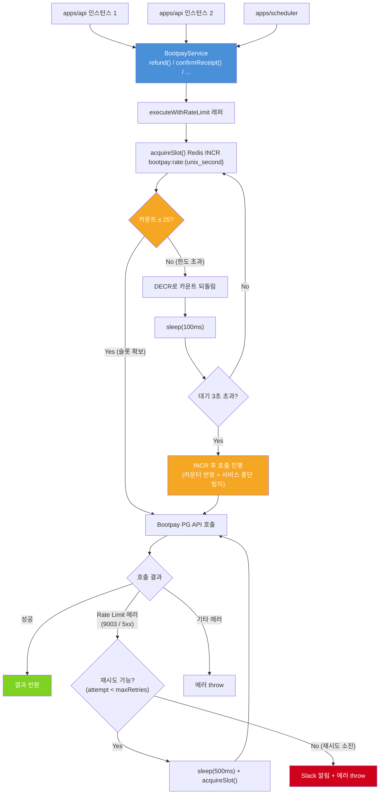

# PG사 API 호출 단일화 및 Rate Limit 관리 체계 구축 OnePager

분류: SRS
작성자: 김범진
최초 작성일: 2026년 4월 9일 오전 11:26
최근 수정일: 2026년 4월 13일 오후 4:34
문서 상태: Active
생성 일시: 2026년 4월 9일 오전 11:26
최종 편집자: 김범진
관련 이슈: https://munto.atlassian.net/browse/WEBB-1272

# Project Name

PG사 API 호출 단일화 및 Rate Limit 관리 체계 구축

## Date

2026-04-10

## Submitter Info

김범진 / Backend Team / [beomjin.kim@munto.kr](mailto:beomjin.kim@munto.kr)

관련 이슈: [WEBB-1272](https://munto.atlassian.net/browse/WEBB-1272)

---

## Project Description

현재 PG사 API 호출이 스케줄러, API 서비스, 관리자 서비스 등 15개 이상의 진입점에서 분산 호출되어 초당 처리 한도를 예측·제어할 수 없다. 이로 인해 환불이 실패하고 자동 복구 없이 수동 처리에 의존하는 구조적 취약점이 존재한다.

PG API 호출 경로를 중앙에서 통제하고 실패 시 자동 재시도 체계를 갖추어 결제/환불 안정성을 확보한다.

---

## Business and Marketing Justification

- **CS 비용 절감**: 2026년 기준 동일 원인(Rate Limit 초과)으로 10건 이상의 환불 실패 발생. 건당 CS 대응 및 수동 환불 처리 공수 발생 중
- **유저 신뢰도**: 스태프 환불 실패(WEBB-1268), 얼리버드 대량 환불 실패(WEBB-1132) 등 결제 오류는 서비스 신뢰도에 직접적 영향
- **운영 안정성**: 자동 재시도 로직 없이 스케줄러·API·어드민 등 여러 경로에서 PG 호출이 동시 발생하는 구조는 트래픽 증가 시 장애 빈도가 선형 증가
- **확장성**: 정기결제(클럽 멤버십), 얼리버드 부분 환불 등 배치성 호출이 늘어날수록 Rate Limit 초과 리스크 증가

---

## Risk Assessment

| 리스크 | 수준 | 대응 방안 |
| --- | --- | --- |
| Redis 장애 시 Rate Limiter 무력화 | 중간 | fallback으로 직접 호출 유지 (Rate Limit보다 서비스 중단이 더 치명적). Redis 클러스터 구성으로 가용성 확보 |
| 동기 호출에서 대기(sleep) 시 유저 응답 지연 | 낮음 | 동기 호출은 maxWaitMs 1초 + 재시도 1회로 최악 ~2초. 클라이언트 타임아웃(3초) 이내 응답 보장 |
| sliding window 카운터 정확도 (초 경계 race condition) | 낮음 | TTL 2초로 1초 여유 확보. 보수적 한도(25건/초)로 버퍼 있음 |
| 재시도 시 중복 환불(이중 환불) 발생 | 높음 | Bootpay `cancel_id` 멱등성 키 활용. 기존 얼리버드 패턴(`cancel_earlybird_retry_{historyId}`) 동일 적용 |
| 배치 환불 폭주 시 동기 호출도 같이 밀림 | 중간 | 스케줄러 배치 잡에 청크 패턴 적용하여 대역 독점 방지 (아래 "스케줄러 배치 청크 패턴" 참고) |
| 6개 배치 잡 수정 범위가 예상보다 클 경우 일정 초과 | 중간 | 핵심(Rate Limiter + 1~2개 배치 잡)만 우선 배포, 나머지 배치 잡은 후속 패치로 분리 |

---

## Resource and Scheduling Details

- **필요 인력**: Backend 1명
- **예상 일정**: 2026-04-14 ~ 2026-04-18 (~1주)
- **마일스톤**:
    - Day 1-2: Redis Rate Limiter 구현 (`acquireSlot`, `executeWithRateLimit` 래퍼), BootpayService 메서드에 래퍼 적용
    - Day 3-4: 인라인 재시도 로직 구현, 모니터링/Slack 알림 추가, 단위 테스트 작성
    - Day 5: 스테이징 검증 (멀티 인스턴스 환경에서 글로벌 카운터 동작 확인), 배포

---

## Technical Description

### 기술 스택

- NestJS (기존 모노레포 그대로)
- Redis — 기존 캐싱/세션용 Redis 인프라 재활용
- `BootpayService` (`libs/common/src/bootpay/bootpay.service.ts`) — 기존 PG 래퍼에 Rate Limiter 내장

### PG API 호출 지점 전수 조사 결과

### BootpayService PG API 메서드 (9개)

| 메서드 | PG API 유형 | PG 엔드포인트 |
| --- | --- | --- |
| `getAccessToken` | 토큰 발급 | `POST /request/token` |
| `getReceipt` | 영수증 조회 | `GET /receipt/:id` |
| `validateReceipt` | 영수증 검증 | 내부적으로 `getReceipt` 호출 |
| `confirmReceipt` | 결제 확정 | `POST /confirm` |
| `refund` | 환불/취소 | `POST /cancel` |
| `requestSubscribeCardPayment` | 정기결제 | `POST /subscribe/payment` |
| `getBillingKey` | 빌링키 조회 | `GET /subscribe/billing_key/:id` |
| `destroyBillingKey` | 빌링키 삭제 | `DELETE /subscribe/billing_key/:billingKey` |
| `certificate` | 본인인증 | `GET /certificate/:receipt_id` |

> `getAccessToken`은 이미 메모리 캐싱(25분 TTL)이 적용되어 있어 인스턴스당 시간당 최대 2~3회 수준이다. Rate Limit 카운팅에서 제외한다.
> 

### 호출 지점 전체 맵

### apps/api (유저 요청 → 즉시 응답 필요)

| 서비스 | 호출 메서드 | 컨텍스트 |
| --- | --- | --- |
| `order-base.v3.service` | validateReceipt, confirmReceipt, getReceipt | 결제 확정 플로우 (유저 대기) |
| `socialing-order.v3.service` | getReceipt | 웹훅 복구 API |
| `club-order.v3.service` | getBillingKey, requestSubscribeCardPayment, getReceipt | 클럽 빌링 결제 |
| `challenge-order.v3.service` | getReceipt | 웹훅 복구 |
| `order.admin.service` | getReceipt, refund, getAccessToken | 어드민 환불 |
| `course-enrollment.service` | getReceipt, refund | 코스 환불 |
| `socialing.v2.admin.service` | getReceipt, refund | 소셜링 어드민 환불 |
| `personal-authentication.service` | certificate | 본인인증 |
| `OrderCommonService` (v2 경유) | getReceipt, refund, getBillingKey, requestSubscribeCardPayment, destroyBillingKey | V2 주문 처리 |
| `EarlyBirdRefundService` (api 경유) | getReceipt, refund | 어드민 얼리버드 재시도 |

### apps/scheduler (배치 → 즉시 응답 불필요)

| 서비스 | 호출 메서드 | 컨텍스트 | 루프 패턴 | 건당 PG 호출 |
| --- | --- | --- | --- | --- |
| `paymentUpdateJob.service` — 유령 결제 | refund | 10분 Cron | `while` + `for` (50건 배치), **제어 없음** | 1회 |
| `paymentUpdateJob.service` — 미처리 주문 | refund | 10분 Cron | `while` + `for` (50건 배치), **제어 없음** | 1회 |
| `confirm-missed-payment` | getReceipt, refund | 10분 Cron | `while` + `for` (50건 배치), **제어 없음** | 2회 |
| `club-membership` | requestSubscribeCardPayment | 매일 Cron | 갱신 대상 순회, **제어 없음** | 1회 |
| `challenge.schedule-job` | getReceipt, refund | Cron | `for await` (멤버 전체), **제어 없음** | 2회 |
| `socialingUpdateJob` — 취소 환불 | getReceipt, refund | Cron | 멤버별 순차, **제어 없음** | 2회 |
| `EarlyBirdRefundService` | getReceipt, refund | Cron | **5건 병렬 + 300ms 대기 (자체 제어 있음)** | 2회 |

> **핵심 문제**: `EarlyBirdRefundService`를 제외한 모든 배치 잡이 PG API를 **쉬지 않고 연속 호출**한다. 50건 배치가 돌면 초당 30건 한도를 단일 잡에서 초과할 수 있으며, 이 경우 Redis Rate Limiter가 대기를 걸어도 **배치가 대역을 독점**하여 동기 호출(유저 결제 확정 등)이 밀리게 된다.
> 

### apps/lounge

- BootpayService 호출 **없음**

### 아키텍처 결정: Redis 글로벌 Rate Limiter (BootpayService 내장)

**핵심 아이디어**: `BootpayService` 내부에 Redis 기반 sliding window 카운터를 두고, **모든 PG API 호출 전에** 카운터를 확인. 한도 초과 시 짧은 대기 후 재확인.

| 안 | 설명 | 기각/채택 이유 |
| --- | --- | --- |
| A안 | BootpayService 내 인메모리 Rate Limiter | 기각 — API 서버·스케줄러 등 멀티 프로세스 환경에서 인스턴스별 카운트는 전체 합산 제어 불가 |
| B안 | Bull Queue 기반 중앙 큐 관리 | 기각 — 동기 호출(confirmReceipt, validateReceipt 등)은 큐에 넣을 수 없어 전체 합산 제어 불가. 15개+ 호출부 변경 필요하여 공수 과다 |
| **C안** | **Redis 글로벌 Rate Limiter (BootpayService 내장)** | **채택** — BootpayService만 수정하면 API 서버(2인스턴스) + 스케줄러 = 3프로세스 전체 호출이 단일 제어점에서 관리됨. 동기/비동기 통합 제어 가능. 기존 호출 코드 변경 없음 |
| D안 | 결제 마이크로서비스 분리 | 기각 — 현재 규모 대비 공수 과다, 트랜잭션 경계 분리 복잡도 높음 |

### 처리 흐름



### Redis Rate Limiter 설계

### Sliding Window Counter

```tsx
/**
 * Redis sliding window 기반 Rate Limiter
 *
 * PG사 초당 30건 한도 대비 5건 버퍼를 두고 초당 25건으로 제한.
 * 모든 BootpayService PG API 호출 전 이 메서드를 통해 한도를 확인한다.
 *
 * Redis INCR + TTL 조합으로 원자적 카운팅.
 * API 서버(2인스턴스) + 스케줄러 = 3프로세스가 동일 Redis를 참조하므로
 * 글로벌 합산 제어가 자동으로 보장된다.
 */

// Redis Key: "bootpay:rate:{unix_second}"
// TTL: 2초 (현재 초 + 1초 여유)

async acquireSlot(maxWaitMs = 3000): Promise<void> {
  const pollIntervalMs = 100;  // 100ms 간격 재확인
  const maxPerSecond = 25;     // PG 한도 30 대비 5건 버퍼
  const startTime = Date.now();

  while (Date.now() - startTime < maxWaitMs) {
    const key = `bootpay:rate:${Math.floor(Date.now() / 1000)}`;
    const count = await this.redis.incr(key);

    if (count === 1) {
      await this.redis.expire(key, 2);  // 첫 카운트 시 TTL 설정
    }

    if (count <= maxPerSecond) {
      return;  // 슬롯 확보 성공
    }

    // 한도 초과 — 카운트 되돌리고 대기
    await this.redis.decr(key);
    await sleep(pollIntervalMs);
  }

	// 최대 대기 초과 — 카운터에 반영하고 호출 진행
  // INCR을 실행해야 다른 프로세스가 이 호출의 존재를 인지하고, 동시 force proceed 시 부하가 분산된다.
  this.logger.warn('Rate limit wait timeout exceeded, proceeding anyway');
  const key = `bootpay:rate:${Math.floor(Date.now() / 1000)}`;
  await this.redis.incr(key);
}
```

### 적용 방식: 내부 래퍼 메서드

```tsx
/**
 * PG API 호출 래퍼
 *
 * Rate Limit 슬롯 확보 → API 호출 → 실패 시 재시도를 일괄 처리한다.
 * BootpayService의 모든 PG API 호출 메서드에서 이 래퍼를 사용한다.
 *
 * @param apiCall - 실행할 PG API 호출 함수
 * @param context - 로그용 컨텍스트 (메서드명, 파라미터 등)
 * @param options - 재시도 옵션
 * @returns API 호출 결과
 */
private async executeWithRateLimit<T>(
  apiCall: () => Promise<T>,
  context: string,
  options?: {
    retryable?: boolean;       // 재시도 가능 여부 (기본: true)
    maxRetries?: number;       // 최대 재시도 횟수 (기본: 2)
    retryDelayMs?: number;     // 재시도 간격 (기본: 500ms)
    maxWaitMs?: number;        // acquireSlot 최대 대기 시간 (기본: 3000ms)

  },
): Promise<T> {
  const { retryable = true, maxRetries = 2, retryDelayMs = 500, maxWaitMs = 3000 } = options ?? {};

  await this.acquireSlot(maxWaitMs);

  for (let attempt = 0; attempt <= (retryable ? maxRetries : 0); attempt++) {
    try {
      return await apiCall();
    } catch (error) {
if (this.isRetryableError(error) && retryable && attempt < maxRetries) {
        this.logger.warn(
          `PG API 에러, 재시도 ${attempt + 1}/${maxRetries}: ${context}`
        );
        await sleep(retryDelayMs);
        await this.acquireSlot(maxWaitMs);
        continue;
      }
      throw error;
    }
  }
}
```

### Redis 장애 시 Fallback

Redis 접근 불가 시 Rate Limiter를 우회하고 기존과 동일하게 직접 호출한다. Rate Limit보다 서비스 중단이 더 치명적이므로, Redis 장애 시에는 PG 한도 초과 리스크를 감수한다.

```tsx
async acquireSlot(): Promise<void> {
  try {
    // ... Redis 카운터 확인 로직
  } catch (redisError) {
    this.logger.error('Redis rate limiter unavailable, bypassing');
    return;  // Redis 장애 시 그냥 통과
  }
}
```

### 스케줄러 배치 청크 패턴

Redis Rate Limiter만으로는 배치 잡이 대역을 독점하는 것을 막을 수 없다. 50건 배치가 `for` 루프로 연속 호출되면, Rate Limiter가 초당 25건에서 대기를 걸더라도 **배치가 25건 예산을 모두 차지**하여 동기 호출(유저 결제 확정 등)이 밀린다.

이를 해결하기 위해 `EarlyBirdRefundService`에서 이미 검증된 **청크 + 딜레이 패턴**을 모든 배치 잡에 적용한다.

### 기존 검증된 패턴 (`EarlyBirdRefundService`)

```tsx
// libs/core/socialing-order/service/early-bird-refund.service.ts

/** Bootpay 부분환불 API 동시 호출 상한 */
private static readonly BOOTPAY_REFUND_CONCURRENCY = 5;
/** 청크 사이 대기 시간 — PG 부하 완화 */
private static readonly BOOTPAY_REFUND_CHUNK_DELAY_MS = 300;

private async runWithConcurrencyLimit(
  orders: SocialingOrder[],
  concurrency: number,
  handler: (order: SocialingOrder) => Promise<void>,
): Promise<void> {
  for (let i = 0; i < orders.length; i += concurrency) {
    const chunk = orders.slice(i, i + concurrency);
    await Promise.all(chunk.map((order) => handler(order)));
    if (i + concurrency < orders.length) {
      await this.delay(BOOTPAY_REFUND_CHUNK_DELAY_MS);
    }
  }
}
```

### 공통 유틸로 추출 및 적용

`EarlyBirdRefundService.runWithConcurrencyLimit`을 `libs/common/src/utilities/batch.util.ts`로 제네릭 유틸(`runInChunks<T>`)로 추출하고, 기존 `EarlyBirdRefundService` 포함 모든 배치 잡에서 공통으로 사용한다.

```tsx
// libs/common/src/utilities/batch.util.ts

/**
 * 배열을 청크 단위로 나눠 병렬 처리하되, 청크 간 딜레이를 둔다.
 * PG API Rate Limit 등 외부 API 호출 속도 제한이 필요한 배치 작업에 사용.
 *
 * @param items - 처리할 항목 배열
 * @param concurrency - 청크 크기 (한번에 병렬 처리할 최대 건수)
 * @param handler - 항목별 비동기 처리 함수
 * @param delayMs - 청크 간 대기 시간 (ms)
 */
export async function runInChunks<T>(
  items: T[],
  concurrency: number,
  handler: (item: T) => Promise<void>,
  delayMs: number,
): Promise<void> {
  for (let i = 0; i < items.length; i += concurrency) {
    const chunk = items.slice(i, i + concurrency);
    await Promise.all(chunk.map(handler));
    if (i + concurrency < items.length) {
      await new Promise((r) => setTimeout(r, delayMs));
    }
  }
}
```

적용 대상:

| 배치 잡 | 현재 패턴 | 변경 후 | 청크 크기 | 청크 간 대기 |
| --- | --- | --- | --- | --- |
| `paymentUpdateJob` — 유령 결제 환불 | `for await` 연속 | 청크 병렬 | 5건 | 300ms |
| `paymentUpdateJob` — 미처리 주문 환불 | `for` 연속 | 청크 병렬 | 5건 | 300ms |
| `confirm-missed-payment` | `for` 연속 | 청크 병렬 | 5건 | 300ms |
| `club-membership` 정기결제 | 순차 연속 | 청크 병렬 | 5건 | 300ms |
| `challenge.schedule-job` 환불 | `for await` 연속 | 청크 병렬 | 5건 | 300ms |
| `socialingUpdateJob` 취소 환불 | 멤버별 순차 연속 | 청크 병렬 | 5건 | 300ms |
| `EarlyBirdRefundService` | **이미 적용됨** | 변경 없음 | 5건 | 300ms |

> **청크 크기 5건 + 300ms 대기 근거**: 5건이 병렬로 PG API를 호출하면 순간 최대 5~10건(getReceipt+refund)이 발생한다. 300ms 대기 후 다음 청크를 처리하면 초당 약 15~20건 수준으로 유지되어, 동기 호출에 10~15건의 여유 대역을 확보할 수 있다.
> 

### Rate Limiter와 청크의 역할 분담

| 계층 | 역할 | 제어 대상 |
| --- | --- | --- |
| **Redis Rate Limiter** (BootpayService) | 글로벌 초당 호출 합산 제어 — 최후의 안전장치 | 모든 호출 (동기 + 비동기) |
| **청크 패턴** (스케줄러 배치 잡) | 배치 호출 속도 평탄화 — 대역 독점 방지 | 스케줄러 배치 호출만 |

두 계층이 병행되면:

1. 청크 패턴이 배치 호출을 **1차적으로 평탄화**하여 동기 호출에 여유 대역 확보
2. Redis Rate Limiter가 **2차 안전장치**로 전체 합산이 초당 25건을 넘지 않도록 보장
3. 만약 동기 호출까지 합쳐서 순간 초과가 발생하면, Rate Limiter의 대기 로직이 작동

### 재시도 대상 에러 판별 (`isRetryableError`)

재시도 여부는 에러 유형에 따라 결정한다. 네트워크 레벨 에러 중 일시적 장애와 영구적 장애를 구분한다.

| 에러 유형 | 재시도 | 이유 |
| --- | --- | --- |
| `RC_CANCEL_SERVER_ERROR` (에러코드 9003) | O | PG 서버 과부하, 재시도 시 복구 가능 |
| PG 서버 5xx (500, 502, 503) | O | 일시적 서버 장애 |
| HTTP 타임아웃 (ETIMEDOUT, ESOCKETTIMEDOUT) | O | PG 과부하 시 응답 지연, 재시도 의미 있음 |
| Connection refused (ECONNREFUSED) | X | PG 서버 다운, 재시도해도 동일 결과 |
| Connection reset (ECONNRESET) | X | 연결 강제 종료, 재시도 무의미 |
| DNS 실패 (ENOTFOUND) | X | 인프라 레벨 문제, 재시도 무의미 |
| Bootpay 비즈니스 에러 (400, `RC_NOT_FOUND` 등) | X | 요청 자체가 잘못됨, 재시도 불필요 |

### 호출 유형별 적용 재시도 및 대기 시간 차등 전략 (동기/비동기 차등)

클라이언트(모바일)는 결제 확정 API에 **3초 타임아웃**을 설정하고 있다 (`serverside_order_repository.dart`의 `_confirmReceiveTimeout = Duration(seconds: 3)`). 서버에서 3초 이상 걸리면 클라이언트가 먼저 타임아웃하므로, 동기 호출(유저 대기)의 서버 측 전체 소요 시간도 3초 이내로 제한해야 한다.

이를 위해 `executeWithRateLimit`의 `maxWaitMs`(acquireSlot 대기)와 `maxRetries`(재시도 횟수)를 호출 유형별로 차등 적용한다.

| PG 호출 유형 | 컨텍스트 | maxWaitMs | 재시도 | 최악 지연 | 근거 |
| --- | --- | --- | --- | --- | --- |
| `confirmReceipt` (결제 확정) | 동기 (유저 대기) | **1초** | **1회**, 500ms | ~2초 | 클라이언트 3초 타임아웃 내 응답 필요 |
| `validateReceipt` / `getReceipt` (검증/조회) | 동기 (유저 대기) | **1초** | **1회**, 500ms | ~2초 | 결제 플로우 내 |
| `getBillingKey` (빌링키 조회) | 동기 (유저 대기) | **1초** | **1회**, 500ms | ~2초 | 결제 플로우 내 |
| `certificate` (본인인증) | 동기 (유저 대기) | **1초** | **재시도 없음** | ~1초 | 멱등성 보장 불가 |
| `refund` (환불) | 비동기 (배치/어드민) | 3초 | 2회, 500ms | ~10초 | 배치 집중 발생, 멱등성 보장 (`cancel_id`) |
| `requestSubscribeCardPayment` (정기결제) | 비동기 (배치) | 3초 | 2회, 500ms | ~10초 | 스케줄러 배치 |
| `destroyBillingKey` (빌링키 삭제) | 비동기 (배치) | 3초 | 2회, 500ms | ~10초 | 즉시 응답 불필요 |
| `getAccessToken` (토큰 발급) | - | **제외** | 해당 없음 | - | 메모리 캐싱(25분 TTL)으로 인스턴스당 시간당 최대 2~3회 수준 |

### 주요 기술적 결정

| 항목 | 결정 | 근거 |
| --- | --- | --- |
| Rate Limit 한도 | 초당 최대 25건 | PG 한도 30건 대비 5건 버퍼 확보 |
| 대기 polling 간격 | 100ms | 슬롯 확보 응답 지연 최소화 |
| 최대 대기 시간 (비동기) | 3초 | 대기 초과 시 INCR 후 호출 진행 (서비스 중단보다 나음) |
| 최대 대기 시간 (동기) | 1초 | 클라이언트 타임아웃(3초) 내 응답 보장 |
| 재시도 횟수 (비동기) | 최대 2회 (초기 호출 포함 총 3회) | Rate Limit 순간 과부하 회복 대기 |
| 재시도 횟수 (동기) | 최대 1회 (초기 호출 포함 총 2회) | 전체 소요 시간 ~2초 이내 제한 |
| 재시도 간격 | fixed 500ms | 유저 대기 시간 최소화 |
| 재시도 대상 에러 | RC_CANCEL_SERVER_ERROR(9003), PG 서버 5xx, HTTP 타임아웃 | 일시적 PG 과부하 (네트워크 영구 장애 제외) |
| Force Proceed 시 | Redis INCR 후 호출 | 다른 프로세스에 부하 상황 전파, 동시 force proceed 시 부하 분산 |
| 멱등성 | Bootpay `cancel_id` 고유 키 (`cancel_retry_{id}`) | 이중 환불 방지. 기존 얼리버드 패턴 동일 적용 |
| 본인인증 | 재시도 없음 | 중복 인증 요청 방지 |
| Redis Key | `bootpay:rate:{unix_second}` / TTL 2초 | 초 단위 sliding window, 1초 여유 |
| Redis 장애 시 | fallback 직접 호출 | 서비스 가용성 우선 |

### 멱등성 보장

- **환불**: Bootpay `cancel_id` 고유 키 활용. 기존 얼리버드 패턴(`cancel_earlybird_retry_{historyId}`)과 동일하게 적용
- **정기결제**: `order_id` 기반 중복 방지 (Bootpay 자체 중복 처리)
- **빌링키 삭제**: 이미 삭제/만료된 빌링키는 400 에러 → 무시 처리 구현됨
- **본인인증**: 재시도 없음으로 멱등성 이슈 회피

### 모니터링 및 알림

| 항목 | 구현 |
| --- | --- |
| Rate Limit 대기 발생 | `logger.warn` — 대기 발생 빈도 추적 |
| Rate Limit 대기 초과 | `logger.warn` + **Slack 알림** — 3초 대기 후에도 슬롯 미확보 |
| 인라인 재시도 발생 | `logger.warn` — RC_CANCEL_SERVER_ERROR 재시도 기록 |
| 최종 실패 (재시도 소진) | `logger.error` + **Slack 알림** — 수동 처리 필요 건 즉시 알림 |
| Redis 카운터 현황 | 기존 Redis 모니터링 인프라로 `bootpay:rate:*` 키 추적 가능 |

### API / ERD

- **API 변경 없음**: 외부 노출 엔드포인트 그대로 유지. `BootpayService` 내부 구현만 변경
- **ERD 변경 없음**: 신규 테이블 추가 없음. Redis 키(`bootpay:rate:{unix_second}`) 추가만 해당

### 관련 이슈

- [WEBB-1272](https://munto.atlassian.net/browse/WEBB-1272) — 본 이슈
- [WEBB-1132](https://munto.atlassian.net/browse/WEBB-1132) — 얼리버드 부분 환불 대량 실패
- [WEBB-1268](https://munto.atlassian.net/browse/WEBB-1268) — 스태프 소셜링 취소 신청 실패

---

<aside>
🔁

## **변경 이력**

</aside>

| **버전** | **일자** | **변경자** | **변경 내용** |
| --- | --- | --- | --- |
| v1.0.0 | 26.04.09 | 김범진 | 최초 작성 |
| v2.0.0 | 26.04.13 | 김범진 | qull queue → redis 글로벌 rate limiter 방식 변경 |
| v2.0.1 | 26.04.13 | 김범진 |   • Force Proceed 시에도 INCR 적용
  • `isRetryableError` 매칭 에러 목록 명시
  • 재시도 횟수 및 대기 시간에 대해 동기/비동기 차등 전략 적용 |

---

<aside>
🧾

## **문서 작성 규칙**

</aside>

1. **항목마다 작성자/작성일을 명시**
2. **모든 변경은 ‘변경 이력’ 테이블에 기록**
3. **문서 버전은 Semantic Versioning(v1.0.0)을 따름**
4. **기여자는 실질적인 내용 추가/수정에 참여한 사람만 포함**
5. 변경 사항이 발생하거나 리뷰 요청이 필요한 문서의 경우, 관련 수정 내용을 변경 이력과 함께 명시하고, 해당 부분 끝에 버전을 표기하여 혼동을 방지한다. 
    - 변경 내용 `(v1.0.1)`