# VOD SRS

분류: SRS
작성자: 장창이
최초 작성일: 2025년 3월 24일 오후 4:39
최근 수정일: 2025년 8월 12일 오후 2:56
기여자: 장창이, 김범진, 남종호
문서 상태: Active
생성 일시: 2025년 3월 24일 오후 4:39
최종 편집자: 남종호

# **1** Introduction **(개요)**

## 1.1 Purpose (목표)

- 이 문서는 비디오 온디맨드(VOD) 플랫폼의 핵심 기능과 요구사항을 정의한 SRS(Software Requirements Specification) 문서입니다.
- 이 SRS는 VOD 플랫폼의 프론트엔드와 백엔드 전반에 대한 요구사항을 다룹니다.
- 이 문서는 개발자와 이해관계자가 시스템의 동작과 구조를 명확히 이해하는 데 목적이 있습니다.
- 이 분서는 기존 문토 서비스 위에 새롭게 구축되는 VOD 기능에 대한 요구사항을 중점적으로 정의합니다.

## 1.2 Product Scope (범위)

- 주요 기능으로 메인 화면(주간 인기 VOD 및 VOD 리스트), 강의 상세 페이지, 강의 개설(업로드) 흐름, 결제 및 할인 처리, 마이페이지, 영상 재생 및 다운로드 기능 등을 정의합니다.
- 또한 영상 업로드 및 인코딩 파이프라인에 대한 기술적 설명과 AWS 기반의 시스템 구조, 인프라 구성, 데이터 모델(ERD)을 포함합니다.
- VOD 플랫폼은 사용자가 온라인으로 강의를 업로드하고 시청하며, 결제를 통해 강의를 구매할 수 있는 시스템입니다.
- 기존 문토 서비스(사용자 관리, 결제, 리뷰, 정산 등)는 이미 운영 중이나 별도의 문서가 존재하지 않기 때문에, **요약 형태로만 정리하며 전체 문서화는 진행하지 않습니다.**
- 새로운 기능이 기존 기능을 확장하거나 영향을 주는 경우에는, 본 문서 내에서 해당 내용을 추가로 설명하거나 주석으로 명시합니다.

## 1.3 Document Conventions (문서규칙)

- **용어 및 표기 규칙 (Terminology and Notation)**
    - 기술 용어는 영어 원문으로 표기하고, 최초 등장 시 괄호 안에 한글 병기 (예: Middleware(미들웨어))
    - 약어는 최초 등장 시 전체 용어와 함께 표기 (예: Simple Object Access Protocol (SOAP))
- **우선순위 정의 (P1 ~ P3)**
    - **P1**: 프로젝트에 **반드시 포함되어야 하는 핵심 기능**
        - 프로젝트 목표 달성에 필수이며, 제외 시 릴리스 불가능
    - **P2**: **중요하지만 P1보다는 우선순위가 낮은 기능**
        - 프로젝트 일정 내 구현이 권장되며, 일정에 따라 조정 가능
    - **P3**: **추가되면 좋지만 필수는 아닌 기능**
        - 여유가 있을 때 구현하며, 추후 릴리스 대상이 될 수 있음

## 1.4 Terms and Abbreviations (정의 및 약어)

- **VOD(Video On Demand):** 사용자가 원하는 시점에 영상을 제공하는 서비스 형태. 여기서는 온라인 강의 영상 콘텐츠를 의미합니다.
- **인코딩(Encoding):** 업로드된 원본 영상을 스트리밍에 적합한 형식(HLS 등)으로 변환하는 과정으로, AWS Elemental MediaConvert 서비스를 활용합니다.
- HLS(**HTTP Live Streaming): 적응형 비트레이트 스트리밍 프로토콜**로, 네트워크 상태에 따라 비디오 품질을 동적으로 조정하여 원활한 재생을 지원합니다.

## 1.5 Related Documents (관련문서)

- [[VOD] Upload POC](https://www.notion.so/VOD-Upload-POC-1c2e2bc7639d80f18221ff5bf6145de1?pvs=21)
- [[VOD] Web/App POC](https://www.notion.so/VOD-Web-App-POC-1c3e2bc7639d80bba356e6fcfa077178?pvs=21)
- [[APP] VOD](https://www.notion.so/APP-VOD-1c0e2bc7639d8029a1e3da25a77cc35d?pvs=21)
- [Figma](https://www.figma.com/design/tugOmBy33jlLzwFCHQcniu/VOD?node-id=278-268344&p=f&t=ztqFASZNnLkSJQ1l-0)

## 1.6 Intended Audience and Reading Suggestions (대상 및 읽는 방법)

- **개발자**
    - 시스템의 구조, API, 데이터 흐름, 기능 요구사항 등을 **완벽히 이해하고 구현**할 수 있도록 작성되었다.
    - 전체 문서를 처음부터 끝까지 정독할 것을 권장한다.
- **디자이너**
    - 사용자 흐름(User Flow), UI 요소, 사용자 인터랙션, 화면 정의 등 **사용자 경험과 인터페이스와 관련된 부분**에 집중해 읽는다.
- **운영팀**
    - 서비스 운영 및 대응에 필요한 기능 흐름, 알림 조건, 관리자 기능 등에 대한 내용을 중심으로 **운영과 관련된 흐름을 파악**한다.

## 1.7 Project Output (프로젝트 산출물)

- Web 서비스이다.
    - Frontend Web, App 과 Backend로 구성된다.

### 1.7.1 Output Format (산출물 형태)

- Frontend Web, App 과 Backend

### 1.7.2 Output Name and Version (산출물명(가칭) 및 버전)

- Munto VOD

### 1.7.3 Patent Information (특허 출원 유무 및 내용)

- None

# 2. Overall Description (전체 설명)

## 2.1 Product Perspective (제품 조망)

- 주요 요소
    - 클라이언트 (Flutter App)
    - NextJS Web
    - NestJS REST API (유저, 호스트, 강의 목록, 상세, 결제, 업로드, 영상 재생)
    - PostgreSQL, Redis: 데이터 저장
    - AWS S3: 영상 저장
    - Lambda, AWS MediaConvert: 영상 인코딩 작업

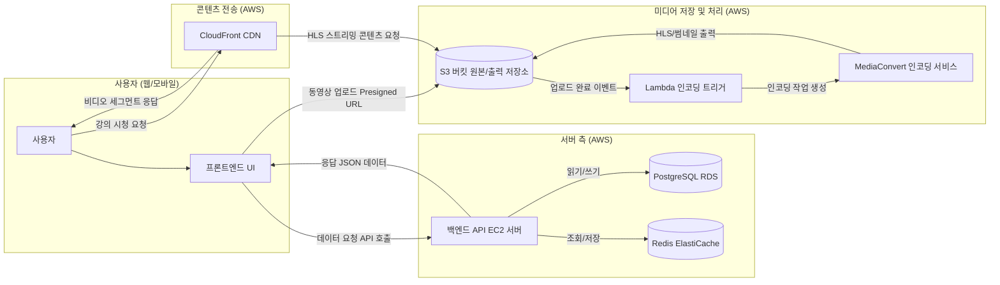

- *위 시스템 구조도는 사용자(UI)와 백엔드 서버(BE), 데이터베이스(DB), 캐시(Cache) 및 스토리지(S3), Lambda, MediaConvert, CloudFront 사이의 데이터 흐름을 보여줍니다.*
- *사용자 요청이 백엔드와 상호 작용하고, 영상 업로드/스트리밍이 S3와 MediaConvert, CloudFront를 통해 이루어지는 과정을 나타낸 것입니다.*

## 2.2 Overall System Configuration (전체 시스템 구성)

- 사용자 요청을 처리하는 서버, 미디어 저장/인코딩을 담당하는 비동기 처리 파이프라인, 사용자 인터페이스를 담당하는 프론트엔드/앱 등으로 구성된다.

### Nest.js Server **(Backend API Layer)**

- **NestJS 프레임워크**를 기반으로 구성된 백엔드 애플리케이션이다.
- 역할: 사용자 인증/인가, 강의/리뷰/결제/인증 관련 비즈니스 로직 처리, DB 및 외부 서비스와의 통신.

### **Lambda + MediaConvert (영상 인코딩 파이프라인)**

- **Lambda** 와 **AWS MediaConvert**를 활용한 비동기 영상 인코딩 파이프라인.
- 역할: S3에 업로드된 원본 영상 파일을 감지하고, 자동으로 인코딩 처리.
- 처리 흐름:
    1. 사용자가 Presigned URL로 S3에 영상 업로드 완료
    2. S3 이벤트 → Lambda 함수 트리거
    3. Lambda가 MediaConvert **Job 생성**
    4. MediaConvert가 인코딩 수행
    5. 인코딩 완료 시, 결과물(S3 저장) + 상태 업데이트 (DB 반영)
- 인코딩 상세:
    - 출력 포맷: **HLS (Multi-bitrate)** + 썸네일 자동 생성
    - 자막/MP4 다운로드 출력은 선택 옵션
    - Lambda에서 **JobTemplate** 및 인코딩 파라미터 정의 및 제어
- 추가 고려:
    - 작업 실패 시 Lambda에서 관리자 알림 또는 재시도 정책 실행 가능

### Frontend

- Next.js로 되어있는 문토 웹 페이지
- 역할: 강의 탐색, 상세 정보 조회, 구매/결제 처리, 영상 재생 등 사용자 중심의 UI 제공.
- 특징:
    - REST API 기반 데이터 요청
    - 영상 재생
    - **S3 Presigned URL 기반 직접 업로드 로직 내장**
    - 리뷰, 결제, 마이페이지 기능 내장

### Flutter APP

- **Flutter 기반 문토 앱(**Android / iOS) 지원
- 역할: 웹과 동일한 기능을 모바일 친화적으로 제공. 강의 탐색, 결제, 영상 스트리밍 기능 지원.
- 특징
    - 백엔드 API와 통신하여 웹과 동일한 기능 제공

## 2.3 Overall Operation (전체 동작방식)

본 프로젝트는 웹 기반 VOD 플랫폼으로, 다음과 같은 흐름으로 전체 시스템이 동작한다:

### **2.3.1 사용자 흐름**

### **2.3.1.1 강의 상세 조회 흐름**

- 유저나 비로그인 사용자 등이 강의 목록에서 특정 강의를 선택하여 상세 정보를 조회하는 흐름이다.
- 강의 상세 정보에는 강의 제목, 설명,호스트 정보, 가격, 리뷰, (구매자에 한해) 동영상 재생 링크 등이 포함될 수 있다. 아래 다이어그램은 클라이언트(웹/앱)와 서버 간의 상호 작용으로 강의 상세 정보를 가져오는 과정을 보여준다.

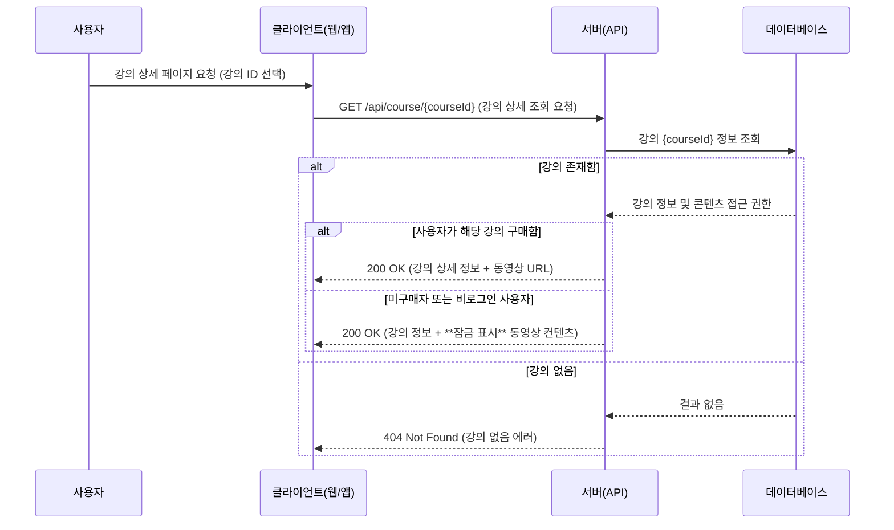

- **설명:** 사용자가 특정 강의의 상세 정보를 요청하면 클라이언트는 해당 강의 ID로 백엔드 API(GET /api/course/{courseId})를 호출한다.
- 서버는 데이터베이스에서 강의 정보를 조회하며, 요청한 강의가 존재하지 않을 경우 404 오류를 반환한다. 강의가 존재하면, 추가로 **사용자의 구매 이력**을 확인한다.
- **구매한 유저**의 경우: 강의 상세 정보와 함께 **동영상 재생에 필요한 정보(예: 스트리밍 URL 또는 재생 토큰)**를 포함하여 응답한다. 유저는 즉시 강의를 시청할 수 있다.
- **미구매자 또는 비로그인 사용자**의 경우: 강의 제목, 소개, 호스트명, 가격, 리뷰 요약 등 기본 정보는 제공되지만 **본 영상은 잠금 상태로 표시**된다. 응답에는 영상 URL 대신 “결제 필요” 등 상태를 표시하거나 영상 미리보기만 제공한다.

이를 통해 클라이언트는 구매 여부에 따라 UI상에 수강 버튼 또는 구매 유도 메시지를 표시하게 된다. 이후 사용자가 결제를 진행하면 수강 권한이 주어져 동영상을 시청할 수 있다 (결제 흐름은 다음 섹션 참조).

### **2.3.3.2 결제 흐름 (신청)**

- 유저가 유료 강의를 결제하여 수강 권한을 얻는 과정의 흐름이다.
- 결제 처리에는 내부 서버와 **부트페이(PG)**가 연동되며, 할인(일반, 얼리버드)  적용 및 결제 성공/실패에 따른 처리가 포함된다.
- 결제는 클라이언트에서 부트페이(PG) 통해서 진행하며, 결제가 성공하면 서버에 수강 신청 API를 호출한다.
    - 기존 서비스에도 클라이언트에서 결제를 진행하고 있어 통일성을 위해서 같은 방식으로 설계
- 아래 다이어그램은 결제 시나리오(성공 케이스 기준)를 나타내고, 실패 또는 예외 케이스는 이후 설명한다.

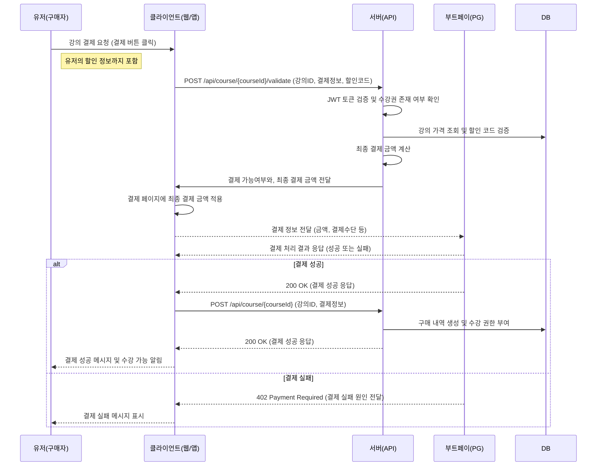

**설명**

- 유저가 강의를 결제하기 위해 UI에서 결제를 요청하면, 클라이언트는 결제 Validation API를 호출한다(POST /api/course/{courseId}/validate), 이때 결제 여부와, 최종 결제금액을 서버에서 확인해서 클라에 전달한다.
- 이 때 요청 데이터에는 **강의 ID**, **결제 수단 정보(예: 카드 정보 또는 PG 토큰)**, **할인 코드(선택사항)** 등이 포함된다. 서버 측 처리 순서는 다음과 같다:
    1. **인증 확인:** 서버는 Authorization 헤더의 JWT 토큰을 검사하여 유효한 로그인 상태인지 확인한다. 또한 해당 사용자가 이미 이 강의를 구매한 이력이 있는지도 확인하여, 중복 구매를 방지한다.
    2. **강의 가격 및 할인 계산:** 데이터베이스에서 강의의 기본 가격을 조회하고, 요청에 할인 코드가 포함된 경우 **할인 코드의 유효성**과 **할인율/할인액**을 검증한다. 유효하지 않은 할인 코드는 오류를 반환하며(예: 400 또는 404 코드), 유효한 경우 최종 결제 금액을 조정한다.
    3. **외부 결제 처리:** 클라이언트는 PG(예: 카드 결제 대행사)의 API를 호출하여 결제를 수행한다. 여기서는 간소화를 위해 동기 방식으로 표현했지만, 실제로는 PG 측 결제 페이지로 리디렉션하거나 PG SDK를 통해 토큰을 받아 처리하는 등의 흐름이 있을 수 있다. 어쨌든 클라이언트 PG로부터 성공/실패 결과를 수신한다.
- **결과 처리:**
    - 결제가 **성공**하면: 클라이언트는 결제 처리 후 API(POST /api/course/{courseId})를 호출
    - 서버는 데이터베이스에 해당 사용자-강의에 대한 **구매 내역(주문)**을 생성하고, 사용자의 **수강 권한**을 활성화한다. 응답으로 성공 상태와 메시지를 클라이언트에 전달한다. 클라이언트는 결제 완료 화면을 보여주고 수강을 시작할 수 있도록 안내한다.
    - 결제가 **실패**하면: 실패 원인에 따라 적절한 오류 코드를 반환한다. 예를 들어 한도가 초과되었거나 승인이 거절되면 402 Payment Required를 사용하고, 할인 코드 만료 등의 문제는 400 Bad Request로 처리할 수 있다. 클라이언트는 오류 메시지를 사용자에게 표시하고 재시도를 유도한다.

> 참고: 할인 정보는 사전에 호스트가가 생성해두며(관리 기능), POST  /api/course/{courseId}/validate 요청 시 서버가 이를 검증한다. 결제 API에서 할인 정보를 별도로 검증하지 않고 잘못된 코드를 보냈다면, 일반적으로 결제 실패(400 또는 402)로 간주한다.
> 

### **2.3.3.3 수강(동영상 시청) 흐름**

유저가 구매한 강의를 실제로 시청(스트리밍)하는 과정을 나타낸다. 수강 과정에서는 **인증된 사용자**가 **인가된 컨텐츠**에 접근하는 시나리오가 포함되며, 동영상 스트리밍 특성상 컨텐츠는 CDN에서 제공된다.

아래 다이어그램은 유저가 강의 시청 과정을 서버와의 상호작용 측면에서 표현한다.

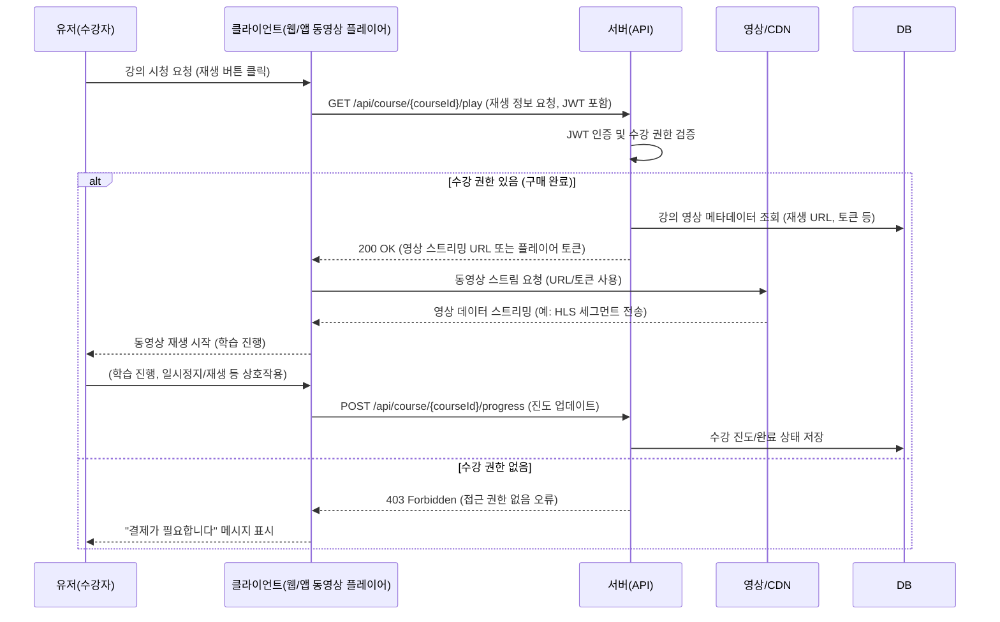

**설명**

- 유저가 강의를 결제한 후 **재생** 버튼을 누르면 동영상 플레이어를 통해 서버에 재생 요청을 보낸다 (GET /api/course/{courseId}/play).
- 이 요청에는 인증 토큰이 포함되며, 서버는 이를 통해 **누가 어떤 강의에 접근하려 하는지** 파악한다.
- 서버는 JWT 토큰을 검사하여 사용자 신원을 확인하고, 해당 강의에 대한 수강 권한(구매 여부)을 검증한다.
- 권한이 있을 경우, 데이터베이스에서 해당 강의 영상의 재생에 필요한 정보를 가져온다.
    - 여기에는 인코딩 단계에서 준비된 **동영상 스트림 URL**이 포함된다.
- 권한이 없는 사용자가 접근을 시도하면, 서버는 403 Forbidden 오류를 반환한다.
    - 클라이언트는 이를 받아 “결제가 필요합니다” 또는 “권한이 없습니다”라는 경고를 유저에게 표시한다.
    - 수강 권한이 없는 경우 재생을 진행하지 않는다.
- 수강 권한이 있는 경우, 클라이언트(내장된 플레이어)는 서버로부터 받은 정보로 실제 **영상 컨텐츠를 요청**한다.
    - 만약 서버가 바로 동영상 파일 URL을 반환했다면 클라이언트는 해당 URL로 스토리지/CDN에 접근하고 스트리밍을 시작한다.
- 유저가 시청을 진행하면서 일시정지, 재생, 시청 완료 등의 행동을 할 때, 선택적으로 **학습 진도**를 서버에 기록할 수 있다.
    - 위 다이어그램에서는 예시로 POST /api/course/{courseId}/progress 요청을 보여준다.
    - 이 API는 해당 강의에 대한 유저의 시청 완료율이나 완료 여부를 기록하기 위한 것이다. (이 기능은 선택사항이지만 마이페이지에 진도율 표시나 재시청 시 이어보기 등에 활용될 수 있다.)
- 유저가 강의를 모두 수강한 후에는 수강 완료 상태가 저장되고, 이후 **리뷰 작성** 등의 추가 행동이 가능해진다. (리뷰 작성 흐름은 별도로 자세히 다루지는 않았으나 API 명세에서 설명한다.)

### **2.3.3.4 수강평 작성 흐름**

- 유저가 강의를 수강 완료한 뒤, 해당 강의에 대한 수강평(리뷰)을 작성하는 흐름을 나타낸다.
- 수강평은 수강 완료 여부를 체크한 뒤 작성이 가능하며, 작성 후에는 강의 상세 페이지에 공개된다.
- 수강평에는 **별점(1~5점)**, **후기 내용**, **이미지**, **작성자 닉네임**이 포함된다.
    - 수강평은 **호스트에게만 보이기** 옵션을 선택할 수도 있다.
- 작성한 수강평은 수정/삭제가 가능하며, 관리자는 부적절한 리뷰를 숨김 처리할 수 있다.

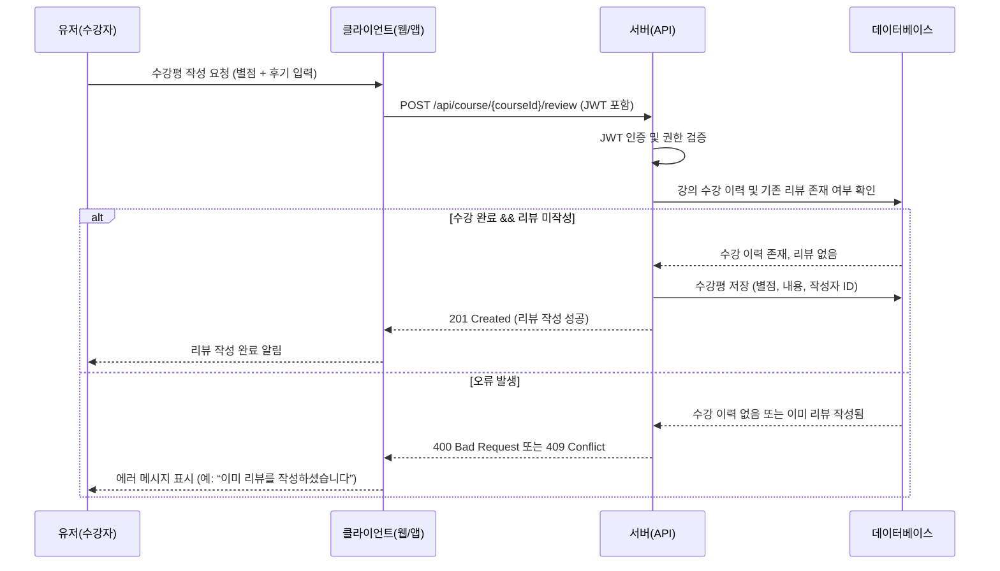

---

**설명**

1. 유저는 수강 완료 후 강의 상세 페이지 또는 마이페이지에서 수강평 작성 버튼을 클릭하여 별점 및 후기를 입력한다.
2. 클라이언트는 POST /api/course/{courseId}/review API를 호출하며, JWT를 포함하여 인증 정보를 함께 전송한다.
3. 서버는 JWT를 통해 사용자 인증을 수행한 뒤 다음 조건을 검증한다:
    - 사용자가 해당 강의를 **수강 완료했는지**
    - 해당 사용자 ID로 **이미 작성한 리뷰가 존재하는지**
4. 조건이 충족되면, 데이터베이스에 수강평을 저장한다.
    - 필드: courseId, userId, rating(별점), content(후기 내용), createdAt, updatedAt
5. 작성 완료 후, 클라이언트는 유저에게 작성 성공 메시지를 표시하고, 리뷰가 강의 상세 화면에 노출된다.
6. **예외 처리**:
    - 유저가 수강하지 않았거나, 이미 리뷰를 작성했을 경우 오류 메시지를 반환하고 작성 요청을 거부한다.

참고:

- 수강 완료 기준은 일정 이상(50% 이상 시청 또는 수강완료 버튼 클릭 여부)으로 정의할 수 있다.
- 작성된 리뷰는 리뷰 페이지에서 **수정/삭제 가능**

### **2.3.2 호스트 흐름**

### 2.3.2.1 호스트 신청 흐름

- 유저가 플랫폼에서 강의를 개설할 수 있는 **호스트 권한**을 얻기 위해 신청하는 흐름이다.
- **호스트 신청은 본인 인증을 완료한 사용자만 가능**하며, 인증되지 않은 사용자는 먼저 인증 절차를 거쳐야 한다.
- 신청 시, 유저는 다음 정보를 입력하여 제출한다:
    - **이름**
    - **자기소개**
    - **자기소개 링크**
    - **VOD 카테고리 선택 (소셜링 카테고리 사용)**
        - 연애 사랑, 파티, 여행 나들이, 동네또래 카테고리는 제외
- **강의 호스트 상태 관리**
    - 강의 호스트는 다음 상태를 가집니다: 대기중(PENDING), 승인됨(APPROVED), 거부됨(REJECTED)
    - 관리자는 강의 호스트 신청을 승인하거나 거부할 수 있습니다.

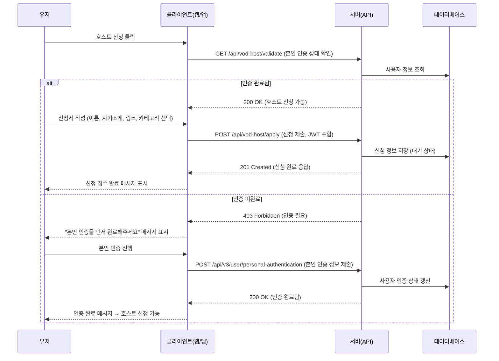

---

**설명**

1. 유저가 호스트 신청 버튼을 클릭하면, 서버는 우선 해당 유저의 **본인 인증 여부를 확인**한다.
2. 인증이 완료된 경우에만 호스트 신청 폼이 표시되며, 유저는 이름, 자기소개, 자기소개 링크(선택), VOD 카테고리를 입력하고 제출한다.
3. 서버는 이 정보를 데이터베이스에 저장하고 상태를 대기(PENDING)로 설정한다.
4. 신청이 접수되면 관리자가 이후 검토/승인 작업을 진행하게 된다 (→ **2.3.3.1 호스트 승인 흐름**에서 상세히 다룸).
5. 인증되지 않은 유저는 호스트 신청이 차단되며, 클라이언트는 본인 인증 유도 메시지를 표시한다.
6. 사용자가 인증 절차를 완료하면 다시 호스트 신청을 진행할 수 있다.

> 참고: 본인 인증은 휴대폰 기반 실명 인증 절차로 진행되며, 인증 후 해당 정보는 유저 프로필에 저장된다.
> 

### 2.3.2.2 **VOD 업로드 흐름 (개설)**

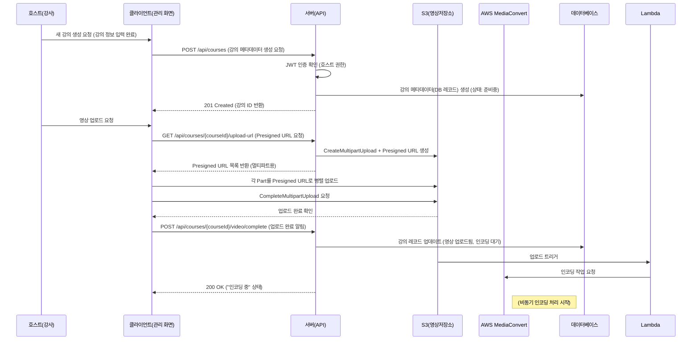

---

**설명 (Presigned URL 버전)**

1. 강사는 강의 생성 폼을 통해 강의 메타데이터를 입력하고 저장 요청을 보냅니다.
2. 서버는 권한을 검증하고 강의 레코드를 생성한 후, 고유 courseId를 클라이언트에 반환합니다.
3. 클라이언트는 영상 업로드를 위해 서버에 **multipart presigned URL**을 요청합니다. 서버는 AWS S3에 대해 CreateMultipartUpload를 실행하고 각 파트에 대한 presigned URL을 생성하여 클라이언트에 전달합니다.
4. 클라이언트는 각 파트를 해당 URL로 병렬 업로드하고, 완료되면 CompleteMultipartUpload를 호출하여 업로드를 마칩니다.
    1.  **대용량 영상 업로드 시 서버 부하를 최소화하기 위해** presigned URL 방식을 채택
    2. 보안 관련 우려 사항은 6.2 Security Requirements 섹션에 자세하게 정리
    3. S3업로드 위치는 [6.4.3 S3](https://www.notion.so/6-4-3-S3-1c9e2bc7639d80b18326c74bf5e5830d?pvs=21) 참고
5. 업로드가 완료되면 클라이언트는 서버에 업로드 완료를 알립니다.
6. 서버는 해당 정보를 DB에 기록합니다.
7. 업로드 트리거를 받은 Lambda는 AWS MediaConvert에 인코딩 작업을 요청합니다.
8. 클라이언트는 업로드가 성공적으로 완료되었고 영상이 인코딩 중임을 알 수 있습니다.

### 2.3.2.2 **영상 인코딩 흐름 (AWS MediaConvert 기반)**

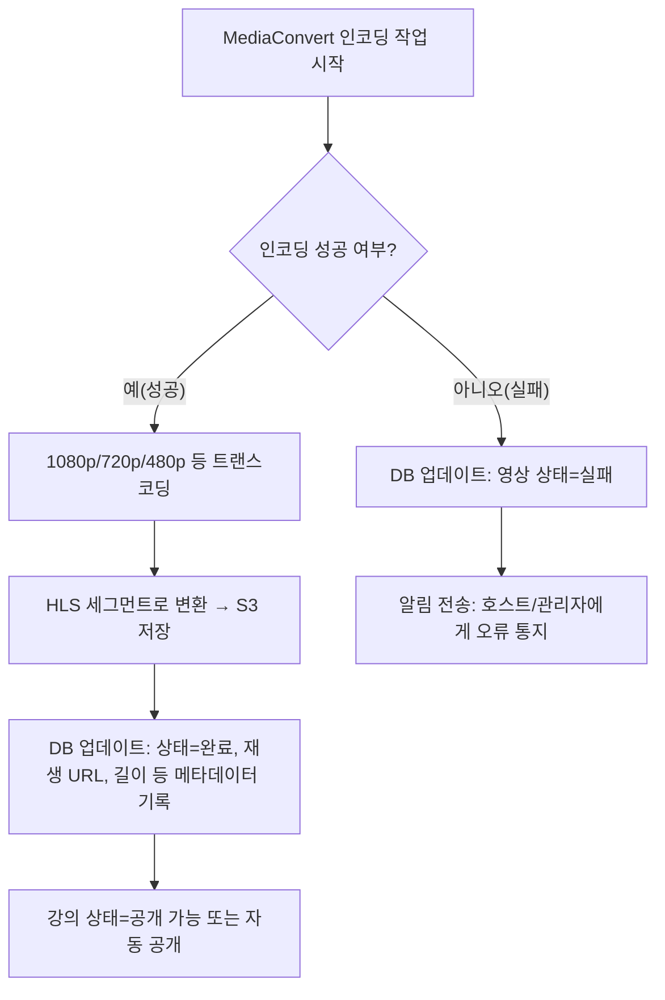

---

**설명 (MediaConvert 기반)**

- AWS MediaConvert는 S3 트리거에 따라 지정된 S3 위치에서 원본 영상을 읽고 인코딩 작업을 시작합니다.
- 인코딩 성공 여부를 확인합니다. 실패 시 오류 상태를 기록하고 관리자나 호스트에게 알립니다.
- 성공 시 다양한 해상도로 트랜스코딩하여 HLS 세그먼트 파일들을 생성한 후 S3에 저장합니다.
- 인코딩된 영상의 정보(스트리밍 URL, 재생시간, 썸네일 등)를 DB에 저장합니다.
- 강의 상태를 “공개 가능” 또는 자동으로 “공개”로 전환합니다.

### 2.3.2.3 할인 설정 흐름

강의 개설 시 강사는 해당 강의에 대해 **할인을 설정**할 수 있으며, 할인은 크게 두 가지 유형으로 구분된다:

•	**얼리버드 할인 (Early Bird)**: 강의 공개 초기 일정 기간 동안 한정적으로 적용되는 할인

•	**일반 할인**: 호스트가 자유롭게 설정 가능한 할인으로, 특정 기간으로 적용 가능

할인은 강의의 **판매 전략 및 마케팅 수단**으로 사용되며, 설정된 할인은 클라이언트 화면에서 **가격 정보와 함께 명확히 표시**된다.

---

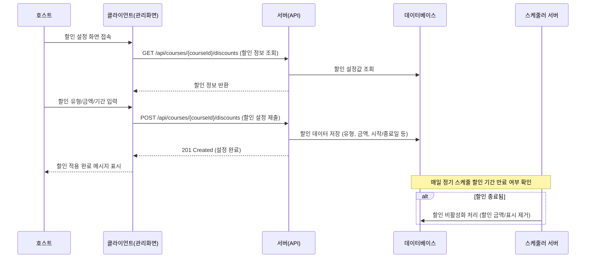

---

**설명**

1. 강의 생성 또는 수정 시, 호스트는 할인 설정 화면에서 할인 정보를 입력할 수 있다.
2. 할인 설정은 다음 항목을 포함한다:
    - **할인 유형**: 얼리버드 또는 일반 할인
    - 할인율을 선택한다.
    - **할인 시작일 / 종료일**
3. 클라이언트는 할인 정보를 POST /api/course/{courseId}/discounts API로 서버에 제출하고, 서버는 이를 DB에 저장한다.
4. 설정된 할인은 강의 상세 화면 및 결제 페이지에 자동으로 반영된다.
5. **할인 종료일이 지나면**, 서버는 정기적으로 할인 기간이 만료되었는지 체크하고, 자동으로 할인 상태를 비활성화한다.

### 2.3.2.4 정산 정보 등록, 수정 흐름

- 강사가 강의 수익에 대해 정산을 받기 위해서는 **정산 정보를 등록**해야 한다.
- 정산 정보는 **개인 또는 개인 사업자** 형태로 입력할 수 있으며, 제출된 정보는 정산시 내부 관리자에 의해 검토 및 승인된다.
    - 정산 정보는 **최초 1회 등록이 필수**이며, 추후 필요 시 수정 가능하다.
    - 수정 시에는 재검토 절차가 다시 진행된다.
    - 입력된 민감 정보(주민등록번호, 사업자등록번호 등)는 암호화되어 저장된다.

**정산 유형**

| **유형** | **설명** | **필수 항목** |
| --- | --- | --- |
| **개인** | 일반 사용자로 수익을 정산받는 경우 | 예금주명, 은행, 계좌번호, 주민등록번호, 이메일 |
| **개인 사업자** | 세금계산서 발행 가능한 개인사업자인 경우 | 예금주명, 은행, 계좌번호, 상호명, 대표명, 사업자등록번호, 사업자등록증 파일, 이메일 |

---

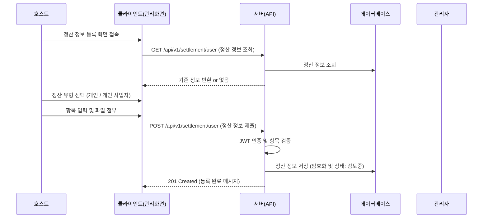

---

**설명**

1. 호스트가 정산 정보를 등록하기 위해 페이지에 접속하면 서버는 기존 등록된 정보가 있는지 확인한다.
2. 정산 유형(개인/개인 사업자)을 선택한 후, 각 유형에 따라 필요한 필드를 입력한다.
3. 개인 사업자 선택 시 사업자등록증 이미지 파일을 업로드해야 하며, 해당 파일은 S3에 저장된다.
4. 모든 항목 입력 후 클라이언트는 서버로 등록 요청을 전송한다 (POST /api/v1/settlement/user).
5. 서버는 JWT를 통해 인증된 사용자임을 확인한 뒤, 유효성 검사 후 정보를 암호화하여 DB에 저장한다. 
6. 관리자는 백오피스에서 정산 진행 시 제출된 정산 정보를 확인하고 정산을 수행한다.

**보안 및 검증 고려사항**

- 주민등록번호, 사업자번호 등 **민감 정보는 암호화 저장**
- 이미지 업로드 시 **S3 presigned URL 방식 사용** (유효시간 제한)

### **2.3.3 관리자 흐름**

- 사용자 및 호스트 계정을 관리하고, 강의 검수를 수행한다.
- 플랫폼 내 결제/통계/정산 내역을 열람 및 관리할 수 있다.

### 2.3.3.1 호스트 승인 흐름

- 일반 사용자가 호스트 신청을 완료한 이후, **관리자는 호스트 승인 여부를 검토**하고 처리한다.
- 검토 후 **승인된 사용자만 강의 개설 및 업로드 권한**을 얻게 된다.
- 승인 프로세스는 **관리자 페이지**를 통해 진행되며, 신청자의 **입력 정보, 제출 사유** 등을 기준으로 판단된다.

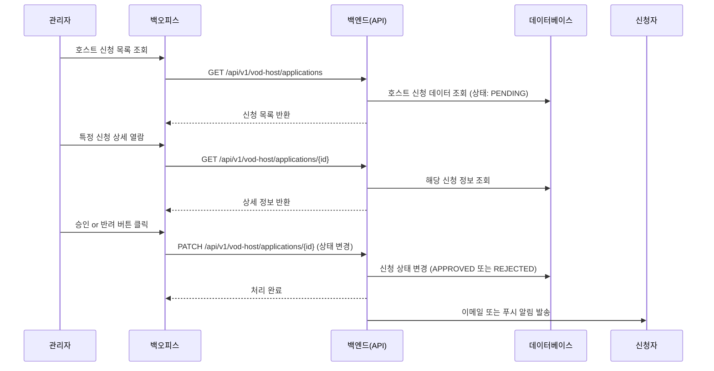

---

**설명**

- 관리자는 신청 목록을 조회하여 승인 대기 중인 유저 목록을 확인한다.
- 각 신청 건을 상세 열람하여, 본인 인증 여부, 이름, 자기소개, 링크, 선택한 VOD 카테고리 등을 검토한다.
- 승인 또는 반려 처리를 선택할 수 있으며, 반려 시 사유를 함께 기록할 수 있다.
- 처리 결과는 신청자에게 이메일 또는 알림을 통해 전달된다.
- 승인된 사용자는 이후 **강의 개설 및 업로드 권한을 부여** 받는다.

### 2.3.3.2 강의 승인 흐름

- 호스트가 강의를 개설하고 커리큘럼 및 영상을 업로드한 뒤, 관리자의 **강의 승인 절차**를 거쳐야 **사용자에게 공개**된다.
- 승인 전 강의는 **“심사 중” 또는 “비공개” 상태**로 분류되며, 검색이나 결제, 수강이 불가능하다.
- 관리자는 영상의 품질, 콘텐츠 적절성, 커리큘럼 구성 등을 기준으로 강의를 심사한다.

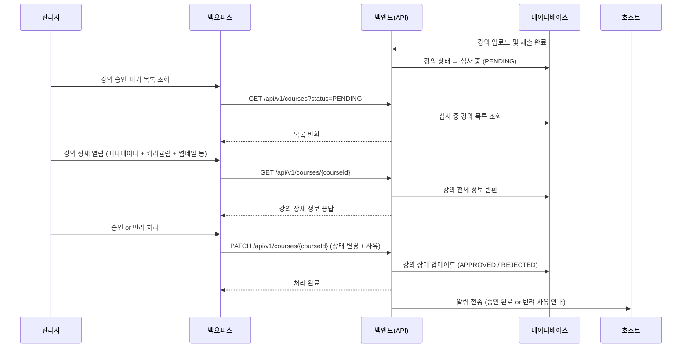

---

**설명**

- 강의가 업로드되면 서버는 자동으로 상태를 **심사 중(PENDING)** 으로 설정한다.
- 관리자는 관리자 콘솔에서 해당 강의의 상세 정보를 확인할 수 있으며, 썸네일, 커리큘럼, 영상 URL, 제목/설명 등을 기준으로 검토한다.
- 이상이 없을 경우 **승인(APPROVED)** 으로 설정되며, 해당 강의는 즉시 사용자에게 노출된다.
- 문제가 있는 경우 **반려(REJECTED)** 처리되며, 반려 사유를 입력하고 호스트에게 전달한다.
- 강의가 승인되기 전까지는 유저가 해당 강의를 검색, 조회하거나 구매할 수 없다.

### 2.3.4 **강의 및 강의 호스트 상태 관리 명세**

### **2.3.4.1 강의 상태 (CourseStatus)**

- DRAFT: 강의 정보가 완성되지 않은 임시저장 상태
    - 사용자만 볼 수 있음 언제든지 수정 가능
    - 시스템에 노출되지 않음
- REVIEWING: 강의 등록이 완료되어 관리자 심사 대기 상태
    - 사용자와 관리자만 볼 수 있음
    - 심사 중에는 수정 불가
    - 시스템에 노출되지 않음
- APPROVED: 관리자 심사가 완료되어 판매 가능한 상태
    - 판매 시작 전 상태
    - 사용자가 판매 시작 설정 가능
    - 시스템에 노출되지 않음
- ONSALE: 실제로 판매되고 있는 상태
    - 모든 사용자에게 공개됨
    - 구매 및 결제 가능
    - 시스템에 노출되고 검색 가능
- PAUSED: 일시적으로 판매가 중지된 상태
    - 기존 구매자만 접근 가능
    - 새로운 구매 불가
    - 검색에서 제외됨
- CLOSED: 완전히 판매가 종료된 상태
    - 기존 구매자만 콘텐츠 이용 가능
    - 새로운 구매 불가
    - 시스템에 노출되지 않음

**강의 상태 전환 규칙**

- DRAFT → REVIEWING: 사용자가 심사 요청 시
- REVIEWING → APPROVED: 관리자가 심사 승인 시
- REVIEWING → DRAFT: 관리자가 심사 반려 시
- APPROVED → ONSALE: 사용자가 판매 시작 설정 시
- ONSALE → PAUSED: 사용자가 일시 중지 요청 시
- PAUSED → ONSALE: 사용자가 판매 재개 요청 시
- PAUSED/ONSALE → CLOSED: 사용자가 판매 종료 요청 시

### **2.3.4.3 강의 호스트 상태**

- PENDING: 사용자가 강의 호스트 신청을 완료한 상태
    - 관리자의 승인 대기 중
    - 강의 개설 권한 없음
    - 신청 정보 수정 가능
- APPROVED: 관리자가 강의 호스트 신청을 승인한 상태
    - 강의 개설 권한 부여됨
    - 호스트 대시보드 접근 가능
    - 강의 생성 및 관리 가능
- REJECTED: 관리자가 강의 호스트 신청을 거절한 상태
    - 강의 개설 권한 없음
    - 재신청 가능
    - 거절 사유 확인 가능

**강의 호스트 상태 전환 규칙**

- PENDING → APPROVED: 관리자가 신청 승인 시
- PENDING → REJECTED: 관리자가 신청 거절 시
- REJECTED → PENDING: 사용자가 재신청 시

## **2.4 Product Functions (제품 주요 기능)**

시스템이 제공해야 할 핵심 기능은 다음과 같다 (세부 내용은 7장에서 기술됨):

- **사용자 관리**
    - 사용자 등록, 인증, 정보 수정, 권한에 따른 기능 제한
- **호스트관리**
    - 호스트 신청 및 인증, 프로필 관리
- **강의 관리**
    - 강의 생성/수정/삭제, 커리큘럼 구성, S3 영상 업로드 및 MediaConvert 인코딩
- **결제 시스템**
    - 강의 결제, 결제 내역 조회, 환불 처리, 정산 관리
- **수강 관리**
    - 수강중 강의 관리, 수강 완료 표시, 수강 진행률 확인
- **후기 및 리뷰 시스템**
    - 수강평 작성/조회, 기존 호스트 리뷰 분리
- **홈/탐색**
    - 주간 인기 VOD, 태그 기반 탐색, 정렬 필터링 기능
- **영상 재생 및 제어**
    - 미디어 플레이어, 일시정지/재생, 10초 앞뒤 이동, 전체화면, 재생속도 조절 등 지원
- **대시보드 및 마이페이지**
    - 내 강의, 내가 만든 강의, 결제 내역, 수강평 관리

## **2.5 User Classes and Characteristics (사용자 계층과 특징)**

| **사용자 유형** | **설명** | **주요 기능** |
| --- | --- | --- |
| **유저 (수강생)** | 강의를 탐색하고 결제 및 수강하는 사용자 | 강의 조회, 수강, 결제, 수강평 작성 |
| **호스트 (강사)** | 강의를 개설하고 수익을 창출하는 사용자 | 강의 생성/수정, 자료 업로드, 정산 확인 |
| **관리자** | 시스템 전반을 통제하고 관리하는 사용자 | 호스트 승인, 강의 승인, 결제 및 환불 처리, 정산 관리 |

## **2.6 Assumptions and Dependencies (가정과 종속 관계)**

- **네트워크 환경**: 사용자는 안정적인 인터넷 환경에서 접속해야 한다.
- **외부 결제 모듈**: 기존 서비스에서 이용하는 부트페이
- **AWS 인프라 종속성**:
    - S3: 영상 및 자료 업로드
    - MediaConvert: 비디오 인코딩
    - CloudFront: 영상 스트리밍
- **사용자 디바이스**: 영상 시청이 가능한 환경 (브라우저, 모바일) 필요
- **브라우저 호환성**: HTML5 기반 플레이어가 정상적으로 동작해야 함
- **법률 및 정책**: 개인정보 보호법(GDPR 등), 저작권법 등 준수 필수

## **2.7 Apportioning of Requirements (단계별 요구사항)**

| **단계** | **주요 기능** | **설명** |
| --- | --- | --- |
| **1단계**  | 사용자 등록/로그인, 강의 조회, 결제, 강의 시청
호스트 신청,  관리자 (승인, 거절),
VOD 개설(+ 인코딩), 각종 VOD 리스트 제공
수강평, 리뷰, 정산
할인 기능, | 사용자, 호스트, 관리자의 기본 기능(신청, 승인) |
| **2단계(Nice-to-Have)** | 소셜링 서비스와의 통합, 다국어, 정산 자동화 | 플랫폼 간 연계 및 고도화 |

---

## **2.8 Backward Compatibility (하위 호환성)**

- **API 버전 관리**
    - 모든 API 경로에 `/v1` 접두사를 사용하여 버전 관리
    - 향후 API 변경 시 하위 호환성을 유지하면서 `/v2`, `/v3` 등으로 버전 업그레이드 가능
    - 버전 관리 전략:
        - 기존 API에 영향을 주지 않는 작은 변경사항: 기존 버전 내에서 처리
        - 기존 API와 호환되지 않는 변경사항: 새로운 버전으로 릴리스
        - 이전 버전은 일정 기간(최소 6개월) 동안 지원하며 점진적으로 마이그레이션 유도
    - 클라이언트는 필요에 따라 적절한 API 버전을 선택하여 사용 가능
- **데이터베이스 마이그레이션**
    - 스키마 변경 시 이전 버전과의 호환성 유지
    - 마이그레이션 스크립트 제공
- **기존 호스트 리뷰 시스템**은 변경 없이 유지되며, 수강평 기능은 별도 관리된다.

# **3** Environment (환경)

## 3.1 Operating Environment (운영 환경)

### 3.1.1 Hardware Environment (하드웨어 환경)

- **Backend 서버 (NestJS API Server)**:
    - AWS EC2 T3.medium (2 vCPU, 4 GB RAM, x86_64, Amazon Linux 2)
- **Media 인코딩 및 처리**
    - AWS Elemental MediaConvert (Serverless 서비스 기반)
- **파일 저장소**
    - AWS S3 (Standard Storage Class)
- **데이터 전송 캐시 및 실시간 처리**
    - AWS ElastiCache for Redis (cache.t3.micro 이상)

### 3.1.2 Software Environment (소프트웨어 환경)

- **Backend**:
    - NestJS (Node.js 18)
    - Prisma (ORM)
    - Swagger (API 문서 자동화)
- **Database & Cache**:
    - PostgreSQL 12.16 (AWS RDS)
    - Redis 7.0.7 (AWS ElastiCache)
- **Frontend**:
    - Next.js
- **App**:
    - Flutter 3.29.2
    - Target: Android (API 29+), iOS (iOS 13+)
- **개발 도구:**
    - 버전 관리: Git 2.x+
    - 컨테이너화: Docker 24.x+, Docker Compose v2
    - IDE: VSCode 권장 (ESLint, Prettier 플러그인 필수)
- **CI/CD & 모니터링:**
    - CI/CD: GitHub Actions
    - 로그 수집: CloudWatch Logs
    - 모니터링:
        - CloudWatch 대시보드
- **보안:**
    - SSL/TLS: AWS Certificate Manager
    - 시크릿 관리: Parameter Store

## **3.2 Product Installation and Configuration (제품 설치 및 설정)**

### 3.2.1 Backend 설치 (ECS 기반)

- **사전 요구사항**
    - AWS 계정 및 필요한 IAM 권한
    - Docker 환경
    - GitHub 저장소 접근 권한
    - 환경 설정은 .env 및 AWS Parameter Store를 통해 구성
- **설치 개요**
    1. AWS 인프라 구성 (VPC, RDS, ECS 클러스터)
    2. 환경 변수 및 보안 설정
    3. 컨테이너 이미지 빌드 및 배포
    4. 모니터링 및 로깅 설정
- **AWS 구축 아키텍처 조망**

### 3.2.2 S3

- 호스트의 영상을 저장
- 인코딩된 영상을 저장
- 개발/프로덕션 환경별 S3 버킷 구성
    - munto-vod/production
    - munto-vod/developmentmunto-vod/

---

## **3.3 Distribution Environment (배포 환경)**

### **3.3.1 Master Configuration (마스터 구성)**

None(생략한다)

### **3.3.2 Distribution Method (배포 방법)**

- **Backend**:
    1. GitHub Actions를 통해 배포 자동화
        - `production` 브랜치 Push
        - Docker Build & Push
        - ECS 배포
    2. 배포 모니터링
        - CloudWatch를 통한 배포 상태 확인
    3. API 버전 관리
        - 모든 API 경로에 `/v1` 접두사 사용
        - 새로운 API 버전 배포 시 기존 버전과 병행 운영
        - 클라이언트 애플리케이션의 점진적 마이그레이션 지원
        - 버전별 사용량 모니터링 및 지원 종료 계획 수립
- **모바일 앱**:
    - 내부 테스트: TestFlight 사용
    - 외부 배포: Google Play Store, Apple App Store 등록
- **문서 및 설치 가이드**:
    - Notion에서 접근 가능

---

### **3.3.3 Patch/Update Method (패치와 업데이트 방법)**

- **패치 배포 프로세스**
    1. 긴급 버그 수정
        - Hotfix 브랜치에서 수정 작업
        - 테스트 환경 검증 후 development 브랜치에 병합
        - production 브랜치에 병합
        - GitHub Actions를 통한 자동 배포
    2. 일반 업데이트
        - development 브랜치에서 기능 개발
        - QA 환경에서 테스트 완료 후 production 브랜치 병합
        - 정기 배포 일정에 맞춰 배포
- **데이터베이스 마이그레이션**
    - Prisma 마이그레이션 스크립트 사용
    - 무중단 마이그레이션 지원 (backward compatible)
    - 롤백 스크립트 필수 작성
- **업데이트 알림**
    - slack 알림_앱업데이트 채널에 업데이트 공지
    - 사용자에게 시스템 업데이트 공지
    - 주요 변경사항 및 개선사항 안내
    - 필요시 사용자 매뉴얼 업데이트

## 3.4 Development Environment (개발 환경)

### 3.4.1 Hardware Environment (하드웨어 환경)

None(생략)

### 3.4.2 Software Environment (소프트웨어 환경)

- Frontend
    - **Framework**
        - **Next.js** (v15.1.2)
            - React 기반의 서버사이드 렌더링(SSR) 및 정적 사이트 생성(SSG)을 지원하는 프레임워크.
            - SEO 최적화 및 빠른 페이지 로딩 속도 제공.
        - **React** (v18.3.1)
            - 컴포넌트 기반 UI 라이브러리.
        - **TypeScript** (v5.2.2)
            - 정적 타입 검사 및 향상된 개발자 경험 제공.
    - **UI Framework**
        - **Material-UI (MUI)** (v6.4.3)
            - React 기반의 UI 컴포넌트 라이브러리.
            - 커스터마이징 가능한 테마 시스템과 풍부한 컴포넌트 제공.
        - **SCSS (Sass)** (v1.85.0)
            - 스타일링을 위한 CSS 전처리기.
    - **State Management**
        - **React Query** (@tanstack/react-query v5.66.0)
            - 서버 상태 관리 및 데이터 페칭을 위한 라이브러리.
            - 캐싱, 동기화, 백그라운드 업데이트 지원.
    - **HTTP Client**
        - **Axios** (v1.7.8)
            - Promise 기반의 HTTP 클라이언트.
            - API 요청 및 응답 처리를 간편하게 구현.
    - **브라우저 지원**
        - Chrome/Edge/Safari/Firefox 최신 버전.
        - 최소 2개 메이저 버전 이전까지 지원.
- App
    - **Framework**
        - 
    - **State Management**
        - 
    - **Routing**
        - 
    - **Networking**
        - 
    - **Build & Configuration**
        - 
    - **Localization**
        - 
    - **브라우저 지원**
        
        
- Backend
    - Node.js (NestJS) 기반 REST API 서버
    - 데이터 캐시를 위해 Redis 활용
    - yarn 패키지 매니저 사용
- Database
    - PostgreSQL
        - 서비스 전반적인 데이터
    - Redis
        - 데이터 캐시
        - 유저 정보 캐시
- 영상
    - 저장: S3
    - 인코딩: AWS MediaConvert
- **소스코드 관리**: GitHub
- **개발 환경**:
    - **필수 도구 및 소프트웨어**:
        - Node.js 18+ 및 yarn 패키지 매니저
        - Docker Desktop (개발 환경 컨테이너화)
        - Git (버전 관리)
        - PostgreSQL 클라이언트 (libpq) - 마이그레이션 실행용
        - Redis 클라이언트 (redis-cli) - 데이터베이스 관리용
            - 또는 RedisInsight (GUI 도구)
    - **권장 개발 도구**:
        - VS Code 또는 WebStorm (IDE)
        - Postico 또는 pgAdmin (PostgreSQL GUI 도구)
        - RedisInsight (Redis GUI 도구)
        - Postman 또는 Insomnia (API 테스트)
        - Docker Desktop (컨테이너 관리)
    - **개발 환경 구성 방식**:
        - Docker 컨테이너 기반 개발 환경 (권장)
        - 필요시 로컬 설치 가능
- **운영 환경**:
    - AWS ECS, Load Balancer
    - RDS(PostgreSQL)
    - Redis (AWS ElastiCache)
    - AWS S3
    - AWS MediaConvert

## 3.5 Test Environment (테스트 환경)

### 3.5.1 Hardware Environment (하드웨어 환경)

### 3.5.2 Software Environment (소프트웨어 환경)

## 3.6 Configuration Management (형상관리)

### 3.6.1 Location of Outputs (산출물 위치)

- Backend
    - [Munto_monorepo Repository](https://github.com/Munto-dev/munto_monorepo)
- Web
    - [Munto_web Repository](https://github.com/Munto-dev/munto_web)
- App
    - [Munto_app Repository](https://github.com/Munto-dev/munto_app)

### 3.6.2 Build Environment (빌드 환경)

- **CI/CD 플랫폼**: GitHub Actions 사용
- **빌드 파이프라인**:
    1. **Backend (Node.js)**
        - Node.js 18.x 환경에서 빌드
        - yarn install로 의존성 설치
        - Docker 이미지 빌드 및 ECR 푸시
        - ECS 서비스 업데이트
    2. **Frontend (React)**
        - Node.js 18.x 환경에서 빌드
        - yarn install --frozen-lockfile로 의존성 설치
        - yarn build:prod 프로덕션 빌드
        - AWS ECR 푸시
        - ECS 서비스 업데이트
    3. **Mobile App (Flutter)**
        - TBD
- **빌드 트리거**:
    - production 브랜치 푸시/PR 병합 시 자동 실행
- **환경 변수 관리**:
    - AWS Parameter store에서 관리
    - AWS 인증 정보
    - 배포 환경별 설정 값

## 3.7 Bugtrack System (버그트래킹)

- [Jira](https://www.figma.com/design/tugOmBy33jlLzwFCHQcniu/VOD?node-id=278-268344&p=f&t=ztqFASZNnLkSJQ1l-0)사용

## 3.8 Other Environment (기타 환경)

None

# 4 External Interface Requirements (외부 인터페이스 요구사항)

## 4.1 System Interfaces **(**시스템 인터페이스**)**

### **4.1.1 API 표준화**

- **HTTP 상태 코드 표준화**
    - 201: 리소스 생성 성공
    - 200: 조회/수정 성공
    - 204: 삭제 성공
    - 400: 잘못된 요청
    - 401: 인증 실패
    - 403: 권한 없음
    - 404: 리소스 없음
    - 409: 충돌 (중복 데이터 등)
- **응답 메시지 표준화**
    - 성공 응답: “~가 성공적으로 생성/수정/삭제됨”
    - 실패 응답: “~를 찾을 수 없음”, “~할 권한이 없음” 등
- **API 버전 관리**
    - 모든 API 경로에 `/v1` 접두사를 사용 (예: `/v1/vod`, `/v1/socialing`)
    - 향후 API 변경 시 하위 호환성을 유지하면서 `/v2`, `/v3` 등으로 버전 업그레이드 가능
    - 버전 관리 전략:
        - 기존 API에 영향을 주지 않는 작은 변경사항: 기존 버전 내에서 처리
        - 기존 API와 호환되지 않는 변경사항: 새로운 버전으로 릴리스
        - 이전 버전은 일정 기간(최소 6개월) 동안 지원하며 점진적으로 마이그레이션 유도
    - 클라이언트는 필요에 따라 적절한 API 버전을 선택하여 사용 가능

### **4.1.2 API 공통 기능**

- **인증 및 권한 처리 (Authentication & Authorization)**
    - **JWT 토큰 기반 인증**
        - 모든 인증이 필요한 API는 Authorization: Bearer <token> 헤더를 통해 토큰 검증
    - **Role-Based Access Control**
        - 엔드포인트마다 접근 가능한 권한 (ADMIN / HOST / STUDENT 등)을 명시하고, 역할 기반으로 제어
- **페이지네이션 (Pagination)**
    - 모든 목록 조회는 페이지네이션을 지원한다.
    - 공통 파라미터:
        - `offset` : 조회할 페이지 번호 (0부터 시작, 기본값: 0)
        - `limit` : 페이지당 항목 수 (기본값: 10)
        - `sort` : 정렬 기준 (기본값: 리스트별 기본 필드)
    - 응답 형식:
        
        ```json
        {
          "hasMore": true,
          "totalCount": 0,
          "items": []
        }
        
        ```
        

### **4.1.3 API 명세 (Swagger)**

- API 명세
- [Swagger](https://devapi.munto.kr/)

**4.1.3.1 강의 호스트 등록 API**

- **엔드포인트**: POST /v1/course-host
- **인증**: 필수
- **요청 본문**:

```json
{
"name": "string", // 강의 호스트 이름 (2-20자)
"introduction": "string", // 강의 호스트 소개 (최대 300자)
"url": "string", // 강의 호스트 소개 링크
"tagOrder": "string" // 강의 호스트 카테고리
}
```

- **응답**:

```json
{
"courseHostId": number // 생성된 강의 호스트 ID
}
```

## 4.2 User Interface **(**사용자 인터페이스)

- [Figma](https://www.figma.com/design/tugOmBy33jlLzwFCHQcniu/VOD?node-id=278-268344&t=z7jVhHq5RFcBmetW-1)
- 웹 기반 프론트엔드는 React.js 기반으로 구성되며, 다음과 같은 주요 UI를 제공한다. ([Figma](https://www.figma.com/design/tugOmBy33jlLzwFCHQcniu/VOD?node-id=276-214126&t=ExgFbJKXeJu0QESm-1))
    - **홈 화면**: 인기 VOD/강의, 추천 콘텐츠 리스트 제공
    - **강의 상세 페이지**: 소개, 커리큘럼, 리뷰, 할인 정보 표시
    - **영상 플레이어 화면**: 로그인 여부 및 수강 상태에 따라 접근 제어, 시청 시간/진도 표시
    - **마이페이지**: 수강 내역, 리뷰 작성, 프로필 설정
    - **결제 화면**: 강의 등록 및 할인 적용 확인 후 결제 진행
    - **호스트 신청 페이지**
    - **강의 개설 및 영상 업로드 페이지 (호스트 전용)**
- 모든 페이지는 모바일 반응형 UI를 지원한다.

## 4.3 Hardware Interface (하드웨어 인터페이스**)**

- 해당 서비스는 클라우드 환경(AWS)에서 동작하며, 별도의 로컬 하드웨어와 직접 통신하지 않음.
- None

## 4.4 Software Interface **(**소프트웨어 인터페이스)

- 시스템은 다음과 같은 외부 또는 내부 소프트웨어와 통합됨:
    - **AWS MediaConvert**
        - 기능: 영상 인코딩
        - 방식: Lambda 트리거를 통해 Job 생성
        - 입력: S3 original 파일 경로
        - 출력: S3 encoded 경로
    - **AWS S3**
        - 기능: 영상 파일 저장소
        - 업로드: presigned URL 방식으로 클라이언트 직접 업로드
        - 접근: CloudFront를 통한 스트리밍 또는 내부 서버 접근
    - **결제 서비스 모듈 (PG사 연동)**
        - 기능: 강의 결제 및 결제 결과 조회
    - **백오피스 (관리자 도구)**
        - 역할:
            - 호스트(강사) 신청 확인 / 승인
            - 강의 상태/영상 업로드 모니터링
            - 리뷰 관리, 정산 확인 등

## 4.5 Communication Interface **(**통신 인터페이스**)**

- 모든 클라이언트-서버 간 통신은 HTTPS를 통한 RESTful API로 수행됨
- 주요 통신 방식:
    - **프론트엔드 ↔ 백엔드 API**
    - 인증: JWT
    - 인증 헤더: Authorization: Bearer <token>
    - 응답 포맷: JSON
- **백엔드 ↔ AWS 서비스**
    - AWS SDK (S3 등)를 사용한 내부 통신

## **4.6** Other Interface (기타 인터페이스**)**

- **관리자 알림 시스템**
    - 인코딩 실패, 영상 업로드 실패 시 Slack으로 관리자 알림 전송
- **모니터링/로깅**
    - CloudWatch Logs를 통해 시스템 및 API 모니터링

# **5** Performance requirements (성능 요구사항**)**

## 5.1 Throughput (작업처리량)

- DAU 2~3만 수준의 사용자 처리

## 5.2 Concurrent Session (동시 세션)

None

## 5.3 Response Time (대응시간)

- 대부분의 API는 1초이내 처리, 최대 10초 이하 처리 목표

## 5.4 Performance Dependency (성능 종속 관계)

None

## 5.5 Other Performance Requirements (기타 성능 요구사항**)**

- CDN을 통한 콘텐츠 전송
    - *VOD 영상 재생은 CloudFront를 활용해 사용자 지역에 따라 최적의 전송 속도 보장*

# 6 Non-Functional Requirements (기능 이외의 요구사항**)**

## 6.1 Safety requirements (안전성 요구사항)

- 영상 데이터 손상 방지 및 보호
    - 업로드 영상은 원본, 인코딩 영상 둘다 S3에 보관
- 이중 결제 방지
    - 부트페이의 웹훅을 받아서 이미 결제 처리된 주문일 경우 자동으로 결제를 취소
- 결제 정보 유실을 방지
    - 부트페이의 웹훅을 받아 생성된 주문이 없다면 슬랙으로 알림을 전송하고 관리자 확인을 요청

## 6.2 Security Requirements (보안 요구사항**)**

### 6.2.1 **Presigned URL 기반 업로드의 보안 고려 및 설계 의도**

- Presigned URL을 통한 업로드는 업로드 성능과 서버 확장성, 그리고 일정 수준의 보안을 고려하여 결정되었으며, 위와 같은 보완책을 병행함으로써 **실질적 보안 위협을 최소화**하는 데 집중하였습니다.
- **보안 우려**
    - S3 Presigned URL은 서버 측 인증을 우회하여 클라이언트가 직접 영상 파일을 업로드할 수 있도록 하는 방식으로, URL이 유출될 경우 **권한이 없는 사용자도 업로드할 수 있는 보안 위협**이 존재한다.
    - 특히 presigned URL은 일정 시간 동안 유효하기 때문에, 유출 시 **지속적인 외부 공격의 진입점이 될 수 있음**.
- **설계 의도**
    - **대용량 영상 업로드 시 서버 부하를 최소화하기 위해** presigned URL 방식을 채택하였다.
    - 업로드 요청 및 URL 발급 자체는 **JWT 기반 인증이 필요한 API를 통해서만 수행 가능**하므로, 악의적인 외부인이 직접 URL을 얻는 것은 구조적으로 불가능함.
    - 각 URL은 다음 조건으로 생성된다:
        - 유효기간: 5분 이내
        - 제한된 Content-Length
        - Multipart upload의 경우 part 번호와 uploadId가 일치해야만 완료 가능
- **보완 설계**
    1. **URL 유효기간을 짧게 제한 (예: 5분)**
    2. **업로드 완료 시점 서버 측에서 JWT를 다시 검증**하고, 강의 작성자와 업로드자 정보가 일치하는지 확인
    3. **업로드된 파일의 Content-Type 및 크기 유효성 검사**
    4. 백오피스에서 영상 심사를 통해서 한번 더 검사

## 6.3 Software System Attributes (소프트웨어 시스템 특성)

### 6.3.1 Availability (가용성)

- 24/7 사용 가능해야 한다.

### 6.3.2 Maintainability (유지보수성)

- 유지 보수를 위해 문토에서 가장 익숙한 기술 사용
    - Nestjs, Nextjs, Flutter
- NestJS의 Swagger 자동 생성 기능 활용
    - 코드의 데코레이터를 통해 API 문서 자동 생성
    - TypeScript 타입 정보를 활용한 DTO/엔티티 스키마 자동 추출
    - API 변경 시 문서 동기화 자동화로 유지보수성 향상
- 데이터베이스 스키마 관리
    - Prisma 마이그레이션을 통한 스키마 버전관리

### 6.3.3 Portability (이식성)

- Docker 컨테이너 기반으로 구현되어, AWS 이외에 On-Premise 환경이나 GCP, Azure 등에서도 이식 가능
- 클라이언트(React 웹)는 브라우저 호환성(Chrome/Edge/Safari/Firefox) 유지

### 6.3.4 Reliability (신뢰성)

- 로그/에러/매트릭은 CloudWatch 모니터링으로 분석
- 영상 인코딩 실패 시 재시도 및 관리자 알림 시스템 구성
- 주기적 백업 스냅샷
- 고가용성 및 데이터 복구를 위한 AWS ElastiCache for Redis와 RDS(PostgreSQL) 사용

### 6.3.5 Remaining Attributes (나머지 특성)

- **Scalability (확장성)**:
    - 영상 수 증가 시 MediaConvert 병렬 처리
- **Usability (사용성):**
    - 모바일 환경 지원 (반응형 UI)

## 6.4 Logical Database Requirements (데이터베이스 요구사항)

### 6.4.1 데이터베이스 아키텍처

본 시스템은 PostgreSQL(RDB)과 Redis를 함께 사용하는 데이터베이스 아키텍처를 채택한다.

### **데이터베이스 선택 기준**

- **PostgreSQL(RDB) 적용 영역**
    - 기존 문토 서비스에 VOD 서비스를 추가
    - VOD 관련 데이터들, 리뷰 관련 데이터 저장 및 관리
- **Redis 적용 영역**
    - VOD 관련 리스트, 데이터 캐싱

### **아키텍처 채택 이유**

- 유지 보수와 빠른 개발을 위해 기존 시스템에서 사용하는 아키텍처를 그대로 사용한다.

### 데이터 동기화 전략

- VOD 관련 데이터는 PostgreSQL에 저장하고, 캐싱 데이터는 Redis에 저장
- 주기적으로 리스트에 필요한 캐시 데이터는 스케줄러 서버에서 Redis에 저장

### 6.4.2 ERD

- Prisma Schema (기존 데이터는 생략)

```tsx

model SocialingCategory {
  id          Int      @id @default(autoincrement())
  name        String
  description String
  image       String
  color       String
  cover       String?
  tagOrder    String?
  priority    Int      @default(0)
  course      Course[]
}

model OrderHistory {
  id        Int       @id @default(autoincrement())
  createdAt DateTime  @default(now()) @db.Timestamptz(3)
  updatedAt DateTime  @updatedAt @db.Timestamptz(3)
  deletedAt DateTime? @db.Timestamptz(3)
  orderId   Int
  data      Json?
  Order     Order     @relation(fields: [orderId], references: [id])

  @@index([orderId])
  @@index([createdAt])
}

model Payment {
  id     Int     @id @default(autoincrement())
  userId Int
  User   User    @relation(fields: [userId], references: [id])
  Order  Order[]
}

model Order {
  id               Int               @id @default(autoincrement())
  createdAt        DateTime          @default(now()) @db.Timestamptz(3)
  updatedAt        DateTime          @updatedAt @db.Timestamptz(3)
  deletedAt        DateTime?         @db.Timestamptz(3)
  cancelledAt      DateTime?         @db.Timestamptz(3)
  memo             String?
  userId           Int
  paymentId        Int?
  Payment          Payment?          @relation(fields: [paymentId], references: [id])
  User             User              @relation(fields: [userId], references: [id])
  OrderHistory     OrderHistory[]
  courseEnrollment CourseEnrollment?
}

model User {
  id                    Int                   @id @default(autoincrement())
  givenCourseReviews    CourseReview[]        @relation("Reviewer")
  receivedCourseReviews CourseReview[]        @relation("Reviewee")
  courseReviewSummary   CourseReviewSummary?
  courseReviewComment   CourseReviewComment[]
  courseEnrollment      CourseEnrollment[]
  userLectureProgress   UserLectureProgress[]
  courseHost            CourseHost[]
  Payment               Payment[]
  Order                 Order[]
}

model DiscountPolicy {
  id         Int       @id @default(autoincrement())
  createdAt  DateTime  @default(now()) @db.Timestamptz(3)
  updatedAt  DateTime  @updatedAt @db.Timestamptz(3)
  deletedAt  DateTime? @db.Timestamptz(3)
  discountId Int       @unique()
  discount   Discount  @relation(fields: [discountId], references: [id])
  startDate  DateTime? @db.Timestamptz(3) // 할인 시작
  endDate    DateTime? @db.Timestamptz(3) // 할인 종료
  // discountPolicyKind (할인정책유형)
  // application 수준의 enum
  // 0: 퍼센트 / 1: 구체적금액 / etc..
  kind       Int       @default(0)
  value      Int       @default(0)
}

model Discount {
  id                          Int                           @id @default(autoincrement())
  createdAt                   DateTime                      @default(now()) @db.Timestamptz(3)
  updatedAt                   DateTime                      @updatedAt @db.Timestamptz(3)
  deletedAt                   DateTime?                     @db.Timestamptz(3)
  amount                      Int                           @default(0)
  discountTypeId              Int
  discountType                DiscountType                  @relation(fields: [discountTypeId], references: [id])
  discountPolicy              DiscountPolicy?
  discountAndCourse           DiscountAndCourse?
  discountAndCourseEnrollment DiscountAndCourseEnrollment[]
}

model DiscountType {
  id       Int        @id @default(autoincrement())
  name     String
  discount Discount[]
}

model CourseHost { 
  id           Int       @id @default(autoincrement())
  createdAt    DateTime  @default(now()) @db.Timestamptz(3)
  updatedAt    DateTime  @updatedAt @db.Timestamptz(3)
  deletedAt    DateTime? @db.Timestamptz(3)
  name         String //본인 이름
  introduction String? //본인 소개
  url          String? // 자기소개 링크
  tagOrder     String // 카테고리
  userId       Int
  user         User      @relation(fields: [userId], references: [id])
  courseId     Int
  course       Course    @relation(fields: [courseId], references: [id])
}

enum CourseDifficulty {
  EASY
  MEDIUM
  HARD
}

model Course {
  id                Int                 @id @default(autoincrement())
  createdAt         DateTime            @default(now()) @db.Timestamptz(3)
  updatedAt         DateTime            @updatedAt @db.Timestamptz(3)
  deletedAt         DateTime?           @db.Timestamptz(3)
  title             String // 제목
  cover             String // 커버 이미지
  introduction      String // 소개
  difficulty        CourseDifficulty // 난이도
  categoryId        Int
  category          SocialingCategory   @relation(fields: [categoryId], references: [id])
  tagOrder          String? // 태그
  availableDays     Int // 수강가능 기간 (일)
  price             Int // 수강료 (부가세 미포함
  priceForUser      Int // 유저에게 노출되는 금액
  description       String // 상세 설명
  courseReview      CourseReview[]
  courseEnrollment  CourseEnrollment[]
  discountAndCourse DiscountAndCourse[]
  section           Section[]
  courseHost        CourseHost[]
}

model CourseReview {
  id                    Int                   @id @default(autoincrement())
  createdAt             DateTime              @default(now()) @db.Timestamptz(3)
  updatedAt             DateTime              @updatedAt @db.Timestamptz(3)
  deletedAt             DateTime?             @db.Timestamptz(3)
  images                String?
  content               String
  memo                  String?
  score                 Int
  reviewerId            Int
  revieweeId            Int
  courseId              Int?
  course                Course?               @relation(fields: [courseId], references: [id])
  reviewer              User                  @relation("Reviewer", fields: [reviewerId], references: [id])
  reviewee              User                  @relation("Reviewee", fields: [revieweeId], references: [id])
  comments              CourseReviewComment[]
  courseReviewSummary   CourseReviewSummary?  @relation(fields: [courseReviewSummaryId], references: [id])
  courseReviewSummaryId Int?

  @@unique([reviewerId, courseId], name: "CourseReview_reviewerId_courseId_unique_constraint")
  @@index([reviewerId])
  @@index([revieweeId])
  @@index([courseId])
}

model CourseReviewSummary {
  id                   Int            @id @default(autoincrement())
  createdAt            DateTime       @default(now()) @db.Timestamptz(3)
  updatedAt            DateTime       @updatedAt @db.Timestamptz(3)
  receivedAverageScore Float          @default(0)
  receivedTotalCount   Int            @default(0)
  receivedTotalScore   Int            @default(0)
  givenAverageScore    Float          @default(0)
  givenTotalCount      Int            @default(0)
  givenTotalScore      Int            @default(0)
  oneStarCount         Int            @default(0)
  twoStarCount         Int            @default(0)
  threeStarCount       Int            @default(0)
  fourStarCount        Int            @default(0)
  fiveStarCount        Int            @default(0)
  courseReviews        CourseReview[]
  userId               Int            @unique
  user                 User           @relation(fields: [userId], references: [id])
}

model CourseReviewComment {
  id             Int          @id @default(autoincrement())
  createdAt      DateTime     @default(now()) @db.Timestamptz(3)
  updatedAt      DateTime     @updatedAt @db.Timestamptz(3)
  deletedAt      DateTime?    @db.Timestamptz(3)
  comment        String
  userId         Int
  user           User         @relation(fields: [userId], references: [id])
  courseReviewId Int
  courseReview   CourseReview @relation(fields: [courseReviewId], references: [id])
  // courseReviewCommentReports Report[]

  @@index([courseReviewId])
  @@index([userId])
}

model Section {
  id        Int       @id @default(autoincrement())
  courseId  Int
  title     String // 섹션(파트) 제목
  order     Int // 섹션 순서
  createdAt DateTime  @default(now())
  updatedAt DateTime  @updatedAt
  course    Course    @relation(fields: [courseId], references: [id])
  lectures  Lecture[]
}

model Lecture {
  id         Int                   @id @default(autoincrement())
  sectionId  Int
  title      String // vod 제목
  content    String // 세부 내용
  videoUrl   String // 영상 링크
  videoTitle String // 영상 제목
  order      Int // 영상 순서
  duration   Int // 영상 시간
  createdAt  DateTime              @default(now())
  updatedAt  DateTime              @updatedAt
  section    Section               @relation(fields: [sectionId], references: [id])
  resources  Resource[]
  progresses UserLectureProgress[]
}

enum ResourceType {
  PDF
  IMAGE
}

model Resource {
  id        Int          @id @default(autoincrement())
  lectureId Int
  url       String?
  type      ResourceType
  createdAt DateTime     @default(now())
  lecture   Lecture      @relation(fields: [lectureId], references: [id])
}

model UserLectureProgress {
  id           Int      @id @default(autoincrement())
  userId       Int
  lectureId    Int
  progressRate Float // 0.0 to 1.0 진행도
  lastAccessed DateTime // 마지막 접속 시간
  progressTime Int // 진행 시간
  createdAt    DateTime @default(now())
  updatedAt    DateTime @updatedAt
  user         User     @relation(fields: [userId], references: [id])
  lecture      Lecture  @relation(fields: [lectureId], references: [id])

  @@unique([userId, lectureId])
}

enum CourseEnrollmentStatus {
  REQUEST
  APPROVE
  REJECT
  CANCEL
  DELETE
}

model CourseEnrollment {
  id                          Int                           @id @default(autoincrement())
  createdAt                   DateTime                      @default(now()) @db.Timestamptz(3)
  updatedAt                   DateTime                      @updatedAt @db.Timestamptz(3)
  deletedAt                   DateTime?                     @db.Timestamptz(3)
  canceledAt                  DateTime?                     @db.Timestamptz(3)
  cancelReason                String?
  status                      CourseEnrollmentStatus
  recruitAnswer               String?
  userId                      Int
  user                        User                          @relation(fields: [userId], references: [id])
  courseId                    Int
  course                      Course                        @relation(fields: [courseId], references: [id])
  orderId                     Int                           @unique
  order                       Order                         @relation(fields: [orderId], references: [id])
  discountAndCourseEnrollment DiscountAndCourseEnrollment[]

  @@unique([courseId, userId], name: "CourseEnrollment_userId_courseId_unique_constraint")
  @@index([courseId, status])
  @@index([status, updatedAt])
}

model DiscountAndCourse {
  id         Int      @id @default(autoincrement())
  createdAt  DateTime @default(now()) @db.Timestamptz(3)
  courseId   Int
  course     Course   @relation(fields: [courseId], references: [id])
  discountId Int      @unique()
  discount   Discount @relation(fields: [discountId], references: [id])

  @@unique([courseId, discountId])
}

model DiscountAndCourseEnrollment {
  id                 Int              @id @default(autoincrement())
  createdAt          DateTime         @default(now()) @db.Timestamptz(3)
  updatedAt          DateTime         @updatedAt @db.Timestamptz(3)
  deletedAt          DateTime?        @db.Timestamptz(3)
  discountId         Int
  courseEnrollmentId Int
  discount           Discount         @relation(fields: [discountId], references: [id])
  courseEnrollment   CourseEnrollment @relation(fields: [courseEnrollmentId], references: [id])

  @@unique([courseEnrollmentId, discountId])
}

```

- DBML

```tsx
//// ------------------------------------------------------
//// THIS FILE WAS AUTOMATICALLY GENERATED (DO NOT MODIFY)
//// ------------------------------------------------------

Table SocialingCategory {
  id Int [pk, increment]
  name String [not null]
  description String [not null]
  image String [not null]
  color String [not null]
  cover String
  tagOrder String
  priority Int [not null, default: 0]
  course Course [not null]
}

Table OrderHistory {
  id Int [pk, increment]
  createdAt DateTime [default: `now()`, not null]
  updatedAt DateTime [not null]
  deletedAt DateTime
  orderId Int [not null]
  data Json
  Order Order [not null]
}

Table Payment {
  id Int [pk, increment]
  userId Int [not null]
  User User [not null]
  Order Order [not null]
}

Table Order {
  id Int [pk, increment]
  createdAt DateTime [default: `now()`, not null]
  updatedAt DateTime [not null]
  deletedAt DateTime
  cancelledAt DateTime
  memo String
  userId Int [not null]
  paymentId Int
  Payment Payment
  User User [not null]
  OrderHistory OrderHistory [not null]
  courseEnrollment CourseEnrollment
}

Table User {
  id Int [pk, increment]
  givenCourseReviews CourseReview [not null]
  receivedCourseReviews CourseReview [not null]
  courseReviewSummary CourseReviewSummary
  courseReviewComment CourseReviewComment [not null]
  courseEnrollment CourseEnrollment [not null]
  userLectureProgress UserLectureProgress [not null]
  courseHost CourseHost [not null]
  Payment Payment [not null]
  Order Order [not null]
}

Table DiscountPolicy {
  id Int [pk, increment]
  createdAt DateTime [default: `now()`, not null]
  updatedAt DateTime [not null]
  deletedAt DateTime
  discountId Int [unique, not null]
  discount Discount [not null]
  startDate DateTime
  endDate DateTime
  kind Int [not null, default: 0]
  value Int [not null, default: 0]
}

Table Discount {
  id Int [pk, increment]
  createdAt DateTime [default: `now()`, not null]
  updatedAt DateTime [not null]
  deletedAt DateTime
  amount Int [not null, default: 0]
  discountTypeId Int [not null]
  discountType DiscountType [not null]
  discountPolicy DiscountPolicy
  discountAndCourse DiscountAndCourse
  discountAndCourseEnrollment DiscountAndCourseEnrollment [not null]
}

Table DiscountType {
  id Int [pk, increment]
  name String [not null]
  discount Discount [not null]
}

Table CourseHost {
  id Int [pk, increment]
  createdAt DateTime [default: `now()`, not null]
  updatedAt DateTime [not null]
  deletedAt DateTime
  name String [not null]
  introduction String
  url String
  tagOrder String [not null]
  userId Int [not null]
  user User [not null]
  courseId Int [not null]
  course Course [not null]
}

Table Course {
  id Int [pk, increment]
  createdAt DateTime [default: `now()`, not null]
  updatedAt DateTime [not null]
  deletedAt DateTime
  title String [not null]
  cover String [not null]
  introduction String [not null]
  difficulty CourseDifficulty [not null]
  categoryId Int [not null]
  category SocialingCategory [not null]
  tagOrder String
  availableDays Int [not null]
  price Int [not null]
  priceForUser Int [not null]
  description String [not null]
  courseReview CourseReview [not null]
  courseEnrollment CourseEnrollment [not null]
  discountAndCourse DiscountAndCourse [not null]
  section Section [not null]
  courseHost CourseHost [not null]
}

Table CourseReview {
  id Int [pk, increment]
  createdAt DateTime [default: `now()`, not null]
  updatedAt DateTime [not null]
  deletedAt DateTime
  images String
  content String [not null]
  memo String
  score Int [not null]
  reviewerId Int [not null]
  revieweeId Int [not null]
  courseId Int
  course Course
  reviewer User [not null]
  reviewee User [not null]
  comments CourseReviewComment [not null]
  courseReviewSummary CourseReviewSummary
  courseReviewSummaryId Int

  indexes {
    (reviewerId, courseId) [unique]
  }
}

Table CourseReviewSummary {
  id Int [pk, increment]
  createdAt DateTime [default: `now()`, not null]
  updatedAt DateTime [not null]
  receivedAverageScore Float [not null, default: 0]
  receivedTotalCount Int [not null, default: 0]
  receivedTotalScore Int [not null, default: 0]
  givenAverageScore Float [not null, default: 0]
  givenTotalCount Int [not null, default: 0]
  givenTotalScore Int [not null, default: 0]
  oneStarCount Int [not null, default: 0]
  twoStarCount Int [not null, default: 0]
  threeStarCount Int [not null, default: 0]
  fourStarCount Int [not null, default: 0]
  fiveStarCount Int [not null, default: 0]
  courseReviews CourseReview [not null]
  userId Int [unique, not null]
  user User [not null]
}

Table CourseReviewComment {
  id Int [pk, increment]
  createdAt DateTime [default: `now()`, not null]
  updatedAt DateTime [not null]
  deletedAt DateTime
  comment String [not null]
  userId Int [not null]
  user User [not null]
  courseReviewId Int [not null]
  courseReview CourseReview [not null]
}

Table Section {
  id Int [pk, increment]
  courseId Int [not null]
  title String [not null]
  order Int [not null]
  createdAt DateTime [default: `now()`, not null]
  updatedAt DateTime [not null]
  course Course [not null]
  lectures Lecture [not null]
}

Table Lecture {
  id Int [pk, increment]
  sectionId Int [not null]
  title String [not null]
  content String [not null]
  videoUrl String [not null]
  videoTitle String [not null]
  order Int [not null]
  duration Int [not null]
  createdAt DateTime [default: `now()`, not null]
  updatedAt DateTime [not null]
  section Section [not null]
  resources Resource [not null]
  progresses UserLectureProgress [not null]
}

Table Resource {
  id Int [pk, increment]
  lectureId Int [not null]
  url String
  type ResourceType [not null]
  createdAt DateTime [default: `now()`, not null]
  lecture Lecture [not null]
}

Table UserLectureProgress {
  id Int [pk, increment]
  userId Int [not null]
  lectureId Int [not null]
  progressRate Float [not null]
  lastAccessed DateTime [not null]
  progressTime Int [not null]
  createdAt DateTime [default: `now()`, not null]
  updatedAt DateTime [not null]
  user User [not null]
  lecture Lecture [not null]

  indexes {
    (userId, lectureId) [unique]
  }
}

Table CourseEnrollment {
  id Int [pk, increment]
  createdAt DateTime [default: `now()`, not null]
  updatedAt DateTime [not null]
  deletedAt DateTime
  canceledAt DateTime
  cancelReason String
  status CourseEnrollmentStatus [not null]
  recruitAnswer String
  userId Int [not null]
  user User [not null]
  courseId Int [not null]
  course Course [not null]
  orderId Int [unique, not null]
  order Order [not null]
  discountAndCourseEnrollment DiscountAndCourseEnrollment [not null]

  indexes {
    (courseId, userId) [unique]
  }
}

Table DiscountAndCourse {
  id Int [pk, increment]
  createdAt DateTime [default: `now()`, not null]
  courseId Int [not null]
  course Course [not null]
  discountId Int [unique, not null]
  discount Discount [not null]

  indexes {
    (courseId, discountId) [unique]
  }
}

Table DiscountAndCourseEnrollment {
  id Int [pk, increment]
  createdAt DateTime [default: `now()`, not null]
  updatedAt DateTime [not null]
  deletedAt DateTime
  discountId Int [not null]
  courseEnrollmentId Int [not null]
  discount Discount [not null]
  courseEnrollment CourseEnrollment [not null]

  indexes {
    (courseEnrollmentId, discountId) [unique]
  }
}

Enum CourseDifficulty {
  EASY
  MEDIUM
  HARD
}

Enum ResourceType {
  PDF
  IMAGE
}

Enum CourseEnrollmentStatus {
  REQUEST
  APPROVE
  REJECT
  CANCEL
  DELETE
}

Ref: OrderHistory.orderId > Order.id

Ref: Payment.userId > User.id

Ref: Order.paymentId > Payment.id

Ref: Order.userId > User.id

Ref: DiscountPolicy.discountId - Discount.id

Ref: Discount.discountTypeId > DiscountType.id

Ref: CourseHost.userId > User.id

Ref: CourseHost.courseId > Course.id

Ref: Course.categoryId > SocialingCategory.id

Ref: CourseReview.courseId > Course.id

Ref: CourseReview.reviewerId > User.id

Ref: CourseReview.revieweeId > User.id

Ref: CourseReview.courseReviewSummaryId > CourseReviewSummary.id

Ref: CourseReviewSummary.userId - User.id

Ref: CourseReviewComment.userId > User.id

Ref: CourseReviewComment.courseReviewId > CourseReview.id

Ref: Section.courseId > Course.id

Ref: Lecture.sectionId > Section.id

Ref: Resource.lectureId > Lecture.id

Ref: UserLectureProgress.userId > User.id

Ref: UserLectureProgress.lectureId > Lecture.id

Ref: CourseEnrollment.userId > User.id

Ref: CourseEnrollment.courseId > Course.id

Ref: CourseEnrollment.orderId - Order.id

Ref: DiscountAndCourse.courseId > Course.id

Ref: DiscountAndCourse.discountId - Discount.id

Ref: DiscountAndCourseEnrollment.discountId > Discount.id

Ref: DiscountAndCourseEnrollment.courseEnrollmentId > CourseEnrollment.id
```

- ERD
    
    
    

### 6.4.3 S3

- S3에 파일을 저장하는 구조
    - 스토리지 목적 기준으로 분리 (uploads vs encoded)
    - 각 스토리지 용도별로 독립적인 정책과 처리 가능
    - dev  환경
        - munto-vod/dev-uploads/user/{userId}/{timestamp}-filename
        - munto-vod/dev-encoded/user/{userId}/{timestamp}-filename
    - Prod 환경
        - munto-vod/prod-uploads/user/{userId}/{timestamp}-filename
        - munto-vod/prod-encoded/user/{userId}/{timestamp}-filename

## 6.5 Business Rules (비즈니스 규칙)

### 6.5.1 강의 신청 및 진행

- 유저는 강의 기간내에 강의를 들을 수 있다.
- 강의 기간이 지난 강의는 재신청을 해야 한다.
- 무료 강의는 수강 신청 시 자동으로 승인 상태가 된다.
- 유료 강의는 결제 완료 후에만 승인 상태가 된다.
- 수강 신청 상태가 Approved 여야만 강의 영상을 재생할 수 있다.
- 수강 취소는 강의 기간, 진행률, 자료 다운로드 여부에 따라 환불 금액이 달라진다.
- 수강 상태가 CANCEL, DELETE, COMPLETED 인 경우에는 영상 재생이 불가능하다.

### 6.5.2 결제 및 할인

- 결제는 수강 신청을 통해서 진행 된다.
- 하나의 수강 신청에는 하나의 할인만 적용할 수 있다.
- 하나의 강의에는 하나의 할인 정책만 설정할 수 있다.
- 할인은 설정된 시작일/종료일 범위 내에서만 유효하다.
- 결제 금액은 정가 - 할인금액 = 실 결제금액 으로 계산된다.
- 결제 금액은 강의 수강료 + 부가세 (10%)로 계산된다.
- 강의가 취소되거나 삭제된 경우, 할인 정책도 함께 무효화된다.

### 6.5.3 강의 콘텐츠 및 영상

- 강의는 **최소 하나의 Section과 하나 이상의 Lecture**를 포함해야 한다.
- Lecture의 videoUrl은 presigned URL 업로드 + MediaConvert 인코딩 완료 후 등록된다.
- 원본 영상은 S3의 original/ 경로에 업로드되며, 접근은 인증된 사용자만 가능하다.
- 인코딩된 영상은 S3 encoded/ 경로에 저장되며, CloudFront를 통해 스트리밍된다.
- 영상 재생은 UserLectureProgress를 통해 학습 이력을 기록한다.
- 나의 강의는 하나의 CourseHost와 연결되어 있어야 하며, **강의 수정/삭제는 개설자만 가능**하다.

### 6.5.4 리뷰

- 리뷰는 수강 상태가 APPROVE이고 **해당 강의의 모든 Lecture 시청률이 50% 이상일 경우** 작성 가능하다.
- 하나의 수강자는 **같은 강의에 대해 하나의 리뷰만 작성할 수 있다.**
- 리뷰 평점은 1점부터 5점까지의 정수로만 작성할 수 있다.
- 리뷰에는 이미지와 텍스트를 함께 업로드할 수 있다.
- 리뷰 작성 후에는 호스트가 해당 리뷰에 댓글을 남길 수 있다.
- 리뷰 작성자는 자신의 리뷰를 수정 또는 삭제할 수 있다.
- 리뷰 점수는 CourseReviewSummary에 누적되어 통계로 집계된다.

### 6.5.5 강의 개설

- 강의 개설은 인증된 사용자만 가능하다.
- 강의는 기본적으로 비공개 상태로 시작하며, 관리자가 심사를 통해서 수동으로 공개로 전환해야 수강 신청이 가능하다.
- 강의 개설자는 강의 썸네일, 커버 이미지, 소개 등을 언제든지 수정할 수 있다.
    - 새로운 영상을 추가하는건 가능
    - 업로드한 영상은 관리자가 수정 가능하다
- 강의는 판매 중지 상태로 변경이 가능하다.

### 6.5.6 운영 및 관리

- 관리자는 모든 강의/영상/사용자 리뷰에 대한 열람 및 수정 권한을 가진다.
- 관리자는 강의나 리뷰를 숨김 처리할 수 있으며, 이 경우 사용자에게는 노출되지 않는다.
- 관리자 백오피스에서 영상 상태(업로드/인코딩 여부)를 모니터링 할 수 있다.
- 영상 인코딩 실패 시 자동으로 재시도 로직이 작동하며, 실패 시 관리자에게 알림이 발송된다.

## 6.6 Design and Implementation Constraints (설계와 구현 제한사항)

### 6.6.1 Standards Compliance (표준준수)

None

### 6.6.2 Other Constraints (기타 제한 사항)

- 코딩 컨벤션: ESLint, Prettier 적용
- Node.js 18+ 버전을 사용 (하위 버전 미지원)
- 명명 규칙(Naming Convention):
    - [문토 `코드 컨벤션 & 개발 가이드`](https://www.notion.so/1a7e2bc7639d80e5a1b5e3efb55b2f7e?pvs=21)

## 6.7 Memory Constraints (메모리 제한 사항)

- EC2 인스턴스별로 최소 4GB 이상의 RAM 확보 권장

## 6.8 Operations (운영 요구사항**)**

- EKS(Kubernetes) 등 컨테이너 오케스트레이션 도입을 고려(확장성)
- 운영 로그(Access Log, Error Log)는 CloudWatch Logs  사용

## 6.9 Site Adaptation Requirements **(**사이트 적용 요구사항**)**

None

## 6.10 Internationalization Requirements (다국어 지원 요구사항)

## 6.11 Unicode Support (유니코드 지원)

- DB, 애플리케이션 모두 UTF-8(Unicode) 지원
- 이모지(emoji) 입력 시에도 정상 처리 가능해야 함

## 6.12 64bit Support (64비트 지원)

- None

## 6.13 Certification **(**제품 인증)

- None

## 6.14 Field Test (필드 테스트)

- None

## 6.15 Other Requirements (기타 요구 사항)

  None

# 7 Functional Requirements (기능요구사항)

## 7.1 유저 관련 기능

### 7.1.1 VOD 탐색 및 시청

- 유저는 공개된 VOD 리스트를 탐색할 수 있다.
- 유저는 강의 상세 페이지에서 강의 소개, 호스트 정보, 커리큘럼, 리뷰 들을 확인할 수 있다.
- 수강 신청을 완료한 유저는 강의 내 영상을 스트리밍 방식으로 시청할 수 있다.
- 시청 중 일시정지 및 재생 지점 저장이 지원되어야 한다.

### 7.1.2 강의 신청, 결제

- 유저는 강의 상세 페이지에서 ‘구매하기’ 버튼을 클릭하여 신청 절차를 시작할 수 있다.
- 결제 단계에서 할인 정책 확인 및 적용이 가능해야 한다.
- 결제 수단으로는 신용카드, 간편결제가 지원된다.
- 결제 완료 후 주문 정보와 수강 권한이 유저 계정에 즉시 방영되어야 한다.
- 결제 실패/취소에 대한 상태 처리도 명확히 반영되어야 한다.
- 결제 취소는 진행률에 따라 환불금액이 달라진다.

### 7.1.3 강의 진행률 관리

- 유저가 영상 시청을 시작하면 시청 시간 기준으로 자동 진행률이 업데이트 된다.
- 각 강의별로 완료 여부를 체크할 수 있어야 한다.
- 전체 강의에 대한 수강 완료율을 마이페이지에서 확인할 수 있어야 한다.

### 7.1.4 강의 평가

- 수강을 50% 이상 진행한 유저만 강의 평가를 작성할 수 있다.
- 평가는 별점(1~5)과 이미지, 텍스트로 구성된다.
- 유저는 자신의 평가를 수정/삭제할 수 있다.
- 평가는 전체공개, 호스트에게만 보이기 옵션이 있다.
- 전체공개 평가는 강의 상세 페이지에 노출되 평점 높은 순, 평점 낮은 순, 최신순으로 정렬이 가능해야 한다.

### 7.1.5 주문 및 결제 내역 조회

- 유저는 마이페이지에서 본인의 주문 내역과 결제 내역을 확인할 수 있다.
- 결제 내역에는 강의 정보(이름, 이미지), 결제 금액, 결제 상태를 포함한다.
- 결제 상세에서는 자세한 결제 정보와 결제 취소가 가능

### 7.1.6 수강 중인 강의 (마이페이지)

- 유저는 마이페이지 수강중인 강의 리스트에서 수강중인 강의 상태를 확인할 수 있다.
- 강의 리스트에서는 진행률, 잔여 기간을 확인하고 수강평 작성 등을 할 수 있다.

## 7.2 호스트 관련 기능

### 7.2.1 호스트 신청

- 일반 유저는 호스트 신청 페이지를 통해서 신청 양식을 제출할 수 있다.
- 신청 양식에는 이름, 자기소개, 자기소개 링크, 카테고리 등이 포함되어야 한다.
- 관리자는 신청서를 검토 후 승인/거절 처리할 수 있다.

### 7.2.2 강의

### 7.2.2.1 등록

- 승인된 호스트만 강의를 등록할 수 있다.
- 강의 등록에는 다음 정보가 포함되어야 한다.
    - 제목
    - 썸네일
    - 상세 소개
    - 난이도
    - 카테고리
    - 태그
    - 수강기간
    - 수강료
    - 커리큘럼에는 여러개의 파트(Section)가 추가될 수 있다
    - 각 파트(Section)에는 여러개의 영상(Lecture)가 포함될 수 있다.
    - 각 영상에는 제목, 세부내역, 영상 업로드가 포함된다.

### 7.2.2.2 수정

- 상태에 따른 수정 정책
    - 임시저장
        - 모든 정보 수정 및 삭제 가능
        - 
    - 심사 중
        - 심사 진행 중에는 수정 및 삭제 불가
    - 판매 중
        - 구매자 없을 경우
            - 모든 정보 수정 가능
        - 구매자 있는 경우 수정 가능 항목
            - 제목
            - 썸네일
            - 태그
            - 상세 정보
            - 난이도
            - 커리큘럼 추가 (기존 내용 삭제는 불가)
            - 가격 및 기간 X
            - VOD는 삭제 불가 → 판매 중지는 가능

### 7.2.2.3 삭제

- 판매 중인 VOD (모든 심사 완료)
    - 삭제 불가, 대신 판매 중지 설정 가능
- 심사 중이 아닌 VOD
    - 삭제 가능 (임시저장, 호스트 심사완료 상태)
- 이미 심사를 제출한 경우에는 심사 중에는 삭제 불가능 입니다.

### 7.2.3 내가 만든 강의 목록 (마이페이지)

- 호스트는 내가 만든 강의 목록에서 등록한 강의에 대한 상태를 확인할 수 있다.
- 강의 내역을 수정하거나 판매중지 할인정책을 추가할 수 있다.

### 7.2.4 할인 설정

- 호스트는 강의에 대한 일반, 얼리버드 할인을 설정할 수 있다.
- 할인은 할인율과 할인 시작일, 할인 종료일을 설정할 수 있다.
- 일반 할인은 최대 25%, 14일 까지 할인 설정이 가능하다.
- 얼리버드 할인은 최대 30%, 30일까지 할인 설정이 가능하다.

## 7.3 영상 업로드 및 인코딩

- 호스트는 강의 등록 또는 수정 시 S3 Presigned URL을 통해 영상 파일을 업로드할 수 있다.
- 업로드된 영상은 AWS MediaConvert를 통해 자동으로 인코딩된다 (HLS 포맷 등).
- 인코딩 완료 후 영상의 시청 가능한 URL이 강의에 연결되어야 한다.
- 인코딩 상태(진행 중, 완료, 실패)는 관리자와 호스트가 확인할 수 있어야 한다.

## 7.4 관리자 기능

- 관리자 페이지에서는 다음 기능을 제공해야 한다
    - 사용자 관리: 회원 정보 조회, 제재, 삭제
    - 호스트 신청 관리: 신청 목록 조회, 승인/거절
    - 강의 관리: 등록된 강의 목록 확인, 비공개 처리, 신고 접수 대응
    - 주문/결제 관리: 주문 내역 확인, 환불 처리