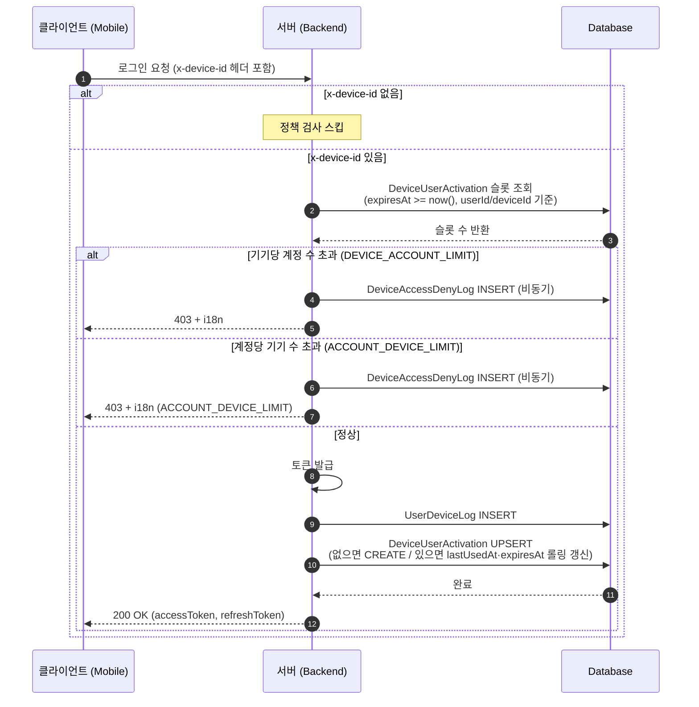
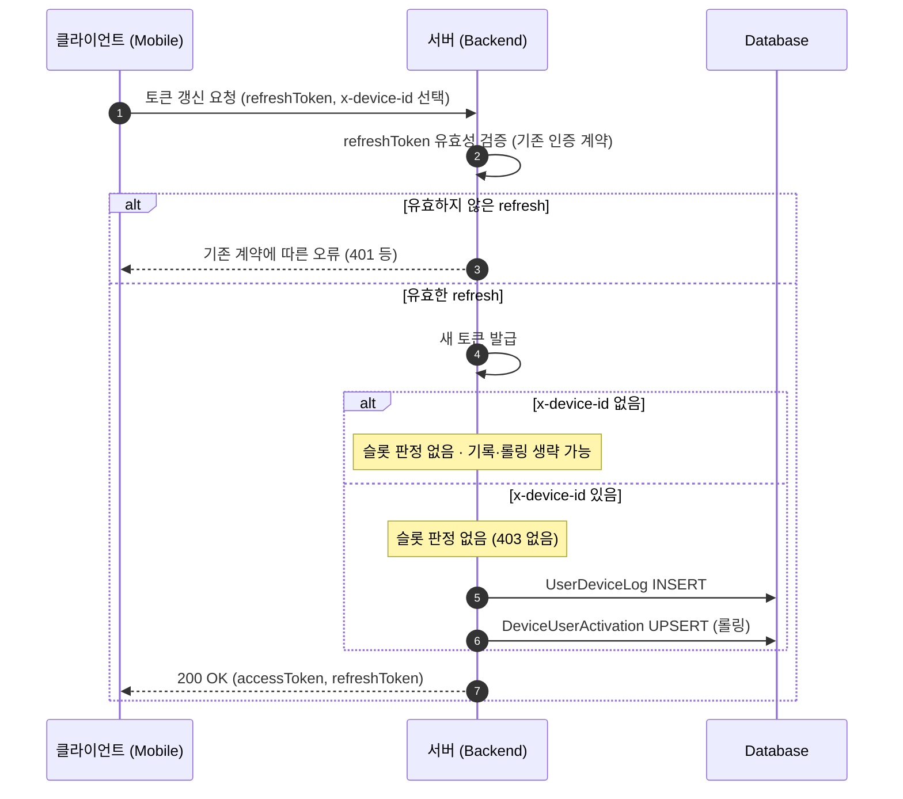
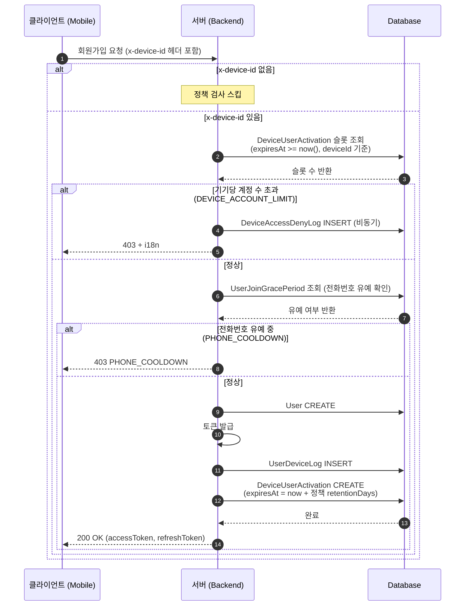
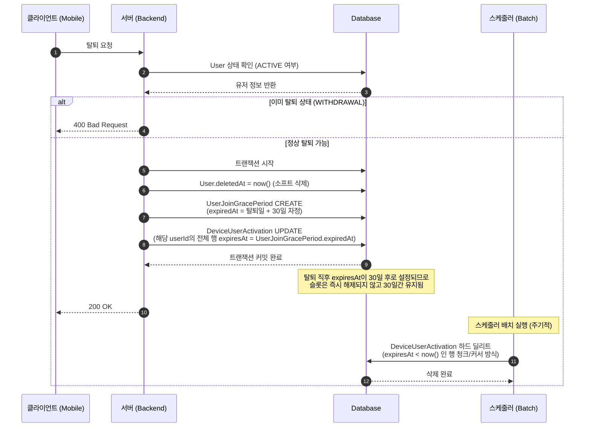

# UDID 기반 접속 제한 OnePager

분류: SRS
작성자: 홍진영
최초 작성일: 2026년 3월 23일 오후 12:24
최근 수정일: 2026년 3월 31일 오전 11:26
문서 상태: Active
생성 일시: 2026년 3월 23일 오후 12:24
진행상황: 진행중
최종 편집자: 홍진영

# Project Name

**UDID 기반 접속 제한 정책 구현**

[https://munto.atlassian.net/browse/WEBB-1179](https://munto.atlassian.net/browse/WEBB-1179)

**정책 문서:** [Notion — UDID 기반 접속 제한 정책](https://www.notion.so/UDID-326e2bc7639d8055976df300842c9aca?pvs=21)

---

## Date

**2026-03-30**

---

## Submitter Info

| 항목 | 내용 |
| --- | --- |
| 이름 | 홍진영 |
| 팀 | 개발팀 |

## Project Description

---

- 네이티브 앱이 보내는 `x-device-id`(IDFV / ANDROID_ID)로 **기기당 허용 계정 수**와 **계정당 허용 기기 수**를 제한해 다중 계정·다기기 어뷰징을 억제한다.
    - **단일 디바이스당 허용 계정 수** ([Notion 3-1](https://www.notion.so/UDID-326e2bc7639d8055976df300842c9aca?pvs=21))
        - 1기기 → 2계정까지 접속 허용
    - **단일 계정당 허용 기기 수** ([Notion 3-2](https://www.notion.so/UDID-326e2bc7639d8055976df300842c9aca?pvs=21))
        - 1계정 → 최대 2기기까지 허용
- 접속 허용/차단 **판정의 유일한 기준은** `DeviceUserActivation`이며, `UserDeviceLog`는 로그·통계 전용으로 두어 대규모 로그 테이블에 대한 실시간 집계 의존을 피한다. ([설계 검토](https://www.notion.so/UDID-OnePager-32ce2bc7639d802faf07c7f4691b8e31?pvs=21))
- 현행 정책 임계값과 단계적 롤아웃 설정은 DeviceAccessPolicy 행으로 관리한다.
- 웹 브라우저는 식별자 미수집으로 **적용 대상에서 제외**하고, 차단 감사 로그(`DeviceAccessDenyLog`)는 비동기로 기록한다.

### 슬롯 집계 기준

`DeviceUserActivation` 행 중 **`expiresAt >= now()`** 인 행만 슬롯을 점유한다.

| 이벤트 | `expiresAt` 갱신 규칙 |
| --- | --- |
| 로그인 성공 · 토큰 갱신 성공 | `lastUsedAt` + 현재 적용 `DeviceAccessPolicy.retentionDays` (롤링) |
| 탈퇴 | `UserJoinGracePeriod.expiredAt` (= 탈퇴일 + 30일 자정)으로 덮어씀 |
- 보존 일수의 **단일 소스는 DB의 `DeviceAccessPolicy.retentionDays`** 이다.
- `expiresAt < now()` 인 행은 스케줄러가 하드 딜리트하므로 집계 쿼리는 단순히 **행 존재 여부**만 확인하면 된다.
- **웹 브라우저는 식별자 미수집으로 정책 적용 대상에서 제외한다.**

### 정책 판정 소스

**현재 적용 정책**은 `DeviceAccessPolicy` 중 **`deletedAt IS NULL` 인 행**만 읽는다.

단계적 롤아웃·롤백도 **별도 기능 플래그 ENV 없이** 이 테이블의 행 갱신·폐기(`deletedAt` 설정)·새 행 삽입으로 제어한다.

- 역할별 테이블 분리:
    
    
    | 테이블 | 역할 | DB 보관 |
    | --- | --- | --- |
    | **`DeviceUserActivation`** | 접속 제한 판정의 단일 소스. 탈퇴 시 트랜잭션 안에서 해당 유저의 모든 바인딩 `expiresAt`을 `UserJoinGracePeriod.expiredAt`과 동일 시각으로 갱신. 스케줄러가 만료 행을 배치 하드 딜리트 | 만료 전까지 |
    | **`UserDeviceLog`** | 로그인 이벤트 기록·통계 전용 | 최근 3개월 |
    | **`DeviceAccessDenyLog`** | 차단 시도 감사용. INSERT는 **비동기** 수행. S3 아카이브·삭제 정책은 `UserDeviceLog`와 동일 배치 패턴(EventBridge + Lambda, 업로드 검증 후 DB 삭제) | 최근 3개월 |

---

## Business and Marketing Justification

- **어뷰징 완화:**
    - 동일 기기 다중 계정·브로커성 다기기 접속을 제한하여 소셜링 등 유료·모임 서비스의 공정성과 호스트·일반 사용자 신뢰를 보호한다.
- **정책 투명성:**
    - 앱 내 안내 문구·**i18n 키**([Notion 5장](https://www.notion.so/UDID-326e2bc7639d8055976df300842c9aca?pvs=21), 수치 PM 확정)와 맞추어 사용자에게 거부 사유를 전달할 수 있다.
- **운영 분리:**
    - 기존 위반 계정 소급·영구정지([Notion 4장](https://www.notion.so/UDID-326e2bc7639d8055976df300842c9aca?pvs=21))는 별도 배치/어드민으로 두고, 본 프로젝트는 **신규 시도에 대한 예방적 가드**에 집중한다.

---

## Risk Assessment

| 위험 | 내용 | 완화 |
| --- | --- | --- |
| 식별자 한계 | IDFV/ANDROID_ID는 재설치 등으로 변경 가능 | 절대 불변 식별자가 아님을 전제로 한 운영 신호로 사용 |
| 오차단 | 가족·기기 교체 등 정상 사용자 영향 | 플래그·시행일로 단계적 롤아웃 |
| 웹 미적용 | 브라우저는 정책 미적용 | 제품 정책으로 명시; 앱만 강제 |
| 데이터 일관성 | 가입 경로에서 기존 `afterLogin` 미호출 | 모든 로그인·가입 성공 경로에서 `UserDeviceLog` + `DeviceUserActivation` 동기화 |
| 탈퇴·슬롯 | 탈퇴/30일 삭제 타이밍 불일치 | 탈퇴 트랜잭션에서 `expiresAt` 갱신 → 30일 유예 후 스케줄러 하드 딜리트, `PHONE_COOLDOWN`과 기간 정렬 |
| 성능 | 거부·성공 시 추가 쓰기 | **`DeviceAccessDenyLog`는 비동기 기록**(큐·fire-and-forget). **403 응답은 판정 직후 고정**이며, 로그 INSERT 실패로 차단이 취소되지 않음 |

---

## Resource and Scheduling Details

| 구분 | 내용 |
| --- | --- |
| 백엔드 (1 명) | Prisma 마이그레이션, `DeviceAccessPolicyService`, `AuthUserService` / `AuthUserV2Service`·탈퇴·스케줄러 연동 |
| 스케줄러 (1 명) | `apps/scheduler` — 탈퇴 후 30일 `DeviceUserActivation` 삭제 배치
`UserDeviceLog` 백업 lambda 배치  |
| 클라이언트 |   • 기존 구현과 동일 |
| QA (2 명) | 경계 케이스(2/2 슬롯, 90일, 탈퇴, deviceId 없음) |

**개발 일정:**

| 구간 | 기간 | 포함·목표 | 시작일 T 기준 |
| --- | --- | --- | --- |
| 개발 | 1주 | 스키마·(선택)백필·도메인·인증·스케줄러·Swagger/i18n 순서 → 스테이징에서 **정책 가동 가능** | **T+1주** |
| QA | 1주 | 스테이징 검증·회귀·클라이언트 연동 → 프로덕션 반영 승인 | **T+2주**  |
| 운영 안정화 | 3주 | 프로덕션 모니터링·30일 배치·지표·CS | **T+2주~T+5주** |

**운영:** 

- 삭제 배치 실패 시 슬랙 알림
- 시행 직후 403·Deny 건수 모니터링.

---

## Technical Description

### 시스템 개요

| 단계 | 내용 | 코드 위치 |
| --- | --- | --- |
| **입력** | HTTP 헤더 `x-device-id` 수신 (아래 **헤더 검증** 참고) | [`request-context.interceptor.ts`](https://www.notion.so/munto/apps/api/src/utils/request-context.interceptor.ts) |
| **판정 `v1.0.2`** | 토큰 발급·유저 생성 **시에** `DeviceAccessPolicyService` 실행. `deletedAt IS NULL` 인 `DeviceAccessPolicy`의 임계값·`expiresAt >= now()` 슬롯 수로 판단 | [`apps/api/src/auth/`](https://www.notion.so/munto/apps/api/src/auth/) · [`auth.module.ts`](https://www.notion.so/munto/apps/api/src/auth/auth.module.ts) |
| **로그인·갱신 성공** | `UserDeviceLog` INSERT. `DeviceUserActivation` 없으면 생성, 있으면 `lastUsedAt`·`expiresAt` 롤링 갱신(`DeviceAccessPolicy.retentionDays`) — **로그인과 갱신 동일** | [`user-device-log.service.ts`](https://www.notion.so/munto/apps/api/src/auth/user-device-log.service.ts) · [`auth-user.service.ts`](https://www.notion.so/munto/apps/api/src/auth/auth-user.service.ts) `afterLogin()` · [`auth-user.v2.service.ts`](https://www.notion.so/munto/apps/api/src/auth/v2/auth-user.v2.service.ts) `refreshToken()` |
| **로그인 실패  `v1.0.2`** | HTTP **403 + i18n 키** (표준 에러 포맷). **`DeviceAccessDenyLog`는 비동기 기록** (응답과 분리, 실패해도 403 불변) | 동일 서비스 |
| **탈퇴** | `withdrawal()` 트랜잭션 안에서 해당 `userId`의 `DeviceUserActivation` 전체 `expiresAt`을 `UserJoinGracePeriod.expiredAt`과 동일 시각으로 갱신 | [`auth-user.service.ts`](https://www.notion.so/munto/apps/api/src/auth/auth-user.service.ts) `withdrawal()` |
| **탈퇴 유예 중 로그인** | 제품상 **불가** — `WITHDRAWAL` 상태에서는 로그인 플로우 미성립. 구현·QA 범위 제외 | — |
| **만료 행 정리** | `expiresAt < now` 인 행을 청크/커서 배치로 하드 딜리트 | 신규 |
| **Retention / 정책 버전** | 어드민에서 `DeviceAccessPolicy` 및 `policyVersion` 반영 후, **`expiresAt` 일괄 재계산은 전용 AWS Lambda**가 청크·커서로 수행 (동기 HTTP 처리 비권장). kick-off만 어드민·이벤트에서 수행 | 신규 |

---

### 관련 Database 스키마

#### 기존 (참고) — `Device`, `UserDeviceLog`

```sql
/// 디바이스 엔티티 - 독립적인 디바이스 관리 테이블
model Device {
  id             BigInt   @id @default(autoincrement())
  deviceUniqueId String   @unique @db.VarChar(100)
  deviceType     String   @db.VarChar(10)
  firstSeenAt    DateTime @default(now())
  lastSeenAt     DateTime @default(now()) @updatedAt
  createdAt      DateTime @default(now())
  updatedAt      DateTime @updatedAt

  userDeviceLogs UserDeviceLog[]

  @@index([deviceUniqueId])
}

model UserDeviceLog {
  id         BigInt   @id @default(autoincrement())
  userId     Int
  deviceId   BigInt
  appVersion String?  @db.VarChar(20)
  ip         String?  @db.VarChar(45)
  loggedAt   DateTime @default(now())
  createdAt  DateTime @default(now())

  user   User   @relation(fields: [userId], references: [id])
  device Device @relation(fields: [deviceId], references: [id])

  @@index([deviceId])
  @@index([userId])
  @@index([loggedAt])
}
```

#### 신규 — `DeviceAccessPolicy`

**`retentionDays` (롤링 만료 기준 일수**)와 적용 메타를 저장하는 테이블.

- 런타임은 **`deletedAt IS NULL` 인 행 하나만** "현재 정책"으로 읽는다.
    - DB 레벨에서 유니크 제약이 없으므로 다음과 같은 상황이 발생할 수 있다.`v1.0.2`
        - 조회 결과가 0건인 경우
        모든 정책이 폐기된 상태로 간주한다.
        이 경우 정책은 비활성 상태로 처리하며, 제한 없이 허용한다.
        - 조회 결과가 2건 이상인 경우
        운영상 데이터 이상 상태로 간주한다.
        이 경우 다음 우선순위로 단일 정책을 결정한다.
        createdAt 기준 최신 데이터
        (동일 timestamp 발생 시) id 기준 내림차순
- 어드민에서 변경·롤아웃할 때는 새 행 삽입 또는 기존 행 수정, 롤백·비활성은 **`deletedAt`으로 폐기**하는 방식으로 제어한다 (별도 기능 플래그 ENV 없음).
- `expiresAt` 일괄 재계산 시 `policyVersion`으로 산출 세대를 추적한다.

```sql
/// 디바이스 접속 제한 정책 설정 (임계값·retention 메타)
model DeviceAccessPolicy {
  id                   Int       @id @default(autoincrement())
  /// 기기당 허용 최대 계정 수 (기본 2)
  maxAccountsPerDevice Int       @default(2)
  /// 계정당 허용 최대 기기 수 (기본 2)
  maxDevicesPerAccount Int       @default(2)
  /// DeviceUserActivation expiresAt 산출 기준 일수 (기본 90)
  retentionDays        Int       @default(90)
  /// 정책 세대 식별자 — expiresAt 재계산 시 갱신하여 산출 기준 추적
  policyVersion        Int       @default(1)
  /// null = 현재 적용 중인 정책. non-null = 폐기된 이전 정책 (이력 보관)
  deletedAt            DateTime? @db.Timestamptz(3)
  createdAt            DateTime  @default(now()) @db.Timestamptz(3)
  updatedAt            DateTime  @updatedAt @db.Timestamptz(3)

  @@index([deletedAt])
}
```

#### 신규 — `DeviceUserActivation`

정책 판정 전용 바인딩 테이블. `status` 컬럼 없이 **`expiresAt`**으로 유효 여부를 판단한다.

**`expiresAt` 산출 공식:**

| 이벤트 | 산출 규칙 |
| --- | --- |
| 로그인·토큰 갱신 성공 | `lastUsedAt` + 현재 적용 `DeviceAccessPolicy.retentionDays` (롤링) |
| 탈퇴 | `UserJoinGracePeriod.expiredAt` 과 동일 시각 (= 탈퇴일 + 30일 자정) |
- **슬롯 집계:** `expiresAt >= now()` 인 행만 포함. 스케줄러가 `expiresAt < now` 인 행을 **하드 딜리트** 한다 (행 보관 없음).
- **`userId` FK 없음** — **탈퇴·삭제 후에도 이력 보존을 위한 스냅샷 식별자**. `Device` 삭제 시 **Cascade**로 연동 제거.

```sql
/// 유저-디바이스 정책 바인딩 (접속 제한 판정용)
/// 슬롯 집계 기준: expiresAt >= now(). 만료 행은 스케줄러가 하드 딜리트.
model DeviceUserActivation {
  id         BigInt   @id @default(autoincrement())
  userId     Int      /// User FK 없음 — 스냅샷 id
  deviceId   BigInt
  createdAt  DateTime @default(now()) @db.Timestamptz(3)
  lastUsedAt DateTime @default(now()) @db.Timestamptz(3) /// 마지막 로그인·토큰 갱신 성공 시각
  expiresAt  DateTime @db.Timestamptz(3)                 /// 슬롯 만료 시각. 로그인·갱신 시 롤링 갱신, 탈퇴 시 유예 종료 시각으로 덮어씀

  device Device @relation(fields: [deviceId], references: [id], onDelete: Cascade)

  @@unique([userId, deviceId])
  @@index([deviceId])
  @@index([userId])
  @@index([expiresAt])
}
```

#### 신규 — `DeviceAccessDenyLog`

차단 시도 감사용. **인증 요청 처리 경로에서는 INSERT를 비동기로 수행**하고 (403 확정과 분리), DB는 단기 보관 후 **S3 배치 아카이브** (위 **운영 및 백업 정책**)로 이전한다.

- `userId`: 가입 전 거부 시 null 가능 (User FK 없음)
- `deviceId`: `Device` 행이 있으면 연결, 없으면 null·`deviceUniqueId`만 기록
- `Device` 삭제 시 **Cascade**로 연동 제거

```sql
model DeviceAccessDenyLog {
  id             BigInt   @id @default(autoincrement())
  userId         Int?
  deviceUniqueId String?  @db.VarChar(100)
  deviceId       BigInt?
  reason         String   @db.VarChar(64)  /// DEVICE_ACCOUNT_LIMIT | ACCOUNT_DEVICE_LIMIT
  attemptedAt    DateTime @default(now()) @db.Timestamptz(3)
  clientIp       String?  @db.VarChar(45)
  userAgent      String?  @db.VarChar(512)
  createdAt      DateTime @default(now()) @db.Timestamptz(3)

  device Device? @relation(fields: [deviceId], references: [id], onDelete: Cascade)

  @@index([userId])
  @@index([deviceUniqueId])
  @@index([deviceId])
  @@index([attemptedAt])
}
```

---

### 동시성(경쟁 조건) `v1.0.1`

동일 기기 또는 동일 계정으로 **짧은 시간에 병렬 요청**이 들어올 때 "한도 직전 COUNT → 통과 → 동시에 INSERT" 패턴이면 슬롯이 한도를 넘길 수 있다.

**공통 전제 — `@@unique([userId, deviceId])`**

- 동일 유저·기기 쌍에 대한 활성 행은 DB에서 최대 1건으로 강제된다.
- UPSERT는 `INSERT … ON CONFLICT DO UPDATE`(또는 Prisma 트랜잭션 내 동등 로직)로 **원자적** 갱신한다.

**트랜잭션 원칙**

- 슬롯 COUNT(`expiresAt >= now()` 조건)와 이어지는 CREATE/UPDATE는 **하나의 트랜잭션**에 넣는다.
- PostgreSQL 기본 격리(READ COMMITTED)만으로는 phantom/재판정 레이스가 남으므로, **직렬화 전략을 택한다.**

#### 방법 1 — `pg_advisory_xact_lock` (본 프로젝트 적용)

트랜잭션 안에서 아래 순서로 락을 획득한 뒤, **COUNT → 한도 미만이면 UPSERT** 순으로 처리한다.

- 기기당 계정 수 판정 전: 해당 `deviceId`(또는 `deviceUniqueId` 해시)에 대해 `pg_advisory_xact_lock(bigint)` 획득
- 계정당 기기 수 판정 전: 해당 `userId`에 대해 `pg_advisory_xact_lock(bigint)` 획득

> 한 요청에서 두 한도를 모두 검사할 경우, 락 획득 순서를 **항상 동일**하게 정해 데드락을 피한다 (예: `deviceId` 락 → `userId` 락).
> 

**방법 1을 선택한 근거**

| 항목 | 설명 |
| --- | --- |
| 명확한 직렬화 범위 | "해당 기기 슬롯" / "해당 계정 슬롯"으로 한정. 전역 `SERIALIZABLE`에 비해 불필요한 대기·충돌 범위가 작다 |
| 자동 해제 | `xact` 계열은 **커밋·롤백 시 자동 해제**되어 락 누수 위험이 낮고, 인스턴스 간에도 동일 DB 기준으로 일관된다 |
| 운영 단순성 | `serialization_failure` 폭주나 재시도 백오프 설계에 덜 의존한다. Nest/Prisma에서도 `$executeRaw` 등으로 락 1~2회 호출 후 기존 로직을 유지하기 쉽다 |
| 코드 명시성 | "어느 축을 직렬화하는지"가 함수상 명시되어, 한도 정책 변경 시 코드 리뷰·감사가 수월하다 |

#### 방법 2 — 격리 수준 `SERIALIZABLE` / `REPEATABLE READ` + 재시도

해당 요청 경로만 트랜잭션 격리 수준을 올리고, PostgreSQL이 감지하는 직렬화 충돌 시 **애플리케이션에서 재시도**(지수 백오프·최대 횟수)한다.

락 키 설계가 불필요하거나 적용이 어려운 경우의 대안이다.

> **본 프로젝트:** 위 근거에 따라 **방법 1을 표준**으로 구현한다. 방법 2는 락 도입이 어려운 특수 경로의 **예비안**으로만 검토한다.
> 

### 판정 테이블 분리 설계 검토 `v1.0.1`

#### 데이터 용량 분석

`UserDeviceLog`를 접속 제한 판정에 직접 활용하는 방안의 타당성을 검토하기 위해 프로덕션 DB를 실측하였다.

#### 실측 기준값 (조회일: 2026-03-30)

| 항목 | 수치 |
| --- | --- |
| 실측 보관 기간 | 약 33일 (2026-02-25 ~ 현재) |
| 총 행 수 | 약 207만 건 |
| 테이블 크기 | 151 MB |
| 인덱스 크기 | 130 MB |
| **전체 합계** | **282 MB** |
| 하루 평균 적재량 | 약 62,000 건/일 |
| 하루 평균 용량 | 약 8.5 MB/일 |
| 행당 평균 크기 | 약 144 bytes |

#### 보관 기간별 예상 규모

| 보관 기간 | 예상 행 수 | 전체 예상 크기 | 현재 대비 |
| --- | --- | --- | --- |
| 33일 (실측) | 약 207만 건 | **282 MB** | 기준 |
| **90일** | 약 560만 건 | **약 765 MB** | 약 2.7배 |
| **365일** | 약 2,260만 건 | **약 3.1 GB** | 약 11배 |

#### 설계 검토

`U**serDeviceLog`를 접속 제한 판정**에 직접 사용할 경우, 매 로그인·갱신 요청마다 보관 기간 설정(예: **90일** 시 약 560만 건, **365일** 시 약 2,260만 건)에 해당하는 규모의 테이블에서 `COUNT(DISTINCT userId/deviceId)` 집계 쿼리가 실행된다.

**문제 1 — 탈퇴 유예 처리 시 3 테이블 JOIN 불가피**

탈퇴 후 30일 유예가 끝난 슬롯은 해제해야 하는데, `UserJoinGracePeriod`는 유예 종료 시 하드 딜리트된다.

이 경우 `UserDeviceLog` 로그는 90일간 잔존하지만 `UserJoinGracePeriod` 레코드는 이미 사라지므로, LEFT JOIN만으로는 "활성 유저(레코드 없음)"와 "유예 종료된 탈퇴 유저(레코드 삭제됨)"를 구분할 수 없다.

결국 `User.deletedAt` 확인을 위해 `User` 테이블까지 추가 JOIN이 필요하다.

```sql
SELECT COUNT(DISTINCT udl."userId")
FROM "UserDeviceLog" udl
JOIN "User" u ON u."id" = udl."userId"
WHERE udl."deviceId" = :deviceId
  AND udl."loggedAt" >= NOW() - INTERVAL ':retentionDays days'
  AND (
    u."deletedAt" IS NULL   -- 활성 유저
    OR EXISTS (             -- 탈퇴했지만 아직 유예 기간 중
      SELECT 1 FROM "UserJoinGracePeriod" ujgp
      WHERE ujgp."userId" = udl."userId"
    )
  )
```

**문제 2 — VIEW 활용의 한계**

| VIEW 종류 | 문제점 |
| --- | --- |
| 일반 VIEW | PostgreSQL은 VIEW를 인라인으로 펼쳐 실행하므로 실행 계획은 3 테이블 JOIN 그대로. `retentionDays`가 동적 값이므로 VIEW 정의에 고정 불가 — 정책 변경 시마다 DROP → CREATE 필요 |
| Materialized VIEW | `REFRESH MATERIALIZED VIEW` 주기 사이에는 stale 데이터를 읽음. 실시간 정확도가 필요한 enforcement 경로에서는 적용 불가 |

**방식별 비교**

| 항목 | `UserDeviceLog` 단독 활용 | `UserDeviceLog` + VIEW | `DeviceUserActivation` |
| --- | --- | --- | --- |
| 판정 쿼리 테이블 수 | **3개** | **3개** (VIEW 내부 동일) | **1개** |
| 실시간 정확도 | O | 일반 VIEW: O / Materialized: **X** | O |
| `retentionDays` 동적 적용 | O (App 레이어) | **X** (VIEW 재생성 필요) | O |
| 탈퇴 슬롯 해제 | 판정 쿼리 복잡도로 흡수 | 동일 | 탈퇴 트랜잭션에서 `expiresAt` 갱신 한 번 |
| 복합 인덱스 추가 | `(deviceId, loggedAt)`, `(userId, loggedAt)` 신규 필요 | 동일 | 현행 유지 |
| 신규 테이블/뷰 | 없음 | VIEW 1개 | `DeviceUserActivation` 1개 |

**결론:**

`UserDeviceLog`는 **로그·통계 전용**으로 유지하고, 접속 제한 판정 단일 소스는 `DeviceUserActivation`으로 분리하는 설계로 진행한다.

`DeviceUserActivation` 방식은 판정에 필요한 바인딩(`userId × deviceId` 유니크 쌍)만 보관하므로 행 수가 **활성 유저 수 × 평균 기기 수** 수준으로 유지되며, 탈퇴 시 트랜잭션 내에서 `expiresAt`을 한 번 갱신하는 것만으로 세 테이블 조인 없이 슬롯 해제가 자동 처리된다.

---

### 운영 및 백업 정책 `v1.0.1`

#### `UserDeviceLog` S3 아카이브

| 항목 | 내용 |
| --- | --- |
| 목적 | DB 부하 경감 및 운영·분석용 장기 보관 |
| DB 보관 기간 | 최근 **3개월**치 유지 |
| 실행 방식 | **AWS EventBridge** (매월 1일 cron 규칙) → **Lambda** 트리거 |
| 적재 대상 월 | 실행일 기준 **현재 월 − 3개월** 1개월치 (예: 2026-04-01 실행 → 2026-01 데이터) |
| S3 키 규칙 | `munto-db-archive/user_device_log/year=YYYY/month=MM/...` |
| DB 삭제 조건 | S3 업로드 **성공(검증 포함) 후에만** 삭제. 실패 시 DB 삭제 금지 |

#### `DeviceAccessDenyLog` S3 아카이브

`UserDeviceLog`와 **동일 운영 패턴**으로 운영한다 (Lambda·EventBridge·검증 후 삭제).

DB 보관 기간·적재 월 오프셋은 `UserDeviceLog`와 동일하게 **3개월**을 기본으로 하되, 감사 보존 요구가 있으면 PM·보안과 별도 보관 기간을 정한다.

| 항목 | 내용 |
| --- | --- |
| 목적 | DB 부하 경감 및 차단 이력 장기 보관 |
| DB 보관 기간 | 최근 **3개월**치 유지 (기본, `UserDeviceLog`와 정렬) |
| 실행 방식 | **AWS EventBridge** (매월 1일 cron) → **Lambda** |
| 적재 대상 월 | 실행일 기준 **현재 월 − 3개월** 1개월치 |
| S3 키 규칙 | `munto-db-archive/device_access_deny_log/year=YYYY/month=MM/...` (키 접두사는 인프라 합의) |
| DB 삭제 조건 | S3 업로드 **성공(검증 포함) 후에만** 삭제 |

#### `expiresAt` 일괄 재계산 Lambda (`DeviceUserActivation`)

정책(`retentionDays`, `policyVersion` 등) 변경 후 **`expiresAt` 전면 재계산은 신규 Lambda**로 구현하는 것을 **본 프로젝트 운영 전제**로 한다.

동일 로직을 **타임아웃·스케일·VPC·비밀 관리** 측면에서 아카이브와 유사한 Lambda 패턴으로 진행한다.

| 항목 | 내용 |
| --- | --- |
| 목적 | `DeviceAccessPolicy` 변경 후 기존 활성 바인딩의 `expiresAt`을 `lastUsedAt` + 신규 `retentionDays` 등으로 일치시킴. **탈퇴 유예로 `UserJoinGracePeriod.expiredAt`과 같아진 행은 스킵** |
| 실행 단위 | **AWS Lambda** — invocation당 처리 행 수 상한·커서 저장 (또는 Step Functions로 여러 Lambda 분할)으로 DB 타임아웃·15분 제한 회피 |
| 트리거 | 어드민 **`DeviceAccessPolicy` 커밋·재계산 요청** → EventBridge / SQS / `Lambda Invoke` (Async) 등 한 번에 작업 세션 시작 |
| 멱등·안전 | `policyVersion`(또는 작업 ID) 단위로 이미 반영된 행은 스킵; **탈퇴 유예로 고정된 `expiresAt`** (`UserJoinGracePeriod`와 일치) 행은 **항상 스킵** |
| 관측 | CloudWatch 로그·에러 알람, 필요 시 처리 건수·커서 메트릭 |

---

### Swagger 변경 안

**대상:** 기존 인증 API — 예: [`AuthUserController`](https://www.notion.so/munto/apps/api/src/auth/auth-user.controller.ts), [`AuthUserV2Controller`](https://www.notion.so/munto/apps/api/src/auth/v2/auth-user.v2.controller.ts) 의 로그인·회원가입 관련 엔드포인트.

**공통:** 정책 위반 시 **HTTP 403 Forbidden**, 응답 바디는 프로젝트 표준 에러 포맷(`HttpExceptionFilter`, i18n 키)에 맞춤.

```tsx
// 로그인·회원가입 메서드에 부가
@ApiResponse({
  status: 403,
  description:
    '디바이스 접속 정책 위반 (기기당 계정 수 또는 계정당 기기 수 초과). 클라이언트는 에러 코드에 따라 Notion 5장과 일치하는 안내 문구 표시.',
  schema: {
    example: {
      statusCode: 403,
      message: 'DEVICE_ACCOUNT_LIMIT',
      error: 'Forbidden',
    },
  },
})
```

- 실제 `message` / i18n 키는 기존 API 에러 응답 스타일에 맞출 것.
- **회원가입**(`POST /v2/auth/join`, `POST /v2/auth/register` 등)과 **로그인**(`POST .../login` 계열) 모두 동일 403 스펙을 문서화한다.
- Swagger UI: 로컬 API 서버 기준 `http://localhost:3000/_d` (프로젝트 [CLAUDE.md](https://www.notion.so/munto/CLAUDE.md) 기준)에서 확인.

### 서비스 흐름도 `v1.0.1`

#### 로그인



#### 토큰 갱신 `v1.0.2`

`~~POST /v2/auth/refresh` 등 **리프레시 토큰 갱신**도 헤더에 `x-device-id`가 있으면 로그인과 **동일한** 슬롯 판정을 선행한다.~~

`POST /v2/auth/refresh` 등 **리프레시 토큰 갱신**은 기존 세션의 연장이므로 **슬롯 한도 판정(`DeviceAccessPolicyService` 선행·한도 초과 시 403)을 적용하지 않는다.**

유효한 `refreshToken`이면 새 access/refresh 토큰을 발급한다. 헤더에 `x-device-id`가 있으면 **`UserDeviceLog` INSERT · `DeviceUserActivation` 롤링 갱신**은 로그인 성공과 동일 규칙으로 수행한다.



#### 회원가입

**신규 가입·첫 기기 주의사항:**

가입 시점에는 아직 해당 `userId`에 대한 `DeviceUserActivation`이 없으므로 **`ACCOUNT_DEVICE_LIMIT`(계정당 기기 수) 판정은 첫 바인딩이 항상 허용**(0→1).

다이어그램에는 기기당 계정 한도만 선행하지만, 구현 시 두 한도를 로그인·갱신과 동일한 규칙으로 적용한다.



#### 탈퇴 플로우



---

<aside>
🔁

## **변경 이력**

</aside>

---

| **버전** | **일자** | **변경자** | **변경 내용** |
| --- | --- | --- | --- |
| v1.0.0 | 26.03.23 | 홍진영 | 최초 작성 |
| v1.0.1 | 26.03.30 | 홍진영 | 하기 목록 추가
  • 슬롯 집계 기준
  • 서비스 흐름도
  • 판정 테이블 분리 설계 검토
 |
| v1.0.2 | 26.03.31 | 홍진영 |   • `DeviceAccessPolicy` 정책 수정
  • 토큰 갱신 플로우 수정
      ◦ UDID 판정 제외 |

<aside>
🧾

## **문서 작성 규칙**

</aside>

1. **항목마다 작성자/작성일을 명시**
2. **모든 변경은 ‘변경 이력’ 테이블에 기록**
3. **문서 버전은 Semantic Versioning(v1.0.0)을 따름**
4. **기여자는 실질적인 내용 추가/수정에 참여한 사람만 포함**
5. 변경 사항이 발생하거나 리뷰 요청이 필요한 문서의 경우, 관련 수정 내용을 변경 이력과 함께 명시하고, 해당 부분 끝에 버전을 표기하여 혼동을 방지한다. 
    - 변경 내용 `(v1.0.1)`