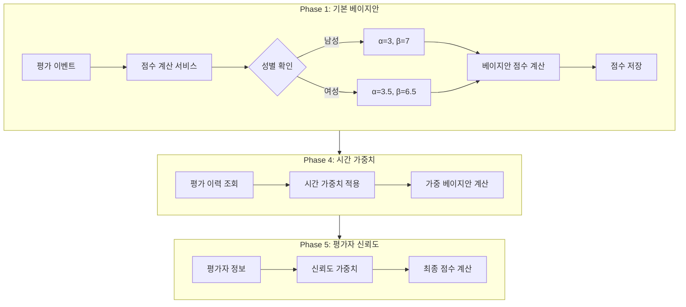
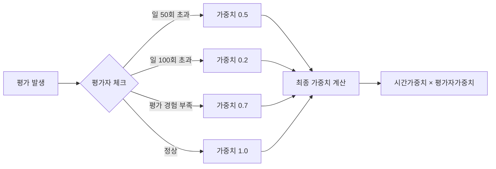

# 베이지안 추정 기반 점수 시스템 제안서

Date: 2026년 1월 23일
Person: 김범진
Select: 기획
Status: In progress
Version: 1.1.0

## **1. Executive Summary**

### **1.1 현재 시스템의 문제점**

| **문제** | **설명** |
| --- | --- |
| **급격한 점수 변동** | 0.5 → 실제 점수로 갑자기 전환 |
| **임의적 기준** | "몇 회부터 전환할지" 통계적 근거 부족 |
| **극단값 문제** | 평가 3회 중 3회 좋아요 = 100% (신뢰 불가) |
| **현실과 괴리** | 남성 0%가 43회 기준 달성 |

### **1.2 제안 솔루션: 베이지안 추정**

```
베이지안 점수 = (사전 좋아요 + 실제 좋아요) / (사전 평가 + 실제 평가)
```

- 평가 0회: 성별 평균(남성 0.30, 여성 0.35)에서 시작
- 평가 증가: 실제 비율로 자연스럽게 수렴

### **1.3 기대 효과**

| **항목** | **Before** | **After** |
| --- | --- | --- |
| 신규 유저 점수 | 0.5 고정 | 성별 평균으로 시작, 즉시 반영 |
| 점수 전환 | N회 후 급격한 변동 | 부드러운 수렴 |
| 극단값 (2/2 좋아요) | 100% | 42% (보정됨) |

### **1.4 고도화 방향**

| **단계** | **내용** |
| --- | --- |
| Phase 1 | 베이지안 점수 계산 로직 도입 |
| Phase 2 | 기존 유저 점수 마이그레이션 |
| Phase 3 | 모니터링 및 A/B 테스트 |
| Phase 4 | 시간 가중치 도입 (EMA, 반감기 10일) |
| Phase 5 | 평가자 신뢰도 기반 가중치 (PageRank 스타일) |

---

## **2. 베이지안 추정 원리**

### **2.1 핵심 개념**

```
베이지안 점수 = (사전 지식 + 관측 데이터)의 가중 평균
```

- 평가가 적을 때 → 사전 지식(전체 평균)에 가까움
- 평가가 많아질수록 → 실제 관측 비율에 수렴

### **2.2 수학적 공식**

좋아요/싫어요는 이항분포를 따르므로, **베타분포(Beta Distribution)**를 사전확률로 사용:

```
사전분포: Beta(α₀, β₀)
관측: n회 평가 중 k회 좋아요

사후분포: Beta(α₀ + k, β₀ + (n - k))
점수 = (α₀ + k) / (α₀ + β₀ + n)
```

### **2.3 파라미터 의미**

| **파라미터** | **의미** | **역할** |
| --- | --- | --- |
| α₀ | 가상의 좋아요 수 | 사전 기대값 조정 |
| β₀ | 가상의 싫어요 수 | 사전 기대값 조정 |
| α₀ + β₀ | 사전 확신 강도 | 클수록 사전분포 영향 강함 |

**사전 평균** = α₀ / (α₀ + β₀)

---

## **3. 제안 설정**

### **3.1 사전분포 파라미터**

현재 데이터 분석 결과를 기반으로 초기값 설정:

| **성별** | **평균 좋아요 비율** | **제안 α₀** | **제안 β₀** | **사전 평균** | **가상 평가 수** |
| --- | --- | --- | --- | --- | --- |
| 남성 | ~30% | 3 | 7 | 0.30 | 10회 |
| 여성 | ~35% | 3.5 | 6.5 | 0.35 | 10회 |

### **하이퍼파라미터 설계 필요성**

> ⚠️ 주의: 현재 설정된 가상 평가 10회는 실제 유저의 평균 활동량에 따라 초기 점수의 변별력을 저하시킬 리스크가 있습니다.
> 

이를 해결하기 위해 **고정값이 아닌 하이퍼파라미터로 설계**해야 합니다:

| **하이퍼파라미터** | **설명** | **조정 기준** |
| --- | --- | --- |
| `PRIOR_STRENGTH` | 사전분포 강도 (α₀ + β₀) | 서비스 활성도, 평균 평가 횟수 |
| `PRIOR_MEAN_MALE` | 남성 사전 평균 | 전체 남성 좋아요 비율 |
| `PRIOR_MEAN_FEMALE` | 여성 사전 평균 | 전체 여성 좋아요 비율 |

**최적화 방안**:

1. **백테스팅**: 과거 데이터로 다양한 파라미터 조합 시뮬레이션
2. **점수 수렴 속도 분석**: 평가 횟수별 점수 안정화 시점 측정
3. **주기적 재조정**: 서비스 활성도 변화에 따라 파라미터 업데이트

### **3.2 점수 계산 함수**

```python
def calculate_bayesian_score(likes: int, dislikes: int, gender: str) -> float:
    """
    베이지안 추정 기반 매력도 점수 계산

    Args:
        likes: 좋아요 수
        dislikes: 싫어요 수
        gender: 성별 ('MALE' or 'FEMALE')

    Returns:
        0~1 사이의 매력도 점수
    """
    # 성별별 사전분포 파라미터
    if gender == 'MALE':
        alpha_prior = 3.0
        beta_prior = 7.0
    else:  # FEMALE
        alpha_prior = 3.5
        beta_prior = 6.5

    # 사후분포 파라미터
    alpha_post = alpha_prior + likes
    beta_post = beta_prior + dislikes

    # 사후 평균 (점수)
    return alpha_post / (alpha_post + beta_post)
```

---

## **4. 현재 방식 vs 베이지안 방식 비교**

### **4.1 점수 계산 예시**

| **상황** | **현재 방식** | **베이지안 (남성)** | **비고** |
| --- | --- | --- | --- |
| 평가 0회 | 0.50 (고정) | **0.30** | 전체 평균 반영 |
| 2회 중 2회 좋아요 | 1.00 또는 0.50 | **0.42** | 극단값 방지 |
| 2회 중 0회 좋아요 | 0.00 또는 0.50 | **0.25** | 극단값 방지 |
| 5회 중 3회 좋아요 | 0.60 또는 0.50 | **0.40** | 부드러운 전환 |
| 10회 중 7회 좋아요 | 0.70 | **0.50** | 사전분포 영향 감소 |
| 30회 중 21회 좋아요 | 0.70 | **0.60** | 실제 비율에 수렴 |
| 100회 중 70회 좋아요 | 0.70 | **0.66** | 거의 실제 비율 |

### **4.2 점수 수렴 곡선**

```
평가 횟수에 따른 점수 변화 (실제 좋아요 비율 70% 가정)

현재 방식:
  0회: 0.50 ──────────┐
                      └── N회 후 갑자기 0.70으로 전환

베이지안:
  0회: 0.30 (사전 평균)
  5회: 0.47
 10회: 0.50
 20회: 0.57
 50회: 0.63
100회: 0.66 (실제 비율에 수렴)

```

---

## **5. 장점 분석**

### **5.1 기술적 장점**

| **장점** | **설명** |
| --- | --- |
| **신규 유저 문제 해결** | 평가 0회여도 합리적인 초기값 (성별 평균) |
| **부드러운 전환** | 고정 점수 → 실제 점수로 급격히 바뀌지 않음 |
| **극단값 방지** | 적은 평가에서 100%, 0% 같은 극단값 없음 |
| **임의적 기준 제거** | "N회부터 전환" 같은 휴리스틱 불필요 |
| **통계적 정당성** | 수학적으로 검증된 베이즈 정리 기반 |

### **5.2 비즈니스 장점**

| **장점** | **설명** |
| --- | --- |
| **공정성 향상** | 모든 유저에게 동일한 수학적 기준 적용 |
| **신규 유저 경험 개선** | 첫 평가부터 점수에 즉시 반영 |
| **매칭 품질 향상** | 더 정확한 점수로 더 나은 매칭 |
| **유지보수 용이** | 임의적 기준 조정 불필요 |

---

## **6. 구현 계획**

### **6.1 전체 아키텍처**



### **6.2 Phase 1: 베이지안 점수 계산**

```
FUNCTION calculateBayesianScore(likes, dislikes, gender):
    IF gender == MALE:
        α₀ = PRIOR_STRENGTH × PRIOR_MEAN_MALE
        β₀ = PRIOR_STRENGTH × (1 - PRIOR_MEAN_MALE)
    ELSE:
        α₀ = PRIOR_STRENGTH × PRIOR_MEAN_FEMALE
        β₀ = PRIOR_STRENGTH × (1 - PRIOR_MEAN_FEMALE)

    α_post = α₀ + likes
    β_post = β₀ + dislikes

    RETURN α_post / (α_post + β_post)
```

### **6.3 Phase 2: 마이그레이션**

```
FOR EACH user IN active_users:
    likes = COUNT(evaluations WHERE type = 'LIKE')
    dislikes = COUNT(evaluations WHERE type = 'DISLIKE')

    new_score = calculateBayesianScore(likes, dislikes, user.gender)

    UPDATE user.score = new_score
```

### **6.4 Phase 3: 모니터링**

- 점수 분포 변화 추적
- 매칭 성공률 비교 (A/B 테스트)
- 유저 피드백 수집

### **6.5 Phase 4: 시간 가중치 도입**

### **문제: 데이터 고착화**

```
예시: 유저 A
├─ 6개월 전: 20회 중 5회 좋아요 (25%)
└─ 최근: 10회 중 8회 좋아요 (80%)

단순 베이지안: 0.40 ← 과거에 고착
시간 가중치 적용: 0.58 ← 최근 반영
```

### **시간 감쇠 테이블 (λ=0.933, 반감기 10일)**

| **경과 일수** | **0** | **5** | **10** | **14** | **20** | **30** |
| --- | --- | --- | --- | --- | --- | --- |
| **가중치** | 1.00 | 0.71 | 0.50 | 0.38 | 0.25 | 0.12 |

### **수도코드**

```
FUNCTION calculateTimeWeightedScore(evaluations, gender):
    α₀, β₀ = getPriorParams(gender)

    weighted_likes = 0
    weighted_total = 0

    FOR EACH eval IN evaluations:
        days_ago = TODAY - eval.date
        weight = DECAY_FACTOR ^ days_ago

        weighted_total += weight
        IF eval.is_like:
            weighted_likes += weight

    α_post = α₀ + weighted_likes
    β_post = β₀ + (weighted_total - weighted_likes)

    RETURN α_post / (α_post + β_post)
```

### **6.6 Phase 5: 평가자 신뢰도**



```
FUNCTION getVoterWeight(voter):
    IF voter.daily_eval_count > 100:
        RETURN 0.2
    IF voter.daily_eval_count > 50:
        RETURN 0.5
    IF voter.total_evals_given < 10:
        RETURN 0.7
    RETURN 1.0

최종 가중치 = 시간 가중치 × 평가자 가중치
```

---

## **7. 고려 사항**

### **7.1 하이퍼파라미터 통합 관리**

모든 조정 가능한 파라미터를 하이퍼파라미터로 설계하여 유연한 최적화 구조를 마련합니다.

| **하이퍼파라미터** | **설명** | **초기값** | **조정 기준** |
| --- | --- | --- | --- |
| `PRIOR_STRENGTH` | 사전분포 강도 (α₀ + β₀) | 10 | 서비스 활성도, 평균 평가 횟수 |
| `PRIOR_MEAN_MALE` | 남성 사전 평균 | 0.30 | 전체 남성 좋아요 비율 |
| `PRIOR_MEAN_FEMALE` | 여성 사전 평균 | 0.35 | 전체 여성 좋아요 비율 |
| `DECAY_FACTOR` | 시간 감쇠 계수 | 0.933 | 서비스 평균 이용 기간 (반감기 10일) |

**최적화 프로세스**:

1. **백테스팅**: 과거 데이터로 다양한 파라미터 조합 시뮬레이션
2. **점수 수렴 속도 분석**: 평가 횟수별 점수 안정화 시점 측정
3. **주기적 재조정**: 서비스 활성도 변화에 따라 파라미터 업데이트

### **7.2 평가자 신뢰도 기반 가중치 (고도화)**

모든 유저의 '좋아요'를 동일 가치로 처리하기보다, **투표자의 신뢰도나 점수에 따라 가중치를 차등 부여**하는 방식이 시스템의 정밀도를 높이는 데 효과적입니다.

### **Phase 1: 단순 필터링 (초기 구현)**

| **필터링 대상** | **처리 방식** |
| --- | --- |
| 평가 남발 유저 | 일정 횟수 이상 평가 시 가중치 감소 (예: 일 50회 초과 시 0.5배) |
| 신뢰도 낮은 유저 | 본인 평가 횟수 대비 받은 평가가 극단적으로 적은 유저 |
| 신규 유저 평가 | 평가 경험이 적은 유저의 투표는 낮은 가중치 |

```tsx
function getVoterWeight(voter: User): number {
  // 평가 남발 체크
  const dailyEvalCount = voter.todayEvaluationCount;
  if (dailyEvalCount > 50) return 0.5;
  if (dailyEvalCount > 100) return 0.2;

  // 신규 유저 체크
  if (voter.totalEvaluationsGiven < 10) return 0.7;

  return 1.0;
}
```

### **Phase 2: PageRank 스타일 가중치 (향후 고도화)**

평가자의 "평가 품질"을 재귀적으로 계산하는 방식:

```
평가자 신뢰도 = f(본인 점수, 평가 일관성, 받은 평가 품질)

좋아요 가중치 = 시간 가중치 × 평가자 신뢰도
```

| **요소** | **설명** |
| --- | --- |
| 본인 점수 | 높은 점수 유저의 평가에 높은 가중치 |
| 평가 일관성 | 무작위 평가 vs 일관된 패턴 |
| 상호 평가 품질 | 본인이 좋아요한 유저들의 평균 품질 |

> PageRank처럼 "좋은 유저가 좋아요한 유저는 좋은 유저" 논리 적용
> 

### **7.3 신뢰도 지표 병행**

베이지안 점수와 함께 **신뢰도 지표**를 제공

```tsx
function getConfidenceLevel(totalEvaluations: number): string {
  if (totalEvaluations < 5) return '매우 낮음';
  if (totalEvaluations < 15) return '낮음';
  if (totalEvaluations < 30) return '보통';
  if (totalEvaluations < 50) return '높음';
  return '매우 높음';
}
```

### **7.4 기존 시스템과의 호환성**

- 점수 범위는 동일하게 0~1 유지
- 기존 매칭 알고리즘 수정 불필요
- 점수 기반 노출 로직 그대로 사용 가능

---

## **8. 참고 문서**

- [**유저 평가 충분성 분석 보고서**](https://www.notion.so/2f1e2bc7639d804f81b3cdc539e47df5?pvs=21)
- [알고리즘 1차 결과 보고서](https://www.notion.so/1-2f0e2bc7639d806f924dcd7ebce3c2a1?pvs=21)

---

## **변경 이력**

| **버전** | **일자** | **변경자** | **변경 내용** |
| --- | --- | --- | --- |
| v1.0.0 | 2026-01-23 | 김범진 | 최초 작성 |
| v1.1.0 | 2026-01-26 | 김범진 | 하이퍼파라미터 설계 반영
시간 가중치(EMA) 반감기 10일 적용
평가자 신뢰도 기반 가중치 추가 |