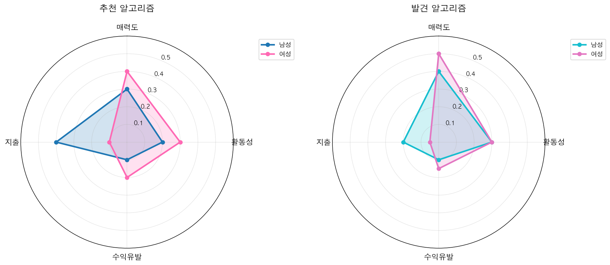
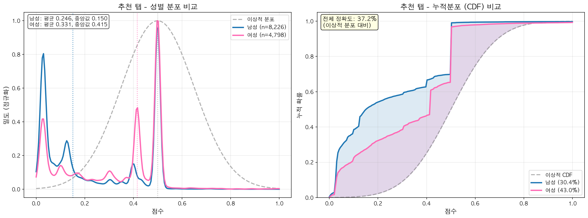
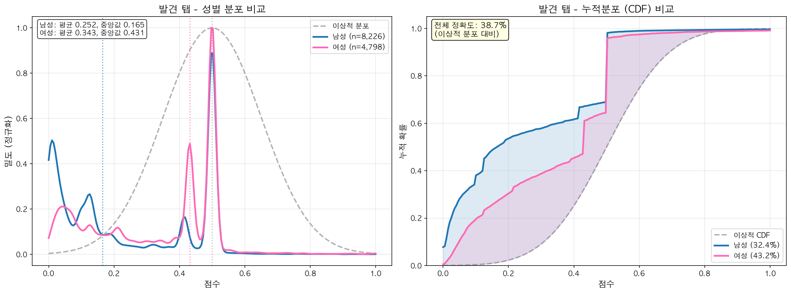
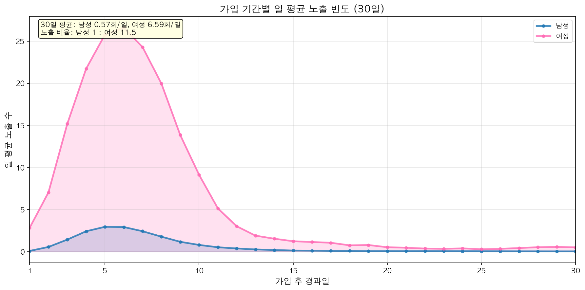
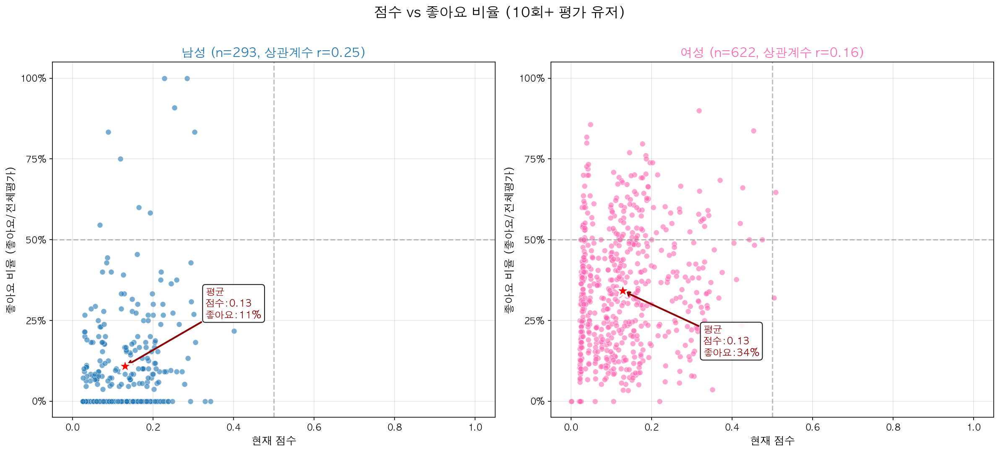

# 알고리즘 분석 리포트 - 2026-01-22

> 분석 시점: 2026-01-22 12:39:41 | 총 유저: 13,024명

---

## 1. 알고리즘 계산식

### 점수 계산 공식

```
매력도점수 = W1×매력도 + W2×활동성 + W3×수익유발 + W4×지출 + 신규유저보너스
```

```
최종점수 = W_age×나이점수 + W_loc×지역점수 + W_attr×매력도점수
```

### 가중치 시각화



👉 [상세 가중치 및 변경 히스토리](../../constants/weight-history.md)

---

## 2. 점수 분포 분석

### 추천 탭 (정확도: 37.2%)



| 성별 | 유저수 | 평균 | 중앙값 | 정확도 |
|------|--------|------|--------|--------|
| 남성 | 8,226 | 0.2455 | 0.1505 | 30.4% |
| 여성 | 4,798 | 0.3309 | 0.4150 | 43.0% |

### 발견 탭 (정확도: 38.7%)



| 성별 | 유저수 | 평균 | 중앙값 | 정확도 |
|------|--------|------|--------|--------|
| 남성 | 8,226 | 0.2517 | 0.1646 | 32.4% |
| 여성 | 4,798 | 0.3435 | 0.4312 | 43.2% |


---

## 3. 노출 빈도 분석

가입 후 30일간 일 평균 노출 빈도를 분석합니다.



| 성별 | 유저 수 | 일 평균 노출 |
|------|---------|-------------|
| 남성 | 1,568명 | 0.57회/일 |
| 여성 | 542명 | 6.59회/일 |

> **노출 비율**: 남성 1 : 여성 11.5

---

## 4. 좋아요 비율 분석

점수와 좋아요 비율의 관계를 분석합니다. (10회 이상 평가받은 유저 대상)



### 성별 비교

| 성별 | 분석 대상 | 평균 점수 | 좋아요 비율 | 상관계수 |
|------|----------|----------|------------|---------|
| 남성 | 293명 | 0.13 | 11% (평가 중 좋아요) | r=0.25 |
| 여성 | 622명 | 0.13 | 34% (평가 중 좋아요) | r=0.16 |

> **좋아요 비율** = 받은 좋아요 / (좋아요 + 싫어요)

### 분석 결과

- 여성 좋아요 비율 **34%** vs 남성 **11%** (약 3.2배 차이)
- 평균 점수는 남녀 모두 **0.13** 으로 동일
- 상관계수가 낮음 (r < 0.3) → **좋아요와 점수 간 상관관계 약함**

---

*Generated by generate_report.py*
