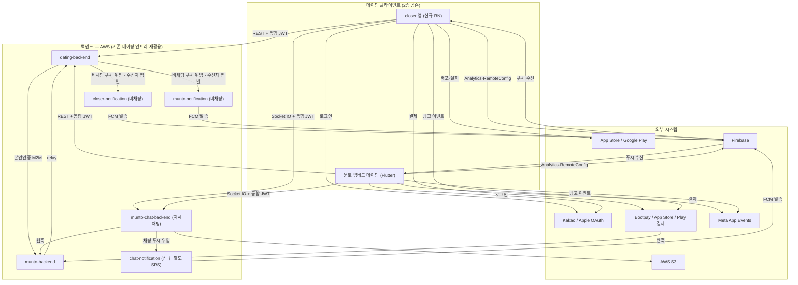
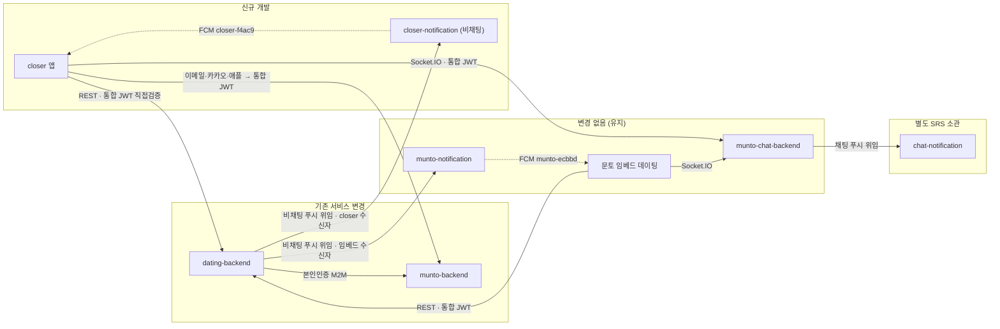

# SRS — 데이팅 앱(Closer) 독립 분리

create by: 김범진

| 항목 | 값 |
| --- | --- |
| 문서 버전 | v0.2 (draft) |
| 작성일 | 2026-06-17 |
| 대상 제품 revision | closer v1.0 (신규) |
| 관련 이슈 | [DEVT-164](https://munto.atlassian.net/browse/DEVT-164) · [WEBB-1196](https://munto.atlassian.net/browse/WEBB-1196) · [DEVT-145](https://munto.atlassian.net/browse/DEVT-145) |

---

# 1 Introduction (개요)

## 1.1 Purpose (목표)

본 SRS는 **문토 앱 내부에 패키지로 임베드된 데이팅 기능을 독립 앱 closer로 분리**하는 프로젝트(DEVT-164)의 상세 요구사항을 정의한다. 대상 산출물은 closer v1.0이며, 모바일 앱(closer-mobile), 푸시 전용 백엔드(closer-notification), 그리고 분리에 수반되는 dating-backend·munto-backend 변경을 한 문서에서 다루는 **시스템 레벨 SRS**다.

본 문서는 **내부 개발용**으로 작성되었으며, 독자는 PM·백엔드·모바일·QA·운영이다. 데이팅 채팅 서버 자체의 명세(소켓 이벤트·메시지 계약·DM 마이그레이션)와 채팅 푸시 서버의 명세는 본 문서가 아닌 **별도 채팅 서비스 SRS** 소관이며, 본 문서는 그 시스템들과 closer의 **연동 및 다이어그램 상 위치**만 다룬다.

## 1.2 Product Scope (범위)

현재 문토 앱과 데이팅은 같은 Firebase 프로젝트(`munto-ecbbd`)와 같은 Meta App Events 앱(공유 앱 ID `1554630772409448`)을 공유해, Analytics·FCM·Remote Config 지표와 광고 어트리뷰션이 혼재된다. 또한 데이팅이 문토 앱(Flutter) 안에 묶여 있어 빌드·릴리즈·실험·롤백을 독립적으로 수행할 수 없고, Flutter 단일 스택 의존으로 팀 전원이 유지보수하기 어렵다. 본 프로젝트는 데이팅을 **React Native(Expo) 기반 독립 앱 closer로 재구축**하고 인프라(Firebase·Meta·푸시·딥링크·스토어)를 문토에서 분리하여, 데이팅 지표·광고 성과를 독립 측정하고 출시·실험·롤백 자유도를 확보하는 것을 목표로 한다.

closer는 **기능을 현 데이팅과 동등하게 유지**하면서, 단일 통합 JWT 기반 3종 로그인(이메일·카카오·애플), 결제, 자체채팅 클라이언트 연동, 비채팅 푸시(closer 전용 발송 서버), 딥링크, 앱 식별자 분리를 제공한다. 기존 문토 임베드 데이팅은 전환기 동안 병행 운영하며 동일 사용자 식별자(muntoUserId) 기준으로 전환율을 측정하고, 임계치 도달 시 문토 앱에서 단계적으로 제거(sunset)한다.

**Will not do (의도적으로 제외):**

- **데이팅 신규 기능 개발** — 본 프로젝트는 *분리·재구축*이 목적이며 기능은 현 데이팅과 동등하다. 신규 기능은 별도 프로젝트에서 다룬다.
- **데이팅 채팅 서버·채팅 푸시 서버 자체의 명세** — 자체채팅 서버(Socket.IO) 인터페이스·DM 마이그레이션, 채팅 푸시 서버는 별도 채팅 서비스 SRS 소관이다. closer는 클라이언트 연동만 담당한다.
- **closer 디자인 정의(Figma·디자인 시스템)** — 디자인은 별도 디자인/기획 트랙 산출물이며, 본 프로젝트는 RN 구현만 범위로 한다.
- **문토 임베드 데이팅의 재디자인** — 임베드 데이팅에는 새 디자인을 적용하지 않고 현 디자인을 유지한다.
- **임베드 데이팅 즉시 제거** — v1.0은 전환 유도·전환율 측정까지이며, 제거(sunset)는 후속 Phase다.

## 1.3 Document Conventions (문서규칙)

- **우선순위 표기**: 각 기능에 `(P1)`/`(P2)`/`(P3)`을 표기한다. 정의는 아래와 같다.
  - **P1**: 반드시 포함. 제외 시 v1.0 릴리스 불가.
  - **P2**: 중요하나 일정에 따라 조정 가능.
  - **P3**: 추가되면 좋으나 필수 아님(다음 Phase).
- **우선순위 상속**: 상위 기능의 우선순위는 하위 기능에 상속되며, 하위가 상위보다 높은 우선순위를 가질 수 없다.
- **버전 표기**: v1.0 베이스라인 내용에는 표기를 붙이지 않고, 후속 버전 추가분만 `(v1.1)` 식으로 표기한다.
- **시간 형식**: 모든 datetime은 Unix Timestamp(밀리초, `number`)로 표기한다.
- **필드명**: camelCase.
- **변경 표기**: 색깔만으로 정보를 전달하지 않고 텍스트로 병기한다.
- **미정 항목**: `TBD`(미결 이유·책임자·마감·영향 섹션 병기) / `None`(적용 대상이나 이번엔 없음) / `N/A`(적용 자체가 무관) / `N/A(기존과 동일)`(기존 데이팅 환경과 동일)로 구분 표기한다.

## 1.4 Terms and Abbreviations (정의 및 약어)

> 본문 이해관계자(PM·백엔드·모바일·QA·운영) 중 일부가 모르거나 혼동할 수 있는 용어만 정의한다. `JWT`·`REST`·`FCM`·`OAuth` 등 전원이 아는 표준 용어는 등록하지 않는다.

| 용어 | 정의 (본 프로젝트에서의 의미) | 본문 참조 |
| --- | --- | --- |
| **closer** | 본 프로젝트로 분리·구축하는 데이팅 독립 앱(가칭). 번들 `kr.munto.closer`, Firebase `closer-f4ac9`, RN(Expo). | 전반 |
| **문토 임베드 데이팅** | 기존 문토 앱(`munto-mobile`) 안에 Flutter 패키지(`dating-mobile`)로 포함된 데이팅 화면. closer와 동일 백엔드를 공유하며 전환기 병행 후 sunset 대상. | 2.1, 7.9 |
| **통합 JWT** | munto-backend가 `JWT_KEY`로 서명·발급하는 단일 JWT. payload에 `sub`(=userId)를 포함해 dating-backend·자체채팅서버가 모두 `JWT_KEY`로 직접 검증한다(별도 데이팅 토큰 교환 없음). | 7.1 |
| **muntoUserId** | dating-backend·자체채팅서버·closer-notification이 쓰는 사용자 식별자. 통합 JWT의 `sub`·데이팅 DB `User.id`와 동일(FK 통합 구조). | 6.4, 7.4 |
| **closer-notification** | closer의 **비채팅** 푸시 전용 신규 백엔드 서버(`closer-f4ac9` 서비스계정 FCM 발송 + 자체 토큰 스토어). | 7.4 |
| **chat-notification** | 데이팅 채팅 푸시 전용 신규 서버. 별도 채팅 서비스 SRS 소관이며 본 문서는 다이어그램 포함·참조만 한다. closer-notification은 채팅 푸시를 담당하지 않는다. | 2.1, 7.4 |
| **자체채팅서버** | munto-chat-backend(Socket.IO). 데이팅 채팅은 이 서버만 사용(Sendbird 불가). 인터페이스는 별도 채팅 서비스 SRS 소관. | 7.3 |
| **appType** | 푸시 위임 시 dating-backend가 수신자 클라이언트(closer/임베드)를 구분하는 값. 불명확 시 기존 경로로 폴백. | 7.4 |
| **App Links / Universal Links** | 웹 URL을 앱으로 직접 여는 OS 메커니즘(Android/iOS). closer는 `closer.munto.kr` 기반. | 7.5 |
| **EAS** | Expo Application Services. Expo 앱의 클라우드 빌드·제출·OTA 업데이트. | 3.3 |
| **CNG** | Continuous Native Generation. Expo prebuild로 `/ios`·`/android` 네이티브 프로젝트를 config 기반 생성하는 방식(git 미추적, 직접 수정 금지). | 3.4 |
| **sunset** | 임베드 데이팅을 전환율 도달 후 문토 앱에서 단계적으로 제거하는 것. | 7.9 |

## 1.5 Related Documents (관련문서)

- [DEVT-164](https://munto.atlassian.net/browse/DEVT-164) — 데이팅 앱 분리 추적 이슈
- [WEBB-1196](https://munto.atlassian.net/browse/WEBB-1196) — 통합 JWT 직접 호환(백엔드 선행 적용 작업)
- [DEVT-145](https://munto.atlassian.net/browse/DEVT-145) — Dating 모바일 Flutter → RN 재구축
- closer 분리 Engineering One Pager — `projects/closer/OnePager.md` (본 SRS의 상위 착수 문서)
- 데이팅 채팅 서비스 SRS — *작성 중*(별도 트랙). 자체채팅 서버 인터페이스·채팅 푸시 서버·DM 마이그레이션 소관. (TBD-4: 링크는 해당 문서 베이스라인 시 보강)
- Swagger(API) / ERD(DBML) — dev-chain-design 산출물(`*-docs` 레포). (TBD-1)
- closer-mobile 아키텍처 — `closer-mobile/docs/ARCHITECTURE.md`

## 1.6 Intended Audience and Reading Suggestions (대상 및 읽는 방법)

| # | 챕터 | PM | 백엔드 | 모바일 | QA | 운영 | 경영진 |
| --- | --- | --- | --- | --- | --- | --- | --- |
| 1.2 | Product Scope | 2 | 1 | 1 | 1 | 1 | 2 |
| 2.1 | Product Perspective | 2 | 2 | 2 | 2 | 1 | 1 |
| 2.2 | System Configuration | 2 | 2 | 2 | 1 | 1 | — |
| 3 | Environment | 1 | 2 | 2 | 2 | 2 | — |
| 4 | External Interface | 1 | 2 | 2 | 2 | — | — |
| 6 | Non-Functional | 1 | 2 | 1 | 2 | 1 | — |
| 7 | Functional Requirements | 1 | 2 | 2 | 2 | 1 | — |

> 범례: `1` = 훑어 이해 / `2` = 자세히 읽어 업무 반영 / `—` = 읽지 않아도 됨.

## 1.7 Project Output (프로젝트 산출물)

### 1.7.1 Output Format (산출물 형태)

- **모바일 앱** — closer-mobile (React Native + Expo, Android `.aab` + iOS `.ipa`, App Store / Google Play 배포).
- **백엔드 서비스** — closer-notification (비채팅 푸시 발송 서버, 기존 데이팅 AWS ECS 클러스터에 별도 ECS 서비스로 배포).
- **백엔드 변경분** — dating-backend(통합 JWT 직접 검증·푸시 위임 등), munto-backend(통합 JWT payload `sub` 추가).

### 1.7.2 Output Name and Version (산출물명(가칭) 및 버전)

- 공식 명칭: **Closer** (가칭), 번들 `kr.munto.closer`.
- 레포지토리: `closer-mobile`(신규), `closer-notification`(신규, 위치 TBD-2), `dating-backend`(기존 활용, rename 필요), `munto-backend`(변경).
- 초기 버전: closer v1.0.

### 1.7.3 Patent Information (특허 출원 유무 및 내용)

None

---

# 2 Overall Description (전체 설명)

## 2.1 Product Perspective (제품 조망)

closer는 기존 데이팅 백엔드·DB·자체채팅을 **공유**하면서 클라이언트와 앱별 외부 리소스를 **분리**하는 신규 독립 앱이다. 데이팅 클라이언트는 전환기 동안 closer와 문토 임베드 데이팅 2종이 공존한다. 외부 연동의 *종류*는 두 클라이언트가 같지만, 각 외부 리소스는 **앱별로 분리된 인스턴스**를 쓴다(데이터 혼재 방지). 반면 백엔드·DB·자체채팅은 공유한다.



**앱별 분리 인스턴스**:

| 분리 리소스 | closer | 문토 임베드 데이팅 |
| --- | --- | --- |
| Firebase 프로젝트(Analytics·FCM·Remote Config) | `closer-f4ac9` | `munto-ecbbd` |
| Meta App Events | 전용 앱(신규) | 기존 문토 앱(공유 ID `1554630772409448`) |
| 비채팅 푸시 발송 서버 | `closer-notification` | `munto-notification` |
| 채팅 푸시 발송 서버 | chat-notification(신규, 양 클라이언트 공통, 별도 SRS) | |
| App Links 도메인 | `closer.munto.kr` | `munto.kr` |
| 스토어 앱 | `kr.munto.closer`(신규) | 문토 앱에 포함 |

**외부 시스템 식별**:

- **외부 사용자(Actor)**: closer 사용자, 임베드 데이팅 사용자, 운영자.
- **외부 서비스(B2B)**: Bootpay(결제), Firebase(Analytics·FCM·RC·Crashlytics), Meta App Events(광고), AWS S3(미디어).
- **외부 플랫폼**: App Store / Google Play, Kakao / Apple OAuth, App Store / Google Play 인앱결제.
- **회사 내부 다른 시스템**: munto-backend(통합 JWT 발급·본인인증·웹훅 relay), munto-chat-backend(자체채팅), chat-notification(별도 SRS).

## 2.2 Overall System Configuration (전체 시스템 구성)

컴포넌트는 **변경 성격(신규/변경/유지)** 기준으로 도출한다(배포·인력 배치 단위와 직결).



> 두 클라이언트가 동일 `dating-backend`·`munto-chat-backend`·DB(`User.id = muntoUserId` FK 통합)를 공유하고, 푸시만 **(1) 비채팅은 수신자 앱별 notification 서버, (2) 채팅은 별도 chat-notification**으로 분기한다.

> **🔍 대안 검토 — 인증(토큰 구조)**
>
> - **채택안**: 단일 통합 JWT(munto-backend 발급, payload `sub`) — dating-backend·자체채팅서버가 `JWT_KEY`로 직접 검증
>   - 장점: 토큰 하나로 모든 서버 인증, 2단계 교환·`DATING_JWT_SECRET` 재발급 제거로 구조 단순화, 채팅 서버와 토큰 형식 일치
>   - 단점: munto-backend payload 변경 선행 필요(WEBB-1196), 토큰 강제 무효화 정책 공유 필요
> - **대안 1**: 기존 2단계 토큰 교환 유지(문토 토큰 → 데이팅 전용 토큰 재발급)
>   - 장점: 기존 구조 무변경
>   - 단점: 교환 단계 복잡, 채팅 서버 토큰 형식 불일치 지속
> - **선정 이유**: closer 인증·결제·채팅 인증이 단일 토큰으로 단순화되고, WEBB-1196은 외부 차단요소가 아닌 본 프로젝트의 선행 작업으로 처리 가능. `sub` 추가는 비파괴적 변경.
> - **재검토 조건**: 외부 SSO 도입 / 토큰 즉시 무효화 SLA 요구 발생 시

> **🔍 대안 검토 — 공존 푸시 아키텍처**
>
> - **채택안 (B)**: closer 전용 `closer-notification` 신규 서버(비채팅) + 채팅 푸시는 별도 chat-notification. dating-backend는 비채팅 푸시를 수신자 앱별로 위임하고, 각 서버가 *자기 토큰 스토어에 토큰이 있는 사용자에게만* 발송(pull)
>   - 장점: 문토 대량 마케팅 푸시 장애가 데이팅 푸시로 번지지 않음(발송 프로세스 격리·SLA 보호), 기존 DB 스키마 변경 없음, 채팅 푸시까지 독립
>   - 단점: 신규 서비스 2종 운영 부담
> - **대안 A**: 기존 `munto-notification`에 앱 구분만 추가해 양쪽 발송
>   - 장점: 신규 서버 불필요
>   - 단점: 같은 프로세스라 장애 전파
> - **대안 C**: dating-backend가 FCM 직접 발송
>   - 장점: 서버 추가 없음
>   - 단점: 재시도/DLQ 발송 스택을 새로 구축해야 함
> - **선정 이유**: 발송 프로세스 격리가 핵심 목적이며, 별도 ECS 서비스로 충분히 달성. 채팅 푸시는 별도 chat-notification으로 추가 격리.
> - **재검토 조건**: 운영 서버 수 축소 요구 / 푸시 볼륨이 단일 서버 한계 초과 시

## 2.3 Overall Operation (전체 동작방식)

대표 시나리오(주요 흐름):

1. **로그인** — 사용자가 closer 앱에서 이메일/카카오/애플로 로그인하면, closer는 munto-backend(`/auth/login/munto` 또는 `/auth/login/oauth`)로부터 통합 JWT를 받아 secure-store에 저장한다. 이후 dating-backend REST·자체채팅서버 Socket.IO 호출 시 동일 토큰을 그대로 사용한다(dating-backend·채팅서버가 `JWT_KEY`로 직접 검증).
2. **추천·매칭** — closer는 dating-backend REST API를 통합 JWT로 호출해 추천 후보·매칭·프로필을 조회·갱신한다(기능 동등).
3. **채팅** — closer는 자체채팅서버(Socket.IO)에 통합 JWT로 연결해 메시지를 송수신한다. 채팅 발생 시 채팅서버가 chat-notification에 푸시를 위임하고, chat-notification이 수신자 FCM으로 발송한다.
4. **비채팅 푸시** — dating-backend가 매칭·좋아요·시스템 이벤트 발생 시 수신자 appType에 따라 closer-notification(closer 수신자) 또는 munto-notification(임베드 수신자)에 위임하고, 각 서버가 자기 토큰 스토어 토큰 유무로 발송한다.
5. **결제** — closer는 Bootpay(실결제)/App Store·Play(인앱결제, 심사용)로 결제를 실행하고, dating-backend가 영수증을 검증해 재화를 지급한다. 결제 웹훅은 munto-backend가 수신해 dating-backend로 relay한다.
6. **전환·sunset** — 임베드 데이팅이 다이얼로그/배너로 closer 설치를 유도하고, 동일 muntoUserId 기준으로 전환율을 측정한다. 임계치 도달 시 임베드 데이팅을 제거한다.

## 2.4 Product Functions (제품 주요 기능)

> 7장 대분류와 1:1 매핑된다.

- **인증·통합 JWT** — 이메일·카카오·애플 3종 로그인/회원가입과 단일 통합 JWT 기반 인증, 본인인증(Bootpay).
- **결제** — Bootpay 실결제 및 인앱결제(심사용)와 서버 영수증 검증·재화 지급.
- **자체채팅 클라이언트 연동** — 자체채팅서버(Socket.IO) 클라이언트 연동.
- **푸시 알림** — FCM 토큰 등록/삭제와 푸시 수신·표시·딥링크(앱 측). 발송 서버는 노티 트랙(별도 스펙).
- **딥링크** — `closer://` 스킴과 App Links/Universal Links.
- **Firebase·Meta·식별자 분리** — closer 전용 Firebase·Meta·앱 식별자 분리.
- **앱 네비게이션·화면 구현** — RN 기반 데이팅 화면 재구축(현 데이팅과 동등).
- **웹훅 분리** *(참조 — 백엔드 트랙, §7.8)* — 결제·채팅 웹훅 수신/라우팅 분리.
- **전환 유도·전환율 측정** *(참조 — 임베드·애널리틱스 트랙, §7.9)* — 임베드→closer 전환 유도와 측정.
- **스토어 등록·배포** — App Store / Google Play 등록과 EAS 빌드/제출.

## 2.5 User Classes and Characteristics (사용자 계층과 특징)

| 사용자 계층 | 사용 빈도 | 주 사용 기능 | 권한 | 중요도 |
| --- | --- | --- | --- | --- |
| closer 신규/전환 사용자 | 일 1회 이상 | 로그인·추천·매칭·채팅·결제 | 본인 리소스 | 핵심 |
| 문토 임베드 데이팅 사용자 | 일 1회 이상 | 기존 데이팅 + 전환 유도 노출 | 본인 리소스 | 전환 대상(핵심) |
| 운영자 | 이벤트 시 | 신고 처리·전환율 모니터링 | 어드민(기존 데이팅 어드민 유지) | 보조 |

## 2.6 Assumptions and Dependencies (가정과 종속 관계)

- **WEBB-1196(통합 JWT 직접 호환)은 본 프로젝트의 백엔드 선행 작업으로 포함**한다(외부 차단요소 아님). munto-backend payload `sub` 추가 + dating-backend `JWT_KEY` 직접 검증 선행 (영향: §7.1 전체).
- **자체채팅 서버·chat-notification의 인터페이스 계약은 별도 채팅 서비스 SRS에서 확정**된다고 가정한다(실패 시 영향: §7.3 채팅 연동·§7.4 채팅 푸시 분기는 해당 계약 확정 후 상세화).
- **Apple Sign in with Apple capability 적용**을 전제한다(카카오 소셜 로그인 제공 시 Guideline 4.8 대응, 영향: §6.2·§7.1).
- **기존 데이팅 AWS(ECS·RDS)를 재활용**한다. 신규 인프라(클러스터·계정·RDS 인스턴스) 신설 없음(영향: §3.3·§7.4).
- **Dating 전용 Meta(FB) 앱·closer 전용 카카오 네이티브 앱 키 발급**이 선행되어야 한다(현 `app.config.ts`는 플레이스홀더, 영향: §7.6).

## 2.7 Apportioning of Requirements (단계별 요구사항)

| 버전 | 범위 |
| --- | --- |
| v1.0 (본체) | closer Firebase·Meta·식별자 분리 · 스토어 등록 · 3종 로그인/통합 JWT · 결제 · 자체채팅 클라이언트 연동 · 딥링크 · 네비/화면 구현 · 비채팅 공존 푸시(closer-notification) · 웹훅 분리 |
| v1.0 (병행 Phase) | closer 전환 유도/전환율 측정(§7.9) |
| 후속 Phase | 전환율 임계치(TBD-3) 도달 시 임베드 데이팅 제거(sunset) |

> 임베드 데이팅 sunset 계획이 후속 Phase에 있으므로, v1.0부터 (1) 동일 muntoUserId 기준 전환 측정 이벤트(§7.9), (2) 임베드/closer 양 클라이언트의 푸시 분기 구조(§7.4)를 갖춘다.

## 2.8 Backward compatibility (하위 호환성)

closer-mobile 앱 자체는 신규 산출물이므로 클라이언트 하위 호환 대상이 없다. 단 **기존 외부 인터페이스 계약은 변경하지 않는다**: 변경은 (1) 웹훅 수신 주소/라우팅, (2) 인증 검증 위치(통합 JWT 직접 검증, `sub` 추가는 비파괴적), (3) 신규 엔드포인트(closer-notification 토큰 관리)에 한한다. 기존 dating-backend REST API는 closer가 계약 변경 없이 재사용하며, 임베드 데이팅과 동일 토큰(통합 JWT)으로 동작한다.

---

# 3 Environment (환경)

## 3.1 Operating Environment (운영 환경)

### 3.1.1 Hardware Environment (하드웨어 환경)

설치형 모바일 앱으로 일반 스마트폰에서 동작한다. closer-notification·백엔드는 기존 데이팅 AWS 인프라를 사용한다. `N/A(기존과 동일)` (백엔드 사양).

### 3.1.2 Software Environment (소프트웨어 환경)

- **Android**: Expo SDK 56 / React Native 0.85 기준 지원 OS. (정확한 최소 API 레벨은 EAS 빌드 프로파일 확정 시 명시 — TBD-5)
- **iOS**: Expo SDK 56 / React Native 0.85 기준 지원 OS. Sign in with Apple capability 적용. (정확한 최소 iOS 버전은 TBD-5)
- 임베드 데이팅 운영 환경: `N/A(기존과 동일)`.

## 3.2 Product Installation and Configuration (제품 설치 및 설정)

- closer: App Store / Google Play 자동 설치. 최초 실행 시 로그인 후 서버 동기화.
- 시크릿은 `.env.local`(런타임 `EXPO_PUBLIC_`) + EAS env, 빌드타임 값은 `app.config.ts`의 config plugin으로 주입한다. `/ios`·`/android`는 CNG(prebuild)로 생성하며 직접 수정하지 않는다.

## 3.3 Distribution Environment (배포 환경)

### 3.3.1 Master Configuration (마스터 구성)

- closer: Android `.aab` / iOS `.ipa` (EAS build). closer-notification: Docker 이미지(기존 데이팅 ECR).

### 3.3.2 Distribution Method (배포 방법)

- closer: EAS Submit → App Store / Google Play. 내부 테스트는 EAS preview + TestFlight / Internal Track.
- closer-notification: 기존 데이팅 ECS 클러스터에 별도 ECS 서비스(task)로 배포(프로세스 격리).

### 3.3.3 Patch/Update Method (패치와 업데이트 방법)

- closer: 스토어 업데이트. OTA(Expo Updates) 도입 여부는 TBD-6.
- 백엔드: 기존 데이팅 CI/CD 재활용. `N/A(기존과 동일)`.

## 3.4 Development Environment (개발 환경)

### 3.4.1 Hardware Environment (하드웨어 환경)

iOS 빌드용 macOS + 실기기(Android/iOS) 테스트 디바이스. `N/A(기존과 동일)`(개발 PC 표준).

### 3.4.2 Software Environment (소프트웨어 환경)

- Node 20.19.4 / npm 10.8.2 (Volta 고정), Expo SDK 56, EAS CLI.
- 패키지 매니저: npm(`.npmrc` `legacy-peer-deps=true`).
- 네이티브 설정은 `app.config.ts` config plugin만 사용(CNG).

## 3.5 Test Environment (테스트 환경)

### 3.5.1 Hardware Environment (하드웨어 환경)

실기기 Android/iOS 일부 조합(운영 환경의 부분집합). 구체 조합은 TBD-5.

### 3.5.2 Software Environment (소프트웨어 환경)

- 단위/통합: jest-expo + @testing-library/react-native.
- E2E: Maestro(testID 기반).

## 3.6 Configuration Management (형상관리)

### 3.6.1 Location of Outputs (산출물 위치)

- 소스: `closer-mobile`(신규), `closer-notification`(신규, 위치 TBD-2), `dating-backend`(rename 필요), `munto-backend`.
- 문서: 본 SRS `projects/closer/`, Swagger/ERD는 `*-docs` 레포(TBD-1).

### 3.6.2 Build Environment (빌드 환경)

- closer: EAS build(클라우드). closer-notification: 기존 데이팅 빌드 파이프라인. `N/A(기존과 동일)`(백엔드).

## 3.7 Bugtrack System (버그트래킹)

- 시스템: Atlassian Jira (`https://munto.atlassian.net`).
- 프로젝트 키: `DEVT`(백엔드/공통), `APPF`(모바일), `WEBB`(통합 JWT 등). 추적 이슈: DEVT-164.

## 3.8 Other Environment (기타 환경)

None

---

# 4 External Interface Requirements (외부 인터페이스 요구사항)

## 4.1 System Interfaces (시스템 인터페이스)

closer가 연동하는 시스템 인터페이스. 상세 계약은 dev-chain-design 산출물로 관리한다(TBD-1).

- API(Swagger/OpenAPI): `https://github.com/Munto-dev/{레포명}-docs/blob/main/api/swagger.yaml` (TBD-1)
- ERD(PostgreSQL): `https://github.com/Munto-dev/{레포명}-docs/blob/main/database/erd.md` (TBD-1)

| 연동 대상 | 방식 | 인증 | 비고 |
| --- | --- | --- | --- |
| munto-backend | REST | 로그인(이메일/OAuth) | 통합 JWT 발급(`/auth/login/munto`, `/auth/login/oauth`) |
| dating-backend | REST | 통합 JWT 직접 검증 | 기존 계약 무변경 재사용 + closer-notification 토큰 관리 신규 엔드포인트 |
| munto-chat-backend(자체채팅) | Socket.IO(WSS) | 통합 JWT | 상세 계약은 별도 채팅 SRS |
| closer-notification | REST(토큰 등록/삭제) | 통합 JWT | 신규(비채팅 푸시 토큰 스토어) |
| chat-notification | (별도 SRS) | — | 다이어그램 참조만 |

> 기존 dating-backend REST API의 신규/변경 엔드포인트(통합 JWT 검증 위치 변경, 토큰 관리)는 §7과 dev-chain-design에서 Swagger 수준으로 정의한다.

> closer 앱이 호출하는 **푸시 토큰 등록/삭제**(`POST`/`DELETE /push/tokens`, 통합 JWT)는 closer-notification(노티 트랙) 인터페이스다. 본 SRS는 앱 측 호출 행위(§7.4.2)만 규정하고, 상세 계약(req/res·에러코드·토큰 스토어)과 전체 Swagger는 노티 트랙 스펙 / dev-chain-design(TBD-1)에서 정의한다. 모든 datetime은 Unix Timestamp(ms).

## 4.2 User Interface (사용자 인터페이스)

closer는 완전히 새로 디자인된다. 디자인 정의(Figma·디자인 시스템)는 별도 디자인 트랙 산출물이며, 본 프로젝트는 RN 구현만 다룬다(Figma 링크 TBD-7). 구현 규칙: RN StyleSheet + 테마 토큰(`src/theme`), 모든 인터랙티브 요소에 `testID` + `accessibilityLabel` 부여(Maestro E2E 의존). 기능은 현 데이팅과 동등.

## 4.3 Hardware Interface (하드웨어 인터페이스)

None

## 4.4 Software Interface (소프트웨어 인터페이스)

| 구성 요소 | 버전 | 출처 | 용도 |
| --- | --- | --- | --- |
| Expo / React Native | SDK 56 / RN 0.85.3 / React 19.2.3 | npm | 앱 런타임 |
| `@react-native-seoul/kakao-login` | ^5.4.2 | npm | 카카오 로그인(closer 전용 네이티브 앱 키) |
| `expo-apple-authentication` | Expo SDK 56 동봉 | npm | 애플 로그인(Sign in with Apple, iOS 전용) |
| `expo-iap` | ^4.3.1 | npm | 인앱결제(심사용) |
| `react-native-bootpay-api` | ^13.15.0 | npm | Bootpay 실결제 |
| `react-native-fbsdk-next` | ^13.4.3 | npm | Meta App Events(전용 앱) |
| Firebase(`closer-f4ac9`) | — | Firebase | Analytics·FCM·Remote Config·Crashlytics |
| 자체채팅 SDK(`@munto/chat-sdk`) | — | 사내 | 자체채팅 클라이언트(상세는 채팅 SRS) |
| axios / react-query / zustand / zod / orval | package.json 참조 | npm | 데이터 레이어 |
| AWS S3 | — | AWS | 미디어 업로드(presigned URL) |

> `@sendbird/chat`은 PoC 한정이며 운영 채팅은 자체채팅서버만 사용한다.

## 4.5 Communication Interface (통신 인터페이스)

- 프로토콜: HTTPS(REST), WSS(자체채팅 Socket.IO).
- 보안: Bearer 통합 JWT. TLS는 기존 데이팅 표준(`N/A(기존과 동일)`).
- 푸시: FCM(closer는 `closer-f4ac9` 프로젝트).
- 딥링크: `closer://` 스킴 + App Links/Universal Links(`closer.munto.kr` 호스팅 `assetlinks.json`/`apple-app-site-association`).

## 4.6 Other Interface (기타 인터페이스)

None

---

# 5 Performance requirements (성능 요구사항)

> 백엔드(dating-backend/munto-backend) 성능은 기존 데이팅과 동등하므로 별도 정의하지 않는다(`N/A(기존과 동일)`). 본 장은 closer 앱·closer-notification에 한정한다.

## 5.1 Throughput (작업처리량)

- closer-notification: 비채팅 푸시 발송 처리량은 기존 munto-notification 데이팅 트래픽 수준을 기준으로 한다(목표 수치는 TBD-8 — 운영 데이터 확보 후).

## 5.2 Concurrent Session (동시 세션)

`N/A(기존과 동일)` (백엔드 동시 세션은 기존 데이팅 인프라 기준).

## 5.3 Response Time (대응시간)

- closer 앱 콜드 스타트: p95 ≤ 3초(목표). 정확 수치는 빌드 최적화 후 검증(TBD-8).
- REST API 응답: `N/A(기존과 동일)`.

## 5.4 Performance Dependency (성능 종속 관계)

None

## 5.5 Other Performance Requirements (기타 성능 요구사항)

None

---

# 6 Non-Functional Requirements (기능 이외의 요구사항)

## 6.1 Safety requirements (안전성 요구사항)

- 결제: 서버 영수증 검증 성공 시에만 재화를 지급한다(중복 지급 0). 상세는 §7.2.
- 푸시 오발송 방지: 각 notification 서버는 자기 토큰 스토어에 토큰이 있는 사용자에게만 발송하며, appType 불명확 시 기존 경로로 폴백한다(§7.4).

## 6.2 Security Requirements (보안 요구사항)

- **인증**: 단일 통합 JWT(munto-backend 발급). dating-backend·자체채팅서버가 `JWT_KEY`로 직접 검증.
- **로그인 3종**: 이메일·카카오·애플. 카카오 제공에 따라 Apple Sign in with Apple 동등 제공(Guideline 4.8).
- **토큰 저장**: closer 앱은 통합 JWT를 secure-store(`expo-secure-store`)에 저장.
- 그 외 접근제어·기밀유지·무결성은 기존 데이팅 백엔드 정책을 따른다(`N/A(기존과 동일)`).

## 6.3 Software System Attributes (소프트웨어 시스템 특성)

### 6.3.1 Availability (가용성)

- closer-notification은 기존 데이팅 ECS 클러스터의 별도 서비스로 배포해, 문토 대량 마케팅 푸시 장애로부터 발송을 격리한다(SLA 보호). 수치 목표는 `N/A(기존과 동일)`.

### 6.3.2 Maintainability (유지보수성)

- closer는 RN/TS 단일 스택으로 팀 전원 유지보수 가능. MVVM(feature-first), Crashlytics(`closer-f4ac9`) 자동 수집.

### 6.3.3 Portability (이식성)

- Expo + RN 단일 코드베이스로 Android/iOS 동시 지원.

### 6.3.4 Reliability (신뢰성)

`N/A(기존과 동일)` (백엔드 신뢰성은 기존 데이팅 기준).

### 6.3.5 Remaining Attributes (나머지 특성)

- **Testability**: ViewModel·util·mapper는 jest 단위테스트, 주요 플로우는 Maestro E2E(testID).

## 6.4 Logical Database Requirements (데이터베이스 요구사항)

- 데이팅 도메인 신규 테이블은 없으며 기존 스키마를 공유한다(ERD는 TBD-1).
- **closer-notification FCM 토큰 스토어**: 기존 데이팅 RDS의 **별도 DB/스키마**로 둔다. 키=muntoUserId, 값=토큰 목록(토큰·플랫폼·디바이스·등록시각). Prisma 모델 수준 정의는 dev-chain-design에서 확정하되, 본 SRS의 논리 정의는 아래와 같다.

```prisma
// 논리 정의 (상세·인덱스 확정은 dev-chain-design)
model CloserPushToken {
  id           Int      @id @default(autoincrement())
  muntoUserId  Int                          // 통합 JWT sub = User.id
  token        String                       // FCM 등록 토큰
  platform     PushPlatform                 // IOS | ANDROID
  deviceId     String?                      // 디바이스 식별자
  registeredAt DateTime @default(now())

  @@unique([muntoUserId, token])
  @@index([muntoUserId])
}

enum PushPlatform {
  IOS
  ANDROID
}
```

- 보존: 토큰 미사용/갱신 정책은 기존 munto-notification 정책에 준한다(TBD-9).

## 6.5 Business Rules (비즈니스 규칙)

- **푸시 분리 규칙**: 비채팅 푸시는 수신자 appType별 notification 서버가, 채팅 푸시는 chat-notification이 발송한다. closer-notification은 채팅 푸시를 발송하지 않는다.
- **전환/sunset 규칙**: 동일 muntoUserId가 closer로 전환한 비율이 임계치(TBD-3)에 도달하면 임베드 데이팅을 제거한다.
- **외부 인터페이스 변경 원칙**: 기존 인터페이스 계약은 변경하지 않는다(§2.8).

## 6.6 Design and Implementation Constraints (설계와 구현 제한사항)

### 6.6.1 Standards Compliance (표준준수)

- OpenAPI 3.0, OAuth 2.0, Apple App Store Review Guideline 4.8(Sign in with Apple).

### 6.6.2 Other Constraints (기타 제한 사항)

- 모바일: React Native(Expo) + StyleSheet/테마 토큰(NativeWind 금지, DEVT-145 PoC 방침). 표준 라이브러리 1종 고정(`closer-mobile/AGENTS.md`).
- 백엔드: NestJS + Prisma, `any` 금지·`ConfigService`·`@CurrentUser()` 등 `.agents/rules/backend/*` 준수.
- 자체채팅은 Sendbird 불가(자체채팅서버만 사용).

## 6.7 Memory Constraints (메모리 제한 사항)

None

## 6.8 Operations (운영 요구사항)

- (무인) closer-notification은 dating-backend 위임을 받아 비채팅 푸시를 발송한다.
- (대화형) 운영자는 기존 데이팅 어드민으로 신고 처리·전환율 모니터링을 수행한다(`N/A(기존과 동일)`).

## 6.9 Site Adaptation Requirements (사이트 적용 요구사항)

None

## 6.10 Internationalization Requirements (다국어 지원 요구사항)

- v1.0은 한국어(`ko_KR`)만 지원한다(현 데이팅과 동등). UI 문자열은 react-i18next 키로 분리하고 하드코딩하지 않는다. 시간은 Unix Timestamp(ms)로 저장하고 출력 시 포맷한다.

## 6.11 Unicode Support (유니코드 지원)

UTF-8 지원(이모지 포함).

## 6.12 64bit Support (64비트 지원)

Android/iOS 64-bit 지원(Expo SDK 56 기본).

## 6.13 Certification (제품 인증)

None

## 6.14 Field Test (필드 테스트)

None

## 6.15 Other Requirements (기타 요구 사항)

None

---

# 7 Functional Requirements (기능요구사항)

## 7.1 인증·통합 JWT (P1)

### 7.1.1 3종 로그인·회원가입 (P1)

- **담당 트랙**: RN(앱) + 백엔드(munto-backend 발급).
- **Input**: 이메일/비밀번호(로그인·가입) 또는 카카오·애플 OAuth 자격증명.
- **Trigger**: 로그인/회원가입 화면에서 시도.
- **Output**: munto-backend가 발급한 통합 JWT(payload `sub`=userId)를 secure-store에 저장.
- **Side Effect**: 세션(zustand) 갱신, 분석 이벤트 기록.
- **로그인**: closer는 munto-backend `/auth/login/munto`(이메일)·`/auth/login/oauth`(카카오·애플)를 호출한다. 세 경로 모두 동일 통합 JWT를 발급한다.
- **회원가입(v2 기준 — 현 문토 앱 동일)**: 이메일·소셜(카카오·애플) **모두 `POST /v2/auth/register`를 명시 호출**해 문토 계정을 만든다(소셜은 payload에 `authentication`·`accessToken`·약관 동의 포함). `/auth/login/oauth`는 미가입 사용자에게 `404`를 반환하므로 *소셜 최초 로그인=자동 가입이 아니다*. 가입 전 **휴대폰 SMS 인증이 필수**다 — `POST /auth/validate/phone/sms`(코드 발송) → `POST /auth/validate/verify-code`(확인, 20분 유효) → `POST /v2/auth/register`. 가입 직후 계정 상태는 `CONDITIONAL_APPROVED`이며, 프로필 등록(§7.7.1) 완료 시 `APPROVED`로 전환된다(2단계). closer는 독립 앱이라 데이팅 선가입 사용자도 이 경로로 가입하고, 이후 데이팅 register(`POST /auth/register` @dating-backend, 문토 토큰+약관)→본인인증(§7.1.5)으로 이어진다.
- **수단별 클라이언트 구현 (RN — 현 카카오/애플 로그인은 `munto-mobile`(Flutter)에 있고 `dating-mobile`엔 없음. Flutter 코드 재사용 불가, RN 전면 재구현)**:
  - **이메일**: SDK 없음(가장 단순). 이메일/비밀번호 입력 → 로그인 `/auth/login/munto`, 가입 `/v2/auth/register`. 가입 시 `GET /auth/check?email=` 사전 중복확인 + 휴대폰 SMS 인증.
  - **카카오** (`@react-native-seoul/kakao-login`): SDK를 native 앱 키로 init → **KakaoTalk 설치 시 앱 로그인 / 미설치 시 카카오계정 웹 로그인** 분기, 앱 로그인 반복 실패 시 웹 로그인 폴백. 로그인 후 이메일·성별 미동의면 **`account_email` 동의 재요청**. 받은 카카오 `accessToken`을 `{authentication:'KAKAO', accessToken}`으로 `/auth/login/oauth`(신규 `404` 시 `/v2/auth/register`)에 전달. (현 `munto-mobile/kakao_helper.dart` 동등)
  - **애플** (`expo-apple-authentication`, iOS 전용): `getAppleIDCredential(scopes:[email, fullName])` → **`identityToken`**을 `{authentication:'APPLE', accessToken: identityToken}`으로 전달(앱/웹 분기 없는 단일 호출). **Sign in with Apple capability** 필요(§2.6·§6.2·§7.6.3). (현 `munto-mobile` `sign_in_with_apple` 동등)
- **에러/예외**: 이메일 중복 가입 → `409`(`Already registered user`) 토스트 + **가입 화면 유지**. 휴대폰 미인증 가입 시도 → `400`(`Please complete phone authentication`). 소셜 미가입 로그인 → `404` → 가입 플로우로 유도. OAuth 취소 → 로그인 화면 유지. (가입 전 `GET /auth/check?email=`로 이메일 중복 사전 확인 가능.)
- **이메일 인증 메일 단계**: **없음**(현 데이팅 동등 — munto-backend에 이메일 인증 코드 타입 부재). 본인확인은 위 휴대폰 SMS 인증(가입) + 데이팅 Bootpay 본인인증(§7.1.5)으로 대체한다.

### 7.1.2 통합 JWT payload `sub` 추가 — munto-backend (P1)

- **담당 트랙**: 백엔드(munto-backend, WEBB-1196) — *본 SRS는 참조만*. munto-backend가 발급 토큰 payload에 `sub`(=userId)를 추가(비파괴적)하고, closer는 발급된 토큰의 `sub`를 소비한다(저장·주입은 §7.1.4). 검증 정책·전환기 폴백 상세는 백엔드 트랙.

### 7.1.3 dating-backend 통합 JWT 직접 검증 (P1)

- **담당 트랙**: 백엔드(dating-backend) — *본 SRS는 참조만*. dating-backend가 통합 JWT를 `JWT_KEY`로 직접 검증(기존 2단계 교환·`DATING_JWT_SECRET` 재발급 제거)하며, closer는 동일 토큰을 그대로 사용한다. 검증 실패(401) 시 closer의 refresh·재시도는 §7.1.4.
- **비목표(Will Not Do)**: 기존 dating-backend 비즈니스 REST 계약 자체는 변경하지 않는다(검증 위치만 변경).

### 7.1.4 토큰 저장·갱신 (P1)

- **담당 트랙**: RN(closer-mobile).
- **Input**: 로그인 응답의 통합 JWT(+ refresh 토큰. 발급·만료 정책은 백엔드 소관).
- **Trigger**: 앱 시작(저장 토큰 로드) · 인증 REST 요청 전송 · `401` 응답 수신.
- **Output**: 요청 헤더에 `Authorization: Bearer` 주입. `401` 시 단일-flight refresh 후 원요청 1회 재시도.
- **Side Effect**: secure-store(`expo-secure-store`) 저장/갱신, zustand 세션 갱신.
- **에러/예외**: refresh 실패(refresh 만료·거부) → 세션 초기화 + 로그인 화면 이동. 동시 다발 `401`은 단일 refresh로 합류해 중복 갱신을 방지한다.
- **갱신 방침**: access token 만료를 앱이 로컬에서 선행 감지하지 않고, **순수 `401` 응답 기반 단일-flight refresh**로 처리한다(secure-store 저장 키 등 내부 구현은 설계 영역).

### 7.1.5 본인인증 (P1)

- **담당 트랙**: RN(SDK 호출·결과 전달) + 백엔드(검증·문토 스냅샷 M2M).
- **Input**: 본인인증 진입(온보딩 등 필요 시점), 통합 JWT.
- **Trigger**: 본인인증 필요 화면 진입.
- **Output**: 본인인증 완료 상태(`GET /verification` 200).
- **Side Effect**: 분석 이벤트.
- closer는 ① 먼저 `POST /verification/identity/munto-snapshot`(통합 JWT)로 **문토 본인인증 스냅샷 재사용**을 시도하고, ② 응답이 `needsBootpay: true`(폴백)면 **Bootpay 본인인증 SDK**(`react-native-bootpay-api`, 결제와 동일)로 인증해 `receiptId`를 받아 `POST /verification/identity`에 전달한다. ③ `GET /verification`으로 완료 여부를 확인한다(현 데이팅 동작과 동일).
- **에러/예외**: Bootpay 인증 취소·실패 → 미완료 유지 + 재시도 안내. 스냅샷 폴백 사유는 응답 `reason`으로 표시.
- **비목표(Will Not Do)**: Bootpay 인증 검증·CI/DI 처리·문토 스냅샷 M2M 조회는 백엔드(dating-backend·munto-backend) 소관이다. closer는 SDK 호출·결과 전달·상태 조회만 담당한다.

## 7.2 결제 (P1)

### 7.2.1 인앱결제 — 심사용 (P1)

- **담당 트랙**: RN(앱) + 백엔드(검증).
- **Input**: 스토어 등록 상품 ID(SKU, §7.10.1).
- **Trigger**: 결제 화면에서 인앱상품 구매 시도(심사 빌드 한정).
- **Output**: 스토어 결제 완료 트랜잭션/영수증.
- **Side Effect**: 영수증을 dating-backend로 전달(§7.2.3 검증).
- **에러/예외**: 사용자 취소·결제 실패·pending → 재화 미지급. 트랜잭션을 보존해 재검증 가능하게 한다.
- **결제 분기**(§7.2.1↔§7.2.2 공통): 인앱결제와 Bootpay 실결제를 **Firebase Remote Config(`closer-f4ac9`, §7.6.1) `use_iap` 키로 런타임 분기**한다 — `true`=인앱결제(스토어 심사 중), `false`=Bootpay 실결제(기본값). 두 SDK를 모두 탑재하고 빌드 재배포 없이 토글한다(현 데이팅 동등 — 빌드 flavor 분기 아님). 재화 명칭은 현 데이팅과 동일(캔디).

### 7.2.2 Bootpay 실결제 (P1)

- **담당 트랙**: RN(앱) + 백엔드(검증).
- **Input**: 결제 수단·금액·주문정보, (정기결제 시) 빌링키.
- **Trigger**: 결제 화면에서 실결제 시도.
- **Output**: Bootpay 결제 승인 결과(영수증/주문번호).
- **Side Effect**: 영수증을 dating-backend로 전달(§7.2.3). 결제 웹훅은 munto-backend가 수신해 relay(§7.8.1).
- **에러/예외**: 결제 취소·승인 실패·네트워크 단절 → 재화 미지급. 멱등 처리는 §7.2.3.

### 7.2.3 서버 영수증 검증·재화 지급 (P1)

- **Input**: 결제 영수증/주문번호.
- **Trigger**: 결제 성공 콜백.
- **Output**: dating-backend 영수증 검증 성공 시 재화 지급.
- **Side Effect**: 결제 로그 기록.
- **에러/예외**: 영수증 검증 실패(위·변조·중복·금액 불일치) 시 재화 미지급 + `4xx` 반환. 동일 주문번호 재요청은 멱등 처리(주문번호 유니크)로 **중복 지급 0**(§6.1)을 보장하며, 검증 일시 실패는 멱등 재시도로 흡수한다.
- **비목표(Will Not Do)**: 결제 도메인 정책 변경은 없으며 기존 데이팅 결제 계약을 재사용한다.

## 7.3 자체채팅 클라이언트 연동 (P1)

### 7.3.1 자체채팅 서버 연결 (P1)

- closer는 자체채팅서버(Socket.IO)에 통합 JWT로 연결해 메시지를 송수신한다(`@munto/chat-sdk` 재사용 우선).
- **비목표(Will Not Do)**: 자체채팅 서버 소켓 이벤트·메시지 계약·핸드셰이크 인증·DM 마이그레이션은 본 SRS 범위가 아니다(별도 채팅 서비스 SRS). closer는 클라이언트 연동만 담당한다.

## 7.4 푸시 알림 (P1)

### 7.4.1 비채팅 푸시 수신·표시 (P1)

- **담당 트랙**: RN(앱). 발송 서버는 노티 트랙(별도 스펙).
- **Input**: 노티 서버가 발송한 비채팅 FCM 푸시(매칭·좋아요·시스템).
- **Trigger**: 푸시 수신(포그라운드/백그라운드/종료 상태).
- **Output**: closer가 알림을 표시하고, 탭 시 해당 화면으로 딥링크 이동(§7.5).
- **Side Effect**: 수신/탭 분석 이벤트(선택).
- **에러/예외**: 권한 미허용 시 미표시. 페이로드 경로가 유효하지 않으면 홈으로 폴백(§7.5).
- **비목표(Will Not Do)**: 푸시 **발송**(수신자 결정·FCM 발송·토큰 스토어·라우팅·appType 판정)은 본 SRS 범위 외 — 노티 서버 트랙(별도 스펙) 소관이다. closer는 수신·표시·딥링크만 담당한다.

### 7.4.2 FCM 토큰 등록·삭제 (P1)

- **담당 트랙**: RN(앱 측 호출) ↔ closer-notification(토큰 스토어, 노티 트랙).
- **Input**: FCM 등록 토큰, `platform`(IOS|ANDROID), `deviceId`(선택).
- **Trigger**: 로그인 직후 · 푸시 권한 허용 · FCM 토큰 갱신 · 로그아웃.
- **Output**: 등록(`POST /push/tokens`)/삭제(`DELETE /push/tokens`) 성공(§4.1). 스토어 §6.4 반영.
- **Side Effect**: closer-notification 토큰 스토어 upsert/삭제.
- **권한 요청 시점**: 앱 메인 진입 직후(로그인 후) 약 1.5초 딜레이 뒤 OS 푸시 권한 다이얼로그를 표시한다(현 데이팅 동등 — `munto-mobile` MainScreen 패턴). 거부 시 쿨다운(약 7일) 후 인앱 안내 페이지로 재유도하고, 영구 거부는 설정 앱으로 이동시킨다.
- **에러/예외**: 권한 거부 시 등록 생략 + 재요청 안내. 등록 실패는 다음 앱 시작 시 재시도. 로그아웃 시 삭제 실패해도 서버 측 미사용 토큰 정리 정책(TBD-9)으로 흡수한다.

### 7.4.3 채팅 푸시 분기 — 참조 (P2)

- 채팅 푸시는 별도 chat-notification이 담당한다. closer-notification은 채팅 푸시를 발송하지 않는다.
- **비목표(Will Not Do)**: chat-notification의 구현·인터페이스는 별도 채팅 서비스 SRS 소관이며, 본 SRS는 다이어그램 포함·연동 지점 참조만 한다. 상세 계약은 해당 문서 베이스라인 시 인계받아 보강한다(TBD-4).

## 7.5 딥링크 (P2)

### 7.5.1 스킴·App Links 처리 (P2)

- **담당 트랙**: RN(앱) + 인프라(도메인 호스팅).
- **Input**: `closer://...` 스킴 URL 또는 `https://closer.munto.kr/...` 링크.
- **Trigger**: 외부 앱/브라우저/푸시 탭에서 링크 진입(콜드·웜 스타트).
- **Output**: 해당 경로의 인앱 화면으로 라우팅. 미인증 시 로그인 후 원래 경로로 복귀.
- **Side Effect**: 딥링크 진입 분석 이벤트 기록. `assetlinks.json`/`apple-app-site-association`을 `closer.munto.kr`에 호스팅.
- **에러/예외**: 미설치 시 스토어로 폴백(App Links). 잘못된/만료 경로는 홈으로 폴백. assetlinks 검증 실패 시 브라우저 오픈.
- **지원 경로 맵** (현 데이팅 라우트 구조 미러링. closer는 standalone이라 `/dating` prefix 없음):

| 경로(스킴 / App Links) | 목적지 화면 | 인증 |
| --- | --- | --- |
| `closer://chat/room/{roomId}` · `/chat/room/{roomId}` | 채팅방 | 필요 |
| `closer://user?userId={userId}` · `/user?userId={userId}` | 상대 프로필 상세 | 필요 |
| `closer://interests/received` · `/interests/received` | 받은 관심(좋아요) — 매칭 알림 도착지 | 필요 |
| `closer://today` · `/today` | Discover 홈 | 필요 |
| 미지원/만료 경로 | 홈(`today`) 폴백 | — |

> 현 데이팅은 `munto://` + `https://www.munto.kr/app/dating/...`(`/dating` prefix) 구조다. **푸시 탭 라우팅은 FCM payload의 `route`(문자열 경로 직접 전달) + `kind` 필드로 목적지를 결정**하며, `matchId` 같은 개별 키는 쓰지 않는다(매칭 성사는 받은 관심/채팅방 초기화 경로로 이동). closer도 동일 방식.

## 7.6 Firebase·Meta·식별자 분리 (P1)

### 7.6.1 Firebase 분리 (P1)

- **담당 트랙**: RN(앱) + 인프라.
- **Input**: `closer-f4ac9` google-services 설정(`app.config.ts` config plugin 주입).
- **Trigger**: 앱 빌드(CNG prebuild)·런타임 초기화.
- **Output**: closer 전용 Analytics·FCM·Remote Config·Crashlytics 연결(`munto-ecbbd`와 데이터 미혼재).
- **Side Effect**: 데이팅 지표가 closer 프로젝트로만 적재.
- **에러/예외**: 설정 누락/플레이스홀더(§2.6) 상태로는 빌드 게이트에서 초기화 실패를 차단.

### 7.6.2 Meta App Events 분리 (P1)

- **담당 트랙**: RN(앱) + 마케팅(앱 발급).
- **Input**: closer 전용 Meta(FB) 앱 ID(현 `app.config.ts` 플레이스홀더 → 발급분, §2.6).
- **Trigger**: 앱 초기화 · 표준 이벤트(설치·가입·결제 등) 발생.
- **Output**: closer 전용 Meta 앱으로 이벤트 전송(공유 ID `1554630772409448`에서 분리, `react-native-fbsdk-next`).
- **Side Effect**: 데이팅 광고 성과를 독립 측정(§7.9.2 이주 전환율과는 별개 지표).
- **에러/예외**: 앱 ID 미발급 시 이벤트 미전송(빌드 경고). 임베드 데이팅은 기존 공유 ID 유지.

### 7.6.3 앱 식별자 분리 (P1)

- **담당 트랙**: RN(앱) + 인프라.
- **Input**: 번들 `kr.munto.closer`, closer 전용 카카오 네이티브 앱 키, Apple App ID(Sign in with Apple), 도메인 `closer.munto.kr`.
- **Trigger**: 빌드 · 스토어 등록 · 소셜 로그인 초기화.
- **Output**: 문토 앱과 분리된 식별자 체계(스토어·딥링크·소셜 로그인).
- **Side Effect**: 카카오/애플 로그인이 closer 전용 키·App ID로 동작.
- **에러/예외**: 키/번들 불일치 시 카카오 로그인·App Links 검증 실패 → 설정 점검 게이트.
- **소셜 로그인 네이티브 셋업 (Expo CNG — `ios/`·`android/` 직접 수정 금지, config plugin으로 주입)**:
  - **카카오 앱(A안 — 전용 앱 신규 발급)**: closer 전용 Kakao Developers 앱을 발급하고 플랫폼 등록 — Android 패키지 `kr.munto.closer`+**키 해시**(EAS 빌드 keystore 기준), iOS 번들 `kr.munto.closer`. **Native 앱 키만** 사용(REST API 키는 munto-backend 검증용이라 closer 무관). 키는 하드코딩 금지 — `app.config.ts` + EAS env 주입(§3.2).
  - **카카오 config plugin 주입 항목**: iOS `CFBundleURLTypes`(`kakao{nativeAppKey}`)·`LSApplicationQueriesSchemes`(`kakaokompassauth`·`kakaolink`·`kakaotalk` 등)·`KAKAO_APP_KEY`, Android `AuthCodeCustomTabsActivity` intent-filter(scheme `kakao{nativeAppKey}`, host `oauth`).
  - **애플**: Apple Developer에 closer App ID 등록 + **Sign in with Apple capability(entitlement)** 추가(iOS 전용, §6.2 Guideline 4.8).

## 7.7 앱 네비게이션·화면 구현 (P1)

> **RN 구현 화면 목록** (현 데이팅 `dating-mobile` 실제 화면 약 30개와 대조. 디자인은 Figma TBD-7). 각 화면 testID·E2E 커버리지는 §6.3.5. `동등`=현 데이팅 존재, `신규`=closer 추가.

| 화면 | 구분 | 비고 |
| --- | --- | --- |
| 로그인 | 동등 | 카카오·애플 (현 OnboardScreen) + closer는 이메일 추가 (§7.1.1) |
| 이메일 회원가입 | **신규** | 현 데이팅은 소셜만 — closer 이메일 가입 화면 추가 (§7.1.1) |
| 휴대폰 SMS 인증(가입) | 동등 | munto `/auth/join` 선행 필수 — 번호 입력+인증코드 (§7.1.1) |
| 본인인증 | 동등 | 데이팅 Bootpay/문토 스냅샷 — 휴대폰 SMS와 별개 (§7.1.5) |
| 온보딩·프로필 등록(15단계) | 동등 | §7.7.1 |
| Discover(추천·발견) | 동등 | TodayScreen (§7.7.2) |
| 추천 필터(이상형) | 동등 | TodayRecommendFilter |
| **관심(받은·보낸)** | 동등 | InterestScreen — closer 핵심 연결 퍼널 |
| 상대 프로필 상세 | 동등 | UserProfileScreen |
| **신고** | 동등 | UserReportScreen (스토어 심사 필수) |
| **지인 차단 관리** | 동등 | BlockedContactsScreen(연락처 기반) |
| 채팅 목록 | 동등 | 자체채팅 (§7.3) |
| 채팅방 + 이미지 뷰어 | 동등 | ChatRoom/ChatRoomImage. 매칭 성사 시 채팅방 초기화(ChatroomInit)로 전환 (§7.3) |
| 마이페이지 + 프로필 편집 | 동등 | ProfileScreen/ProfileEdit (§7.7.2) |
| 재화 구매·미션 | 동등 | CurrencyScreen(스토어+미션 탭). 재화=캔디 (§7.2) |
| 설정(계정·알림·언어·약관) | 동등 | SettingsScreen + 하위 |
| **계정 비활성화/재활성화/탈퇴** | 동등 | 휴면·탈퇴 구분 |
| 웹뷰(약관·공지·고객지원) | 동등 | WebViewScreen 재사용 |

> **현 데이팅에 없어 정정한 항목**: ① "매칭" 별도 화면 없음(상수만 선언, 매칭 성사는 채팅방 초기화로 전환) ② "알림 목록/상세" 전용 화면 없음 — 알림은 OS 푸시 수신·탭(§7.4)으로만 처리하고 설정은 알림 설정 화면뿐.

### 7.7.1 온보딩·프로필 등록 (P1)

- **담당 트랙**: RN(화면) + 백엔드(프로필 데이터 계약 무변경).
- **Input**: 멀티스텝 입력(기본정보·사진·취향 등 현 데이팅 동등), 본인인증 결과(§7.1.5 — 문토 스냅샷 재사용/Bootpay).
- **Trigger**: 신규 가입 직후 · 프로필 미완성 상태 진입.
- **Output**: 단계별 검증 후 데이팅 프로필 생성/갱신, 완료 시 Discover 진입.
- **Side Effect**: S3 presigned 업로드(사진), 가입/온보딩 분석 이벤트.
- **에러/예외**: 단계 검증 실패 시 해당 스텝 유지. 중단 후 재진입 시 마지막 완료 스텝부터. 사진 업로드 실패 재시도.
- **비목표(Will Not Do)**: 데이팅 프로필은 문토 프로필과 **완전 별개**이며 빈 초안에서 시작한다(문토 프로필 prefill 없음 — dating-backend `createNewUser`가 빈 `userProfileDraft` 생성). 문토↔데이팅 프로필 관계·소유·동기화 모델은 백엔드 트랙 소관.

### 7.7.2 Discover·매칭·마이페이지 (P1)

- **담당 트랙**: RN(화면) + 백엔드(추천·매칭 로직 무변경 재사용).
- **Input**: 통합 JWT, 활성 필터(성별·나이대·관심사), 스와이프/좋아요 액션.
- **Trigger**: Discover 진입 · Pull to refresh · 하단 스크롤(페이지네이션) · 좋아요/패스.
- **Output**: 추천 후보 카드 목록(커서 페이지네이션), 매칭 성사 결과, 마이페이지 데이터.
- **Side Effect**: 좋아요/매칭 시 비채팅 푸시 위임(§7.4.1), 프로필 사진 S3 presigned 업로드.
- **에러/예외**: 후보 소진 시 빈 상태 화면. 좋아요 한도 초과 시 결제 유도. 네트워크 실패 시 재시도.
- **비목표(Will Not Do)**: 데이팅 기능 자체의 정책·로직 변경은 없다(현 데이팅과 동등). 화면은 새 디자인으로 재구축하되 기능은 동등하다.

## 7.8 웹훅 분리 (P1)

### 7.8.1 결제·채팅 웹훅 라우팅 (P1)

- **담당 트랙**: 백엔드(munto-backend 수신 · dating-backend relay) — *본 SRS는 참조만*. 결제(Bootpay)·채팅 웹훅은 munto-backend가 수신해 dating-backend로 relay하며(재화 지급 트리거 §7.2.3), 변경은 수신 주소/라우팅에 한한다.
- **비목표(Will Not Do)**: 웹훅 바디·결제 계약 자체는 무변경. relay 재시도·DLQ 등 서버 상세는 백엔드 트랙.

## 7.9 전환 유도·전환율 측정 (P2)

### 7.9.1 전환 유도 노출 (P2)

- **담당 트랙**: 임베드 데이팅(Flutter, 문토 앱) — *closer-mobile 아님, 본 SRS는 참조만*. 임베드 데이팅이 다이얼로그/배너로 closer 설치·전환을 유도한다(기설치 시 앱 오픈, 미설치 시 스토어).

### 7.9.2 전환율 측정 (P2)

- **담당 트랙**: 애널리틱스/백엔드 + 양 클라이언트 이벤트 — *본 SRS는 참조만*.
- 동일 `muntoUserId` 기준으로 **임베드→closer 이주(migration) 전환율**을 측정한다(분모=임베드 활성 사용자, 분자=같은 muntoUserId의 closer 핵심 활성). *광고 어트리뷰션(§7.6.2 Meta)과는 다른 지표*.
- 전환율이 임계치(TBD-3)에 도달하면 임베드 sunset(§2.7·§6.5). 이벤트명·집계 파이프라인은 TBD-10.

## 7.10 스토어 등록·배포 (P1)

### 7.10.1 스토어 등록 (P1)

- **담당 트랙**: RN(앱) + 운영.
- **Input**: 앱 메타데이터(이름·스크린샷·심사정보), 인앱상품 SKU(§7.2.1).
- **Trigger**: 최초 출시 · 심사 제출.
- **Output**: App Store/Google Play에 `kr.munto.closer` 신규 앱 등록·심사 통과.
- **Side Effect**: 인앱결제 SKU 연동, App Links 도메인 검증.
- **에러/예외**: 심사 반려(Guideline 4.8 Sign in with Apple 등 §6.2) 시 보완 후 재제출.

### 7.10.2 EAS 빌드·제출 (P1)

- **담당 트랙**: RN(closer-mobile).
- **Input**: `app.config.ts`(CNG) + EAS env, 빌드 프로파일(preview/production).
- **Trigger**: 내부 테스트 · 릴리즈 빌드.
- **Output**: Android `.aab`/iOS `.ipa`, EAS Submit으로 스토어 제출(TestFlight/Internal Track).
- **Side Effect**: 시크릿 EAS env 주입, `/ios`·`/android` CNG 생성(직접 수정 금지).
- **에러/예외**: 빌드 실패(설정/시크릿 누락) 시 프로파일 점검. 최소 OS·테스트 조합은 TBD-5.

---

## Appendix A. Decision Log

| 일시 | 결정 사항 | 채택안 | 비교 대안 | 채택 이유 | 결정자 | 관련 섹션 |
| --- | --- | --- | --- | --- | --- | --- |
| 2026-06-16 | 데이팅 앱 분리 방식 | A안: 신규 독립 앱 + 병행 | B안: 즉시 대체·제거 | 점진 전환으로 기존 사용자 이탈 최소화 | 김범진 | 1.2, 7.9 |
| 2026-06-16 | 임베드 sunset 시점 | B안: 전환 유도+측정 후 제거 | A안 영구 병행 / C안 즉시 제거 | 이탈 최소화 + 이중 유지 비용 회피 | 김범진 | 2.7, 7.9 |
| 2026-06-16 | 채팅 서버 방식 | B안: 자체채팅(Socket.IO) | A안: Sendbird 유지 | 사내 자체 채팅으로 통일(상세는 별도 SRS) | 김범진 | 7.3 |
| 2026-06-16 | 인증 토큰 구조 | B안: 단일 통합 JWT 직접 검증 | A안: 2단계 교환 유지 | 토큰 하나로 모든 서버 인증, 구조 단순화(WEBB-1196 선행) | 김범진 | 2.2, 7.1 |
| 2026-06-16 | 공존 푸시(비채팅) | B안: closer-notification 신규 | A안 munto-notification 분기 / C안 dating-backend 직접 | 발송 프로세스 격리(SLA 보호), 스키마 무변경 | 김범진 | 2.2, 7.4 |
| 2026-06-16 | closer-notification 인프라 | A안: 기존 데이팅 AWS 재활용 | B안: 완전 별도 인프라 | 별도 ECS 서비스로 격리 목적 충분 달성 | 김범진 | 3.3, 7.4 |
| 2026-06-16 | 딥링크 도메인 | A안: `closer.munto.kr` | B안: 문토 도메인 공유 | 분리 취지에 맞는 전용 도메인 | 김범진 | 7.5 |
| 2026-06-16 | 스타일링 | A안: StyleSheet + 테마 토큰 | B안: NativeWind | DEVT-145 PoC NativeWind 폐기 방침 | 김범진 | 6.6.2 |
| 2026-06-17 | 채팅 푸시 분리 | 채팅 푸시 = 별도 chat-notification | closer-notification이 채팅 푸시까지 담당 | 채팅 푸시까지 발송 격리, 채팅 SRS와 책임 분리 | 김범진 | 2.1, 7.4 |

## Appendix B. 미결 항목(TBD)

| ID | 항목 | 미결 이유 | 결정 책임자 | 마감 시점 | 영향 섹션 |
| --- | --- | --- | --- | --- | --- |
| TBD-1 | closer 신규/변경 Swagger·ERD | 설계 단계 산출물 | PL | dev-chain-design 착수 | 4.1, 6.4 |
| TBD-2 | closer-notification 레포 위치 | 미정 | PL | closer-notification 개발 착수 전 | 1.7.2, 3.6.1 |
| TBD-3 | 임베드 sunset 전환율 임계치(%) | 운영 데이터 필요 | PM | 전환 유도 출시 후 데이터 확보 시 | 6.5, 7.9 |
| TBD-4 | chat-notification 인터페이스 | 별도 채팅 SRS 작성 중 | 채팅 SRS 작성자 | 채팅 SRS 베이스라인 | 1.5, 7.4.3 |
| TBD-5 | 타깃 최소 OS·테스트 조합 | EAS 빌드 프로파일 확정 전 | 모바일 리드 | EAS 프로파일 확정 시 | 3.1.2, 3.5 |
| TBD-6 | OTA(Expo Updates) 도입 여부 | 운영 정책 미정 | 모바일 리드 | 출시 전 | 3.3.3 |
| TBD-7 | closer Figma 베이스라인 링크 | 디자인 트랙 진행 중 | 디자인 | 디자인 v1.0 동결 | 4.2 |
| TBD-8 | closer-notification 처리량·앱 성능 수치 | 운영/검증 데이터 필요 | 백엔드/모바일 리드 | 베타 검증 시 | 5.1, 5.3 |
| TBD-9 | FCM 토큰 보존·갱신 정책 | munto-notification 정책 확인 필요 | 백엔드 리드 | 개발 착수 전 | 6.4 |
| TBD-10 | 전환율 측정 이벤트명·적재 위치·조인 파이프라인 | 애널리틱스 설계 필요(분자 활성 이벤트 정의) | 데이터/PM | 전환 유도 출시 전 | 7.9.2 |

---

## 변경 이력

| 일시 | 변경 사항 | 작성자 |
| --- | --- | --- |
| 2026-06-17 | OnePager(`projects/closer/OnePager.md`) 기반 SRS 초안 작성(v0.1). 정렬 인터뷰 결과 반영: 시스템 레벨 범위 / 푸시 채팅·비채팅 분기(chat-notification 신설·참조) / 7장 10개 대분류. | 김범진 |
| 2026-06-23 | RN(앱) 범위 반영(근거: `sessions/spec-session-2026-06-22-doyeon.kim.md`): §7.1.1 회원가입(`/auth/join`)·§7.1.5 본인인증(문토 스냅샷 재사용/Bootpay) 추가, §7.4.1 비채팅 푸시를 앱 수신·표시로 정리(발송=노티 트랙), §2.4·§7.7.1 정합. | 김도연 |
| 2026-06-23 | **v0.2** — ① §7 전 기능항목에 표준 4항목(Input·Trigger·Output·Side Effect)+에러/예외 보강, RN-only 범위 재정렬(백엔드·노티·전환=참조 축소). ② spec-reviewer 리뷰 반영: 딥링크 경로맵(§7.5.1)·푸시 권한 시점(§7.4.2)·화면 목록표(§7.7)·결제 분기(§7.2.1)·§2.4 매핑 정합·§7.1.4 토큰 갱신 방침. ③ **현 데이팅/문토/백엔드 코드 대조 정정**: 결제=Remote Config `use_iap` 토글, 푸시 권한=메인 진입 직후, 딥링크=실제 라우트(`chat/room/:roomId` 등)·FCM `route` 방식, 가입=v2(`/v2/auth/register`)+휴대폰 SMS 인증+소셜 비자동가입. ④ 도메인 결정: 가입 v2 채택, 신고·차단·휴면·미션 동등 포함. (근거: `sessions/spec-session-2026-06-22-doyeon.kim.md` 2~6회차) | 김도연 |