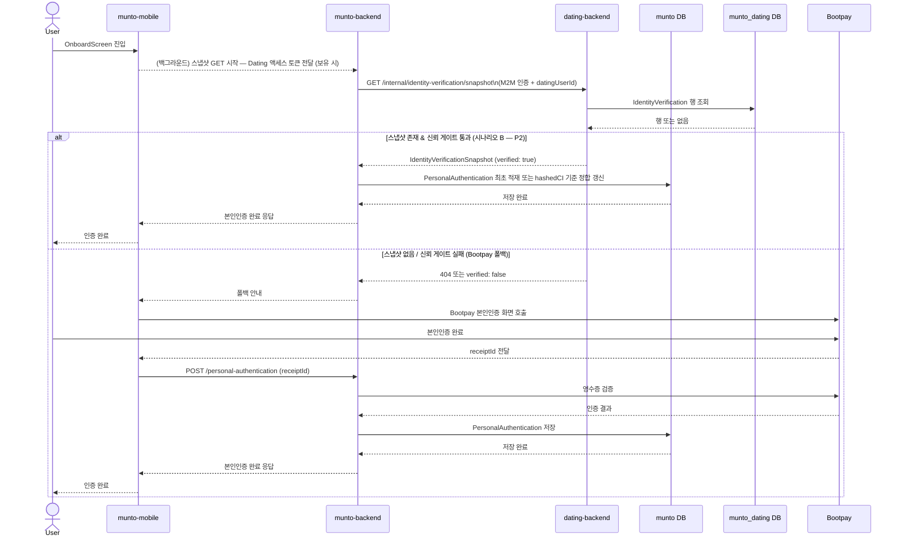
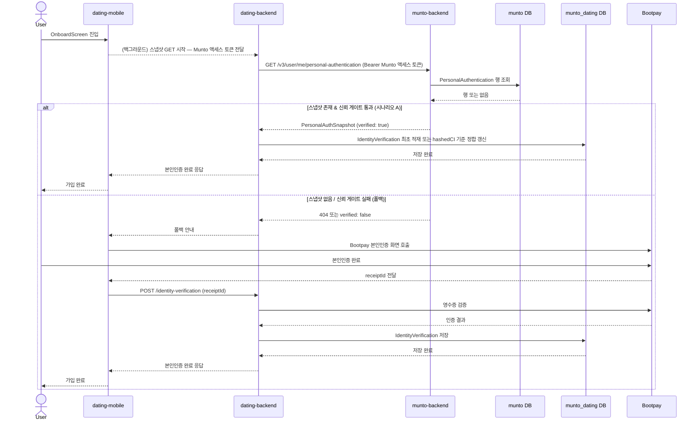
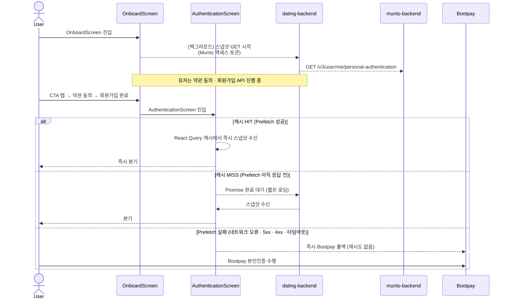
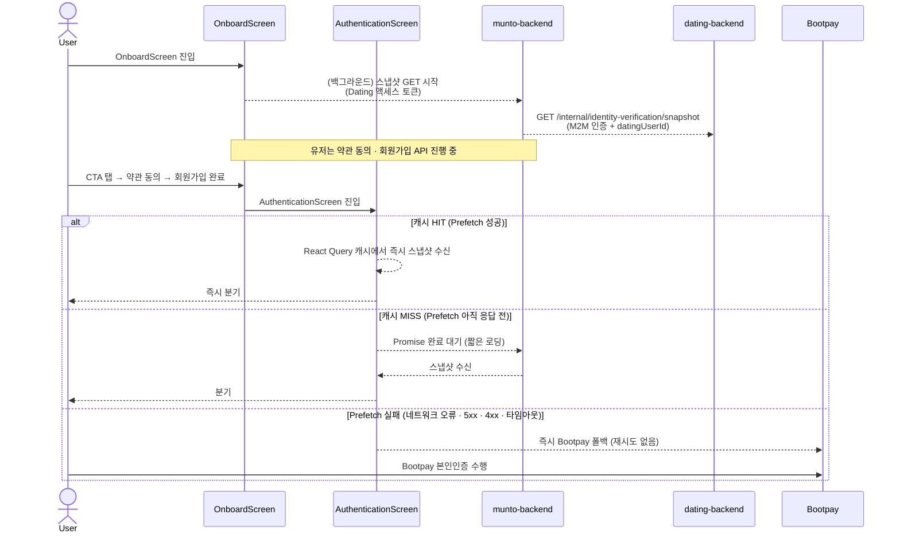
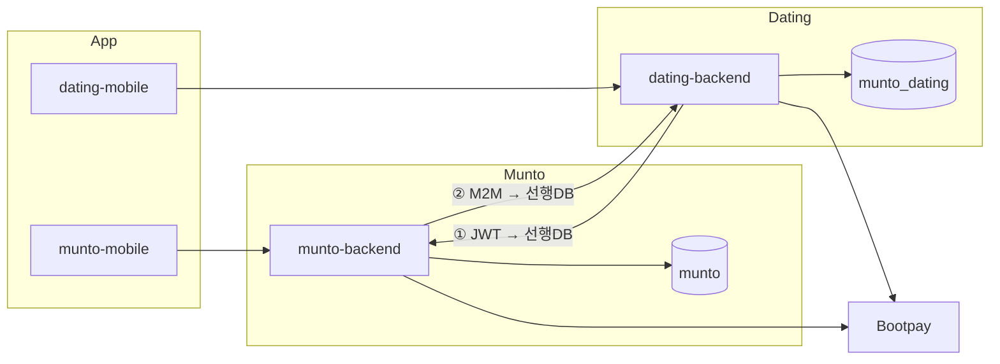
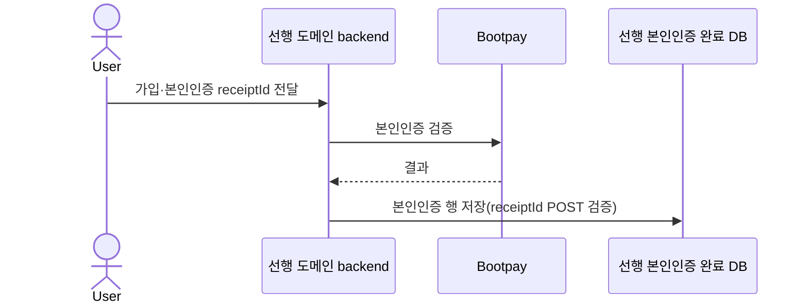
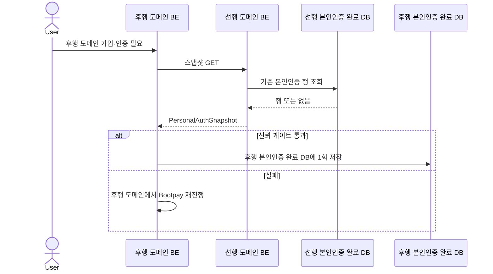

# 문토-데이팅 본인인증 정보 연동 OnePager

작성자: 김세현
최초 작성일: 2026년 4월 6일 오후 12:31
최근 수정일: 2026년 4월 9일 오후 12:20
문서 상태: Active
생성 일시: 2026년 4월 6일 오후 12:31
최종 편집자: 김세현

# **문서 제목**

**문토–데이팅 본인인증 정보 연동**

---

# **Date**

2026-04-06

---

# **Submitter Info**

김세현

---

# **Project Description**

## **배경**

- 단일 앱 안에 문토와 데이팅이 함께 제공되나, 백엔드와 데이터베이스는 **분리되어 있습니다**(`munto-backend`·`munto`, `dating-backend`·`munto_dating`). 데이터베이스 간에는 직접 연결되어 있지 않습니다.
- 이에 따라 한 도메인에서 Bootpay 본인인증을 완료하더라도 상대 도메인 데이터베이스에는 결과가 **자동으로 전달되지 않습니다**. 동일인이 다른 도메인에 진입할 경우 **본인인증을 다시 수행**하는 것이 현재(AS-IS) 흐름입니다.
- **과제:** 해당 정보를 `munto-backend`와 `dating-backend` 간 **HTTPS GET**으로 전달하여, 사용자에게 요구되는 **이중 Bootpay 본인인증을 한 차례로 줄이는 것**입니다.
- userId 통합, 서버사이드 결제 전환 안정화 등 진행 중인 작업이 있기에, 이번 연동은 과도기적 조치이며, 추후 본인인증 도메인을 통합(공유 DB 또는 별도 서비스)해 근본적인 해결책을 수행해야 합니다.

## **목표**

1. **선행:** 기존 부트페이 인증 후 발행되는`receiptId` 기반의 검증 **POST API**로, 선행 본인인증 완료 데이터베이스에 행을 기록합니다. 해당 행이 스냅샷의 단일 정보 원천(SoT)이 됩니다.
2. **후행:** 후행 본인인증·가입 흐름에서 선행 측 **스냅샷 GET** → 검증 → 후행 본인인증 완료 데이터베이스에 반영합니다. 
3. **폴백:** 스냅샷을 사용할 수 없는 경우 후행 도메인에서 Bootpay 본인인증을 **다시 진행**합니다.

## **시나리오별 목표 실행 방법**

### **시나리오 A — 문토 본인인증 선행 → 데이팅 본인인증 후행**

1. 문토: Bootpay 완료 후 클라이언트가 `receiptId`로 문토 백엔드 **POST**(검증)를 호출하고, `munto` 데이터베이스에 인증 행이 저장됩니다.
2. 데이팅:  `OnboardScreen` 진입 시 앱이 문토 액세스 토큰을 `dating-backend`에 전달하고, `dating-backend`가 해당 토큰을 `Authorization: Bearer`에 **그대로 실어** `munto-backend`에 스냅샷 **GET**을 백그라운드로 호출합니다(**앱 직접 호출 아님 — `dating-backend` 서버 간 프록시**).
    
    dating-backend는 해당 토큰의 유효성을 검증하지 않으며, 단순 전달자(pass-through)로서 동작합니다. 토큰 검증 책임은 munto-backend에 있습니다.
    
3. 문토 백엔드: `munto`를 조회한 뒤 `PersonalAuthSnapshot` 형식으로 응답합니다.
4. 데이팅 백엔드:   이미 데이팅 인증이 있는 경우(재진입 유저 등)는 아래 「재인증 시 상호 동기화 정책」에 따릅니다. 시나리오 A의 주 대상(86,701명)은 데이팅 인증 미완료 유저이므로 **최초 적재**가 정규 경로입니다. 검증, 정책 미충족/인증 없을 경우 Bootpay 폴백을 수행합니다. 

### **시나리오 B — 데이팅 본인인증 선행 → 문토 본인인증 후행**

1. 데이팅: Bootpay 검증 **POST** 후 `munto_dating`에 저장됩니다.
2. 문토: `OnboardScreen` 진입 시 앱이 데이팅 액세스 토큰을 `munto-backend`에 전달하고, `munto-backend`가 M2M 인증으로 `dating-backend` internal 스냅샷 **GET**을 백그라운드로 호출합니다(**앱이 `dating-backend`에 직접 호출하지 않음**). `datingUserId`는 **서버 연계로 확정된 값만** 허용됩니다.
3. 데이팅 백엔드: `munto_dating`을 조회한 뒤 `IdentityVerificationSnapshot` 형식으로 응답합니다. 
4. 문토 백엔드: 이미 문토 인증이 있는 경우(재진입 유저 등)는 아래 「재인증 시 상호 동기화 정책」에 따릅니다. 시나리오 B의 주 대상은 문토 인증 미완료 유저이므로 **최초 적재**가 정규 경로입니다. 검증, 정책 미충족/인증 없을 경우 Bootpay 폴백을 수행합니다.  

## **구현 범위 및 우선순위 결정**

본인인증 연동 작업은 아래 두 시나리오를 구현 범위로 포함합니다.

1. **시나리오 A** — 문토 본인인증 완료 유저의 데이팅 진입 (대상: 86,701명)
2. **시나리오 B** — 데이팅 본인인증 완료 유저의 문토 진입 (대상: 14,316명)

| **항목** | **수치** | **비고** |
| --- | --- | --- |
| 문토 본인인증 완료 유저 수 | 95,366명 | `PersonalAuthentication` 테이블 기준 |
| 데이팅 본인인증 완료 유저 수 | 22,981명 | `IdentityVerification` 테이블 기준 |
| 문토 본인인증 완료 / 데이팅 본인인증 미완료 | 86,701명 | `hashedCI` 교차 비교 기준 |
| 데이팅 본인인증 완료 / 문토 본인인증 미완료 | 14,316명 | `hashedCI` 교차 비교 기준 (시나리오 B 대상) |
| 양측 본인인증 모두 완료 | 8,665명 | `hashedCI` 교차 비교 기준 |

> *조회 기준: Prod DB / 2026-04-07 / `hashedCI` 컬럼 기반 교차 비교 (munto DB ↔ munto_dating DB)*
> 

프로덕션 DB 데이터 분석 결과, 데이팅 본인인증 완료 유저 중 문토 본인인증이 미완료된 유저가 14,316명(데이팅 본인인증 전체의 약 62%)으로 확인되었습니다. 해당 수치는 시나리오 B를 구현 범위에서 제외하기에 유의미한 규모로 판단됩니다.

이에 따라 **시나리오 A를 P1**, **시나리오 B를 P2**로 설정하여 순차적으로 진행합니다.

## **POST / GET 역할**

- **POST(본인인증 검증):** Bootpay 결과를 **당시 인증이 이루어지는 도메인 데이터베이스**에 기록합니다(OpenAPI paths 밖, 기존 API). 해당 사용자에게 **선행**인 도메인에 기록된 행이 스냅샷 **GET**의 읽기 원천이 됩니다.
- **GET(서버 간 스냅샷):** 선행 데이터베이스의 해당 행을 **조회만** 합니다. 새로운 본인인증을 생성하지 않습니다.
- **흐름 ①(Munto 스냅샷 GET):** **표준은 `dating-backend` → `munto-backend` 서버 간 호출**이며, 데이팅 백엔드가 **클라이언트가 넘긴 Munto 액세스 토큰을 `Authorization: Bearer`에 그대로 실어** 호출합니다. **단일 앱이 문토 BE에 동일 GET을 직접 호출하는 경로는 본 연동의 표준·계약 범위에 넣지 않습니다.**

---

# **Business and Marketing Justification**

중복 본인인증 제거를 통한 이탈 완화, 운영·서비스 연계 비용 절감, CS 부담 감소를 기대합니다.

---

# **Risk Assessment**

| 위험 시나리오 | 완화·대응 |
| --- | --- |
| 동일인임에도 문토·데이팅에서 `hashedCI`가 서로 다르게 산출되는 경우 | 출시 전 동일 입력에 대한 동일 해시를 검증하고, 규칙을 문서·코드에서 단일화합니다. 후행 본인인증 완료 데이터베이스에 인증이 없을 때만 1회 적재하면 상호 덮어쓰기 가능성은 낮습니다. |
| 후행 본인인증 완료 데이터베이스에 **이미 본인인증**이 존재하나 스냅샷과 내용이 다른 경우 | `hashedCI`가 **다르면** 동일인으로 보지 않으며, 데이터베이스를 **덮어쓰지 않고** Bootpay 본인인증을 진행합니다. **같으면** 동일인으로 보아 정책에 따라 스냅샷으로 정합할 수 있으며, 감사 로그를 권장합니다. |
| 데이팅이 문토에 조회하였으나 **타인** 정보가 반환되는 경우 | 문토는 요청에 포함된 **JWT가 가리키는 문토 사용자** 본인 데이터만 반환합니다. |
| 문토가 데이팅에 조회하였으나 **타인** 정보가 반환되는 경우 | 데이팅 internal 엔드포인트는 비공개이며, M2M·IP 제한을 둡니다. `datingUserId`는 클라이언트 임의 지정을 금지하고 **문토 서버가 연계로 확정한 값**만 사용합니다. |
| 실명·생년 등 정보가 **유출**되거나 **로그에 평문**으로 남는 경우 | HTTPS를 사용합니다. 응답에는 raw CI·`receipt_id`를 포함하지 않으며, 로그는 마스킹합니다. 법무·보안 검토 및 필요 시 VPC 적용을 검토합니다. |
| 상대 API가 **지연·실패**하여 가입이 완료되지 않는 경우 | 재시도·서킷 브레이커·폴백은 아래 Technical Description의  「탄력성」에 따릅니다. 원칙적으로 **GET만 멱등**하게 재시도하며, 4xx에 대해 무분별 재시도는 하지 않습니다. |
| 스냅샷을 검증 없이 저장하는 경우 | **신뢰 게이트:** `verified === true` 및 합의된 필수 필드(`hashedCI`·`name`·`birth`·`gender`) 충족 시에만 자동 저장합니다. 미충족 시 저장을 생략하고 Bootpay를 유도합니다. |
| `hashedCI` **동치**가 어긋나 오판하는 경우 | **단일 해시 파이프라인**(문토·데이팅 동일 코드 경로·테스트 벡터)과 정규화 규칙을 고정하고, 스테이징에서 **교차 검증**합니다. 세부 사항은 ERD `hashedCI` 절을 따릅니다. |
| **계정 매핑** 오류로 타인 데이터가 연결되는 경우 | 문토 `userId`와 데이팅 `userId`는 서버 측 OAuth·계정 연계 저장소에서만 확정합니다. `datingUserId`의 클라이언트 임의 지정은 금지합니다. 다계정·중복은 제품 정책 및 데이터베이스 제약으로 관리합니다. |
| M2M이 **유출·남용**되는 경우 | 키 로테이션, 환경별 키, IP/VPC, 선택적 **mTLS/HMAC**, 요청 **`X-Request-Id`**를 적용합니다. 유출 시 폐기 및 감사를 수행합니다. |

---

# **Resource and Scheduling Details**

## **범위·공수**

| 축 | 레포 | 하는 일 | h |
| --- | --- | --- | --- |
| 클라이언트 | `munto-mobile` | 기존 본인인증 플로우: Bootpay 후 `receiptId`, 문토·데이팅 경로별 Bearer·API(스냅샷·폴백) | 10 |
| 문토 BE | `munto-backend` | 스냅샷 GET·JWT 가드·DTO. **②** 시 데이팅 internal GET 소비 후 `munto` 반영 | 10 |
| 데이팅 BE | `dating-backend` | internal GET·M2M. **①** 시 문토 GET 소비 후 `munto_dating` 반영 | 10 |

---

# **Technical Description**

## **용어**

- **선행 본인인증 완료 데이터베이스:** 해당 사용자가 **먼저** Bootpay 본인인증을 완료한 쪽 PostgreSQL입니다. `receiptId` **POST**로 적재된 행이 스냅샷 **GET**의 읽기 원천입니다.
- **후행 본인인증 완료 데이터베이스:** **그 다음에** 인증 정보를 채우는 쪽 PostgreSQL입니다. 후행 백엔드가 선행 측 **GET**으로 수신한 스냅샷을 검증한 뒤, 후행 **데이터베이스에** 기록합니다.

| 흐름 | 후행 본인인증 완료 DB (수신) | 선행 본인인증 완료 DB (제공) |
| --- | --- | --- |
| ① 데이팅 BE가 문토에 JWT로 조회 | `munto_dating` | `munto` |
| ② 문토 BE가 데이팅에 M2M으로 조회 | `munto` | `munto_dating` |

## 목표

**AS-IS:** 도메인별로 개별 인증이 이루어지며 정보가 공유되지 않습니다.

**TO-BE:** 선행 **POST**로 원천을 저장한 뒤, 후행 **GET**·검증을 거쳐 후행 데이터베이스에 반영합니다. 불가능한 경우 후행에서 Bootpay를 수행합니다. 상세한 흐름은 위 시나리오 및 아래 API 표에 따릅니다.

**① (후행 본인인증 완료 DB=데이팅):** **`dating-backend`가 `munto-backend`를 서버 간 호출**합니다. `GET /v3/user/me/personal-authentication`, `Authorization: Bearer`에는 **클라이언트가 데이팅 BE에 넘긴 Munto 액세스 토큰을 그대로** 실습니다(앱이 문토에 직접 호출하지 않음).

**② (후행 본인인증 완료 DB=문토):** `munto-backend` → `dating-backend`, `GET /internal/identity-verification/users/{datingUserId}`, M2M 등.

| **① 후행 본인인증 완료 DB=데이팅** | **② 후행 본인인증 완료 DB=문토** |
| --- | --- |
| 메서드·경로 | `GET /v3/user/me/personal-authentication` |
| 호출 주체 | `dating-backend` → `munto-backend` |
| 인증 | `Authorization: Bearer`(Munto 액세스 토큰 — **데이팅 BE가 클라이언트 전달값을 프록시**) |
| 성공 본문 | `PersonalAuthSnapshot` |
| 주요 오류 | `401` JWT, `404` 미인증(정책별), `429` |

**`PersonalAuthSnapshot`:** 필수 필드는 `schemaVersion`, `verified`입니다. 선택 필드는 `hashedCI`, `name`, `birth`, `gender`(nullable)입니다. 오류 본문은 `ErrorBody`(`statusCode`, `message`, `error`) 형식입니다. 응답에는 raw CI·`receipt_id`를 포함하지 않습니다. 

### **스냅샷 GET 호출 방식**

Munto 본인인증 스냅샷 조회는**`dating-backend` → `munto-backend` 서버 간 호출**입니다. **`dating-backend`는 클라이언트가 전달한 Munto 액세스 토큰을 `Authorization: Bearer`에 그대로 실어** 해당 GET을 호출합니다. **단일 앱이 문토 BE에 동일 GET을 직접 호출하는 경로는 본 연동의 표준 범위에 포함하지 않습니다**(토큰 관리·CORS·감사 일관성).

### 문토 후행 진입 시 가입 플로우

### 데이팅 후행 진입 시 가입 플로우

스냅샷 GET은 **시나리오 A·B 모두 `OnboardScreen` 진입 시점**에 백그라운드로 선제 호출합니다.

- **시나리오 A (데이팅 후행):** **`OnboardScreen` 진입 시점에 백그라운드 Prefetch로 선제 호출합니다.** `dating-backend`가 `munto-backend`에 스냅샷 GET을 수행하며, `AuthenticationScreen` 도달 전에 응답이 캐시됩니다. 세부 정책은 아래 OnboardScreen 백그라운드 Prefetch 절을 따릅니다.
- **시나리오 B (문토 후행):** **`OnboardScreen` 진입 시점에 백그라운드 Prefetch로 선제 호출합니다.** `munto-backend`가 `dating-backend`에 스냅샷 GET을 수행하며, 본인인증 화면 도달 전에 응답이 캐시됩니다. 세부 정책은 아래 OnboardScreen 백그라운드 Prefetch 절을 따릅니다.

두 경우 모두 스냅샷 수신 및 신뢰 게이트 통과 시 Bootpay 화면 없이 바로 적재하고, 실패·부재 시 Bootpay 화면으로 진입합니다. Prefetch 도입으로 **시나리오 A·B 모두 `OnboardScreen` 진입 시점**이 실질적인 호출 기점이 되며, 각 도메인의 가입 시작 시점 및 Bootpay 화면 진입 직전은 표준 호출 시점으로 삼지 않습니다.

### **OnboardScreen 백그라운드 Prefetch — 시나리오 A·B 클라이언트 최적화**

**개요:** 시나리오 A·B 공통으로, `AuthenticationScreen`은 유저 상태에 따라 본인인증 화면 또는 다음 단계로 라우팅하는 직전 화면입니다. `AuthenticationScreen` 직전 풀스크린 라우트인 `OnboardScreen` 진입 시점에 스냅샷 GET을 백그라운드로 선제 호출(Prefetch)하면, 유저가 약관 동의·회원가입 API를 거치는 동안 응답이 도착하여 `AuthenticationScreen` 진입 시 대기 없이 즉시 분기합니다.

**요청 흐름 — 시나리오 A (데이팅 후행):**

**요청 흐름 — 시나리오 B (문토 후행):**  

### **Prefetch 결과 캐싱 범위**

`OnboardScreen`에서 시작한 스냅샷 GET 결과는 **React Query 캐시**를 통해 `AuthenticationScreen`까지 전달합니다. 별도의 전역 상태 관리 없이도 동일 `QueryClient` 인스턴스를 공유하는 두 화면 간에 결과가 자동으로 전파됩니다.

| 항목 | 값 | 비고 |
| --- | --- | --- |
| 캐싱 방식 | `queryClient.prefetchQuery` | `OnboardScreen` 마운트 시 1회 호출 |
| 쿼리 키 | 시나리오 A: `['muntoPersonalAuth', muntoAccessToken]` / 시나리오 B: `['datingPersonalAuth', datingAccessToken]` | 시나리오별로 스냅샷 요청 대상 BE가 다르므로 키를 분리합니다 |
| `staleTime` | 5분 | Onboarding 플로우 전체를 커버하기에 충분한 신선도 |
| `gcTime` | 10분 | 화면 이탈 후 가비지 컬렉션 |
| `retry` | 0 | Prefetch 레이어에서는 재시도하지 않음 (아래 실패 정책 참조) |
- **`OnboardScreen`:** `useEffect`(마운트 시 1회)에서 `queryClient.prefetchQuery`를 호출합니다.
- **`AuthenticationScreen`:** `useQuery`(또는 `useSuspenseQuery`)로 동일 쿼리 키를 구독합니다. 캐시에 데이터가 있으면 즉시 사용하고, 없으면 Suspense·로딩 상태로 잠시 대기합니다.

### **Prefetch 실패 정책**

백그라운드 Prefetch가 실패한 경우, **`AuthenticationScreen` 진입 시 재시도 없이 즉시 Bootpay 폴백**으로 전환합니다.

**이유:** Prefetch 시작 후 유저가 약관 동의·회원가입 API를 거치는 동안 이미 충분한 시간이 경과합니다. 동일 요청을 한 번 더 시도해도 서버 상황이 바뀔 가능성은 낮고, 재시도는 사용자 대기만 늘립니다.

| 조건 | `AuthenticationScreen` 동작 |
| --- | --- |
| Prefetch 성공 (캐시 HIT) | 즉시 스냅샷 검증 → 분기 |
| Prefetch 진행 중 (응답 아직 미수신) | Promise 완료까지 짧은 로딩 대기 후 분기 |
| Prefetch 실패 — 네트워크 오류 · 5xx · 타임아웃 | **재시도 없이 즉시 Bootpay 폴백** |
| Prefetch 실패 — 4xx (토큰 오류 · 미인증 등) | **재시도 없이 즉시 Bootpay 폴백** |

### **Prefetch 탄력성 정책**

Prefetch는 UX 임계 경로 밖 백그라운드 요청이므로 타임아웃을 여유 있게 설정할 수 있습니다. 단, 무한 대기 시 `AuthenticationScreen` 진입 후 무의미한 로딩이 발생하므로 상한을 설정합니다.

| 항목 | 값 | 비고 |
| --- | --- | --- |
| 연결 타임아웃 | 2 s | 앱 → 후행 BE (시나리오 A: `dating-backend` / 시나리오 B: `munto-backend` |
| 전체 응답 타임아웃 (상한) | **10 s** | 백그라운드 Prefetch 전용. 초과 시 실패로 처리하고 `AuthenticationScreen`에서 즉시 Bootpay 폴백 |
| 재시도 횟수 | **0 회** | Prefetch 실패 시 재시도하지 않음. `AuthenticationScreen`에서도 추가 재시도 없이 즉시 Bootpay |

> **참고 — 타임아웃 연쇄 한계:** 서버 간 레이어의 재시도·서킷 브레이커 정책은 `dating-backend` → `munto-backend`(시나리오 A) 및 `munto-backend` → `dating-backend`(시나리오 B)에 그대로 적용됩니다. 단, 서버 간 재시도가 필요한 최악의 경우 소요 시간은 5 s(1차) + 0.2 s(백오프) + 5 s(재시도) = **10.2 s**로, Prefetch 클라이언트 타임아웃(10 s)보다 깁니다. 이 경우 클라이언트 타임아웃이 먼저 발화하여 Prefetch는 실패로 처리되고 `AuthenticationScreen`에서 즉시 Bootpay 폴백으로 전환됩니다. Prefetch는 best-effort이므로 이 동작은 허용 범위 안에 있습니다.
> 

### **계정 식별자·매핑(시나리오 B)**

| 질문 | 답(요약) |
| --- | --- |
| 연계 저장소가 아예 없는가? | **아님.** 데이팅 DB **`UserOauthProvider`(MUNTO)** 는 **이미 존재**하고, 문토 userId로 데이팅 사용자를 찾을 **데이터는 있다**. |
| 그럼 문토 BE가 **추가로 구현**해야 하는가? | **경로 변수 `datingUserId`를 JWT만으로 채울 수 없으므로**, 아래 **(1)·(2)·(3) 중 채택한 방식에 따라 **신규 API·스키마 또는 통합 전제**가 필요하다. |
| 문토 userId = 데이팅 userId 인가? | **지금 전제(분리 DB·별도 PK)에서는 동일하다고 보지 않는다.** **userId 통합 완료 후**에는 동일 값으로 쓸 수 있다.  |

경로 **`GET .../internal/identity-verification/users/{datingUserId}`** 의 `datingUserId`는 **데이팅 PostgreSQL `User.id`**(서비스별 사용자 PK)입니다. **문토 JWT `sub`(문토 `User.id`)와 같은 숫자라고 가정하지 않습니다.**

**문토 BE의 구체 호출 경로** 

문토 BE가 요청 JWT에서 `sub`(문토 userId)를 얻은 뒤 → **데이팅** `GET .../internal/.../resolve-by-munto-user/{muntoUserId}` 등 **(신규)** 으로 M2M 호출 → 응답의 `datingUserId`로 기존 계약인 `GET .../internal/identity-verification/users/{datingUserId}` 를 호출한다. 

## **신뢰 게이트**

후행 백엔드는 수신한 스냅샷이 아래 세 조건을 **모두** 충족할 때만 자동 저장합니다. 하나라도 미충족이면 저장을 생략하고 Bootpay 폴백으로 전환합니다.

| 조건 | 기준 | 실패 시 |
| --- | --- | --- |
| ① `verified === true` | 선행 BE가 Bootpay 영수증 검증을 완료한 인증임 | Bootpay 폴백 |
| ② 필수 필드 존재 | `hashedCI`·`name`·`birth`·`gender`·`verifiedAt` 모두 non-null | Bootpay 폴백 |
| ③ `verifiedAt` 유효 기간 | `verifiedAt`으로부터 **2년 이내** (정책 합의 전 기본값) | Bootpay 폴백 |

**`verifiedAt` 정의:** 선행 도메인 BE가 Bootpay 영수증 검증을 최종 완료한 시각(ISO 8601 UTC)입니다. 스냅샷 응답에 반드시 포함하며, 후행 BE는 수신 시각이 아닌 **이 값을 기준**으로 유효 기간을 판단합니다.

**유효 기간 정책:**

| 항목 | 기본값 | 비고 |
| --- | --- | --- |
| 유효 기간 | **2년** | 1년 미만 설정은 주민등록 기반 불변 데이터에 과도한 마찰 유발 우려  |
| 만료 판단 기준 | `now() − verifiedAt > 유효 기간` | 후행 BE 수신 시점 기준 |
| 만료된 스냅샷 | 저장 생략 → Bootpay 폴백 | 재인증으로 갱신 유도 |

> `verified + 필수 필드 존재`만으로는 오래된 인증·폐기된 인증·정책 변경 전 인증도 통과합니다. `verifiedAt` 유효 기간 검사를 추가함으로써 신뢰 게이트가 실질적인 보호 기능을 갖춥니다.
> 
> 
> **유효 기간 2년 선택 근거:** ① `hashedCI`는 주민등록번호 기반 영구 식별자로 변경 빈도가 극히 낮음 ② 동일 계열사 두 도메인 간 연동이므로 외부 공유 대비 위협 수준이 낮음 ③ 「재인증 시 상호 동기화 정책」이 데이터 변경을 별도로 커버 ④ 1년 미만 설정은 안정적인 신원 데이터에 불필요한 재인증 마찰 유발. 연령 경계(미성년→성인) 재검증은 유효 기간이 아닌 별도 연령 재검증 로직으로 처리할 것을 권장. 
> 

> **참고 — 선택 필드와 게이트 기준 간 관계:** `hashedCI`·`name`·`birth`·`gender`는 `PersonalAuthSnapshot` / `IdentityVerificationSnapshot` 스키마에서 nullable 선택 필드로 정의됩니다. 신뢰 게이트(조건 ②)는 이 필드들이 **non-null**일 때만 통과를 허용합니다. nullable 허용은 스키마 수준(응답 직렬화)의 유연성이고, 신뢰 게이트는 비즈니스 정책 수준의 제약입니다. 두 계층이 다른 목적을 가지므로 이 긴장은 의도된 설계입니다.
> 

## 역할 분담

- **클라이언트 → 선행 BE:** `receiptId` **POST**로 선행 데이터베이스에 기록합니다(스냅샷 원천은 해당 행입니다).
- **서버 간:** 선행 데이터를 **GET으로만** 가져옵니다(push POST는 없습니다). 스냅샷 GET은 `dating-backend`(시나리오 A) 또는 `munto-backend`(시나리오 B)가 Bearer·M2M으로 서버 간 호출합니다. **앱이 직접 호출하는 경로는 표준 범위에 포함하지 않습니다.**
- **후행 BE:** GET 본문을 검증한 뒤 **자사 데이터베이스 트랜잭션**으로만 후행 데이터베이스를 맞춥니다.

**후행 본인인증 완료 데이터베이스 저장:** 해당 데이터베이스에 인증 레코드가 없을 때 **한 차례** 적재합니다(검증 절차는 기존 Bootpay 성공 경로와 정합됩니다). 기존 레코드와 스냅샷이 불일치하는 경우 `hashedCI`가 다르면 덮어쓰기를 금지하며, 일치하는 경우 정합 방법은 제품 정책·감사 로그로 결정합니다. 

## **재인증 시 상호 동기화 정책**

**확정:** **조건부 Pull 정합.** 한쪽에서만 Bootpay를 다시 탄 뒤 그쪽 데이터베이스는 최신이 되고, 반대쪽에는 예전 값이 남을 수 있습니다. **이벤트로 밀어주지 않으며**, 반대쪽이 **스냅샷 GET을 호출할 때**에만 선행의 최신 스냅샷과 맞춥니다.

| 단계 | 처리 |
| --- | --- |
| 후행 DB에 아직 인증이 없음 | 검증 및 신뢰 게이트 통과 시 **최초 적재**합니다. |
| 후행 DB에 이미 있음 | 스냅샷의 `hashedCI`와 후행 저장값을 비교합니다. |
| **같음** | 동일인으로 보고, 스냅샷 필드로 후행 쪽 PII·해시 관련 컬럼을 **정합 갱신**합니다(이름·생년 등 정책에 맞게). **감사 로그**를 권장합니다. |
| **다름** | 다른 신원으로 보고 무작정 덮어쓰지 않습니다. 기존 Risk와 같이 Bootpay·수동 확인 등 기존 정책을 따릅니다. |

**이유:** push 인프라 없이 구현할 수 있으며, 선행이 바뀐 뒤에도 **다음에 후행 플로우가 열릴 때** 한 번에 맞출 수 있습니다. 재인증이 드물어도 규칙이 비어 있지 않습니다. **이벤트 기반 동기화**는 본 범위에서 **도입하지 않으며**, 필요 시 별도 과제로 검토합니다.

**정책 선택(명시):** 본 설계는 **이벤트 기반 갱신이 아니라**, **후행 측이 스냅샷 GET을 다시 수행하는 시점**(후행 재접속·해당 백엔드 플로우 진입 등)에 **재조회·조건부 Pull 정합**으로 맞춥니다. **재인증 직후 상대 DB로의 실시간 반영은 하지 않습니다.**

**예시(개명 후 문토에서만 재인증):** 문토 선행 DB는 최신 이름이고, 데이팅 후행 DB는 **다음 GET이 호출되기 전까지** 이전 이름을 유지할 수 있습니다. 이는 “영구 무시”가 아니라, **동기화 트리거가 Pull 한 번뿐**이기 때문입니다. 이후 데이팅 백엔드가 문토 스냅샷 GET을 다시 호출하고 `hashedCI`가 동일하면 **정합 갱신**으로 개명이 반영됩니다.

**폴백:** 스냅샷 부재, API 오류, 타임아웃, 검증 실패 시 후행 도메인에서 Bootpay를 수행합니다.

**보안:** JWT·M2M 검증, 최소 필드 노출, 로그 마스킹을 적용합니다.

## **아키텍처**

## **시퀀스: 선행 본인인증 완료 DB에 Bootpay로 본인인증 데이터 저장**

## **시퀀스: 후행 본인인증 완료 DB 측이 선행 본인인증 완료 DB에서 스냅샷 수신**

### **API 명세**

[문토-데이팅 본인인증 연동 API 명세](https://www.notion.so/API-33ae2bc7639d802aaa43d1e7d2db1cca?pvs=21)

[문토-데이팅 본인인증 스냅샷 필드](https://www.notion.so/33be2bc7639d80969f78e6cb9cb0365b?pvs=21)

---

## **변경 이력**

| 버전 | 일자 | 변경 내용 |
| --- | --- | --- |
| v1.1.0 | 2026-04-06 | 최초 생성 |
| v1.1.1 | 2026-04-09  | 피드백 반영 |