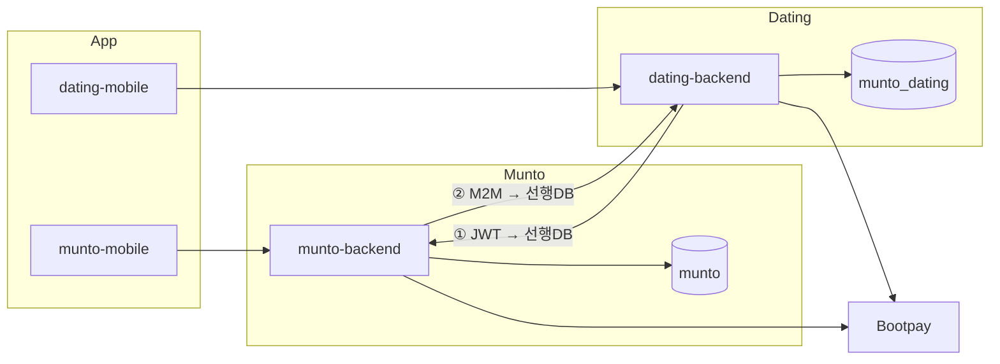
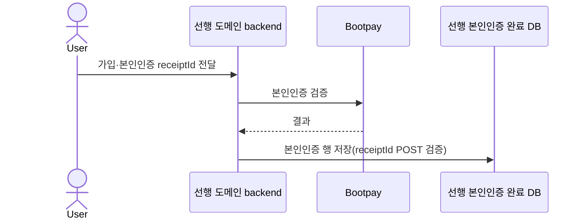
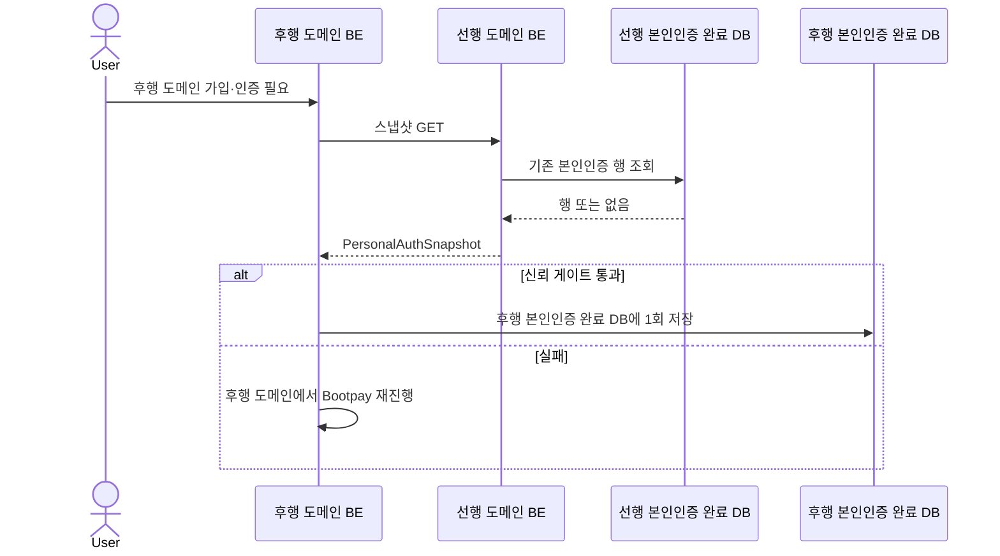

# 문토-데이팅 본인인증 정보 연동 OnePager

작성자: 김세현
최초 작성일: 2026년 4월 6일 오후 12:31
최근 수정일: 2026년 4월 7일 오후 1:00
문서 상태: Active
생성 일시: 2026년 4월 6일 오후 12:31
최종 편집자: 김범진

# **문서 제목**

**문토–데이팅 본인인증 정보 연동**

---

# **Date**

2026-04-06

---

# **Submitter Info**

김세현

---

# **Project Description**

## **배경**

- 단일 앱 안에 문토와 데이팅이 함께 제공되나, 백엔드와 데이터베이스는 **분리되어 있습니다**(`munto-backend`·`munto`, `dating-backend`·`munto_dating`). 데이터베이스 간에는 직접 연결되어 있지 않습니다.
- 이에 따라 한 도메인에서 Bootpay 본인인증을 완료하더라도 상대 도메인 데이터베이스에는 결과가 **자동으로 전달되지 않습니다**. 동일인이 다른 도메인에 진입할 경우 **본인인증을 다시 수행**하는 것이 현재(AS-IS) 흐름입니다.
- **과제:** 해당 정보를 `munto-backend`와 `dating-backend` 간 **HTTPS GET**으로 전달하여, 사용자에게 요구되는 **이중 Bootpay 본인인증을 한 차례로 줄이는 것**입니다.

## **목표**

1. **선행:** 기존 부트페이 인증 후 발행되는`receiptId` 기반의 검증 **POST API**로, 선행 본인인증 완료 데이터베이스에 행을 기록합니다. 해당 행이 스냅샷의 단일 정보 원천(SoT)이 됩니다.
2. **후행:** 후행 본인인증·가입 흐름에서 선행 측 **스냅샷 GET** → 검증 → 후행 본인인증 완료 데이터베이스에 반영합니다. 
3. **폴백:** 스냅샷을 사용할 수 없는 경우 후행 도메인에서 Bootpay 본인인증을 **다시 진행**합니다.

## **시나리오별 목표 실행 방법**

### **시나리오 A — 문토 본인인증 선행 → 데이팅 본인인증 후행**

1. 문토: Bootpay 완료 후 클라이언트가 `receiptId`로 문토 백엔드 **POST**(검증)를 호출하고, `munto` 데이터베이스에 인증 행이 저장됩니다.
2. 데이팅: 동일 사용자가 데이팅에 진입할 때 문토 스냅샷 **GET**(`Authorization: Bearer` 문토 JWT)을 수행합니다.
3. 문토 백엔드: `munto`를 조회한 뒤 `PersonalAuthSnapshot` 형식으로 응답합니다.
4. 데이팅 백엔드: 검증 및 정책을 충족하는 경우 `munto_dating`에 **한 차례** 저장합니다. 그렇지 않으면 Bootpay 등 **폴백**을 수행합니다.

### **시나리오 B — 데이팅 본인인증 선행 → 문토 본인인증 후행**

1. 데이팅: Bootpay 검증 **POST** 후 `munto_dating`에 저장됩니다.
2. 문토 백엔드: 후행 진입 시 데이팅 internal 스냅샷 **GET**(M2M)을 호출합니다. `datingUserId`는 **서버 연계로 확정된 값만** 허용됩니다.
3. 문토 백엔드: 검증 후 `munto`에 반영합니다. 실패 시 Bootpay 등 **폴백**을 수행합니다.

## **POST / GET 역할**

- **POST(본인인증 검증):** Bootpay 결과를 **당시 인증이 이루어지는 도메인 데이터베이스**에 기록합니다(OpenAPI paths 밖, 기존 API). 해당 사용자에게 **선행**인 도메인에 기록된 행이 스냅샷 **GET**의 읽기 원천이 됩니다.
- **GET(서버 간 스냅샷):** 선행 데이터베이스의 해당 행을 **조회만** 합니다. 새로운 본인인증을 생성하지 않습니다.

---

# **Business and Marketing Justification**

중복 본인인증 제거를 통한 이탈 완화, 운영·서비스 연계 비용 절감, CS 부담 감소를 기대합니다.

---

# **Risk Assessment**

| 위험 시나리오 | 완화·대응 |
| --- | --- |
| 동일인임에도 문토·데이팅에서 `hashedCI`가 서로 다르게 산출되는 경우 | 출시 전 동일 입력에 대한 동일 해시를 검증하고, 규칙을 문서·코드에서 단일화합니다. 후행 본인인증 완료 데이터베이스에 인증이 없을 때만 1회 적재하면 상호 덮어쓰기 가능성은 낮습니다. |
| 후행 본인인증 완료 데이터베이스에 **이미 본인인증**이 존재하나 스냅샷과 내용이 다른 경우 | `hashedCI`가 **다르면** 동일인으로 보지 않으며, 데이터베이스를 **덮어쓰지 않고** Bootpay 본인인증을 진행합니다. **같으면** 동일인으로 보아 정책에 따라 스냅샷으로 정합할 수 있으며, 감사 로그를 권장합니다. |
| 데이팅이 문토에 조회하였으나 **타인** 정보가 반환되는 경우 | 문토는 요청에 포함된 **JWT가 가리키는 문토 사용자** 본인 데이터만 반환합니다. |
| 문토가 데이팅에 조회하였으나 **타인** 정보가 반환되는 경우 | 데이팅 internal 엔드포인트는 비공개이며, M2M·IP 제한을 둡니다. `datingUserId`는 클라이언트 임의 지정을 금지하고 **문토 서버가 연계로 확정한 값**만 사용합니다. |
| 실명·생년 등 정보가 **유출**되거나 **로그에 평문**으로 남는 경우 | HTTPS를 사용합니다. 응답에는 raw CI·`receipt_id`를 포함하지 않으며, 로그는 마스킹합니다. 법무·보안 검토 및 필요 시 VPC 적용을 검토합니다. |
| 상대 API가 **지연·실패**하여 가입이 완료되지 않는 경우 | 재시도·서킷 브레이커·폴백은 아래 Technical 「탄력성」에 따릅니다. 원칙적으로 **GET만 멱등**하게 재시도하며, 4xx에 대해 무분별 재시도는 하지 않습니다. |
| 스냅샷을 검증 없이 저장하는 경우 | **신뢰 게이트:** `verified === true` 및 합의된 필수 필드(`hashedCI`·`name`·`birth`·`gender`) 충족 시에만 자동 저장합니다. 미충족 시 저장을 생략하고 Bootpay를 유도합니다. |
| `hashedCI` **동치**가 어긋나 오판하는 경우 | **단일 해시 파이프라인**(문토·데이팅 동일 코드 경로·테스트 벡터)과 정규화 규칙을 고정하고, 스테이징에서 **교차 검증**합니다. 세부 사항은 ERD `hashedCI` 절을 따릅니다. |
| **계정 매핑** 오류로 타인 데이터가 연결되는 경우 | 문토 `userId`와 데이팅 `userId`는 서버 측 OAuth·계정 연계 저장소에서만 확정합니다. `datingUserId`의 클라이언트 임의 지정은 금지합니다. 다계정·중복은 제품 정책 및 데이터베이스 제약으로 관리합니다. |
| M2M이 **유출·남용**되는 경우 | 키 로테이션, 환경별 키, IP/VPC, 선택적 **mTLS/HMAC**, 요청 **`X-Request-Id`**를 적용합니다. 유출 시 폐기 및 감사를 수행합니다. |

---

# **Resource and Scheduling Details**

## **범위·공수(합의)**

| 축 | 레포 | 하는 일 | h |
| --- | --- | --- | --- |
| 클라이언트 | `munto-mobile` | 기존 본인인증 플로우: Bootpay 후 `receiptId`, 문토·데이팅 경로별 Bearer·API(스냅샷·폴백) | 10 |
| 문토 BE | `munto-backend` | 스냅샷 GET·JWT 가드·DTO. **②** 시 데이팅 internal GET 소비 후 `munto` 반영 | 10 |
| 데이팅 BE | `dating-backend` | internal GET·M2M. **①** 시 문토 GET 소비 후 `munto_dating` 반영 | 10 |

---

# **Technical Description**

## **용어**

- **선행 본인인증 완료 데이터베이스:** 해당 사용자가 **먼저** Bootpay 본인인증을 완료한 쪽 PostgreSQL입니다. `receiptId` **POST**로 적재된 행이 스냅샷 **GET**의 읽기 원천입니다.
- **후행 본인인증 완료 데이터베이스:** **그 다음에** 인증 정보를 채우는 쪽 PostgreSQL입니다. 후행 백엔드가 선행 측 **GET**으로 수신한 스냅샷을 검증한 뒤, 후행 **데이터베이스에** 기록합니다.

| 흐름 | 후행 본인인증 완료 DB (수신) | 선행 본인인증 완료 DB (제공) |
| --- | --- | --- |
| ① 데이팅 BE가 문토에 JWT로 조회 | `munto_dating` | `munto` |
| ② 문토 BE가 데이팅에 M2M으로 조회 | `munto` | `munto_dating` |

## 목표

**AS-IS:** 도메인별로 개별 인증이 이루어지며 정보가 공유되지 않습니다.

**TO-BE:** 선행 **POST**로 원천을 저장한 뒤, 후행 **GET**·검증을 거쳐 후행 데이터베이스에 반영합니다. 불가능한 경우 후행에서 Bootpay를 수행합니다. 상세한 흐름은 위 시나리오 및 아래 API 표에 따릅니다.

|  | **① 후행 본인인증 완료 DB=데이팅** | **② 후행 본인인증 완료 DB=문토** |
| --- | --- | --- |
| 메서드·경로 | `GET /v3/user/me/personal-authentication` | `GET /internal/identity-verification/users/{datingUserId}` |
| 호출 주체 | `dating-backend` → `munto-backend` | `munto-backend` → `dating-backend` |
| 인증 | `Authorization: Bearer`(문토 사용자 JWT) | `X-Internal-Api-Key`(M2M, VPC·IP 제한 등) |
| 성공 본문 | `PersonalAuthSnapshot` | 동일 |
| 주요 오류 | `401` JWT, `404` 미인증(정책별), `429` | `401`/`403` M2M·권한, `404`, `429` |

**`PersonalAuthSnapshot`:** 필수 필드는 `schemaVersion`, `verified`입니다. 선택 필드는 `hashedCI`, `name`, `birth`, `gender`(nullable)입니다. 오류 본문은 `ErrorBody`(`statusCode`, `message`, `error`) 형식입니다. 응답에는 raw CI·`receipt_id`를 포함하지 않습니다.

## 역할 분담

- **클라이언트 → 선행 BE:** `receiptId` **POST**로 선행 데이터베이스에 기록합니다(스냅샷 원천은 해당 행입니다).
- **서버 간:** 선행 데이터를 **GET으로만** 가져옵니다(push POST는 없습니다). 문토 스냅샷 경로는 앱이 Bearer로 직접 호출할 수 있으며, 데이팅 측은 일반적으로 백엔드를 경유합니다.
- **후행 BE:** GET 본문을 검증한 뒤 **자사 데이터베이스 트랜잭션**으로만 후행 데이터베이스를 맞춥니다.

**후행 본인인증 완료 데이터베이스 저장:** 해당 데이터베이스에 인증 레코드가 없을 때 **한 차례** 적재합니다(검증 절차는 기존 Bootpay 성공 경로와 정합됩니다). 기존 레코드와 스냅샷이 불일치하는 경우 `hashedCI`가 다르면 덮어쓰기를 금지하며, 일치하는 경우 정합 방법은 제품 정책·감사 로그로 결정합니다.

**폴백:** 스냅샷 부재, API 오류, 타임아웃, 검증 실패 시 후행 도메인에서 Bootpay를 수행합니다.

**보안:** JWT·M2M 검증, 최소 필드 노출, 로그 마스킹을 적용합니다.

## **아키텍처**

## **시퀀스: 선행 본인인증 완료 DB에 Bootpay로 본인인증 데이터 저장**

## **시퀀스: 후행 본인인증 완료 DB 측이 선행 본인인증 완료 DB에서 스냅샷 수신**

### **API 명세**

[문토-데이팅 본인인증 연동 API 명세](https://www.notion.so/API-33ae2bc7639d802aaa43d1e7d2db1cca?pvs=21)

[문토-데이팅 본인인증 스냅샷 필드 ](https://www.notion.so/33be2bc7639d80969f78e6cb9cb0365b?pvs=21)

---

## **변경 이력**

| 버전 | 일자 | 변경 내용 |
| --- | --- | --- |
| v1.1.0 | 2026-04-06 | 최초 생성 |