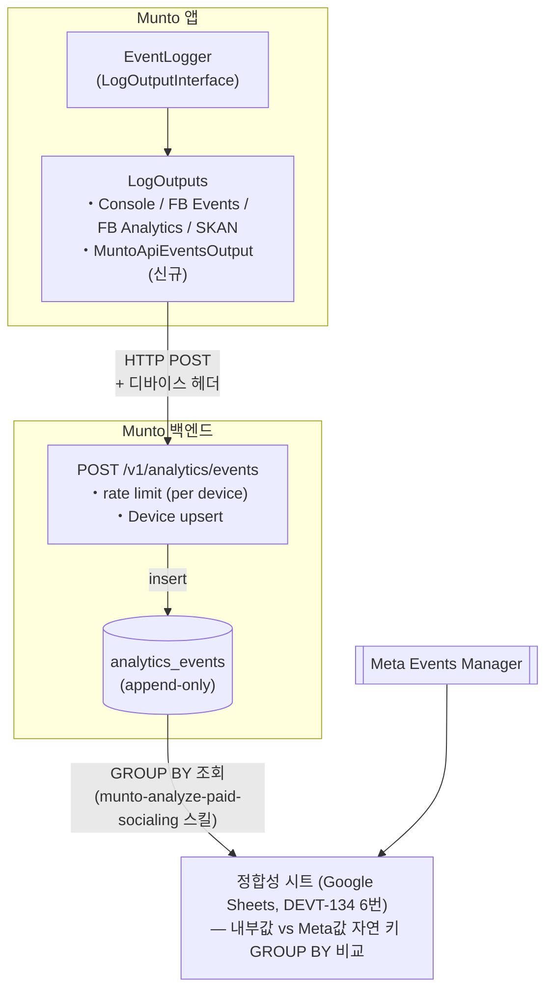

# 내부 5종 표준 이벤트 백엔드 적재·플랫폼별 정합성 검증 인프라 구축 OnePager

분류: SRS
작성자: 김범진
최초 작성일: 2026년 5월 18일 오후 12:10
최근 수정일: 2026년 5월 18일 오후 3:15
문서 상태: Active
생성 일시: 2026년 5월 18일 오후 12:10
최종 편집자: 김범진

Project Description : 

Munto 앱이 발생시키는 회원가입·유료 소셜링 조회·좋아요·결제 시작·구매 5종 표준 이벤트는 현재 외부 분석 SDK(Facebook App Events, Firebase Analytics)로만 송신되고 문토 백엔드 DB에는 적재되지 않아, Meta 이벤트 매니저 수치와 내부 집계값 사이에 차이가 발생해도 원인을 진단할 데이터가 없는 상태다. 또한 내부 이벤트는 안드로이드·iOS를 구분하지 않고 합산되어 Meta(플랫폼별 보고)와 1:1 매칭이 불가하다. 본 프로젝트는 모바일 로거 인프라(`LogOutputInterface`)에 새 `MuntoApiEventsOutput`을 추가해 5종 이벤트를 문토 API로 전송·DB에 적재함으로써, 플랫폼·앱 버전별 정합성 검증과 광고 측정 정확도 분석을 가능하게 한다.

Business and Marketing Justification :

**주요 목표**

1. **DEVT-134 측정 정합성 회복 KPI 기반 인프라 제공** — 정합성 모니터링 시트가 비교할 "내부 진실 데이터(ground truth)"를 SQL 기반으로 산출 가능하게 만들어, 일별 차이 ±15% 이내 목표 달성의 기초를 마련한다.
2. **Meta-내부 차이 원인 진단** — 차이가 발생하는 이벤트·플랫폼·앱 버전·시점을 구분해 분석할 수 있어, 이중 발화·트리거 시점 차이·플랫폼별 누락 등 원인을 데이터로 특정한다.
3. **플랫폼별 광고 캠페인 의사결정 정밀도 향상** — iOS·Android 구분 집계로 매체별·OS별 ROAS 비교가 가능해져 캠페인 배분·소재 최적화 결정에 활용된다.
4. **다매체 확장 기반** — Meta 외 Google Ads 등과의 attribution 비교도 동일 인프라로 확장 가능하다.

**배경**

- DEVT-134(Meta 광고 측정 인프라 원점 재설계) 트랙 6번 작업("정합성 모니터링 시트 자동화 — 내부 DB 일별 + Meta Insights API")의 전제 인프라가 본 프로젝트의 산출물이다. 현재 정합성 시트는 회원가입·결제완료 등 일부 이벤트만 SQL로 산출 가능하고, 조회·좋아요·결제 시작은 내부 DB에 기록이 없어 비교 자체가 불가하다.
- APPF-844로 facebook_app_events 0.27.2 업그레이드 + Meta Graph API v24 대응이 완료되었으므로, 외부 SDK 송신은 정상화된 상태에서 내부 측 ground truth 구축으로 넘어가는 자연스러운 다음 단계다.
- 현 모바일 로거(`munto-mobile-core/lib/src/logger/`)는 이미 `LogOutputInterface`를 통해 다중 출력(Console/Firebase Crashlytics/Firebase Analytics/Facebook App Events/SKAdNetwork)을 운용 중이라 새 Output 추가가 기존 코드 패턴에 그대로 흡수된다.

Risk Assessment :

| **리스크** | **대응** |
| --- | --- |
| 5종 이벤트 즉시 발송으로 백엔드 트래픽이 일별 N만 건 늘어 부하 증가 | 1차 launch는 5종으로 한정. 활성 사용자당 일 평균 발생 빈도가 낮아 즉시 발송으로도 수용 가능 범위.  rate limiting(per device 분당 200건) 적용. |

Resource and Scheduling Details : 

- 인력 — 1명 (백엔드·모바일 풀스택)

| **일정** | **작업** |
| --- | --- |
| Day 1 | 백엔드 — `analytics_events` 테이블 + Prisma 모델, `DeviceUpsertService` 공통 추출(`UserDeviceLogService.recordLogin` 리팩토링) |
| Day 2 | 백엔드 — `POST /v1/analytics/events` endpoint, dedup·rate limiting, BullMQ 비동기 적재 |
| Day 3 | 모바일 — `MuntoApiEventsOutput` 구현(`LogOutputInterface`), 5종 화이트리스트, fire-and-forget 송신, 자연 키(socialing_id·order_id) 페이로드 매핑 |
| Day 4 | 통합 검증 — 5종 이벤트 dev 환경 end-to-end 테스트, dedup 동작 확인, Meta 이벤트 매니저와 자연 키 GROUP BY 비교 |
| Day 5 | 일별 파티셔닝·retention 설정, `munto-analyze-paid-socialing` 스킬에 GROUP BY 쿼리 추가하여 정합성 시트(DEVT-134 6번 작업) 연결 |

Technical Description :

### **1. 시스템 개요**

모바일 로거(`LogOutputInterface`)에 신규 `MuntoApiEventsOutput`을 추가하여 5종 표준 이벤트를 즉시 백엔드로 송신, `analytics_events` 테이블에 행위 단위로 append-only 적재한다. 백엔드는 `RequestContextService`로 디바이스 헤더에서 컨텍스트 추출 후 `Device` upsert, 자연 키(`user_id`·`socialing_id`·`order_id`)를 명시 컬럼으로 저장. 정합성 시트는 `munto-analyze-paid-socialing` 스킬이 `analytics_events`를 GROUP BY로 직접 조회하여 채움 (별도 view 없음). 자연 키 컬럼으로 중복 집계(`COUNT(*)`)·유니크 집계(`COUNT(DISTINCT ...)`) 양쪽 분석 가능.



### **2. 데이터 흐름**

| **단계** | **처리** |
| --- | --- |
| ① 이벤트 발생 | 모바일 로직이 `logger.logEvent(name, params)` 호출 |
| ② Output 분기 | 등록된 모든 `LogOutput`에 전달. `MuntoApiEventsOutput`은 5종 화이트리스트 통과 시에만 송신 |
| ③ 페이로드 구성 | `event_name`, 자연 키(`user_id`·`socialing_id`·`order_id` 중 해당 이벤트에 적용되는 것), `parameters`(부가 정보). 시각은 백엔드 수신 시점에 `createdAt @default(now())`로 자동 기록 |
| ④ HTTP 송신 | `Dio.post('/v1/analytics/events', payload)` — `DeviceHeaderInterceptor`가 디바이스 헤더 자동 첨부 |
| ⑤ 백엔드 수신 | JWT에서 `userId`, 헤더에서 `deviceUniqueId`·platform·appVersion·attEnabled 추출 |
| ⑥ Device upsert | `DeviceUpsertService` 공통 메서드로 `Device.id` 획득 |
| ⑦ 적재 | append-only (dedup 없음 — ms 단위로 자연 unique). 동기 응답 후 비동기 큐(BullMQ)로 DB write |
| ⑧ 집계 | 별도 view 없음 — 정합성 시트 갱신 시점에 raw 테이블에서 GROUP BY로 직접 조회 |
| ⑨ 정합성 비교 | `munto-analyze-paid-socialing` 스킬이 view × Meta Insights API로 diff 계산 |

**`DeviceHeaderInterceptor` 헤더 활용** (`munto-mobile-core/lib/src/network/interceptors/device_header_interceptor.dart` — 모든 Dio 요청에 자동 첨부, 본 프로젝트 별도 변경 없음):

| **헤더** | **본 프로젝트 활용** |
| --- | --- |
| `User-Agent` | platform·appVersion 파싱 (보조) |
| `x-device-id` | `Device.deviceUniqueId` upsert key + rate limiting key |
| `x-device-info` (JSON: platform, osVersion, model, appVersion) | platform·appVersion·osVersion 추출 메인 소스 |
| `x-att-enabled` | `attEnabled` 컬럼 적재 (ATT 상태별 attribution 분석) |

### **3. 설계 결정**

| **#** | **결정** | **A안** | **B안** | **채택** | **핵심 근거** |
| --- | --- | --- | --- | --- | --- |
| D1 | 모바일 전송 방식 | 즉시 발송 (이벤트당 1 요청) | 로컬 큐 + 배치 (20건/10초) | **A** | 5종 한정·발생 빈도 낮음, 디버깅·구현 단순. 상세는 §3.1 |
| D2 | `userId` 저장 방식 | int 컬럼만 (FK 없음) | `User` FK (relation) | **A** | 분석 테이블 베스트 프랙티스 — append-only 대용량, FK 검증 overhead 회피. `ActionLog`·`MarketingEvent`는 트랜잭션성 로그라 FK 사용하지만 본 프로젝트와 성격 다름. application 코드에서 user 조회 거의 없음(적재만 함), 분석은 view·raw SQL JOIN으로 처리 |
| D3 | `deviceId` 저장 방식 | `Device.id` 값만 BigInt 컬럼 (FK 없음) | `Device` FK (relation) | **A** | D2와 같은 분석 테이블 베스트 프랙티스. `DeviceUpsertService`로 얻은 `Device.id`를 컬럼에 그대로 저장. platform 조회는 분석 쿼리에서 raw JOIN으로 처리 |
| D4 | `platform` 저장 방식 | Device JOIN으로 조회 | denormalized 컬럼 보관 | **A** | `Device.deviceType`이 이미 'IOS'/'ANDROID' 보관 — 진실 단일화. deviceType은 변경되지 않으므로 snapshot 의미 약함. PK FK JOIN 비용 무시 가능 |
| D5 | 이벤트 식별 키 | 자연 키 컬럼화 (`user_id`·`socialing_id`·`order_id` 분리, `client_event_id` 없음, append-only) | `client_event_id` 합성 키 + unique dedup | **A** | (1) ms까지 같은 (user·device·event·socialing/order) 조합은 사실상 발생 불가 → 자연 unique. (2) fire-and-forget 채택으로 모바일 재시도 없음 → dedup 의미 약함. (3) 자연 키 컬럼화로 중복 집계(`COUNT(*)`) + 유니크 집계(`COUNT(DISTINCT user_id 또는 socialing_id)`) 양쪽 분석 가능. (4) Meta CAPI 매트릭스 키와 join 시에도 동일 자연 키 GROUP BY로 매칭. 상세는 §7 |
| D6 | 백엔드 적재 동기성 | 202 Accepted + BullMQ 비동기 적재 | 동기 DB write | **A** | 응답 지연 최소화, 모바일 사용성 보호. 검증·dedup만 동기 |

### **3.1 D1 상세 — 모바일 전송 방식 A/B 비교**

| **항목** | **A안 — 즉시 발송 (채택 ★)** | **B안 — 로컬 큐 + 배치 발송** |
| --- | --- | --- |
| 동작 | `writeEvent()` 호출 시점에 바로 `POST /v1/analytics/events` 호출 (단일 객체 페이로드) | SharedPreferences 로컬 큐에 적재, 20건 또는 10초마다 배치로 일괄 발송 |
| 모바일 복잡도 | 낮음 — 큐·배치·lifecycle 관리 코드 불필요 | 높음 — SharedPreferences 의존성·TTL·queue overflow·`AppLifecycleState.paused/detached` flush 필요 |
| 백엔드 트래픽 | 이벤트 발생당 1 요청 | 사용자당 분당 1~6 요청 수준으로 감소 |
| 네트워크 실패 시 손실 | 가능 — fire-and-forget으로 즉시 폐기 (외부 SDK가 동일 이벤트 별도 채널 송신하므로 정합성 비교 자체는 영향 적음) | 거의 없음 — 큐가 재시작·백그라운드 전환을 살아남음 |
| 백엔드 부하 | 5종 한정 + rate limit으로 흡수 가능 | 더 낮음 |
| Meta 이벤트와 timing skew | 거의 없음 | 최대 10초 + 배치 size 분 지연 |
| 디버깅·관측 | 쉬움 — 이벤트와 요청이 1:1 | 어려움 — 어느 이벤트가 어느 배치에서 손실됐는지 추적 필요 |

**채택 = A안**. 손실율을 운영 단계에서 모니터링하여 임계치(예: 1%) 초과 시 B안 전환 재검토.

**A안 모바일 세부 구현 결정**:

- **화이트리스트**: 5종(`complete_registration`·`view_paid_socialing`·`add_to_cart`·`begin_checkout`·`purchase`)만 통과
- **fire-and-forget**: `writeEvent()`는 `Future<void>` 즉시 반환, 백그라운드 송신. 실패 시 재시도 없이 폐기 + 디버그 로그. 운영 손실율 임계치(예: 1%) 초과 시 재시도/큐 도입 재검토

### **3.2 D4 상세 — `platform` 저장 방식 A/B 비교**

| **항목** | **A안 — Device JOIN (채택 ★)** | **B안 — denormalized 컬럼 보관** |
| --- | --- | --- |
| 스토리지 | 컬럼 없음 → `Device.deviceType` JOIN | `analytics_events.platform` 컬럼 추가 |
| 진실 출처 | 단일 (`Device.deviceType`) | 두 곳 (이벤트 row + Device row) |
| 쿼리 성능 | PK FK JOIN, Device 테이블 작음(수만~수십만), hash join으로 ms 단위 | 단일 테이블 스캔 (JOIN 없음) |
| 시점 보존 | 불필요 — deviceType은 변경되지 않음 | snapshot 보존되나 의미 없음 |
| 운영 편의 | 분석 쿼리에서 JOIN 1회 명시 필요 | 단일 테이블이라 간단 |

**채택 = A안**. PK FK JOIN 비용이 무시 가능하고, deviceType이 불변이라 snapshot 의미가 없음. 진실 단일화 이점이 더 큼.

### **4. 외부 시스템 관계 매트릭스**

| **시스템** | **위치** | **현재 상태** | **본 프로젝트와의 관계** | **본 프로젝트가 가하는 변경** |
| --- | --- | --- | --- | --- |
| **`MetaConversionsService`** (Meta CAPI) | `apps/api/src/meta/meta-conversions.service.ts` | `META_CAPI_ENABLED=false` 비활성. 5종 메서드(`sendCompleteRegistrationEvent`·`sendViewContent`·`sendAddToCart`·`sendInitiateCheckout`·`sendPurchase`) + 도메인 와이어링(`auth-user.v2`/`order.v2-v3`/`socialing.v4-v5`) 완료. DEVT-134 옵션 C에서 재가동 예정 | **책임 분리** — 본 프로젝트는 내부 자연 키 컬럼 적재, Meta 외부 송신은 CAPI가 도메인 트랜잭션 시점에 DEVT-134 매트릭스 키(`{event}_{natural_key}`)로 직접 호출. 정합성 시트는 자연 키 GROUP BY로 join. 자세한 근거는 §4.1 | 변경 없음 |
| **`POST /api/v5/socialing/action-logs`** (SocialingActionLog) | `apps/api/src/socialing/v5/controller/socialing.v5.controller.ts` | 소셜링 상세 페이지 이탈 경고용. enum 3종(`EXIT`/`VISIT_OTHER`/`CONTINUE`). `socialingId` required | **도메인·스키마 다름** — 확장 안 함, 신규 endpoint·테이블 신설. 자세한 근거는 §4.2 | 변경 없음 |
| **`UserDeviceLogService.recordLogin`** | `apps/api/src/auth/user-device-log.service.ts` | 로그인 시 헤더 `x-device-id` → `Device.deviceUniqueId` upsert + `UserDeviceLog` INSERT | **동일 Device upsert 인프라 재사용** — 본 프로젝트 endpoint도 같은 upsert 필요 | `DeviceUpsertService`로 공통 메서드 추출하여 두 곳이 공유. `recordLogin`은 추출된 메서드 호출로 단순 리팩토링 |
| **`DeviceHeaderInterceptor`** | `munto-mobile-core/lib/src/network/interceptors/device_header_interceptor.dart` | 모든 Dio 요청에 디바이스 헤더(`User-Agent`·`x-device-id`·`x-device-info`·`x-att-enabled`) 자동 첨부 | 백엔드가 헤더에서 컨텍스트 추출 (별도 페이로드 불필요) | 변경 없음 |
| **`FacebookEventsOutput`·`FirebaseAnalyticsOutput`** 등 기존 LogOutput | `lib/core/logger/outputs/` | 외부 SDK(Facebook/Firebase) 송신 | **동일 `LogOutputInterface` 구현체로 동등 위치 추가** — `MuntoApiEventsOutput`도 같은 인터페이스, 같은 등록 메커니즘 | 변경 없음 (새 Output 1개 추가 등록) |

### **4.1 Meta CAPI를 본 프로젝트 트리거로 옮기지 않는 이유**

본 endpoint 수신 시점에 Meta CAPI 호출을 함께 트리거하는 통합안을 검토했으나, 다음 3가지 이유로 책임 분리를 유지한다.

| **이유** | **설명** |
| --- | --- |
| 결제·회원가입 신뢰도 하락 | 결제는 백엔드 commit 직후가 가장 정확. 모바일 발송 실패 = Meta 누락의 단일 장애점이 됨 |
| `META_CAPI_ENABLED` 정책 위반 | 코드 주석상 "SDK 송신이 정공법, CAPI는 보완". 본 프로젝트 트리거로 옮기면 DEVT-134 옵션 C 설계(SDK가 단일 진실 공급원) 무너짐 |
| 트랜잭션 경계 재설계 부담 | 이미 도메인 서비스 트랜잭션 내에서 호출되도록 의도된 코드를 analytics 핸들러로 옮기면 트랜잭션 정합성·롤백 처리 다시 설계 필요 |

### **4.2 `ActionLog` 확장 대신 신규 endpoint 신설 이유**

| **항목** | **`POST /api/v5/socialing/action-logs`** | **`POST /v1/analytics/events` (본 프로젝트)** |
| --- | --- | --- |
| 목적 | 소셜링 상세 페이지 이탈 경고 트래킹 | 5종 표준 이벤트 광고 측정 정합성 |
| 도메인 | Socialing v5 종속 | Analytics 도메인 신설 |
| 이벤트 enum | 3종(`EXIT`/`VISIT_OTHER`/`CONTINUE`) | 5종 표준 |
| `socialingId` | required | 이벤트별 다름 |
| 분석 컨텍스트 | `actorId`+`socialingId`만 | userId+device+platform+appVersion+attEnabled |
|  |  |  |

기존 `ActionLog` 확장에는 enum 5종 추가·`socialingId`/`actorId` nullable화·platform/version 컬럼 추가·Socialing 컨트롤러 종속에서 분리가 필요 → 도메인 경계가 깨지고 기존 의미가 흐려짐. Analytics 전용 신설이 깔끔.

### **5. API 명세**

**Endpoint**: `POST /v1/analytics/events`

```yaml
post:
  summary: 모바일 클라이언트 이벤트 적재 (단일 이벤트)
  requestBody:
    required: true
    content:
      application/json:
        schema:
          type: object
          required: [event_name]
          properties:
            event_name:
              type: string
              enum: [complete_registration, view_paid_socialing, add_to_cart, begin_checkout, purchase]
            socialing_id:
              type: integer
              nullable: true
              description: "view_paid_socialing·add_to_cart에서 사용"
            order_id:
              type: integer
              nullable: true
              description: "begin_checkout·purchase에서 사용"
            parameters:
              type: object
              additionalProperties: true
              description: "자연 키 외 부가 정보(예: 결제 금액, currency)"
  responses:
    '202':
      description: Accepted (스키마 검증 완료, BullMQ 큐 enqueue 성공. 동기 DB write 보장 안 함)
    '400': { description: "스키마 검증 실패" }
    '429': { description: "device 단위 rate limit 초과 (분당 200건)" }
```

**처리 정책**:

- 인증: 기존 모바일 JWT 토큰. JWT에서 `userId` 추출
- rate limiting: `x-device-id` 기준 분당 200건, 초과 시 429
- 적재 방식: append-only (dedup 없음). 동기는 스키마 검증만, DB write는 BullMQ 비동기 (D6)

### **6. DB 스키마**

**Prisma 모델** (`munto-backend/libs/prisma/schema.prisma`):

```
model AnalyticsEvent {
  id          Int      @id @default(autoincrement())
  createdAt   DateTime @default(now()) @db.Timestamptz(3)  // 백엔드 수신 시각, 행위 시각으로 간주

  eventName   String   @map("event_name") @db.VarChar(64)

  // ID만 보관, FK·relation 없음 (분석 테이블 베스트 프랙티스, §3 D2/D3 참조)
  userId      Int?     @map("user_id")                  // JWT에서 추출
  deviceId    BigInt   @map("device_id")                // DeviceUpsertService가 반환한 Device.id 값 (FK 제약 없이 저장)
  socialingId Int?     @map("socialing_id")             // view_paid_socialing·add_to_cart
  orderId     Int?     @map("order_id")                 // begin_checkout·purchase

  appVersion  String   @map("app_version") @db.VarChar(32)
  osVersion   String?  @map("os_version") @db.VarChar(32)
  attEnabled  Boolean? @map("att_enabled")
  parameters  Json?    // 자연 키 외 부가 정보 (결제 금액, currency 등)

  @@index([eventName, createdAt])
  @@index([userId, eventName, createdAt])
  @@index([socialingId, eventName, createdAt])
  @@index([orderId, eventName, createdAt])
  @@index([deviceId, createdAt])
  @@index([appVersion, createdAt])
  @@map("analytics_events")
}
```

> FK·relation 없음 — append-only 대용량 분석 테이블 베스트 프랙티스. FK 검증 overhead 제거, 무결성은 application 책임. 트랜잭션성 로그(`ActionLog`·`UserDeviceLog`)와 성격이 다름.
> 

**파티셔닝·retention**:

- 일별 PostgreSQL declarative partitioning(`created_at` 기준)
- 90일 후 partition drop으로 retention 운영

**집계 view → 별도로 생성하지 않음**:

- 정합성 시트는 매일 자동 refresh가 필요 없는 수동/배치 조회 패턴(주말 데이터를 월요일 출근 후 일괄 조회 등)이라 view의 가치가 낮음
- `munto-analyze-paid-socialing` 스킬이 정합성 시트 갱신 시점에 `analytics_events`를 직접 GROUP BY로 조회 (§7.2)
- platform JOIN이 필요한 경우 스킬 쿼리에서 `analytics_events ae JOIN devices d ON ae.device_id = d.id`로 명시

### **7. 이벤트 식별자·집계 패턴**

`client_event_id` 같은 합성 문자열 키 대신 **`user_id`·`socialing_id`·`order_id`를 각각 별도 컬럼으로 저장**한다. 이벤트 행위는 append-only로 적재되며, 분석 시점에 GROUP BY로 중복·유니크 집계를 모두 처리한다.

### **7.1 이벤트별 식별자 컬럼 매핑**

| **이벤트** | **`user_id`** | **`socialing_id`** | **`order_id`** | **`parameters`(JSON)** |
| --- | --- | --- | --- | --- |
| `complete_registration` | ✓ | — | — | (없음) |
| `view_paid_socialing` | ✓ | ✓ | — | (없음) |
| `add_to_cart` | ✓ | ✓ | — | (없음) |
| `begin_checkout` | ✓ | ✓ | ✓ | `amount`, `currency` |
| `purchase` | ✓ | ✓ | ✓ | `amount`, `currency` |

> 결제 이벤트(`begin_checkout`·`purchase`)도 어떤 소셜링에 대한 결제인지 알 수 있도록 `socialing_id`를 함께 보관한다 — 소셜링별 결제 전환율 분석에 필수.
> 

### **7.2 집계 패턴**

| **분석 요구** | **쿼리 패턴** |
| --- | --- |
| 일별 조회 총 횟수 (행위 단위, 중복 포함) | `SELECT date(created_at), COUNT(*) FROM analytics_events WHERE event_name='view_paid_socialing' GROUP BY date(created_at)` |
| 일별 유니크 사용자 수 (DAU 류) | `SELECT date(created_at), COUNT(DISTINCT user_id) FROM analytics_events WHERE event_name='view_paid_socialing' GROUP BY date(created_at)` |
| 일별 유니크 소셜링 조회 수 | `SELECT date(created_at), COUNT(DISTINCT socialing_id) FROM analytics_events WHERE event_name='view_paid_socialing' GROUP BY date(created_at)` |
| 사용자×소셜링 조합당 반복 조회 횟수 | `SELECT user_id, socialing_id, COUNT(*) FROM analytics_events WHERE event_name='view_paid_socialing' GROUP BY user_id, socialing_id` |
| 소셜링별 결제 전환율 (purchase/view) | `SELECT socialing_id, SUM(CASE WHEN event_name='purchase' THEN 1 ELSE 0 END)::float / NULLIF(SUM(CASE WHEN event_name='view_paid_socialing' THEN 1 ELSE 0 END), 0) FROM analytics_events GROUP BY socialing_id` |
| Meta CAPI 정합성 매칭 | `SELECT event_name, user_id, socialing_id, order_id, date(created_at), COUNT(*) FROM analytics_events GROUP BY ...` |

식별자 컬럼만으로 모든 패턴이 인덱스 활용 가능 (`@@index([socialingId, eventName, createdAt])` 등).

### **7.3 Meta CAPI 매트릭스와의 관계**

| **시스템** | **키 형태** | **용도** |
| --- | --- | --- |
| `MetaConversionsService` (Meta CAPI) | `{event}_{natural_key}` 합성 문자열 (예: `view_paid_socialing_999_12345`) | Meta SDK + CAPI dual-track 시 Meta 측 dedup |
| 본 프로젝트 (`analytics_events`) | `user_id`·`socialing_id`·`order_id` 별도 컬럼 | 내부 ground truth 적재 + 집계 |
| **정합성 시트 join** | 양쪽이 같은 식별자 축(`event_name`·`user_id`·`socialing_id`·`order_id`·`date`) GROUP BY 결과를 매칭 | Meta-내부 차이 비교 |

두 시스템은 별개 운영. 정합성 시트는 키 문자열 직접 비교가 아닌 식별자 축을 기준으로 양쪽 카운트를 매칭한다.

### **8. 운영 정책**

**`DeviceUpsertService` 공통 메서드 추출**:

- 기존 `UserDeviceLogService.recordLogin` 내부 Device upsert 로직을 별도 서비스로 추출
- analytics endpoint와 로그인 시점 양쪽이 공유

**rate limiting**:

- key: `x-device-id`
- 한도: 분당 200건/device
- 초과 시 429 응답, 모바일은 exponential backoff

**모바일 송신 정책 (fire-and-forget)**:

- 송신 실패 시 재시도 없이 즉시 폐기 + 디버그 로그
- 폐기된 이벤트는 외부 SDK(Facebook·Firebase)가 별도 채널로 송신하므로 정합성 비교 자체는 가능
- 운영 손실율 임계치(예: 10%) 초과 시 재시도/큐 도입 재검토

**PII 최소 수집**:

- 페이로드에 PII(email·phone 등) 직접 포함 금지
- `userId`는 내부 정수 ID만
- 헤더는 기존 `DeviceHeaderInterceptor`가 추가하는 운영 헤더만 사용

### **9. 정합성 시트 연동 (DEVT-134 6번 작업과 합류)**

- `munto-analyze-paid-socialing` 스킬이 현재 일부만 SQL로 산출하던 5종 이벤트를 `analytics_events`에서 GROUP BY 쿼리로 일괄 산출 (별도 view 없음, 사용자가 시트 갱신 트리거할 때마다 raw 조회)
- 정합성 모니터링 시트 컬럼 매핑: 내부값은 본 view, Meta값은 Meta Insights API, 같은 `(date, event_name, platform)` 축에서 diff 계산
- DEVT-134 6번 작업("정합성 모니터링 시트 자동화")의 데이터 소스로 본 view가 채택됨

### **10. 산출물**

- 본 원페이저: `document/devt-137-onepager.md`
- 이슈: [DEVT-137](https://munto.atlassian.net/browse/DEVT-137)
- 관련 이슈: 
[DEVT-134](https://munto.atlassian.net/browse/DEVT-134) Meta 광고 측정 인프라 원점 재설계
[APPF-844](https://munto.atlassian.net/browse/APPF-844) facebook_app_events 0.27.2 업그레이드
[APPF-848](https://munto.atlassian.net/browse/APPF-848) Facebook Advanced Matching 도입 검토

---

**변경 이력** 

| **버전** | **일자** | **변경자** | **변경 내용** |
| --- | --- | --- | --- |
| v1.0.0 | 26.05.18 | 김범진 | 최초 작성 |

---

<aside>
🧾

## **문서 작성 규칙**

</aside>

1. **항목마다 작성자/작성일을 명시**
2. **모든 변경은 ‘변경 이력’ 테이블에 기록**
3. **문서 버전은 Semantic Versioning(v1.0.0)을 따름**
4. **기여자는 실질적인 내용 추가/수정에 참여한 사람만 포함**
5. 변경 사항이 발생하거나 리뷰 요청이 필요한 문서의 경우, 관련 수정 내용을 변경 이력과 함께 명시하고, 해당 부분 끝에 버전을 표기하여 혼동을 방지한다. 
    - 변경 내용 `(v1.0.1)`