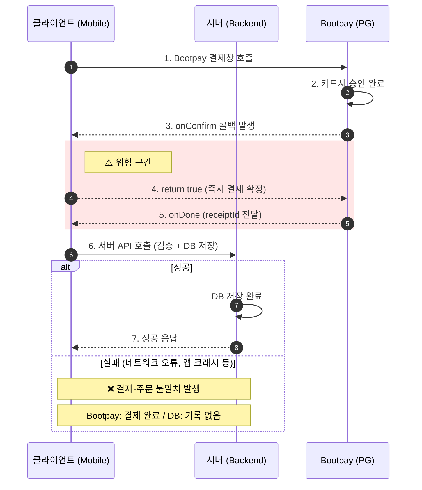
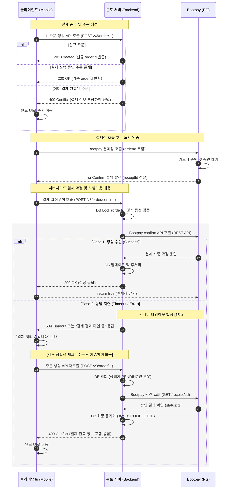
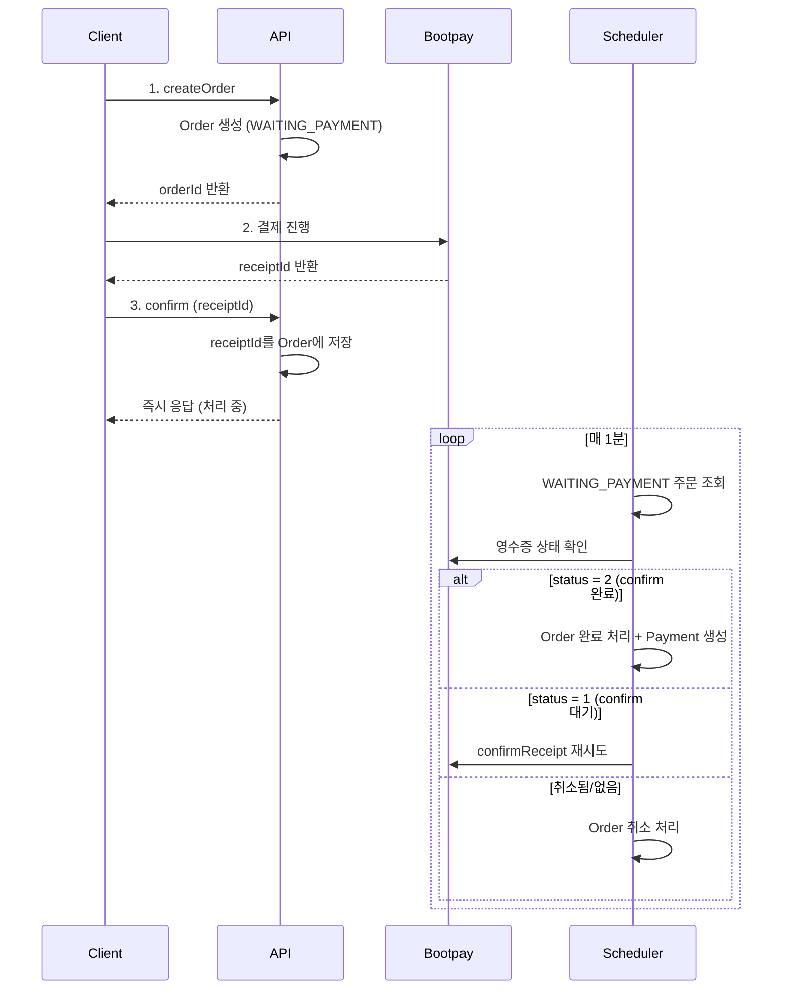

# 서버사이드 결제 완료 OnePager

분류: SRS
작성자: 김범진
최초 작성일: 2026년 1월 19일 오후 12:45
최근 수정일: 2026년 1월 30일 오후 12:55
담당자: 김범진
문서 상태: Active
생성 일시: 2026년 1월 19일 오후 12:45
최종 편집자: 김범진

Project Description:

현재 Bootpay 결제 시스템에서 클라이언트가 직접 결제 확정(confirm)을 수행하고 있어, 결제는 완료되었으나 서버에 기록되지 않는 문제가 발생할 수 있습니다. 이를 서버사이드 confirm 방식으로 전환하여 결제 무결성을 보장합니다.

**대상 프로젝트**: munto-backend, dating-backend, munto-mobile, dating-mobile

**관련 이슈**:

- WEBB-1005: [데이팅] 서버사이드 결제 완료(confirm) 로직 구현
- WEBB-878: 현재 결제 시스템의 현황을 파악하고 서버사이드 로직 구현을 검토합니다.
- APPF-550: 데이팅 결제시 서버 검증 없이 클라이언트 승인 로직이 호출되고 있습니다.

---

Business and Marketing Justification:

## **AS-IS (클라이언트사이드 confirm)**



- **결제 확정 시점의 문제**: 4번 과정(`return true`)에서 서버 검증 없이 결제가 이미 확정되어 버립니다.
- **원자성 결여**: PG사 승인과 서버 DB 저장이 서로 다른 트랜잭션으로 분리되어 있어, 7번 과정(서버 API 호출)이 실패할 경우 이를 복구할 자동화된 수단이 없습니다.
- **스케줄러 의존**: 현재는 이러한 불일치를 해결하기 위해 30분마다 미완료 결제를 강제 환불하는 스케줄러(`PaymentUpdateJobService`)에 의존하고 있는 구조입니다.

**현재 문제점**:

1. 클라이언트에서 `onConfirm: return true`로 결제 확정 → Bootpay 측 결제 완료
2. 이후 서버 API 호출 실패 시 (네트워크 오류, 앱 크래시 등)
3. Bootpay에는 결제 완료, 서버 DB에는 미기록 → **결제-주문 불일치** 발생
4. munto-backend에서는 스케줄러(`PaymentUpdateJobService`)로 30분마다 미완료 결제 환불 처리 중

## **TO-BE (서버사이드 confirm)**





- **승인 주체 변경 및 보안 강화**: 결제의 최종 확정 권한이 클라이언트에서 **서버(Step 10~11)**로 이동함에 따라, 클라이언트 측의 임의 조작에 의한 비정상 승인이 원천적으로 불가능해집니다.
- **원자적 처리 및 정합성 보장**: 서버 결제 확정 API 내에서 **Bootpay 승인(Step 11)과 DB 상태 업데이트(Step 13)가 하나의 프로세스**로 묶여 있어, 결제는 완료되었으나 주문 정보가 누락되는 불일치 현상을 방지합니다.
- **성공 반환 및 사후 추적**: 클라이언트는 서버의 최종 성공 응답(Step 14)을 확인한 후에만 결제창을 닫도록(`return true`) 설계되어 있습니다. 만약 이 응답을 받기 전 앱이 종료되더라도, 서버 로그와 DB에는 기록이 남기 때문에 결제 완료 여부를 정확히 추적할 수 있습니다.
- **타임아웃 계층화 및 API 재활용을 통한 사후 확정**: 서버-Bootpay 간 타임아웃을 클라이언트보다 짧게(15s) 설정하여 서버가 먼저 제어권을 가집니다. 응답 지연(Case 2) 발생 시, 사용자가 **주문 생성 API를 재호출(Step 20)**하면 서버가 내부적으로 **사후 정합성 체크(Step 21~23)**를 수행하여 이미 완료된 결제 건을 안전하게 최종 확정(409 Conflict 반환)합니다.

**후처리 분리 전략**:

결제창 타임아웃을 방지하기 위해 후처리를 **핵심(동기)**과 **부가(비동기)**로 분리합니다.

| **구분** | **처리 항목** | **타이밍** | **실패 시 영향** |
| --- | --- | --- | --- |
| **핵심 (동기)** | Bootpay confirm, DB 업데이트, 멤버/권한 부여 | 응답 전 | 결제 실패 처리 |
| **부가 (비동기)** | 슬랙 알림, 푸시 알림, 분석 로그 | 응답 후 | 사용자 무영향, 재처리 |
- **핵심 처리**: 결제 확정에 필수적인 작업. 실패 시 전체 트랜잭션 롤백
- **부가 처리**: 실패해도 사용자 경험에 영향 없는 작업. Event Queue를 통해 비동기 처리

**개선 효과**:

1. 결제 무결성 보장 - 서버에서 confirm해야만 결제 확정
2. 결제-주문 불일치 원천 차단 - 서버 처리 실패 시 Bootpay 자동 취소
3. 스케줄러 제거 가능 - 환불 처리 로직 불필요
4. 이중 결제/비정상 승인 사고 방지

---

Risk Assessment:

**기술적 리스크**:

| **리스크** | **영향도** | **대응 방안** |
| --- | --- | --- |
| 서버 응답 지연 시 결제창 타임아웃 | 중 | 클라이언트 타임아웃 설정 (30초), 서버 API 성능 최적화 |
| 배포 시점 클라이언트-서버 버전 불일치 | 고 | 서버 먼저 배포 후 클라이언트 배포, 하위 호환성 유지 |
| confirm 실패 시 사용자 경험 저하 | 중 | 명확한 에러 메시지, 재시도 안내 |

**롤백 전략**:

- 서버: 기존 API 유지하며 신규 API 추가, 문제 발생 시 클라이언트 롤백만으로 복구 가능
- 클라이언트: 피처 플래그로 서버사이드 confirm 활성화/비활성화 제어

---

Exception Handling:

## **예외 상황 처리**

### **타임아웃 계층화**

서버와 Bootpay 간의 통신 타임아웃을 클라이언트보다 짧게 설정하여, 서버가 먼저 상황을 제어할 수 있도록 합니다.

| **구간** | **타임아웃** | **설명** |
| --- | --- | --- |
| 서버 → Bootpay | 10~15초 | 서버가 먼저 타임아웃 감지 |
| 클라이언트 → 서버 | 25~30초 | 서버 응답 대기 |

### **앱 크래시/타임아웃 시나리오**

`confirmOnlyRestApi = true` 설정으로 **서버가 Bootpay confirm API를 호출해야만 결제가 최종 확정**됩니다. 이로 인해 클라이언트 문제 발생 시에도 결제-주문 불일치가 방지됩니다.

**시나리오 1: 결제창에서 앱 종료**

```
1차 시도: orderId: 123 생성 → 결제창 열림 → 앱 종료
  - Bootpay: 승인 안 됨
  - 서버 DB: orderId 123 (PENDING)

재진입: 주문 생성 API → 200 (기존 PENDING 주문 반환)
  → orderId: 123으로 결제창 재호출 → 정상 진행

```

**시나리오 2: 카드 승인 후, confirm API 호출 전 크래시**

```
1차 시도: orderId: 123 → 결제창 → 카드 승인 (receiptId: AAA) → onConfirm → 앱 크래시!
  - Bootpay: receiptId AAA "승인 대기" 상태
  - 서버 DB: orderId 123 (PENDING) - confirm API 안 왔으므로

재진입: 주문 생성 API → 200 (기존 PENDING 주문 반환)
  → orderId: 123으로 결제창 재호출 → 새 카드 승인 (receiptId: BBB)
  → confirm API (receiptId: BBB) → orderId 123 완료

이후:
  - receiptId AAA: Bootpay가 자동 취소 (약 10~30분 후) → 환불
  - receiptId BBB: 정상 결제 완료
  - orderId 123: COMPLETED_PAYMENT

```

**시나리오 3: confirm API 호출 후, 응답 받기 전 크래시**

```
1차 시도: orderId: 123 → 결제창 → 카드 승인 → confirm API 호출 → 앱 크래시!
  - 서버: confirm 처리 완료 → orderId 123 (COMPLETED_PAYMENT)
  - Bootpay: 결제 완료

재진입: 주문 생성 API → 409 (이미 결제 완료)
  → 성공 UI로 바로 이동

```

**시나리오 4: 오래 방치 후 재시도 (가격 변동 없음)**

```
1차 시도: orderId: 123, 가격 12,000원 → 결제창 → 카드 승인 (receiptId: AAA) → 앱 종료 후 방치

30분 후:
  - Bootpay: receiptId AAA 자동 취소 → 환불
  - 서버 DB: orderId 123 (PENDING, 12,000원)

재진입: 결제 정보 페이지 → Availability API (12,000원)
  → 주문 생성 API → 200 (기존 PENDING, 가격 동일)
  → orderId: 123으로 결제창 호출 → 새로 결제 진행

```

**시나리오 5: 오래 방치 후 재시도 (가격 변동 있음)**

```
1차 시도: orderId: 123, 가격 12,000원 (얼리버드) → 결제창 → 앱 종료 후 방치

30분 후 (얼리버드 종료):
  - Bootpay: 승인 안 됨 (또는 자동 취소)
  - 서버 DB: orderId 123 (PENDING, 12,000원)

재진입: 결제 정보 페이지 → Availability API (15,000원, 정가)
  → 주문 생성 API → 현재 가격 15,000원 vs 기존 주문 12,000원
  → 기존 주문 CANCELLED + 새 주문 생성 (201, orderId: 456, 15,000원)
  → orderId: 456으로 결제창 호출

```

**핵심 포인트**:

- `orderId`는 유지되거나, 가격 변동 시 새로 생성됨
- `receiptId`(Bootpay 영수증)는 결제창 호출 시마다 새로 발급
- 미확정된 Bootpay 승인 건은 자동 취소 → 환불
- 가격 변동 시 기존 PENDING 주문은 CANCELLED 처리
- 스케줄러 없이도 결제-주문 불일치 방지

### **Bootpay 승인 대기 상태**

`confirmOnlyRestApi = true` 설정 시:

- 카드사 승인은 완료되었지만
- 서버에서 confirm API를 호출하지 않으면
- **Bootpay가 일정 시간 후 자동 취소** (약 10~30분)
- 돈은 사용자에게 자동 환불됨

이를 통해 "돈만 빠지고 서비스 안 받는" 상황을 원천 방지합니다.

### **클라이언트 재진입 흐름**

```
앱 재진입 (미완료 결제 있던 화면)
    ↓
주문 생성 API 호출
    ├─ 201: 새 주문 → Bootpay 결제창 → confirm
    ├─ 200: PENDING 주문 → Bootpay 결제창 → confirm
    └─ 409: 이미 완료 → 성공 UI

```

별도의 "주문 상태 조회 API" 없이 주문 생성 API만으로 모든 예외 상황을 처리할 수 있습니다.

---

Resource and Scheduling Details:

**수정 대상**:

| **프로젝트** | **수정 범위** | **담당** |
| --- | --- | --- |
| munto-backend | v3 API 신규 3개, `confirmReceipt()` 추가 | 백엔드 |
| dating-backend | `confirmReceipt()` 호출 추가 | 백엔드 |
| munto-mobile | bootpay_helper.dart 수정 (v3 API 호출) | 클라이언트 |
| dating-mobile | bootpay_purchase_service.dart 수정 (기존 validate API 호출 시점 변경) | 클라이언트 |

**배포 순서**:

1. munto-backend v3 API 배포 (기존 v2 유지)
2. 클라이언트 배포 (munto: v3 사용, dating: 기존 validate 호출 시점 변경)
3. 안정화 확인 후 스케줄러 제거 (munto-backend)

---

Technical Description:

## **1. API 스펙**

### **1.1 Munto Backend (v3 신규) - 전체 결제 도메인**

### **1.1.1 주문 가능 여부 확인**

```
GET /v3/order/socialing/:socialingId/availability
```

**Response**:

```json
{
  "available": true,
  "price": 15000,
  "discountPrice": 3000,
  "finalPrice": 12000,
  "priceInfo": {
    "original": 15000,
    "discount": 3000,
    "final": 12000
  }
}
```

**검증 항목**:

- 소셜링 존재 여부
- 모집 상태 (RECRUITING)
- 정원 확인 (availCount > 0)
- 시작일 검증
- 성별 정책 검증
- 클럽 멤버 전용 검증
- 이미 구매 여부

---

### **1.1.2 주문 생성**

```
POST /v3/order/socialing/:socialingId
```

**Request**:

```json
{
  "orderKind": "CARD",
  "orderPrice": 12000
}
```

**Response**:

| **Status** | **상황** | **응답** |
| --- | --- | --- |
| **201** | 새 주문 생성 | `{ orderId, paymentId, orderPrice, expiresAt }` |
| **200** | 기존 PENDING 주문 있음 | `{ orderId, paymentId, orderPrice, expiresAt }` |
| **409** | 이미 결제 완료 (COMPLETED_PAYMENT) | `{ orderId, status: "COMPLETED_PAYMENT" }` |

```json
// 201 Created / 200 OK
{
  "orderId": 12345,
  "paymentId": "202601191234561234ABC12",
  "orderPrice": 12000,
  "expiresAt": 1737312000000
}

// 409 Conflict
{
  "orderId": 12345,
  "status": "COMPLETED_PAYMENT"
}
```

**클라이언트 처리**:

| **응답** | **다음 액션** |
| --- | --- |
| 201/200 | Bootpay 결제창 호출 → confirm API |
| 409 | 결제 이미 완료, 성공 UI로 이동 |

**처리**:

- 기존 PENDING/COMPLETED 주문 확인
- 없으면 Order 레코드 생성 (status: PENDING)
- paymentId 생성 및 캐시 저장 (TTL: 15분)

---

### **1.1.3 결제 확정**

```
POST /v3/order/confirm
```

**Request**:

```json
{
  "orderId": 12345,
  "paymentId": "202601191234561234ABC12",
  "receiptId": "bootpay_receipt_id_xxxxx"
}
```

**Response (성공)**:

```json
{
  "success": true,
  "orderId": 12345,
  "orderStatus": "COMPLETED_PAYMENT"
}
```

**Response (실패)**:

```json
{
  "success": false,
  "error": "Payment verification failed",
  "code": "INVALID_RECEIPT"
}
```

**처리**:

1. paymentId로 캐시에서 주문 정보 조회
2. orderId로 PENDING 주문 조회
3. receiptId로 Bootpay 영수증 검증 (금액, 상태)
4. Bootpay confirm API 호출
5. Payment 레코드 생성
6. Order 상태 업데이트 (COMPLETED_PAYMENT)
7. 후처리 (멤버 추가, 슬랙 알림 등)

---

### **1.2 Dating Backend (기존 API 사용)**

Dating은 이미 서버사이드 confirm 로직이 구현되어 있어 API 변경이 불필요합니다. 클라이언트에서 API 호출 시점만 변경합니다.

| **API** | **역할** | **변경** |
| --- | --- | --- |
| `POST /currency/order` | 주문 생성 (PENDING) | 기존 유지 |
| `POST /currency/order/validate` | 결제 검증 + confirm + 완료 | 기존 유지, 호출 시점만 변경 |

**클라이언트 호출 시점 변경**:

- AS-IS: `onDone`에서 `validate` 호출
- TO-BE: `onConfirm`에서 `validate` 호출 → 결과에 따라 return true/false

**호출 시점 변경에 따른 점검 사항**:

| **점검 항목** | **설명** | **대응 방안** |
| --- | --- | --- |
| 비즈니스 로직 완결성 | 기존 `onDone` 이후 수행되던 아이템 지급(캔디 등), 권한 부여, 알림 발송 등 후속 로직이 confirm 직후 트랜잭션 안에서 누락 없이 처리되는지 전수 점검 필요 | 기존 `validateAndCompleteOrder` 내부 로직 점검 |
| API 응답 속도 | `onConfirm` 시점에는 사용자가 결제창을 유지 중이므로, 후속 비즈니스 로직으로 인한 응답 지연 시 결제창 타임아웃 발생 가능 | 무거운 작업(푸시 알림, 분석 로그 등)은 비동기(Event-driven) 처리로 분리 |
| 멱등성 적용 | 호출 시점이 앞당겨짐에 따라 클라이언트 재시도 가능성 증가 | 1.3 멱등성 및 동시성 제어 참조 |

---

### **1.3 멱등성 및 동시성 제어 (공통)**

Munto Backend와 Dating Backend 모두에 적용됩니다.

### **문제 상황**

클라이언트가 단일 기기이더라도 다음 상황에서 confirm API가 거의 동시에 중복 호출될 가능성이 존재합니다:

- 네트워크 타임아웃에 의한 HTTP 라이브러리의 자동 재시도(Retry)
- 사용자의 반복 클릭

```
시간 T+0ms:  요청 A → DB 조회 (status: PENDING)
시간 T+1ms:  요청 B → DB 조회 (status: PENDING)  ← A가 아직 완료 안됨
시간 T+50ms: 요청 A → Bootpay confirm → DB 업데이트 (COMPLETED)
시간 T+51ms: 요청 B → Bootpay confirm (중복 호출!)
```

이 경우, 두 요청이 모두 DB에서 주문 상태를 `PENDING`으로 조회하여 중복 승인 로직을 수행할 위험이 있습니다.

### **해결 방안 비교**

| **항목** | **DB 트랜잭션 + FOR UPDATE** | **Redis 분산 락** |
| --- | --- | --- |
| **동시 요청 차단** | ✅ 가능 | ✅ 가능 |
| **구현 복잡도** | 중간 (Prisma raw query 필요) | 중간 (Redlock 라이브러리 사용) |
| **성능 영향** | 락 대기 시간 발생 (DB 부하) | 낮음 (Redis는 인메모리) |
| **분산 환경 지원** | ⚠️ 단일 DB에서만 동작 | ✅ 여러 서버 인스턴스에서 동작 |
| **락 해제 보장** | ✅ 트랜잭션 종료 시 자동 해제 | ⚠️ TTL 또는 명시적 해제 필요 |
| **기존 인프라 활용** | ✅ PostgreSQL 사용 중 | ✅ Redis 사용 중 |
| **장애 시 영향** | DB 장애 시 전체 서비스 영향 | Redis 장애 시 락만 영향 (fallback 가능) |

### **선택: Redis 분산 락**

다음 이유로 **Redis 분산 락** 방식을 선택합니다:

1. **분산 환경 대응**: 현재 munto-backend, dating-backend 모두 여러 인스턴스로 운영될 수 있으며, DB 락은 단일 트랜잭션 내에서만 유효
2. **성능**: Redis는 인메모리 기반으로 락 획득/해제가 매우 빠름 (< 1ms)
3. **기존 인프라 활용**: 이미 세션/캐시용으로 Redis를 사용 중
4. **DB 부하 최소화**: 결제 트래픽이 몰릴 때 DB에 락 경합이 발생하지 않음

### **적용 방식**

| **프로젝트** | **락 키** | **적용 위치** |
| --- | --- | --- |
| Munto Backend | `order:confirm:{paymentId}` | `OrderV3Service.confirm*()` |
| Dating Backend | `order:confirm:{orderId}` | `CurrencyService.validateAndCompleteOrder()` |

### **멱등성 보장 (Success Replay)**

이미 처리가 완료되어 DB 상태가 `COMPLETED_PAYMENT`인 건에 대해 재요청이 올 경우:

- 에러를 반환하지 않음
- `200 OK`와 함께 현재 성공 상태를 반환
- 클라이언트가 정상적으로 결제 완료 UI(`onDone`)로 진입 가능

이를 통해 네트워크 불안정 상황에서도 결제 무결성을 확보하고 사용자 경험(UX)을 유지할 수 있습니다.

---

## **2. 서버 수정 사항**

### **2.1 Munto Backend**

| **파일** | **수정 내용** |
| --- | --- |
| `libs/common/src/bootpay/bootpay.service.ts` | `confirmReceipt()` 메서드 추가 |
| `apps/api/src/order/v3/order.v3.controller.ts` | v3 API 엔드포인트 추가 |
| `apps/api/src/order/v3/order.v3.service.ts` | 3단계 로직 구현 |
| `libs/common/src/shared/services/order.common.service.ts` | confirm 호출 래퍼 추가 |

| **도메인** | **Availability** | **Order Create** | **Confirm** |
| --- | --- | --- | --- |
| 소셜링 | GET /v3/order/socialing/:id/availability | POST /v3/order/socialing/:id | POST /v3/order/socialing/confirm |
| 코스 | GET /v3/order/course/:id/availability | POST /v3/order/course/:id | POST /v3/order/course/confirm |
| 챌린지 | GET /v3/order/challenge/:id/availability | POST /v3/order/challenge/:id | POST /v3/order/challenge/confirm |
| 클럽 | GET /v3/order/club/:id/availability | POST /v3/order/club/:id | POST /v3/order/club/confirm |
| 클럽 멤버십 | GET /v3/order/club/:id/membership/renewal/availability | POST /v3/order/club/:id/membership/renewal | POST /v3/order/club/membership/confirm |

**confirmReceipt 구현**:

```tsx
async confirmReceipt(receiptId: string): Promise<boolean> {
  try {
    const token = await this.getAccessToken();
    const response = await apiClient(this.BOOTPAY_API_URL, {
      Authorization: `Bearer ${token}`,
    }).post('/confirm', { receipt_id: receiptId });

    return response.status === 200;
  } catch (error: any) {
    // 이미 확정된 영수증인 경우
    if (error.response?.data?.error_code === 'RC_NOT_CONFIRM_READY') {
      const receipt = await this.getReceipt(receiptId);
      if (receipt.status === 1) {
        return true;
      }
    }
    throw new InternalServerErrorException('Bootpay confirm failed');
  }
}

```

### **2.2 Dating Backend**

| **파일** | **수정 내용** |
| --- | --- |
| `apps/api/src/currency/currency.service.ts` | `validateAndCompleteOrder`에 `confirmReceipt()` 호출 추가 |
| `apps/api/src/common/bootpay/bootpay.service.ts` | Redis 분산 락 적용 |

**수정 사항**:

1. 기존 `validateAndCompleteOrder`에서 `verifyReceipt()`만 호출 중이므로, `confirmReceipt()` 호출 추가 필요
2. Redis 분산 락 적용 (Munto Backend와 동일)
    - `orderId` 기준으로 락 획득
    - 이미 `COMPLETED_PAYMENT` 상태인 경우 성공 응답 반환 (Success Replay)

---

## **3. 클라이언트 수정 사항**

### **3.1 공통 변경 사항**

**핵심 변경**: `onConfirm` 콜백에서 서버 API 호출 후 결과에 따라 `true/false` 반환

```
AS-IS:
  onConfirm → return true (무조건)
  onDone → 서버 API 호출 → UI 처리

TO-BE:
  onConfirm → 서버 API 호출 → return success
  onDone → UI 처리만

```

**필요한 리팩토링**:

1. `onConfirm` 대신 `onConfirmAsync` 콜백 사용 (Bootpay SDK 기본 제공)
2. 서버 확정 API 호출 로직을 `onDone`에서 `onConfirmAsync`로 이동
3. 결제 시작 전 orderId/paymentId를 미리 발급받아 보관
4. `onDone`은 성공 UI 처리만 담당

**Bootpay SDK 설정 옵션** (`Extra` 모델):

| **옵션** | **기본값** | **설명** |
| --- | --- | --- |
| `separatelyConfirmed` | `true` | confirm 이벤트 호출 여부. `false`면 자동승인 |
| `confirmOnlyRestApi` | `false` | **`true` 설정 시 REST API로만 승인 처리** |
| `confirmGraceSeconds` | `10` | 결제승인 유예시간 (중복 요청 시 동일 응답 반환) |

**권장 설정**: `extra.confirmOnlyRestApi = true`

- 클라이언트 return 값과 무관하게 **서버 REST API로만 승인 가능**
- 클라이언트 조작/버그로 인한 비정상 승인 원천 차단

**`confirmOnlyRestApi = true` 적용 시 리스크 및 대응**:

`confirmOnlyRestApi = true` 설정 시 클라이언트 개입이 차단되어 보안성은 높아지지만, 서버 에러 발생 시 Bootpay 관리자 콘솔에 결제가 **'승인 대기' 상태로 방치**될 위험이 있습니다.

| **리스크** | **대응 방안** |
| --- | --- |
| 서버 confirm 실패 시 결제 방치 | 실시간 알림 + 수동 승인 프로세스 |
| 장애 원인 추적 어려움 | Full-cycle 로깅 |
| 후처리 실패 건 누락 | 예외 상황 아카이빙 |

> 상세 모니터링 체계는 4. 모니터링 체계 참조
> 

**콜백 종류**:

- `onConfirm`: 동기 처리 (`bool` 반환)
- `onConfirmAsync`: 비동기 처리 (`Future<bool>` 반환) ← **서버 API 호출 시 사용**

---

### **3.2 Munto Mobile**

**수정 파일**:

| **파일** | **역할** |
| --- | --- |
| `lib/core/bootpay_helper.dart` | 부트페이 래퍼 - `onServerConfirm` 콜백 추가 |
| `lib/screens/socialing_apply/viewmodels/socialing_apply_viewmodel.dart` | 소셜링 결제 |
| `lib/screens/club_apply/viewmodels/club_apply_viewmodel.dart` | 클럽 가입 결제 |
| `lib/screens/vod_apply/viewmodels/vod_apply_viewmodel.dart` | VOD 결제 |
| `lib/screens/challenge_apply/viewmodels/challenge_apply_viewmodel.dart` | 챌린지 결제 |

**BootPayHelper 수정**:

```
AS-IS:
  payload.extra.confirmOnlyRestApi = false (기본값)
  onConfirm: (data) → return true  // 클라이언트 자동 승인
  onDone: (data) → 서버 API 호출

TO-BE:
  payload.extra.confirmOnlyRestApi = true  // 서버 REST API로만 승인
  onConfirmAsync: (data) async → 서버 confirm API 호출 → return success
  onDone: (data) → UI 처리만

```

**참고**: `confirmOnlyRestApi = true` 설정 시, 클라이언트의 return 값과 무관하게 서버에서 Bootpay confirm API를 호출해야만 결제가 최종 승인됨

**ViewModel 결제 흐름 변경**:

```
AS-IS:
  1. Bootpay 호출
  2. onConfirm → return true
  3. onDone → 서버 완료 API 호출 → 성공/실패 처리

TO-BE:
  1. 주문 가능 여부 API 호출 (GET /v3/order/socialing/:id/availability)
  2. 주문 생성 API 호출 (POST /v3/order/socialing/:id) → orderId, paymentId 저장
  3. Bootpay 호출 (orderId 포함)
  4. onConfirm → 결제 확정 API 호출 (POST /v3/order/confirm) → return success
  5. onDone → 성공 UI 처리

```

---

### **3.3 Dating Mobile**

**수정 파일**:

| **파일** | **역할** |
| --- | --- |
| `lib/source/data/services/purchase/bootpay_purchase_service.dart` | 부트페이 결제 서비스 |

**결제 흐름 변경**:

```
AS-IS:
  1. 주문 생성 API 호출 (POST /currency/order) → orderId 저장
  2. Bootpay 호출
  3. onConfirm → return true
  4. onDone → validate API 호출 (POST /currency/order/validate) → Stream에 결과 전달

TO-BE:
  1. 주문 생성 API 호출 (POST /currency/order) → orderId 저장
  2. Bootpay 호출
  3. onConfirm → validate API 호출 (POST /currency/order/validate) → return success
  4. onDone → Stream에 성공 결과 전달 (UI 처리용)

```

**참고**: Dating은 기존 validate API가 이미 서버에서 confirm을 수행하므로, 호출 시점만 `onDone` → `onConfirm`으로 변경

---

## **4. 모니터링 체계**

`confirmOnlyRestApi = true` 설정 시 서버 에러 발생 시 Bootpay 관리자 콘솔에 결제가 **'승인 대기' 상태로 방치**될 위험이 있어, 다음 수준의 모니터링 체계 구축이 필요합니다.

### **4.1 Full-cycle 로깅**

confirm API 호출 시 전체 흐름을 **하나의 트랜잭션 ID**로 묶어 추적 가능하도록 로깅합니다.

| **로깅 항목** | **내용** |
| --- | --- |
| Request | 클라이언트로부터 받은 `orderId`, `paymentId`, `receiptId` |
| Bootpay 송신 | confirm API 호출 시 전송한 `receipt_id` |
| Bootpay 수신 | confirm API 응답 (status, error_code 등) |
| DB 변경 | Order 상태 변경 결과 (`PENDING` → `COMPLETED_PAYMENT`) |
| 후처리 결과 | 멤버 추가, 권한 부여 등 성공/실패 여부 |

**구현 방안**:

- 각 confirm 요청마다 고유 `transactionId` (UUID) 생성
- 로그에 `transactionId` 포함하여 CloudWatch 등에서 필터링 가능하도록 구성

### **4.2 실시간 알림 (Alerting)**

Bootpay 호출 중 네트워크 타임아웃이나 비정상 에러 발생 시 **Slack 알림**을 전송하여 운영팀이 즉시 대응할 수 있도록 합니다.

| **알림 조건** | **알림 내용** |
| --- | --- |
| Bootpay confirm API 실패 | `[결제 승인 실패] orderId: {id}, receiptId: {id}, error: {msg}` |
| Bootpay 응답 타임아웃 | `[결제 승인 타임아웃] orderId: {id}, 수동 확인 필요` |
| DB 업데이트 실패 | `[DB 저장 실패] orderId: {id}, Bootpay는 승인됨 - 수동 처리 필요` |

**대응 프로세스**:

1. 알림 수신 시 Bootpay 관리자 콘솔에서 해당 결제 상태 확인
2. '승인 대기' 상태인 경우 수동 승인 또는 취소 처리
3. 고객 문의 시 트랜잭션 ID로 로그 조회하여 원인 파악

### **4.3 예외 상황 아카이빙**

결제는 완료되었으나 후처리(아이템 지급, 멤버 추가 등)에서 실패한 건을 별도로 추적합니다.

| **상태** | **설명** | **처리 방안** |
| --- | --- | --- |
| `COMPLETED_PAYMENT` + 후처리 실패 | Bootpay 승인 완료, DB 저장 완료, 후처리 실패 | 재처리 큐에 등록 또는 수동 처리 |
| `PENDING` + Bootpay 승인 완료 | 서버 장애로 DB 미반영 | Bootpay 웹훅 또는 스케줄러로 복구 |

**구현 방안**:

- 후처리 실패 시 별도 테이블(`FailedPostProcess`)에 기록
- 백오피스 대시보드에서 실패 건 조회 및 재처리 기능 제공
- 또는 기존 슬랙 알림 채널에 실패 건 알림 전송

---

## **5. 스케줄러 제거**

### **제거 대상**

**파일**: `apps/scheduler/src/scheduleJob/paymentUpdateJob.service.ts`

**현재 역할**:

- 30분마다 실행
- PaymentRequest 중 Payment 없는 건 → Bootpay 환불 처리

**제거 시점**: 서버사이드 confirm 안정화 확인 후 (배포 후 1-2주)

---

## **6. 테스트 시나리오**

| **시나리오** | **예상 결과** |
| --- | --- |
| 정상 결제 | confirm 성공 → DB 저장 → return true → 완료 |
| 서버 confirm 실패 | return false → Bootpay 자동 취소 |
| 네트워크 타임아웃 | 클라이언트 에러 처리 → return false |
| 이미 확정된 영수증 | status=1 확인 후 성공 처리 |
| 중복 confirm 요청 | 멱등성 보장 (이미 COMPLETED면 성공 반환) |

---

## **7. 참고 문서**

- [Bootpay Confirm API 문서](https://docs.bootpay.co.kr/?front=web&backend=curl#confirm-payment)
- 

[Swagger.yaml](https://www.notion.so/Swagger-yaml-2eee2bc7639d8003a2c8d8bef0689e01?pvs=21)

---

🔁**변경 이력**

| **버전** | **일자** | **변경자** | **변경 내용** |
| --- | --- | --- | --- |
| v1.0.0 | 20260119 | 김범진 | 최초 작성 |
| v1.0.1 | 20260120 | 김범진 | redis 분산 락 반영 |

---

🧾**문서 작성 규칙**

1. **항목마다 작성자/작성일을 명시**
2. **모든 변경은 ‘변경 이력’ 테이블에 기록**
3. **문서 버전은 Semantic Versioning(v1.0.0)을 따름**
4. **기여자는 실질적인 내용 추가/수정에 참여한 사람만 포함**
5. 변경 사항이 발생하거나 리뷰 요청이 필요한 문서의 경우, 관련 수정 내용을 변경 이력과 함께 명시하고, 해당 부분 끝에 버전을 표기하여 혼동을 방지한다.
    - 변경 내용 `(v1.0.1)`