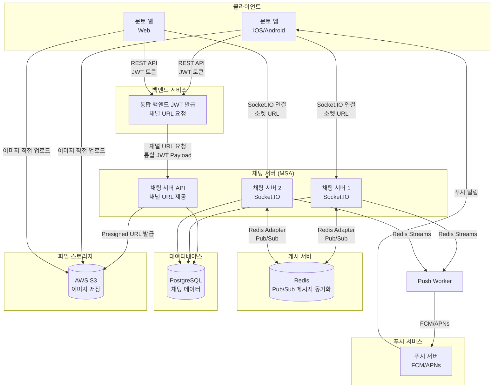

# **채팅 서비스 SRS**

# **1 Introduction (개요)**

## **1.1 Purpose (목표)**

- 이 문서는 채팅 서비스 핵심 기능과 요구사항을 정의한 SRS(Software Requirements Specification) 문서입니다.
- 이 SRS는 채팅 서비스의 모바일 앱(iOS/Android), 웹 프로트엔드와 백엔드 전반에 대한 요구사항을 다룹니다.
- 이 문서는 개발자, 디자이너, 기획자 및 이해관계자가 시스템의 동작과 구조를 명확히 이해하는 데 목적이 있습니다.
- 이 문서는 기존 문토 서비스에서 제공하던 채팅 서비스를 대체하는 신규 채팅 서비스에 대한 요구사항을 중점적으로 정의합니다.

## **1.2 Product Scope (범위)**

- 채팅 서비스는 문토 플랫폼과 데이팅 서비스에서 사용되는 실시간 메시징 기능을 제공합니다.
- 기존 Sendbird 서비스를 대체하여 자체 구축 채팅 서버로 전환함으로써 비용 절감 및 커스터마이징 자유도를 확보합니다.
- 채팅 서버는 별도 MSA(Microservice Architecture)로 구성됩니다.
- 문토 백엔드와 데이팅 백엔드에서 공통으로 사용할 수 있도록 통합 JWT Payload를 기반으로 인증을 처리합니다.
- 통합 JWT Payload는 문토 모노레포 내에 정의되며, 채팅 서버는 이를 참조할 수 있도록 구성됩니다.
- 본 프로젝트에서는 다음과 같은 기능을 포함합니다.
    - **소셜링 채팅**: 소셜링 모임 참여자 간의 그룹 채팅 기능
    - **DM (Direct Message)**: 사용자 간 1:1 개인 메시지 기능
    - **데이팅 DM**: 데이팅 서비스에서 사용되는 1:1 메시지 기능. 채팅 서버 아키텍처(Socket.IO, 메시지 전송/수신, 푸시 알림)는 문토 DM과 동일하나, 다음 정책에서 차이가 있다:
      - **진입 조건**: 유료 결제 후 채팅방 활성화 가능 (데이팅 백엔드에서 결제 처리 후 채팅 서버에 활성화 요청)
      - **채팅방 상태**: CREATED(생성) → ACTIVATED(활성화) → EXPIRED(만료) / LEFT(나감)
      - **채팅방 만료**: 활성화일로부터 30일 경과 시 자동 만료, 이후 접근 불가
      - **채팅방 생성 주체**: 데이팅 백엔드 (친구 신청 수락 시 채팅 서버에 채팅방 생성 API 호출)
    - **푸시 알림**: 채팅 메시지 수신 시 푸시 알림 발송 기능
    - **백오피스 채팅 관리 기능**: 관리자가 채팅 내역을 조회하고 모니터링할 수 있는 관리자 기능
- 본 프로젝트에서는 다음과 같은 기능을 향후 계획에 포함합니다. (요구사항 정의 완료, 구현 시점은 향후 결정)
    - **챌린지 채팅**: 챌린지 채팅은 인증하기, 인증률 표시 기능 등 별도 기능이 필요합니다. 요구사항은 7.7.1에 정의되어 있으며, 챌린지 고도화 이후 구현 시점을 판단합니다.
    - **클럽 채팅**: 클럽 채팅은 피드, 채널, 투표 기능 등 별도 기능이 필요합니다. 요구사항은 7.7.2에 정의되어 있으며, 클럽 고도화 이후 구현 시점을 판단합니다.

## **1.3 Document Conventions (문서규칙)**

- **용어 및 표기 규칙 (Terminology and Notation)**
    - 기술 용어는 영어 원문으로 표기하고, 최초 등장 시 괄호 안에 한글 병기 (예: Middleware(미들웨어))
    - 약어는 최초 등장 시 전체 용어와 함께 표기 (예: Simple Object Access Protocol (SOAP))
- **우선순위 정의 (P1 ~ P3)**
    - **P1**: 프로젝트에 **반드시 포함되어야 하는 핵심 기능**
    - 프로젝트 목표 달성에 필수이며, 제외 시 릴리스 불가능
    - **P2**: **중요하지만 P1보다는 우선순위가 낮은 기능**
    - 프로젝트 일정 내 구현이 권장되며, 일정에 따라 조정 가능
    - **P3**: **추가되면 좋지만 필수는 아닌 기능**
    - 여유가 있을 때 구현하며, 추후 릴리스 대상이 될 수 있음

## **1.4 Terms and Abbreviations (정의 및 약어)**

- Dating: 문토 데이팅 서비스
- 문토: 소셜링, 클럽, 챌린지를 포함한 문토 서비스
- 소셜링, 클럽, 챌린지: 문토에서 제공하는 모임 종류
    - **소셜링 채팅**: 소셜링 모임 참여자들의 그룹 채팅
    - **챌린지 채팅**: 챌린지 모임 참여자들의 그룹 채팅
    - **클럽 채팅**: 클럽 모임 참여자들의 그룹 채팅
- MSA: Microservice Architecture (마이크로서비스 아키텍처), 단일 애플리케이션을 여러 개의 작은 서비스로 분할하여 독립적으로 배포하고 확장 가능한 아키텍처 패턴
- 채팅 SDK: 클라이언트(앱/웹)에서 채팅 서버와 통신하기 위한 공통 라이브러리. Socket.IO 연결 관리, 메시지 전송/수신, 읽음 처리 등 핵심 로직을 제공하며, 문토 앱/데이팅 앱/문토 웹에서 공통으로 사용한다.
- 문토봇: 채팅방에 자동으로 포함되어 시스템 공지 및 메시지를 전송하는 관리자 역할의 시스템 봇. 백오피스에서 채팅 내역 조회 시 문토봇이 포함된 모든 채팅방을 모니터링할 수 있다.
- 개인 채팅: 1대1로 이루어지는 채팅이며, 관리자(문토봇)를 참여자로 포함한다 (실제 참여자: 사용자 2명 + 관리자 1명 = 총 3명)
- 그룹 채팅: 여러명으로 이루어지는 채팅이며, 관리자(문토봇)를 참여자로 포함한다
- 지수 백오프(Exponential Backoff): 재시도 간격을 점진적으로 늘리는 방식 (예: 1초 → 2초 → 4초). 서버 부하를 감소시키고 일시적 장애 시 복구 시간을 확보하기 위한 재시도 전략
- Graceful Degradation (우아한 성능 저하): 서버 장애나 일부 기능 실패 시 전체 서비스를 중단하지 않고, 일부 기능만 제한하고 나머지는 정상 동작하도록 하는 방식. 예를 들어, 메시지 전송이 실패해도 기존 메시지 조회는 가능하도록 함
- **사용자 상태 (3단계 모델)**: 해당 채팅방의 메시지를 실시간으로 수신할 수 있는지 여부를 기준으로 판단
  - **Active (활성)**: Socket.IO 연결 + 해당 채팅방을 현재 보고 있는 상태. `join_room` 이벤트로 활성 채팅방이 설정된다. 실시간으로 메시지를 수신 중이므로 **푸시 알림을 발송하지 않는다**.
  - **Idle (유휴)**: Socket.IO 연결은 되어있으나, 다른 채팅방/화면을 보고 있거나 앱이 백그라운드인 상태. 채팅 목록 화면이거나 다른 채팅방에 `join_room` 한 경우. Socket.IO로 메시지를 전송하며, **클라이언트에서 로컬 푸시를 표시**한다.
  - **Offline (오프라인)**: Socket.IO 연결이 없는 상태. 연결이 끊기는 이유(앱 종료, 백그라운드 전환, 네트워크 끊김, 로그아웃 등)와 관계없이 오프라인으로 처리된다. **Push Server를 통해 FCM/APNs 시스템 푸시를 발송**한다.
- **메시지 전송 상태 (클라이언트)**: 클라이언트에서 메시지 전송 진행 상황을 추적하기 위한 상태
  - **PENDING (대기)**: 전송 대기 중. 오프라인 상태이거나 전송 큐에서 대기 중인 메시지
  - **SENDING (전송 중)**: 서버로 전송 중. 서버 응답을 기다리는 상태
  - **SENT (전송 완료)**: 서버에서 메시지 수신 확인 완료
  - **FAILED (전송 실패)**: 재시도 횟수 소진 후 최종 실패. 사용자가 수동으로 재전송 가능

## **1.5 Related Documents (관련문서)**

- 정책문서 : [채팅 정책문서](https://www.notion.so/PRD-27fe2bc7639d80a6ba62dd97819ab773?pvs=21)
- UI : [Figma](https://www.figma.com/file/CAql5x1tM0PfXUc1zMcibf?fuid=1451025038222354641)
- API: [swagger.yaml](./swagger.yaml)
- ERD: [ERD](./erd.md)
- 소켓 이벤트: [socket-events](./socket-events.md)

## **1.6 Intended Audience and Reading Suggestions (대상 및 읽는 방법)**

- **개발자**
    - 시스템 아키텍처, API 설계, 데이터 모델, 매칭 알고리즘 등 **기술적 구현 사항을 완벽히 이해하고 개발**할 수 있도록 작성되었습니다.
    - 특히 3장(환경), 4장(외부 인터페이스), 7장(기능 요구사항)을 중점적으로 검토하며, 전체 문서를 정독할 것을 권장합니다.
- **기획자 & 디자이너**
    - 비즈니스 목표, 서비스 전략, 기능 우선순위 등 **제품 전략과 로드맵 수립**에 필요한 정보를 확인합니다.
    - 온보딩 플로우, 프로필 카드 디자인, 매칭 인터랙션, 채팅 UI 등 **사용자 경험과 인터페이스 설계**에 필요한 내용을 중심으로 읽습니다.
    - 2장(전체 설명)과 7장(기능 요구사항)의 UI/UX 관련 섹션에 집중하여 검토합니다.
- **운영팀**
    - 프로필 심사 프로세스, 신고/차단 처리, 사용자 안전 정책 등 **서비스 운영과 관리에 필요한 기능**을 파악합니다.
    - 6장(기능 이외 요구사항)의 안전성 및 보안 섹션과 7장의 관리자 기능 부분을 중심으로 검토합니다.
- **마케팅팀**
    - **마케팅 전략 수립**에 필요한 정보를 확인합니다.
    - 2장(전체 설명)과 7장(기능 요구사항)의 주요 기능을 중심으로 검토하여 고객 획득 캠페인과 콘텐츠 마케팅 관점에서 검토합니다.

## **1.7 Project Output (프로젝트 산출물)**

본 프로젝트 결과물의 형태 및 버전 등에 대해 기술한다.

산출물의 형태가 제품인지 라이브러리인지 툴인지 등을 구분하여 기술하며, 산출물명(가칭) 및 그 대표 버전을 기술한다.

### **1.7.1 Output Format (산출물 형태)**

- **Mobile SDK (Flutter)**: 문토 앱/데이팅 앱에서 공통으로 사용하는 Flutter 채팅 SDK 패키지
- **Web SDK (TypeScript)**: 문토 웹에서 사용하는 TypeScript 채팅 SDK 패키지
- **Backend**: 채팅 서버 (별도 레포지토리로 신규 생성)

### **1.7.2 Output Name and Version (산출물명(가칭) 및 버전)**

- **서비스명**: Munto Chat Service
- **Mobile SDK (Flutter)**
    - **패키지명**: munto_chat_sdk (신규 생성)
    - 문토 앱과 데이팅 앱에서 공통으로 사용하는 Flutter 채팅 SDK
    - Socket.IO 연결 관리, 메시지 전송/수신, 읽음 처리 등 핵심 로직 제공
    - UI는 각 앱에서 별도 구현
- **Web SDK (TypeScript)**
    - **패키지명**: @munto/chat-sdk (신규 생성)
    - 문토 웹(React+Next.js)에서 사용하는 TypeScript 채팅 SDK
    - Flutter SDK와 동일한 인터페이스 제공
- **Backend**
    - **레포지토리명**: chat_backend (신규 생성)
- **초기 버전**: v1.0.0

### **1.7.3 Patent Information (특허 출원 유무 및 내용)**

None

# **2 Overall Description (전체 설명)**

본 프로젝트 산출물의 T0-BE 모습에 대한 전체적인 구성 및 동작, 기능 등에 대해 간략하게 기술한다.

상세한 기능 스펙은 7장에서 기술한다.

## **2.1 Product Perspective (제품 조망)**

채팅 서비스는 문토 플랫폼과 데이팅 서비스에서 사용되는 실시간 메시징 기능을 제공하는 별도 MSA(Microservice Architecture)로 구성됩니다.

**시스템 아키텍처:**



## **2.2 Overall System Configuration (전체 시스템 구성)**

**주요 구성 요소:**

- **클라이언트 (앱/웹)**
    - 문토 앱(iOS/Android), 데이팅 앱, 문토 웹에서 채팅 기능 사용
    - 공통 채팅 SDK를 통해 채팅 서버와 통신
        - Mobile: munto_chat_sdk (Flutter)
        - Web: @munto/chat-sdk (TypeScript)
    - REST API를 통해 문토 백엔드 또는 데이팅 백엔드에 인증 요청
    - Socket.IO(Socket.IO)을 통해 채팅 서버에 직접 연결하여 실시간 메시징
    - UI는 각 앱/웹에서 별도 구현, SDK는 핵심 로직만 제공
- **문토 백엔드 / 데이팅 백엔드**
    - 통합 JWT Payload 발급
    - 채팅 서버에 채널 URL 요청
    - 채팅 서버는 MSA로 구성되어 별도 서비스로 운영
- **채팅 서버 (MSA)**
    - REST API: 채널 URL 제공 및 채팅방 관리
    - Socket.IO: 실시간 메시지 전송 및 수신
    - PostgreSQL: 채팅 데이터 영구 저장
    - Redis: Socket.IO Redis Adapter를 통한 다중 서버 간 메시지 동기화 (현재 두 대 운영, 향후 확장 예정)
- **파일 스토리지 (AWS S3)**
    - 채팅 이미지 저장용 S3 버킷
    - Presigned URL을 통한 클라이언트 직접 업로드 (서버 부하 감소)
    - 클라이언트에서 이미지 리사이징 후 업로드 (장축 1920px, 최대 10MB)
- **푸시 서비스**
    - Push Worker가 Redis Streams에서 이벤트를 소비하여 FCM/APNs로 푸시 알림 발송
    - 채팅 서버와 같은 레포지토리 안에서 별도 프로세스로 실행
    - 기존 문토 푸시 서비스 인프라 활용

**기존 Sendbird 서비스 대체:**

- 기존 Sendbird 기반 채팅 서비스를 자체 구축 채팅 서버로 전환
- 비용 절감 및 커스터마이징 자유도 확보
- 점진적 마이그레이션을 통한 하위 호환성 유지

## **2.3 Overall Operation (전체 동작방식)**

**사용자 인증 및 연결:**

1. 사용자가 문토 앱 또는 웹에서 채팅 기능 진입
2. 클라이언트가 채팅 서버에 채널 URL 요청 (REST API)
3. 채팅 서버에서 채널 URL 및 Socket.IO 연결 정보 제공
4. 클라이언트가 Socket.IO를 통해 채팅 서버에 직접 연결

**채팅방 생성 및 조회:**

1. **소셜링 채팅방 생성**
    - 소셜링 모임 참여 시 자동으로 그룹 채팅방 생성
    - 참여자 모두와 관리자(문토봇)가 자동으로 채팅방에 포함
    - 채팅방 목록에 표시
2. **DM 채팅방 생성**
    - 사용자가 다른 사용자에게 메시지 전송 시도
    - 기존 1:1 채팅방이 없으면 새로 생성
    - 사용자 2명과 관리자(문토봇)가 채팅방에 포함
    - 채팅방 목록에 표시
3. **채팅방 목록 조회**
    - 사용자가 참여한 모든 채팅방 목록 조회
    - 최근 메시지 시간 순으로 정렬
    - 읽지 않은 메시지 수 표시

**메시지 전송 및 수신:**

1. **메시지 전송**
    - 사용자가 채팅방에서 메시지 입력 및 전송
    - 클라이언트가 Socket.IO를 통해 채팅 서버에 메시지 전송
    - 채팅 서버에서 메시지 검증 및 저장 (PostgreSQL)
    - 채팅방 참여자들에게 실시간으로 메시지 전달
    - Redis Streams를 통해 푸시 이벤트 발행 (오프라인 사용자 대상)
2. **메시지 수신**
    - Socket.IO를 통해 실시간으로 메시지 수신 (온라인 사용자)
    - 읽지 않은 메시지 수 자동 업데이트
    - 채팅방 목록에 최근 메시지 미리보기 표시
3. **푸시 알림 발송 (Hybrid 구조, 3단계 상태 모델)**
    - 채팅 서버에서 사용자 상태(Active/Idle/Offline)를 판단하여 푸시 발송 여부 결정
    - Active (해당 채팅방 보는 중): 푸시 발송 안 함 (실시간 수신 중)
    - Idle (앱 열림, 다른 화면): Socket.IO로 전달 → 클라이언트에서 로컬 푸시 표시
    - Offline: Redis Streams로 푸시 이벤트 발행 → Push Worker → FCM/APNs 발송
    - 푸시 알림 클릭 시 해당 채팅방으로 이동
    - 상세 내용은 6.1.4 채팅 푸시 알림 아키텍처 참조
4. **메시지 공지 설정**
    - 특정 메시지를 공지사항으로 설정

**읽음 처리:**

1. 사용자가 채팅방 진입 또는 메시지 확인
2. 클라이언트가 읽음 처리 요청 전송
3. 서버에서 읽음 상태 업데이트 (PostgreSQL)
4. 상대방에게 읽음 처리 알림 전송
5. 읽지 않은 메시지 수 실시간 업데이트

**채팅방 관리:**

1. **채팅방 나가기**
    - 사용자가 채팅방에서 나가기 요청
    - 채팅방은 유지되며, 해당 사용자만 제외
    - 새로운 메시지 알림은 전송되지 않음
2. **백오피스 채팅 모니터링**
    - 관리자가 백오피스에서 채팅 내역 조회
    - 관리자(문토봇)가 포함된 모든 채팅방 모니터링 가능
    - 채팅 통계 및 사용자 행동 분석

**실시간 통신 흐름:**

```
[사용자 A] → [메시지 입력] → [Socket.IO 전송] → [채팅 서버]
                                                      ↓
                                              [메시지 저장]
                                                      ↓
                                              [메시지 브로드캐스트]
                                                      ↓
[사용자 B] ← [Socket.IO 수신] ← [채팅 서버]

```

**기능 관계도:**

```
[로그인] → [JWT 발급] → [채널 URL 요청] → [Socket.IO 연결]
                                              ↓
                                    [채팅방 목록 조회]
                                              ↓
                          ┌───────────────────┴───────────────────┐
                          ↓                                         ↓
                  [소셜링 채팅방]                            [DM 채팅방]
                          ↓                                         ↓
                  [그룹 메시징]                            [1:1 메시징]
                          ↓                                         ↓
                  [읽음 처리]                              [읽음 처리]
                          ↓                                         ↓
                    [채팅방 관리]                          [채팅방 관리]

```

## **2.4 Product Functions (제품 주요 기능)**

본 프로젝트 산출물의 주요 기능을 간략히 기술한다. 상세한 기능은 7장에서 참조한다.

7장의 주요 제목과 일치해야 한다.

**인증 및 연결 관리**

- JWT 기반 인증 (통합 JWT Payload 검증)
- Socket.IO 연결 관리 및 세션 관리
- 연결 재시도 및 복구 기능

**채팅방 관리**

- **소셜링 채팅방**: 소셜링 모임 참여 시 자동 생성되는 그룹 채팅방
- **DM 채팅방**: 사용자 간 1:1 개인 메시지 채팅방
- **데이팅 DM**: 데이팅 서비스에서 사용되는 1:1 메시지 채팅방
- **채팅방 최대 인원**: 한 채팅방당 최대 100명 (관리자 포함)
- 채팅방 목록 조회 (최근 메시지 순 정렬)
    - 채팅방 정보 조회
- 채팅방 나가기
- 채팅방 참여자 목록 조회 (햄버거 버튼을 통한 접근)
- 채팅방 사진 모아보기 (채팅방 내 전송된 모든 이미지 조회)
- 채팅방 공지 모아보기 (채팅방 내 공지사항으로 설정된 메시지 조회)

**메시지 관리**

- 실시간 메시지 전송 및 수신 (Socket.IO)
    - 텍스트 메시지 전송
    - 이미지 메시지 전송 (단일 이미지 및 여러 이미지 모아보내기 지원)
    - 메시지 목록 조회 (페이지네이션)
    - 메시지 읽음 처리
    - 메시지 삭제
- 메시지 공지사항 설정 (특정 메시지를 공지사항으로 지정)

**알림 및 상태 관리**

- 읽지 않은 메시지 수 관리 (실시간 업데이트)
- 채팅방 목록 실시간 업데이트 (새 메시지 수신 시)
    - 사용자 온라인/오프라인 상태 관리
- 입력 중 상태 표시

**푸시 알림**

- 채팅 메시지 수신 시 푸시 알림 발송
- Redis Streams + Push Worker를 통한 푸시 발송
- 푸시 알림 설정 관리 (채팅 알림 켜기/끄기)
- 읽지 않은 메시지 수 기반 푸시 알림
- 푸시 알림 클릭 시 해당 채팅방으로 이동
- 채팅방별 알림 설정 (방해금지 모드 등)

**백오피스 관리 기능**

- 채팅 내역 조회 및 모니터링
- 채팅방 통계 정보 조회
- 사용자 차단 처리
- 금칙어 관리 (금칙어 목록 추가/수정/삭제)

상세한 기능 명세는 7장에서 다룹니다.

## **2.5 User Classes and Characteristics (사용자 계층과 특징)**

**일반 사용자 (End Users)**

- **자격 요건**: 문토 계정 보유자 중 데이팅 서비스에 가입한 사용자
- **연령대**: 주로 20-30대 (문토 메인 사용자층)
- **주요 기능**: 소셜링 채팅, 개인 채팅

**관리자 (Administrators)**

- **자격 요건**: 문토 운영팀 중 데이팅 서비스 담당자
- **주요 기능**: 프로필 심사, 신고 처리, 사용자 관리, 통계 조회
- **접근 권한**: 백오피스 시스템 접근, 민감 정보 열람 제한

## **2.6 Assumptions and Dependencies (가정과 종속 관계)**

### **2.6.1 사용자 식별 체계**

현재 문토 백엔드와 데이팅 백엔드는 별도의 데이터베이스와 사용자 ID 체계를 사용하고 있다. 동일한 사용자가 서비스별로 다른 ID를 가지므로, 채팅 서버를 공용으로 사용하려면 통합된 사용자 식별 체계(globalId)가 필요하다.

[채팅 서버 구축을 위한 유저 통합 전략 검토 보고서](https://www.notion.so/munto/2e0e2bc7639d809781c2fd387fbfe3eb)

### **2.6.2 마이그레이션 순서**

마이그레이션 2순위 이후(소셜링/클럽/챌린지/문토 DM)의 전환 순서는 **채팅 목록 기획**에 따라 결정된다.

**시나리오별 의존성:**

- **시나리오 A (소셜링 먼저)**: 채팅 목록 정렬이 복잡한 경우 채택
  - 소셜링만 먼저 분리하고, 클럽/챌린지는 센드버드에 유지
  - 이중 유지 기간이 길어질 수 있음

- **시나리오 B (소클챌 한번에)**: 채팅 목록을 한번에 설계하는 경우 채택
  - 소셜링/클럽/챌린지 그룹 채팅 전체를 한번에 전환
  - 개발 기간은 길지만 이중 유지 기간 단축

**가정:**

- 1순위(데이팅 DM)는 별도 패키지로 분리되어 있어 기획 의존성 없이 독립적으로 진행 가능
- 채팅 목록 기획은 Phase 2(데이팅 DM 전환) 진행 중에 확정될 예정

## **2.7 Apportioning of Requirements (단계별 요구사항)**

본 프로젝트의 모든 기능 요구사항은 **P1 (프로젝트에 반드시 포함되어야 하는 핵심 기능)**으로 분류됩니다.

**버전별 범위:**

**v1.0 (초기 릴리스)**

- 소셜링 채팅방, DM 채팅방, 데이팅 DM 채팅방 지원
- 클럽 채팅방, 챌린지 채팅방: Sendbird 유지 (향후 계획)
- 모든 핵심 채팅 기능 포함 (인증, 메시지 전송/수신, 읽음 처리, 푸시 알림, 백오피스 등)

**향후 릴리스 (계획)**

- 클럽 채팅방, 챌린지 채팅방 자체 구축 전환 (요구사항 정의 완료 - 7.7 참조)
- 챌린지 채팅: 인증하기, 인증률 표시 기능 포함 (7.7.1 참조)
- 클럽 채팅: 피드, 채널, 투표 기능 포함 (7.7.2 참조)
- 구현 시점은 클럽/챌린지 고도화 이후 결정

상세한 기능 명세는 7장에서 다룹니다.

## **2.8 Backward compatibility (하위 호환성)**

본 프로젝트는 기존 Sendbird 기반 채팅 서비스를 자체 구축 채팅 서버로 전환하는 프로젝트입니다.

### **2.8.1 마이그레이션 원칙**

1. **일괄 전환**: 전환일 기준으로 신규 채팅은 자체 서버만 사용
2. **서비스별 차등 적용**: 서비스 특성에 따라 마이그레이션/삭제 결정
3. **충분한 사전 공지**: 사용자가 인지할 수 있도록 전환 전 충분한 안내
4. **로우데이터 보관**: 삭제 대상도 감사 대응용으로 백업 보관
5. **Sendbird 완전 종료**: 마이그레이션 완료 후 Sendbird 계약 해지로 비용 절감

### **2.8.2 서비스별 마이그레이션 전략**

서비스 특성과 기술적 난이도에 따라 단계적 마이그레이션을 적용합니다.

**채팅 유형별 현황:**

| 채팅 유형 | 비중 | 특징 | 마이그레이션 난이도 |
|----------|------|------|-------------------|
| **소셜링** | 대부분 | 소셜링 일자 지나면 삭제 가능 | ⭐⭐ 중간 (기획 의존) |
| **문토 DM** | 낮음 | 홍보용으로 주로 사용 | ⭐⭐ 중간 |
| **데이팅 DM** | 5~10% (확장 가능성) | 30일 후 만료 정책, 별도 패키지 | ⭐ 낮음 |
| **클럽** | 5% 미만 | 투표 등 커스텀 기능, 연속 채팅 | ⭐⭐⭐ 높음 |
| **챌린지** | 10개 미만 | 극소수, 인증 기능 필요 | ⭐ 낮음 |

**마이그레이션 우선순위:**

| 순위 | 대상 | 확정 여부 | 이유 |
|------|------|----------|------|
| **1순위** | 데이팅 DM | 확정 | 별도 패키지로 분리, 독립적 전환 가능, 서비스 확장 대비 |
| **2순위 이후** | 소셜링/클럽/챌린지/문토 DM | 기획 확정 필요 | 채팅 목록 정렬 방식에 따라 순서 결정 |

**1순위: 데이팅 DM (확정)**
- 별도 패키지(`dating-mobile`)로 분리되어 독립적 전환 가능
- 문토 앱과 분리된 상태로 전환, 이중 유지 부담 최소
- 30일 만료 정책으로 기존 채팅 자연 소멸 (마이그레이션 부담 ↓)
- 데이팅 서비스 확장 시 센드버드 비용 증가 방지
- 파일럿 효과: 작은 규모로 자체 채팅 시스템 검증

**2순위 이후: 기획 확정 필요**

현재 소셜링/클럽/챌린지가 같은 채팅 목록에 표시되어 채팅방 정렬 기획에 따라 전환 순서가 결정됨.

**서비스별 마이그레이션 방식:**

| 서비스 | 기존 메시지 처리 | 전환 방식 |
|--------|-----------------|----------|
| **데이팅 DM** | 진행중 채팅방만 마이그레이션 | 자체 DB로 이관, 만료된 채팅방 제외 |
| **소셜링** | 삭제 (로우데이터 보관) | 신규부터 자체 채팅, 기존은 자연 소멸 |
| **챌린지** | 삭제 (로우데이터 보관) | 종료 시점에 맞춰 순차 전환 |
| **클럽** | 신청 클럽 대상 마이그레이션 | 자체 DB로 완전 마이그레이션 |
| **문토 DM** | 추후 결정 | 어뷰징 방지 정책 우선 수립 필요(TBD) |

**데이팅 DM:**
- 진행중인 채팅방: 대화 내역 마이그레이션
- 만료된 채팅방: 어차피 접근 불가하므로 마이그레이션 제외
- Sendbird Export API로 메시지 추출 → 자체 DB 이관
- 1:1 구조로 마이그레이션 용이
- 별도 패키지라 이중 유지 부담 적음

**소셜링:**
- 소셜링 일자 지나면 채팅방 삭제 가능
- 신규 소셜링부터 자체 채팅 적용, 기존은 자연 소멸
- 로우데이터로 백업 보관 (감사 대응용)
- 전환 전 충분한 공지로 사용자 안내

**챌린지:**
- 현재 10개 미만으로 극소수
- 종료된 챌린지 채팅 내역 사용자에게 노출하지 않음
- 정보성 챌린지의 경우 사용자가 직접 기록하도록 안내
- 로우데이터로 백업 보관 (감사 대응용)

**클럽 (완전 마이그레이션):**
- 전체 5% 미만이나 커스텀 기능(투표 등)으로 난이도 높음
- 마이그레이션 신청한 클럽 대상으로만 진행
- 마이그레이션 대상:
    - 클럽 소셜링 목록
    - 공지사항
    - 앨범 (Sendbird API 제공 여부에 따라 결정)
- 마이그레이션 제외: 투표 데이터
- Sendbird Platform API로 메시지 추출 후 자체 DB로 이관

**문토 DM:**
- 어뷰징 방지 정책 우선 수립 필요 (7.6 참조)
    - 일/주/월별 최대 메시지 수 또는 최대 채팅방 수 제한
- DM 수신 후 실제 소셜링 참여로 이어지는 케이스 데이터 분석 후 마이그레이션 여부 결정

### **2.8.3 마이그레이션 단계**

단계적 마이그레이션을 통해 리스크를 분산하고 점진적 비용 절감을 달성합니다.

| Phase | 내용 | 기간 (예상) | 비고 |
|-------|------|------------|------|
| **Phase 1** | 자체 채팅 서버 구축 및 테스트 | 4~6주 | 공통 인프라 |
| **Phase 2** | 데이팅 DM 전환 (1순위) | 2~4주 | 별도 패키지, 파일럿 |
| **Phase 3** | 본 앱 채팅 전환 (기획 확정 후) | TBD | 시나리오 A/B에 따라 |
| **Phase 4** | 안정화 모니터링 | 2~4주 | 각 Phase 후 수행 |
| **Phase 5** | Sendbird 완전 종료 | 1주 | 마지막 전환 완료 후 |

**Phase 1: 자체 채팅 서버 구축**

```
1. 채팅 서버 아키텍처 설계 및 구현
2. Socket.IO 연결, 메시지 전송/수신, 읽음 처리 구현
3. 푸시 알림 연동 (Redis Streams + Push Worker)
4. 테스트 환경 구축 및 QA
5. Mobile/Web SDK 개발
```

**Phase 2: 데이팅 DM 전환 (1순위 - 확정)**

```
1. 데이팅 패키지에 자체 채팅 SDK 적용
2. 신규 매칭 채팅방 → 자체 서버 적용
3. 진행중 채팅방 메시지 마이그레이션 (Sendbird Export API)
4. 30일 후 기존 채팅방 자연 만료
5. 데이팅 패키지에서 Sendbird SDK 제거
6. 안정화 모니터링 및 이슈 대응
```

**Phase 2 장점:**
- 별도 패키지라 문토 앱 영향 없음
- 이중 유지 부담 최소
- 파일럿으로 자체 채팅 안정성 검증
- 데이팅 서비스 확장 시 비용 증가 방지

**Phase 3: 본 앱 채팅 전환 (기획 확정 후)**

시나리오 A (소셜링 먼저) 또는 시나리오 B (소클챌 한번에)에 따라 진행:

```
[시나리오 A]
Phase 3-1: 소셜링 전환
  - 신규 소셜링 → 자체 채팅
  - 기존 소셜링 → 자연 소멸 (종료일 후 삭제)
Phase 3-2: 문토 DM 전환
Phase 3-3: 클럽/챌린지 전환
  - 클럽 마이그레이션 신청 접수
  - 신청 클럽 대상 메시지 마이그레이션

[시나리오 B]
Phase 3-1: 소셜링 + 클럽 + 챌린지 전환 (한번에)
  - 채팅 목록 정렬 설계 포함
Phase 3-2: 문토 DM 전환
```

**Phase 5: Sendbird 종료**

```
모든 채팅 전환 완료 후:

1. 문토 앱에서 Sendbird SDK 완전 제거
2. Sendbird 계약 해지 → 비용 절감
3. 로우데이터 백업 보관 (감사 대응용)
```

### **2.8.4 클라이언트 전환**

**앱 버전 관리:**

| 버전 | 지원 내용 |
|------|----------|
| v1.x (기존) | Sendbird only |
| v2.0 (전환) | 자체 채팅 + "이전 채팅 보기" (Sendbird) |
| v3.0 (종료) | 자체 채팅 only |

**SDK 구성:**

| 플랫폼 | 기존 SDK | 신규 SDK |
|--------|----------|----------|
| Flutter (앱) | `sendbird_sdk` | `munto_chat_sdk` |
| TypeScript (웹) | `@sendbird/chat` | `@munto/chat-sdk` |

**v2.0 앱 구조:**

```dart
// 메인 채팅 목록
ChatListPage() → MuntoChatSDK (자체 서버)

// "이전 채팅 보기" 버튼 클릭 시
LegacyChatListPage() → SendbirdSDK (기존 서버)
```

### **2.8.5 리스크 관리**

| 리스크 | 대응 방안 |
|--------|----------|
| 자체 서버 장애 | 충분한 QA 테스트 (Phase 1에서 2~3주) |
| 성능 이슈 | 서버 스케일업 |
| 사용자 혼란 | 사전 공지 (1~2주 전), 인앱 가이드 |
| 데이팅 DM 마이그레이션 실패 | 마이그레이션 검증 후 전환, 수동 복구 |

**롤백 전략:**
- Phase 2 직후 심각한 문제 발생 시: 앱 롤백 (v1.x) + Sendbird 복귀
- Phase 3 이후: 롤백 어려움, 사전 테스트 철저히

### **2.8.6 성공 기준**

| 항목 | 기준 |
|------|------|
| 기능 완성도 | Sendbird 대비 100% 기능 제공 |
| 성능 | Sendbird와 동등한 응답 시간 |
| 안정성 | 99.9% 가용성 |
| 사용자 경험 | 전환 관련 CS 문의 5% 이하 |
| 비용 | Sendbird 대비 비용 절감 |

### **2.8.7 사용자 안내**

마이그레이션 관련 공지는 유저들이 충분히 인지할 수 있도록 사전에 충분한 안내가 필요합니다.

**전환 전 공지 (2~4주 전):**
- 앱 내 공지사항
- 푸시 알림
- 채팅방 내 시스템 메시지

**공지 내용:**

```
[채팅 시스템 전환 안내]

7월 1일부터 새로운 채팅 시스템으로 전환됩니다.

- 소셜링/챌린지: 기존 채팅 내역이 초기화됩니다.
  → 중요한 정보는 미리 저장해주세요.
- 클럽: 신청하신 클럽의 채팅 내역이 이전됩니다.
  → [마이그레이션 신청하기] 버튼
- 데이팅 DM: 진행 중인 대화는 자동으로 이전됩니다.
```

**클럽 마이그레이션 신청 안내:**
- 클럽 운영자에게 별도 공지
- 마이그레이션 신청 기간 안내 (예: 6월 15일 ~ 6월 25일)
- 마이그레이션 대상: 채팅 메시지, 공지사항, 앨범 (투표 제외)

**전환 후 안내:**
- 채팅 목록 상단에 "이전 채팅 보기" 배너 표시
- 배너 클릭 시 Sendbird 채팅 목록 페이지 이동
- 30일 후 배너 제거 또는 "이전 채팅이 만료되었습니다" 안내

# **3 Environment (환경)**

## **3.1 Operating Environment (운영 환경)**

### **3.1.1 Hardware Environment (하드웨어 환경)**

- **채팅 서버 (NestJS Socket.IO Server)**:
    - AWS ECS Fargate (2 vCPU, 4 GB RAM)
    - Socket.IO 연결을 위한 충분한 메모리 및 네트워크 대역폭 필요
    - **ECS 선택 이유**:
        - 기존 POC 환경이 ECS로 구축되어 있어 재활용 가능
        - Docker 이미지 기반 배포로 CI/CD 자동화 용이
        - Task 자동 복구로 고가용성 확보
        - CloudWatch 로그/메트릭 자동 연동
- **캐시 서버**
    - AWS ElastiCache for Redis (cache.t3.micro 이상)
    - Socket.IO Redis Adapter를 통한 다중 서버 간 메시지 동기화용
- **데이터베이스**
    - AWS RDS PostgreSQL 12.16 이상 (채팅 메시지 저장을 위한 충분한 스토리지)

### **3.1.2 Software Environment (소프트웨어 환경)**

- **채팅 서버 (Backend)**:
    - NestJS (Node.js 18+)
        - Socket.IO (v4.x) - Socket.IO 통신
        - @socket.io/redis-adapter - 다중 서버 간 메시지 동기화
    - Prisma (ORM)
    - Swagger (API 문서 자동화)
        - pnpm 패키지 매니저
- **Cache**:
    - Redis 7.x+ (AWS ElastiCache)
    - Socket.IO Redis Adapter를 통한 Pub/Sub 메시지 동기화
- **Database**:
    - PostgreSQL 12.16+ (AWS RDS)
- **메시지 큐** (향후 확장 시):
    - Redis Streams (1차 확장 옵션, Redis 이미 사용 중)
    - Kafka (대규모 확장 옵션)
- **Mobile SDK (Flutter)**:
    - 패키지명: munto_chat_sdk
    - Flutter 3.x+
    - socket_io_client (Socket.IO 클라이언트)
    - 문토 앱과 데이팅 앱에서 공통 사용
- **Web SDK (TypeScript)**:
    - 패키지명: @munto/chat-sdk
    - TypeScript 5.x+
    - socket.io-client (Socket.IO 클라이언트)
    - 문토 웹(React+Next.js)에서 사용
- **App**:
    - Flutter (기존 문토 앱/데이팅 앱에서 munto_chat_sdk 사용)
    - Android (API 29+)
    - iOS (iOS 13+)
- **Web**:
    - React 18.x+
    - Next.js 14.x+
    - 문토 웹에서 @munto/chat-sdk 사용
- **개발 도구**:
    - 버전 관리: Git 2.x+
    - 컨테이너화: Docker 24.x+, Docker Compose v2
    - IDE: VSCode 권장 (ESLint, Prettier 플러그인 필수)
- **CI/CD & 모니터링**:
    - CI/CD: GitHub Actions → ECR 푸시 → ECS 배포
    - 컨테이너 레지스트리: AWS ECR
    - 로그 수집: CloudWatch Logs (ECS 자동 연동)
    - 모니터링: CloudWatch 대시보드 (컨테이너 메트릭 자동 수집)
- **보안**:
    - SSL/TLS: AWS Certificate Manager
    - 시크릿 관리: Parameter Store

## **3.2 Product Installation and Configuration (제품 설치 및 설정)**

### **3.2.1 클라이언트 설치**

- **Mobile (Flutter)**:
    - 문토 앱/데이팅 앱의 pubspec.yaml에 munto_chat_sdk 의존성 추가
    - SDK에서 Socket.IO 연결, 메시지 처리 등 핵심 로직 제공
    - UI는 각 앱에서 별도 구현
- **Web (React+Next.js)**:
    - 문토 웹의 package.json에 @munto/chat-sdk 의존성 추가
    - SDK에서 Socket.IO 연결, 메시지 처리 등 핵심 로직 제공
    - UI는 웹에서 별도 구현

### **3.2.2 채팅 서버 설치**

- 서버
    - SSL/TLS: AWS Certificate Manager
    - 시크릿 관리: Parameter Store

## **3.3 Distribution Environment (배포 환경)**

N/A(기존 배포 환경과 동일)

## **3.4 Development Environment (개발 환경)**

N/A(기존 개발 환경과 동일)

## **3.5 Test Environment (테스트 환경)**

N/A(기존 테스트 환경과 동일)

## **3.6 Configuration Management (형상관리)**

### **3.6.1 Location of Outputs (산출물 위치)**

- [Backend](https://github.com/Munto-dev/munto-chat-backend)
- [Mobile](https://github.com/Munto-dev/munto-chat-mobile)
- [Frontend](https://github.com/Munto-dev/munto-chat-frontend)

### **3.6.2 Build Environment (빌드 환경)**

N/A(기존 빌드 환경과 동일)

## **3.7 Bugtrack System (버그트래킹)**

N/A(기존 버그트래킹 환경과 동일)

## **3.8 Other Environment (기타 환경)**

N/A

# **4 External Interface Requirements (외부 인터페이스 요구사항)**

## **4.1 System Interfaces (시스템 인터페이스)**

[swagger.yaml](./swagger.yaml)

### **4.1.1 API 표준화**

### **시간 형식 표준화**

- 모든 API에서 시간 정보는 Unix Timestamp(밀리초 단위)를 사용한다
- 데이팅 SRS에서 작성한 Unix Timestamp와 동일하게 적용한다

### **페이지네이션**

- 리스트 조회 API는 커서 기반 페이지네이션(Cursor-based Pagination)을 사용한다
- 데이팅 SRS에서 작성한 커서 기반 페이지네이션과 동일하게 적용한다.

### **4.1.2 인증 및 권한 처리**

### **통합 JWT 기반 인증**

채팅 서비스는 통합 JWT(JSON Web Token) 기반 인증을 사용한다. 채팅 서버는 JWT 토큰을 발급하지 않고, 문토 백엔드와 데이팅 백엔드에서 발급한 통합 JWT 토큰을 검증한다.

**인증 플로우:**

1. 클라이언트는 문토 백엔드 또는 데이팅 백엔드에서 발급받은 JWT 토큰을 보유
2. REST API 요청 시: HTTP Header의 `Authorization: Bearer {token}` 형식으로 전송
3. Socket.IO 연결 시: 쿼리 파라미터 또는 핸드셰이크 시 `token` 파라미터로 전송
4. 채팅 서버에서 통합 JWT Payload 검증
    - 공통 JWT Secret(`JWT_KEY`)으로 서명 검증
    - `sub` 또는 `userId` 필드로 사용자 ID 추출 (하위 호환성 지원)
5. 검증 성공 시 사용자 인증 완료, 실패 시 연결 거부

**JWT 검증 정책:**

- **공통 Secret 사용**: 문토 백엔드와 데이팅 백엔드가 동일한 `JWT_KEY` 사용
- **하위 호환성 지원**: `sub` 또는 `userId` 필드 모두 지원
- **서비스 구분**: `service` 필드로 토큰 발급 서비스 식별 가능 (선택적)

**Socket.IO 인증:**

- 연결 시 JWT 토큰 검증 필수
- 검증 실패 시 연결 즉시 종료
- 연결 유지 중 토큰 만료 시 재연결 필요

**REST API 인증:**

- 모든 API 엔드포인트에서 JWT 토큰 검증 필수
- 검증 실패 시 401 Unauthorized 응답
- 토큰 만료 시 클라이언트에서 자동 갱신 후 재요청

## **4.2 User Interface (사용자 인터페이스)**

- [Figma](https://www.figma.com/file/CAql5x1tM0PfXUc1zMcibf?fuid=1451025038222354641)

## **4.3 Hardware Interface (하드웨어 인터페이스)**

None(문토와 동일)

## **4.4 Software Interface (소프트웨어 인터페이스)**

None(문토와 동일)

## **4.5 Communication Interface (통신 인터페이스)**

### **4.5.1 Socket.IO 이벤트**

[Socket.IO 이벤트 명세서](./socket-events.md)

## **4.6 Other Interface (기타 인터페이스)**

# **5 Performance requirements (성능 요구사항)**

## **5.1 Throughput (작업처리량)**

**현재 예상 트래픽 (Jira 비용 분석 기준):**

| 항목 | 수치 | 비고 |
|------|------|------|
| 현재 동시 접속자 | 250명 | 문토 채팅 기준 |
| 데이팅 추가 후 예상 | 300~350명 | 데이팅 DM 포함 |

**서버 처리 용량 (Task 1개 기준, ECS Fargate 2vCPU/4GB):**

| 항목 | 수치 | 비고 |
|------|------|------|
| 서버당 최대 Socket.IO 연결 수 | 5,000개 | 5.2에 상세 명시 |
| 서버당 처리 가능한 채팅방 수 | 제한 없음 | Redis Adapter로 모든 서버가 모든 채팅방 처리 |
| 메시지 처리량 (TPS) | 1,000 TPS | 서버 1대 기준, 여유 있는 수치 |
| 최대 메시지 처리량 | 3,000 TPS | 서버 2대 기준 (부하 분산) |

**API 응답 시간:**

- 기존 Sendbird 서비스와 동등한 수준의 응답 시간
- TBD (구체적인 수치는 구현 후 벤치마크 측정을 통해 정의할 예정)

**확장 계획:**

| 단계 | 동시 접속자 | Task 구성 |
|------|-----------|----------|
| 초기 | ~1,000명 | Task 2개 |
| 중기 | ~5,000명 | Task 2개 (여유 있음) |
| 장기 | ~10,000명 | Task 2개 (한계치) |
| 확장 | 10,000명+ | Task 추가 (ECS Auto Scaling) |

## **5.2 Concurrent Session (동시 세션)**

**서버당 Socket.IO 연결 수 제한**

- Task당 최대 Socket.IO 연결 수: 5,000개 (ECS Fargate 2vCPU/4GB 기준)
    - Node.js 단일 프로세스 기준 메모리 및 파일 디스크립터 제한 고려
    - 연결당 메모리 사용량: 약 10KB (Socket.IO 기준)
    - 서버당 예상 메모리 사용량: 5,000 × 10KB = 약 50MB (여유 있음)
- 현재 Task 2개 운영 시 총 최대 연결 수: 10,000개
- 향후 Task 추가 시 비례하여 연결 수 증가 가능

**연결 제한 초과 시 처리**

- 서버당 연결 수가 임계치(예: 4,500개, 90%)에 도달하면 모니터링 알림 발생
- 임계치 초과 시 로드밸런서에서 해당 서버로의 신규 연결 차단 (Health Check 연동)
- 신규 연결은 여유 있는 다른 서버로 자동 분배
- 모든 서버가 임계치 초과 시 서버 추가 필요 (수동 또는 Auto Scaling)

**연결 수 모니터링**

- 서버별 현재 Socket.IO 연결 수 실시간 모니터링 (CloudWatch)
- 연결 수 추이 분석을 통한 서버 확장 시점 판단

**Socket.IO 연결 유지 비용**

채팅방 목록 실시간 업데이트를 위해 앱 Foreground 상태에서 Socket.IO 연결을 유지합니다.

- **Idle 연결 비용**: Heartbeat만 전송 (30초마다 수십 바이트)
- **클라이언트 메모리**: 연결당 약 1-2MB (앱 전체)
- **클라이언트 배터리**: Foreground 상태에서 0.1% 미만/시간
- **서버 메모리**: 연결당 약 10KB
- **네트워크**: 약 1KB/분 (Heartbeat)

| 앱 상태 | 연결 유지 | 이유 |
|--------|----------|------|
| Foreground | ✅ 유지 | 채팅방 목록/메시지 실시간 업데이트 |
| Background | ❌ 종료 | 배터리 절약, 푸시 알림으로 대체 |
| 앱 종료 | ❌ 없음 | 푸시 알림으로 알림 |

## **5.3 Response Time (대응시간)**

None(문토와 동일)

## **5.4 Performance Dependency (성능 종속 관계)**

None

## **5.5 Other Performance Requirements (기타 성능 요구사항)**

None

# **6 Non-Functional Requirements (기능 이외의 요구사항)**

## **6.1 Safety requirements (안전성 요구사항)**

### **6.1.1 데이터 손실 방지**

채팅 서비스는 사용자 메시지 데이터의 손실을 방지하기 위해 다음 요구사항을 준수해야 한다:

**메시지 전송 상태 (클라이언트)**

클라이언트에서 메시지 전송 상태를 관리하기 위해 다음 4단계 상태를 정의한다:

| 상태 | 설명 | UI 표시 |
|------|------|---------|
| **PENDING** | 전송 대기 중 (오프라인 또는 큐 대기) | TBD |
| **SENDING** | 전송 중 (서버 응답 대기) | 로딩 스피너 |
| **SENT** | 전송 완료 (서버 확인) | 체크 아이콘 |
| **FAILED** | 전송 실패 (재시도 소진) | 느낌표 + 재전송 버튼 |

**상태 전이:**

```
[메시지 작성]
     │
     ▼
  PENDING ──(온라인)──→ SENDING ──(서버 응답)──→ SENT
     │                     │
     │                     └──(실패, 재시도 소진)──→ FAILED
     │                                                  │
     └──(오프라인 유지)────────────────────────────────┘
                                                        │
                                               [수동 재전송 클릭]
                                                        │
                                                        ▼
                                                    SENDING
```

**오프라인 시 기능 제한:**

| 기능 | 오프라인 시 |
|------|-----------|
| 메시지 전송 버튼 | 비활성화 |
| 이미지 첨부 | 비활성화 |
| 메시지 조회 | 가능 (기존 로드된 메시지) |

**오프라인 메시지 처리 정책**

| 상황 | 텍스트 메시지 | 이미지 메시지 |
|------|-------------|--------------|
| **전송 중 오프라인** | PENDING 상태로 로컬 저장 | PENDING 상태로 로컬 저장 (로컬 이미지 경로 포함) |
| **처음부터 오프라인** | 전송 버튼 비활성화 | 동일 |

**PENDING 메시지 정책:**

| 항목 | 정책 |
|------|------|
| 자동 재전송 | ❌ 안 함 (온라인 복귀 시 자동 재전송 없음) |
| 재전송 방법 | 수동 (재전송 버튼 클릭) |
| 저장 위치 | SharedPreferences |
| 앱 삭제 후 재설치 | 유지 안 함 (삭제됨) |
| 자동 만료/FAILED 처리 | ❌ 안 함 (사용자가 삭제 전까지 PENDING 유지) |

**이미지 메시지 오프라인 처리:**

1. 이미지 선택 시 로컬 이미지 경로를 임시 저장
2. UI에 로컬 이미지를 먼저 표시 (낙관적 업데이트)
3. 전송 중 오프라인 발생 시 PENDING 상태로 로컬 저장
4. 온라인 복귀 후 사용자가 재전송 버튼 클릭 시:
   - Presigned URL 요청
   - S3 업로드 (진행률 표시)
   - 서버에 메시지 전송
5. 전송 완료 후 로컬 이미지 경로 삭제

**메시지 전송 실패 및 서버 장애 처리**

- 재시도 횟수: 최대 3회 (전송 시도 중 자동 재시도)
- 재시도 간격: 점진적으로 증가 (예: 1초 → 2초 → 4초)
- 재시도 실패 시 FAILED 상태로 전환 및 사용자에게 명확한 오류 메시지 표시
- 사용자는 PENDING/FAILED 상태의 메시지를 수동으로 재전송할 수 있어야 함
- PENDING/FAILED 상태의 메시지는 SharedPreferences에 저장
- 재전송 성공 시 로컬 저장된 메시지 삭제 및 SENT 상태로 전환

**데이터 백업 및 복구**

- 채팅 메시지 데이터는 정기적으로 백업 (일 1회 이상)
- 데이터베이스 트랜잭션을 통한 원자성 보장
- 읽기 전용 복제본을 통한 데이터 복구 가능

### **6.1.2 사용자 보호**

채팅 서비스는 사용자에게 안전한 커뮤니케이션 환경을 제공하기 위해 다음 요구사항을 준수해야 한다:

**부적절한 메시지 필터링**

- 금칙어 필터링 시스템 구현
    - 서버 측 필수: 모든 메시지 전송 시 서버에서 최종 검증 및 차단
    - 클라이언트 측 선택: 입력 시 실시간 경고 표시로 사용자 경험 개선 (서버 부하 감소)
- 부적절한 콘텐츠(욕설, 성적 표현, 혐오 표현 등) 자동 감지 및 차단
- 이미지 메시지의 부적절한 콘텐츠 검사: AWS Rekognition의 DetectModerationLabels API 활용 (데이팅 서비스와 동일)

**신고 기능**

- 사용자는 부적절한 메시지나 사용자를 신고할 수 있어야 함
- 신고된 메시지는 즉시 숨김 처리
- 신고 사유 선택 기능 제공 (스팸, 욕설, 성적 표현, 기타)
- 신고된 내용은 백오피스에서 검토 및 처리

**스팸/악성 메시지 차단**

- 동일 사용자의 짧은 시간 내 다량 메시지 전송 제한 (Rate Limiting)
- 동일 메시지 반복 전송 방지
- 악성 링크나 스크립트 포함 메시지 차단
- 봇 계정의 자동 메시지 전송 방지
- 외부 링크 공유 차단: 허용 도메인 외 URL 포함 시 차단 및 자동 신고 (7.6.4 참조)

**개인정보 보호**

- 메시지 내 전화번호, 이메일 등 개인정보 자동 마스킹 처리 (선택적)
- 채팅방 내 사용자 정보 노출 최소화

### **6.1.3 시스템 안정성**

채팅 서비스는 안정적인 서비스 제공을 위해 다음 요구사항을 준수해야 한다:

**서버 장애 대응**

- 서버 장애 발생 시 Graceful Degradation 구현
- 읽기 전용 모드로 전환하여 기존 메시지 조회는 가능하도록 함
- 장애 복구 후 자동으로 정상 모드로 전환
- 다중 서버 환경에서 일부 서버 장애 시에도 서비스 지속 가능
- Health Check 엔드포인트를 통한 서버 상태 모니터링

**서버 재시작 시 상태 복구**

각 채팅 서버는 독립적인 메모리 상태를 관리하므로, 서버 재시작 시 다음과 같은 상태 복구 프로세스가 필요하다:

- **복구 대상 상태:**
    - 채팅방 정보 (채팅방 ID, 메타데이터, 참여자 목록 등)
    - 참여자 정보 (사용자 ID, 역할, 채팅방 참여 상태 등)
    - 읽지 않은 메시지 수 (사용자별, 채팅방별)
    - 메시지 히스토리는 DB에 영구 저장되어 있으므로 별도 복구 불필요

- **복구 프로세스:**
    1. 서버 시작 시 DB 연결 및 헬스체크 수행
    2. Redis 연결 및 Socket.IO Redis Adapter 초기화
    3. 서버 상태를 "시작 중(Starting)"으로 설정
    4. 로드밸런서에서 해당 서버로의 신규 연결 허용
    5. 클라이언트 재연결 시 JWT 토큰 검증 후 연결 수립
    6. 클라이언트가 채팅방 입장 시 DB에서 채팅방 정보 조회하여 Socket.IO Room에 Join
    7. 서버 상태를 "정상(Running)"으로 변경

- **복구하지 않는 상태 (클라이언트 재연결 시 자동 복구):**
    - Socket.IO 연결 상태: 연결은 메모리에만 존재하므로 DB에 저장하지 않음. 클라이언트가 재연결하면 자동으로 복구됨
    - 입력 중(Typing) 상태: 일시적 상태이므로 복구 불필요
    - 사용자 온라인/오프라인 상태: 재연결 시 자동으로 온라인 상태로 변경됨

- **클라이언트 재연결 흐름:**
    1. 서버 재시작으로 인해 기존 Socket.IO 연결 끊김
    2. 클라이언트에서 연결 끊김 감지 (Socket.IO 자동 감지)
    3. 지수 백오프 방식으로 재연결 시도
    4. 재연결 성공 시 JWT 토큰 재검증
    5. 이전에 참여 중이던 채팅방에 자동 재입장 (Room Join)
    6. 미수신 메시지 동기화 (마지막 수신 메시지 ID 기준으로 DB에서 조회)

**메시지 일관성 보장 정책**

재연결 시 메시지 누락, 순서 오류, 중복 수신을 방지하기 위한 명시적 보장 규칙:

- **Missed Event 복구 범위:**
    - 복구 대상: 메시지만 (읽음 처리, 타이핑 등 일시적 이벤트는 복구 불필요)
    - 보존 범위: 채팅방 데이터 보관 정책에 따름 (6개월, 6.5.6 참조)
    - 복구 방식: 클라이언트가 마지막 수신 메시지 ID를 서버에 전달 → 서버가 DB에서 이후 메시지 조회 반환
    - Redis 캐시 없이 DB 직접 조회 (영구 저장 보장)

- **메시지 순서 보장 기준:**
    - 정렬 기준: **Message ID** (DB Auto Increment, 서버 도착 순서)
    - 시간 기준: **서버 시간** (`sentAt`은 서버에서 설정)
    - 클라이언트 시간은 신뢰하지 않음 (시간 동기화 문제 방지)
    - 동일 채팅방 내에서 Message ID는 단조 증가 보장

- **중복 메시지 방지 전략:**
    - 판단 주체: **서버 + 클라이언트 협력**
    - 전송 시 중복 방지:
        1. 클라이언트가 메시지 전송 시 `tempId` (임시 ID) 생성
        2. 서버는 동일 사용자의 동일 `tempId` 메시지를 5초 내 중복 수신 시 무시
        3. 서버 응답에 `tempId` 포함 → 클라이언트가 로컬 메시지와 매핑
    - 수신 시 중복 방지:
        1. 클라이언트는 수신한 메시지의 `messageId`를 로컬에 캐싱
        2. 동일 `messageId` 메시지 재수신 시 무시 (UI 중복 표시 방지)
        3. 재연결 시 마지막 수신 `messageId` 이후만 요청하여 중복 최소화

- **재연결 시 동기화 프로세스:**

    **기준점 (Sync Cursor):**
    - 기준: `lastMessageId` (마지막으로 수신한 메시지의 ID)
    - 저장 위치: 클라이언트 로컬 스토리지 (채팅방별로 저장)
    - `sentAt` (타임스탬프)는 기준으로 사용하지 않음 (동시 전송 시 중복/누락 가능)

    **동기화 단계:**
    1. 클라이언트: 메시지 수신 시마다 해당 채팅방의 `lastMessageId` 업데이트 (로컬 저장)
    2. 클라이언트: 재연결 성공 후 `join_room` 호출 시 `lastMessageId` 파라미터 전달
    3. 서버: `lastMessageId` 유효성 검증 (해당 채팅방의 메시지인지 확인)
    4. 서버: DB에서 `messageId > lastMessageId` 조건으로 누락 메시지 조회
    5. 서버: 조회 결과를 `messageId` 오름차순 정렬하여 `room_joined` 응답에 포함
    6. 클라이언트: 수신한 메시지를 기존 목록에 병합 (중복 체크 후)
    7. 클라이언트: `lastMessageId`를 가장 큰 `messageId`로 업데이트

    **누락 방지 규칙:**
    - 서버 조회 조건: `messageId > lastMessageId` (초과 조건, 등호 없음)
    - `lastMessageId`가 없거나 0인 경우: 최근 50개 메시지 반환 (기본값)
    - `lastMessageId`가 유효하지 않은 경우 (삭제된 메시지 등): 최근 50개 메시지 반환

    **중복 방지 규칙:**
    - 클라이언트는 수신한 메시지의 `messageId`를 Set으로 관리
    - 이미 존재하는 `messageId`의 메시지는 UI에 추가하지 않음
    - 병합 시 `messageId` 기준 오름차순 정렬 수행

    **예외 상황 처리:**

    | 상황 | 처리 방법 |
    |------|----------|
    | 누락 메시지가 100개 초과 | 최근 100개만 반환, `hasMore: true` 플래그 전달 |
    | 로컬 저장소 손실 (앱 재설치 등) | `lastMessageId` 미전달, 최근 50개 반환 |
    | 오랜 기간 미접속 (6개월 이상) | 보관 기간 만료 메시지는 조회 불가, 존재하는 메시지만 반환 |
    | 동기화 중 새 메시지 수신 | WebSocket으로 수신한 메시지도 중복 체크 후 병합 |

**부하 분산 및 확장성**

- 현재 채팅 서버는 두 대로 운영
- Redis(Socket.IO Redis Adapter)를 통한 서버 간 메시지 동기화
- 사용자는 어느 서버에든 접속 가능하며, Redis Pub/Sub을 통해 모든 서버 간 실시간 메시지 전달
- 향후 채팅 서버 확장 예정 (서버 대수 증가 가능)
- 한 채팅방 최대 인원: 100명 (관리자 포함)
- 현재 최대 연결 수: 10,000 개(5.2에 명시됨)
- 부하 관리는 현재 잠재되어 있으며, 향후 고도화 예정

**서버 확장 전략**

- 현재는 Redis + 로드밸런서 기반으로 서버 확장 가능
- 서버 추가/제거 시 기존 연결에 영향 없음 (채팅방 재매핑 불필요)
- 로드밸런서가 신규 연결을 자동으로 분배하며, Redis가 서버 간 메시지 동기화 처리
- 동시 접속 10,000명 기준 Redis 부하 및 비용 문제 없음
- 향후 대용량 트래픽(동시 접속 10만 이상) 시 Consistent Hashing 도입 검토

**푸시 서버 안정성**

- 푸시 알림 발송 실패 시 재시도 메커니즘 구현
- FCM/APNs 서비스 장애 시 대체 방안 고려
- 푸시 알림 발송 실패 시 로깅 및 모니터링
- 푸시 알림 발송 지연 시 사용자 경험 영향 최소화
- 푸시 서버 장애 시 채팅 서비스 자체는 정상 동작 유지

**데이터베이스 안정성**

- PostgreSQL 장애 시 읽기 전용 복제본으로 전환 가능
- 데이터베이스 연결 풀 관리 및 연결 안정성 보장
- 트랜잭션 실패 시 롤백 및 재시도 메커니즘

**Socket.IO 연결 안정성**

- Socket.IO 기본 Ping/Pong 메커니즘 사용 (서버 → 클라이언트)
  - `pingInterval`: 25초 (서버가 클라이언트에게 ping 전송 주기)
  - `pingTimeout`: 20초 (pong 응답 대기 시간, 초과 시 연결 종료)
- 좀비 연결 방지: 클라이언트가 pong 응답하지 않으면 자동 연결 종료
- 연결 종료 시 사용자 상태를 오프라인으로 변경 및 리소스 정리 (Redis에서 제거)
- 별도의 커스텀 Ping/Pong 이벤트 없음 (Socket.IO 기본 메커니즘으로 충분)

**에러 처리**

- 모든 에러 상황에 대해 명확한 에러 메시지 제공
- 시스템 에러는 사용자에게 노출하지 않고 로깅만 수행
- 치명적 에러 발생 시 서비스 중단 없이 부분 기능만 제한
- 에러 로깅 및 모니터링 시스템 구축 (CloudWatch 등)

**푸시 알림 SLA**

채팅 푸시 알림은 마케팅/공지형 대량 푸시와 성격이 다르며, **즉시성**이 가장 중요한 요구사항이다.

**채팅 푸시 vs 대량 푸시 특성 비교:**

| 구분 | 채팅 푸시 | 마케팅/공지형 푸시 |
|------|----------|------------------|
| 발송 대상 | 1~100명 (채팅방 참여자) | 수만~수십만 명 |
| 즉시성 요구 | **매우 높음** (3초 이내) | 낮음 (분 단위 허용) |
| 성격 | 실시간 전송 실패 시 **보조 수단** | 주요 전달 수단 |

**채팅 푸시 SLA:**

| 항목 | 목표 |
|-----|------|
| 지연 허용 범위 | 3초 이내 (P95) |
| 중복 발송 | 불허 |
| 발송 누락 | 불허 (best-effort) |

※ 채팅 푸시는 마케팅/공지형 대량 푸시와 동일한 SLA를 적용해서는 안 된다.

**푸시 발송 방식 비교:**

| 방식 | 지연 시간 | 신뢰성 | 복잡도 | 적합 규모 |
|------|----------|--------|--------|----------|
| **1안. Redis Streams** | ~10ms | 높음 | 중간 | 소~중규모 (~10,000명) |
| **2안. Kafka** | ~500ms | 매우 높음 | 높음 | 대규모 (10,000명+) |

**현재 선택: 1안 (Redis Streams + Push Worker)**

실패 처리 및 재시도를 고려하여 Redis Streams 기반의 비동기 구조를 채택한다. 기존 마케팅 푸시 서버(Kafka 기반)와 분리하여 채팅 전용 Push Worker를 구성한다.

**기존 푸시 서버와 분리하는 이유:**

| 항목 | 기존 푸시 서버 (Kafka) | 채팅 Push Worker (Redis Streams) |
|------|----------------------|--------------------------------|
| SLA | 분 단위 허용 | 3초 이내 필수 |
| 처리 패턴 | 대량 배치 | 소량 실시간 |
| 장애 영향 | 마케팅 푸시 지연 → 채팅 영향 | 완전 격리 |

**Hybrid 구조 개요 (Redis Streams + Push Worker)**

```
[Chat Server]
 │
 ├─ 1. 메시지 저장 (PostgreSQL)
 │
 ├─ 2. 사용자 상태 판단 (Redis 조회: user_status:{userId})
 │       │
 │       ├─ Active (해당 채팅방 보고 있음)
 │       │     → Socket.IO 실시간 전달
 │       │     → 푸시 발송 안 함 (실시간 수신 중)
 │       │
 │       ├─ Idle (연결됨, 다른 화면/채팅방)
 │       │     → Socket.IO 실시간 전달
 │       │     → 클라이언트에서 로컬 푸시 표시
 │       │
 │       └─ Offline (연결 없음)
 │             → Redis Streams XADD (비동기)
 │
 └─ 3. 완료 (Chat Server는 XADD만 하고 끝)

[Push Worker] ← 별도 프로세스 (같은 레포)
 │
 ├─ Redis Streams XREAD (메시지 수신)
 ├─ FCM/APNs 호출
 ├─ 실패 시 재시도 (최대 3회, 지수 백오프)
 └─ 최종 실패 → 로그 기록 (DLQ)
```

**레포지토리 구조:**

현재 규모에서는 채팅 서버와 같은 레포지토리에 Push Worker를 포함하고, 별도 프로세스로 실행한다.

```
munto-chat-backend/
├── src/
│   ├── app.module.ts              ← Chat Server 모듈
│   ├── chat/
│   │   └── chat.gateway.ts        ← Socket.IO + Redis XADD
│   ├── push-worker/
│   │   ├── push-worker.module.ts
│   │   └── push-worker.service.ts ← Redis XREAD + FCM
│   ├── main.ts                    ← Chat Server 진입점
│   └── push-worker.main.ts        ← Push Worker 진입점
└── package.json
    └── scripts:
        ├── start:chat             ← nest start
        └── start:push-worker      ← nest start --entryFile push-worker.main
```

**향후 확장 계획:**

규모 확장 시 Push Worker를 별도 레포지토리로 분리 검토:
- 동시 접속 10,000명 이상
- Push Worker 독립 배포 필요성 증가
- FCM 호출 로직 공통 라이브러리화 (munto-push-common)

**3단계 상태 정의:**

| 상태 | 조건 | 메시지 전달 | 푸시 처리 |
|-----|------|-----------|----------|
| **Active** | Socket.IO 연결 + 해당 채팅방 `join_room` | Socket.IO | 발송 안 함 |
| **Idle** | Socket.IO 연결 + 다른 채팅방/화면 | Socket.IO | 클라이언트 로컬 푸시 |
| **Offline** | Socket.IO 미연결 | - | FCM/APNs 시스템 푸시 |

**역할 분리:**

| 컴포넌트 | 책임 |
|---------|------|
| **Chat Server** | 3단계 상태 판단 (Redis 조회), 푸시 발송 여부 결정, Redis Streams XADD |
| **Push Worker** | Redis Streams 소비, FCM/APNs 발송, 재시도 처리 |

**핵심 원칙:**

1. 채팅 메시지는 **Socket.IO를 통한 실시간 전달**을 1차 수단으로 한다.
2. 시스템 푸시 알림은 사용자가 **Offline 상태**로 판단된 경우에만 발송한다.
3. **Active 상태**(해당 채팅방 보는 중)에는 푸시 알림을 발송하지 않는다.
4. **Idle 상태**(앱은 열려있지만 다른 화면)에는 Socket.IO로 전달하고, 클라이언트가 로컬 푸시를 표시한다.
5. 상태 판단은 **채팅 서버에서 동기적으로** 수행한다.
6. 푸시 발송 실패가 채팅 기능을 막아서는 안 된다 (best-effort).
7. Chat Server는 XADD만 하고 즉시 반환하여 응답 지연을 방지한다.

**1안 선택 근거 (Redis Streams):**

- Redis 이미 사용 중 (Socket.IO Adapter) → 추가 인프라 불필요
- 낮은 지연 시간 (~10ms)
- 메시지 영속성 보장 (FCM 장애 시에도 메시지 유실 없음)
- 장애 격리 (FCM 응답 느려도 Chat Server 영향 없음)
- 독립 스케일링 가능 (Push Worker replicas 조정)

**Push Worker 재시도 정책:**

```
최대 재시도: 3회
재시도 간격: 지수 백오프 (1초 → 2초 → 4초)
FCM 타임아웃: 5초
최종 실패 시: 로그 기록 (DLQ), 메시지 XACK 처리
```

**Redis Streams 설정:**

```
Stream Key: chat:push:events
Consumer Group: push-workers
Consumer: worker-{instance-id}
Max Length: 100,000 (MAXLEN ~ 100000)
```

**향후 확장 계획 (2안: 별도 레포 분리):**

다음 조건 발생 시 Push Worker를 별도 레포지토리로 분리 검토:
- 동시 접속 10,000명 이상
- Push Worker 독립 배포 필요성 증가
- 다른 서비스에서 FCM 호출 로직 재사용 필요

```
[2안 구조: Redis Streams]
Chat Server ──XADD──→ Redis Streams ──XREAD──→ Push Worker ──HTTP──→ Push Server ──→ FCM/APNs
```

**2안 전환 시 장점:**
- 메시지 영속성 보장 (Push Server 장애 시에도 메시지 유실 없음)
- Chat Server 부하 분산 (큐에 넣고 끝)
- 자동 재시도 (큐에 남아있어 Worker가 재처리)

**전환 작업량:**
- Chat Server: HTTP 호출 → XADD 변경
- Push Worker: 새로 생성 (XREAD + HTTP 호출)
- Push Server: 변경 없음

**장점:**

- 즉시성 SLA는 Chat Server가 직접 책임
- Active/Idle 사용자는 HTTP 호출 없이 Socket.IO로 직접 전달
- 로컬 푸시로 Idle 사용자 즉시성 보장 (시스템 푸시보다 빠름)

## **6.2 Security Requirements (보안 요구사항)**

### **6.2.1 인증 및 접근 제어**

**JWT 기반 인증:**

- 통합 JWT Payload를 통한 사용자 인증
- 공통 JWT Secret(`JWT_KEY`)을 통한 토큰 서명 검증
- 토큰 만료 시 자동 갱신 또는 재인증 요구
- 무효한 토큰으로의 접근 시 즉시 차단

**Socket.IO 보안:**

- Socket.IO 연결 시 JWT 토큰 검증 필수
- 인증되지 않은 연결 시도 즉시 차단
- 연결 유지 중 토큰 만료 감지 및 재연결 요구
- Socket.IO 메시지에 사용자 ID 검증 (토큰 탈취 방지)

**채팅방 접근 제어:**

- 사용자는 자신이 참여한 채팅방에만 접근 가능
- 채팅방 참여자 목록 조회 권한 검증
- 다른 사용자의 채팅방 정보 조회 불가
- 관리자(문토봇)는 모든 채팅방에 접근 가능 (백오피스 모니터링용)

**백오피스 접근 제어:**

- 백오피스는 관리자 권한이 있는 사용자만 접근 가능
- 관리자 인증 및 권한 검증 필수
- 민감한 채팅 데이터 접근 시 추가 인증 고려

### **6.2.2 데이터 암호화**

**전송 데이터 암호화:**

- Socket.IO 통신: WSS(Socket.IO Secure) 사용 (TLS/SSL) - 전송 중 자동 암호화
- REST API 통신: HTTPS 사용 (TLS 1.2 이상) - 전송 중 자동 암호화

**저장 데이터 보호:**

- 데이터베이스에 저장되는 메시지 데이터는 평문 저장 (검색 및 조회를 위해)
- 민감한 개인정보는 별도 암호화 저장 고려
- 데이터베이스 접근 권한 제한 및 접근 로그 기록

**클라이언트 측 데이터 보호:**

- 클라이언트 로컬 스토리지에 저장되는 메시지는 암호화하지 않음
- JWT 토큰은 Keychain(iOS)/Keystore(Android)에 안전하게 저장

### **6.2.3 보안 모니터링 및 대응**

**보안 모니터링:**

- 비정상적인 접근 패턴 감지 및 알림
- 대량 메시지 전송 시도 감지 및 차단
- 의심스러운 활동 로깅 및 분석
- 보안 로그 분석을 통한 보안 사고 조기 감지

**보안 로그:**

- 보안 관련 이벤트 로깅 (인증 실패, 비정상 접근 시도 등)
- 로그 데이터의 안전한 저장 및 접근 제어
- 개인정보가 포함된 로그는 마스킹 처리

**보안 사고 대응:**

- 보안 취약점 발견 시 즉시 패치 적용
- 보안 사고 발생 시 대응 절차 수립 및 로그 분석을 통한 원인 파악
- 정기적인 보안 점검 및 취약점 분석

### **6.2.4 개인정보 보호**

**메시지 내 개인정보 보호:**

- 메시지 내 전화번호, 이메일 등 개인정보 자동 마스킹 처리 (선택적)
- 채팅방 내 사용자 정보 노출 최소화
- 사용자 ID는 내부적으로만 사용하고 외부 노출 최소화

**데이터 보관 및 삭제:**

- 채팅 메시지 데이터는 법적 요구사항에 따라 보관
- 사용자 탈퇴 시 관련 채팅 데이터 삭제 정책 수립
- 데이터 삭제 시 완전 삭제 보장

## **6.3 Software System Attributes (소프트웨어 시스템 특성)**

### **6.3.1 Availability (가용성)**

**서비스 가용성:**

- 24/7 사용 가능해야 한다.

**서버 장애 시 Failover (장애 조치):**

- 채팅 서버는 현재 두 대로 운영되며, 향후 확장 예정
- Redis Adapter를 통해 모든 서버가 동일한 메시지를 공유하므로, 사용자는 어느 서버에든 연결 가능
- 한 대의 서버가 장애 발생 시 다른 서버로 즉시 재연결하여 채팅 서비스 지속
- 서버 장애 감지: Health Check를 통한 주기적 서버 상태 모니터링
- 자동 Failover: 장애 서버로의 연결 요청을 자동으로 정상 서버로 리다이렉트
- 클라이언트 재연결: 장애 발생 시 클라이언트가 자동으로 정상 서버로 재연결 시도 (서버 지정 불필요)
- 서버 확장 시에도 동일한 failover 메커니즘 적용 가능

**데이터 유지:**

- 모든 채팅 데이터는 공유 데이터베이스(PostgreSQL)에 저장되므로 서버 장애와 무관하게 데이터 유지
- 서버 장애 발생 시에도 기존 메시지 히스토리 및 채팅방 정보는 정상 서버에서 계속 접근 가능
- 사용자 연결 상태 및 읽음 상태 등 실시간 상태 정보는 서버 장애 시 일시적으로 손실될 수 있으나, 재연결 시 데이터베이스에서 복구
- 서버 장애 복구 후에도 모든 채팅 데이터는 그대로 유지되며, 사용자는 중단 없이 채팅을 계속할 수 있음

**Failover Flow:**

1. 서버 A가 장애 발생 (Health Check 실패)
2. 로드밸런서 또는 클라이언트가 서버 A의 장애 감지
3. 새로운 연결 요청은 자동으로 서버 B로 리다이렉트
4. 기존 서버 A에 연결된 클라이언트는 연결 끊김 감지 후 서버 B로 자동 재연결
5. 서버 B에서 데이터베이스를 통해 모든 채팅 데이터 조회 및 상태 복구
6. 사용자는 서버 장애를 인지하지 못하고 채팅 서비스 계속 이용 가능

### **6.3.2 Maintainability (유지보수성)**

- 유지보수를 위해 문토에서 가장 익숙한 기술 사용
    - NestJS (백엔드 프레임워크)
    - Socket.IO (Socket.IO 라이브러리)
    - Prisma (ORM)
- NestJS의 Swagger 자동 생성 기능 활용
    - 코드의 데코레이터를 통해 API 문서 자동 생성
    - TypeScript 타입 정보를 활용한 DTO/엔티티 스키마 자동 추출
    - API 변경 시 문서 동기화 자동화로 유지보수성 향상
- 데이터베이스 스키마 관리
    - Prisma 마이그레이션을 통한 스키마 버전 관리
    - 스키마 변경 이력 추적 및 롤백 가능
- 모듈화된 구조
    - 채팅방, 메시지, 인증 등 기능별 모듈 분리
    - 공통 기능은 재사용 가능한 모듈로 구성

### **6.3.3 Portability (이식성)**

- MSA(Microservice Architecture) 방식으로 개발하여 독립적으로 배포 가능
- 채팅 서버는 별도 레포지토리(`chat-backend`)로 관리
- 통합 JWT Payload를 통한 다른 서비스와의 연동 용이성
- Docker 컨테이너화를 통한 다양한 환경에서 실행 가능

### **6.3.4 Reliability (신뢰성)**

**연결 안정성:**

- Socket.IO 연결 안정성: 네트워크 단절 시 자동 재연결 메커니즘
- 메시지 전송 실패 시 재시도 메커니즘 (최대 3회, 지수 백오프)
- 서버 장애 시 Graceful Degradation 구현
- Redis Adapter를 통한 다중 서버 간 메시지 동기화로 어느 서버에든 연결 가능

**데이터 정합성:**

- 메시지 전송 시 DB 트랜잭션을 통한 원자적 저장 보장
- 메시지 삭제 시 관련 데이터(읽음 상태, 알림 등)도 함께 처리
- 읽음 처리 시 정확한 상태 업데이트 및 일관성 유지
- 채팅방 참여자 변경 시 관련 메시지 권한도 함께 업데이트
- 트랜잭션 실패 시 롤백을 통한 데이터 일관성 보장

**데이터 백업 및 복구:**

- 정기적인 데이터 백업 수행 (주 1회 이상)
- 백업 데이터의 암호화 및 안전한 저장
- 데이터 복구 절차 및 권한 관리
- 읽기 전용 복제본을 통한 데이터 복구 가능

### **6.3.5 Remaining Attributes (나머지 특성)**

None

## **6.4 Logical Database Requirements (데이터베이스 요구사항)**

본 시스템은 PostgreSQL(RDB)을 사용하는 데이터베이스 아키텍처를 채택한다.

- **데이터베이스 스키마**: [ERD 문서](./erd.md) 참조
- **실시간 통신 이벤트**: [Socket.IO Events 문서](./socket-events.md) 참조

## **6.5 Business Rules (비즈니스 규칙)**

### **6.5.1 채팅방 규칙**

**채팅방 인원 제한:**

- 한 채팅방 최대 인원: 100명 (관리자 포함)

**채팅방 종료 규칙:**

- 소셜링 채팅방: 모임 종료 후 30일 경과 시 자동 종료
- DM 채팅방: 사용자가 나가기 시 종료 (단, 재참여는 관리자 권한으로 가능)

**채팅방 나가기 규칙:**

- 사용자가 채팅방을 나가면 해당 사용자만 제외됨
- 채팅방은 유지되며 다른 참여자들은 계속 사용 가능
- 나간 사용자의 재참여는 관리자 권한으로 가능

### **6.5.2 채팅 참여자 권한 및 역할**

**역할 정의:**

- **호스트**: 채팅방 최고 권한자 (소셜링 모임 주최자 등)
- **매니저**: 호스트가 아닌 참여자 중 멤버 내보내기 및 공지 권한 보유
- **멤버**: 일반 참여자
- **관리자(문토봇)**: 시스템 관리자, 모든 채팅방에 자동 포함

**권한별 기능:**

- **호스트**: 모든 기능 사용 가능 (멤버 내보내기, 공지 설정 등)
- **매니저**: 멤버 내보내기, 공지 설정 가능
- **멤버**: 일반 메시지 전송 및 조회만 가능
- **관리자(문토봇)**: 시스템 공지 발송, 백오피스 모니터링

### **6.5.3 메시지 규칙**

**메시지 길이 및 크기 제한:**

- 텍스트 메시지 최대 길이: 1000자
- 이미지 메시지 최대 크기: 10MB
    - 클라이언트에서 필요 시 리사이즈하여 전송
- 사진 모아보내기: 한 번에 전송 가능한 이미지 개수 최대 10장 (구현 시 결정)
- 메시지 개수 제한: 없음

**메시지 전송 제한 (Rate Limiting):**

- 채팅방당 사용자별 제한:
    - 초당 3개: 최근 1초간 전송한 메시지가 3개 이상이면 차단
    - 분당 60개: 최근 60초간 전송한 메시지가 60개 이상이면 차단
- 슬라이딩 윈도우 방식으로 최근 시간 내 메시지 수 체크 (Redis Sorted Set 활용)
- 제한 초과 시 해당 메시지 전송 차단 및 에러 반환 ("잠시 후 다시 시도해주세요")
- 별도 경고/제재 없음 (단순 속도 제한)

**외부 링크 공유 정책:**

- 문토 링크가 아닌 외부 링크 공유 시 자동으로 블라인드 처리 (메시지 숨김)
- 외부 링크가 포함된 메시지는 자동으로 신고 처리되어 백오피스에서 검토 대상으로 등록
- 문토 도메인(예: munto://, munto.kr 등)이 아닌 모든 외부 링크는 차단 대상
- 외부 링크 차단 시 사용자에게 명확한 안내 메시지 표시

### **6.5.4 읽음 처리 규칙**

- 읽음 상태 표시 조건: 채팅방 진입 시 또는 메시지 확인 시
- 읽음 상태 업데이트: 실시간 업데이트

### **6.5.5 알림 규칙**

- 푸시 알림 발송 조건: 오프라인 사용자
- 알림 발송 제한: 없음

### **6.5.6 데이터 보관 규칙**

**메시지 보관 정책:**

| 구분 | 보관 기간 | 저장 위치 | 용도 |
|-----|---------|---------|-----|
| 사용자 조회 | 30일 | 운영 DB | 앱/웹 채팅 내역 표시 |
| 백오피스 검색 | 90일 | 운영 DB | 신고 처리, 어뷰징 조사 |
| 로우데이터 보관 | 1년 | Cold Storage (S3) | 법적 분쟁, 감사 대응 |

- 30일 경과: 사용자 앱에서 조회 불가, 백오피스에서는 조회 가능
- 90일 경과: 운영 DB에서 삭제, S3로 아카이빙
- 1년 경과: S3에서 자동 삭제

**채팅방 보관 정책:**

- 채팅방 보관 기간: 30일
- 사용자 탈퇴 시 채팅 데이터 처리: 탈퇴 후 7일 경과 시 삭제

### **6.5.7 접근 권한 규칙**

- 채팅방 접근 권한: 참여자만 접근 가능
- 메시지 조회 권한: 채팅방 참여자만 조회 가능
- 관리자(문토봇)은 모든 접근 및 조회 가능

## **6.6 Design and Implementation Constraints (설계와 구현 제한사항)**

### **6.6.1 Standards Compliance (표준준수)**

None

### **6.6.2 Other Constraints (기타 제한 사항)**

**코딩 컨벤션:**

- ESLint, Prettier 적용

**Node.js 버전:**

- Node.js 18+ 버전을 사용 (하위 버전 미지원)

**명명 규칙(Naming Convention):**

- [문토 `코드 컨벤션 & 개발 가이드`](https://www.notion.so/1a7e2bc7639d80e5a1b5e3efb55b2f7e?pvs=21)

**기술 스택 제약:**

- NestJS 프레임워크 사용
- Socket.IO를 통한 Socket.IO 통신
- PostgreSQL (RDB), Redis (캐시/상태 관리) 사용

**MSA 구조 제약:**

- 별도 레포지토리로 운영
- 통합 JWT Payload는 문토 모노레포 참조

**통신 프로토콜:**

- WSS(Socket.IO Secure) 필수

## **6.7 Memory Constraints (메모리 제한 사항)**

None(문토와 동일)

## **6.8 Operations (운영 요구사항)**

None(문토와 동일)

## **6.9 Site Adaptation Requirements (사이트 적용 요구사항)**

None

## **6.10 Internationalization Requirements (다국어 지원 요구사항)**

- 한국어
- 영어
- 일본어

## **6.11 Unicode Support (유니코드 지원)**

- DB, 애플리케이션 모두 UTF-8(Unicode) 지원
- 이모지(emoji) 입력 시에도 정상 처리 가능해야 함

## **6.12 64bit Support (64비트 지원)**

None

## **6.13 Certification (제품 인증)**

None

## **6.14 Field Test (필드 테스트)**

None

## **6.15 Other Requirements (기타 요구 사항)**

None

# **7 Functional Requirements (기능요구사항)**

## **7.1 인증 및 연결 관리**

### **7.1.1 JWT 기반 인증**

채팅 서비스는 문토 백엔드와 데이팅 백엔드에서 발급한 JWT 토큰을 통합하여 검증합니다.

**JWT 통합 방식:**

- 통합 JWT Payload를 사용하여 문토와 데이팅 서비스의 토큰을 모두 검증
- 공통 JWT Secret을 사용하여 토큰 유효성 검증
- 하위 호환성을 위해 `sub` 또는 `userId` 필드 모두 지원

### **7.1.2 Socket.IO 연결 관리**

채팅 서비스는 Socket.IO를 사용하여 Socket.IO 연결을 관리합니다.

**연결 수립:**

- 클라이언트가 채팅 서버의 Socket.IO 엔드포인트에 연결 요청
- 연결 시 JWT 토큰을 인증 헤더 또는 쿼리 파라미터로 전달
- 서버에서 JWT 토큰 검증 후 연결 수립
- 연결 성공 시 사용자를 온라인 상태로 변경

**앱 시작 시 연결 관리 (채팅방 목록 실시간 업데이트):**

채팅방 목록의 실시간 업데이트(새 메시지 미리보기, 읽지 않은 수 등)를 위해 앱 Foreground 상태에서 Socket.IO 연결을 유지합니다.

1. **앱 시작 (로그인 후)**: Socket.IO 연결 수립
2. **연결 성공 시**: 서버에서 사용자가 참여한 채팅방 목록, 각 채팅방의 읽지 않은 수, 마지막 메시지 정보 전송
3. **새 메시지 발생 시**: 어느 화면에 있든 실시간으로 메시지 이벤트 수신
4. **채팅방 목록 화면**: 수신된 이벤트로 미리보기, 시간, 읽지 않은 수 즉시 업데이트
5. **채팅방 입장 시**: 해당 채팅방 Room에 Join → 읽음 처리
6. **앱 Background 전환 시**: 연결 종료 (푸시 알림으로 대체)
7. **앱 Foreground 복귀 시**: 자동 재연결

**서버 측 처리:**

- 연결 수립 시 사용자가 참여한 채팅방 목록 조회 (DB)
- 각 채팅방의 읽지 않은 메시지 수 및 마지막 메시지 조회 후 전송
- 새 메시지 발생 시 해당 채팅방 참여자 전체에게 이벤트 전송 (Room 기반이 아닌 사용자 기반)
- 채팅방 입장 시에만 Room Join 처리

**연결 유지 (Ping/Pong):**

Socket.IO 기본 Ping/Pong 메커니즘을 사용하여 연결 상태를 확인한다. 클라이언트가 별도로 heartbeat를 보낼 필요 없이, 서버가 주기적으로 ping을 보내고 클라이언트가 자동으로 pong을 응답한다.

- **서버 → 클라이언트 Ping**: Socket.IO 기본 동작
  - `pingInterval`: 25초 (서버가 ping 전송 주기)
  - `pingTimeout`: 20초 (pong 응답 대기 시간)
  - 응답 없으면 서버가 연결 강제 종료 → 클라이언트에 `onDisconnect` 이벤트 발생
- **클라이언트 → 서버 Heartbeat**: ❌ 불필요 (Socket.IO 기본 메커니즘으로 충분)
- **웹 브라우저 메모리 세이브 모드**: Socket.IO 기본 ping/pong으로 오프라인 감지 가능 (별도 커스텀 ping 불필요)

**연결 상태 관리 (Redis):**

| 이벤트 | Redis 처리 |
|--------|-----------|
| Socket.IO 연결 | `SET connected_users:{userId} {socketId}` |
| Socket.IO 해제 | `DEL connected_users:{userId}` |
| 채팅방 입장 (join_room) | `SET active_room:{userId} {roomId}` |
| 채팅방 퇴장 | `DEL active_room:{userId}` |

- 단일 기기 기준 설계: 연결 상태는 userId 단위로 관리
- 온라인/오프라인 판단: `EXISTS connected_users:{userId}` 로 확인
- 다중 기기 케이스: 클라이언트에서 현재 보고 있는 채팅방 푸시는 무시 처리

**클라이언트 오프라인 감지:**

클라이언트는 다음 두 가지 방법으로 오프라인 상태를 감지한다:

1. **네트워크 상태 API**: 네트워크 연결 끊김 즉시 감지 (Connectivity 패키지)
2. **Socket.IO onDisconnect 이벤트**: 서버 연결 끊김 확정 (서버 장애, ping 타임아웃 등)

클라이언트가 별도로 서버에 ping을 보내거나 헬스체크를 할 필요 없음. Socket.IO 패키지가 자동으로 처리함.

**방(Room) 개념:**

- Socket.IO의 Room 기능을 사용하여 채팅방 관리
- 사용자가 채팅방 입장 시 해당 Room에 Join
- 메시지 전송 시 해당 Room의 모든 사용자에게 브로드캐스트
- 채팅방 나가기 시 Room에서 Leave

**다중 채팅방 지원:**

- **단일 Socket.IO 연결로 여러 채팅방 동시 참여**: 클라이언트는 서버와 1개의 Socket.IO 연결만 유지
- **채팅방별 Room 관리**: 하나의 연결에서 여러 Room에 동시 Join 가능
- **채팅방별 메시지 구분**: 메시지에 채팅방 ID가 포함되어 클라이언트에서 채팅방별로 메시지 분류
- **연결 효율성**: 채팅방 10개에 참여해도 연결은 1개, 서버 리소스 절약

```
[사용자 앱]
    │
    │ Socket.IO 연결 1개
    ▼
[채팅 서버]
    ├── Room: 채팅방 A (Join)
    ├── Room: 채팅방 B (Join)
    └── Room: 채팅방 C (Join)
```

- **클라이언트 구현**:
  - 채팅방 입장: `socket.emit('join_room', { roomId: '123' })`
  - 채팅방 퇴장: `socket.emit('leave_room', { roomId: '123' })`
  - 메시지 수신: 모든 참여 채팅방의 메시지가 동일한 연결로 수신
  - 메시지 전송: `socket.emit('send_message', { roomId: '123', content: '...' })`

**서버 간 메시지 동기화 (Redis Adapter):**

- Socket.IO Redis Adapter를 사용하여 다중 서버 간 메시지 동기화
- 사용자는 어느 서버에든 접속 가능 (로드밸런서를 통한 자동 분배)
- 동일한 채팅방 사용자가 서로 다른 서버에 연결되어 있어도 Redis Pub/Sub을 통해 실시간 메시지 전달
- 서버 장애 시 다른 서버로 즉시 재연결 가능하여 서비스 안정성 향상
- 현재는 두 대의 서버로 운영되며, 향후 서버 확장 시에도 동일한 방식 적용

```
[사용자 A] ──→ [서버 1] ←──→ [Redis Pub/Sub] ←──→ [서버 2] ←── [사용자 B]
                  │                                    │
           Room: 채팅방 123                      Room: 채팅방 123

1. 사용자 A가 채팅방 123에 메시지 전송
2. 서버 1이 Redis에 Publish
3. 서버 2가 Redis에서 Subscribe로 수신
4. 서버 2가 Room 123의 사용자 B에게 전달
```

- **클라이언트 관점**: Redis 동기화는 서버 내부 처리이므로 클라이언트는 신경 쓸 필요 없음
- **다중 채팅방 + 다중 서버**: 사용자가 참여한 모든 채팅방에 대해 Redis가 자동으로 메시지 동기화

**연결 종료:**

- 정상 종료: 클라이언트가 명시적으로 연결 종료 요청
- 비정상 종료: 네트워크 끊김, 타임아웃 등으로 연결 종료 감지
- 연결 종료 시 사용자 상태를 오프라인으로 변경 및 정리 작업 수행

### **7.1.3 연결 재시도 및 복구**

Socket.IO는 자동 재연결 기능을 제공하며, 연결이 끊어졌을 때 자동으로 재연결을 시도합니다.

**자동 재연결:**

- 네트워크 끊김, 서버 재시작 등으로 연결이 끊어지면 Socket.IO가 자동으로 재연결 시도
- 재연결 시도 간격은 지수 백오프 방식 적용 (예: 1초 → 2초 → 4초 → 8초)
- 최대 재연결 시도 횟수 제한 (예: 5회)
- 재연결 실패 시 사용자에게 알림 표시

**지수 백오프 (Exponential Backoff):**

- 재연결 시도 간격을 점진적으로 증가시켜 서버 부하 감소
- 첫 번째 재시도: 1초 후
- 두 번째 재시도: 2초 후
- 세 번째 재시도: 4초 후
- 네 번째 재시도: 8초 후
- 다섯 번째 재시도: 16초 후
- 최대 간격 제한 (예: 30초)

**연결 복구 후 상태 동기화:**

- 재연결 성공 시 자동으로 이전 연결 상태 복구
- JWT 토큰 재검증 및 인증 상태 복구
- 사용자가 참여 중이던 채팅방 Room에 자동 재입장
- 온라인 상태로 자동 변경

**미수신 메시지 동기화:**

- 연결이 끊어진 동안 수신하지 못한 메시지 동기화
- 재연결 후 서버에 마지막 수신 메시지 ID 전송
- 서버에서 해당 시점 이후의 메시지 목록 조회 및 전달

## **7.2 채팅방 관리**

- 클라이언트에서 누락된 메시지 표시

**재연결 실패 처리:**

- 최대 재연결 시도 횟수 초과 시 재연결 중단
- 사용자에게 네트워크 연결 오류 알림 표시
- 수동 재연결 버튼 제공
- 오프라인 모드로 전환하여 로컬에 저장된 메시지 표시

### **7.2.1 채팅방 생성**

### **7.2.1.1 그룹 채팅방 생성**

**생성 조건:**

- 모임 생성 시 자동으로 채팅방 생성 (소셜링/클럽/챌린지)
- 초기 참여자: 호스트와 관리자(문토봇)
- 소셜링 ID (`socialingId`), 클럽 ID (`clubId`), 챌린지 ID (`challengeId`) 중 하나 필수 포함

**채팅방 메타데이터:**

- `socialingId`: 소셜링 모임 ID (소셜링 채팅방의 경우 필수)
- `clubId`: 클럽 ID (클럽 채팅방의 경우 필수, 향후 확장용)
- `challengeId`: 챌린지 ID (챌린지 채팅방의 경우 필수, 향후 확장용)
- 그룹 채팅방의 경우 `socialingId`, `clubId`, `challengeId` 중 하나는 반드시 포함되어야 함

**생성 프로세스:**

1. 모임 생성 시 채팅 서버에 채팅방 생성 요청 (소셜링/클럽/챌린지 ID 포함)
2. 채팅 서버에서 채팅방 생성 및 호스트와 관리자(문토봇)만 초기 참여자로 추가
3. 생성된 채팅방 정보를 문토 백엔드에 반환

**서버 선택 로직 (Redis Adapter 기반):**

- 채팅방 생성 시 특정 서버 지정 불필요
- DB에 서버 정보 저장하지 않음
- 사용자는 로드밸런서를 통해 아무 서버에나 연결
- Redis Adapter가 서버 간 메시지 동기화 처리
- 채팅방 조회 API 응답에 서버 정보 미포함 (불필요)

**참여자 추가 프로세스:**

1. 사용자가 모임에 참여 요청
2. 문토 백엔드에서 모임 참여 처리
3. 채팅 서버에 해당 채팅방에 사용자 추가 요청
4. 채팅 서버에서 채팅방에 사용자 추가 및 Socket.IO Room에 Join 처리
5. 기존 참여자들에게 새 참여자 입장 알림 전송

**참여자 제거 프로세스:**

1. 사용자가 모임에서 나가기 요청
2. 문토 백엔드에서 모임 나가기 처리
3. 채팅 서버에 해당 채팅방에서 사용자 제거 요청
4. 채팅 서버에서 채팅방에서 사용자 제거 및 Socket.IO Room에서 Leave 처리
5. 남은 참여자들에게 참여자 퇴장 알림 전송

### **7.2.1.2 DM 채팅방 생성**

사용자가 다른 사용자에게 메시지 전송 시도 시 1:1 DM 채팅방이 생성됩니다.

**생성 조건:**

- 사용자가 다른 사용자에게 메시지 전송 시도
- 기존 1:1 채팅방이 없으면 새로 생성
- 사용자 2명과 관리자(문토봇)가 채팅방에 포함

**채팅방 메타데이터:**

- `participantIds`: 참여자 사용자 ID 목록 (2명)
- 그룹 채팅방과 달리 외부 엔티티 ID 불필요

**생성 프로세스:**

1. 클라이언트에서 메시지 전송 시도
2. 채팅 서버에서 기존 채팅방 존재 여부 확인
3. 기존 채팅방이 없으면 새로 생성
4. 관리자(문토봇) 자동 추가
5. 메시지 전송 및 채팅방 목록에 표시

### **7.2.1.3 데이팅 DM 채팅방 생성**

데이팅 서비스에서 친구 신청 수락 시 1:1 데이팅 DM 채팅방이 생성됩니다.

**생성 조건:**

- 데이팅 서비스에서 친구 신청 수락 시 자동 생성
- 사용자 2명과 관리자(문토봇)가 채팅방에 포함
- 매칭 ID (`matchId`) 필수 포함
- 채팅 만료 시간 (`chatExpiresAt`) 설정 (매칭 생성 시점으로부터 30일)

**채팅방 메타데이터:**

- `matchId`: 데이팅 매칭 ID (필수)
- `participantIds`: 참여자 사용자 ID 목록 (2명: fromUserId, toUserId)
- `chatExpiresAt`: 채팅 만료 시간 (UNIX time milliseconds, 매칭 생성 시점으로부터 30일)
- `roomStatus`: 채팅방 상태 (CREATED, ACTIVATED, EXPIRED, LEFT) - 데이팅 백엔드에서 관리
- `activatedAt`: 채팅방 활성화 시간 (UNIX time milliseconds, 재화 차감 시 설정)
- 그룹 채팅방과 달리 외부 엔티티 ID는 `matchId`만 포함

**생성 프로세스:**

1. 데이팅 백엔드에서 친구 신청 수락 처리
2. 데이팅 백엔드에서 매칭(Match) 생성 및 채팅 만료 시간(`chatExpiresAt`) 설정
3. 채팅 서버에 채팅방 생성 요청 (매칭 ID, 참여자 ID, 만료 시간 포함)
4. 채팅 서버에서 채팅방 생성 및 참여자 추가
5. 관리자(문토봇) 자동 추가
6. 생성된 채팅방 ID를 데이팅 백엔드에 반환
7. 데이팅 백엔드에서 매칭의 `chatRoomId`에 채팅방 ID 연결

**채팅방 활성화:**

- 채팅방 생성 시점에는 `roomStatus: CREATED` 상태
- 사용자가 재화를 차감하여 채팅방 활성화 시 `roomStatus: ACTIVATED`로 변경
- 활성화 시점에 `activatedAt` 설정
- 활성화된 채팅방에서만 메시지 전송 가능

### **7.2.1.4 채팅방 생성 멱등성 규칙**

채팅방 생성 API는 멱등성을 보장합니다. 동일한 조건으로 재요청 시 중복 생성 없이 기존 채팅방을 반환합니다.

**멱등성 키:**

| 채팅방 타입 | 멱등성 키 | 동작 |
|------------|----------|------|
| 그룹 (소셜링) | `socialingId` | 동일 socialingId 요청 시 기존 채팅방 반환 |
| 그룹 (클럽) | `clubId` | 동일 clubId 요청 시 기존 채팅방 반환 |
| 그룹 (챌린지) | `challengeId` | 동일 challengeId 요청 시 기존 채팅방 반환 |
| DM | `(userId1, userId2)` 정렬 조합 | 동일 사용자 조합 시 기존 채팅방 반환 |
| 데이팅 DM | `matchId` | 동일 matchId 요청 시 기존 채팅방 반환 |

**API 응답 규칙:**

| 상황 | HTTP 상태 코드 |
|------|---------------|
| 신규 생성 | `201 Created` |
| 기존 반환 | `200 OK` |

**설계 의도:**

- 네트워크 타임아웃 등으로 인한 재요청 시에도 채팅방 중복 생성 방지
- 클라이언트/백엔드가 응답을 못 받은 경우에도 안전하게 재시도 가능
- HTTP 상태 코드로 신규/기존 여부 구분 (별도 필드 불필요)

### **7.2.2 채팅방 목록**

사용자가 참여한 채팅방 목록을 조회합니다.

**문토 채팅방 목록:**

- 사용자가 참여한 모든 채팅방 목록 조회
- 최근 메시지 시간 순으로 정렬
- 읽지 않은 메시지 수 표시
- 채팅방 제목, 참여자 정보, 최근 메시지 미리보기 표시
- 만료된 채팅방 제외

**데이팅 DM 채팅방 목록:**

- 사용자가 참여한 데이팅 DM 채팅방 목록 조회
- 최근 메시지 시간 순으로 정렬
- 읽지 않은 메시지 수 표시
- 채팅방 제목, 참여자 정보, 최근 메시지 미리보기 표시
- 만료된 채팅방 필터링: `chatExpiresAt`이 현재 시간보다 이전인 채팅방은 목록에서 제외
- LEFT 상태인 채팅방도 목록에서 제외

**조회 프로세스:**

1. 클라이언트에서 채팅방 목록 조회 요청
2. 채팅 서버에서 사용자 ID 기반으로 채팅방 목록 조회
3. 만료된 채팅방 필터링:
    - **문토 채팅방**: 소셜링 채팅방의 경우 모임 종료 후 30일 경과 시 자동 종료된 채팅방 제외, LEFT 상태 채팅방 제외
    - **데이팅 DM 채팅방**: 만료 시간(`chatExpiresAt`)이 현재 시간보다 이전인 채팅방 제외, LEFT 상태 채팅방 제외
4. 최근 메시지 시간 기준으로 정렬
5. 각 채팅방의 읽지 않은 메시지 수 계산
6. 채팅방 목록 응답 반환

**사용자 프로필 조회:**

- 채팅 서버는 메시지/채팅방 조회 시 `senderId`만 반환
- 사용자 프로필(닉네임, 프로필 이미지)은 클라이언트에서 비동기로 조회
- 클라이언트는 기본 프로필 이미지를 먼저 표시 후, 조회 완료 시 교체
- Dio CacheInterceptor를 통한 프로필 정보 캐싱 활용

**정렬 기준:**

- 최근 메시지 시간(`lastMessageAt`) 기준 내림차순 정렬
- 메시지가 없는 경우 채팅방 생성 시간(`createdAt`) 기준

### **7.2.3 채팅방 정보**

채팅방에 진입했을 때 표시되는 채팅방 상세 정보를 조회합니다.

**문토 채팅방 정보:**

- 채팅방 기본 정보: 채팅방 ID, 제목, 생성 시간
- 참여자 목록: 참여자 ID, 닉네임, 프로필 사진, 역할(호스트/매니저/멤버/관리자)
- 최근 메시지 정보: 마지막 메시지 내용, 전송 시간
- 채팅방 메타데이터:
    - 그룹 채팅방: 소셜링 ID (`socialingId`), 클럽 ID (`clubId`), 챌린지 ID (`challengeId`)
    - DM 채팅방: 상대방 사용자 정보

**데이팅 DM 채팅방 정보:**

- 채팅방 기본 정보: 채팅방 ID, 생성 시간, 활성화 시간
- 참여자 정보: 상대방 닉네임, 프로필 사진, 성별
- 최근 메시지 정보: 마지막 메시지 내용, 전송 시간
- 채팅방 상태 정보:
    - 활성화 여부 (`isActivated`): `roomStatus === ACTIVATED` 여부
    - 활성화 비용 (`activationCost`): 채팅방 활성화에 필요한 재화 (활성화 전에만 표시)
    - 남은 일수 (`remainingDays`): 채팅 만료까지 남은 일수 (활성화된 채팅방만 표시)
- 채팅방 메타데이터: 매칭 ID (`matchId`), 채팅 만료 시간 (`chatExpiresAt`)

**조회 프로세스:**

1. 클라이언트에서 채팅방 진입 시 채팅방 상세 정보 조회 요청
2. 채팅 서버에서 채팅방 ID 기반으로 채팅방 정보 조회
3. 권한 확인: 현재 사용자가 채팅방 참여자인지 확인
4. 참여자 정보 조회 (문토 백엔드/데이팅 백엔드에서 사용자 정보 조회)
5. 최근 메시지 정보 조회 (채팅 서버에서 조회)
6. 데이팅 DM의 경우 추가 정보 계산 (활성화 여부, 남은 일수 등)
7. 채팅방 상세 정보 응답 반환

**권한 확인:**

- 채팅방 참여자만 조회 가능
- 만료된 채팅방(EXPIRED) 또는 나간 채팅방(LEFT)은 조회 불가

### **7.2.4 채팅방 나가기**

사용자가 채팅방에서 나가는 기능입니다.

**나가기 프로세스:**

1. 클라이언트에서 채팅방 나가기 요청
2. 채팅 서버에 나가기 API 요청 전송
3. 채팅 서버에서 사용자를 채팅방에서 제거:
    - 채팅방 참여자 목록에서 사용자 제거
    - Socket.IO Room에서 사용자 Leave 처리
    - 채팅방 상태 업데이트 (필요 시)
4. 남은 참여자들에게 사용자 나가기 알림 전송
5. API 응답 수신 후 클라이언트 처리:
    - 채팅방 화면에서 뒤로가기 (채팅방 상세 화면 닫기)
    - 채팅방 목록에서 해당 채팅방 제외 (목록 새로고침 또는 로컬 상태 업데이트)

**문토 채팅방 나가기:**

- 사용자가 채팅방을 나가면 해당 사용자만 제외됨
- 채팅방은 유지되며 다른 참여자들은 계속 사용 가능
- 나간 사용자는 채팅방 목록에서 제외됨
- 나간 사용자의 재참여는 관리자 권한으로 가능

**데이팅 DM 채팅방 나가기:**

- 사용자가 채팅방을 나가면 채팅방 상태가 `LEFT`로 변경됨
- 나간 사용자의 채팅방 목록에서 해당 채팅방이 제외됨
- 상대방은 아직 채팅방에 있으므로 상대방의 목록에는 여전히 표시됨
- 양쪽 사용자 모두 나간 경우, 각 사용자의 목록에서 모두 제외되며 채팅방은 DB에 이력으로 남음 (삭제하지 않음)

**권한 확인:**

- 채팅방 참여자만 나가기 가능
- 이미 나간 채팅방(LEFT)은 나가기 불가
- 만료된 채팅방(EXPIRED)은 나가기 불가

### **7.2.5 채팅방 참여자 목록**

채팅방에 참여한 모든 사용자 목록을 조회합니다.

**햄버거 메뉴 구조:**

- 채팅방 화면에서 햄버거 버튼 클릭 시 메뉴 표시
- 상단에 이미지/공지 선택 탭 (탭 형태로 전환 가능)
- 중간에 채팅방 참여자 목록 표시
- 하단에 나가기/채팅방 설정 메뉴

**참여자 목록 조회:**

- 채팅방에 참여한 모든 사용자 목록 조회
- 참여자 정보: 사용자 ID, 닉네임, 프로필 사진, 역할(호스트/매니저/멤버/관리자)
- 역할별 표시 구분 (호스트/매니저는 특별 표시)
- 참여자 목록은 최신 참여 순 또는 알파벳 순으로 정렬

**조회 프로세스:**

1. 클라이언트에서 햄버거 메뉴 클릭
2. 채팅 서버에 참여자 목록 조회 요청
3. 채팅 서버에서 채팅방 참여자 목록 조회
4. 참여자 정보 조회 (문토 백엔드/데이팅 백엔드에서 사용자 정보 조회)
5. 참여자 목록 응답 반환 및 화면에 표시

**권한 확인:**

- 채팅방 참여자만 참여자 목록 조회 가능

### **7.2.6 채팅방 사진 모아보기**

채팅방에서 전송된 모든 이미지 메시지를 모아서 조회합니다.

**사진 모아보기 기능:**

- 햄버거 메뉴에서 "이미지" 탭 선택 시 이미지 목록 표시
- 채팅방에서 전송된 모든 이미지 메시지를 시간순으로 표시
- 이미지 썸네일 그리드 형태로 표시
- 이미지 클릭 시 원본 이미지 보기 또는 전체 화면 보기
- 사진 모아보내기로 전송된 메시지의 경우, 하나의 메시지에 포함된 모든 이미지를 개별적으로 표시

**조회 프로세스:**

1. 클라이언트에서 햄버거 메뉴의 "이미지" 탭 선택
2. 채팅 서버에 이미지 메시지 목록 조회 요청
3. 채팅 서버에서 해당 채팅방의 이미지 타입 메시지만 필터링하여 조회
    - 단일 이미지 메시지: 하나의 이미지로 처리
    - 사진 모아보내기 메시지: 메시지 내 모든 이미지를 개별 이미지로 펼쳐서 조회
4. 이미지 메시지 목록 응답 반환 (페이지네이션 지원)
    - 각 이미지는 개별 항목으로 반환되며, 동일한 메시지 ID를 가진 이미지들은 그룹화 가능
5. 클라이언트에서 이미지 썸네일 그리드 형태로 표시

**이미지 메시지 정보:**

- 이미지 URL (썸네일 및 원본)
    - 단일 이미지 메시지: 하나의 이미지 URL
    - 사진 모아보내기 메시지: 여러 이미지 URL 배열
- 전송 시간
- 전송자 정보 (닉네임, 프로필 사진)
- 메시지 ID (원본 메시지로 이동 가능)

**정렬 기준:**

- 최신 이미지부터 내림차순 정렬 (최근 전송된 이미지가 상단에 표시)

**권한 확인:**

- 채팅방 참여자만 이미지 목록 조회 가능

### **7.2.7 공지 모아보기**

채팅방에서 공지사항으로 설정된 메시지 목록을 조회합니다.

**공지 모아보기 기능:**

- 햄버거 메뉴에서 "공지" 탭 선택 시 공지 목록 표시
- 채팅방에서 공지사항으로 설정된 모든 메시지를 시간순으로 표시
- 공지 메시지는 일반 메시지와 구분되어 표시 (공지 아이콘 또는 배경색 구분)
- 공지 메시지 클릭 시 해당 메시지로 이동

**조회 프로세스:**

1. 클라이언트에서 햄버거 메뉴의 "공지" 탭 선택
2. 채팅 서버에 공지 메시지 목록 조회 요청
3. 채팅 서버에서 해당 채팅방의 공지사항으로 설정된 메시지만 필터링하여 조회
4. 공지 메시지 목록 응답 반환 (페이지네이션 지원)
5. 클라이언트에서 공지 목록 형태로 표시

**공지 메시지 정보:**

- 메시지 내용 (텍스트 또는 이미지)
- 공지 설정 시간
- 공지 설정자 정보 (닉네임, 프로필 사진)
- 메시지 ID (원본 메시지로 이동 가능)

**정렬 기준:**

- 최신 공지부터 내림차순 정렬 (최근 설정된 공지가 상단에 표시)

**권한 확인:**

- 채팅방 참여자만 공지 목록 조회 가능
- 공지 설정 권한: 호스트 및 매니저만 가능 (6.5.2 참조)

## **7.3 메시지 전송 및 수신**

### **7.3.1 텍스트 메시지 전송**

사용자가 채팅방에서 텍스트 메시지를 전송하는 기능입니다.

**메시지 전송 프로세스:**

1. 클라이언트에서 사용자가 텍스트 메시지 입력 및 전송 요청
2. 클라이언트에서 메시지 길이 검증 (최대 1000자)
3. 클라이언트가 Socket.IO를 통해 채팅 서버에 메시지 전송
4. 채팅 서버에서 메시지 검증:
    - 메시지 길이 확인 (최대 1000자)
    - 금칙어 필터링 (서버 측 필수 검증)
    - 외부 링크 검증: 허용 도메인(`munto.kr`, `*.munto.kr`) 외 URL 포함 여부 확인 (7.6.4 참조)
    - 금칙어가 포함된 경우 차단 메시지 처리 정책 적용 (7.6.2, 7.6.3 참조)
    - 외부 링크가 포함된 경우 차단 메시지 처리 정책 적용 (7.6.2, 7.6.4 참조)
5. 검증 통과 시 메시지 저장 (PostgreSQL)
    - 차단된 메시지는 블라인드 상태로 저장, 자동 신고 처리
6. 채팅방 참여자들에게 실시간으로 메시지 전달 (Socket.IO)
    - 차단된 메시지는 수신자에게 전달되지 않음 (7.6.2 참조)
7. Redis Streams를 통해 푸시 이벤트 발행 (오프라인 사용자 대상)
    - 차단된 메시지는 푸시 알림 발송하지 않음 (7.6.2 참조)

**메시지 제한사항:**

- 텍스트 메시지 최대 길이: 1000자 (6.5.3 참조)
- 금칙어 필터링: 서버 측 필수 검증 (6.6.1 참조)
- 외부 링크 공유 차단: 허용 도메인 외 URL 포함 시 차단 및 자동 신고 (7.6.4 참조)
- Rate Limiting: 동일 사용자의 짧은 시간 내 다량 메시지 전송 제한

**권한 확인:**

- 채팅방 참여자만 메시지 전송 가능
- 활성화된 채팅방에서만 메시지 전송 가능 (데이팅 DM의 경우 `roomStatus === ACTIVATED`)

### **7.3.2 이미지 메시지 전송**

사용자가 채팅방에서 이미지 메시지를 전송하는 기능입니다. 단일 이미지와 여러 이미지 모아보내기를 모두 지원합니다.

**이미지 전송 프로세스:**

1. 클라이언트에서 사용자가 이미지 선택 및 전송 요청
    - 단일 이미지: 1개 이미지 선택
    - 모아보내기: 여러 이미지 선택 (최대 10장)
2. 클라이언트에서 각 이미지 전처리:
    - 각 이미지 포맷을 JPEG로 변환 (다른 포맷인 경우)
    - 각 이미지 리사이징: 긴 변 기준 1920px 초과 시 리사이징
    - 리사이징 후에도 10MB 초과 시 JPEG 품질 조정 (90% → 80% → 70%)
3. 클라이언트가 각 이미지를 S3에 업로드:
    - 채팅 서버에서 S3 Presigned URL 요청 (REST API, 이미지 개수만큼)
    - 클라이언트가 각 Presigned URL을 사용하여 S3에 직접 이미지 업로드
    - 모든 이미지 업로드 완료 후 S3 이미지 URL 목록 획득
4. 클라이언트가 Socket.IO를 통해 채팅 서버에 메시지 전송 (이미지 URL 포함):
    - 메시지 타입: `IMAGE`
    - 메시지 내용: S3 이미지 URL 배열 (`string[]`)
        - 단일 이미지: 배열에 1개 URL (`["s3_url"]`)
        - 모아보내기: 배열에 여러 URL (`["s3_url_1", "s3_url_2", ...]`)
5. 채팅 서버에서 각 이미지 검증:
    - 각 이미지 URL 유효성 확인 (S3 URL 검증)
    - 각 이미지 크기 확인 (최대 10MB)
    - 각 이미지 포맷 확인 (JPEG 권장)
    - 각 이미지에 대해 AWS Rekognition을 통한 부적절한 이미지 감지 (6.6.2 참조)
    - 하나라도 부적절한 이미지가 감지된 경우 전체 메시지 전송 거부 및 에러 응답 (S3 이미지 삭제 고려)
6. 검증 통과 시 메시지 레코드 저장 (PostgreSQL, 이미지 URL 배열 포함)
7. 채팅방 참여자들에게 실시간으로 메시지 전달 (Socket.IO)
    - `new_message` 이벤트에 이미지 URL 배열이 포함됨
8. Redis Streams를 통해 푸시 이벤트 발행 (오프라인 사용자 대상)
    - 여러 이미지 전송 시 첫 번째 이미지 또는 요약 정보로 푸시 알림 발송

**이미지 제한사항:**

- 각 이미지 최대 크기: 10MB (6.5.3 참조)
- 한 번에 전송 가능한 이미지 개수: 최대 10장 (모아보내기 시)
- 이미지 포맷: JPEG로 변환 (클라이언트 측 전처리)
- 부적절한 이미지 감지: AWS Rekognition을 통한 서버 측 검증 (6.6.2 참조)
- 하나라도 이미지 검증 실패 시 전체 메시지 전송 실패

**클라이언트 이미지 리사이징 정책:**

- 긴 변 기준 1920px 초과 시 1920px로 리사이징 (비율 유지)
- 리사이징 후에도 10MB 초과 시 JPEG 품질 단계적 조정 (90% → 80% → 70%)
- 최저 품질(70%)에서도 10MB 초과 시 전송 실패 처리 및 사용자에게 안내
- 리사이징은 업로드 전 클라이언트에서 수행 (S3 비용 및 업로드 시간 절감)

**클라이언트 렌더링:**

- 이미지 메시지는 항상 배열 형태로 전송되며, 클라이언트는 배열 길이만큼 섹션을 나누어 이미지를 표시
- 단일 이미지: 배열에 1개 URL이므로 1개 섹션에 이미지 표시
- 모아보내기: 배열에 여러 URL이므로 여러 섹션으로 나누어 그리드 형태로 표시
- 하나의 메시지 버블로 표시되며, 내부에 여러 이미지가 섹션으로 구분되어 표시됨
- 각 이미지는 클릭 시 이미지 모아보기로 이동 가능

**권한 확인:**

- 채팅방 참여자만 이미지 전송 가능
- 활성화된 채팅방에서만 이미지 전송 가능 (데이팅 DM의 경우 `roomStatus === ACTIVATED`)

### **7.3.3 메시지 목록 조회**

채팅방에서 전송된 메시지 목록을 조회합니다.

**메시지 목록 조회 프로세스:**

1. 클라이언트에서 채팅방 진입 시 메시지 목록 조회 요청
2. 채팅 서버에 메시지 목록 조회 요청 (페이지네이션 파라미터 포함)
3. 채팅 서버에서 해당 채팅방의 메시지 목록 조회:
    - 메시지 타입 필터링 (텍스트, 이미지 등)
    - 커서 기반 페이지네이션 처리
    - 최신 메시지부터 내림차순 정렬
4. 메시지 목록 응답 반환 (메시지 내용, 전송자 정보, 전송 시간, 읽음 상태 등)
5. 클라이언트에서 메시지 목록 표시 및 스크롤 처리

**메시지 정보:**

- 메시지 ID
- 메시지 내용 (텍스트 또는 이미지 URL)
    - 단일 이미지: 이미지 URL 문자열
    - 사진 모아보내기: 이미지 URL 배열
- 전송자 정보 (사용자 ID, 닉네임, 프로필 사진)
- 전송 시간 (UNIX time milliseconds)
- 읽음 상태 (읽음/안 읽음)
- 공지사항 여부 (공지로 설정된 메시지인지 여부)
- 메시지 타입 (텍스트, 이미지 등)

**페이지네이션:**

- 커서 기반 페이지네이션 또는 오프셋 기반 페이지네이션 지원
- 기본 조회 개수: 20~50개 (구현 시 결정)
- 무한 스크롤을 통한 추가 조회

**정렬 기준:**

- 기본 정렬: 최신 메시지부터 내림차순 (최근 메시지가 하단에 표시)
- 또는 오래된 메시지부터 오름차순 (채팅 앱의 일반적인 표시 방식)

**권한 확인:**

- 채팅방 참여자만 메시지 목록 조회 가능
- 만료된 채팅방(EXPIRED) 또는 나간 채팅방(LEFT)은 조회 불가

### **7.3.4 메시지 공지사항 설정**

특정 메시지를 공지사항으로 설정하는 기능입니다.

**공지사항 설정 프로세스:**

1. 클라이언트에서 메시지에 대한 공지사항 설정 요청
2. 채팅 서버에 공지사항 설정 요청 전송
3. 채팅 서버에서 권한 확인:
    - 그룹 채팅방: 호스트만 공지 설정 가능
    - 개인 채팅방(DM): 양쪽 사용자 모두 공지 설정 가능
4. 권한 확인 통과 시 메시지에 공지사항 플래그 설정
5. 채팅방 참여자들에게 공지사항 설정 알림 전송
6. 공지사항으로 설정된 메시지는 채팅방 상단에 고정 표시 또는 공지 모아보기(7.2.7)에 포함

**공지사항 설정 권한:**

- 그룹 채팅방: 호스트만 공지 설정 가능 (6.5.2 참조)
- 개인 채팅방(DM): 양쪽 사용자 모두 공지 설정 가능
- 관리자(문토봇)는 공지 설정 권한 없음 (호스트만 가능)

**공지사항 표시:**

- 공지로 설정된 메시지는 일반 메시지와 구분되어 표시 (공지 아이콘 또는 배경색 구분)
- 채팅방 상단에 고정 표시되거나 공지 모아보기(7.2.7)에서 조회 가능
- 공지 메시지는 삭제되지 않으며, 공지 해제만 가능

**권한 확인:**

- 채팅방 참여자만 공지 설정 가능
- 그룹 채팅방의 경우 호스트만 공지 설정 가능
- 개인 채팅방의 경우 양쪽 사용자 모두 공지 설정 가능

### **7.3.5 메시지 순서 보장**

채팅방 내 메시지의 순서를 보장하기 위한 규약을 정의합니다.

**순서 기준:**

| 항목 | 설명 |
|------|------|
| 정렬 기준 | `messageId` (PostgreSQL SERIAL, 오름차순) |
| `sentAt` 용도 | UI 시간 표시용 (정렬 기준 아님) |
| 보장 범위 | 동일 채팅방 내 메시지 |

**서버 책임:**

- REST API (메시지 목록 조회) 응답 시 `messageId` 오름차순으로 정렬하여 반환
- WebSocket 브로드캐스트 시 DB INSERT 완료 후 `messageId` 확정된 상태로 전송
- 동시에 전송된 메시지도 DB auto-increment에 의해 순서 결정

**클라이언트 책임:**

- WebSocket으로 수신한 메시지는 네트워크 지연으로 순서가 역전될 수 있음
- 클라이언트는 수신 순서와 관계없이 `messageId` 기준으로 정렬하여 표시해야 함
- 대부분의 경우 순서대로 수신되므로, 마지막 메시지 ID와 비교하여 역전 감지 시에만 정렬 수행

**멀티 서버 환경 고려사항:**

- Redis Pub/Sub을 통한 메시지 전파 시 서버 간 전달 순서가 다를 수 있음
- 각 서버가 브로드캐스트하는 순서와 클라이언트가 수신하는 순서가 다를 수 있음
- 이를 보완하기 위해 클라이언트 측 `messageId` 기준 정렬 필수

**재연결 시 동기화:**

- 연결이 끊겼다가 재연결된 경우, 마지막으로 수신한 `messageId` 이후의 메시지를 서버에 요청
- 서버는 누락된 메시지를 `messageId` 오름차순으로 정렬하여 응답

**API 계약:**

| API | 정렬 기준 | 책임 |
|-----|----------|------|
| `GET /rooms/{roomId}/messages` | `messageId` 오름차순 (기본), 커서 기반 페이지네이션 | 서버 |
| WebSocket `new_message` | 수신 순서 역전 가능 | 클라이언트가 `messageId`로 재정렬 |
| 연결 끊김 → 재연결 | `afterMessageId` 파라미터로 누락분 요청 | 클라이언트 요청, 서버 정렬 응답 |

**설계 의도:**

- `sentAt` 시간은 사용자 UI 표시용이며, 메시지 순서의 결정적(deterministic) 기준으로 사용하지 않음
- DB auto-increment(`messageId`)를 단일 진실 공급원(Single Source of Truth)으로 사용
- 클라이언트 시계/서버 시계 차이로 인한 순서 혼란 방지
- 클라이언트는 수신한 메시지를 기존 목록에 병합

**제약 사항:**

- 서로 다른 채팅방 간 메시지 순서는 보장하지 않음
- `sentAt`이 동일한 메시지는 `messageId` 순서를 따름
- 클라이언트는 `sentAt`이 아닌 `messageId` 기준으로 정렬해야 함

## **7.4 읽음 처리 및 상태 관리**

### **7.4.1 읽음 처리**

채팅방에 진입하거나 메시지를 확인했을 때 읽음 상태를 업데이트하는 기능입니다.

**읽음 처리 프로세스:**

1. 사용자가 채팅방에 진입하거나 메시지를 확인
2. 클라이언트가 채팅 서버에 읽음 처리 요청 전송 (채팅방 ID 포함)
3. 채팅 서버에서 해당 채팅방의 모든 읽지 않은 메시지를 읽음 처리:
    - 현재 사용자가 읽지 않은 메시지들을 읽음 상태로 업데이트 (PostgreSQL)
    - 읽음 처리 시간 기록 (UNIX time milliseconds)
4. 읽음 처리 완료 후 다른 참여자들에게 읽음 상태 업데이트 브로드캐스트 (Socket.IO)
5. 전송자 화면에 "읽음" 표시 업데이트

**읽음 처리 시점:**

- 채팅방 진입 시: 해당 채팅방의 모든 읽지 않은 메시지를 일괄 읽음 처리
- 메시지 확인 시: 채팅방에 이미 진입한 상태에서 새 메시지 수신 시 자동 읽음 처리

**읽음 상태 정보:**

- 메시지별 읽음 여부 (읽음/안 읽음)
- 읽음 처리 시간 (UNIX time milliseconds)
- 읽은 사용자 목록 (그룹 채팅방의 경우)

**권한 확인:**

- 채팅방 참여자만 읽음 처리 가능
- 자신이 전송한 메시지는 읽음 처리 불필요

### **7.4.2 읽지 않은 메시지 수 관리**

채팅방별로 읽지 않은 메시지 수를 실시간으로 관리하고 업데이트하는 기능입니다.

**읽지 않은 메시지 수 관리 프로세스:**

1. 새 메시지 수신 시:
    - 채팅 서버에서 해당 채팅방의 읽지 않은 메시지 수 증가
    - 사용자별 읽지 않은 메시지 수 업데이트 (PostgreSQL)
    - Socket.IO를 통해 해당 사용자에게 읽지 않은 메시지 수 업데이트 이벤트 전송
2. 읽음 처리 시:
    - 채팅 서버에서 해당 채팅방의 읽지 않은 메시지 수 감소
    - 사용자별 읽지 않은 메시지 수 업데이트
    - Socket.IO를 통해 읽지 않은 메시지 수 업데이트 이벤트 전송
3. 채팅방 목록에서 읽지 않은 메시지 수 표시:
    - 각 채팅방 옆에 읽지 않은 메시지 수 배지 표시
    - 읽지 않은 메시지가 없으면 배지 숨김

**읽지 않은 메시지 수 계산 및 저장:**

- 사용자별로 각 채팅방의 읽지 않은 메시지 수를 별도로 관리
- **카운터 방식 사용** (효율적): 매번 COUNT 쿼리 대신 카운터 값 직접 관리
  - 새 메시지 발생 시: `unreadCount + 1`
  - 읽음 처리 시: `unreadCount = 0`
- **저장 위치**: PostgreSQL (`ChatRoomMember` 테이블의 `unreadCount` 컬럼)
- **실시간 조회**: 앱 시작 시 연결 수립 후 각 채팅방의 `unreadCount` 일괄 전송

**실시간 업데이트:**

- 새 메시지 수신 시 즉시 읽지 않은 메시지 수 증가
- 읽음 처리 시 즉시 읽지 않은 메시지 수 감소
- Socket.IO를 통한 실시간 브로드캐스트로 모든 디바이스에서 동기화

**권한 확인:**

- 채팅방 참여자만 해당 채팅방의 읽지 않은 메시지 수 조회 가능

### **7.4.3 사용자 상태 관리**

채팅방 참여자의 상태를 실시간으로 관리하여 푸시 알림 발송 여부를 결정하는 기능입니다.

**3단계 상태 정의:**

| 상태 | 조건 | 푸시 처리 |
|-----|------|----------|
| **Active** | Socket.IO 연결 + 해당 채팅방 `join_room` 상태 | 푸시 발송 안 함 |
| **Idle** | Socket.IO 연결 + 다른 채팅방/화면 보는 중 | 클라이언트 로컬 푸시 |
| **Offline** | Socket.IO 미연결 | FCM/APNs 시스템 푸시 |

**사용자 상태 저장 (Redis):**

연결 기반으로 온라인/오프라인을 판단한다. 별도의 heartbeat 없이 Socket.IO 연결/해제 이벤트로 상태를 관리한다.

```
# 연결된 사용자 (String) - 단일 기기 기준
Key: connected_users:{userId}
Value: {socketId}

# 현재 보고 있는 채팅방 (String)
Key: active_room:{userId}
Value: {roomId}
```

**Redis 명령어:**

| 이벤트 | Redis 명령 |
|--------|-----------|
| 연결 시 | `SET connected_users:{userId} {socketId}` |
| 해제 시 | `DEL connected_users:{userId}` |
| 채팅방 입장 | `SET active_room:{userId} {roomId}` |
| 채팅방 퇴장 | `DEL active_room:{userId}` |
| 온라인 여부 확인 | `EXISTS connected_users:{userId}` |

- 상태 조회/갱신 모두 O(1) 성능
- TTL 불필요: 연결 해제 시 즉시 삭제
- 단일 기기 기준 설계, 다중 기기 케이스는 클라이언트에서 푸시 필터링

**상태 전이 조건:**

- **[연결 시] → IDLE**: Socket.IO 연결 수립, `connected_users` 설정
- **IDLE → ACTIVE**: `join_room` 이벤트 수신, `active_room` 설정
- **ACTIVE → ACTIVE**: 다른 채팅방 `join_room`, `active_room` 값 변경 (기존 방은 자동 비활성)
- **ACTIVE → IDLE**: 채팅 목록으로 이동, `active_room` 삭제
- **IDLE/ACTIVE → OFFLINE**: Socket.IO 연결 종료, `connected_users` 삭제
- **OFFLINE → IDLE**: Socket.IO 재연결

**상태 관리 프로세스:**

1. **Socket.IO 연결 시:**
    - `SET connected_users:{userId} {socketId}`
    - 상태: IDLE (연결됨, 아직 채팅방 입장 전)

2. **`join_room` 이벤트 수신 시:**
    - `SET active_room:{userId} {roomId}`
    - 상태: ACTIVE (해당 채팅방 보는 중)

3. **채팅 목록 이동 시 (또는 `leave_room`):**
    - `DEL active_room:{userId}`
    - 상태: IDLE (연결됨, 채팅방 안 보는 중)

4. **Socket.IO 연결 종료 시:**
    - `DEL connected_users:{userId}`
    - 상태: OFFLINE

**클라이언트 상태 표시:**

- 클라이언트에서는 사용자 상태를 표시하지 않음
- 상태는 서버 내부에서 푸시 알림 분기 처리용으로만 사용

**다중 디바이스 처리:**

- 단일 기기 기준 설계: `connected_users:{userId}`에 마지막 연결된 socketId 저장
- 온라인/오프라인 판단: `EXISTS connected_users:{userId}`로 확인
- 다중 기기 케이스: 클라이언트에서 현재 보고 있는 채팅방 푸시는 무시 처리
- 서버는 다중 기기 여부 관계없이 오프라인 시 푸시 발송

**메시지 전송 시 상태 확인 및 푸시 분기:**

1. 새 메시지 발생 시 채팅방 참여자 목록 조회 (DB)
2. 각 참여자별로 상태 확인:
   ```
   isOnline = EXISTS connected_users:{userId}
   if (!isOnline) → OFFLINE
   activeRoom = GET active_room:{userId}
   if (activeRoom == targetRoomId) → ACTIVE
   else → IDLE
   ```
3. 상태별 처리:
    - **Active (해당 roomId)**: Socket.IO로 `new_message` 전송, 푸시 없음
    - **Idle**: Socket.IO로 `new_message` 전송, 클라이언트에서 로컬 푸시
    - **Offline**: Redis Streams XADD → Push Worker → FCM/APNs 시스템 푸시

**클라이언트 푸시 처리:**

- 다중 기기 사용 시 다른 기기에서 해당 채팅방을 보고 있어도 서버는 푸시 발송
- 클라이언트는 현재 보고 있는 채팅방의 푸시는 표시하지 않음 (로컬에서 필터링)

### **7.4.4 입력 중 상태 표시**

사용자가 메시지를 입력 중일 때 다른 참여자에게 알리는 기능입니다.

**입력 중 상태 표시 프로세스:**

1. 사용자가 메시지 입력 시작:
    - 클라이언트에서 메시지 입력 시작 감지 (예: 입력 필드에 포커스)
    - Socket.IO를 통해 채팅 서버에 "입력 중" 이벤트 전송 (채팅방 ID, 사용자 ID 포함)
2. 채팅 서버에서 입력 중 상태 브로드캐스트:
    - 해당 채팅방의 다른 참여자들에게 "입력 중" 이벤트 전송
    - 입력 중인 사용자 정보 포함
3. 다른 참여자 화면에 "입력 중" 표시:
    - 채팅방 화면에 "사용자명이 입력 중입니다..." 표시
    - 일정 시간(예: 3초) 동안 입력이 없으면 자동으로 표시 제거
4. 사용자가 메시지 입력 종료:
    - 메시지 전송 또는 입력 취소 시 "입력 중" 상태 해제
    - Socket.IO를 통해 채팅 서버에 "입력 중 해제" 이벤트 전송
    - 다른 참여자들에게 "입력 중" 표시 제거

**입력 중 상태 제한:**

- 입력 시작 후 일정 시간(예: 3초) 동안 입력이 없으면 자동으로 "입력 중" 상태 해제
- 너무 짧은 입력(예: 1초 미만)은 "입력 중" 상태로 표시하지 않음 (구현 시 결정)

**권한 확인:**

- 채팅방 참여자만 입력 중 상태를 전송하고 조회할 수 있음

### **7.4.5 채팅방 목록 실시간 업데이트**

새 메시지 수신 시 채팅방 목록을 실시간으로 업데이트하는 기능입니다.

**채팅방 목록 실시간 업데이트 프로세스:**

1. 새 메시지 수신 시:
    - 채팅 서버에서 메시지 저장 및 전송 완료
    - Socket.IO를 통해 해당 채팅방 참여자들에게 새 메시지 수신 이벤트 전송
2. 클라이언트에서 채팅방 목록 업데이트:
    - 새 메시지 수신 이벤트 수신 시 해당 채팅방 정보 업데이트
    - 최근 메시지 미리보기 업데이트
    - 읽지 않은 메시지 수 업데이트 (7.4.2 참조)
    - 최근 메시지 시간 기준으로 채팅방 목록 재정렬
3. 채팅방 목록 UI 업데이트:
    - 업데이트된 채팅방을 목록 상단으로 이동 (최신 메시지 순 정렬)
    - 최근 메시지 미리보기 텍스트 업데이트
    - 읽지 않은 메시지 수 배지 업데이트

**업데이트되는 정보:**

- 최근 메시지 내용 (미리보기)
- 최근 메시지 전송 시간
- 읽지 않은 메시지 수
- 채팅방 목록 정렬 순서 (최신 메시지 순)

**실시간 동기화:**

- Socket.IO를 통한 실시간 이벤트 수신
- 모든 디바이스에서 동일한 채팅방 목록 상태 유지
- 오프라인 상태에서도 재연결 시 최신 상태 동기화

**권한 확인:**

- 채팅방 참여자만 해당 채팅방의 목록 업데이트 이벤트를 수신할 수 있음

## **7.5 푸시 알림**

### **7.5.1 채팅 메시지 푸시 알림 발송**

채팅 메시지 수신 시 오프라인 사용자에게 푸시 알림을 발송하는 기능입니다.

**푸시 알림 발송 프로세스:**

1. 메시지 전송 완료 후:
    - 채팅 서버에서 메시지 저장 및 실시간 전달 완료
    - 채팅방 참여자 중 오프라인 사용자 확인
2. 푸시 알림 요청:
    - 채팅 서버에서 Redis Streams로 푸시 이벤트 발행 (XADD)
    - 이벤트에 포함되는 정보: 수신자 ID, 발신자 정보, 메시지 내용, 채팅방 ID 등
3. Push Worker에서 처리:
    - Push Worker가 Redis Streams에서 이벤트 수신 (XREAD)
    - 사용자 푸시 설정 확인 (전체 알림 설정, 채팅 알림 설정)
    - 채팅방별 알림 설정 확인 (방해금지 모드 등)
4. 푸시 알림 전송:
    - 설정이 활성화된 경우에만 FCM/APNs를 통해 푸시 알림 발송
    - 푸시 알림 내용: 발신자 닉네임, 메시지 미리보기, 채팅방 정보
5. 푸시 알림 클릭 시:
    - 사용자가 푸시 알림 클릭 시 해당 채팅방으로 이동
    - 채팅방 진입 시 자동으로 읽음 처리 (7.4.1 참조)

**푸시 알림 발송 조건:**

- **오프라인 사용자**: Socket.IO 연결이 없는 사용자 → Redis Streams → Push Worker → FCM/APNs 푸시
- **온라인 사용자**: Socket.IO 연결이 있는 사용자 → 푸시 알림 미발송 (Socket.IO로 직접 전송, 클라이언트에서 로컬 푸시 표시)
- 상세 정의는 1.4 참조

**온라인/오프라인 분기 처리:**

서버에서 사용자의 온라인 상태를 확인하여 푸시 알림 발송 여부를 결정합니다.

1. 새 메시지 발생 시 채팅방 참여자 목록 조회
2. 각 참여자의 온라인 상태 확인 (Redis에서 Socket.IO 연결 상태 조회)
3. 온라인 사용자: Socket.IO로 직접 메시지 전송 → 클라이언트에서 로컬 푸시 표시
4. 오프라인 사용자만: Redis Streams XADD → Push Worker → FCM/APNs 시스템 푸시

**장점:**

- FCM 부하 감소: 온라인 사용자 비율만큼 푸시 메시지 감소 (약 30% 절감)
- 지연 시간 개선: HTTP 직접 호출로 빠른 응답 (~50ms)
- 중복 알림 방지: 앱이 열려있는 상태에서 시스템 푸시가 오는 문제 없음
- 클라이언트 구현 간소화: 중복 처리 로직 불필요

**다중 기기 처리:**

- 사용자가 여러 기기를 사용하는 경우, 하나라도 온라인이면 푸시 미발송
- 모든 기기가 오프라인인 경우에만 FCM/APNs 푸시 발송

**푸시 알림 설정 확인:**

- 전체 알림 설정: 사용자가 전체 알림을 끈 경우 푸시 알림 미발송
- 채팅 알림 설정: 사용자가 채팅 알림을 끈 경우 푸시 알림 미발송
- 채팅방별 알림 설정: 특정 채팅방의 알림을 끈 경우 해당 채팅방 푸시 알림 미발송

**권한 확인:**

- 채팅방 참여자만 해당 채팅방의 푸시 알림을 수신할 수 있음

### **7.5.2 푸시 알림 설정 관리**

사용자의 전체 푸시 알림 설정을 관리하는 기능입니다.

**푸시 알림 설정 항목:**

- 전체 알림 켜기/끄기: 모든 푸시 알림의 전역 설정
- 채팅 알림 켜기/끄기: 채팅 관련 푸시 알림 설정
- 기타 알림 설정: 다른 기능의 알림 설정 (기존 기능과 동일)

**설정 관리 프로세스:**

1. 사용자가 설정 화면에서 푸시 알림 설정 변경
2. 클라이언트가 문토 백엔드에 설정 변경 요청 전송
3. 문토 백엔드에서 사용자 푸시 설정 업데이트 (DB 저장)
4. 설정 변경 완료 후 적용

**설정 적용:**

- 설정 변경 시 즉시 적용
- 푸시 알림 발송 시 설정 확인하여 발송 여부 결정 (7.5.1 참조)

**권한 확인:**

- 본인만 자신의 푸시 알림 설정을 변경할 수 있음

### **7.5.3 채팅방별 알림 설정**

특정 채팅방의 알림 설정을 개별적으로 관리하는 기능입니다.

**채팅방별 알림 설정 항목:**

- 채팅방 알림 켜기/끄기: 해당 채팅방의 푸시 알림 활성화/비활성화

**설정 관리 프로세스:**

1. 사용자가 채팅방 설정 화면에서 알림 설정 변경
2. 클라이언트가 채팅 서버 또는 문토 백엔드에 설정 변경 요청 전송
3. 서버에서 사용자별 채팅방 알림 설정 업데이트 (DB 저장)
4. 설정 변경 완료 후 적용

**설정 적용:**

- 설정 변경 시 즉시 적용
- 해당 채팅방의 푸시 알림 발송 시 설정 확인하여 발송 여부 결정 (7.5.1 참조)

**권한 확인:**

- 채팅방 참여자만 해당 채팅방의 알림 설정을 변경할 수 있음

## **7.6 안전 기능**

### **7.6.1 차단 대상 메시지**

채팅 서비스에서 자동으로 차단하는 메시지 유형을 정의합니다.

| 차단 유형 | 정의 | 감지 방식 |
|----------|------|----------|
| **금칙어** | 비속어/욕설 사전에 등록된 단어 포함 | 서버 측 필터링 (profanity 테이블) |
| **외부 링크** | 허용 도메인 외 URL 포함 | 정규식 패턴 매칭 |
| **부적절한 이미지** | 성적/폭력적 콘텐츠 포함 이미지 | AWS Rekognition |

**허용 도메인:**
- `munto.kr`
- `*.munto.kr` (서브도메인 포함)

**외부 링크 정의:**
- `http://`, `https://`로 시작하는 모든 URL 중 허용 도메인 외
- 예시: `https://google.com` (차단), `https://munto.kr/event` (허용)

### **7.6.2 차단 메시지 처리 정책**

차단 대상 메시지가 감지되었을 때의 처리 방식을 정의합니다.

| 항목 | 처리 방식 |
|-----|----------|
| **메시지 저장** | 원본 저장 (감사/신고 대응용), 블라인드 상태로 저장 |
| **발신자 표시** | 블라인드 처리 ("이 메시지는 전송할 수 없습니다") |
| **수신자 표시** | 블라인드 처리 ("부적절한 메시지가 감지되었습니다") |
| **푸시 알림** | 발송하지 않음 |
| **자동 신고** | reports 테이블에 자동 등록 (백오피스 검토 대상) |

### **7.6.3 금칙어 필터링**

메시지에 포함된 금칙어를 자동으로 감지하고 차단하는 기능입니다.

**금칙어 필터링 프로세스:**

1. 메시지 전송 시:
    - 클라이언트가 Socket.IO을 통해 채팅 서버에 메시지 전송
2. 서버 측 필수 검증:
    - 채팅 서버에서 모든 메시지 전송 시 금칙어 필터링 수행 (서버 측 필수)
    - 백오피스에서 관리하는 금칙어 목록과 비교 (profanity 테이블)
    - 금칙어가 포함된 경우 차단 메시지 처리 정책(7.6.2) 적용
3. 금칙어 포함 시 처리:
    - 메시지는 블라인드 상태로 저장
    - 발신자에게 "이 메시지는 전송할 수 없습니다" 표시
    - 자동 신고 처리 (reports 테이블에 저장)

**금칙어 관리:**

- 백오피스에서 금칙어 목록 관리 (7.8.4 참조)
- 금칙어 추가/수정/삭제 시 즉시 적용
- 부분 일치 및 완전 일치 옵션 지원 (구현 시 결정)

**권한 확인:**

- 모든 사용자의 메시지에 대해 금칙어 필터링 적용
- 관리자(문토봇) 메시지는 금칙어 필터링 제외 가능 (구현 시 결정)

### **7.6.4 외부 링크 차단**

허용 도메인 외 URL이 포함된 메시지를 자동으로 차단하는 기능입니다.

**외부 링크 차단 프로세스:**

1. 메시지 전송 시:
    - 클라이언트가 Socket.IO을 통해 채팅 서버에 메시지 전송
2. 서버 측 URL 검사:
    - 정규식을 통해 `http://`, `https://` URL 패턴 감지
    - 감지된 URL이 허용 도메인(`munto.kr`, `*.munto.kr`)인지 확인
    - 허용 도메인 외 URL이 포함된 경우 차단 메시지 처리 정책(7.6.2) 적용
3. 외부 링크 포함 시 처리:
    - 메시지는 블라인드 상태로 저장
    - 발신자에게 "외부 링크가 포함된 메시지는 전송할 수 없습니다" 표시
    - 자동 신고 처리 (신고 사유: "외부 링크 공유")

**권한 확인:**

- 모든 사용자의 메시지에 대해 외부 링크 차단 적용
- 시스템 메시지는 외부 링크 차단 제외

### **7.6.5 부적절한 이미지 감지**

이미지 메시지에 포함된 부적절한 콘텐츠를 자동으로 감지하고 차단하는 기능입니다.

**부적절한 이미지 감지 프로세스:**

1. 이미지 메시지 전송 시:
    - 클라이언트에서 이미지 전송 요청
    - 채팅 서버에 이미지 전송
2. AWS Rekognition을 통한 이미지 검사:
    - 채팅 서버에서 AWS Rekognition의 DetectModerationLabels API 호출
    - 이미지의 부적절한 콘텐츠 감지 (성적 콘텐츠, 폭력, 무기, 마약 등)
    - 감지 결과 분석 및 판정
3. 부적절한 이미지 감지 시 처리:
    - 부적절한 콘텐츠가 감지된 경우 차단 메시지 처리 정책(7.6.2) 적용
    - 이미지는 저장되지만 블라인드 상태로 저장
    - 발신자에게 "부적절한 이미지가 감지되어 전송할 수 없습니다" 표시
    - 자동 신고 처리 (신고 사유: "부적절한 이미지")

**감지 항목:**

- 성적 콘텐츠 (Nudity, Suggestive)
- 폭력적 콘텐츠 (Violence)
- 무기 (Weapons)
- 마약 관련 (Drugs, Drug Paraphernalia)
- 기타 부적절한 콘텐츠

**권한 확인:**

- 모든 사용자의 이미지 메시지에 대해 부적절한 이미지 감지 적용
- 관리자(문토봇) 이미지는 검사 제외 가능 (구현 시 결정)

### **7.6.6 신고 기능**

사용자가 부적절한 메시지나 사용자를 신고하는 기능입니다.

**신고 프로세스:**

1. 사용자가 신고 요청:
    - 채팅방에서 메시지 또는 사용자 신고 버튼 클릭
    - 신고 사유 선택 (스팸, 욕설, 성적 표현, 괴롭힘, 기타)
    - 신고 상세 내용 작성 (선택, 최대 500자)
    - 증거 자료 첨부 (스크린샷, 최대 5장, 각 10MB 이하)
2. 신고 접수:
    - 클라이언트가 채팅 서버 또는 문토 백엔드에 신고 요청 전송
    - 서버에서 신고 데이터 저장 (PostgreSQL)
    - 신고 접수 번호 발급
3. 신고 후 즉시 처리:
    - 신고된 메시지는 즉시 숨김 처리 (신고한 사용자에게만)
    - 신고된 사용자와 자동 차단 (선택적, 구현 시 결정)
    - 신고된 사용자와의 채팅방 나가기 처리 (선택적)
4. 백오피스 검토:
    - 신고된 내용은 백오피스에서 검토 및 처리 (7.8.2 참조)
    - 검토 완료 후 제재 조치 (7.8.4 참조)

**자동 신고:**

다음 경우 시스템이 자동으로 신고를 생성합니다:
- 금칙어 포함 메시지 (7.6.3 참조)
- 외부 링크 포함 메시지 (7.6.4 참조)
- 부적절한 이미지 (7.6.5 참조)

자동 신고된 메시지는 백오피스에서 검토 대상으로 등록됩니다.

**신고 사유:**

- 스팸/광고: 상업적 광고, 반복적 메시지, 외부 사이트 유도
- 욕설: 부적절한 언어 사용
- 성적 표현: 성적 콘텐츠 또는 표현
- 괴롭힘: 스토킹, 협박, 지속적 괴롭힘
- 외부 링크 공유: 허용 도메인 외 URL 포함 (자동 신고)
- 부적절한 이미지: 부적절한 콘텐츠 포함 이미지 (자동 신고)
- 기타: 직접 입력

**권한 확인:**

- 채팅방 참여자만 해당 채팅방의 메시지 또는 사용자를 신고할 수 있음
- 자신을 신고할 수 없음

### **7.6.7 차단 기능**

사용자가 특정 사용자를 차단하여 더 이상 메시지를 주고받지 못하도록 하는 기능입니다.

**차단 프로세스:**

1. 사용자가 차단 요청:
    - 채팅방 내부 또는 프로필 상세 페이지에서 차단 버튼 클릭
    - 차단 확인 다이얼로그 표시
2. 차단 처리:
    - 클라이언트가 채팅 서버 또는 문토 백엔드에 차단 요청 전송
    - 서버에서 차단 데이터 저장 (PostgreSQL)
    - 차단된 사용자와의 모든 채팅방 나가기 처리 (7.2.4 참조)
    - 차단된 사용자와의 새 채팅방 생성 방지
3. 차단 효과:
    - 차단된 사용자와의 메시지 주고받기 불가
    - 차단된 사용자의 프로필 숨김
    - 차단된 사용자와의 채팅방 목록에서 제외
    - 차단된 사용자에게는 차단 사실을 알리지 않음

**차단 해제:**

- 사용자가 차단 목록에서 차단 해제 가능
- 차단 해제 시 기존 채팅방은 복구되지 않음 (새로 생성 필요)

**권한 확인:**

- 본인만 자신의 차단 목록을 관리할 수 있음
- 자신을 차단할 수 없음

### **7.6.8 DM 어뷰징 방지**

문토 DM(1:1 메시지)의 스팸 및 어뷰징을 방지하기 위한 제한 정책입니다.

**제한 정책 (TBD):**

| 항목 | 제한 | 비고 |
|-----|------|------|
| 일일 최대 메시지 수 | TBD | 동일 사용자 기준 |
| 일일 최대 신규 채팅방 수 | TBD | 새로운 상대방 기준 |
| 주간 최대 채팅방 수 | TBD | 누적 기준 |
| 월간 최대 채팅방 수 | TBD | 누적 기준 |

**제한 초과 시 처리:**
- 메시지 전송 거부 및 에러 메시지 표시
- "오늘 전송 가능한 메시지 수를 초과했습니다"

**정책 결정 기준:**
- DM 수신 후 실제 소셜링 참여로 이어지는 케이스 데이터 분석
- 분석 결과에 따라 적절한 제한 수치 결정

**권한 확인:**
- 모든 사용자에게 동일하게 적용
- 관리자(문토봇) 메시지는 제한 제외

## **7.7 클럽/챌린지 특수 기능 (향후 구현 예정)**

클럽 채팅방과 챌린지 채팅방은 일반 소셜링 채팅방과 달리 특수 기능을 제공합니다.
데이터는 문토 백엔드에서 관리하며, 채팅 서버는 메시지 표시 및 연동 역할을 수행합니다.

### **7.7.1 챌린지 채팅방 특수 기능**

챌린지 채팅방은 인증 기능과 인증률 표시 기능을 제공합니다.

**인증하기 기능:**

- 채팅방 내 "인증" 버튼 클릭 시 인증 작성 페이지(문토 앱)로 이동
- 인증 작성: 사진 + 글 업로드 (문토 백엔드 API)
- 인증 완료 시 채팅방에 인증 완료 메시지 표시
- 인증 완료 메시지 형식: 사진 + 문토 마크 + 인증 메시지

**인증 완료 메시지 전송 프로세스:**

1. 사용자가 인증 작성 완료 (문토 앱 → 문토 백엔드)
2. 문토 백엔드에서 `ChallengeHistory` 저장
3. 문토 백엔드에서 채팅 서버에 인증 완료 메시지 전송 요청
4. 채팅 서버에서 챌린지 채팅방에 인증 완료 시스템 메시지 브로드캐스트

**인증률 표시:**

- 멤버 목록에서 각 멤버의 인증률(%) 표시
- 인증률 = (해당 멤버 인증 횟수 / 챌린지 기간 중 경과 일수) × 100
- 인증률 데이터는 문토 백엔드 API에서 조회 (`ChallengeHistory` 기반 계산)

**데이터 저장 위치:**

| 데이터 | 저장 위치 | 테이블 |
|--------|----------|--------|
| 인증 내역 | 문토 백엔드 DB | `ChallengeHistory` |
| 인증 피드 | 문토 백엔드 DB | `Feed` (challengeId 연결) |
| 인증 메시지 | 채팅 서버 DB | `Message` (시스템 메시지) |

### **7.7.2 클럽 채팅방 특수 기능**

클럽 채팅방은 피드, 채널, 소셜링 연결, 투표 기능을 제공합니다.

**피드 기능:**

- 채팅방 내 "피드" 버튼 클릭 시 피드 작성 페이지(문토 앱)로 이동
- 피드 작성 완료 시 채팅방에 피드 카드 메시지 표시
- 피드 카드에서 "더보기" 클릭 시 클럽 피드 페이지로 이동
- 피드 데이터는 문토 백엔드에서 관리 (`Feed` 테이블, `clubId` 연결)

**피드 메시지 전송 프로세스:**

1. 사용자가 피드 작성 완료 (문토 앱 → 문토 백엔드)
2. 문토 백엔드에서 `Feed` 저장 (clubId, clubChannelId 연결)
3. 문토 백엔드에서 채팅 서버에 피드 메시지 전송 요청
4. 채팅 서버에서 클럽 채팅방에 피드 카드 시스템 메시지 브로드캐스트

**채널 기능 (해시태그):**

- 피드 작성 시 채널(해시태그) 선택 가능
- 채팅방 햄버거 메뉴에 채널 목록 표시
- 채널 목록은 문토 백엔드 API에서 조회 (`ClubChannel` 테이블)
- 채널별 피드 필터링은 클럽 피드 페이지에서 처리

**클럽 소셜링 연결:**

- 채팅방 햄버거 메뉴에 "소셜링" 버튼
- 클릭 시 해당 클럽에서 생성한 소셜링 목록 페이지로 이동
- 소셜링 목록은 문토 백엔드 API에서 조회

**투표 기능:**

- 채팅방 내 "투표" 버튼 클릭 시 투표 생성 페이지로 이동
- 투표 생성 완료 시 채팅방에 투표 카드 메시지 표시
- 투표 카드에서 직접 투표 참여 가능

**투표 구성 요소:**

| 항목 | 설명 |
|------|------|
| 투표 제목 | 투표 주제 |
| 투표 항목 | 선택 가능한 옵션 목록 |
| 마감시간 | 투표 종료 시간 |
| 복수선택 | 여러 항목 선택 가능 여부 |
| 익명투표 | 투표자 익명 처리 여부 |
| 선택항목 추가 허용 | 참여자가 새 항목 추가 가능 여부 |

**투표 프로세스:**

1. 사용자가 투표 생성 (문토 앱 → 문토 백엔드)
2. 문토 백엔드에서 `Poll`, `PollItem` 저장
3. 문토 백엔드에서 채팅 서버에 투표 메시지 전송 요청
4. 채팅 서버에서 클럽 채팅방에 투표 카드 시스템 메시지 브로드캐스트
5. 사용자가 투표 참여 시 문토 백엔드 API 호출 (`PollItemSelection` 저장)
6. 투표 결과 업데이트는 실시간 반영 (문토 백엔드 → 채팅 서버 → 브로드캐스트)

**데이터 저장 위치:**

| 데이터 | 저장 위치 | 테이블 |
|--------|----------|--------|
| 피드 | 문토 백엔드 DB | `Feed` (clubId 연결) |
| 채널 | 문토 백엔드 DB | `ClubChannel` |
| 투표 | 문토 백엔드 DB | `Poll`, `PollItem`, `PollItemSelection` |
| 피드/투표 메시지 | 채팅 서버 DB | `Message` (시스템 메시지) |

### **7.7.3 채팅 서버 연동 API**

클럽/챌린지 특수 기능을 위해 문토 백엔드와 채팅 서버 간 연동 API가 필요합니다.

**문토 백엔드 → 채팅 서버 (시스템 메시지 전송 요청):**

- 챌린지 인증 완료 메시지
- 클럽 피드 작성 완료 메시지
- 클럽 투표 생성 메시지
- 클럽 투표 결과 업데이트 메시지

**채팅 서버 → 문토 백엔드 (데이터 조회):**

- 챌린지 멤버별 인증률 조회
- 클럽 채널 목록 조회
- 투표 상세 정보 및 결과 조회

## **7.8 관리자 기능 (백오피스)**

### **7.8.1 접근 권한 및 감사 로그**

**접근 권한:**

- 기존 문토 백오피스 권한 체계를 따름
- `UserGrade.ADMIN` 권한이 있는 사용자만 채팅 백오피스 접근 가능
- 채팅 관련 세부 권한 분리는 하지 않음 (ADMIN이면 전체 기능 접근 가능)

**감사 로그 (Audit Log):**

관리자의 수정/삭제 행동을 기록하여 운영 투명성과 분쟁 대응을 지원합니다.

- 기록 대상 행동:
    - 메시지 삭제
    - 사용자 차단/제재 처리
- 기록 정보:
    - 관리자 ID
    - 행동 유형 (DELETE_MESSAGE, BLOCK_USER, UPDATE_PROFANITY 등)
    - 대상 ID (메시지 ID, 사용자 ID 등)
    - 처리 시간
    - 사유 (선택)
- 조회 행동은 로그에서 제외 (과도한 로그 방지)

**개인정보 처리:**

- 메시지는 원본 그대로 저장
- 백오피스에서도 원본 그대로 조회 (ADMIN 권한 필요)
- 사용자가 채팅에 직접 입력한 개인정보는 채팅 서버 책임 범위 밖

### **7.8.2 채팅 내역 조회 및 모니터링**

백오피스에서 모든 채팅 내역을 조회하고 실시간으로 모니터링하는 기능입니다.

**채팅 내역 조회:**

- 모든 채팅방의 메시지 내역 조회
- 사용자별 채팅 내역 조회
- 채팅방별 채팅 내역 조회
- 기간별 채팅 내역 조회 (시작일, 종료일)
- 키워드 검색 (메시지 내용, 사용자 닉네임 등)
- 페이지네이션 지원

**실시간 모니터링:**

- 실시간 메시지 전송 모니터링
- 이상 패턴 감지 (스팸, 악성 메시지 등)
- 사용자 활동 모니터링
- 시스템 상태 모니터링 (서버 부하, 에러율 등)

**조회 정보:**

- 메시지 ID, 내용, 전송 시간
- 전송자 정보 (사용자 ID, 닉네임)
- 채팅방 정보 (채팅방 ID, 채팅방 타입)
- 읽음 상태, 공지 여부
- 신고 여부 및 신고 정보

**권한 확인:**

- 백오피스 관리자(`UserGrade.ADMIN`)만 채팅 내역 조회 및 모니터링 가능

### **7.8.3 채팅방 통계 정보 조회**

백오피스에서 채팅방 및 사용자 통계 정보를 조회하는 기능입니다.

**채팅방 통계:**

- 전체 채팅방 수
- 채팅방 타입별 통계 (소셜링, DM, 데이팅 DM)
- 활성 채팅방 수 (최근 24시간 내 메시지 전송)
- 평균 채팅방 참여자 수
- 평균 메시지 수 (채팅방당)

**사용자 통계:**

- 전체 채팅 사용자 수
- 활성 사용자 수 (최근 24시간 내 메시지 전송)
- 평균 메시지 전송 수 (사용자당)
- 평균 채팅방 참여 수 (사용자당)

**기간별 통계:**

- 일별/주별/월별 메시지 전송 수
- 일별/주별/월별 채팅방 생성 수
- 일별/주별/월별 활성 사용자 수
- 트렌드 분석 (증가/감소 추이)

**권한 확인:**

- 백오피스 관리자(`UserGrade.ADMIN`)만 통계 정보 조회 가능

### **7.8.4 사용자 차단 처리**

백오피스에서 사용자를 차단하거나 제재 조치를 취하는 기능입니다.

**사용자 차단 처리:**

1. 신고 검토 후 차단 결정:
    - 신고된 사용자에 대한 신고 내용 검토 (7.8.2 참조)
    - 차단 사유 결정 및 차단 기간 설정
2. 차단 처리:
    - 백오피스에서 사용자 차단 요청
    - 채팅 서버 또는 문토 백엔드에 차단 요청 전송
    - 사용자 계정 차단 처리
    - 차단된 사용자의 모든 채팅방 나가기 처리
3. 제재 조치:
    - 경고: 경고 메시지 발송 및 프로필 수정 요청
    - 일시 정지: 7일/30일 정지 (재위반 시 기간 증가)
    - 영구 정지: 계정 영구 차단 및 재가입 방지

**차단 효과:**

- 차단된 사용자는 채팅 기능 사용 불가
- 차단된 사용자의 모든 채팅방 자동 나가기
- 차단된 사용자와의 새 채팅방 생성 방지
- 차단 해제 전까지 서비스 이용 불가

**권한 확인:**

- 백오피스 관리자(`UserGrade.ADMIN`)만 사용자 차단 처리 가능
- 차단/제재 처리 시 감사 로그 기록 (7.8.1 참조)

### **7.8.5 금칙어 관리**

백오피스에서 금칙어 목록을 관리하는 기능입니다.

**금칙어 관리 기능:**

- 금칙어 추가: 새로운 금칙어 추가 (단어 또는 구문)
- 금칙어 수정: 기존 금칙어 수정
- 금칙어 삭제: 금칙어 목록에서 제거
- 금칙어 목록 조회: 전체 금칙어 목록 조회 및 검색

**금칙어 설정:**

- 부분 일치: 메시지에 금칙어가 포함되면 차단
- 완전 일치: 메시지가 금칙어와 정확히 일치할 때만 차단
- 대소문자 구분: 대소문자 구분 여부 설정

**적용:**

- 금칙어 추가/수정/삭제 시 즉시 적용
- 변경 사항은 모든 메시지 전송 시 즉시 반영

**권한 확인:**

- 백오피스 관리자(`UserGrade.ADMIN`)만 금칙어 관리 가능
- 금칙어 추가/수정/삭제 시 감사 로그 기록 (7.8.1 참조)

### **7.8.6 메시지 관리 및 삭제**

백오피스에서 메시지를 조회하고 삭제하는 기능입니다.

**메시지 조회:**

- 특정 메시지 상세 정보 조회
- 메시지 전송자 및 수신자 정보 조회
- 메시지 전송 시간 및 읽음 상태 조회
- 메시지 신고 이력 조회

**메시지 삭제:**

- 부적절한 메시지 삭제
- 신고된 메시지 삭제
- 일괄 메시지 삭제 (기간별, 사용자별 등)
- 삭제된 메시지는 모든 사용자에게서 제거
- 삭제 이력 기록 (관리자 ID, 삭제 시간, 삭제 사유)

**메시지 복구:**

- 삭제된 메시지 복구 가능 (선택적, 구현 시 결정)
- 복구 이력 기록

**권한 확인:**

- 백오피스 관리자(`UserGrade.ADMIN`)만 메시지 관리 및 삭제 가능
- 메시지 삭제 시 감사 로그 기록 (7.8.1 참조)

### **7.8.7 메시지 검색 기능**

백오피스에서 메시지를 검색하고 조회하는 기능입니다.

**검색 조건:**

- 사용자 ID (발신자)
- 채팅방 ID
- 키워드 (메시지 내용, 정확한 매칭)
- 기간 (시작일 ~ 종료일, 최대 90일)
- 외부 연락처 패턴 필터 (전화번호, SNS ID 등)

**검색 결과:**

- 메시지 ID, 내용, 발신자, 채팅방, 전송 시간
- 페이지네이션 지원 (기본 50건)

**검색 결과 내보내기:**

- JSON 형식으로 다운로드
- 검색 조건 및 결과 메시지 목록 포함

**검색 로그 기록:**

- 검색 수행 시 감사 로그 자동 기록
- 기록 정보: 관리자 ID, 검색 조건, 검색 시간, 결과 건수
- 개인정보 조회 추적 및 내부 감사 용도

**기술 구현:**

- PostgreSQL pg_bigm 확장 (GIN 인덱스, 한글 부분 문자열 검색 최적화)
- 정규식 기반 패턴 매칭 (기간 조건과 함께 사용)

**권한 확인:**

- 백오피스 관리자(`UserGrade.ADMIN`)만 검색 가능

### **7.8.8 의심 메시지 자동 탐지 (P2)**

외부 채널 유도 의심 메시지를 자동으로 탐지하는 기능입니다.

**탐지 대상 패턴:**

- 전화번호 패턴 (010-xxxx-xxxx, 공일공 등)
- SNS ID 패턴 (카카오톡, 인스타그램, 텔레그램 등)
- 우회 표현 (숫자 한글 변환 등)

**탐지 방식:**

- 일일 배치로 전일 메시지 대상 패턴 검사
- 의심 메시지에 플래그 설정 (`is_suspicious`)

**백오피스 연동:**

- 의심 메시지 목록 별도 조회 메뉴
- 검토 후 제재 처리 연동

**우선순위:** P2 (초기 릴리스 이후)
