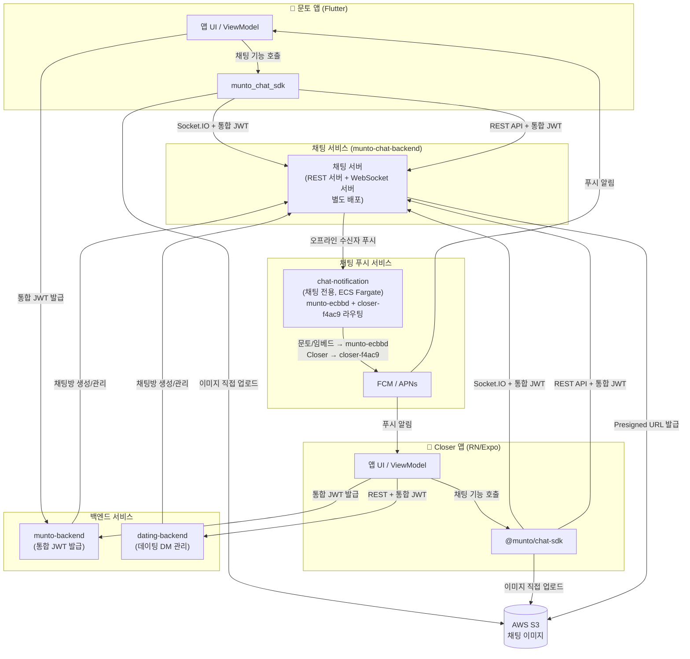
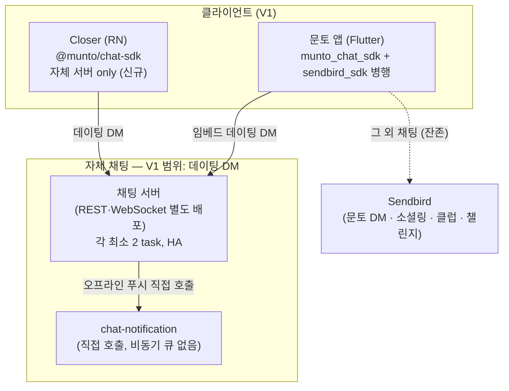
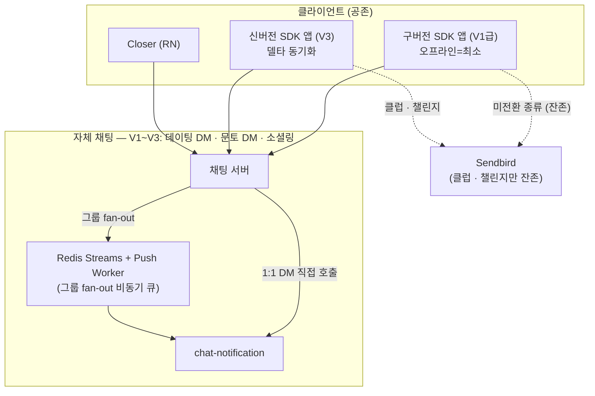
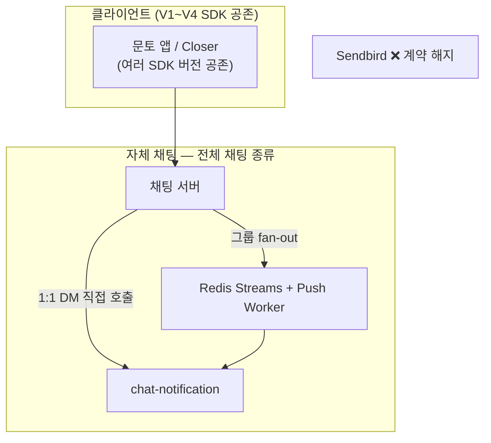
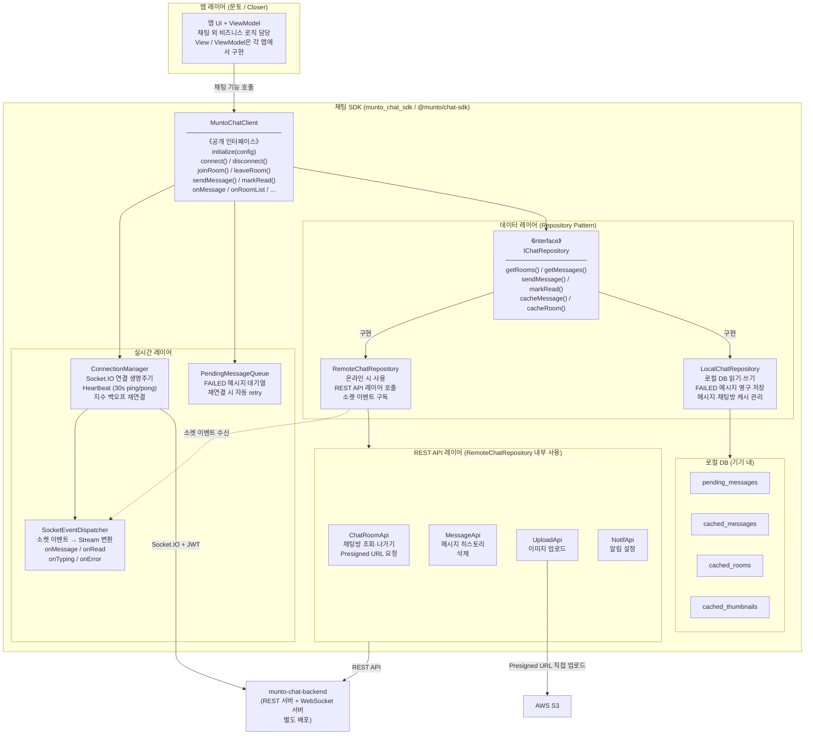
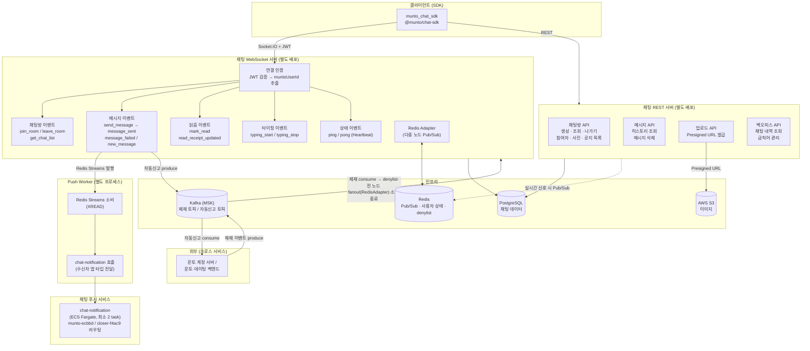

# **채팅 서비스 SRS**

# **1 Introduction (개요)**

## **1.1 Purpose (목표)**

- 이 문서는 채팅 서비스 핵심 기능과 요구사항을 정의한 SRS(Software Requirements Specification) 문서이다.
- 이 SRS는 채팅 서비스의 모바일 앱(iOS/Android)과 백엔드 전반에 대한 요구사항을 다룬다. 웹 프론트엔드 채팅 SDK 지원은 현재 범위에서 제외한다. 웹 채팅이 필요한 시점에 재검토한다.
- 이 문서는 개발자, 디자이너, 기획자 및 이해관계자가 시스템의 동작과 구조를 명확히 이해하는 데 목적이 있다.
- 이 문서는 기존 문토 서비스에서 제공하던 채팅 서비스를 대체하는 신규 채팅 서비스에 대한 요구사항을 중점적으로 정의한다.

## **1.2 Product Scope (범위)**

문토와 데이팅 서비스는 현재 채팅 기능을 외부 솔루션 Sendbird에 의존하고 있다. Sendbird는 MAU(Monthly Active Users, 월간 활성 사용자) 기반 과금 구조여서 사용자가 늘수록 비용이 가파르게 증가하고, 메시지 한도·기능 커스터마이징·사용량(limit) 제약으로 문토·데이팅 고유 정책(푸시·금칙어·백오피스 등)을 자유롭게 반영하기 어렵다.

본 프로젝트는 이 외부 의존을 걷어내고 문토·데이팅이 공통으로 사용할 자체 채팅 서버를 구축하는 것을 목표로 한다. 다만 전 기능을 한 번에 자체 구축하지 않고, **Time-to-Market(빠른 출시)을 최우선**으로 채팅 종류별로 단계적으로 전환한다. 가장 독립적이고 빠르게 떼어낼 수 있는 **데이팅 채팅(V1)**을 먼저 출시해 Sendbird 의존을 즉시 일부 제거한 뒤, **문토 DM(V2) → 소셜링 그룹 채팅(V3) → 클럽·챌린지 그룹 채팅(V4)** 순으로 확대한다. 각 단계가 완료될 때마다 해당 영역의 Sendbird 사용을 중단해 비용을 단계적으로 절감하고, 최종 단계(V4)에서 Sendbird 계약을 완전히 해지한다. 단계별 범위는 2.7, 전환 방식(컷오버·강업·롤백)은 2.8을 참조한다.

채팅 서버는 두 서비스에서 독립적으로 확장·배포할 수 있도록 별도 MSA(Microservice Architecture)로 구성하며, munto-backend가 발급하는 통합 JWT Payload(문토 모노레포에 정의)를 채팅 서버와 데이팅 백엔드가 공통으로 검증해 단일 사용자 식별 체계로 인증을 처리한다. 이를 통해 Sendbird 대비 운영 비용을 절감하고, 푸시·금칙어·백오피스 등 문토 고유 정책을 자유롭게 반영할 수 있는 기반을 확보한다.

- 본 프로젝트는 다음 채팅 기능을 모두 범위에 포함하며, 채팅 종류별로 V1~V4 단계로 나누어 전환한다(단계별 범위는 2.7 참조).
  - **데이팅 DM** (V1): 데이팅 서비스에서 사용되는 1:1 메시지 기능. 채팅 서버 아키텍처(Socket.IO, 메시지 전송/수신, 푸시 알림)는 문토 DM과 동일하나, 다음 정책에서 차이가 있다:
    - **진입 조건**: 유료 결제 후 채팅방 활성화 가능 (데이팅 백엔드에서 결제 처리 후 채팅 서버에 활성화 요청)
    - **채팅방 상태**: CREATED(생성) → ACTIVATED(활성화) → EXPIRED(만료) / LEFT(나감)
    - **채팅방 만료**: 활성화일로부터 30일 경과 시 자동 만료, 이후 접근 불가
    - **채팅방 생성 주체**: 데이팅 백엔드 (친구 신청 수락 시 채팅 서버에 채팅방 생성 API 호출)
  - **문토 DM (Direct Message)** (V2): 사용자 간 1:1 개인 메시지 기능
  - **소셜링 채팅** (V3): 소셜링 모임 참여자 간의 그룹 채팅 기능
  - **클럽·챌린지 채팅** (V4): 클럽(피드·채널·투표 등)과 챌린지(인증하기·인증률 표시 등) 그룹 채팅. 별도 기능이 필요하며 가장 마지막 단계로 전환한다. 요구사항은 7.7에 정의한다.
  - **푸시 알림**: 채팅 메시지 수신 시 푸시 알림 발송 기능 (전 단계 공통)
  - **백오피스 채팅 관리 기능**: 관리자가 채팅 내역을 조회하고 모니터링할 수 있는 관리자 기능 (전환된 채팅 종류 단위로 함께 확대)

## **1.3 Document Conventions (문서규칙)**

- **용어 및 표기 규칙 (Terminology and Notation)**
  - 기술 용어는 영어 원문으로 표기하고, 최초 등장 시 괄호 안에 한글 병기 (예: Middleware(미들웨어))
  - 약어는 최초 등장 시 전체 용어와 함께 표기 (예: Simple Object Access Protocol (SOAP))
- **우선순위 정의 (P1 ~ P3)**
  - **P1**: 프로젝트에 **반드시 포함되어야 하는 핵심 기능**
  - 프로젝트 목표 달성에 필수이며, 제외 시 릴리스 불가능
  - **P2**: **중요하지만 P1보다는 우선순위가 낮은 기능**
  - 프로젝트 일정 내 구현이 권장되며, 일정에 따라 조정 가능
  - **P3**: **추가되면 좋지만 필수는 아닌 기능**
  - 여유가 있을 때 구현하며, 추후 릴리스 대상이 될 수 있음
- **버전 용어 (Version Terminology)** — 본 문서에서 'V'/'버전' 표기는 의미가 다르므로 다음 세 축으로 구분한다. 혼동을 막기 위해 각 표기는 정의된 의미로만 사용한다.
  - **전환 단계 (Cutover Stage) — V1 / V2 / V3 / V4**: 채팅 종류를 Sendbird에서 자체 서버로 전환하는 단계. 본 문서의 상위 전략 축이며, 7장 각 기능에 `[V1]`~`[V4]` 태그로 매핑한다. (V1 데이팅 DM / V2 문토 DM / V3 소셜링 / V4 클럽·챌린지 — 상세 2.7)
  - **산출물 버전 (Output Version) — v1.0.0 등**: SDK·채팅 서버 패키지의 시맨틱(semantic) 버전. 전환 단계와 무관하게 패키지별로 독립 증가한다. (1.7.2)
  - **앱 최소 버전 게이트 (Min App Version) — `minVersion`**: 각 전환 단계 flip 시 해당 채팅 종류 사용에 요구되는 앱 스토어 버전. 미달 시 채팅 진입을 차단하고 업데이트를 유도한다. (2.8.4)

## **1.4 Terms and Abbreviations (정의 및 약어)**

- **문토**: 소셜링, 클럽, 챌린지를 포함한 문토 서비스
- **소셜링, 클럽, 챌린지**: 문토에서 제공하는 모임 종류
  - **소셜링 채팅**: 소셜링 모임 참여자들의 그룹 채팅
  - **챌린지 채팅**: 챌린지 모임 참여자들의 그룹 채팅
  - **클럽 채팅**: 클럽 모임 참여자들의 그룹 채팅
- **Closer**: 기존 문토 앱 내 데이팅 기능을 독립 분리하여 출시하는 데이팅 전용 앱. React Native(Expo) 기반, 번들 ID `kr.munto.closer`, Firebase 프로젝트 `closer-f4ac9`. (DEVT-164)
- **문토 임베드 데이팅**: 기존 문토 앱(`munto-mobile`) 안에 Flutter 패키지(`dating-mobile`)로 포함된 데이팅 화면. Closer와 동일 백엔드를 공유하며, 전환기 동안 병행 운영 후 sunset 예정.
- **muntoUserId**: 채팅 서버·dating-backend·chat-notification이 공통으로 사용하는 사용자 식별자. 통합 JWT의 `userId` 클레임 값이자 dating DB `User.id`(FK 통합 구조)와 동일.
- **통합 JWT**: munto-backend가 `JWT_KEY`로 서명·발급하는 단일 JWT. payload의 `userId`(= muntoUserId) 커스텀 클레임을 포함하며, dating-backend·채팅 서버가 `JWT_KEY`로 직접 검증. 2단계 토큰 교환 없음 (WEBB-1196). 식별 필드는 표준 `sub`가 아니라 **현행 munto-backend 발급 형식인 커스텀 `userId`** 를 사용한다(WEBB-1196 토큰 호환 개선과 정렬 — 마이그레이션 0).
- **MSA**: Microservice Architecture (마이크로서비스 아키텍처), 단일 애플리케이션을 여러 개의 작은 서비스로 분할하여 독립적으로 배포하고 확장 가능한 아키텍처 패턴
- **채팅 SDK**: 클라이언트(앱)에서 채팅 서버와 통신하기 위한 공통 라이브러리. Socket.IO 연결 관리, 메시지 전송/수신, 읽음 처리 등 채팅 핵심 로직을 제공하며, UI/UX는 각 앱에서 별도 구현한다.
  - `munto_chat_sdk` (Flutter): 문토 앱에서 사용
  - `@munto/chat-sdk` (TypeScript): Closer 앱(RN/Expo)에서 사용 (문토 웹 지원은 현재 범위 제외 — 웹 채팅 필요 시점에 재검토)
- **chat-notification**: **채팅 메시지 푸시 전용** FCM/APNs 발송 서버(신규). 채팅 서버의 Push Worker가 트리거하며, 수신자 앱에 따라 두 Firebase 프로젝트(문토/임베드 → `munto-ecbbd`, Closer → `closer-f4ac9`)로 라우팅한다. 데이팅·문토의 서비스 일반 알림 서버와 용도를 분리한 전용 서버로, ECS Fargate에 **최소 2 task(Multi-AZ)** 상시 기동한다. 상세·플랫폼 선택 근거는 §6.1 푸시 서버 구성 참조.
- **munto-notification**: 문토 **서비스 일반 알림**(공지·마케팅 등) FCM 푸시 발송 서버. Firebase 프로젝트 `munto-ecbbd` 사용. (채팅 푸시는 `chat-notification`이 담당)
- **closer-notification**: 데이팅(Closer) **서비스 일반 알림**(매칭·좋아요·마케팅 등) FCM 푸시 발송 서버. Firebase 프로젝트 `closer-f4ac9` 사용. (채팅 푸시는 `chat-notification`이 담당)
- **denylist (제재 목록)**: 채팅 웹소켓 서버가 **현재 계정 제재 중인 사용자**를 `(userId, service)` 키로 보관하는 인메모리 캐시. 계정/데이팅/문토 백엔드가 발행한 `user-sanction-event`(Kafka)를 받아 채워지고 Redis Pub/Sub로 전 노드에 전파된다. handshake·메시지 전송 시 이 목록으로 제재 여부를 즉시 판단해 연결 거부·전송 차단·소켓 강제 종료를 수행한다(SRS 7.8.4). 메시지 *내용*을 거르는 금칙어(7.6.3)와 별개 — denylist는 *사람(제재)* 을 막는다.
- 문토봇: 채팅방에 자동으로 포함되어 시스템 공지 및 메시지를 전송하는 관리자 역할의 시스템 봇. 백오피스에서 채팅 내역 조회 시 문토봇이 포함된 모든 채팅방을 모니터링할 수 있다.
- 개인 채팅: 1대1로 이루어지는 채팅이며, 관리자(문토봇)를 참여자로 포함한다 (실제 참여자: 사용자 2명 + 관리자 1명 = 총 3명)
- 그룹 채팅: 여러명으로 이루어지는 채팅이며, 관리자(문토봇)를 참여자로 포함한다
- 지수 백오프(Exponential Backoff): 재시도 간격을 점진적으로 늘리는 방식 (예: 1초 → 2초 → 4초). 서버 부하를 감소시키고 일시적 장애 시 복구 시간을 확보하기 위한 재시도 전략
- Graceful Degradation (우아한 성능 저하): 서버 장애나 일부 기능 실패 시 전체 서비스를 중단하지 않고, 일부 기능만 제한하고 나머지는 정상 동작하도록 하는 방식. 예를 들어, 메시지 전송이 실패해도 기존 메시지 조회는 가능하도록 함
- **사용자 상태 (3단계 모델)**: 해당 채팅방의 메시지를 실시간으로 수신할 수 있는지 여부를 기준으로 판단
  - **Active (활성)**: Socket.IO 연결 + 해당 채팅방을 현재 보고 있는 상태. `join_room` 이벤트로 활성 채팅방이 설정된다. 실시간으로 메시지를 수신 중이므로 **푸시 알림을 발송하지 않는다**.
  - **Idle (유휴)**: Socket.IO 연결은 되어있으나, 다른 채팅방/화면을 보고 있거나 앱이 백그라운드인 상태. 채팅 목록 화면이거나 다른 채팅방에 `join_room` 한 경우. Socket.IO로 메시지를 전송하며, **클라이언트에서 로컬 푸시를 표시**한다.
  - **Offline (오프라인)**: Socket.IO 연결이 없는 상태. 연결이 끊기는 이유(앱 종료, 백그라운드 전환, 네트워크 끊김, 로그아웃 등)와 관계없이 오프라인으로 처리된다. **Push Worker가 채팅 전용 노티 서버(chat-notification)를 통해 FCM/APNs 시스템 푸시를 발송**한다.
- **메시지 전송 상태 (클라이언트)**: 클라이언트에서 메시지 전송 진행 상황을 추적하기 위한 상태
  - **PENDING (대기)**: 전송 대기 중. 오프라인 상태이거나 전송 큐에서 대기 중인 메시지
  - **SENDING (전송 중)**: 서버로 전송 중. 서버 응답을 기다리는 상태
  - **SENT (전송 완료)**: 서버에서 메시지 수신 확인 완료
  - **FAILED (전송 실패)**: 재시도 횟수 소진 후 최종 실패. 사용자가 수동으로 재전송 가능

## **1.5 Related Documents (관련문서)**

- 정책문서 : [채팅 정책문서](https://www.notion.so/PRD-27fe2bc7639d80a6ba62dd97819ab773?pvs=21)
- UI : [Figma](https://www.figma.com/file/CAql5x1tM0PfXUc1zMcibf?fuid=1451025038222354641)
- API: [swagger.yaml](./api/swagger.yaml)
- 소켓 이벤트: [socket-events](./api/socket-events.md)
- ERD: [ERD](./database/erd.md) [Client DB](./database/client-local-db.md)

## **1.6 Intended Audience and Reading Suggestions (대상 및 읽는 방법)**

- **개발자**
  - 시스템 아키텍처, API 설계, 데이터 모델, 매칭 알고리즘 등 **기술적 구현 사항을 완벽히 이해하고 개발**할 수 있도록 작성되었다.
  - 특히 3장(환경), 4장(외부 인터페이스), 7장(기능 요구사항)을 중점적으로 검토하며, 전체 문서를 정독할 것을 권장한다.
- **기획자 & 디자이너**
  - 비즈니스 목표, 서비스 전략, 기능 우선순위 등 **제품 전략과 로드맵 수립**에 필요한 정보를 확인한다.
  - 온보딩 플로우, 프로필 카드 디자인, 매칭 인터랙션, 채팅 UI 등 **사용자 경험과 인터페이스 설계**에 필요한 내용을 중심으로 읽는다.
  - 2장(전체 설명)과 7장(기능 요구사항)의 UI/UX 관련 섹션에 집중하여 검토한다.
- **운영팀**
  - 프로필 심사 프로세스, 신고/차단 처리, 사용자 안전 정책 등 **서비스 운영과 관리에 필요한 기능**을 파악한다.
  - 6장(기능 이외 요구사항)의 안전성 및 보안 섹션과 7장의 관리자 기능 부분을 중심으로 검토한다.
- **마케팅팀**
  - **마케팅 전략 수립**에 필요한 정보를 확인한다.
  - 2장(전체 설명)과 7장(기능 요구사항)의 주요 기능을 중심으로 검토하여 고객 획득 캠페인과 콘텐츠 마케팅 관점에서 검토한다.

## **1.7 Project Output (프로젝트 산출물)**

본 프로젝트 결과물의 형태 및 버전 등에 대해 기술한다.

산출물의 형태가 제품인지 라이브러리인지 툴인지 등을 구분하여 기술하며, 산출물명(가칭) 및 그 대표 버전을 기술한다.

### **1.7.1 Output Format (산출물 형태)**

- **Mobile SDK (Flutter)**: 문토 앱에서 사용하는 Flutter 채팅 SDK 패키지
- **TypeScript SDK**: Closer 앱(RN/Expo)에서 사용하는 TypeScript 채팅 SDK 패키지 (문토 웹 지원은 현재 범위 제외 — 웹 채팅 필요 시점에 재검토)
- **Backend**: 채팅 서버 (별도 레포지토리로 신규 생성). **백오피스 REST API 포함** — 채팅 서버가 API만 제공하고 기존 문토 백오피스 프론트가 이를 소비한다. 채팅 전용 백오피스 화면은 신규 개발하지 않는다(7.8).
- **chat-notification**: 채팅 푸시 전용 노티 서버 (ECS Fargate, 신규). 상세 §6.1
- 백오피스 **프론트엔드**: 신규 산출물 아님 (기존 문토 백오피스 재사용)

### **1.7.2 Output Name and Version (산출물명(가칭) 및 버전)**

- **서비스명**: Munto Chat Service
- **Mobile SDK (Flutter)**
  - **패키지명**: munto_chat_sdk (신규 생성)
  - 문토 앱(iOS/Android)에서 사용하는 Flutter 채팅 SDK
  - Socket.IO 연결 관리, 메시지 전송/수신, 읽음 처리 등 핵심 로직 제공
  - IChatRepository 인터페이스로 Remote/Local 데이터 소스 추상화
  - UI는 각 앱에서 별도 구현
- **TypeScript SDK**
  - **패키지명**: @munto/chat-sdk (신규 생성)
  - Closer 앱(React Native/Expo)에서 사용하는 TypeScript 채팅 SDK
  - Flutter SDK와 동일한 IChatRepository 인터페이스 제공
  - UI는 각 앱에서 별도 구현
  - 문토 웹(React+Next.js) 지원: 현재 범위 제외. 웹 채팅이 필요한 시점에 재검토
- **Backend**
  - **레포지토리명**: munto-chat-backend (신규 생성)
- **초기 버전**: v1.0.0

### **1.7.3 Patent Information (특허 출원 유무 및 내용)**

None

# **2 Overall Description (전체 설명)**

본 프로젝트 산출물의 T0-BE 모습에 대한 전체적인 구성 및 동작, 기능 등에 대해 간략하게 기술한다.

상세한 기능 스펙은 7장에서 기술한다.

## **2.1 Product Perspective (제품 조망)**

채팅 서비스는 문토 플랫폼과 Closer(데이팅) 앱에서 공통으로 사용하는 독립 MSA(Microservice Architecture)이다. 이 섹션은 채팅 서비스를 **외부에서 바라본 관점**으로, 어떤 시스템들과 어떤 관계를 맺는지를 정의한다.

**핵심 설계 원칙:**

- **채팅 SDK는 순수 채팅 로직만 담당**: 소켓 연결 관리, 메시지 전송/수신, 읽음 처리, 로컬 캐싱 등 채팅 핵심 로직만 제공. UI/UX는 각 앱(문토, Closer)에서 별도 구현
- **통합 JWT 기반 인증**: munto-backend가 발급하는 단일 JWT(`userId` = muntoUserId)를 채팅 서버와 dating-backend가 `JWT_KEY`로 직접 검증. 2단계 토큰 교환 없음 (WEBB-1196)
- **채팅 푸시 전용 서버 분리**: 채팅 메시지 푸시는 채팅 전용 `chat-notification` 서버가 담당한다. 데이팅·문토의 서비스 일반 알림 서버(`closer-notification` / `munto-notification`)와 **용도를 분리**해, 채팅 버스트 트래픽·장애·SLA가 서비스 알림과 상호 간섭하지 않게 한다. `chat-notification`은 수신자 앱에 따라 Firebase 프로젝트(문토/임베드 → `munto-ecbbd`, Closer → `closer-f4ac9`)로 라우팅한다. 상세·플랫폼 선택 근거는 §6.1 참조

**Context 다이어그램 (외부 관계):**

앱 UI는 채팅 서버에 직접 접근하지 않는다. 채팅 SDK가 유일한 진입점이며, 소켓 연결·REST 호출·로컬 캐싱을 모두 중개한다.




**채팅 SDK 구성:**


| SDK               | 플랫폼        | 사용처                                                   |
| ----------------- | ---------- | ----------------------------------------------------- |
| `munto_chat_sdk`  | Flutter    | 문토 앱 (iOS/Android)                                    |
| `@munto/chat-sdk` | TypeScript | Closer 앱 (RN/Expo) (문토 웹은 현재 범위 제외 — 웹 채팅 필요 시점에 재검토) |


**전환 단계별 Context 다이어그램 (V1 / V3 / V4):**

위 Context는 전환 완료 후의 일반 구조다. 실제로는 전환 진행에 따라 구조가 바뀌므로, 구조가 달라지는 **V1 / V3 / V4** 세 시점을 각각 그린다. 각 시점에 ① 공존하는 클라이언트(아직 Sendbird를 쓰는 채팅 종류 + 롤아웃 윈도우의 SDK 버전 다양성), ② 푸시 경로(직접 호출 vs 비동기 큐), ③ Sendbird 잔존 범위를 표현한다. 단계별 요구사항·오프라인 수준은 §2.7, 전환 메커니즘은 §2.8 참조.

> **V2(문토 DM)는 별도 다이어그램 없음**: V2는 V1과 구조가 동일하다(1:1 → chat-notification 직접 호출, 비동기 큐 없음). **문토 앱의 문토 DM이 Sendbird→자체 서버로 옮겨오는 것만 다르며**, 채팅 서버·푸시 경로·오프라인 수준은 V1과 같다. V1 다이어그램에서 "자체 전환 범위"에 문토 DM이 추가된 형태이다.

**[V1] 데이팅 DM만 자체 전환 — 직접 호출, 최소 오프라인**




- 클라 오프라인 = 최소(낙관적 전송·FAILED 로컬 큐·수동 재전송·active 방 재연결 갭 채우기). 델타 동기화/캐시 없음.
- 푸시 = 채팅 서버가 chat-notification 직접 호출(Redis Streams·Push Worker 없음).

**[V3] 소셜링(그룹)까지 자체 — 비동기 큐 도입, SDK 버전 공존**




- **SDK 버전 공존**: 구버전 SDK 앱(오프라인 최소)과 신버전 SDK 앱(델타 동기화)이 같은 서버에 붙는다. 서버 `sync` API는 구버전이 호출하지 않아도 깨지지 않게 하위호환(2.8).
- **푸시 경로 혼재**: 1:1은 직접 호출 유지, 그룹(소셜링)은 비동기 큐 경유.

**[V4] 전체 전환 — Sendbird 종료**




- 모든 채팅 종류가 자체 서버로 전환되어 Sendbird 의존이 사라진다(계약 해지).
- 클럽·챌린지 특수 기능(7.7)이 그룹 엔진 위에 추가된다. 다수 SDK 버전 공존은 여전히 하위호환으로 흡수한다.

## **2.2 Overall System Configuration (전체 시스템 구성)**

이 섹션은 채팅 서비스를 구성하는 각 컴포넌트의 **내부 구조**를 정의한다.

### 2.2.1 채팅 SDK 내부 구조

채팅 SDK(`munto_chat_sdk` / `@munto/chat-sdk`)는 동일한 내부 구조를 가진다. 앱은 `MuntoChatClient`만 참조하며, 내부 컴포넌트는 외부에 노출되지 않는다.

**참조 관계 원칙:**

- 앱 UI/ViewModel → `MuntoChatClient` (단일 공개 인터페이스)
- `MuntoChatClient` → `IChatRepository` (추상 인터페이스) → `RemoteChatRepository` | `LocalChatRepository`
- `RemoteChatRepository`는 REST API 레이어와 소켓 이벤트를 내부적으로 사용
- 앱은 채팅 서버·로컬 DB에 직접 접근하지 않음




**컴포넌트 역할:**


| 컴포넌트                    | 레이어      | 역할                                                    |
| ----------------------- | -------- | ----------------------------------------------------- |
| `MuntoChatClient`       | 공개 인터페이스 | 앱이 사용하는 단일 진입점. 초기화·연결·채팅방·메시지·이벤트 스트림 제공             |
| `ConnectionManager`     | 실시간      | Socket.IO 연결 생명주기 관리. Heartbeat(30s), 지수 백오프 재연결      |
| `SocketEventDispatcher` | 실시간      | 소켓 이벤트를 각 Stream으로 분기 (onMessage, onRead, onTyping 등) |
| `PendingMessageQueue`   | 실시간      | 전송 실패 메시지 추적. 재연결 시 retryable 메시지 자동 retry            |
| `IChatRepository`       | 데이터      | Remote/Local 데이터 소스 추상화 인터페이스. 앱은 구현체를 알 수 없음         |
| `RemoteChatRepository`  | 데이터      | 채팅 서버 REST + 소켓 이벤트 호출. 온라인 상태에서 사용                   |
| `LocalChatRepository`   | 데이터      | 로컬 DB 읽기·쓰기. FAILED 메시지 영구 저장, 최근 메시지·채팅방·썸네일 캐싱      |
| REST API 레이어            | 전송       | HTTP 클라이언트 모음. `RemoteChatRepository`가 내부적으로 사용       |
| 로컬 DB                   | 저장소      | `LocalChatRepository`가 내부적으로 사용. 앱·다른 레이어는 직접 접근 불가   |


**오프라인 대응 범위 (버전별)**: 완전 오프라인 동작은 지원하지 않으며, 지원 수준을 버전별로 단계화한다(상세 2.7.5). V1은 최소 — 소켓 일시 끊김/전송 실패 시 FAILED 상태로 로컬 저장 후 사용자가 수동 재전송하고, active 방은 재연결 시 커서(`after`)로 갭을 채운다. V2+는 델타 동기화(`sync()`)·오프라인 읽기 캐시로 확대한다. 위 다이어그램의 로컬 DB 4테이블은 V1 baseline이다.

### 2.2.2 채팅 서버 구성 (REST 서버 / WebSocket 서버 — 별도 배포)

채팅 서버는 **REST 서버**와 **WebSocket 서버**를 **별도 배포 단위**로 분리한다(부하 성격이 달라 독립 확장·배포·장애 격리가 유리 — REST=요청량 기준, WS=동시 접속 기준). 코드는 한 모노레포(munto-chat-backend, 예: `apps/rest`·`apps/ws`·Push Worker)로 공유할 수 있다. **두 서버는 서로 직접 호출하지 않고 PG·Redis·Kafka 공유 인프라로만 협력**한다(실시간 신호가 필요하면 Redis Pub/Sub 경유).




**컴포넌트 역할:**


| 컴포넌트          | 역할                                                                         |
| ------------- | -------------------------------------------------------------------------- |
| 채팅 REST 서버   | (별도 배포) 채팅방 CRUD, 메시지 히스토리, 이미지 업로드 URL 발급, 백오피스 기능. WS와 직접 호출 없이 PG/Redis 공유 |
| 채팅 WebSocket 서버  | (별도 배포) JWT 검증 후 실시간 이벤트 처리(입퇴장·메시지·읽음·타이핑·Heartbeat) + 제재 denylist enforcement + Kafka in/out. 동시 접속 기준 독립 확장 |
| Redis Adapter | 다중 Socket.IO 서버 간 메시지 동기화 (Pub/Sub). 사용자 상태(Active/Idle/Offline) 관리. **제재 이벤트를 전 노드에 fanout하여 로컬 denylist 갱신 + 타깃 disconnect**(7.8.4)        |
| Push Worker   | 별도 프로세스. Redis Streams에서 푸시 이벤트 소비 → 수신자 앱 타입과 함께 chat-notification에 발송 위임 |
| Kafka 연동 (Socket.IO 모듈) | **크로스 서비스 이벤트는 웹소켓 서비스가 담당**(REST 백엔드 미관여). **consume(in)**: 계정 서버 제재 이벤트 → denylist/소켓 종료(§4.4 S2, 7.8.4). **produce(out)**: 금칙어·외부링크 자동 신고 → 문토/데이팅 백엔드(§4.4 S1, 7.6.6). 이미 보유한 MSK 활용 |
| PostgreSQL    | 채팅방, 메시지, 참여자, 읽음 상태 등 채팅 데이터 영구 저장                                        |
| Redis         | Socket.IO Pub/Sub, 사용자 온라인 상태, denylist 공유 스냅샷, Push Worker 이벤트 큐(Streams)                  |
| AWS S3        | 채팅 이미지 저장. 클라이언트가 Presigned URL로 직접 업로드 (서버 부하 감소)                         |

> **Redis Pub/Sub ≠ Redis Streams (혼동 주의):**
> - **Redis Pub/Sub**(Socket.IO Adapter): 다중 노드 메시지 동기화·사용자 상태·**제재 fanout**. 다중 노드 운영의 필수 요소라 **V1부터 상시**(HA 최소 2 task). 전파(fanout) 전용 — 저장하지 않음(fire-and-forget).
> - **Redis Streams**: 그룹 푸시 1:N fan-out 비동기 큐. **V3+(그룹 채팅)부터** 도입(V1·V2는 chat-notification 직접 호출, 2.7.5).
> - 즉 V3+로 미루는 건 **Streams(푸시 큐)** 이며, **Pub/Sub은 V1부터 항상 사용**한다.


**기존 Sendbird 서비스 대체:**

- 기존 Sendbird 기반 채팅 서비스를 자체 구축 채팅 서버로 전환
- 비용 절감 및 커스터마이징 자유도 확보
- 점진적 마이그레이션을 통한 하위 호환성 유지
- Closer 앱은 처음부터 자체 채팅 서버만 사용 (Sendbird 미적용)

## **2.3 Overall Operation (전체 동작방식)**

**사용자 인증 및 연결:**

1. 사용자가 문토 앱 또는 웹에서 채팅 기능 진입
2. 클라이언트가 채팅 서버에 채널 URL 요청 (REST API)
3. 채팅 서버에서 채널 URL 및 Socket.IO 연결 정보 제공
4. 클라이언트가 Socket.IO를 통해 채팅 서버에 직접 연결

**채팅방 생성 및 조회:**

1. **소셜링 채팅방 생성**
  - 소셜링 모임 참여 시 자동으로 그룹 채팅방 생성
    - 참여자 모두와 관리자(문토봇)가 자동으로 채팅방에 포함
    - 채팅방 목록에 표시
2. **DM 채팅방 생성**
  - 사용자가 다른 사용자에게 메시지 전송 시도
    - 기존 1:1 채팅방이 없으면 새로 생성
    - 사용자 2명과 관리자(문토봇)가 채팅방에 포함
    - 채팅방 목록에 표시
3. **채팅방 목록 조회**
  - 사용자가 참여한 모든 채팅방 목록 조회
    - 최근 메시지 시간 순으로 정렬
    - 읽지 않은 메시지 수 표시

**메시지 전송 및 수신:**

1. **메시지 전송**
  - 사용자가 채팅방에서 메시지 입력 및 전송
    - 클라이언트가 Socket.IO를 통해 채팅 서버에 메시지 전송
    - 채팅 서버에서 메시지 검증 및 저장 (PostgreSQL)
    - 채팅방 참여자들에게 실시간으로 메시지 전달
    - 오프라인 사용자 대상 푸시 발송 (V1·V2: chat-notification 직접 호출 / V3~: Redis Streams 발행 — 2.7.5 참조)
2. **메시지 수신**
  - Socket.IO를 통해 실시간으로 메시지 수신 (온라인 사용자)
    - 읽지 않은 메시지 수 자동 업데이트
    - 채팅방 목록에 최근 메시지 미리보기 표시
3. **푸시 알림 발송 (Hybrid 구조, 3단계 상태 모델)**
  - 채팅 서버에서 사용자 상태(Active/Idle/Offline)를 판단하여 푸시 발송 여부 결정
    - Active (해당 채팅방 보는 중): 푸시 발송 안 함 (실시간 수신 중)
    - Idle (앱 열림, 다른 화면): Socket.IO로 전달 → 클라이언트에서 로컬 푸시 표시
    - Offline: chat-notification을 통해 FCM/APNs 발송 (V1·V2 직접 호출 / V3~ Redis Streams + Push Worker 비동기 큐 — 2.7.5 참조)
    - 푸시 알림 클릭 시 해당 채팅방으로 이동
    - 상세 내용은 6.1.3 채팅 푸시 알림 아키텍처 참조
4. **메시지 공지 설정**
  - 특정 메시지를 공지사항으로 설정

**읽음 처리:**

1. 사용자가 채팅방 진입 또는 메시지 확인
2. 클라이언트가 읽음 처리 요청 전송
3. 서버에서 읽음 상태 업데이트 (PostgreSQL)
4. 상대방에게 읽음 처리 알림 전송
5. 읽지 않은 메시지 수 실시간 업데이트

**채팅방 관리:**

1. **채팅방 나가기**
  - 사용자가 채팅방에서 나가기 요청
    - 채팅방은 유지되며, 해당 사용자만 제외
    - 새로운 메시지 알림은 전송되지 않음
2. **백오피스 채팅 모니터링**
  - 관리자가 백오피스에서 채팅 내역 조회
    - 관리자(문토봇)가 포함된 모든 채팅방 모니터링 가능
    - 채팅 통계 및 사용자 행동 분석

**실시간 통신 흐름:**

```
[사용자 A] → [메시지 입력] → [Socket.IO 전송] → [채팅 서버]
                                                      ↓
                                              [메시지 저장]
                                                      ↓
                                              [메시지 브로드캐스트]
                                                      ↓
[사용자 B] ← [Socket.IO 수신] ← [채팅 서버]

```

**기능 관계도:**

```
[로그인] → [JWT 발급] → [채널 URL 요청] → [Socket.IO 연결]
                                              ↓
                                    [채팅방 목록 조회]
                                              ↓
                          ┌───────────────────┴───────────────────┐
                          ↓                                         ↓
                  [소셜링 채팅방]                            [DM 채팅방]
                          ↓                                         ↓
                  [그룹 메시징]                            [1:1 메시징]
                          ↓                                         ↓
                  [읽음 처리]                              [읽음 처리]
                          ↓                                         ↓
                    [채팅방 관리]                          [채팅방 관리]

```

## **2.4 Product Functions (제품 주요 기능)**

본 프로젝트 산출물의 주요 기능을 간략히 기술한다. 상세한 기능은 7장에서 참조한다.

7장의 주요 제목과 일치해야 한다.

**인증 및 연결 관리**

- JWT 기반 인증 (통합 JWT Payload 검증)
- Socket.IO 연결 관리 및 세션 관리
- 연결 재시도 및 복구 기능

**채팅방 관리**

- **소셜링 채팅방**: 소셜링 모임 참여 시 자동 생성되는 그룹 채팅방
- **DM 채팅방**: 사용자 간 1:1 개인 메시지 채팅방
- **데이팅 DM**: 데이팅 서비스에서 사용되는 1:1 메시지 채팅방
- **채팅방 최대 인원**: 한 채팅방당 최대 100명 (관리자 포함)
- 채팅방 목록 조회 (최근 메시지 순 정렬)
  - 채팅방 정보 조회
- 채팅방 나가기
- 채팅방 참여자 목록 조회 (햄버거 버튼을 통한 접근)
- 채팅방 사진 모아보기 (채팅방 내 전송된 모든 이미지 조회)
- 채팅방 공지 모아보기 (채팅방 내 공지사항으로 설정된 메시지 조회)

**메시지 전송 및 수신**

- 실시간 메시지 전송 및 수신 (Socket.IO)
  - 텍스트 메시지 전송
  - 이미지 메시지 전송 (단일 이미지 및 여러 이미지 모아보내기 지원)
  - 메시지 목록 조회 (페이지네이션)
  - 메시지 읽음 처리
  - 메시지 삭제
- 메시지 공지사항 설정 (특정 메시지를 공지사항으로 지정)

**읽음 처리 및 상태 관리**

- 읽지 않은 메시지 수 관리 (실시간 업데이트)
- 채팅방 목록 실시간 업데이트 (새 메시지 수신 시)
  - 사용자 온라인/오프라인 상태 관리
- 입력 중 상태 표시

**푸시 알림**

- 채팅 메시지 수신 시 푸시 알림 발송
- 오프라인 수신자 푸시 발송 (V1·V2 직접 호출 / V3~ Redis Streams + Push Worker — 2.7.5)
- 푸시 알림 설정 관리 (채팅 알림 켜기/끄기)
- 읽지 않은 메시지 수 기반 푸시 알림
- 푸시 알림 클릭 시 해당 채팅방으로 이동
- 채팅방별 알림 설정 (방해금지 모드 등)

**안전 기능**

- 차단 대상 메시지 자동 차단 (금칙어, 외부 링크. 부적절한 이미지 감지는 V1 미포함 — 7.6.5 TBD)
- 신고 연동 (사용자 신고는 앱 백엔드 직접 호출, 자동 신고는 채팅 서버→앱 백엔드 전달 — 7.6.6)
- 차단 연동 (차단 SOT = 앱 백엔드 — 매칭·프로필·소셜링 등 앱 전역 영향. 채팅 서버는 이벤트 기반 강제만 — 7.6.7)
- DM 어뷰징 방지 (Rate Limiting)

**클럽/챌린지 특수 기능 (향후 구현 예정) [V4]**

- 챌린지 채팅방: 인증하기, 인증률 표시
- 클럽 채팅방: 피드, 채널, 소셜링 연결, 투표

**관리자 기능 (백오피스)**

- 채팅 내역 조회 및 모니터링
- 채팅방 통계 정보 조회
- 계정 제재 연동 (제재·차단 결정은 앱 백엔드 소유, 채팅 서버는 강제 반영 — 7.6.7/7.8.4)
- 금칙어 관리 (금칙어 목록 추가/수정/삭제)

상세한 기능 명세는 7장에서 다룬다.

## **2.5 User Classes and Characteristics (사용자 계층과 특징)**

**문토 앱 사용자**

- **자격 요건**: 문토 계정 보유자
- **연령대**: 주로 20-30대 (문토 메인 사용자층)
- **주요 기능**: 소셜링 채팅, 클럽 채팅, 챌린지 채팅, 문토 DM
- **클라이언트**: 문토 앱 (Flutter) — `munto_chat_sdk` 사용

**Closer 앱 사용자 (데이팅)**

- **자격 요건**: 문토 계정 보유자 중 데이팅 서비스 이용자 (muntoUserId 기반 통합 계정)
- **연령대**: 주로 20-30대
- **주요 기능**: 데이팅 DM
- **클라이언트**: Closer 앱 (RN/Expo)
- **전환기 병행**: 문토 임베드 데이팅(`dating-mobile`) 사용자도 동일 채팅 서버 공유, 전환 유도 후 sunset

**관리자 (Administrators)**

- **자격 요건**: 문토 운영팀
- **주요 기능**: 채팅 내역 조회 및 모니터링, 유해 메시지 삭제, 금칙어 관리, 계정 제재 연동(신고 처리·제재 결정은 앱 백오피스 — 7.6.6)
- **접근 권한**: 백오피스 시스템 접근, 민감 정보 열람 제한

## **2.6 Assumptions and Dependencies (가정과 종속 관계)**

### **2.6.1 사용자 식별 체계**

채팅 서버와 데이팅 백엔드는 **muntoUserId**를 공통 사용자 식별자로 사용한다. dating DB의 `User.id`가 muntoUserId와 동일한 FK 통합 구조로, 별도 ID 매핑 없이 단일 식별자로 두 서비스를 연동한다.

**통합 JWT payload 구조:**

- `userId`: muntoUserId (사용자 식별자, 채팅 서버와 dating-backend 공통 사용). 표준 `sub`가 아니라 **현행 munto-backend 발급 형식인 커스텀 `userId` 클레임**을 사용 — WEBB-1196 토큰 호환 개선과 정렬, 추가 마이그레이션 불필요
- `service`: 토큰 발급 서비스 식별 (선택적)
- 발급 주체: munto-backend (`JWT_KEY`로 서명)
- 검증 주체: 채팅 서버, dating-backend (각각 `JWT_KEY`로 직접 검증)

[채팅 서버 구축을 위한 유저 통합 전략 검토 보고서](https://www.notion.so/munto/2e0e2bc7639d809781c2fd387fbfe3eb)

### **2.6.2 마이그레이션 순서**

채팅 종류별 전환 순서는 **V1 데이팅 DM → V2 문토 DM → V3 소셜링 그룹 채팅 → V4 클럽·챌린지 그룹 채팅**으로 확정한다(상세 2.7). 가장 독립적이고 1:1 구조라 blast radius(영향 범위)가 작은 데이팅·DM을 먼저 떼어내고, 한 방에 참여자가 많아 전환 부담(강업 압력)이 큰 그룹 채팅을 뒤로 둔다.

**가정 및 의존성:**

- **V1(데이팅 DM)**: Closer(RN 독립 앱)는 출시 시점부터 자체 채팅 서버만 사용(Sendbird 미적용)하므로 기획 의존성 없이 독립 진행 가능. 임베드 데이팅(`dating-mobile`)은 기존 Sendbird 데이팅 채팅방 마이그레이션이 필요하다.
  - **선행 작업(Kafka 기반, 사내)**: ① 계정 제재 전파를 위해 **각 서비스 백엔드(문토 계정/백엔드·dating-backend)가 제재 Kafka 토픽 producer** 필요(서비스별 — 자기 `service`로 발행, §4.4 S2, 7.8.4). ② 자동 신고를 데이팅도 지원하려면 **dating-backend에 자동신고 Kafka 토픽 consumer 신규 구축** 필요(현행 데이팅 채팅엔 자동 신고 없음 — 7.6.6, §4.4 S1). 문토·데이팅 모두 kafkajs/MSK를 이미 보유(외부 타팀 의존 없음).
- **V2(문토 DM)**: 1:1 구조로 전환 부담이 낮다. 자동 신고는 munto-backend가 Kafka consume하여 현행 자동신고 로직을 재사용한다(7.6.6).
- **V3·V4(그룹 채팅)**: 소셜링·클럽·챌린지가 같은 채팅 목록에 표시되므로 **채팅 목록 정렬 기획 확정이 선행**되어야 한다. 채팅 목록 기획은 V1 진행 중 확정될 예정이다.

## **2.7 Apportioning of Requirements (단계별 요구사항)**

본 프로젝트는 Time-to-Market 전략(1.2)에 따라 채팅 종류별로 **V1~V4** 전환 단계(1.3 정의)로 나누어 진행한다. 각 단계 완료 시 해당 채팅 종류의 Sendbird 사용을 중단한다.

### **2.7.1 전환 단계별 범위**


| 단계     | 신규 구축 채팅 범위     | 클라이언트                             | 기존 메시지 처리                                 |
| ------ | --------------- | --------------------------------- | ----------------------------------------- |
| **V1** | 데이팅 채팅 (데이팅 DM) | Closer(RN, 신규) + 임베드 데이팅(Flutter) | 진행 중 채팅방만 마이그레이션, 만료분 제외                  |
| **V2** | 문토 DM           | 문토 앱(Flutter)                     | 마이그레이션 없음 — 자연 소멸 (2.8.2 Decision Log 참조) |
| **V3** | 소셜링 그룹 채팅       | 문토 앱(Flutter)                     | 신규부터 자체, 기존은 자연 소멸                        |
| **V4** | 클럽·챌린지 그룹 채팅    | 문토 앱(Flutter)                     | 클럽=신청분 마이그레이션, 챌린지=종료 시점 순차 전환            |


### **2.7.2 Sendbird 단계별 대체**

각 단계 종료 시 해당 영역의 Sendbird 사용을 중단해 비용을 단계적으로 절감한다.


| 단계     | 이 단계에서 떼어내는 것 | 이 단계까지 Sendbird가 담당        |
| ------ | ------------- | -------------------------- |
| **V1** | 데이팅 DM        | 문토 DM · 소셜링 · 클럽 · 챌린지     |
| **V2** | 문토 DM         | 소셜링 · 클럽 · 챌린지             |
| **V3** | 소셜링           | 클럽 · 챌린지                   |
| **V4** | 클럽 · 챌린지      | 없음 → **Sendbird 계약 완전 해지** |


### **2.7.3 V1 핵심: 멀티 클라이언트 동시 개발**

V1 데이팅 채팅은 **클라이언트가 둘**이라는 점이 핵심 난이도이며, 두 SDK와 마이그레이션이 모두 V1 산출물에 포함된다.

- **Closer (React Native/Expo)**: 신규 앱, Sendbird 미적용 → 출시 시점부터 자체 채팅 서버만 사용. `@munto/chat-sdk`.
- **문토 임베드 데이팅 (Flutter)**: 기존 문토 앱(`munto-mobile`) 내 `dating-mobile` 패키지. 기존 Sendbird 데이팅 채팅방을 자체 서버로 **마이그레이션 필요**. `munto_chat_sdk`.

### **2.7.4 우선순위(P1~P3)와의 관계**

기존에는 모든 요구사항을 일괄 P1로 분류했으나, V1~V4 전환 단계 도입에 따라 7장 각 기능에 **전환 단계 태그(`[V1]~[V4]`)를 반영 완료**했다(7장 각 절 헤더 참조). 남은 작업은 기능별 **P1~P3 우선순위 세분류**이며, 후속 차수에서 7장과 함께 정리한다. DB(ERD)·API(Swagger)는 단계별로 쪼개 만들지 않고 V1~V4 전체를 미리 설계(forward-compatible)하되, 각 엔드포인트·테이블이 어느 단계에 활성화되는지는 추적용 단계 태그로 표기한다.

상세한 기능 명세는 7장에서 다룬다.

### **2.7.5 오프라인 지원 단계화**

채팅의 "오프라인 지원"은 성격이 다른 두 층위로 구성되며, Time-to-Market 전략(1.2)에 따라 **버전별로 단계화**한다. 두 층위를 분리해 각 버전이 어디까지 지원하는지 명시한다.


| 층위                | 무엇                             | 담당                        |
| ----------------- | ------------------------------ | ------------------------- |
| **① 서버측 오프라인 푸시** | 오프라인 수신자에게 시스템 푸시(FCM/APNs) 발송 | 채팅 서버 + chat-notification |
| **② 클라측 오프라인 동작** | 로컬 전송 큐·재연결 갭 채우기·캐시           | 채팅 SDK                    |


> **"오프라인 최소화"의 의미**: 오프라인 푸시(①) 자체는 **V1부터 필수**다(앱이 꺼져 있거나 백그라운드일 때 수신 알림이 필요하므로). "최소화"는 푸시 기능을 빼는 것이 아니라, 푸시 발송 *인프라*(비동기 큐)와 클라 동작을 V1에서 단순화하고 단계적으로 고도화한다는 뜻이다.

**① 서버측 오프라인 푸시 — 단계별:** 3단계 상태 모델(Active/Idle/Offline)과 Redis(Socket.IO Adapter·사용자 상태)는 **V1부터 유지**한다(HA 2대 구성상 Redis는 필수). 단, 푸시 *발송 경로*는 단계화한다.


| 단계                 | 발송 경로                                                | 근거                                      |
| ------------------ | ---------------------------------------------------- | --------------------------------------- |
| **V1·V2 (1:1 DM)** | 채팅 서버가 chat-notification을 **직접 호출**(fire-and-forget) | fan-out 없음, 발송량 작음 → 비동기 큐 불필요          |
| **V3~ (그룹)**       | **Redis Streams + Push Worker**(비동기 큐) 도입            | 그룹 1:N fan-out·버스트 → 재시도·내구성·백프레셔·격리 필요 |


- 두 방식 모두 메시지는 PostgreSQL에 영구 저장되므로 푸시는 best-effort다. 비동기 큐의 진가는 발송량·fan-out이 커지는 그룹 단계에서 발휘된다.
- 직접 호출 → 비동기 큐 전환 시 chat-notification HTTP 호출부는 재사용하고 트리거 경로만 교체한다(rework 최소). 상세 비교·파이프라인은 §6.1 참조.

**② 클라측 오프라인 동작 — 단계별:**


| 기능                                                                   | V1               | V2+               |
| -------------------------------------------------------------------- | ---------------- | ----------------- |
| 낙관적 전송 + 상태 표시(PENDING/SENDING/SENT/FAILED)                          | ✅                | ✅                 |
| 실패/대기 메시지 **로컬 저장 + 수동 재전송**                                         | ✅                | ✅                 |
| 과거 내역 조회 (커서 `before`)                                               | ✅                | ✅                 |
| **active 방 재연결 갭 채우기** (커서 `after` + lastMessageId, `reconnect` 트리거) | ✅                | ✅                 |
| 여러 방 일괄/백그라운드 동기화 (안 연 방까지, unread 일괄)                               | ❌ (방 진입 시 개별 조회) | ✅ 델타 동기화 `sync()` |
| 오프라인 읽기 캐시 (네트워크 없이 과거 대화 열람)                                        | ❌                | ✅ 로컬 캐시           |


**V1 필수 — 재연결 갭 채우기 (정합성 요구사항):** 사용자가 채팅방에 머문 채 네트워크가 끊겼다 재연결되면, 끊긴 사이 도착한 메시지가 소켓으로 전달되지 못해 누락된다. 이는 선택이 아니라 정합성 문제이므로 V1에서 처리한다.

- 소켓 `reconnect` 이벤트 시 active 방에 대해 `GET /rooms/{id}/messages?after={lastMessageId}` 로 이후 메시지를 끌어온다.
- **커서는 단조 증가(정렬 가능) 키**여야 한다(서버 발급 시퀀스 또는 `(createdAt, id)` 복합 커서). random UUID는 `after` 비교가 불가하다.
- 갭이 크면 페이지가 가득 찰 때마다 마지막 id로 반복 조회해 따라잡는다(비정상적으로 크면 "최신부터 재로드"로 폴백).
- 재연결 직후 `after` 조회와 실시간 소켓 수신이 겹칠 수 있으므로 **메시지 id 기준 멱등 머지**로 중복/누락을 방지한다.

**V2+ 델타 동기화:** V1 재연결 갭 채우기와 **동일한 커서(`lastMessageId`, `after`) 기반 페이지네이션**을, *active 방 1개가 아니라 참여 중인 모든 방에 대해 백그라운드로* 수행하는 것이다. 즉 새로운 동기화 방식이 아니라 **커서 페이지네이션의 적용 범위를 단일 방 → 전체 방, 포그라운드 → 백그라운드로 확장**한 형태다. `sync()`는 방별 `lastMessageId`를 모아 서버에 전달하고, 서버는 각 방의 그 커서 이후 변경분(델타)만 응답한다(방목록 unread 일괄 갱신 포함). V2 SDK에 추가되므로 V1 SDK 앱과 공존하며, 서버 `sync` API는 구버전 SDK가 호출하지 않아도 깨지지 않게 하위호환을 보장한다(2.8). 버전별 아키텍처 다이어그램은 §2.1 참조.

> **서버 `sync` API 인터페이스는 V2 설계 시 정의 예정** — 현재 API 스펙(`api/swagger.yaml`)에는 포함되지 않는다(V1 범위 밖). V2 착수 시 다수 방 델타 동기화 엔드포인트를 V2 태그로 추가한다.

## **2.8 Backward compatibility (하위 호환성)**

본 프로젝트는 기존 Sendbird 기반 채팅 서비스를 자체 구축 채팅 서버로 전환하는 프로젝트이다.

### **2.8.1 마이그레이션 원칙**

1. **채팅 종류별 hard cutover**: 전환은 채팅 종류 단위로 한 번에 이루어진다. **한 채팅방 안에서 Sendbird와 자체 서버가 혼재할 수 없다**(한쪽은 Sendbird, 한쪽은 자체 서버면 메시지가 서로 닿지 않음). 따라서 한 채팅 종류를 자체 서버로 전환하는 순간, 그 종류를 쓰는 사용자는 전원 자체 서버를 아는 앱 버전이어야 한다.
2. **단계별 전환(V1~V4)**: 채팅 종류별로 V1→V4 순서로 전환하며(2.7), 각 단계 완료 시 해당 영역 Sendbird 사용을 중단한다.
3. **서비스별 차등 적용**: 채팅 종류 특성에 따라 마이그레이션/삭제를 다르게 결정한다(2.8.2).
4. **충분한 사전 공지**: 사용자가 인지할 수 있도록 전환 전 충분히 안내한다(2.8.5).
5. **로우데이터 보관**: 삭제 대상도 감사 대응용으로 백업 보관한다.
6. **Sendbird 완전 종료**: V4까지 전환 완료 후 Sendbird 계약을 해지해 비용을 절감한다.

### **2.8.2 서비스별 마이그레이션 전략**

서비스 특성과 기술적 난이도에 따라 단계적 마이그레이션을 적용한다.

**채팅 유형별 현황:**


| 채팅 유형      | 비중             | 특징                          | 마이그레이션 난이도    |
| ---------- | -------------- | --------------------------- | ------------- |
| **소셜링**    | 대부분            | 소셜링 일자 지나면 삭제 가능            | ⭐⭐ 중간 (기획 의존) |
| **문토 DM**  | 낮음             | 홍보용으로 주로 사용                 | ⭐⭐ 중간         |
| **데이팅 DM** | 5~10% (확장 가능성) | 30일 후 만료 정책, Closer RN 독립 앱 | ⭐ 낮음          |
| **클럽**     | 5% 미만          | 투표 등 커스텀 기능, 연속 채팅          | ⭐⭐⭐ 높음        |
| **챌린지**    | 10개 미만         | 극소수, 인증 기능 필요               | ⭐ 낮음          |


**전환 순서(V1~V4):** 마이그레이션·전환 순서는 2.7의 V1~V4 전환 단계를 따른다(V1 데이팅 DM → V2 문토 DM → V3 소셜링 → V4 클럽·챌린지). 본 절은 각 단계에서 **기존 메시지 데이터를 어떻게 처리할지**를 정의한다.

> **"이전 채팅 보기" 기능 불필요**: Sendbird Data Export API / Platform API로 기존 메시지를 자체 DB로 내려받을 수 있으므로, 별도의 "이전 채팅 보기(Sendbird 병행 조회)" 화면은 만들지 않는다. 마이그레이션 대상은 자체 DB로 이관하고, 비대상은 자연 소멸시킨다.

**서비스별 마이그레이션 방식:**


| 서비스(단계)         | 기존 메시지 처리         | 전환 방식                                                   |
| --------------- | ----------------- | ------------------------------------------------------- |
| **데이팅 DM (V1)** | 진행중 채팅방만 마이그레이션   | 자체 DB로 이관, 만료된 채팅방 제외                                   |
| **문토 DM (V2)**  | 마이그레이션 없음 (자연 소멸) | 신규부터 자체 채팅, 기존은 만료까지 Sendbird 잔존 후 종료 (Decision Log 참조) |
| **소셜링 (V3)**    | 삭제 (로우데이터 보관)     | 신규부터 자체 채팅, 기존은 자연 소멸                                   |
| **클럽 (V4)**     | 신청 클럽 대상 마이그레이션   | 자체 DB로 완전 마이그레이션                                        |
| **챌린지 (V4)**    | 삭제 (로우데이터 보관)     | 종료 시점에 맞춰 순차 전환                                         |


**데이팅 DM (V1):**

- 진행중인 채팅방: 대화 내역 마이그레이션
- 만료된 채팅방: 어차피 접근 불가하므로 마이그레이션 제외 (30일 만료 정책)
- Sendbird Export API로 메시지 추출 → 자체 DB 이관
- 1:1 구조로 마이그레이션 용이
- Closer는 신규 독립 앱이라 Sendbird 없이 처음부터 자체 서버 사용 → 문토 앱 영향 없이 전환 가능. 임베드 데이팅(Flutter)만 기존 채팅방 마이그레이션 대상
- 파일럿 효과: 작은 규모로 자체 채팅 시스템 검증

**소셜링:**

- 소셜링 일자 지나면 채팅방 삭제 가능
- 신규 소셜링부터 자체 채팅 적용, 기존은 자연 소멸
- 로우데이터로 백업 보관 (감사 대응용)
- 전환 전 충분한 공지로 사용자 안내

**챌린지:**

- 현재 10개 미만으로 극소수
- 종료된 챌린지 채팅 내역 사용자에게 노출하지 않음
- 정보성 챌린지의 경우 사용자가 직접 기록하도록 안내
- 로우데이터로 백업 보관 (감사 대응용)

**클럽 (완전 마이그레이션):**

- 전체 5% 미만이나 커스텀 기능(투표 등)으로 난이도 높음
- 마이그레이션 신청한 클럽 대상으로만 진행
- 마이그레이션 대상:
  - 클럽 소셜링 목록
  - 공지사항
  - 앨범 (Sendbird API 제공 여부에 따라 결정)
- 마이그레이션 제외: 투표 데이터
- Sendbird Platform API로 메시지 추출 후 자체 DB로 이관
- **보관 정책**: 이관된 메시지도 공통 3단계 보관 정책(30일 사용자 조회 → 90일 백오피스 → 1년 S3, 6.5.6)을 따른다. "완전 마이그레이션"은 *데이터 이관*을 뜻하며, 사용자 조회는 다른 채팅과 동일하게 30일로 제한된다.

**문토 DM (V2):**

- 어뷰징 방지 정책 우선 수립 필요 (7.6 참조): 일/주/월별 최대 메시지 수 또는 최대 채팅방 수 제한
- 기존 메시지 마이그레이션 여부는 아래 Decision Log로 결정한다.

> **Decision Log — 문토 DM 기존 메시지 마이그레이션 여부**
>
> - **결정**: **B안 (마이그레이션 없음, 자연 소멸)** 채택
> - **일자**: 2026-06-17
> - **검토한 선택지**:
>   - **A안 (전체 마이그레이션)**: 기존 문토 DM을 자체 DB로 이관.
>     - 장점: 사용자 대화 내역 연속성 보장, CS 문의 최소화.
>     - 단점: 홍보성·저빈도 DM이 대부분이라 이관 가치가 낮음. Export 비용·바이너리(이미지) 이관 부담. 어뷰징 데이터까지 그대로 이관될 수 있음.
>   - **B안 (마이그레이션 없음, 자연 소멸) — 채택**: 신규 DM부터 자체 채팅 사용, 기존 DM은 Sendbird에 남겨 두고 잔존분이 소진될 때까지 유지 후 종료.
>     - 장점: 전환 비용 최소, Time-to-Market에 유리, 소셜링 채팅과 동일한 자연 소멸 전략으로 일관.
>     - 단점: 전환 시점 이전 DM 내역은 자체 앱에서 조회 불가(잔존 기간 동안만 Sendbird에서 노출).
>   - **C안 (선별 마이그레이션)**: DM 수신 후 실제 소셜링 참여로 이어진 케이스 등 가치 있는 DM만 선별 이관.
>     - 장점: 비용 대비 가치 최적화.
>     - 단점: 선별 기준 정의·데이터 분석 비용, 구현 복잡도 증가.
> - **근거**: 문토 DM은 홍보용·저빈도 사용이 대부분이라 이관 가치 대비 비용이 크다. Time-to-Market 우선 원칙(1.2)과 소셜링의 자연 소멸 전략에 맞춰 B안으로 통일한다.
> - **재검토 트리거**: V2 착수 전 DM 사용 패턴(연속성 요구·CS 영향) 데이터 분석 결과가 B안 가정과 크게 다르면 C안을 재검토한다.

### **2.8.3 마이그레이션 단계**

공통 인프라(채팅 서버·SDK 기반)는 V1과 함께 구축하고, 이후 채팅 종류별로 V1~V4 순서로 전환한다. 각 단계는 dual 앱 강업 → 서버 flip → 안정화 모니터링 순으로 진행한다(전환 메커니즘은 2.8.4).


| 단계         | 내용                                                                                | 기간(예상) | 비고                                      |
| ---------- | --------------------------------------------------------------------------------- | ------ | --------------------------------------- |
| **공통 인프라** | 채팅 서버 구축, Socket.IO·메시지·읽음 처리, SDK 기반, chat-notification                          | 4~6주   | V1과 병행                                  |
| **V1**     | 데이팅 DM 전환 (Closer 신규 + 임베드 데이팅 마이그레이션) + **백오피스 운영 필수 최소**(모니터링·메시지 삭제·계정 제재 연동 API. 신고 접수는 앱 백엔드) | 2~4주   | 파일럿, 멀티 클라이언트. 백오피스 API는 기존 문토 백오피스가 소비 |
| **V2**     | 문토 DM 전환 + 백오피스 확대(통계·금칙어·검색)                                                     | TBD    | 1:1, 마이그레이션 없음                          |
| **V3**     | 소셜링 그룹 채팅 전환 (+ 비동기 푸시 큐 도입)                                                      | TBD    | 채팅 목록 기획 선행                             |
| **V4**     | 클럽·챌린지 그룹 채팅 전환 → **Sendbird 완전 종료**                                              | TBD    | 특수 기능 포함, 계약 해지                         |
| **안정화**    | 각 단계 후 모니터링                                                                       | 2~4주   | 단계별 수행                                  |


> 각 단계의 기간(TBD)은 채팅 목록 기획·용량 목표 확정 후 채워야 한다(담당·deadline은 일정/리소스 절에서 관리). **V1 백오피스(운영 필수 최소)는 채팅 서버·SDK·마이그레이션과 동시 진행을 전제**로 공수를 산정한다(7.8). 공수가 부족하면 V1 백오피스 범위를 더 축소한다.

### **2.8.4 클라이언트 전환**

채팅 종류를 Sendbird에서 자체 서버로 전환할 때, **한 방 안에서 백엔드가 혼재할 수 없기 때문에**(2.8.1) 해당 채팅 종류 사용자는 전원 자체 서버를 아는 앱 버전으로 넘어와야 한다. 이를 사고 없이 수행하기 위해 다음 메커니즘(컷오버·강업·flip·롤백)을 사용한다.

**핵심: 강업과 백엔드 전환의 분리**

전환을 "앱 배포(강업)"와 "백엔드 스위치(flip)" 두 단계로 분리한다. 강업으로 두 백엔드를 모두 아는 앱을 충분히 깔아둔 뒤, 서버 플래그로 백엔드를 일괄 전환한다.

1. **dual 앱 배포(강업)**: Sendbird와 자체 서버를 **모두 아는 앱 버전**을 배포하고, 해당 채팅 종류 사용에 최소 버전(`minVersion`)을 요구한다.
2. **서버 플래그 flip**: 채택률(=`minVersion` 이상 비율)이 임계치를 넘으면, 서버 설정을 통해 해당 채팅 종류의 백엔드를 Sendbird → 자체 서버로 일괄 전환한다(앱 재배포 불필요).
3. **롤백**: 전환 후 심각한 문제가 생기면 서버 설정을 Sendbird로 되돌려 즉시 롤백한다(dual 앱이 깔려 있어야 롤백이 유효). 단 **Sendbird 종료(꼬리 사용자 소진) 이후에는 해당 채팅 종류 롤백이 불가**하므로, 종료는 채택률 임계치 달성 후에만 수행한다.

**서버 설정 구조(remote config 또는 앱 부팅 시 서버 응답):** 단순 on/off가 아니라 채팅 종류별로 `backend`(어느 서버를 쓸지) + `minVersion`(최소 앱 버전)을 함께 내려준다.

```json
{
  "datingDm":    { "backend": "self",     "minVersion": "2.5.0" },
  "muntoDm":     { "backend": "sendbird", "minVersion": null    },
  "socialGroup": { "backend": "sendbird", "minVersion": null    }
}
```

**클라이언트 동작(최소 버전 게이트):**

1. 채팅방 진입 시 해당 채팅 종류의 설정을 확인한다.
2. `backend == "self"` 이고 **내 앱 버전 < minVersion** 이면 → 채팅방 진입을 차단하고 "업데이트 필요" 안내 + 스토어로 유도한다.
3. 버전을 충족하면 자체 서버로 연결한다. `backend == "sendbird"` 이면 기존 Sendbird로 연결한다.

**엣지 케이스:**

- **이미 채팅 중인 사용자**: flip 순간 진행 중인 세션을 강제 종료하지 않는다. 다음 채팅방 진입/재연결 시점에 게이트를 적용한다(소켓 재연결 시 최신 설정을 fetch).
- **업데이트 불가 꼬리(tail) 사용자**(구형 OS 등): 백엔드를 self로 flip해도 **Sendbird를 즉시 종료하지 않고** 채택률이 목표치(예: 99%)에 도달할 때까지 dual 유지한다. 이후 Sendbird를 종료하며, 그 시점까지 올라오지 못한 사용자는 자연 차단(자연 소멸)을 허용한다.

**Closer 예외:** Closer(RN/Expo)는 신규 앱이라 Sendbird 자체가 없어 dual·flip이 불필요하며(처음부터 self), OTA(CodePush)로 스토어 심사 없이 갱신할 수 있어 `minVersion` 게이트 부담도 작다. 따라서 위 메커니즘은 **임베드 데이팅·문토 앱**(Flutter)에 적용한다.

**채팅 종류별 강업 부담:**


| 채팅 종류(단계)       | 강업                              | 비고                                    |
| --------------- | ------------------------------- | ------------------------------------- |
| **데이팅 DM (V1)** | Closer는 신규(강업 무의미), 임베드는 기능 게이트 | dual·flip 적용 대상은 임베드 데이팅              |
| **문토 DM (V2)**  | 강업 1회                           | 1:1이라 blast radius 작음                 |
| **소셜링 (V3)**    | 강업 필수                           | 그룹: 한 명만 구버전이어도 방이 깨짐 → 채택률 임계치 보수적으로 |
| **클럽·챌린지 (V4)** | 강업 필수                           | 그룹 + 특수 기능, 임계치 가장 보수적으로              |


> **참고(서버 진화 vs SDK 변경)**: 채팅 종류 cutover 외에, 소켓/REST 계약을 유지한 서버 내부 변경(스케일·푸시 경로·비동기 큐 도입 등)은 구버전 SDK에 투명하므로 강업이 필요 없다. 강업은 ① 채팅 종류 cutover, ② 클라이언트 동작 자체가 바뀌는 SDK 변경(예: 오프라인 동작 추가)에만 발생한다.

**SDK 구성:**


| 플랫폼                      | 기존 SDK           | 신규 SDK                                         |
| ------------------------ | ---------------- | ---------------------------------------------- |
| Flutter (문토 앱 / 임베드 데이팅) | `sendbird_sdk`   | `munto_chat_sdk`                               |
| React Native (Closer)    | 없음(신규)           | `@munto/chat-sdk`                              |
| TypeScript (문토 웹)        | `@sendbird/chat` | `@munto/chat-sdk` (현재 범위 제외 — 웹 채팅 필요 시점에 재검토) |


### **2.8.5 사용자 안내**

마이그레이션 관련 공지는 유저들이 충분히 인지할 수 있도록 사전에 충분한 안내가 필요하다.

**전환 전 공지 (2~4주 전):**

- 앱 내 공지사항
- 푸시 알림
- 채팅방 내 시스템 메시지

**공지 내용:**

```
[채팅 시스템 전환 안내]

7월 1일부터 새로운 채팅 시스템으로 전환됩니다.

- 소셜링/챌린지: 기존 채팅 내역이 초기화됩니다.
  → 중요한 정보는 미리 저장해주세요.
- 클럽: 신청하신 클럽의 채팅 내역이 이전됩니다.
  → [마이그레이션 신청하기] 버튼
- 데이팅 DM: 진행 중인 대화는 자동으로 이전됩니다.
```

**클럽 마이그레이션 신청 안내:**

- 클럽 운영자에게 별도 공지
- 마이그레이션 신청 기간 안내 (예: 6월 15일 ~ 6월 25일)
- 마이그레이션 대상: 채팅 메시지, 공지사항, 앨범 (투표 제외)

**전환 후 안내:**

- 마이그레이션 대상(데이팅 DM 진행분, 신청 클럽)은 기존 대화가 자체 앱에서 그대로 이어지므로 별도 "이전 채팅 보기" 화면은 제공하지 않는다(2.8.2).
- 마이그레이션 비대상(소셜링·문토 DM 등)은 전환 시점 이전 내역이 자체 앱에 표시되지 않음을 사전 공지하고, 필요한 사용자는 중요한 정보를 미리 저장하도록 안내한다.
- 업데이트가 필요한 사용자에게는 채팅 진입 시 최소 버전 게이트(2.8.4)로 업데이트를 유도한다.

# **3 Environment (환경)**

## **3.1 Operating Environment (운영 환경)**

### **3.1.1 Hardware Environment (하드웨어 환경)**

- **채팅 서버 (NestJS Socket.IO Server)**:
  - AWS ECS Fargate, 시작 스펙 **1 vCPU / 2 GB × 2 task(Multi-AZ, HA)** — 부하·재연결 테스트로 조정(§5.1·§5.2)
  - Socket.IO 연결을 위한 충분한 메모리 및 네트워크 대역폭 필요
  - **ECS 선택 이유**:
    - 기존 POC 환경이 ECS로 구축되어 있어 재활용 가능
    - Docker 이미지 기반 배포로 CI/CD 자동화 용이
    - Task 자동 복구로 고가용성 확보
    - CloudWatch 로그/메트릭 자동 연동
- **chat-notification (채팅 푸시 서버)**:
  - AWS ECS Fargate, **1 vCPU / 2 GB**(기존 munto-notification과 동일), 최소 2 task(Multi-AZ) — stateless·경량 (§6.1)
- **캐시 서버**
  - AWS ElastiCache for Redis (cache.t3.micro 이상)
  - Socket.IO Redis Adapter를 통한 다중 서버 간 메시지 동기화용
- **데이터베이스**
  - AWS RDS PostgreSQL 12.16 이상 (채팅 메시지 저장을 위한 충분한 스토리지)

### **3.1.2 Software Environment (소프트웨어 환경)**

- **채팅 서버 (Backend)**:
  - NestJS (Node.js 18+)
    - Socket.IO (v4.x) - Socket.IO 통신
    - @socket.io/redis-adapter - 다중 서버 간 메시지 동기화
  - Prisma (ORM)
  - Swagger (API 문서 자동화)
    - pnpm 패키지 매니저
- **Cache**:
  - Redis 7.x+ (AWS ElastiCache)
  - Socket.IO Redis Adapter를 통한 Pub/Sub 메시지 동기화
- **Database**:
  - PostgreSQL 12.16+ (AWS RDS)
- **메시지 큐**:
  - Redis Streams (채팅 전용 Redis 활용, Push Worker 이벤트 처리)
- **Mobile SDK (Flutter)**:
  - 패키지명: munto_chat_sdk
  - Flutter 3.x+
  - socket_io_client (Socket.IO 클라이언트)
  - 문토 앱(iOS/Android)에서 사용
- **TypeScript SDK**:
  - 패키지명: @munto/chat-sdk
  - TypeScript 5.x+
  - socket.io-client (Socket.IO 클라이언트)
  - Closer 앱(React Native/Expo)에서 사용 (문토 웹 지원은 현재 범위 제외 — 웹 채팅 필요 시점에 재검토)
- **App (문토)**:
  - Flutter (문토 앱에서 munto_chat_sdk 사용)
  - Android (API 29+)
  - iOS (iOS 13+)
- **App (Closer)**:
  - React Native (Expo + EAS)
  - Android (API 29+)
  - iOS (iOS 13+)
  - @munto/chat-sdk 사용
- **Web**: 현재 범위 제외 — 웹 채팅이 필요한 시점에 재검토
- **개발 도구**:
  - 버전 관리: Git 2.x+
  - 컨테이너화: Docker 24.x+, Docker Compose v2
  - IDE: VSCode 권장 (ESLint, Prettier 플러그인 필수)
- **CI/CD & 모니터링**:
  - CI/CD: GitHub Actions → ECR 푸시 → ECS 배포
  - 컨테이너 레지스트리: AWS ECR
  - 로그 수집: CloudWatch Logs (ECS 자동 연동)
  - 모니터링: CloudWatch 대시보드 (컨테이너 메트릭 자동 수집)
- **보안**:
  - SSL/TLS: AWS Certificate Manager
  - 시크릿 관리: Parameter Store

## **3.2 Product Installation and Configuration (제품 설치 및 설정)**

### **3.2.1 클라이언트 설치**

- **문토 앱 (Flutter)**:
  - `pubspec.yaml`에 `munto_chat_sdk` 의존성 추가
  - SDK에서 Socket.IO 연결, 메시지 처리 등 핵심 로직 제공
  - UI는 문토 앱에서 별도 구현
- **Closer 앱 (React Native/Expo)**:
  - `package.json`에 `@munto/chat-sdk` 의존성 추가
  - SDK에서 Socket.IO 연결, 메시지 처리 등 핵심 로직 제공
  - UI는 Closer 앱에서 별도 구현
- **Web (React+Next.js)**: 현재 범위 제외 — 웹 채팅이 필요한 시점에 재검토

### **3.2.2 채팅 서버 설치**

- 서버
  - SSL/TLS: AWS Certificate Manager
  - 시크릿 관리: Parameter Store

## **3.3 Distribution Environment (배포 환경)**

N/A(기존 배포 환경과 동일)

## **3.4 Development Environment (개발 환경)**

N/A(기존 개발 환경과 동일)

## **3.5 Test Environment (테스트 환경)**

N/A(기존 테스트 환경과 동일)

## **3.6 Configuration Management (형상관리)**

### **3.6.1 Location of Outputs (산출물 위치)**

- [Backend](https://github.com/Munto-dev/munto-chat-backend)
- [Mobile](https://github.com/Munto-dev/munto-chat-mobile)
- [Frontend](https://github.com/Munto-dev/munto-chat-frontend)

### **3.6.2 Build Environment (빌드 환경)**

N/A(기존 빌드 환경과 동일)

## **3.7 Bugtrack System (버그트래킹)**

N/A(기존 버그트래킹 환경과 동일)

## **3.8 Other Environment (기타 환경)**

N/A

# **4 External Interface Requirements (외부 인터페이스 요구사항)**

## **4.1 System Interfaces (시스템 인터페이스)**

[swagger.yaml](./api/swagger.yaml)

### **4.1.1 API 표준화**

### **시간 형식 표준화**

- 모든 API에서 시간 정보는 Unix Timestamp(밀리초 단위)를 사용한다
- 데이팅 SRS에서 작성한 Unix Timestamp와 동일하게 적용한다

### **페이지네이션**

- 리스트 조회 API는 커서 기반 페이지네이션(Cursor-based Pagination)을 사용한다
- 데이팅 SRS에서 작성한 커서 기반 페이지네이션과 동일하게 적용한다.

### **4.1.2 인증 및 권한 처리**

### **통합 JWT 기반 인증**

채팅 서비스는 통합 JWT(JSON Web Token) 기반 인증을 사용한다. 채팅 서버는 JWT 토큰을 발급하지 않고, munto-backend에서 발급한 통합 JWT 토큰을 `JWT_KEY`로 직접 검증한다. 2단계 토큰 교환(기존 데이팅 전용 토큰 재발급) 없이 단일 통합 JWT 하나로 채팅 서버와 dating-backend 모두 인증한다 (WEBB-1196).

**인증 플로우:**

1. 클라이언트(문토 앱, Closer 앱)는 munto-backend로부터 통합 JWT 발급
2. REST API 요청 시: HTTP Header의 `Authorization: Bearer {token}` 형식으로 전송
3. Socket.IO 연결 시: 핸드셰이크 시 `token` 파라미터로 전송
4. 채팅 서버에서 통합 JWT 검증
  - 공통 `JWT_KEY`로 서명 검증
    - `userId` 클레임으로 muntoUserId 추출
5. 검증 성공 시 사용자 인증 완료, 실패 시 연결 거부

**JWT 검증 정책:**

- **단일 발급 주체**: munto-backend만 통합 JWT 발급 (`JWT_KEY` 서명)
- **직접 검증**: 채팅 서버와 dating-backend 각각 `JWT_KEY`로 직접 검증 (중간 교환 없음)
- **사용자 식별**: `userId` 클레임 = muntoUserId (커스텀 클레임, 표준 `sub` 아님 — 현행 munto-backend 발급 형식과 일치, WEBB-1196)
- **서비스 구분**: `service` 필드로 토큰 발급 서비스 식별 가능 (선택적)
**Socket.IO 인증:**
- 연결 시 JWT 토큰 검증 필수
- 검증 실패 시 연결 즉시 종료
- 연결 유지 중 토큰 만료 시 재연결 필요

**REST API 인증:**

- 모든 API 엔드포인트에서 JWT 토큰 검증 필수
- 검증 실패 시 401 Unauthorized 응답
- 토큰 만료 시 클라이언트에서 자동 갱신 후 재요청

## **4.2 User Interface (사용자 인터페이스)**

- [Figma](https://www.figma.com/file/CAql5x1tM0PfXUc1zMcibf?fuid=1451025038222354641)

## **4.3 Hardware Interface (하드웨어 인터페이스)**

None(문토와 동일)

## **4.4 Software Interface (소프트웨어 인터페이스)**

채팅 서버는 다음 외부 서버와 서버 간 연동한다. **크로스 서비스 이벤트(S1 자동신고·S2 제재)는 Kafka(이미 보유한 MSK)로, 그 외(S3 이관·S4 FCM)는 직접 호출**로 처리한다. 크로스 서비스 이벤트는 **웹소켓 서비스가 담당**하고 REST 채팅 백엔드는 관여하지 않는다(웹소켓↔REST 분리). 상세 계약(토픽·스키마·인증·멱등성)은 상대 팀(데이팅/문토 백엔드, 문토 계정 서버)과 협의해 확정한다(아래 **TBD** 표기).

| # | 방향 | 상대 | 용도 | 인증 | 비고 |
|---|------|------|------|------|------|
| S1 | out (Kafka produce) | 데이팅/문토 백엔드 (Kafka consume) | 자동 신고 전달 (금칙어·외부 링크 탐지) — **데이팅·문토 모두 지원** | Kafka(MSK) | **웹소켓 서비스가 자동신고 Kafka 토픽에 produce** → 각 앱 백엔드가 consume(문토는 현행 자동신고 로직 연결, 데이팅은 consumer 신규). HTTP S2S·채팅 REST 백엔드 경유 **없음**. 자동 신고는 시스템 신고자, 클라 사용자 신고와 별개. **서비스별 토픽 분리** `chat-auto-report-dating` / `chat-auto-report-munto`. 스키마 상세는 [kafka-events.md](./api/kafka-events.md). 이미지 탐지는 7.6.5 도입 시. (7.6.6) |
| S2 | in (Kafka consume) | 문토 계정/백엔드 · dating-backend (서비스별 produce) | 계정 제재 상태 전파 (채팅 접근 차단·소켓 강제 종료) | Kafka(MSK) | **확정(7.8.4)** — 각 서비스 백엔드가 자기 `service`로 제재 Kafka 토픽에 produce(MUNTO=문토, DATING=dating-backend) → **웹소켓 서비스가 consume**(채팅 REST 백엔드 미관여) → 권위 denylist 갱신 + **Redis Pub/Sub로 전 웹소켓 노드 fanout** → 로컬 denylist 캐시 갱신 + 해당 유저 소켓 타깃 disconnect. 핫패스는 **로컬 캐시만 조회(네트워크 0)**. Kafka offset로 노드 재시작 복구(스냅샷/주기 동기화 보완). 제재는 **서비스별**(단일 토픽 `user-sanction-event` + `service` 필드), denylist 키=`(userId, service)`. 스키마 상세는 [kafka-events.md](./api/kafka-events.md). |
| S2b | in (REST S2S) | 데이팅 / 문토 백엔드 | 차단 발생 시 채팅 강제 — 해당 1:1 DM 방 종료/강제 퇴장 | 서비스 토큰 | **Kafka 아님** — 기존 `PATCH /rooms/{roomId}` 상태 변경(EXPIRED) S2S 직접 호출 재사용. 신규 DM은 앱 백엔드가 차단 확인 후 생성 요청. 그룹 차단 강제는 V3+ TBD. (7.6.7) |
| S3 | in (이관) | 문토 / 데이팅 백엔드 | 기존 채팅 알림 설정 마이그레이션 소스 | 서비스 토큰 (**TBD**) | 1회성 이관. (7.5.2) |
| S4 | out | FCM (멀티 Firebase 프로젝트) | 채팅 푸시 발송 | FCM 자격증명 | `chat-notification` 서버 경유, 앱별 Firebase 프로젝트 라우팅. (7.5.1) |

> **신고 접수(사용자 신고)는 채팅 서버 S2S가 아니다** — 클라이언트가 앱 백엔드 신고 API를 직접 호출한다(7.6.6).
> **백오피스의 채팅 메시지 원문 조회**는 채팅 서버 admin 메시지 조회 API(`AdminAuth`)를 호출한다. 백오피스(운영자/서버)의 admin 자격 발급·사용자 매핑은 §7.8.1 접근 권한 정책을 따른다(서비스/운영자 토큰에 `UserGrade.ADMIN` 부여 — 발급 주체 **TBD**).

## **4.5 Communication Interface (통신 인터페이스)**

### **4.5.1 Socket.IO 이벤트**

[Socket.IO 이벤트 명세서](./api/socket-events.md)

### **4.5.2 Kafka 이벤트 (크로스 서비스)**

[Kafka 이벤트 명세서](./api/kafka-events.md) — 계정 제재 전파(in)·자동 신고(out) 토픽·스키마. 송수신 주체는 웹소켓 서비스(§4.4 S1·S2).

## **4.6 Other Interface (기타 인터페이스)**

### **4.6.1 클라이언트 로컬 DB 스키마 (공통 논리 스키마)**

[클라이언트 로컬 DB 스키마 명세](./database/client-local-db.md)

채팅 SDK(`munto_chat_sdk` / `@munto/chat-sdk`)가 기기 내에 유지하는 로컬 DB 스키마이다. 상세 테이블 정의·인덱스·삭제 정책·스키마 버전은 위 문서를 참조한다.

**DB 기술 (플랫폼별 확정):** RN·Flutter는 언어·엔진·쿼리 API가 달라 코드·ORM을 공유할 수 없으므로 각 플랫폼에서 별도 구현하되, **양쪽 모두 SQLite 기반**으로 통일해 논리 스키마가 1:1 매핑되도록 한다.


| 플랫폼                   | 메시지·방·전송큐 (관계형)               | 설정/플래그 (KV)        | 민감값(토큰)                |
| --------------------- | ----------------------------- | ------------------ | ---------------------- |
| Flutter (문토/임베드)      | **Drift** (SQLite)            | shared_preferences | flutter_secure_storage |
| React Native (Closer) | **expo-sqlite + Drizzle ORM** | react-native-mmkv  | expo-secure-store      |


- 선택 근거: 둘 다 SQLite 기반·타입 세이프·reactive 쿼리·버전 마이그레이션 지원이며 유지보수가 활발하다. (Flutter의 Isar는 사실상 미유지보수(abandoned)·16KB page size 비호환으로 배제. RN의 WatermelonDB는 10만+ 레코드 규모에서나 유리해 현재 규모엔 과함.) 선택한 로컬 DB가 그 자체로 ORM 역할을 하므로 별도 ORM은 얹지 않는다.
- 단순 설정/플래그는 관계형 DB가 아닌 **KV 저장소로 역할 분리**한다.

**핵심 원칙:**

- **공통 논리 스키마 1벌(SOT)**: 테이블/필드/타입/인덱스를 `client-local-db.md` 한 곳에 정의하고, RN·Flutter가 동일하게 구현한다. 필드 매핑표 + **parity(정합) 테스트**로 양쪽 어긋남을 막는다.
- 필드 타입은 서버 ERD(`database/erd.md`) 기준으로 통일 (ID: INTEGER/BIGINT, timestamp: BIGINT)
- `content` 필드는 서버 JSONB 구조를 TEXT로 직렬화하여 저장 (구조 동일)
- 채팅방 내 메시지 이미지(S3 원본)는 로컬 저장 안 함. 프로필·채팅방 썸네일만 저장

**손상(corruption) 복구 전략 (V1부터):** 로컬 DB는 파일 기반이라 손상될 수 있다. 클라 DB는 캐시이고 서버가 SOT이므로 "깨져도 복구"를 원칙으로 한다.

1. 앱 시작/이상 감지 시 **무결성 체크**(`PRAGMA integrity_check` 등)
2. 손상 시 **로컬 DB 폐기 후 서버에서 재동기화** (메시지는 서버에 영구 저장되어 손실 없음)
3. **단, 아직 서버로 못 보낸 PENDING/FAILED 전송 큐(`pending_messages`)는 캐시와 분리 저장**하여 폐기 시에도 보존하고 우선 플러시한다(유실 방지)

**Forward-compatible 스키마 (V1부터):** V1 앱이 현장에 남은 채 V2~V4 스키마가 배포되므로(2.8.4 하위호환과 동일 문제), V1에서 미리 진화 가능한 스키마로 설계한다.

- 로컬 DB `**schema_version` 메타** + 앱 시작 시 **자동 마이그레이션**
- 컬럼 추가는 **nullable·기본값으로 흡수**, **파괴적 변경 금지**(컬럼 삭제·타입 변경 금지)
- Drift / Drizzle 모두 버전 기반 마이그레이션을 지원하므로 동일 정책을 양쪽에 적용

**버전별 로컬 저장 대상:**


| 버전        | 로컬 저장 대상                                                                        | 비고                                |
| --------- | ------------------------------------------------------------------------------- | --------------------------------- |
| **V1**    | `pending_messages`(전송큐), `cached_messages`, `cached_rooms`, `cached_thumbnails` | 현재 4테이블 = V1 baseline (1:1 DM 중심) |
| **V2**    | + 방별 델타 동기화 상태(lastMessageId / sync 커서)                                         | `sync()` 도입(2.7.5)                |
| **V3·V4** | + 그룹 참여자, 공지 캐시, (V4) 특수기능 캐시                                                   | 그룹·클럽/챌린지                         |


**암호화 (현재 미적용):** 로컬 메시지 at-rest 암호화(SQLCipher 등)는 **현재 범위에서 적용하지 않는다.** 데이팅 DM 민감성을 고려해 향후 필요 시 재검토한다(Drift·expo-sqlite 모두 SQLCipher 기반 암호화 지원).

# **5 Performance requirements (성능 요구사항)**

## **5.1 Throughput (작업처리량)**

**현재 트래픽 (Sendbird 실측, 문토 + 데이팅 합산):**


| 기준월     | MAU     | 최대 동시 접속(PCC) | 파일 스토리지 | 비고                 |
| ------- | ------- | ------------- | ------- | ------------------ |
| 2026-02 | 102,067 | 340           | 210GB   | DM 스팸 방지 정책 적용 *전* |
| 2026-04 | 55,809  | 207           | 210GB   |                    |
| 2026-05 | 54,305  | 189           | 210GB   |                    |


- 위 PCC(Peak Concurrent Connection, 최대 동시 접속)는 **문토 + 데이팅 채팅 전체 합산 실측치**다.
- DM 스팸 방지 정책 적용 후 MAU·PCC가 약 절반 수준으로 감소했다(102K→54K, PCC 340→189).
- 자체 채팅 서버 용량 설계는 이 실측 PCC(피크 340, 최근 ~190)를 기준으로 한다. 시작 스펙은 1vCPU/2GB × 2 task(§5.1·§5.2)이며, Task 수는 부하가 아니라 HA(최소 2 task)로 결정한다.

**서버 인스턴스 스펙 및 처리 용량 (시작값):**

수용량(연결 수·TPS)은 **task 스펙에 비례**하므로 고정값이 아니다. 실부하(PCC 최근 ~190)가 작아 과거의 "2vCPU/4GB·5,000 연결" 전제는 과스펙이며, 아래 시작값으로 운영하고 정확한 수용량은 **부하·재연결 폭풍 테스트로 확정(TBD)** 한다.


| 항목                   | 시작값                         | 비고                               |
| -------------------- | --------------------------- | -------------------------------- |
| 채팅 WS 서버 task 스펙     | **1 vCPU / 2 GB**           | 동시 접속 기준. 실부하 대비 충분 + 재연결 버스트 헤드룸 |
| 채팅 REST 서버 task 스펙   | **1 vCPU / 2 GB** (시작값)     | 요청량 기준 별도 확장. WS와 독립             |
| 각 서버 task 수           | **각 2 (Multi-AZ)**          | REST·WS **각각** HA 목적(부하 아님)      |
| chat-notification 스펙 | **1 vCPU / 2 GB** (munto-notification과 동일)  | 기존 운영 스펙 준용, stateless·경량        |
| 서버당 채팅방 수            | 제한 없음                       | Redis Adapter로 모든 서버가 모든 채팅방 처리  |
| 연결 수·TPS 수용량         | task 스펙 비례 (부하테스트로 확정, TBD) | 참고: 2vCPU/4GB 기준 과거 추정 ~5,000 연결 |


**인프라 비용 (개략 — 서울 리전 Fargate 온디맨드, 2026-06 기준):**

단가 ≈ vCPU $0.0417/시간, 메모리 $0.00458/GB·시간(서울 = us-east-1 +3%). 정확한 단가는 AWS Pricing Calculator(calculator.aws) 참조.


| 채팅 서버 스펙               | 2 task 월 비용(개략) | 비고                |
| ---------------------- | --------------- | ----------------- |
| **1 vCPU / 2 GB (채택)** | **~$74**        | 시작값               |
| 2 vCPU / 4 GB          | ~$148           | 초기 과스펙안(2배)       |
| 0.5 vCPU / 1 GB        | ~$37            | 버스트 헤드룸 부족 우려로 제외 |


- 1vCPU/2GB 시작 시 2vCPU/4GB 대비 **2 task 연 약 $890 절감**. 절대액은 작으나 과스펙 적정화 차원.
- chat-notification은 munto-notification 동일 스펙을 준용하며, 비용은 해당 스펙 단가를 따른다(stateless라 더 작게 조정 여지 있음).

**API 응답 시간:**

- 임시 목표: 주요 조회 API p95 300ms 이내 (Sendbird와 동등 이상 수준)
- TBD — 담당: @{백엔드 담당자}, 결정 시점: 공통 인프라(채팅 서버) 구축 완료 후 벤치마크 측정, Jira: CHAT-XXX. 측정 결과에 따라 최종 SLA 수치 확정

**확장 계획 (버전별 — 실측 기반):**

용량 목표는 Sendbird 실측에 근거한다(채팅 전체 PCC 최대 340@2026-02, 최근 189@2026-05). 실부하가 작아 인프라는 과거 추정 천장이 아닌 **실측 목표 + 버스트 헤드룸**으로 산정하며, 시작 스펙은 **1vCPU/2GB × 2 task**(§5.1·§5.2)다. **모든 단계에서 부하와 무관하게 단일 장애점(SPOF) 제거를 위해 최소 2 task(Multi-AZ)** 를 유지하고, 부하 증가 시 스펙 상향 또는 Task 추가로 대응한다.


| 단계                | 동시 접속 목표(실측 기반)             | Task 구성                       |
| ----------------- | --------------------------- | ----------------------------- |
| **V1 (데이팅 DM)**   | 수십~~수백 (데이팅은 채팅 전체의 5~~10%) | 2 task (부하 아님, **HA 목적**)     |
| **V2~V4 (전체 전환)** | 수백 (피크 PCC ~350 + 여유)       | 2 task, 필요 시 ECS Auto Scaling |
| 먼 장래 천장           | 10,000명+                    | Task 추가 (설계 천장으로만 유지)         |


## **5.2 Concurrent Session (동시 세션)**

**서버당 Socket.IO 연결 수 제한 (task 스펙 종속)**

연결 수용량은 **task 스펙(vCPU·메모리)에 비례**하며 고정값이 아니다. 실제 운영 동시 접속은 수백 수준(§5.1)이므로 Task 수는 부하가 아니라 **HA(최소 2 task)** 기준으로 정한다. (이 동시 세션 용량은 **WebSocket 서버** 기준이며, **REST 서버는 요청량 기준으로 독립 확장**한다 — 2.2.2 분리 배포)

- 시작 스펙: **1 vCPU / 2 GB** task × 2 (§5.1). 실부하(PCC 최근 ~190) 대비 큰 여유.
- 수용량 산정 요소: 메모리(연결당 약 10KB)보다 **CPU/이벤트 루프**(heartbeat·메시지 fan-out·재연결 처리)가 실질 병목 → 정확한 task당 연결 한도는 부하·재연결 폭풍 테스트로 확정(TBD).
- 참고: 과거 추정치 "2vCPU/4GB ≈ 5,000 연결"은 *예시*이며 스펙을 줄이면 비례 감소한다. 1vCPU/2GB로도 실측 피크(수백) 대비 충분한 헤드룸이 있다.
- 부하로 인한 Task 추가/스펙 상향은 실측 모니터링 임계치 도달 시에만 수행(현재 규모에선 불필요).

**연결 제한 초과 시 처리**

- 서버당 연결 수가 임계치(task 스펙별 수용량의 90%)에 도달하면 모니터링 알림 발생 (수용량은 부하테스트로 확정 — §5.1)
- 임계치 초과 시 로드밸런서에서 해당 서버로의 신규 연결 차단 (Health Check 연동)
- 신규 연결은 여유 있는 다른 서버로 자동 분배
- 모든 서버가 임계치 초과 시 서버 추가 필요 (수동 또는 Auto Scaling)

**연결 수 모니터링**

- 서버별 현재 Socket.IO 연결 수 실시간 모니터링 (CloudWatch)
- 연결 수 추이 분석을 통한 서버 확장 시점 판단

**Socket.IO 연결 유지 비용**

채팅방 목록 실시간 업데이트를 위해 앱 Foreground 상태에서 Socket.IO 연결을 유지한다.

- **Idle 연결 비용**: Heartbeat만 전송 (30초마다 수십 바이트)
- **클라이언트 메모리**: 연결당 약 1-2MB (앱 전체)
- **클라이언트 배터리**: Foreground 상태에서 0.1% 미만/시간
- **서버 메모리**: 연결당 약 10KB
- **네트워크**: 약 1KB/분 (Heartbeat)


| 앱 상태       | 연결 유지 | 이유                  |
| ---------- | ----- | ------------------- |
| Foreground | ✅ 유지  | 채팅방 목록/메시지 실시간 업데이트 |
| Background | ❌ 종료  | 배터리 절약, 푸시 알림으로 대체  |
| 앱 종료       | ❌ 없음  | 푸시 알림으로 알림          |


## **5.3 Response Time (대응시간)**

None(문토와 동일)

## **5.4 Performance Dependency (성능 종속 관계)**

None

## **5.5 Other Performance Requirements (기타 성능 요구사항)**

None

# **6 Non-Functional Requirements (기능 이외의 요구사항)**

## **6.1 Safety requirements (안전성 요구사항)**

### **6.1.1 데이터 손실 방지**

채팅 서비스는 사용자 메시지 데이터의 손실을 방지하기 위해 다음 요구사항을 준수해야 한다:

**메시지 전송 상태 (클라이언트)**

클라이언트에서 메시지 전송 상태를 관리하기 위해 다음 4단계 상태를 정의한다:


| 상태          | 설명                     | UI 표시        |
| ----------- | ---------------------- | ------------ |
| **PENDING** | 전송 대기 중 (오프라인 또는 큐 대기) | TBD          |
| **SENDING** | 전송 중 (서버 응답 대기)        | 로딩 스피너       |
| **SENT**    | 전송 완료 (서버 확인)          | 체크 아이콘       |
| **FAILED**  | 전송 실패 (재시도 소진)         | 느낌표 + 재전송 버튼 |


**상태 전이:**

```
[메시지 작성]
     │
     ▼
  PENDING ──(온라인)──→ SENDING ──(서버 응답)──→ SENT
     │                     │
     │                     └──(실패, 재시도 소진)──→ FAILED
     │                                                  │
     └──(오프라인 유지)────────────────────────────────┘
                                                        │
                                               [수동 재전송 클릭]
                                                        │
                                                        ▼
                                                    SENDING
```

**오프라인 시 기능 제한:**


| 기능        | 오프라인 시          |
| --------- | --------------- |
| 메시지 전송 버튼 | 비활성화            |
| 이미지 첨부    | 비활성화            |
| 메시지 조회    | 가능 (기존 로드된 메시지) |


**오프라인 메시지 처리 정책**


| 상황            | 텍스트 메시지           | 이미지 메시지                          |
| ------------- | ----------------- | -------------------------------- |
| **전송 중 오프라인** | PENDING 상태로 로컬 저장 | PENDING 상태로 로컬 저장 (로컬 이미지 경로 포함) |
| **처음부터 오프라인** | 전송 버튼 비활성화        | 동일                               |


**PENDING 메시지 정책:**


| 항목              | 정책                             |
| --------------- | ------------------------------ |
| 자동 재전송          | ❌ 안 함 (온라인 복귀 시 자동 재전송 없음)     |
| 재전송 방법          | 수동 (재전송 버튼 클릭)                 |
| 저장 위치           | 로컬 DB(SQLite) `pending_messages` 테이블 (client-local-db.md). 캐시 테이블과 분리 저장하여 DB 손상 복구 시에도 보존·우선 플러시 |
| 앱 삭제 후 재설치      | 유지 안 함 (로컬 DB 삭제됨)             |
| 자동 만료/FAILED 처리 | ❌ 안 함 (사용자가 삭제 전까지 PENDING 유지) |


**이미지 메시지 오프라인 처리:**

1. 이미지 선택 시 로컬 이미지 경로를 임시 저장
2. UI에 로컬 이미지를 먼저 표시 (낙관적 업데이트)
3. 전송 중 오프라인 발생 시 PENDING 상태로 로컬 저장
4. 온라인 복귀 후 사용자가 재전송 버튼 클릭 시:
  - Presigned URL 요청
  - S3 업로드 (진행률 표시)
  - 서버에 메시지 전송
5. 전송 완료 후 로컬 이미지 경로 삭제

**메시지 전송 실패 및 서버 장애 처리**

- 재시도 횟수: 최대 3회 (전송 시도 중 자동 재시도)
- 재시도 간격: 점진적으로 증가 (예: 1초 → 2초 → 4초)
- 재시도 실패 시 FAILED 상태로 전환 및 사용자에게 명확한 오류 메시지 표시
- 사용자는 PENDING/FAILED 상태의 메시지를 수동으로 재전송할 수 있어야 함
- PENDING/FAILED 상태의 메시지는 로컬 DB(SQLite) `pending_messages` 테이블에 영구 저장 (4.6.1·client-local-db.md). 단순 설정/플래그만 KV(MMKV/shared_preferences)에 저장하며, 미전송 메시지 큐는 관계형 테이블로 관리
- 재전송 성공 시 로컬 저장된 메시지 삭제 및 SENT 상태로 전환

**데이터 백업 및 복구**

- 채팅 메시지 데이터는 정기적으로 백업 (일 1회 이상)
- 데이터베이스 트랜잭션을 통한 원자성 보장
- 읽기 전용 복제본을 통한 데이터 복구 가능

### **6.1.2 사용자 보호**

채팅 서비스는 사용자에게 안전한 커뮤니케이션 환경을 제공하기 위해 다음 요구사항을 준수해야 한다:

**부적절한 메시지 필터링**

- 금칙어 필터링 시스템 구현
  - 서버 측 필수: 모든 메시지 전송 시 서버에서 최종 검증 및 차단
  - 클라이언트 측 선택: 입력 시 실시간 경고 표시로 사용자 경험 개선 (서버 부하 감소)
- 부적절한 콘텐츠(욕설, 성적 표현, 혐오 표현 등) 자동 감지 및 차단
- 이미지 메시지의 부적절한 콘텐츠 검사: **V1 미포함 — 필요 시점에 별도 기획(7.6.5 TBD, 비용·실효성 검토)**

**신고 기능** (접수·저장·처리 SOT = 각 앱 백엔드 — 채팅 서버는 미보유, 7.6.6)

- 사용자는 부적절한 메시지나 사용자를 신고할 수 있어야 함 — 클라이언트가 **앱 백엔드 신고 API를 직접 호출**(채팅 서버 경유 X)
- 신고된 메시지의 즉시 숨김 등 UX는 클라이언트/앱 백엔드 정책으로 처리
- 신고 사유 선택 기능 제공 (스팸, 욕설, 성적 표현, 기타)
- 신고 검토·처리는 앱 백오피스에서 수행. 채팅 서버는 자동 신고 전달 + 메시지 원문 제공만 담당

**스팸/악성 메시지 차단**

- 동일 사용자의 짧은 시간 내 다량 메시지 전송 제한 (Rate Limiting)
- 동일 메시지 반복 전송 방지
- 악성 링크나 스크립트 포함 메시지 차단
- 봇 계정의 자동 메시지 전송 방지
- 외부 링크 공유 차단: 허용 도메인 외 URL 포함 시 차단 및 자동 신고 (7.6.4 참조)

**개인정보 보호**

- 메시지 내 전화번호, 이메일 등 개인정보 자동 마스킹 처리 (선택적)
- 채팅방 내 사용자 정보 노출 최소화

### **6.1.3 시스템 안정성**

채팅 서비스는 안정적인 서비스 제공을 위해 다음 요구사항을 준수해야 한다:

**서버 장애 대응**

- 서버 장애 발생 시 Graceful Degradation 구현
- 읽기 전용 모드로 전환하여 기존 메시지 조회는 가능하도록 함
- 장애 복구 후 자동으로 정상 모드로 전환
- 다중 서버 환경에서 일부 서버 장애 시에도 서비스 지속 가능
- Health Check 엔드포인트를 통한 서버 상태 모니터링

**서버 재시작 시 상태 복구**

각 채팅 서버는 독립적인 메모리 상태를 관리하므로, 서버 재시작 시 다음과 같은 상태 복구 프로세스가 필요하다:

- **복구 대상 상태:**
  - 채팅방 정보 (채팅방 ID, 메타데이터, 참여자 목록 등)
  - 참여자 정보 (사용자 ID, 역할, 채팅방 참여 상태 등)
  - 읽지 않은 메시지 수는 `last_read_message_id` 기반 **파생값**이라 별도 복구 불필요 (DB에서 재계산, 7.4.2)
  - 메시지 히스토리는 DB에 영구 저장되어 있으므로 별도 복구 불필요
- **복구 프로세스:**
  1. 서버 시작 시 DB 연결 및 헬스체크 수행
  2. Redis 연결 및 Socket.IO Redis Adapter 초기화
  3. 서버 상태를 "시작 중(Starting)"으로 설정
  4. 로드밸런서에서 해당 서버로의 신규 연결 허용
  5. 클라이언트 재연결 시 JWT 토큰 검증 후 연결 수립
  6. 클라이언트가 채팅방 입장 시 DB에서 채팅방 정보 조회하여 Socket.IO Room에 Join
  7. 서버 상태를 "정상(Running)"으로 변경
- **복구하지 않는 상태 (클라이언트 재연결 시 자동 복구):**
  - Socket.IO 연결 상태: 연결은 메모리에만 존재하므로 DB에 저장하지 않음. 클라이언트가 재연결하면 자동으로 복구됨
  - 입력 중(Typing) 상태: 일시적 상태이므로 복구 불필요
  - 사용자 온라인/오프라인 상태: 재연결 시 자동으로 온라인 상태로 변경됨
- **클라이언트 재연결 흐름:**
  1. 서버 재시작으로 인해 기존 Socket.IO 연결 끊김
  2. 클라이언트에서 연결 끊김 감지 (Socket.IO 자동 감지)
  3. 지수 백오프 방식으로 재연결 시도
  4. 재연결 성공 시 JWT 토큰 재검증
  5. 이전에 참여 중이던 채팅방에 자동 재입장 (Room Join)
  6. 미수신 메시지 동기화 (마지막 수신 메시지 ID 기준으로 DB에서 조회)

**메시지 일관성 보장 정책**

재연결 시 메시지 누락, 순서 오류, 중복 수신을 방지하기 위한 명시적 보장 규칙:

- **Missed Event 복구 범위:**
  - 복구 대상: 메시지만 (읽음 처리, 타이핑 등 일시적 이벤트는 복구 불필요)
  - 보존 범위: 채팅방 데이터 보관 정책에 따름 (6개월, 6.5.6 참조)
  - 복구 방식: 클라이언트가 마지막 수신 메시지 ID를 서버에 전달 → 서버가 DB에서 이후 메시지 조회 반환
  - Redis 캐시 없이 DB 직접 조회 (영구 저장 보장)
- **메시지 순서 보장 기준:**
  - 정렬 기준: **Message ID** (DB Auto Increment, 서버 도착 순서)
  - 시간 기준: **서버 시간** (`sentAt`은 서버에서 설정)
  - 클라이언트 시간은 신뢰하지 않음 (시간 동기화 문제 방지)
  - 동일 채팅방 내에서 Message ID는 단조 증가 보장
- **중복 메시지 방지 전략:**
  - 판단 주체: **서버 + 클라이언트 협력**
  - 전송 시 중복 방지:
    1. 클라이언트가 메시지 전송 시 `tempId` (임시 ID) 생성
    2. 서버는 동일 사용자의 동일 `tempId` 메시지를 5초 내 중복 수신 시 무시
    3. 서버 응답에 `tempId` 포함 → 클라이언트가 로컬 메시지와 매핑
  - 수신 시 중복 방지:
    1. 클라이언트는 수신한 메시지의 `messageId`를 로컬에 캐싱
    2. 동일 `messageId` 메시지 재수신 시 무시 (UI 중복 표시 방지)
    3. 재연결 시 마지막 수신 `messageId` 이후만 요청하여 중복 최소화
- **재연결 시 동기화 프로세스:**
**기준점 (Sync Cursor):**
  - 기준: `lastMessageId` (마지막으로 수신한 메시지의 ID)
  - 저장 위치: 클라이언트 로컬 스토리지 (채팅방별로 저장)
  - `sentAt` (타임스탬프)는 기준으로 사용하지 않음 (동시 전송 시 중복/누락 가능)
  **동기화 단계:**
  1. 클라이언트: 메시지 수신 시마다 해당 채팅방의 `lastMessageId` 업데이트 (로컬 저장)
  2. 클라이언트: 재연결 성공 후 `join_room` 호출 시 `lastMessageId` 파라미터 전달
  3. 서버: `lastMessageId` 유효성 검증 (해당 채팅방의 메시지인지 확인)
  4. 서버: DB에서 `messageId > lastMessageId` 조건으로 누락 메시지 조회
  5. 서버: 조회 결과를 `messageId` 오름차순 정렬하여 `room_joined` 응답에 포함
  6. 클라이언트: 수신한 메시지를 기존 목록에 병합 (중복 체크 후)
  7. 클라이언트: `lastMessageId`를 가장 큰 `messageId`로 업데이트
    **누락 방지 규칙:**
  - 서버 조회 조건: `messageId > lastMessageId` (초과 조건, 등호 없음)
  - `lastMessageId`가 없거나 0인 경우: 최근 50개 메시지 반환 (기본값)
  - `lastMessageId`가 유효하지 않은 경우 (삭제된 메시지 등): 최근 50개 메시지 반환
  **중복 방지 규칙:**
  - 클라이언트는 수신한 메시지의 `messageId`를 Set으로 관리
  - 이미 존재하는 `messageId`의 메시지는 UI에 추가하지 않음
  - 병합 시 `messageId` 기준 오름차순 정렬 수행
  **예외 상황 처리:**

  | 상황                  | 처리 방법                               |
  | ------------------- | ----------------------------------- |
  | 누락 메시지가 100개 초과     | 최근 100개만 반환, `hasMore: true` 플래그 전달 |
  | 로컬 저장소 손실 (앱 재설치 등) | `lastMessageId` 미전달, 최근 50개 반환      |
  | 오랜 기간 미접속 (6개월 이상)  | 보관 기간 만료 메시지는 조회 불가, 존재하는 메시지만 반환   |
  | 동기화 중 새 메시지 수신      | WebSocket으로 수신한 메시지도 중복 체크 후 병합     |


**부하 분산 및 확장성**

- 채팅 서버는 최소 2 task(Multi-AZ, HA)로 운영 (§5.1·§5.2)
- Redis(Socket.IO Redis Adapter)를 통한 서버 간 메시지 동기화
- 사용자는 어느 서버에든 접속 가능하며, Redis Pub/Sub을 통해 모든 서버 간 실시간 메시지 전달
- 부하 증가 시 task 스펙 상향 또는 task 추가로 확장
- 한 채팅방 최대 인원: 100명 (관리자 포함)
- 연결 수용량은 task 스펙에 비례하며 부하테스트로 확정 (§5.2). 실측 피크(PCC ~340) 대비 충분한 헤드룸 확보
- 부하 관리는 현재 잠재되어 있으며, 향후 고도화 예정

**서버 확장 전략**

- 현재는 Redis + 로드밸런서 기반으로 서버 확장 가능
- 서버 추가/제거 시 기존 연결에 영향 없음 (채팅방 재매핑 불필요)
- 로드밸런서가 신규 연결을 자동으로 분배하며, Redis가 서버 간 메시지 동기화 처리
- 실측 규모(PCC 피크 340 / 최근 189, §5.1)에서 Redis 부하·비용 여유 충분. 설계 천장(10,000)까지도 Redis 부하·비용 문제 없음
- 향후 대용량 트래픽(동시 접속 10만 이상) 시 Consistent Hashing 도입 검토

**Push Worker 안정성**

- 푸시 알림 발송 실패 시 재시도 메커니즘 구현
- FCM/APNs 서비스 장애 시 대체 방안 고려
- 푸시 알림 발송 실패 시 로깅 및 모니터링
- 푸시 알림 발송 지연 시 사용자 경험 영향 최소화
- Push Worker 장애 시 채팅 서비스 자체는 정상 동작 유지

**데이터베이스 안정성**

- PostgreSQL 장애 시 읽기 전용 복제본으로 전환 가능
- 데이터베이스 연결 풀 관리 및 연결 안정성 보장
- 트랜잭션 실패 시 롤백 및 재시도 메커니즘

**Socket.IO 연결 안정성**

- Socket.IO 기본 Ping/Pong 메커니즘 사용 (서버 → 클라이언트)
  - `pingInterval`: 30초 (서버가 클라이언트에게 ping 전송 주기 — Heartbeat 30초로 통일)
  - `pingTimeout`: 20초 (pong 응답 대기 시간, 초과 시 연결 종료)
- 좀비 연결 방지: 클라이언트가 pong 응답하지 않으면 자동 연결 종료
- 연결 종료 시 사용자 상태를 오프라인으로 변경 및 리소스 정리 (Redis에서 제거)
- 별도의 커스텀 Ping/Pong 이벤트 없음 (Socket.IO 기본 메커니즘으로 충분)

**에러 처리**

- 모든 에러 상황에 대해 명확한 에러 메시지 제공
- 시스템 에러는 사용자에게 노출하지 않고 로깅만 수행
- 치명적 에러 발생 시 서비스 중단 없이 부분 기능만 제한
- 에러 로깅 및 모니터링 시스템 구축 (CloudWatch 등)

**푸시 알림 SLA**

채팅 푸시 알림은 마케팅/공지형 대량 푸시와 성격이 다르며, **즉시성**이 가장 중요한 요구사항이다.

**채팅 푸시 vs 대량 푸시 특성 비교:**


| 구분     | 채팅 푸시                 | 마케팅/공지형 푸시   |
| ------ | --------------------- | ------------ |
| 발송 대상  | 1~100명 (채팅방 참여자)      | 수만~수십만 명     |
| 즉시성 요구 | **매우 높음** (3초 이내)     | 낮음 (분 단위 허용) |
| 성격     | 실시간 전송 실패 시 **보조 수단** | 주요 전달 수단     |


**채팅 푸시 SLA:**


| 항목       | 목표               |
| -------- | ---------------- |
| 지연 허용 범위 | 3초 이내 (P95)      |
| 중복 발송    | 불허               |
| 발송 누락    | 불허 (best-effort) |


※ 채팅 푸시는 마케팅/공지형 대량 푸시와 동일한 SLA를 적용해서는 안 된다.

**푸시 발송 방식 — 단계별 (직접 호출 vs 비동기 큐):**

오프라인 푸시의 발송 *경로*는 버전별로 단계화한다(전략은 2.7.5). 1:1 DM 구간은 직접 호출, 그룹(fan-out) 구간은 비동기 큐를 쓴다.


| 구분             | (A) chat-notification 직접 호출  | (B) Redis Streams + Push Worker           |
| -------------- | ---------------------------- | ----------------------------------------- |
| 적용 단계          | **V1·V2 (1:1 DM)**           | **V3~ (그룹 채팅)**                           |
| 컴포넌트           | 채팅 서버만                       | Streams + 워커 프로세스 추가                      |
| 발신자 응답 지연      | fire-and-forget → 영향 없음      | XADD(~ms) 후 즉시 반환 → 영향 없음                 |
| 재시도/내구성        | 인프로세스(빈약), 재시작 시 인메모리 큐 유실   | 워커 재시도·지수 백오프·DLQ, Streams에 남아 재처리        |
| 장애 격리          | 채팅 서버가 직접 영향                 | 큐에 적체, 채팅 서버 무관                           |
| 그룹 fan-out/버스트 | 메시지 1개→오프라인 N명 호출이 채팅 서버에 부하 | 큐가 흡수, 워커가 자기 속도로 소비                      |
| 복잡도            | 낮음(빠른 출시)                    | 높음(Streams trimming·consumer group·워커 운영) |


> **설계 결정 — 1:1=직접 호출, 그룹=비동기 큐**: 메시지는 PostgreSQL에 영구 저장되어 푸시는 어느 방식이든 best-effort이므로, 비동기 큐의 진가(재시도·내구성·백프레셔·격리)는 발송량·fan-out이 큰 그룹 단계에서 발휘된다. 따라서 1:1 DM(V1·V2)은 직접 호출로 단순하게 빠르게 출시하고, 그룹 fan-out이 본격화되는 V3에서 Redis Streams + Push Worker를 도입한다. 전환 시 chat-notification HTTP 호출부는 재사용하고 트리거 경로만 교체한다.

> **비동기 큐 채택 시 전송 방식 — Redis Streams (Kafka 대비)**: 그룹 단계에서 비동기 큐를 도입할 때, 채팅 푸시는 소량·실시간(3초 SLA)이라 ~10ms 지연의 Redis Streams가 적합하며, 분 단위 대량 배치에 강한 Kafka는 과하다(기존 마케팅 푸시 서버가 Kafka). 채팅 전용으로 분리해 마케팅 푸시 지연이 채팅에 전이되지 않게 한다. Push Worker는 FCM/APNs를 직접 호출하지 않고 chat-notification에 위임하며, 실제 발송·device token·credential 관리는 chat-notification이 담당한다.

아래 파이프라인·구성은 (B) 비동기 큐(V3~) 기준이다. V1·V2는 `Redis Streams XADD → Push Worker` 단계를 생략하고 채팅 서버가 chat-notification을 직접 호출한다.

**기존 푸시 서버와 분리하는 이유:**


| 항목    | 기존 푸시 서버 (Kafka)  | 채팅 Push Worker (Redis Streams) |
| ----- | ----------------- | ------------------------------ |
| SLA   | 분 단위 허용           | 3초 이내 필수                       |
| 처리 패턴 | 대량 배치             | 소량 실시간                         |
| 장애 영향 | 마케팅 푸시 지연 → 채팅 영향 | 완전 격리                          |


**발송 파이프라인 (Chat Server → Redis Streams → Push Worker → 노티 서버 → FCM):**

```
[Chat Server]
 │
 ├─ 1. 메시지 저장 (PostgreSQL)
 │
 ├─ 2. 사용자 상태 판단 (Redis 조회: user_status:{userId})
 │       │
 │       ├─ Active (해당 채팅방 보고 있음)
 │       │     → Socket.IO 실시간 전달
 │       │     → 푸시 발송 안 함 (실시간 수신 중)
 │       │
 │       ├─ Idle (연결됨, 다른 화면/채팅방)
 │       │     → Socket.IO 실시간 전달
 │       │     → 클라이언트에서 로컬 푸시 표시
 │       │
 │       └─ Offline (연결 없음)
 │             → Redis Streams XADD (비동기)
 │
 └─ 3. 완료 (Chat Server는 XADD만 하고 끝)

[Push Worker] ← 별도 프로세스 (현재 chat-backend 같은 레포)
 │
 ├─ Redis Streams XREAD (이벤트 수신)
 ├─ 수신자 앱 타입 판별 (muntoUserId → 문토/임베드 | Closer)
 ├─ chat-notification 호출 (HTTP 위임, 수신자 앱 타입 전달)
 ├─ 실패 시 재시도 (최대 3회, 지수 백오프)
 └─ 최종 실패 → 로그 기록 (DLQ)

[chat-notification] ← 채팅 전용 노티 서버 (FCM/APNs 실제 발송 말단)
 ├─ 수신자 앱 타입에 따라 Firebase 프로젝트 라우팅
 │     ├─ 문토/임베드 → munto-ecbbd
 │     └─ Closer      → closer-f4ac9
 └─ device token 조회 → FCM/APNs 발송
```

**푸시 서버(노티 서버) 구성:**

채팅 푸시는 **채팅 전용 `chat-notification` 서버**가 발송 말단을 담당한다. 데이팅·문토의 서비스 일반 알림 서버(`closer-notification` / `munto-notification`)와 용도를 분리해 채팅 트래픽·장애·SLA를 격리한다. `chat-notification`은 채팅 수신자가 문토·Closer 양쪽에 걸치므로 **단일 서버에서 두 Firebase 프로젝트를 수신자 앱에 따라 라우팅**한다.


| 노티 서버                        | 용도            | 대상 수신자                 | Firebase 프로젝트                        |
| ---------------------------- | ------------- | ---------------------- | ------------------------------------ |
| `**chat-notification`** (신규) | **채팅 푸시 전용**  | 문토·임베드·Closer (채팅 수신자) | `munto-ecbbd` + `closer-f4ac9` (라우팅) |
| `closer-notification`        | 데이팅 서비스 일반 알림 | Closer 앱               | `closer-f4ac9`                       |
| `munto-notification`         | 문토 서비스 일반 알림  | 문토 앱 · 임베드 데이팅         | `munto-ecbbd`                        |


> **설계 결정 — 채팅 전용 노티 서버 분리**: 채팅 푸시를 서비스 일반 알림 서버에 얹지 않고 `chat-notification`으로 분리한다. 근거 — ① 채팅은 고빈도·버스트·3초 SLA로 서비스 알림(배치·스케줄성)과 트래픽/장애/SLA 특성이 다르다, ② 채팅 서버가 독립 MSA이므로 푸시 말단도 채팅 팀이 소유, ③ 채팅 푸시 폭증·장애가 매칭/마케팅 알림에 영향을 주지 않도록 격리. 단, 채팅 수신자는 문토·Closer 양쪽에 걸치므로 노티 서버를 앱별로 또 쪼개지 않고(과분할 방지) **단일 `chat-notification` + 멀티 Firebase 라우팅**으로 둔다. device token·credential은 두 Firebase 프로젝트 분을 환경변수로 분리 관리한다.

**컴퓨팅 플랫폼 선택 (Serverless / ECS Fargate / K8S):**

`chat-notification`을 올릴 컴퓨팅 플랫폼을 실측 트래픽 기준으로 비교한다.

*트래픽 근거(Sendbird 기준):* 채팅 전체 최대 동시 접속(PCC)이 역대 피크(2026-02, MAU 102,067)에도 **340**, 최근(2026-05, MAU 54,305)은 **189** 수준이다. 푸시는 오프라인 수신자에게만 발송되므로 실제 발송량은 이보다 작다. PCC 기반 상한 추정으로도 피크 수백 push/s 미만으로, **볼륨은 작으나 저녁 시간대 버스트 + 3초 SLA**가 특징이다.


| 항목          | Serverless (Lambda + SNS/FCM)                                                     | **ECS Fargate (선택)**                      | K8S (EKS)                          |
| ----------- | --------------------------------------------------------------------------------- | ----------------------------------------- | ---------------------------------- |
| **Latency** | Cold start 시 수백ms~초 지연 위험(채팅 푸시 3초 SLA에 불리). Provisioned Concurrency로 완화 가능하나 비용↑ | 상시 기동 → 안정적 저지연. 채팅 푸시 즉시성에 적합            | 상시 기동 → 저지연. ECS와 동등               |
| **확장성**     | 트래픽에 자동·무한에 가까운 스케일. 버스트에 강함                                                      | Auto Scaling으로 가능하나 스케일 반응이 분 단위          | HPA/Cluster Autoscaler로 유연하나 운영 복잡 |
| **가용성**     | 관리형, AZ 분산 자동. 운영 부담 최소                                                           | Multi-AZ 서비스로 확보(최소 2 task 상시 기동). 검증된 패턴 | Multi-AZ 가능하나 컨트롤플레인·노드 관리 필요      |
| **비용**      | 저트래픽 시 매우 저렴(사용량 과금), 고정·규칙적 트래픽엔 비효율                                             | 상시 기동분 고정비. 현재 규모에 합리적                    | 클러스터 유지비(컨트롤플레인+노드) 고정, 소규모엔 과함    |
| **운영 복잡도**  | 가장 낮음                                                                             | 낮음(기존 데이팅 ECS 자산 재사용)                     | 가장 높음                              |


> **설계 결정 — ECS Fargate 채택**: 볼륨은 작지만 ① 3초 SLA라 cold start를 허용할 수 없고, ② 저녁 피크가 매일 규칙적이라 serverless의 idle 절감 이점이 살지 않으며, ③ 기존 데이팅 AWS ECS 클러스터·배포 파이프라인을 재사용해 운영 부담이 낮다. K8S는 이 규모에 과투자다. **가용성을 위해 단일 장애점(SPOF)을 제거하도록 최소 2 task 이상(Multi-AZ) 상시 기동**한다(부하상 1 task로 충분하나 HA 목적). 보조·저빈도 비채팅 경로에 serverless를 쓸 여지는 있으나 채팅 푸시(chat-notification)에는 적용하지 않는다.
>
> **재검토(TBD)**: 위 발송량은 PCC 기반 추정이다. 운영 후 실측(메시지/초·푸시/초·시간대 분포)으로 task 수·스케일 정책을 보정한다. 담당: @{백엔드 담당자}, 시점: 공통 인프라 구축 후 부하 테스트, Jira: CHAT-XXX.

**레포지토리 구조:**

현재 규모에서는 채팅 서버와 같은 레포지토리에 Push Worker를 포함하고, 별도 프로세스로 실행한다.

```
munto-chat-backend/
├── src/
│   ├── app.module.ts              ← Chat Server 모듈
│   ├── chat/
│   │   └── chat.gateway.ts        ← Socket.IO + Redis XADD
│   ├── push-worker/
│   │   ├── push-worker.module.ts
│   │   └── push-worker.service.ts ← Redis XREAD + 노티 서버 호출(HTTP)
│   ├── main.ts                    ← Chat Server 진입점
│   └── push-worker.main.ts        ← Push Worker 진입점
└── package.json
    └── scripts:
        ├── start:chat             ← nest start
        └── start:push-worker      ← nest start --entryFile push-worker.main
```

**3단계 상태 정의:**


| 상태          | 조건                                | 메시지 전달    | 푸시 처리           |
| ----------- | --------------------------------- | --------- | --------------- |
| **Active**  | Socket.IO 연결 + 해당 채팅방 `join_room` | Socket.IO | 발송 안 함          |
| **Idle**    | Socket.IO 연결 + 다른 채팅방/화면          | Socket.IO | 클라이언트 로컬 푸시     |
| **Offline** | Socket.IO 미연결                     | -         | FCM/APNs 시스템 푸시 |


**역할 분리:**


| 컴포넌트                         | 책임                                                              |
| ---------------------------- | --------------------------------------------------------------- |
| **Chat Server**              | 3단계 상태 판단 (Redis 조회), 푸시 발송 여부 결정, Redis Streams XADD           |
| **Push Worker**              | Redis Streams 소비, 수신자 앱 타입 판별, chat-notification 호출(위임), 재시도 처리 |
| **노티 서버**(chat-notification) | device token 관리, 수신자 앱별 Firebase 프로젝트 라우팅, FCM/APNs 실제 발송       |


**핵심 원칙:**

1. 채팅 메시지는 **Socket.IO를 통한 실시간 전달**을 1차 수단으로 한다.
2. 시스템 푸시 알림은 사용자가 **Offline 상태**로 판단된 경우에만 발송한다.
3. **Active 상태**(해당 채팅방 보는 중)에는 푸시 알림을 발송하지 않는다.
4. **Idle 상태**(앱은 열려있지만 다른 화면)에는 Socket.IO로 전달하고, 클라이언트가 로컬 푸시를 표시한다.
5. 상태 판단은 **채팅 서버에서 동기적으로** 수행한다.
6. 푸시 발송 실패가 채팅 기능을 막아서는 안 된다 (best-effort).
7. Chat Server는 XADD만 하고 즉시 반환하여 응답 지연을 방지한다.

**Redis Streams 선택 근거:**

- Redis 이미 사용 중 (Socket.IO Adapter) → 추가 인프라 불필요
- 낮은 지연 시간 (~10ms)
- 메시지 영속성 보장 (FCM 장애 시에도 메시지 유실 없음)
- 장애 격리 (FCM 응답 느려도 Chat Server 영향 없음)
- 독립 스케일링 가능 (Push Worker replicas 조정)

**Push Worker 재시도 정책:**

```
최대 재시도: 3회
재시도 간격: 지수 백오프 (1초 → 2초 → 4초)
노티 서버 호출 타임아웃: 5초
최종 실패 시: 로그 기록 (DLQ), 메시지 XACK 처리
```

**Redis Streams 설정:**

```
Stream Key: chat:push:events
Consumer Group: push-workers
Consumer: worker-{instance-id}
Max Length: 100,000 (MAXLEN ~ 100000)
```

**향후 확장 계획 (Push Worker 별도 레포 분리):**

다음 조건 발생 시 Push Worker를 별도 레포지토리로 분리 검토:

- 동시 접속 10,000명 이상
- Push Worker 독립 배포 필요성 증가
- 노티 서버 호출 클라이언트 로직의 타 서비스 재사용 필요

분리 후에도 발송 경로는 동일하며 Push Worker의 배포 위치만 바뀐다:

```
Chat Server ──XADD──→ Redis Streams ──XREAD──→ Push Worker ──HTTP──→ 노티 서버 ──→ FCM/APNs
```

**구조 장점:**

- 즉시성 SLA는 Chat Server가 직접 책임 (상태 판단 후 XADD만 하고 즉시 반환)
- Active/Idle 사용자는 노티 서버 호출 없이 Socket.IO로 직접 전달
- 로컬 푸시로 Idle 사용자 즉시성 보장 (시스템 푸시보다 빠름)
- 메시지 영속성 보장 (노티 서버·FCM 장애 시에도 Redis Streams에 남아 재처리)
- Chat Server 부하 분산 (큐에 넣고 끝, Push Worker가 독립 스케일)

## **6.2 Security Requirements (보안 요구사항)**

### **6.2.1 인증 및 접근 제어**

**JWT 기반 인증:**

- 통합 JWT Payload를 통한 사용자 인증
- 공통 JWT Secret(`JWT_KEY`)을 통한 토큰 서명 검증
- 토큰 만료 시 자동 갱신 또는 재인증 요구
- 무효한 토큰으로의 접근 시 즉시 차단

**Socket.IO 보안:**

- Socket.IO 연결 시 JWT 토큰 검증 필수
- 인증되지 않은 연결 시도 즉시 차단
- 연결 유지 중 토큰 만료 감지 및 재연결 요구
- Socket.IO 메시지에 사용자 ID 검증 (토큰 탈취 방지)

**채팅방 접근 제어:**

- 사용자는 자신이 참여한 채팅방에만 접근 가능
- 채팅방 참여자 목록 조회 권한 검증
- 다른 사용자의 채팅방 정보 조회 불가
- 관리자(문토봇)는 모든 채팅방에 접근 가능 (백오피스 모니터링용)

**백오피스 접근 제어:**

- 백오피스는 관리자 권한이 있는 사용자만 접근 가능
- 관리자 인증 및 권한 검증 필수
- 민감한 채팅 데이터 접근 시 추가 인증 고려

### **6.2.2 데이터 암호화**

**전송 데이터 암호화:**

- Socket.IO 통신: WSS(Socket.IO Secure) 사용 (TLS/SSL) - 전송 중 자동 암호화
- REST API 통신: HTTPS 사용 (TLS 1.2 이상) - 전송 중 자동 암호화

**저장 데이터 보호:**

- 데이터베이스에 저장되는 메시지 데이터는 평문 저장 (검색 및 조회를 위해)
- 민감한 개인정보는 별도 암호화 저장 고려
- 데이터베이스 접근 권한 제한 및 접근 로그 기록

**클라이언트 측 데이터 보호:**

- 클라이언트 로컬 스토리지에 저장되는 메시지는 암호화하지 않음
- JWT 토큰은 Keychain(iOS)/Keystore(Android)에 안전하게 저장

### **6.2.3 보안 모니터링 및 대응**

**보안 모니터링:**

- 비정상적인 접근 패턴 감지 및 알림
- 대량 메시지 전송 시도 감지 및 차단
- 의심스러운 활동 로깅 및 분석
- 보안 로그 분석을 통한 보안 사고 조기 감지

**보안 로그:**

- 보안 관련 이벤트 로깅 (인증 실패, 비정상 접근 시도 등)
- 로그 데이터의 안전한 저장 및 접근 제어
- 개인정보가 포함된 로그는 마스킹 처리

**보안 사고 대응:**

- 보안 취약점 발견 시 즉시 패치 적용
- 보안 사고 발생 시 대응 절차 수립 및 로그 분석을 통한 원인 파악
- 정기적인 보안 점검 및 취약점 분석

### **6.2.4 개인정보 보호**

**메시지 내 개인정보 보호:**

- 메시지 내 전화번호, 이메일 등 개인정보 자동 마스킹 처리 (선택적)
- 채팅방 내 사용자 정보 노출 최소화
- 사용자 ID는 내부적으로만 사용하고 외부 노출 최소화

**데이터 보관 및 삭제:**

- 채팅 메시지 데이터는 법적 요구사항에 따라 보관
- 사용자 탈퇴 시 관련 채팅 데이터 삭제 정책 수립
- 데이터 삭제 시 완전 삭제 보장

## **6.3 Software System Attributes (소프트웨어 시스템 특성)**

### **6.3.1 Availability (가용성)**

**서비스 가용성:**

- 24/7 사용 가능해야 한다.
- 목표 가용성: **99.9%** (최소 2 task Multi-AZ 상시 기동으로 확보 — §5.2)

**서버 장애 시 Failover (장애 조치):**

- 채팅 서버는 최소 2 task(Multi-AZ)로 운영하며, 부하 증가 시 확장
- Redis Adapter를 통해 모든 서버가 동일한 메시지를 공유하므로, 사용자는 어느 서버에든 연결 가능
- 한 대의 서버가 장애 발생 시 다른 서버로 즉시 재연결하여 채팅 서비스 지속
- 서버 장애 감지: Health Check를 통한 주기적 서버 상태 모니터링
- 자동 Failover: 장애 서버로의 연결 요청을 자동으로 정상 서버로 리다이렉트
- 클라이언트 재연결: 장애 발생 시 클라이언트가 자동으로 정상 서버로 재연결 시도 (서버 지정 불필요)
- 서버 확장 시에도 동일한 failover 메커니즘 적용 가능

**데이터 유지:**

- 모든 채팅 데이터는 공유 데이터베이스(PostgreSQL)에 저장되므로 서버 장애와 무관하게 데이터 유지
- 서버 장애 발생 시에도 기존 메시지 히스토리 및 채팅방 정보는 정상 서버에서 계속 접근 가능
- 사용자 연결 상태 및 읽음 상태 등 실시간 상태 정보는 서버 장애 시 일시적으로 손실될 수 있으나, 재연결 시 데이터베이스에서 복구
- 서버 장애 복구 후에도 모든 채팅 데이터는 그대로 유지되며, 사용자는 중단 없이 채팅을 계속할 수 있음

**Failover Flow:**

1. 서버 A가 장애 발생 (Health Check 실패)
2. 로드밸런서 또는 클라이언트가 서버 A의 장애 감지
3. 새로운 연결 요청은 자동으로 서버 B로 리다이렉트
4. 기존 서버 A에 연결된 클라이언트는 연결 끊김 감지 후 서버 B로 자동 재연결
5. 서버 B에서 데이터베이스를 통해 모든 채팅 데이터 조회 및 상태 복구
6. 사용자는 서버 장애를 인지하지 못하고 채팅 서비스 계속 이용 가능

### **6.3.2 Maintainability (유지보수성)**

- 유지보수를 위해 문토에서 가장 익숙한 기술 사용
  - NestJS (백엔드 프레임워크)
  - Socket.IO (Socket.IO 라이브러리)
  - Prisma (ORM)
- NestJS의 Swagger 자동 생성 기능 활용
  - 코드의 데코레이터를 통해 API 문서 자동 생성
  - TypeScript 타입 정보를 활용한 DTO/엔티티 스키마 자동 추출
  - API 변경 시 문서 동기화 자동화로 유지보수성 향상
- 데이터베이스 스키마 관리
  - Prisma 마이그레이션을 통한 스키마 버전 관리
  - 스키마 변경 이력 추적 및 롤백 가능
- 모듈화된 구조
  - 채팅방, 메시지, 인증 등 기능별 모듈 분리
  - 공통 기능은 재사용 가능한 모듈로 구성

### **6.3.3 Portability (이식성)**

- MSA(Microservice Architecture) 방식으로 개발하여 독립적으로 배포 가능
- 채팅 서버는 별도 레포지토리(`chat-backend`)로 관리
- 통합 JWT Payload를 통한 다른 서비스와의 연동 용이성
- Docker 컨테이너화를 통한 다양한 환경에서 실행 가능

### **6.3.4 Reliability (신뢰성)**

**연결 안정성:**

- Socket.IO 연결 안정성: 네트워크 단절 시 자동 재연결 메커니즘
- 메시지 전송 실패 시 재시도 메커니즘 (최대 3회, 지수 백오프)
- 서버 장애 시 Graceful Degradation 구현
- Redis Adapter를 통한 다중 서버 간 메시지 동기화로 어느 서버에든 연결 가능

**데이터 정합성:**

- 메시지 전송 시 DB 트랜잭션을 통한 원자적 저장 보장
- 메시지 삭제 시 관련 데이터(읽음 상태, 알림 등)도 함께 처리
- 읽음 처리 시 정확한 상태 업데이트 및 일관성 유지
- 채팅방 참여자 변경 시 관련 메시지 권한도 함께 업데이트
- 트랜잭션 실패 시 롤백을 통한 데이터 일관성 보장

**데이터 백업 및 복구:**

- 정기적인 데이터 백업 수행 (주 1회 이상)
- 백업 데이터의 암호화 및 안전한 저장
- 데이터 복구 절차 및 권한 관리
- 읽기 전용 복제본을 통한 데이터 복구 가능

### **6.3.5 Remaining Attributes (나머지 특성)**

None

## **6.4 Logical Database Requirements (데이터베이스 요구사항)**

본 시스템은 PostgreSQL(RDB)을 사용하는 데이터베이스 아키텍처를 채택한다.

- **데이터베이스 스키마**: [ERD 문서](./database/erd.md) 참조
- **실시간 통신 이벤트**: [Socket.IO Events 문서](./api/socket-events.md) 참조

## **6.5 Business Rules (비즈니스 규칙)**

### **6.5.1 채팅방 규칙**

**채팅방 인원 제한:**

- 한 채팅방 최대 인원: 100명 (관리자 포함)

**채팅방 종료 규칙:**

- 소셜링 채팅방: 모임 종료 후 30일 경과 시 자동 종료
- DM 채팅방: 사용자가 나가기 시 종료 (단, 재참여는 관리자 권한으로 가능)

**채팅방 나가기 규칙:**

- 사용자가 채팅방을 나가면 해당 사용자만 제외됨
- 채팅방은 유지되며 다른 참여자들은 계속 사용 가능
- 나간 사용자의 재참여는 관리자 권한으로 가능

### **6.5.2 채팅 참여자 권한 및 역할**

**역할 정의:**

- **호스트**: 채팅방 최고 권한자 (소셜링 모임 주최자 등)
- **매니저**: 호스트가 아닌 참여자 중 멤버 내보내기 및 공지 권한 보유
- **멤버**: 일반 참여자
- **관리자(문토봇)**: 시스템 관리자, 모든 채팅방에 자동 포함

**권한별 기능:**

- **호스트**: 모든 기능 사용 가능 (멤버 내보내기, 공지 설정 등)
- **매니저**: 멤버 내보내기, 공지 설정 가능
- **멤버**: 일반 메시지 전송 및 조회만 가능
- **관리자(문토봇)**: 시스템 공지 발송, 백오피스 모니터링

### **6.5.3 메시지 규칙**

**메시지 길이 및 크기 제한:**

- 텍스트 메시지 최대 길이: 1000자
- 이미지 메시지 최대 크기: 10MB
  - 클라이언트에서 필요 시 리사이즈하여 전송
- 사진 모아보내기: 한 번에 전송 가능한 이미지 개수 최대 10장
- 메시지 개수 제한: 없음

**메시지 전송 제한 (Rate Limiting):**

- 채팅방당 사용자별 제한:
  - 초당 3개: 최근 1초간 전송한 메시지가 3개 이상이면 차단
  - 분당 60개: 최근 60초간 전송한 메시지가 60개 이상이면 차단
- 슬라이딩 윈도우 방식으로 최근 시간 내 메시지 수 체크 (Redis Sorted Set 활용)
- 제한 초과 시 해당 메시지 전송 차단 및 에러 반환 ("잠시 후 다시 시도해주세요")
- 별도 경고/제재 없음 (단순 속도 제한)

**외부 링크 공유 정책:**

- 문토 링크가 아닌 외부 링크 공유 시 자동으로 블라인드 처리 (메시지 숨김)
- 외부 링크가 포함된 메시지는 웹소켓이 자동신고 Kafka 이벤트로 발행 → 앱 백엔드가 consume(7.6.6) → 앱 백오피스 검토 대상
- 문토 도메인(예: munto://, munto.kr 등)이 아닌 모든 외부 링크는 차단 대상
- 외부 링크 차단 시 사용자에게 명확한 안내 메시지 표시

### **6.5.4 읽음 처리 규칙**

- 읽음 상태 표시 조건: 채팅방 진입 시 또는 메시지 확인 시
- 읽음 상태 업데이트: 실시간 업데이트

### **6.5.5 알림 규칙**

- 푸시 알림 발송 조건: 오프라인 사용자
- 알림 발송 제한: 없음

### **6.5.6 데이터 보관 규칙**

**메시지 보관 정책:**


| 구분       | 보관 기간 | 저장 위치             | 용도            |
| -------- | ----- | ----------------- | ------------- |
| 사용자 조회   | 30일   | 운영 DB             | 앱/웹 채팅 내역 표시  |
| 백오피스 검색  | 90일   | 운영 DB             | 신고 처리, 어뷰징 조사 |
| 로우데이터 보관 | 1년    | Cold Storage (S3) | 법적 분쟁, 감사 대응  |


- 30일 경과: 사용자 앱에서 조회 불가(조회 범위 제한, 삭제 아님), 백오피스에서는 조회 가능
- 90일 경과: 운영 DB에서 삭제, S3로 아카이빙
- 1년 경과: S3에서 자동 삭제
- **적용 범위**: 위 3단계는 **모든 채팅 종류 공통**(데이팅 DM·문토 DM·소셜링·클럽·챌린지)으로 적용한다. 클럽 완전 마이그레이션으로 이관된 메시지도 동일(이관=데이터 보존, 사용자 조회는 공통 30일).

**채팅방 보관 정책:**

- 채팅방 보관 기간: 30일
- 사용자 탈퇴 시 채팅 데이터 처리: 탈퇴 후 7일 경과 시 삭제

### **6.5.7 접근 권한 규칙**

- 채팅방 접근 권한: 참여자만 접근 가능
- 메시지 조회 권한: 채팅방 참여자만 조회 가능
- 관리자(문토봇)은 모든 접근 및 조회 가능

## **6.6 Design and Implementation Constraints (설계와 구현 제한사항)**

### **6.6.1 Standards Compliance (표준준수)**

None

### **6.6.2 Other Constraints (기타 제한 사항)**

**코딩 컨벤션:**

- ESLint, Prettier 적용

**Node.js 버전:**

- Node.js 18+ 버전을 사용 (하위 버전 미지원)

**명명 규칙(Naming Convention):**

- [문토 코드 컨벤션 & 개발 가이드](https://www.notion.so/1a7e2bc7639d80e5a1b5e3efb55b2f7e?pvs=21)

**기술 스택 제약:**

- NestJS 프레임워크 사용
- Socket.IO를 통한 Socket.IO 통신
- PostgreSQL (RDB), Redis (캐시/상태 관리) 사용

**MSA 구조 제약:**

- 별도 레포지토리로 운영
- 통합 JWT Payload는 문토 모노레포 참조

**통신 프로토콜:**

- WSS(Socket.IO Secure) 필수

## **6.7 Memory Constraints (메모리 제한 사항)**

None(문토와 동일)

## **6.8 Operations (운영 요구사항)**

None(문토와 동일)

## **6.9 Site Adaptation Requirements (사이트 적용 요구사항)**

None

## **6.10 Internationalization Requirements (다국어 지원 요구사항)**

- 한국어
- 영어
- 일본어

## **6.11 Unicode Support (유니코드 지원)**

- DB, 애플리케이션 모두 UTF-8(Unicode) 지원
- 이모지(emoji) 입력 시에도 정상 처리 가능해야 함

## **6.12 64bit Support (64비트 지원)**

None

## **6.13 Certification (제품 인증)**

None

## **6.14 Field Test (필드 테스트)**

None

## **6.15 Other Requirements (기타 요구 사항)**

None

# **7 Functional Requirements (기능요구사항)**

본 장의 각 기능에는 **전환 단계 태그**(1.3)를 적용한다. 표기 규칙은 다음과 같다.

- **태그가 없으면 `[V1]`**: V1에서 구축되는 핵심 채팅 엔진(인증·메시지·읽음·푸시·기본 채팅방 운영)이다. 한 번 만들면 이후 V2~V4가 그대로 재사용하므로 별도 재구축이 없다(그래서 V1 산출물). 우선순위 **P1**.
- **채팅 종류별 기능**만 해당 종류가 전환되는 버전으로 태깅한다:


| 기능 영역                      | 단계        |
| -------------------------- | --------- |
| 데이팅 DM 채팅방(생성·정책)          | **V1**    |
| 문토 DM 채팅방                  | **V2**    |
| 소셜링 그룹 채팅방                 | **V3**    |
| 클럽·챌린지 그룹 채팅방 + 특수 기능(7.7) | **V4**    |
| 백오피스(7.8)                  | 7.8 태그 참조 |


- **우선순위(P1~P3)**: 별도 표기 없으면 P1. 예외 — P2: 7.2.6 사진 모아보기, 7.4.4 입력 중 상태 표시, 7.5.3 채팅방별 알림 설정, 7.8.3·7.8.7·7.8.8 / P3: 7.8.6 메시지 복구(선택).

> 핵심: V1은 '데이팅 DM'이라는 *채팅 종류*만 여는 게 아니라, 그 위에서 동작하는 채팅 엔진(7.1·7.3·7.4·7.5·7.6 대부분, 7.2 운영 기능)을 함께 구축한다. 그룹 채팅방(7.2.1.1)·문토 DM(7.2.1.2)·특수 기능(7.7)만 이후 버전에서 열린다.

## **7.1 인증 및 연결 관리 [V1]**

### **7.1.1 JWT 기반 인증**

채팅 서비스는 문토 백엔드와 데이팅 백엔드에서 발급한 JWT 토큰을 통합하여 검증한다.

**JWT 통합 방식:**

- 통합 JWT Payload를 사용하여 문토와 데이팅 서비스의 토큰을 모두 검증
- 공통 `JWT_KEY`를 사용하여 토큰 유효성 검증
- 사용자 식별은 `userId` 클레임 사용 (현행 munto-backend 발급 형식, 표준 `sub` 아님 — WEBB-1196 토큰 호환 개선과 정렬, §4.1.2)

### **7.1.2 Socket.IO 연결 관리**

채팅 서비스는 Socket.IO를 사용하여 Socket.IO 연결을 관리한다.

**연결 수립:**

- 클라이언트가 채팅 서버의 Socket.IO 엔드포인트에 연결 요청
- 연결 시 JWT 토큰을 인증 헤더 또는 쿼리 파라미터로 전달
- 서버에서 JWT 토큰 검증 후 연결 수립
- 연결 성공 시 사용자를 온라인 상태로 변경

**앱 시작 시 연결 관리 (채팅방 목록 실시간 업데이트):**

채팅방 목록의 실시간 업데이트(새 메시지 미리보기, 읽지 않은 수 등)를 위해 앱 Foreground 상태에서 Socket.IO 연결을 유지한다.

1. **앱 시작 (로그인 후)**: Socket.IO 연결 수립
2. **연결 성공 시**: 서버에서 사용자가 참여한 채팅방 목록, 각 채팅방의 읽지 않은 수, 마지막 메시지 정보 전송
3. **새 메시지 발생 시**: 어느 화면에 있든 실시간으로 메시지 이벤트 수신
4. **채팅방 목록 화면**: 수신된 이벤트로 미리보기, 시간, 읽지 않은 수 즉시 업데이트
5. **채팅방 입장 시**: 해당 채팅방 Room에 Join → 읽음 처리
6. **앱 Background 전환 시**: 연결 종료 (푸시 알림으로 대체)
7. **앱 Foreground 복귀 시**: 자동 재연결

**서버 측 처리:**

- 연결 수립 시 사용자가 참여한 채팅방 목록 조회 (DB)
- 각 채팅방의 읽지 않은 메시지 수 및 마지막 메시지 조회 후 전송
- 새 메시지 발생 시 해당 채팅방 참여자 전체에게 이벤트 전송 (Room 기반이 아닌 사용자 기반)
- 채팅방 입장 시에만 Room Join 처리

**연결 유지 (Ping/Pong):**

Socket.IO 기본 Ping/Pong 메커니즘을 사용하여 연결 상태를 확인한다. 클라이언트가 별도로 heartbeat를 보낼 필요 없이, 서버가 주기적으로 ping을 보내고 클라이언트가 자동으로 pong을 응답한다.

- **서버 → 클라이언트 Ping**: Socket.IO 기본 동작
  - `pingInterval`: 30초 (서버가 ping 전송 주기 — Heartbeat 30초로 통일)
  - `pingTimeout`: 20초 (pong 응답 대기 시간)
  - 응답 없으면 서버가 연결 강제 종료 → 클라이언트에 `onDisconnect` 이벤트 발생
- **클라이언트 → 서버 Heartbeat**: ❌ 불필요 (Socket.IO 기본 메커니즘으로 충분)
- **웹 브라우저 메모리 세이브 모드**: Socket.IO 기본 ping/pong으로 오프라인 감지 가능 (별도 커스텀 ping 불필요)

**연결 상태 관리 (Redis):**


| 이벤트                | Redis 처리                                  |
| ------------------ | ----------------------------------------- |
| Socket.IO 연결       | `SET connected_users:{userId} {socketId}` |
| Socket.IO 해제       | `DEL connected_users:{userId}`            |
| 채팅방 입장 (join_room) | `SET active_room:{userId} {roomId}`       |
| 채팅방 퇴장             | `DEL active_room:{userId}`                |


- 단일 기기 기준 설계: 연결 상태는 userId 단위로 관리
- 온라인/오프라인 판단: `EXISTS connected_users:{userId}` 로 확인
- 다중 기기 케이스: 클라이언트에서 현재 보고 있는 채팅방 푸시는 무시 처리

**클라이언트 오프라인 감지:**

클라이언트는 다음 두 가지 방법으로 오프라인 상태를 감지한다:

1. **네트워크 상태 API**: 네트워크 연결 끊김 즉시 감지 (Connectivity 패키지)
2. **Socket.IO onDisconnect 이벤트**: 서버 연결 끊김 확정 (서버 장애, ping 타임아웃 등)

클라이언트가 별도로 서버에 ping을 보내거나 헬스체크를 할 필요 없음. Socket.IO 패키지가 자동으로 처리함.

**방(Room) 개념:**

- Socket.IO의 Room 기능을 사용하여 채팅방 관리
- 사용자가 채팅방 입장 시 해당 Room에 Join
- 메시지 전송 시 해당 Room의 모든 사용자에게 브로드캐스트
- 채팅방 나가기 시 Room에서 Leave

**다중 채팅방 지원:**

- **단일 Socket.IO 연결로 여러 채팅방 동시 참여**: 클라이언트는 서버와 1개의 Socket.IO 연결만 유지
- **채팅방별 Room 관리**: 하나의 연결에서 여러 Room에 동시 Join 가능
- **채팅방별 메시지 구분**: 메시지에 채팅방 ID가 포함되어 클라이언트에서 채팅방별로 메시지 분류
- **연결 효율성**: 채팅방 10개에 참여해도 연결은 1개, 서버 리소스 절약

```
[사용자 앱]
    │
    │ Socket.IO 연결 1개
    ▼
[채팅 서버]
    ├── Room: 채팅방 A (Join)
    ├── Room: 채팅방 B (Join)
    └── Room: 채팅방 C (Join)
```

- **클라이언트 구현**:
  - 채팅방 입장: `socket.emit('join_room', { roomId: '123' })`
  - 채팅방 퇴장: `socket.emit('leave_room', { roomId: '123' })`
  - 메시지 수신: 모든 참여 채팅방의 메시지가 동일한 연결로 수신
  - 메시지 전송: `socket.emit('send_message', { roomId: '123', content: '...' })`

**서버 간 메시지 동기화 (Redis Adapter):**

- Socket.IO Redis Adapter를 사용하여 다중 서버 간 메시지 동기화
- 사용자는 어느 서버에든 접속 가능 (로드밸런서를 통한 자동 분배)
- 동일한 채팅방 사용자가 서로 다른 서버에 연결되어 있어도 Redis Pub/Sub을 통해 실시간 메시지 전달
- 서버 장애 시 다른 서버로 즉시 재연결 가능하여 서비스 안정성 향상
- 현재는 두 대의 서버로 운영되며, 향후 서버 확장 시에도 동일한 방식 적용

```
[사용자 A] ──→ [서버 1] ←──→ [Redis Pub/Sub] ←──→ [서버 2] ←── [사용자 B]
                  │                                    │
           Room: 채팅방 123                      Room: 채팅방 123

1. 사용자 A가 채팅방 123에 메시지 전송
2. 서버 1이 Redis에 Publish
3. 서버 2가 Redis에서 Subscribe로 수신
4. 서버 2가 Room 123의 사용자 B에게 전달
```

- **클라이언트 관점**: Redis 동기화는 서버 내부 처리이므로 클라이언트는 신경 쓸 필요 없음
- **다중 채팅방 + 다중 서버**: 사용자가 참여한 모든 채팅방에 대해 Redis가 자동으로 메시지 동기화

**연결 종료:**

- 정상 종료: 클라이언트가 명시적으로 연결 종료 요청
- 비정상 종료: 네트워크 끊김, 타임아웃 등으로 연결 종료 감지
- 연결 종료 시 사용자 상태를 오프라인으로 변경 및 정리 작업 수행

### **7.1.3 연결 재시도 및 복구**

Socket.IO는 자동 재연결 기능을 제공하며, 연결이 끊어졌을 때 자동으로 재연결을 시도한다.

**자동 재연결:**

- 네트워크 끊김, 서버 재시작 등으로 연결이 끊어지면 Socket.IO가 자동으로 재연결 시도
- 재연결 시도 간격은 지수 백오프 방식 적용 (예: 1초 → 2초 → 4초 → 8초)
- 최대 재연결 시도 횟수 제한 (예: 5회)
- 재연결 실패 시 사용자에게 알림 표시

**지수 백오프 (Exponential Backoff):**

- 재연결 시도 간격을 점진적으로 증가시켜 서버 부하 감소
- 첫 번째 재시도: 1초 후
- 두 번째 재시도: 2초 후
- 세 번째 재시도: 4초 후
- 네 번째 재시도: 8초 후
- 다섯 번째 재시도: 16초 후
- 최대 간격 제한 (예: 30초)

**연결 복구 후 상태 동기화:**

- 재연결 성공 시 자동으로 이전 연결 상태 복구
- JWT 토큰 재검증 및 인증 상태 복구
- 사용자가 참여 중이던 채팅방 Room에 자동 재입장
- 온라인 상태로 자동 변경

**미수신 메시지 동기화:**

- 연결이 끊어진 동안 수신하지 못한 메시지 동기화
- 재연결 후 서버에 마지막 수신 메시지 ID 전송
- 서버에서 해당 시점 이후의 메시지 목록 조회 및 전달

## **7.2 채팅방 관리 [V1 + 종류별]**

- 클라이언트에서 누락된 메시지 표시

**재연결 실패 처리:**

- 최대 재연결 시도 횟수 초과 시 재연결 중단
- 사용자에게 네트워크 연결 오류 알림 표시
- 수동 재연결 버튼 제공
- 오프라인 모드로 전환하여 로컬에 저장된 메시지 표시

### **7.2.1 채팅방 생성**

### **7.2.1.1 그룹 채팅방 생성 [V3 소셜링 / V4 클럽·챌린지]**

**생성 조건:**

- 모임 생성 시 자동으로 채팅방 생성 (소셜링/클럽/챌린지)
- 초기 참여자: 호스트와 관리자(문토봇)
- `moimType`(SOCIALING/CLUB/CHALLENGE) + `moimId` 한 쌍을 필수 포함

**채팅방 메타데이터:**

- `moimType`: 모임 종류 — `SOCIALING`(소셜링) / `CLUB`(클럽) / `CHALLENGE`(챌린지)
- `moimId`: 해당 모임 ID (외부 참조)
- 그룹 채팅방은 `moimType` + `moimId`가 반드시 함께 포함되어야 함 (ERD: `chat_rooms.moim_type`/`moim_id`)

**생성 프로세스:**

1. 모임 생성 시 채팅 서버에 채팅방 생성 요청 (`moimType` + `moimId` 포함)
2. 채팅 서버에서 채팅방 생성 및 호스트와 관리자(문토봇)만 초기 참여자로 추가
3. 생성된 채팅방 정보를 문토 백엔드에 반환

**서버 선택 로직 (Redis Adapter 기반):**

- 채팅방 생성 시 특정 서버 지정 불필요
- DB에 서버 정보 저장하지 않음
- 사용자는 로드밸런서를 통해 아무 서버에나 연결
- Redis Adapter가 서버 간 메시지 동기화 처리
- 채팅방 조회 API 응답에 서버 정보 미포함 (불필요)

**참여자 추가 프로세스:**

1. 사용자가 모임에 참여 요청
2. 문토 백엔드에서 모임 참여 처리
3. 채팅 서버에 해당 채팅방에 사용자 추가 요청
4. 채팅 서버에서 채팅방에 사용자 추가 및 Socket.IO Room에 Join 처리
5. 기존 참여자들에게 새 참여자 입장 알림 전송

**참여자 제거 프로세스:**

1. 사용자가 모임에서 나가기 요청
2. 문토 백엔드에서 모임 나가기 처리
3. 채팅 서버에 해당 채팅방에서 사용자 제거 요청
4. 채팅 서버에서 채팅방에서 사용자 제거 및 Socket.IO Room에서 Leave 처리
5. 남은 참여자들에게 참여자 퇴장 알림 전송

### **7.2.1.2 DM 채팅방 생성 [V2 문토 DM]**

사용자가 다른 사용자에게 메시지 전송 시도 시 1:1 DM 채팅방이 생성된다.

**생성 조건:**

- 사용자가 다른 사용자에게 메시지 전송 시도
- 기존 1:1 채팅방이 없으면 새로 생성
- 사용자 2명과 관리자(문토봇)가 채팅방에 포함

**채팅방 메타데이터:**

- `participantIds`: 참여자 사용자 ID 목록 (2명)
- 그룹 채팅방과 달리 외부 엔티티 ID 불필요

**생성 프로세스:**

1. 클라이언트에서 메시지 전송 시도
2. 채팅 서버에서 기존 채팅방 존재 여부 확인
3. 기존 채팅방이 없으면 새로 생성
4. 관리자(문토봇) 자동 추가
5. 메시지 전송 및 채팅방 목록에 표시

### **7.2.1.3 데이팅 DM 채팅방 생성 [V1]**

데이팅 서비스에서 친구 신청 수락 시 1:1 데이팅 DM 채팅방이 생성된다.

**생성 조건:**

- 데이팅 서비스에서 친구 신청 수락 시 자동 생성
- 사용자 2명과 관리자(문토봇)가 채팅방에 포함
- 매칭 ID (`matchId`) 필수 포함
- 채팅 만료 시간 (`chatExpiresAt`) 설정 (매칭 생성 시점으로부터 30일)

**채팅방 메타데이터:**

- `matchId`: 데이팅 매칭 ID (필수)
- `participantIds`: 참여자 사용자 ID 목록 (2명: fromUserId, toUserId)
- `chatExpiresAt`: 채팅 만료 시간 (UNIX time milliseconds, 매칭 생성 시점으로부터 30일)
- `roomStatus`: 채팅방 상태 (CREATED, ACTIVATED, EXPIRED, LEFT) - 데이팅 백엔드에서 관리
- `activatedAt`: 채팅방 활성화 시간 (UNIX time milliseconds, 재화 차감 시 설정)
- 그룹 채팅방과 달리 외부 엔티티 ID는 `matchId`만 포함

**생성 프로세스:**

1. 데이팅 백엔드에서 친구 신청 수락 처리
2. 데이팅 백엔드에서 매칭(Match) 생성 및 채팅 만료 시간(`chatExpiresAt`) 설정
3. 채팅 서버에 채팅방 생성 요청 (매칭 ID, 참여자 ID, 만료 시간 포함)
4. 채팅 서버에서 채팅방 생성 및 참여자 추가
5. 관리자(문토봇) 자동 추가
6. 생성된 채팅방 ID를 데이팅 백엔드에 반환
7. 데이팅 백엔드에서 매칭의 `chatRoomId`에 채팅방 ID 연결

**채팅방 활성화:**

- 채팅방 생성 시점에는 `roomStatus: CREATED` 상태
- 사용자가 재화를 차감하여 채팅방 활성화 시 `roomStatus: ACTIVATED`로 변경
- 활성화 시점에 `activatedAt` 설정
- 활성화된 채팅방에서만 메시지 전송 가능

### **7.2.1.4 채팅방 생성 멱등성 규칙**

채팅방 생성 API는 멱등성을 보장한다. 동일한 조건으로 재요청 시 중복 생성 없이 기존 채팅방을 반환한다.

**멱등성 키:**


| 채팅방 타입   | 멱등성 키                      | 동작                            |
| -------- | -------------------------- | ----------------------------- |
| 그룹 (소셜링/클럽/챌린지) | `(moimType, moimId)`       | 동일 `(moimType, moimId)` 요청 시 기존 채팅방 반환 |
| DM       | `(userId1, userId2)` 정렬 조합 | 동일 사용자 조합 시 기존 채팅방 반환         |
| 데이팅 DM   | `matchId`                  | 동일 matchId 요청 시 기존 채팅방 반환     |


**API 응답 규칙:**


| 상황    | HTTP 상태 코드    |
| ----- | ------------- |
| 신규 생성 | `201 Created` |
| 기존 반환 | `200 OK`      |


**설계 의도:**

- 네트워크 타임아웃 등으로 인한 재요청 시에도 채팅방 중복 생성 방지
- 클라이언트/백엔드가 응답을 못 받은 경우에도 안전하게 재시도 가능
- HTTP 상태 코드로 신규/기존 여부 구분 (별도 필드 불필요)

### **7.2.2 채팅방 목록**

사용자가 참여한 채팅방 목록을 조회한다.

**문토 채팅방 목록:**

- 사용자가 참여한 모든 채팅방 목록 조회
- 최근 메시지 시간 순으로 정렬
- 읽지 않은 메시지 수 표시
- 채팅방 제목, 참여자 정보, 최근 메시지 미리보기 표시
- 만료된 채팅방 제외
- **유형 필터(선택)**: `type` 파라미터로 채팅방 유형(`GROUP` 그룹 / `DM` 문토 DM / `DATING_DM` 데이팅 DM)별 조회 지원. 생략 시 전체 반환. (채팅 목록 탭 UI 대응) — API 상세는 swagger `GET /rooms` 참조

**데이팅 DM 채팅방 목록:**

- 사용자가 참여한 데이팅 DM 채팅방 목록 조회
- 최근 메시지 시간 순으로 정렬
- 읽지 않은 메시지 수 표시
- 채팅방 제목, 참여자 정보, 최근 메시지 미리보기 표시
- 만료된 채팅방 필터링: `chatExpiresAt`이 현재 시간보다 이전인 채팅방은 목록에서 제외
- LEFT 상태인 채팅방도 목록에서 제외

**조회 프로세스:**

1. 클라이언트에서 채팅방 목록 조회 요청
2. 채팅 서버에서 사용자 ID 기반으로 채팅방 목록 조회
3. 만료된 채팅방 필터링:
  - **문토 채팅방**: 소셜링 채팅방의 경우 모임 종료 후 30일 경과 시 자동 종료된 채팅방 제외, LEFT 상태 채팅방 제외
    - **데이팅 DM 채팅방**: 만료 시간(`chatExpiresAt`)이 현재 시간보다 이전인 채팅방 제외, LEFT 상태 채팅방 제외
4. 최근 메시지 시간 기준으로 정렬
5. 각 채팅방의 읽지 않은 메시지 수 계산
6. 채팅방 목록 응답 반환

**사용자 프로필 조회:**

- 채팅 서버는 메시지/채팅방 조회 시 `senderId`만 반환
- 사용자 프로필(닉네임, 프로필 이미지)은 클라이언트에서 비동기로 조회
- 클라이언트는 기본 프로필 이미지를 먼저 표시 후, 조회 완료 시 교체
- Dio CacheInterceptor를 통한 프로필 정보 캐싱 활용

**정렬 기준:**

- 최근 메시지 시간(`lastMessageAt`) 기준 내림차순 정렬
- 메시지가 없는 경우 채팅방 생성 시간(`createdAt`) 기준

### **7.2.3 채팅방 정보**

채팅방에 진입했을 때 표시되는 채팅방 상세 정보를 조회한다.

**문토 채팅방 정보:**

- 채팅방 기본 정보: 채팅방 ID, 제목, 생성 시간
- 참여자 목록: 참여자 ID, 닉네임, 프로필 사진, 역할(호스트/매니저/멤버/관리자)
- 최근 메시지 정보: 마지막 메시지 내용, 전송 시간
- 채팅방 메타데이터:
  - 그룹 채팅방: 모임 종류 + 모임 ID (`moimType`, `moimId`)
  - DM 채팅방: 상대방 사용자 정보

**데이팅 DM 채팅방 정보:**

- 채팅방 기본 정보: 채팅방 ID, 생성 시간, 활성화 시간
- 참여자 정보: 상대방 닉네임, 프로필 사진, 성별
- 최근 메시지 정보: 마지막 메시지 내용, 전송 시간
- 채팅방 상태 정보:
  - 활성화 여부 (`isActivated`): `roomStatus === ACTIVATED` 여부
  - 활성화 비용 (`activationCost`): 채팅방 활성화에 필요한 재화 (활성화 전에만 표시)
  - 남은 일수 (`remainingDays`): 채팅 만료까지 남은 일수 (활성화된 채팅방만 표시)
- 채팅방 메타데이터: 매칭 ID (`matchId`), 채팅 만료 시간 (`chatExpiresAt`)

**조회 프로세스:**

1. 클라이언트에서 채팅방 진입 시 채팅방 상세 정보 조회 요청
2. 채팅 서버에서 채팅방 ID 기반으로 채팅방 정보 조회
3. 권한 확인: 현재 사용자가 채팅방 참여자인지 확인
4. 참여자 정보 조회 (문토 백엔드/데이팅 백엔드에서 사용자 정보 조회)
5. 최근 메시지 정보 조회 (채팅 서버에서 조회)
6. 데이팅 DM의 경우 추가 정보 계산 (활성화 여부, 남은 일수 등)
7. 채팅방 상세 정보 응답 반환

**권한 확인:**

- 채팅방 참여자만 조회 가능
- 만료된 채팅방(EXPIRED) 또는 나간 채팅방(LEFT)은 조회 불가

### **7.2.4 채팅방 나가기**

사용자가 채팅방에서 나가는 기능이다.

**나가기 프로세스:**

1. 클라이언트에서 채팅방 나가기 요청
2. 채팅 서버에 나가기 API 요청 전송
3. 채팅 서버에서 사용자를 채팅방에서 제거:
  - 채팅방 참여자 목록에서 사용자 제거
    - Socket.IO Room에서 사용자 Leave 처리
    - 채팅방 상태 업데이트 (필요 시)
4. 남은 참여자들에게 사용자 나가기 알림 전송
5. API 응답 수신 후 클라이언트 처리:
  - 채팅방 화면에서 뒤로가기 (채팅방 상세 화면 닫기)
    - 채팅방 목록에서 해당 채팅방 제외 (목록 새로고침 또는 로컬 상태 업데이트)

**문토 채팅방 나가기:**

- 사용자가 채팅방을 나가면 해당 사용자만 제외됨
- 채팅방은 유지되며 다른 참여자들은 계속 사용 가능
- 나간 사용자는 채팅방 목록에서 제외됨
- 나간 사용자의 재참여는 관리자 권한으로 가능

**데이팅 DM 채팅방 나가기:**

- 사용자가 채팅방을 나가면 채팅방 상태가 `LEFT`로 변경됨
- 나간 사용자의 채팅방 목록에서 해당 채팅방이 제외됨
- 상대방은 아직 채팅방에 있으므로 상대방의 목록에는 여전히 표시됨
- 양쪽 사용자 모두 나간 경우, 각 사용자의 목록에서 모두 제외되며 채팅방은 DB에 이력으로 남음 (삭제하지 않음)

**권한 확인:**

- 채팅방 참여자만 나가기 가능
- 이미 나간 채팅방(LEFT)은 나가기 불가
- 만료된 채팅방(EXPIRED)은 나가기 불가

### **7.2.5 채팅방 참여자 목록**

채팅방에 참여한 모든 사용자 목록을 조회한다.

**햄버거 메뉴 구조:**

- 채팅방 화면에서 햄버거 버튼 클릭 시 메뉴 표시
- 상단에 이미지/공지 선택 탭 (탭 형태로 전환 가능)
- 중간에 채팅방 참여자 목록 표시
- 하단에 나가기/채팅방 설정 메뉴

**참여자 목록 조회:**

- 채팅방에 참여한 모든 사용자 목록 조회
- 참여자 정보: 사용자 ID, 닉네임, 프로필 사진, 역할(호스트/매니저/멤버/관리자)
- 역할별 표시 구분 (호스트/매니저는 특별 표시)
- 참여자 목록은 최신 참여 순 또는 알파벳 순으로 정렬

**조회 프로세스:**

1. 클라이언트에서 햄버거 메뉴 클릭
2. 채팅 서버에 참여자 목록 조회 요청
3. 채팅 서버에서 채팅방 참여자 목록 조회
4. 참여자 정보 조회 (문토 백엔드/데이팅 백엔드에서 사용자 정보 조회)
5. 참여자 목록 응답 반환 및 화면에 표시

**권한 확인:**

- 채팅방 참여자만 참여자 목록 조회 가능

### **7.2.6 채팅방 사진 모아보기**

채팅방에서 전송된 모든 이미지 메시지를 모아서 조회한다.

**사진 모아보기 기능:**

- 햄버거 메뉴에서 "이미지" 탭 선택 시 이미지 목록 표시
- 채팅방에서 전송된 모든 이미지 메시지를 시간순으로 표시
- 이미지 썸네일 그리드 형태로 표시
- 이미지 클릭 시 원본 이미지 보기 또는 전체 화면 보기
- 사진 모아보내기로 전송된 메시지의 경우, 하나의 메시지에 포함된 모든 이미지를 개별적으로 표시

**조회 프로세스:**

1. 클라이언트에서 햄버거 메뉴의 "이미지" 탭 선택
2. 채팅 서버에 이미지 메시지 목록 조회 요청
3. 채팅 서버에서 해당 채팅방의 이미지 타입 메시지만 필터링하여 조회
  - 단일 이미지 메시지: 하나의 이미지로 처리
    - 사진 모아보내기 메시지: 메시지 내 모든 이미지를 개별 이미지로 펼쳐서 조회
4. 이미지 메시지 목록 응답 반환 (페이지네이션 지원)
  - 각 이미지는 개별 항목으로 반환되며, 동일한 메시지 ID를 가진 이미지들은 그룹화 가능
5. 클라이언트에서 이미지 썸네일 그리드 형태로 표시

**이미지 메시지 정보:**

- 이미지 URL (썸네일 및 원본)
  - 단일 이미지 메시지: 하나의 이미지 URL
  - 사진 모아보내기 메시지: 여러 이미지 URL 배열
- 전송 시간
- 전송자 정보 (닉네임, 프로필 사진)
- 메시지 ID (원본 메시지로 이동 가능)

**정렬 기준:**

- 최신 이미지부터 내림차순 정렬 (최근 전송된 이미지가 상단에 표시)

**권한 확인:**

- 채팅방 참여자만 이미지 목록 조회 가능

### **7.2.7 공지 모아보기**

채팅방에서 공지사항으로 설정된 메시지 목록을 조회한다.

**공지 모아보기 기능:**

- 햄버거 메뉴에서 "공지" 탭 선택 시 공지 목록 표시
- 채팅방에서 공지사항으로 설정된 모든 메시지를 시간순으로 표시
- 공지 메시지는 일반 메시지와 구분되어 표시 (공지 아이콘 또는 배경색 구분)
- 공지 메시지 클릭 시 해당 메시지로 이동

**조회 프로세스:**

1. 클라이언트에서 햄버거 메뉴의 "공지" 탭 선택
2. 채팅 서버에 공지 메시지 목록 조회 요청
3. 채팅 서버에서 해당 채팅방의 공지사항으로 설정된 메시지만 필터링하여 조회
4. 공지 메시지 목록 응답 반환 (페이지네이션 지원)
5. 클라이언트에서 공지 목록 형태로 표시

**공지 메시지 정보:**

- 메시지 내용 (텍스트 또는 이미지)
- 공지 설정 시간
- 공지 설정자 정보 (닉네임, 프로필 사진)
- 메시지 ID (원본 메시지로 이동 가능)

**정렬 기준:**

- 최신 공지부터 내림차순 정렬 (최근 설정된 공지가 상단에 표시)

**권한 확인:**

- 채팅방 참여자만 공지 목록 조회 가능
- 공지 설정 권한: 호스트 및 매니저만 가능 (6.5.2 참조)

## **7.3 메시지 전송 및 수신 [V1]**

### **7.3.1 텍스트 메시지 전송**

사용자가 채팅방에서 텍스트 메시지를 전송하는 기능이다.

**메시지 전송 프로세스:**

1. 클라이언트에서 사용자가 텍스트 메시지 입력 및 전송 요청
2. 클라이언트에서 메시지 길이 검증 (최대 1000자)
3. 클라이언트가 Socket.IO를 통해 채팅 서버에 메시지 전송
4. 채팅 서버에서 메시지 검증:
  - 메시지 길이 확인 (최대 1000자)
    - 금칙어 필터링 (서버 측 필수 검증)
    - 외부 링크 검증: 허용 도메인(`munto.kr`, `*.munto.kr`) 외 URL 포함 여부 확인 (7.6.4 참조)
    - 금칙어가 포함된 경우 차단 메시지 처리 정책 적용 (7.6.2, 7.6.3 참조)
    - 외부 링크가 포함된 경우 차단 메시지 처리 정책 적용 (7.6.2, 7.6.4 참조)
5. 검증 통과 시 메시지 저장 (PostgreSQL)
  - 차단된 메시지는 블라인드 상태로 저장, 자동 신고 처리
6. 채팅방 참여자들에게 실시간으로 메시지 전달 (Socket.IO)
  - 차단된 메시지는 수신자에게 전달되지 않음 (7.6.2 참조)
7. 오프라인 수신자 대상 푸시 발송 — 발송 경로는 버전별 단계화 (2.7.5, 7.5.1): **V1·V2(1:1 DM)는 chat-notification 직접 호출, V3~(그룹)은 Redis Streams + Push Worker**
  - 차단된 메시지는 푸시 알림 발송하지 않음 (7.6.2 참조)

**메시지 제한사항:**

- 텍스트 메시지 최대 길이: 1000자 (6.5.3 참조)
- 금칙어 필터링: 서버 측 필수 검증 (6.6.1 참조)
- 외부 링크 공유 차단: 허용 도메인 외 URL 포함 시 차단 및 자동 신고 (7.6.4 참조)
- Rate Limiting: 동일 사용자의 짧은 시간 내 다량 메시지 전송 제한 (수치: 초당 3개 / 분당 60개 — 6.5.3 참조)

**권한 확인:**

- 채팅방 참여자만 메시지 전송 가능
- 활성화된 채팅방에서만 메시지 전송 가능 (데이팅 DM의 경우 `roomStatus === ACTIVATED`)

### **7.3.2 이미지 메시지 전송**

사용자가 채팅방에서 이미지 메시지를 전송하는 기능이다. 단일 이미지와 여러 이미지 모아보내기를 모두 지원한다.

**이미지 전송 프로세스:**

1. 클라이언트에서 사용자가 이미지 선택 및 전송 요청
  - 단일 이미지: 1개 이미지 선택
    - 모아보내기: 여러 이미지 선택 (최대 10장)
2. 클라이언트에서 각 이미지 전처리:
  - 각 이미지 포맷을 JPEG로 변환 (다른 포맷인 경우)
    - 각 이미지 리사이징: 긴 변 기준 1920px 초과 시 리사이징
    - 리사이징 후에도 10MB 초과 시 JPEG 품질 조정 (90% → 80% → 70%)
3. 클라이언트가 각 이미지를 S3에 업로드:
  - 채팅 서버에서 S3 Presigned URL 요청 (REST API, 이미지 개수만큼)
    - 클라이언트가 각 Presigned URL을 사용하여 S3에 직접 이미지 업로드
    - 모든 이미지 업로드 완료 후 S3 이미지 URL 목록 획득
4. 클라이언트가 Socket.IO를 통해 채팅 서버에 메시지 전송 (이미지 URL 포함):
  - 메시지 타입: `IMAGE`
    - 메시지 내용: S3 이미지 URL 배열 (`string[]`)
      - 단일 이미지: 배열에 1개 URL (`["s3_url"]`)
      - 모아보내기: 배열에 여러 URL (`["s3_url_1", "s3_url_2", ...]`)
5. 채팅 서버에서 각 이미지 검증:
  - 각 이미지 URL 유효성 확인 (S3 URL 검증)
    - 각 이미지 크기 확인 (최대 10MB)
    - 각 이미지 포맷 확인 (JPEG 권장)
    - (부적절 이미지 모더레이션은 V1 미포함 — 7.6.5 TBD. 도입 시 이 단계에 추가)
6. 검증 통과 시 메시지 레코드 저장 (PostgreSQL, 이미지 URL 배열 포함)
7. 채팅방 참여자들에게 실시간으로 메시지 전달 (Socket.IO)
  - `new_message` 이벤트에 이미지 URL 배열이 포함됨
8. 오프라인 수신자 대상 푸시 발송 — 발송 경로는 버전별 단계화 (2.7.5, 7.5.1): **V1·V2(1:1 DM)는 chat-notification 직접 호출, V3~(그룹)은 Redis Streams + Push Worker**
  - 여러 이미지 전송 시 첫 번째 이미지 또는 요약 정보로 푸시 알림 발송

**이미지 제한사항:**

- 각 이미지 최대 크기: 10MB (6.5.3 참조)
- 한 번에 전송 가능한 이미지 개수: 최대 10장 (모아보내기 시)
- 이미지 포맷: JPEG로 변환 (클라이언트 측 전처리)
- 부적절한 이미지 감지: **V1 미포함 — 7.6.5 TBD(별도 기획)**
- 하나라도 이미지 검증 실패 시 전체 메시지 전송 실패

**클라이언트 이미지 리사이징 정책:**

- 긴 변 기준 1920px 초과 시 1920px로 리사이징 (비율 유지)
- 리사이징 후에도 10MB 초과 시 JPEG 품질 단계적 조정 (90% → 80% → 70%)
- 최저 품질(70%)에서도 10MB 초과 시 전송 실패 처리 및 사용자에게 안내
- 리사이징은 업로드 전 클라이언트에서 수행 (S3 비용 및 업로드 시간 절감)

**클라이언트 렌더링:**

- 이미지 메시지는 항상 배열 형태로 전송되며, 클라이언트는 배열 길이만큼 섹션을 나누어 이미지를 표시
- 단일 이미지: 배열에 1개 URL이므로 1개 섹션에 이미지 표시
- 모아보내기: 배열에 여러 URL이므로 여러 섹션으로 나누어 그리드 형태로 표시
- 하나의 메시지 버블로 표시되며, 내부에 여러 이미지가 섹션으로 구분되어 표시됨
- 각 이미지는 클릭 시 이미지 모아보기로 이동 가능

**권한 확인:**

- 채팅방 참여자만 이미지 전송 가능
- 활성화된 채팅방에서만 이미지 전송 가능 (데이팅 DM의 경우 `roomStatus === ACTIVATED`)

### **7.3.3 메시지 목록 조회**

채팅방에서 전송된 메시지 목록을 조회한다.

**메시지 목록 조회 프로세스:**

1. 클라이언트에서 채팅방 진입 시 메시지 목록 조회 요청
2. 채팅 서버에 메시지 목록 조회 요청 (페이지네이션 파라미터 포함)
3. 채팅 서버에서 해당 채팅방의 메시지 목록 조회:
  - 메시지 타입 필터링 (텍스트, 이미지 등)
    - 커서 기반 페이지네이션 처리
    - 최신 메시지부터 내림차순 정렬
4. 메시지 목록 응답 반환 (메시지 내용, 전송자 정보, 전송 시간, 읽음 상태 등)
5. 클라이언트에서 메시지 목록 표시 및 스크롤 처리

**메시지 정보:**

- 메시지 ID
- 메시지 내용 (텍스트 또는 이미지 URL)
  - 단일 이미지: 이미지 URL 문자열
  - 사진 모아보내기: 이미지 URL 배열
- 전송자 정보 (사용자 ID, 닉네임, 프로필 사진)
- 전송 시간 (UNIX time milliseconds)
- 읽음 상태 (읽음/안 읽음)
- 공지사항 여부 (공지로 설정된 메시지인지 여부)
- 메시지 타입 (텍스트, 이미지 등)

**페이지네이션:**

- 커서 기반 페이지네이션(Cursor-based Pagination) 사용 (§4.1.1 표준 준수)
- 기본 조회 개수: 50개
- 무한 스크롤을 통한 추가 조회

**정렬 기준:**

- `messageId` 오름차순을 단일 정렬 기준으로 사용 (§7.3.5 메시지 순서 보장 준수)
- 클라이언트는 화면 표시 방식(최신 하단 등)에 맞춰 렌더링하되, 정렬 키는 `messageId`로 통일

**권한 확인:**

- 채팅방 참여자만 메시지 목록 조회 가능
- 만료된 채팅방(EXPIRED) 또는 나간 채팅방(LEFT)은 조회 불가

### **7.3.4 메시지 공지사항 설정**

특정 메시지를 공지사항으로 설정하는 기능이다.

**공지사항 설정 프로세스:**

1. 클라이언트에서 메시지에 대한 공지사항 설정 요청
2. 채팅 서버에 공지사항 설정 요청 전송
3. 채팅 서버에서 권한 확인:
  - 그룹 채팅방: 호스트 및 매니저만 공지 설정 가능
    - 개인 채팅방(DM): 양쪽 사용자 모두 공지 설정 가능
4. 권한 확인 통과 시 메시지에 공지사항 플래그 설정
5. 채팅방 참여자들에게 공지사항 설정 알림 전송
6. 공지사항으로 설정된 메시지는 채팅방 상단에 고정 표시 또는 공지 모아보기(7.2.7)에 포함

**공지사항 설정 권한:**

- 그룹 채팅방: 호스트 및 매니저만 공지 설정 가능 (6.5.2 참조)
- 개인 채팅방(DM): 양쪽 사용자 모두 공지 설정 가능
- 관리자(문토봇)는 공지 설정 권한 없음 (호스트·매니저만 가능)

**공지사항 표시:**

- 공지로 설정된 메시지는 일반 메시지와 구분되어 표시 (공지 아이콘 또는 배경색 구분)
- 채팅방 상단에 고정 표시되거나 공지 모아보기(7.2.7)에서 조회 가능
- 공지 메시지는 삭제되지 않으며, 공지 해제만 가능

**권한 확인:**

- 채팅방 참여자만 공지 설정 가능
- 그룹 채팅방의 경우 호스트 및 매니저만 공지 설정 가능
- 개인 채팅방의 경우 양쪽 사용자 모두 공지 설정 가능

### **7.3.5 메시지 순서 보장**

채팅방 내 메시지의 순서를 보장하기 위한 규약을 정의한다.

**순서 기준:**


| 항목          | 설명                                    |
| ----------- | ------------------------------------- |
| 정렬 기준       | `messageId` (PostgreSQL BIGSERIAL, 오름차순) |
| `sentAt` 용도 | UI 시간 표시용 (정렬 기준 아님)                  |
| 보장 범위       | 동일 채팅방 내 메시지                          |

> **id 타입 표기 (number vs string):** `messages.id`는 BIGSERIAL(64-bit)이나, JSON/Socket 페이로드에서는 **number로 전송**한다(Swagger `format: int64`, Socket `number`). JavaScript number 안전정수 한계(2^53−1 ≈ 9×10^15)에 비해 실제 메시지 ID는 그 수치에 **현실적으로 도달하지 않으므로**(현 트래픽상 수억~수십억 규모) number로 충분하다. 만약 향후 ID가 2^53에 근접하면 전송 표현을 string으로 전환한다(별도 결정).


**서버 책임:**

- REST API (메시지 목록 조회) 응답 시 `messageId` 오름차순으로 정렬하여 반환
- WebSocket 브로드캐스트 시 DB INSERT 완료 후 `messageId` 확정된 상태로 전송
- 동시에 전송된 메시지도 DB auto-increment에 의해 순서 결정

**클라이언트 책임:**

- WebSocket으로 수신한 메시지는 네트워크 지연으로 순서가 역전될 수 있음
- 클라이언트는 수신 순서와 관계없이 `messageId` 기준으로 정렬하여 표시해야 함
- 대부분의 경우 순서대로 수신되므로, 마지막 메시지 ID와 비교하여 역전 감지 시에만 정렬 수행

**멀티 서버 환경 고려사항:**

- Redis Pub/Sub을 통한 메시지 전파 시 서버 간 전달 순서가 다를 수 있음
- 각 서버가 브로드캐스트하는 순서와 클라이언트가 수신하는 순서가 다를 수 있음
- 이를 보완하기 위해 클라이언트 측 `messageId` 기준 정렬 필수

**재연결 시 동기화:**

- 연결이 끊겼다가 재연결된 경우, 마지막으로 수신한 `messageId` 이후의 메시지를 서버에 요청
- 서버는 누락된 메시지를 `messageId` 오름차순으로 정렬하여 응답

**API 계약:**


| API                            | 정렬 기준                               | 책임                      |
| ------------------------------ | ----------------------------------- | ----------------------- |
| `GET /rooms/{roomId}/messages` | `messageId` 오름차순 (기본), 커서 기반 페이지네이션 | 서버                      |
| WebSocket `new_message`        | 수신 순서 역전 가능                         | 클라이언트가 `messageId`로 재정렬 |
| 연결 끊김 → 재연결                    | `afterMessageId` 파라미터로 누락분 요청       | 클라이언트 요청, 서버 정렬 응답      |


**설계 의도:**

- `sentAt` 시간은 사용자 UI 표시용이며, 메시지 순서의 결정적(deterministic) 기준으로 사용하지 않음
- DB auto-increment(`messageId`)를 단일 진실 공급원(Single Source of Truth)으로 사용
- 클라이언트 시계/서버 시계 차이로 인한 순서 혼란 방지
- 클라이언트는 수신한 메시지를 기존 목록에 병합

**제약 사항:**

- 서로 다른 채팅방 간 메시지 순서는 보장하지 않음
- `sentAt`이 동일한 메시지는 `messageId` 순서를 따름
- 클라이언트는 `sentAt`이 아닌 `messageId` 기준으로 정렬해야 함

## **7.4 읽음 처리 및 상태 관리 [V1]**

### **7.4.1 읽음 처리**

채팅방에 진입하거나 메시지를 확인했을 때 읽음 상태를 업데이트하는 기능이다.

**읽음 처리 프로세스:**

1. 사용자가 채팅방에 진입하거나 메시지를 확인
2. 클라이언트가 채팅 서버에 읽음 처리 요청 전송 (채팅방 ID 포함)
3. 채팅 서버에서 해당 채팅방의 모든 읽지 않은 메시지를 읽음 처리:
  - 현재 사용자가 읽지 않은 메시지들을 읽음 상태로 업데이트 (PostgreSQL)
    - 읽음 처리 시간 기록 (UNIX time milliseconds)
4. 읽음 처리 완료 후 다른 참여자들에게 읽음 상태 업데이트 브로드캐스트 (Socket.IO)
5. 전송자 화면에 "읽음" 표시 업데이트

**읽음 처리 시점:**

- 채팅방 진입 시: 해당 채팅방의 모든 읽지 않은 메시지를 일괄 읽음 처리
- 메시지 확인 시: 채팅방에 이미 진입한 상태에서 새 메시지 수신 시 자동 읽음 처리

**읽음 상태 정보:**

- 메시지별 읽음 여부 (읽음/안 읽음)
- 읽음 처리 시간 (UNIX time milliseconds)
- 읽은 사용자 목록 (그룹 채팅방의 경우)

**권한 확인:**

- 채팅방 참여자만 읽음 처리 가능
- 자신이 전송한 메시지는 읽음 처리 불필요

### **7.4.2 읽지 않은 메시지 수 관리**

채팅방별로 읽지 않은 메시지 수를 실시간으로 관리하고 업데이트하는 기능이다.

**읽지 않은 메시지 수 관리 프로세스:**

1. 새 메시지 수신 시:
  - 안읽은 수는 별도 저장 없이 **읽음 커서 기준으로 계산**되어 증가한다 (아래 계산 방식 참조)
  - Socket.IO를 통해 해당 사용자에게 안읽은 수 갱신 이벤트 전송
2. 읽음 처리 시:
  - 채팅 서버에서 `chat_room_participants.last_read_message_id`를 최신 읽은 메시지 id로 갱신 (PostgreSQL)
  - Socket.IO를 통해 안읽은 수 갱신 이벤트 전송
3. 채팅방 목록에서 읽지 않은 메시지 수 표시:
  - 각 채팅방 옆에 읽지 않은 메시지 수 배지 표시
    - 읽지 않은 메시지가 없으면 배지 숨김

**읽지 않은 메시지 수 계산 및 저장 (읽음 커서 모델):**

- 별도 카운터 컬럼/테이블을 두지 않고, **`chat_room_participants.last_read_message_id`(BIGINT)** 를 읽음 커서로 사용한다 (ERD 기준).
- 안읽은 수 = `COUNT(*) FROM messages WHERE room_id = :roomId AND id > COALESCE(:last_read_message_id, 0)`. 채팅은 순서대로 읽히므로 마지막으로 읽은 메시지 이전은 모두 읽음으로 간주한다.
- **저장 위치**: PostgreSQL `chat_room_participants.last_read_message_id` (읽음 커서). 과거의 `ChatRoomMember.unreadCount` 카운터 방식은 사용하지 않는다.
- **읽음 처리**: 채팅방 진입/확인 시 `last_read_message_id`를 최신 메시지 id로 갱신한다.
- **실시간 조회**: 앱 시작/연결 수립 시 각 채팅방의 안읽은 수를 계산해 일괄 전송한다. (상세 쿼리 패턴은 ERD `chat_room_participants` 참조)

**실시간 업데이트:**

- 새 메시지 수신 시: 읽음 커서(`last_read_message_id`) 기준으로 안읽은 수가 증가한 결과를 Socket.IO로 전달 (별도 카운터 갱신 없음)
- 읽음 처리 시: `last_read_message_id` 갱신 후 재계산된 안읽은 수를 Socket.IO로 전달
- 모든 디바이스에서 동기화 (다기기 동일 사용자 포함)

**권한 확인:**

- 채팅방 참여자만 해당 채팅방의 읽지 않은 메시지 수 조회 가능

### **7.4.3 사용자 상태 관리**

채팅방 참여자의 상태를 실시간으로 관리하여 푸시 알림 발송 여부를 결정하는 기능이다.

**3단계 상태 정의:**


| 상태          | 조건                                   | 푸시 처리           |
| ----------- | ------------------------------------ | --------------- |
| **Active**  | Socket.IO 연결 + 해당 채팅방 `join_room` 상태 | 푸시 발송 안 함       |
| **Idle**    | Socket.IO 연결 + 다른 채팅방/화면 보는 중        | 클라이언트 로컬 푸시     |
| **Offline** | Socket.IO 미연결                        | FCM/APNs 시스템 푸시 |


**사용자 상태 저장 (Redis):**

연결 기반으로 온라인/오프라인을 판단한다. 별도의 heartbeat 없이 Socket.IO 연결/해제 이벤트로 상태를 관리한다.

```
# 연결된 사용자 (String) - 단일 기기 기준
Key: connected_users:{userId}
Value: {socketId}

# 현재 보고 있는 채팅방 (String)
Key: active_room:{userId}
Value: {roomId}
```

**Redis 명령어:**


| 이벤트       | Redis 명령                                  |
| --------- | ----------------------------------------- |
| 연결 시      | `SET connected_users:{userId} {socketId}` |
| 해제 시      | `DEL connected_users:{userId}`            |
| 채팅방 입장    | `SET active_room:{userId} {roomId}`       |
| 채팅방 퇴장    | `DEL active_room:{userId}`                |
| 온라인 여부 확인 | `EXISTS connected_users:{userId}`         |


- 상태 조회/갱신 모두 O(1) 성능
- TTL 불필요: 연결 해제 시 즉시 삭제
- 단일 기기 기준 설계, 다중 기기 케이스는 클라이언트에서 푸시 필터링

**상태 전이 조건:**

- **[연결 시] → IDLE**: Socket.IO 연결 수립, `connected_users` 설정
- **IDLE → ACTIVE**: `join_room` 이벤트 수신, `active_room` 설정
- **ACTIVE → ACTIVE**: 다른 채팅방 `join_room`, `active_room` 값 변경 (기존 방은 자동 비활성)
- **ACTIVE → IDLE**: 채팅 목록으로 이동, `active_room` 삭제
- **IDLE/ACTIVE → OFFLINE**: Socket.IO 연결 종료, `connected_users` 삭제
- **OFFLINE → IDLE**: Socket.IO 재연결

**상태 관리 프로세스:**

1. **Socket.IO 연결 시:**
  - `SET connected_users:{userId} {socketId}`
    - 상태: IDLE (연결됨, 아직 채팅방 입장 전)
2. `**join_room` 이벤트 수신 시:**
  - `SET active_room:{userId} {roomId}`
    - 상태: ACTIVE (해당 채팅방 보는 중)
3. **채팅 목록 이동 시 (또는 `leave_room`):**
  - `DEL active_room:{userId}`
    - 상태: IDLE (연결됨, 채팅방 안 보는 중)
4. **Socket.IO 연결 종료 시:**
  - `DEL connected_users:{userId}`
    - 상태: OFFLINE

**클라이언트 상태 표시:**

- 클라이언트에서는 사용자 상태를 표시하지 않음
- 상태는 서버 내부에서 푸시 알림 분기 처리용으로만 사용

**다중 디바이스 처리:**

- 단일 기기 기준 설계: `connected_users:{userId}`에 마지막 연결된 socketId 저장
- 온라인/오프라인 판단: `EXISTS connected_users:{userId}`로 확인
- 다중 기기 케이스: 클라이언트에서 현재 보고 있는 채팅방 푸시는 무시 처리
- 서버는 다중 기기 여부 관계없이 오프라인 시 푸시 발송

**메시지 전송 시 상태 확인 및 푸시 분기:**

1. 새 메시지 발생 시 채팅방 참여자 목록 조회 (DB)
2. 각 참여자별로 상태 확인:
  ```
   isOnline = EXISTS connected_users:{userId}
   if (!isOnline) → OFFLINE
   activeRoom = GET active_room:{userId}
   if (activeRoom == targetRoomId) → ACTIVE
   else → IDLE
  ```
3. 상태별 처리:
  - **Active (해당 roomId)**: Socket.IO로 `new_message` 전송, 푸시 없음
    - **Idle**: Socket.IO로 `new_message` 전송, 클라이언트에서 로컬 푸시
    - **Offline**: Redis Streams XADD → Push Worker → 노티 서버 → FCM/APNs 시스템 푸시

**클라이언트 푸시 처리:**

- 다중 기기 사용 시 다른 기기에서 해당 채팅방을 보고 있어도 서버는 푸시 발송
- 클라이언트는 현재 보고 있는 채팅방의 푸시는 표시하지 않음 (로컬에서 필터링)

### **7.4.4 입력 중 상태 표시**

사용자가 메시지를 입력 중일 때 다른 참여자에게 알리는 기능이다.

**입력 중 상태 표시 프로세스:**

1. 사용자가 메시지 입력 시작:
  - 클라이언트에서 메시지 입력 시작 감지 (예: 입력 필드에 포커스)
    - Socket.IO를 통해 채팅 서버에 "입력 중" 이벤트 전송 (채팅방 ID, 사용자 ID 포함)
2. 채팅 서버에서 입력 중 상태 브로드캐스트:
  - 해당 채팅방의 다른 참여자들에게 "입력 중" 이벤트 전송
    - 입력 중인 사용자 정보 포함
3. 다른 참여자 화면에 "입력 중" 표시:
  - 채팅방 화면에 "사용자명이 입력 중입니다..." 표시
    - 일정 시간(예: 3초) 동안 입력이 없으면 자동으로 표시 제거
4. 사용자가 메시지 입력 종료:
  - 메시지 전송 또는 입력 취소 시 "입력 중" 상태 해제
    - Socket.IO를 통해 채팅 서버에 "입력 중 해제" 이벤트 전송
    - 다른 참여자들에게 "입력 중" 표시 제거

**입력 중 상태 제한:**

- 입력 시작 후 일정 시간(예: 3초) 동안 입력이 없으면 자동으로 "입력 중" 상태 해제
- 1초 미만의 짧은 입력은 "입력 중" 상태로 표시하지 않음

**권한 확인:**

- 채팅방 참여자만 입력 중 상태를 전송하고 조회할 수 있음

### **7.4.5 채팅방 목록 실시간 업데이트**

새 메시지 수신 시 채팅방 목록을 실시간으로 업데이트하는 기능이다.

**채팅방 목록 실시간 업데이트 프로세스:**

1. 새 메시지 수신 시:
  - 채팅 서버에서 메시지 저장 및 전송 완료
    - Socket.IO를 통해 해당 채팅방 참여자들에게 새 메시지 수신 이벤트 전송
2. 클라이언트에서 채팅방 목록 업데이트:
  - 새 메시지 수신 이벤트 수신 시 해당 채팅방 정보 업데이트
    - 최근 메시지 미리보기 업데이트
    - 읽지 않은 메시지 수 업데이트 (7.4.2 참조)
    - 최근 메시지 시간 기준으로 채팅방 목록 재정렬
3. 채팅방 목록 UI 업데이트:
  - 업데이트된 채팅방을 목록 상단으로 이동 (최신 메시지 순 정렬)
    - 최근 메시지 미리보기 텍스트 업데이트
    - 읽지 않은 메시지 수 배지 업데이트

**업데이트되는 정보:**

- 최근 메시지 내용 (미리보기)
- 최근 메시지 전송 시간
- 읽지 않은 메시지 수
- 채팅방 목록 정렬 순서 (최신 메시지 순)

**실시간 동기화:**

- Socket.IO를 통한 실시간 이벤트 수신
- 모든 디바이스에서 동일한 채팅방 목록 상태 유지
- 오프라인 상태에서도 재연결 시 최신 상태 동기화

**권한 확인:**

- 채팅방 참여자만 해당 채팅방의 목록 업데이트 이벤트를 수신할 수 있음

## **7.5 푸시 알림 [V1]**

### **7.5.1 채팅 메시지 푸시 알림 발송**

채팅 메시지 수신 시 오프라인 사용자에게 푸시 알림을 발송하는 기능이다.

**푸시 알림 발송 프로세스:**

1. 메시지 전송 완료 후:
  - 채팅 서버에서 메시지 저장 및 실시간 전달 완료
    - 채팅방 참여자 중 오프라인 사용자 확인
2. 푸시 알림 요청 (발송 경로는 버전별 단계화 — 2.7.5):
  - **V1·V2 (1:1 DM)**: 채팅 서버가 chat-notification을 직접 호출 (Redis Streams·Push Worker 생략)
  - **V3~ (그룹)**: 채팅 서버에서 Redis Streams로 푸시 이벤트 발행 (XADD) → Push Worker가 소비(XREAD)
    - 이벤트에 포함되는 정보: 수신자 ID, 발신자 정보, 메시지 내용, 채팅방 ID 등
3. 발송 전 설정 확인 (채팅 서버 / Push Worker):
  - **채팅 알림 설정·채팅방별 알림 설정(방해금지 등) 확인** — 채팅 서버 자체 DB에서 조회 (7.5.2, 서버-투-서버 불필요)
  - 전체 알림(마스터) 비활성은 기기 알림 권한·FCM 토큰 레벨에서 적용되어 미전달되므로 채팅 서버가 별도 조회하지 않는다
4. 푸시 알림 전송:
  - 설정이 활성화된 경우에만 FCM/APNs를 통해 푸시 알림 발송
    - 푸시 알림 내용: 발신자 닉네임, 메시지 미리보기, 채팅방 정보
5. 푸시 알림 클릭 시:
  - 사용자가 푸시 알림 클릭 시 해당 채팅방으로 이동
    - 채팅방 진입 시 자동으로 읽음 처리 (7.4.1 참조)

**푸시 알림 발송 조건:**

- **오프라인 사용자**: Socket.IO 연결이 없는 사용자 → Redis Streams → Push Worker → 노티 서버 → FCM/APNs 푸시
- **온라인 사용자**: Socket.IO 연결이 있는 사용자 → 푸시 알림 미발송 (Socket.IO로 직접 전송, 클라이언트에서 로컬 푸시 표시)
- 상세 정의는 1.4 참조

**온라인/오프라인 분기 처리:**

서버에서 사용자의 온라인 상태를 확인하여 푸시 알림 발송 여부를 결정한다.

1. 새 메시지 발생 시 채팅방 참여자 목록 조회
2. 각 참여자의 온라인 상태 확인 (Redis에서 Socket.IO 연결 상태 조회)
3. 온라인 사용자: Socket.IO로 직접 메시지 전송 → 클라이언트에서 로컬 푸시 표시
4. 오프라인 사용자만: Redis Streams XADD → Push Worker → 노티 서버 → FCM/APNs 시스템 푸시

**장점:**

- FCM 부하 감소: 온라인 사용자 비율만큼 푸시 메시지 감소 (약 30% 절감)
- 지연 시간 개선: HTTP 직접 호출로 빠른 응답 (~50ms)
- 중복 알림 방지: 앱이 열려있는 상태에서 시스템 푸시가 오는 문제 없음
- 클라이언트 구현 간소화: 중복 처리 로직 불필요

**다중 기기 처리:**

- 사용자가 여러 기기를 사용하는 경우, 하나라도 온라인이면 푸시 미발송
- 모든 기기가 오프라인인 경우에만 FCM/APNs 푸시 발송

**푸시 알림 설정 확인:**

- 전체 알림 설정: 사용자가 전체 알림을 끈 경우 푸시 알림 미발송
- 채팅 알림 설정: 사용자가 채팅 알림을 끈 경우 푸시 알림 미발송
- 채팅방별 알림 설정: 특정 채팅방의 알림을 끈 경우 해당 채팅방 푸시 알림 미발송

**권한 확인:**

- 채팅방 참여자만 해당 채팅방의 푸시 알림을 수신할 수 있음

### **7.5.2 푸시 알림 설정 관리**

사용자의 푸시 알림 설정을 관리하는 기능이다.

**설정 항목 및 소유 주체:**

- **채팅 알림 켜기/끄기** (전체 채팅): **채팅 서버가 소유**하며 채팅 서버 DB에 저장한다. 앱 종류(문토/Closer)와 무관하게 채팅 서버 API로 변경·조회한다.
- 전체 알림(기기·계정 전역) 켜기/끄기, 기타 기능 알림: 기존대로 각 앱 백엔드(문토 백엔드 / dating-backend)가 소유한다.

> **설계 결정 — 채팅 알림 설정은 채팅 서버 소유**: 푸시 발송 여부 판단 주체가 채팅 서버/Push Worker(7.5.1)이므로, 채팅 알림 설정도 채팅 서버가 소유해야 발송 시 외부 호출 없이 즉시 조회할 수 있고 앱 종류와 무관하게 일관된다. 전체 알림(마스터) 비활성은 기기 알림 권한·FCM 토큰 레벨에서 적용되므로 채팅 서버가 별도 조회하지 않는다(서버-투-서버 회피).

> **알림 설정 계위 정리 필요 (UI)**: 알림 설정이 여러 소유 주체로 나뉘므로 — **기기 알림 권한(OS) → 전체 알림 마스터(기기·앱) → 채팅 알림(채팅 서버) → 채팅방별 알림(채팅 서버)** — UI에서 이 계위를 일관되게 정리해 보여줘야 한다. **상위가 꺼지면 하위가 무력화**됨(예: 기기 알림 OFF 또는 전체 알림 OFF이면 채팅 알림 설정과 무관하게 푸시 미수신)을 사용자가 인지하도록 표현한다. 구체 UI/UX는 각 앱 구현 영역이다.

**설정 변경·조회 경로 (앱 무관):**

1. 사용자가 설정 화면에서 채팅 알림 설정 변경
2. 클라이언트가 **채팅 서버 API**로 변경/조회 요청 (채팅 SDK가 이미 채팅 서버와 통신하므로 추가 의존성 없음)
3. 채팅 서버가 자체 DB에 설정 업데이트
4. 설정 변경 완료 후 즉시 적용

> **대안**: 통합 알림 설정을 단일 엔드포인트로 받아야 하면, 클라이언트가 앱 백엔드 1곳을 호출하고 앱 백엔드가 채팅 서버를 **서버-투-서버 API**로 조회해 합쳐 응답하는 방식도 가능하다(클라 단순화 ↔ 앱 백엔드–채팅 서버 결합·+1홉). 현재는 클라 직접 호출(위)을 채택한다.

**발송 시 적용 (서버-투-서버 불필요):**

- 푸시 발송 여부는 채팅 서버/Push Worker가 결정하며(7.5.1), 채팅 알림 설정이 **채팅 서버 자체 DB에 있으므로 외부 호출 없이 즉시 조회**해 발송 여부를 판단한다.

**기존 설정 마이그레이션:**

- 기존 문토(및 데이팅)에 저장된 **채팅 알림 설정값을 채팅 서버 DB로 마이그레이션**한다(문토 백엔드 / dating-backend → 채팅 서버, 배치 이관). 마이그레이션 미완료 사용자는 기본값(알림 ON)으로 처리한다.

**산출물 영향:**

- **API**: 채팅 알림 설정 변경/조회 엔드포인트를 `api/swagger.yaml`에 추가한다.
- **DB**: 사용자별 채팅 알림 설정 테이블을 채팅 ERD(`database/erd.md`)에 추가한다.
- **마이그레이션**: 문토/데이팅 백엔드의 채팅 알림 설정 추출 → 채팅 서버 이관 배치 작업이 필요하다.

**권한 확인:**

- 본인만 자신의 푸시 알림 설정을 변경할 수 있음

### **7.5.3 채팅방별 알림 설정**

특정 채팅방의 알림 설정을 개별적으로 관리하는 기능이다.

**채팅방별 알림 설정 항목:**

- 채팅방 알림 켜기/끄기: 해당 채팅방의 푸시 알림 활성화/비활성화

**설정 관리 프로세스:**

1. 사용자가 채팅방 설정 화면에서 알림 설정 변경
2. 클라이언트가 **채팅 서버 API**로 설정 변경 요청 전송 (채팅방별 설정도 채팅 서버 소유 — 7.5.2)
3. 채팅 서버가 사용자별 채팅방 알림 설정을 자체 DB에 업데이트
4. 설정 변경 완료 후 즉시 적용 (발송 시 채팅 서버가 자체 DB에서 조회)

**설정 적용:**

- 설정 변경 시 즉시 적용
- 해당 채팅방의 푸시 알림 발송 시 설정 확인하여 발송 여부 결정 (7.5.1 참조)

**권한 확인:**

- 채팅방 참여자만 해당 채팅방의 알림 설정을 변경할 수 있음

## **7.6 안전 기능 [V1]**

### **7.6.1 차단 대상 메시지**

채팅 서비스에서 자동으로 차단하는 메시지 유형을 정의한다.


| 차단 유형        | 정의                   | 감지 방식                    |
| ------------ | -------------------- | ------------------------ |
| **금칙어**      | 비속어/욕설 사전에 등록된 단어 포함 | 서버 측 필터링 (profanity 테이블) |
| **외부 링크**    | 허용 도메인 외 URL 포함      | 정규식 패턴 매칭                |
| **부적절한 이미지** | 성적/폭력적 콘텐츠 포함 이미지    | **V1 미포함 — 7.6.5 TBD(별도 기획)** |


**허용 도메인:**

- `munto.kr`
- `*.munto.kr` (서브도메인 포함)

**외부 링크 정의:**

- `http://`, `https://`로 시작하는 모든 URL 중 허용 도메인 외
- 예시: `https://google.com` (차단), `https://munto.kr/event` (허용)

### **7.6.2 차단 메시지 처리 정책**

차단 대상 메시지가 감지되었을 때의 처리 방식을 정의한다.


| 항목         | 처리 방식                           |
| ---------- | ------------------------------- |
| **메시지 저장** | 원본 저장 (감사/신고 대응용), 블라인드 상태로 저장  |
| **발신자 표시** | 블라인드 처리 ("이 메시지는 전송할 수 없습니다")   |
| **수신자 표시** | 블라인드 처리 ("부적절한 메시지가 감지되었습니다")   |
| **푸시 알림**  | 발송하지 않음                         |
| **자동 신고**  | 웹소켓이 자동신고 Kafka 이벤트 발행 → 데이팅/문토 백엔드 consume (채팅 서버에 저장 안 함, 7.6.6) |


### **7.6.3 금칙어 필터링**

메시지에 포함된 금칙어를 자동으로 감지하고 차단하는 기능이다.

**금칙어 필터링 프로세스:**

1. 메시지 전송 시:
  - 클라이언트가 Socket.IO을 통해 채팅 서버에 메시지 전송
2. 서버 측 필수 검증:
  - **웹소켓 서버**에서 모든 메시지 전송 시 금칙어 필터링 수행 (서버 측 필수, 핫패스)
    - 웹소켓이 메모리에 보유한 **로컬 금칙어 캐시**(트라이/정규식)와 비교 — 네트워크 0
    - 금칙어가 포함된 경우 차단 메시지 처리 정책(7.6.2) 적용
3. 금칙어 포함 시 처리:
  - 메시지는 블라인드 상태로 저장
    - 발신자에게 "이 메시지는 전송할 수 없습니다" 표시
    - 자동 신고 처리 (웹소켓이 자동신고 Kafka 이벤트 발행 → 앱 백엔드 consume, 7.6.6)

**금칙어 목록 동기화 (웹소켓 ↔ REST 백엔드 결합 회피):**

금칙어 목록의 SOT는 채팅 DB `profanity` 테이블(REST 백엔드 백오피스가 관리, §7.8.5)이고, *필터링은 웹소켓*이 한다. 웹소켓은 **REST 백엔드를 직접 호출하지 않고** 다음으로 목록을 보유한다(denylist와 동일한 "로컬 캐시 + 공유 인프라" 패턴, **채팅 내부 동기화라 Kafka 아님 — Redis/PG**):

- **부팅 시**: `profanity` 테이블을 PG에서 1회 로드해 로컬 매칭 구조 구성
- **변경 반영**: 주기적 reload(PG) 또는 백오피스 변경 시 Redis Pub/Sub 신호로 갱신. 금칙어 변경은 드물고 비긴급이라 주기 reload만으로도 충분
- **무중단 갱신**: 새 구조를 백그라운드로 빌드 후 참조를 원자적 교체(atomic swap) — 서버 재시작·다운타임 없음
- **핫패스**: 매 메시지는 로컬 캐시만 조회(네트워크 0). 1만 동접 이상까지 선형
- 외부 링크 허용 도메인 화이트리스트(7.6.4)도 동일 방식으로 로컬 보유

**금칙어 관리:**

- 금칙어 **필터링 동작(런타임)은 V1**부터 포함한다. 단 백오피스 **금칙어 관리 UI는 V2+**(7.8.5)이므로, V1은 시드(seed) 금칙어 목록으로 동작하고 운영 중 목록 변경은 V2부터 UI로 관리한다.
- 백오피스에서 금칙어 목록 관리 (§7.8.5 참조)
- 금칙어 추가/수정/삭제 시 즉시 적용
- 부분 일치 및 완전 일치 옵션 지원 (백오피스에서 금칙어별 설정, §7.8.5 참조)

**권한 확인:**

- 모든 사용자의 메시지에 대해 금칙어 필터링 적용
- 관리자(문토봇) 메시지는 금칙어 필터링 제외

### **7.6.4 외부 링크 차단**

허용 도메인 외 URL이 포함된 메시지를 자동으로 차단하는 기능이다.

**외부 링크 차단 프로세스:**

1. 메시지 전송 시:
  - 클라이언트가 Socket.IO을 통해 채팅 서버에 메시지 전송
2. 서버 측 URL 검사:
  - 정규식을 통해 `http://`, `https://` URL 패턴 감지
    - 감지된 URL이 허용 도메인(`munto.kr`, `*.munto.kr`)인지 확인
    - 허용 도메인 외 URL이 포함된 경우 차단 메시지 처리 정책(7.6.2) 적용
3. 외부 링크 포함 시 처리:
  - 메시지는 블라인드 상태로 저장
    - 발신자에게 "외부 링크가 포함된 메시지는 전송할 수 없습니다" 표시
    - 자동 신고 처리 (신고 사유: "외부 링크 공유")

**권한 확인:**

- 모든 사용자의 메시지에 대해 외부 링크 차단 적용
- 시스템 메시지는 외부 링크 차단 제외

### **7.6.5 부적절한 이미지 감지**

> **TBD — V1 미포함, 필요 시점에 별도 기획.** 현재 센드버드 채팅에는 채팅 이미지 모더레이션이 **없다**(문토·데이팅 공통. 데이팅 Rekognition은 프로필 사진 전용이라 별개). 자체 채팅 전환 시에도 V1에는 포함하지 않는다 — 지금 운영 중인 동작이 아니고, 이미지당 검사 API 호출에 따른 **비용·지연·실효성**을 함께 따져야 하기 때문이다.
>
> 도입은 **수요 발생 시 별도 기획**한다(빠르면 V2+, 7.8.8 의심 메시지 자동 탐지와 함께 검토). 담당: PM, 결정 시점: 수요 발생 시, Jira: TBD.
>
> 도입 시 후보 방향(참고): 채팅 서버가 이미지 업로드 시 모더레이션(예: AWS Rekognition `DetectModerationLabels`) 검사 → 부적절 판정 시 차단 메시지 처리(7.6.2). 자동 신고 연동 여부도 그때 결정한다(7.6.6).

### **7.6.6 신고 기능**

사용자가 부적절한 메시지나 사용자를 신고하는 기능이다.

> **신고 SOT = 각 앱 백엔드** (데이팅 `safety` / 문토 `report`). 채팅 서버는 신고를 **저장·처리하지 않는다.** 신고 접수·검토·제재 연동은 기존 앱 백엔드 신고 시스템과 백오피스를 그대로 사용한다(현황 분석: 신고→경고/제재가 계정 차원으로 이어지므로 신고도 계정 도메인에 둠). 채팅 서버는 (1) 자동 신고를 Kafka 이벤트로 발행해 앱 백엔드가 consume하게 하고, (2) 신고 대상 메시지 원문을 백오피스에 제공(admin 메시지 조회)하는 역할만 한다.

**신고 프로세스 (사용자 신고 — 클라이언트 직접):**

1. 사용자가 채팅방에서 메시지/사용자 신고 → 사유 선택(스팸·욕설·성적표현·괴롭힘·기타) + 상세(선택, 최대 500자) + 증거(스크린샷 최대 5장)
2. **클라이언트가 자기 앱 백엔드의 신고 API를 직접 호출**한다 (Closer→dating-backend `safety`, 문토앱→munto-backend `report`). 신고 페이로드에 **대상 채팅 메시지 id·방 id**를 포함한다. (채팅 서버를 경유하지 않음 — 프록시 회피)
3. 접수·번호 발급·저장은 앱 백엔드가 수행
4. 신고된 메시지의 즉시 숨김 등 UX는 클라이언트 로컬 처리(또는 앱 백엔드 정책)
5. 검토·제재는 앱 백오피스 → 계정 제재(7.8.4)로 연동

**자동 신고 (웹소켓 → Kafka → 앱 백엔드):**

웹소켓 서비스가 다음을 탐지하면(블라인드는 동기 처리), **자동신고 Kafka 토픽에 이벤트를 발행(produce)** 한다 → 각 앱 백엔드가 consume한다(채팅 서버에 저장하지 않음, REST 채팅 백엔드·HTTP S2S 경유 없음):

- 금칙어 포함 메시지 (7.6.3)
- 외부 링크 포함 메시지 (7.6.4)
- (부적절한 이미지 감지는 V1 미포함 — 7.6.5 TBD)

**적용 범위 — 데이팅·문토 모두 지원 (각 앱 백엔드가 Kafka consume):**

- **문토 DM**: 현행 보존. 지금은 센드버드 금칙어/도메인 필터 웹훅 → munto-backend가 자동 신고(`Report`/`ReportHistory`, `MEMBER_REPORT_H`) + Slack 알림으로 동작한다. 자체 채팅 전환 시 **웹소켓이 탐지 주체를 대체**해 자동신고 Kafka 이벤트를 발행하고, munto-backend가 이를 consume해 기존 자동신고 로직에 연결한다.
- **데이팅 DM**: 현행엔 채팅 자동 신고가 **없으나**, 어뷰징(외부 채팅방 유도 등) 리스크가 커서 **문토와 동일하게 지원한다.** 단, **dating-backend에 자동신고 Kafka 토픽 consumer가 신규로 필요**하다(타팀 의존성 — §4.4 S1). 데이팅 DM은 V1이므로 V1 범위에서 함께 준비한다.
- 자동 신고는 **클라이언트 사용자 신고와 별개의 Kafka 이벤트**(시스템 신고자)이며 채팅 서버 swagger에는 추가되지 않는다(아웃바운드 produce). **토픽 네이밍·이벤트 스키마·멱등성(eventId)은 각 앱 백엔드와 별도 스펙/협의가 필요하다(§4.4 S1).**

**신고 사유:** 스팸/광고 · 욕설 · 성적 표현 · 괴롭힘 · 외부 링크 공유(자동) · 기타. (사유 enum의 정본은 각 앱 백엔드 신고 시스템. 부적절한 이미지 자동 사유는 7.6.5 도입 시 추가)

**권한 확인:**

- 채팅방 참여자만 해당 채팅방의 메시지/사용자를 신고할 수 있음 (앱 백엔드가 검증)
- 자신을 신고할 수 없음

**메시지 원문 제공:** 백오피스가 신고된 채팅 메시지 원문을 보려면 채팅 서버 admin 메시지 조회(7.8.2)로 가져온다.

### **7.6.7 차단 기능**

사용자가 특정 사용자를 차단하는 기능이다.

> **차단 SOT = 각 앱 백엔드** (데이팅 / 문토). 차단은 채팅을 넘어 **앱 전역**에 영향을 준다 — 데이팅은 매칭·프로필, 문토는 상대의 소셜링·프로필·댓글 노출까지 차단된다. 따라서 차단 정보는 채팅 서버가 아닌 각 앱 백엔드가 소유·저장한다(채팅 서버 `blocks` 테이블 없음). 신고와 동일하게 **클라이언트가 앱 백엔드 차단 API를 직접 호출**하고, 채팅 서버는 차단을 **이벤트 기반으로 강제**만 한다.

**차단 프로세스 (사용자 차단 — 클라이언트 직접):**

1. 사용자가 채팅방 내부 또는 프로필 상세에서 차단 → 확인 다이얼로그
2. **클라이언트가 자기 앱 백엔드의 차단 API를 직접 호출**한다 (채팅 서버 경유 X). 저장·전역 적용(매칭/프로필/소셜링/댓글 가림)은 앱 백엔드가 수행
3. **채팅 강제 (이벤트 기반, 앱 백엔드 → 채팅 서버 S2S):**
  - 앱 백엔드가 차단 발생 시 채팅 서버에 해당 1:1 DM 방 **종료/강제 퇴장**을 요청한다 (데이팅 DM은 `PATCH /rooms/{roomId}` 상태 EXPIRED. 감사 로그 `FORCE_LEAVE`)
  - **신규 DM 생성은 앱 백엔드가 차단 여부를 먼저 확인**한 뒤 채팅 서버에 생성 요청한다(차단 시 생성 거부)
  - 차단 사실은 상대방에게 알리지 않음

**차단 해제:**

- 앱 백엔드 차단 목록에서 해제 (채팅 서버는 관여 안 함)
- 차단 해제해도 종료된 채팅방은 복구되지 않음 (새로 생성 필요)

**권한 확인 (앱 백엔드가 검증):**

- 본인만 자신의 차단 목록을 관리할 수 있음
- 자신을 차단할 수 없음

> **그룹 채팅 내 차단 강제는 V3+ 과제(TBD):** V1/V2는 1:1 DM이라 "방 종료"로 강제가 깔끔하다. 그룹 채팅(소셜링·클럽·챌린지, V3+)에서는 차단해도 같은 모임에 공존할 수 있어 "방 종료"가 불가하므로, 그룹 방 내 메시지 가림 방식의 강제 정책은 V3 착수 전 별도 결정한다.

### **7.6.8 DM 어뷰징 방지**

문토 DM(1:1 메시지)의 스팸 및 어뷰징을 방지하기 위한 제한 정책이다.

**제한 정책:**

> TBD — 담당: PM, 결정 시점: V2(문토 DM 전환) 착수 전, Jira: CHAT-YYY. 아래 수치는 "DM 수신 후 소셜링 참여 전환" 데이터 분석 결과에 따라 확정한다.


| 항목             | 제한  | 비고         |
| -------------- | --- | ---------- |
| 일일 최대 메시지 수    | TBD | 동일 사용자 기준  |
| 일일 최대 신규 채팅방 수 | TBD | 새로운 상대방 기준 |
| 주간 최대 채팅방 수    | TBD | 누적 기준      |
| 월간 최대 채팅방 수    | TBD | 누적 기준      |


**제한 초과 시 처리:**

- 메시지 전송 거부 및 에러 메시지 표시
- "오늘 전송 가능한 메시지 수를 초과했습니다"

**정책 결정 기준:**

- DM 수신 후 실제 소셜링 참여로 이어지는 케이스 데이터 분석
- 분석 결과에 따라 적절한 제한 수치 결정

**권한 확인:**

- 모든 사용자에게 동일하게 적용
- 관리자(문토봇) 메시지는 제한 제외

## **7.7 클럽/챌린지 특수 기능 (향후 구현 예정) [V4]**

클럽 채팅방과 챌린지 채팅방은 일반 소셜링 채팅방과 달리 특수 기능을 제공한다.
데이터는 문토 백엔드에서 관리하며, 채팅 서버는 메시지 표시 및 연동 역할을 수행한다.

본 절의 기능은 전환 단계 **V4**(클럽·챌린지 그룹 채팅 전환)에 해당한다. 그룹 채팅 엔진(7.2.1.1·7.3·7.4 등)은 V3에서 구축되며, V4는 그 위에 인증·인증률·피드·채널·투표 등 특수 기능을 추가한다.

### **7.7.1 챌린지 채팅방 특수 기능**

챌린지 채팅방은 인증 기능과 인증률 표시 기능을 제공한다.

**인증하기 기능:**

- 채팅방 내 "인증" 버튼 클릭 시 인증 작성 페이지(문토 앱)로 이동
- 인증 작성: 사진 + 글 업로드 (문토 백엔드 API)
- 인증 완료 시 채팅방에 인증 완료 메시지 표시
- 인증 완료 메시지 형식: 사진 + 문토 마크 + 인증 메시지

**인증 완료 메시지 전송 프로세스:**

1. 사용자가 인증 작성 완료 (문토 앱 → 문토 백엔드)
2. 문토 백엔드에서 `ChallengeHistory` 저장
3. 문토 백엔드에서 채팅 서버에 인증 완료 메시지 전송 요청
4. 채팅 서버에서 챌린지 채팅방에 인증 완료 시스템 메시지 브로드캐스트

**인증률 표시:**

- 멤버 목록에서 각 멤버의 인증률(%) 표시
- 인증률 = (해당 멤버 인증 횟수 / 챌린지 기간 중 경과 일수) × 100
- 인증률 데이터는 문토 백엔드 API에서 조회 (`ChallengeHistory` 기반 계산)

**데이터 저장 위치:**


| 데이터    | 저장 위치     | 테이블                     |
| ------ | --------- | ----------------------- |
| 인증 내역  | 문토 백엔드 DB | `ChallengeHistory`      |
| 인증 피드  | 문토 백엔드 DB | `Feed` (challengeId 연결) |
| 인증 메시지 | 채팅 서버 DB  | `Message` (시스템 메시지)     |


### **7.7.2 클럽 채팅방 특수 기능**

클럽 채팅방은 피드, 채널, 소셜링 연결, 투표 기능을 제공한다.

**피드 기능:**

- 채팅방 내 "피드" 버튼 클릭 시 피드 작성 페이지(문토 앱)로 이동
- 피드 작성 완료 시 채팅방에 피드 카드 메시지 표시
- 피드 카드에서 "더보기" 클릭 시 클럽 피드 페이지로 이동
- 피드 데이터는 문토 백엔드에서 관리 (`Feed` 테이블, `clubId` 연결)

**피드 메시지 전송 프로세스:**

1. 사용자가 피드 작성 완료 (문토 앱 → 문토 백엔드)
2. 문토 백엔드에서 `Feed` 저장 (clubId, clubChannelId 연결)
3. 문토 백엔드에서 채팅 서버에 피드 메시지 전송 요청
4. 채팅 서버에서 클럽 채팅방에 피드 카드 시스템 메시지 브로드캐스트

**채널 기능 (해시태그):**

- 피드 작성 시 채널(해시태그) 선택 가능
- 채팅방 햄버거 메뉴에 채널 목록 표시
- 채널 목록은 문토 백엔드 API에서 조회 (`ClubChannel` 테이블)
- 채널별 피드 필터링은 클럽 피드 페이지에서 처리

**클럽 소셜링 연결:**

- 채팅방 햄버거 메뉴에 "소셜링" 버튼
- 클릭 시 해당 클럽에서 생성한 소셜링 목록 페이지로 이동
- 소셜링 목록은 문토 백엔드 API에서 조회

**투표 기능:**

- 채팅방 내 "투표" 버튼 클릭 시 투표 생성 페이지로 이동
- 투표 생성 완료 시 채팅방에 투표 카드 메시지 표시
- 투표 카드에서 직접 투표 참여 가능

**투표 구성 요소:**


| 항목         | 설명                 |
| ---------- | ------------------ |
| 투표 제목      | 투표 주제              |
| 투표 항목      | 선택 가능한 옵션 목록       |
| 마감시간       | 투표 종료 시간           |
| 복수선택       | 여러 항목 선택 가능 여부     |
| 익명투표       | 투표자 익명 처리 여부       |
| 선택항목 추가 허용 | 참여자가 새 항목 추가 가능 여부 |


**투표 프로세스:**

1. 사용자가 투표 생성 (문토 앱 → 문토 백엔드)
2. 문토 백엔드에서 `Poll`, `PollItem` 저장
3. 문토 백엔드에서 채팅 서버에 투표 메시지 전송 요청
4. 채팅 서버에서 클럽 채팅방에 투표 카드 시스템 메시지 브로드캐스트
5. 사용자가 투표 참여 시 문토 백엔드 API 호출 (`PollItemSelection` 저장)
6. 투표 결과 업데이트는 실시간 반영 (문토 백엔드 → 채팅 서버 → 브로드캐스트)

**데이터 저장 위치:**


| 데이터       | 저장 위치     | 테이블                                     |
| --------- | --------- | --------------------------------------- |
| 피드        | 문토 백엔드 DB | `Feed` (clubId 연결)                      |
| 채널        | 문토 백엔드 DB | `ClubChannel`                           |
| 투표        | 문토 백엔드 DB | `Poll`, `PollItem`, `PollItemSelection` |
| 피드/투표 메시지 | 채팅 서버 DB  | `Message` (시스템 메시지)                     |


### **7.7.3 채팅 서버 연동 API**

클럽/챌린지 특수 기능을 위해 문토 백엔드와 채팅 서버 간 연동 API가 필요하다.

**문토 백엔드 → 채팅 서버 (시스템 메시지 전송 요청):**

- 챌린지 인증 완료 메시지
- 클럽 피드 작성 완료 메시지
- 클럽 투표 생성 메시지
- 클럽 투표 결과 업데이트 메시지

**채팅 서버 → 문토 백엔드 (데이터 조회):**

- 챌린지 멤버별 인증률 조회
- 클럽 채널 목록 조회
- 투표 상세 정보 및 결과 조회

## **7.8 관리자 기능 (백오피스)**

**산출물 형태 (API 제공, 프론트 신규 개발 없음):** 채팅 서버는 백오피스 **REST API만 제공**하고, **기존 문토 백오피스 프론트가 이를 소비**한다. 채팅 전용 백오피스 화면은 신규 개발하지 않는다(프론트 공수 절감). V1 데이팅 채팅의 운영도 **기존 문토 백오피스**가 채팅 API를 소비해 처리한다(권한 체계는 `UserGrade.ADMIN`).

**단계별 적용 (채팅 종류 단위):** 백오피스도 한 번에 다 만들지 않고, 각 버전에서 **자체 채팅으로 전환된 채팅 종류만** 지원한다. 아직 Sendbird에 남은 채팅은 기존 Sendbird 관리 도구로 운영한다. 아래 각 기능의 `[V1]`/`[V2+]` 태그는 *기능*의 도입 시점이며, 그 기능이 다루는 *채팅 종류 범위*는 해당 시점까지 전환된 종류로 한정된다.

**V1 개통 필수 범위 (운영 필수 최소):** 데이팅은 어뷰징·신고 리스크가 커서 아래는 V1 개통과 동시에 제공한다 — **채팅 내역 조회·모니터링**(7.8.2), **유해 메시지 삭제**(7.8.6), **계정 제재 연동**(7.8.4), 접근 권한·**감사 로그**(7.8.1). 나머지(통계·금칙어 관리 UI·메시지 검색·자동 탐지)는 V2+로 미룬다. 신고 접수·검토는 채팅 서버가 아닌 각 앱 백엔드/백오피스가 담당(7.6.6)한다.


| 기능                  | 도입 시점        | 비고                                       |
| ------------------- | ------------ | ---------------------------------------- |
| 7.8.1 접근 권한·감사 로그   | **V1**       | 운영 기반                                    |
| 7.8.2 채팅 내역 조회·모니터링 | **V1**       | 운영 필수 (고급 키워드 검색은 7.8.7로 분리)             |
| 7.8.4 사용자 제재 연동(계정 제재) | **V1**       | 운영 필수 (제재·차단 결정은 앱 백엔드, 채팅 서버는 강제 반영)    |
| 7.8.6 메시지 관리·삭제     | **V1**       | 유해 콘텐츠 제거(운영 필수)                         |
| 7.8.3 채팅방 통계        | **V2+**      |                                          |
| 7.8.5 금칙어 관리 UI     | **V2+**      | 런타임 금칙어 필터링 동작은 7.6 별도(시드 목록으로 V1 동작 가능) |
| 7.8.7 메시지 검색        | **V2+**      |                                          |
| 7.8.8 의심 메시지 자동 탐지  | **V2+ (P2)** |                                          |


### **7.8.1 접근 권한 및 감사 로그 [V1]**

**접근 권한:**

- 기존 문토 백오피스 권한 체계를 따름
- `UserGrade.ADMIN` 권한이 있는 사용자만 채팅 백오피스 접근 가능
- 채팅 관련 세부 권한 분리는 하지 않음 (ADMIN이면 전체 기능 접근 가능)

**감사 로그 (Audit Log):**

관리자의 수정/삭제 행동을 기록하여 운영 투명성과 분쟁 대응을 지원한다.

- 기록 대상 행동:
  - 메시지 삭제
  - 차단/제재 이벤트 반영(채팅방 강제 퇴장 등 `FORCE_LEAVE`)
- 기록 정보:
  - 관리자 ID
  - 행동 유형 (DELETE_MESSAGE, BLOCK_USER, UPDATE_PROFANITY 등)
  - 대상 ID (메시지 ID, 사용자 ID 등)
  - 처리 시간
  - 사유 (선택)
- 조회 행동은 로그에서 제외 (과도한 로그 방지)

**개인정보 처리:**

- 메시지는 원본 그대로 저장
- 백오피스에서도 원본 그대로 조회 (ADMIN 권한 필요)
- 사용자가 채팅에 직접 입력한 개인정보는 채팅 서버 책임 범위 밖

### **7.8.2 채팅 내역 조회 및 모니터링 [V1]**

백오피스에서 모든 채팅 내역을 조회하고 실시간으로 모니터링하는 기능이다.

**채팅 내역 조회:**

- 모든 채팅방의 메시지 내역 조회
- 사용자별 채팅 내역 조회
- 채팅방별 채팅 내역 조회
- 기간별 채팅 내역 조회 (시작일, 종료일)
- 키워드 검색 (메시지 내용, 사용자 닉네임 등)
- 페이지네이션 지원

**실시간 모니터링:**

- 실시간 메시지 전송 모니터링
- 이상 패턴 감지 (스팸, 악성 메시지 등)
- 사용자 활동 모니터링
- 시스템 상태 모니터링 (서버 부하, 에러율 등)

**조회 정보:**

- 메시지 ID, 내용, 전송 시간
- 전송자 정보 (사용자 ID, 닉네임)
- 채팅방 정보 (채팅방 ID, 채팅방 타입)
- 읽음 상태, 공지 여부, 블라인드 여부

> 신고 여부·신고 상세는 채팅 서버가 보유하지 않는다(신고 SOT = 앱 백엔드, 7.6.6). 백오피스는 앱 백엔드 신고 시스템에서 신고 정보를 조회하고, 신고된 메시지 원문이 필요하면 이 admin 메시지 조회로 가져온다.

**권한 확인:**

- 백오피스 관리자(`UserGrade.ADMIN`)만 채팅 내역 조회 및 모니터링 가능

### **7.8.3 채팅방 통계 정보 조회 [V2+]**

백오피스에서 채팅방 및 사용자 통계 정보를 조회하는 기능이다.

**채팅방 통계:**

- 전체 채팅방 수
- 채팅방 타입별 통계 (소셜링, DM, 데이팅 DM)
- 활성 채팅방 수 (최근 24시간 내 메시지 전송)
- 평균 채팅방 참여자 수
- 평균 메시지 수 (채팅방당)

**사용자 통계:**

- 전체 채팅 사용자 수
- 활성 사용자 수 (최근 24시간 내 메시지 전송)
- 평균 메시지 전송 수 (사용자당)
- 평균 채팅방 참여 수 (사용자당)

**기간별 통계:**

- 일별/주별/월별 메시지 전송 수
- 일별/주별/월별 채팅방 생성 수
- 일별/주별/월별 활성 사용자 수
- 트렌드 분석 (증가/감소 추이)

**권한 확인:**

- 백오피스 관리자(`UserGrade.ADMIN`)만 통계 정보 조회 가능

### **7.8.4 사용자 제재 연동 (계정 제재) [V1]**

> **제재 SOT = 각 서비스 백엔드 (서비스별)** — 제재는 서비스별이므로(① 데이팅 제재 ≠ 문토 제재) **MUNTO 제재는 문토 계정/백엔드, DATING 제재는 dating-backend가 소유·결정**한다. 채팅 서버는 제재를 **결정·저장하지 않고**, 각 서비스가 발행한 제재 이벤트(`user-sanction-event`, `service` 필드)를 consume해 **채팅 접근을 차단**할 뿐이다. 신고 검토→제재 결정은 앱 백오피스(7.6.6)에서 수행한다. (계정 전체 차단이 필요하면 각 서비스가 자기 `service`로 각각 발행)

**제재 처리 흐름:**

1. 신고 검토·제재 결정: 앱 백오피스에서 수행 (신고 SOT = 앱 백엔드, 7.6.6). 채팅 메시지 원문이 필요하면 채팅 서버 admin 메시지 조회(7.8.2)로 가져온다.
2. 계정 제재 적용: 해당 서비스 백엔드(MUNTO=문토 계정/백엔드, DATING=dating-backend)가 제재(경고/일시정지/영구정지)를 기록.
3. 채팅 서버 반영: 채팅 서버는 계정 제재 상태를 확인하여 제재 중이면 채팅 접근을 거부하고, 이미 연결된 소켓은 강제 종료한다. 핫패스(메시지 전송)에 네트워크 조회를 두지 않도록 **"Kafka 제재 이벤트 + 로컬 denylist 캐시 + Redis Pub/Sub fanout 타깃 disconnect"** 구조로 1만 동접 이상까지 선형 확장하도록 설계한다. (제재 상태 인터페이스는 §4.4 S2)

> **Decision Log — 제재 enforcement 방식 (확정):**
> - **이벤트 전송 = Kafka (이미 보유한 MSK 활용):** 계정 서버(SOT)가 제재 시 **Kafka 제재 토픽에 produce** → **채팅 웹소켓 서비스가 consume**한다. 채팅 REST 백엔드는 관여하지 않는다(웹소켓↔REST 분리 유지). 크로스 서비스 이벤트라 Kafka가 정석이고, offset 재생으로 노드 재시작 복구가 견고하다.
> - **연결 차단 (handshake) — 채택:** Socket.IO handshake 미들웨어에서 JWT 검증 → 제재 denylist 확인 → 제재면 connect 거부. handshake 검사는 **Redis 권위 조회**(연결은 드묾), **핫패스(메시지 전송)는 로컬 캐시**.
> - **제재 범위 = 서비스별 (확정):** 데이팅 제재 ≠ 문토 제재. denylist·Kafka 이벤트가 `service` 차원을 보유한다. enforcement 위치는 앱 구성에 따라 둘로 나뉜다 — **Closer(데이팅 단일 앱)는 handshake 연결 거부**, **문토앱(문토+임베드 데이팅이 단일 연결)은 연결을 유지하되 `room.type`(DATING_DM vs 문토 방) 단위로 해당 서비스 방만 입장·전송 차단**한다(방의 서비스 귀속은 채팅이 이미 `room.type`으로 보유, 추가 상태 불필요).
> - **차단 대상 = WS + REST (확정):** 제재 시 WS 연결/입장/전송뿐 아니라 **REST 과거 조회도 차단**한다(쓰기만 아님). REST 채팅 백엔드도 같은 denylist를 **Redis로 공유**해 service 차원으로 검사한다(웹소켓↔REST 직접 호출 아님, 공유 인프라). REST 서버도 부팅 시 denylist 로컬 캐시를 적재하고 Redis Pub/Sub fanout을 수신해 갱신하며, 요청 시 로컬 캐시로 검사한다(WS와 동일 패턴). REST는 요청 빈도가 핫패스만큼 높지 않아 캐시 미스 시 Redis 직접 조회로 보완할 수 있다.
> - **거부 에러 계약 (확정):** handshake 거부는 코드 `SANCTIONED`(클라 자동 재연결 중단 + 제재 안내, `service`·`expiresAt` 포함) / `AUTH_FAILED`(토큰 갱신 후 1회 재시도)로 구분. 접속 중 강제 종료는 끊기 직전 `force_disconnect` 이벤트로 사유 전달. 상세 계약은 socket-events §4.1.
> - **이미 연결된 소켓 종료 — Kafka 이벤트 기반 강제 종료 (채택):** Kafka consume(1회) → 권위 denylist 갱신 + **Redis Pub/Sub로 전 웹소켓 노드 fanout** → 각 노드가 로컬 denylist 캐시 갱신 + 해당 유저 소켓 **타깃 disconnect**(`io.to('user:{id}').disconnectSockets(true)`, Redis Adapter). *Kafka 컨슈머 그룹은 로드밸런싱이라 한 노드만 받으므로, 전 노드 적용은 Redis Pub/Sub fanout으로 보장.* 이벤트 양은 제재 건수라 동접과 무관(스케일 무해).
> - **핫패스:** 메시지 전송은 **로컬 인메모리 denylist 캐시만 조회**(네트워크 0). denylist는 **`(userId, service)` 키**로 "현재 제재 중"만 보관(작음). 전송 시 `room.type`이 가리키는 서비스의 제재만 차단한다.
> - **캐시 성격(무효화형, TTL 아님):** denylist는 시간 만료로 비우지 않고 **상태 변화로만 갱신**한다(피처 플래그·권한 캐시와 동일 패턴). 키 `(userId, service)`, 값 `{action, expiresAt, reason, eventId}`. 갱신 경로 = ① Kafka 이벤트(add/remove) → Redis fanout, ② 노드 부팅 시 스냅샷 로드(또는 Kafka offset 재생), ③ 주기적 풀-동기화(reconciliation)로 유실·잔존 보정. 일시정지(7일 등)는 엔트리에 `expiresAt`를 함께 저장해 **핫패스에서 지연 만료(self-healing)** 처리하고 주기 청소한다.
> - **저장·전파 레이어 (혼동 방지):** 제재 상태가 사는 곳을 구분한다 — ① **앱 백엔드 DB = SOT(원본)**, ② **Kafka = 내구 변경 로그**(재생용), ③ **Redis = 현재 제재 집합 공유 스냅샷**(신규/재시작 노드 부팅용) + **권위 조회 대상**, ④ **각 노드 메모리 = 핫패스 조회용 로컬 캐시**. 채팅 자체 PG에는 제재를 저장하지 않는다(SOT 아님). **Redis Pub/Sub은 "전파(fanout)"일 뿐 저장이 아니다**(fire-and-forget).
> - **유실 안전성:** Pub/Sub은 유실 가능하지만, 그건 *빠른 알림*만 잃는 것이고 원본(Kafka/Redis 스냅샷/앱 DB)은 안전하다. 유실 시 영향은 "한 노드가 ≤reconciliation 주기만큼 stale" 로 **bounded**되고 부팅 스냅샷 + 주기 reconciliation으로 자동 보정된다. 또한 **신규 연결(handshake)은 로컬 캐시가 아니라 Redis 권위 조회**로 검사하므로(연결은 드묾) stale 노드라도 새 접속은 즉시 차단된다. 무손실 fanout이 필요하면 Pub/Sub 대신 Redis Streams(replay 가능)로 상향할 수 있다(Kafka 아님).
> - **Access token TTL:** 채팅 서버는 통합 JWT를 **검증만** 하므로 자체 TTL을 정의하지 않고 통합 JWT TTL(발급자=munto-backend 인증 정책 소유)을 그대로 따른다. TTL 만료→재인증은 일반 JWT 인증의 기본 동작이며, **제재 차단 설계의 일부가 아니다**(제재는 Kafka 이벤트 기반 강제 종료 + handshake 연결 차단이 전담). 즉 채팅 SRS 결정사항 아님.
> - **전제 의존성:** 계정 서버가 제재 Kafka 토픽에 발행해야 함(§4.4 S2). 발행이 단기 불가하면 채팅 서버가 공유 Redis denylist를 주기적으로 풀-동기화하는 pull형으로 시작(핫패스는 동일하게 로컬, 즉시성만 주기만큼 양보) 후 Kafka 이벤트형으로 업그레이드.

**채팅 접근 차단 효과:**

- 계정 제재 중인 사용자는 채팅 메시지 전송·방 입장 불가
- 제재 해제 전까지 채팅 이용 불가

**권한·역할:**

- 제재 결정·계정 차단은 문토 계정 서버/백오피스 소유 (채팅 서버 API 아님)
- 채팅 서버가 수행하는 강제 퇴장 등 운영 액션은 감사 로그 기록 (7.8.1 참조)

> 사용자 간 1:1 DM 차단(상대 메시지 안 보이게)은 별개로 채팅 서버가 소유 — 7.6.7 참조.

### **7.8.5 금칙어 관리 [V2+]**

백오피스에서 금칙어 목록을 관리하는 기능이다.

**금칙어 관리 기능:**

- 금칙어 추가: 새로운 금칙어 추가 (단어 또는 구문)
- 금칙어 수정: 기존 금칙어 수정
- 금칙어 삭제: 금칙어 목록에서 제거
- 금칙어 목록 조회: 전체 금칙어 목록 조회 및 검색

**금칙어 설정:**

- 부분 일치: 메시지에 금칙어가 포함되면 차단
- 완전 일치: 메시지가 금칙어와 정확히 일치할 때만 차단
- 대소문자 구분: 대소문자 구분 여부 설정

**적용:**

- 금칙어 추가/수정/삭제 시 즉시 적용
- 변경 사항은 모든 메시지 전송 시 즉시 반영

**권한 확인:**

- 백오피스 관리자(`UserGrade.ADMIN`)만 금칙어 관리 가능
- 금칙어 추가/수정/삭제 시 감사 로그 기록 (7.8.1 참조)

### **7.8.6 메시지 관리 및 삭제 [V1]**

백오피스에서 메시지를 조회하고 삭제하는 기능이다.

**메시지 조회:**

- 특정 메시지 상세 정보 조회
- 메시지 전송자 및 수신자 정보 조회
- 메시지 전송 시간 및 읽음 상태 조회

> 메시지 신고 이력은 채팅 서버가 아닌 앱 백엔드 신고 시스템에서 조회한다(7.6.6).

**메시지 삭제:**

- 부적절한 메시지 삭제 (신고 접수되어 앱 백오피스에서 삭제 요청된 메시지 포함)
- 일괄 메시지 삭제 (기간별, 사용자별 등)
- 삭제된 메시지는 모든 사용자에게서 제거
- 삭제 이력 기록 (관리자 ID, 삭제 시간, 삭제 사유)

**메시지 복구:**

- 삭제된 메시지 복구 가능 (선택적, 구현 시 결정)
- 복구 이력 기록

**권한 확인:**

- 백오피스 관리자(`UserGrade.ADMIN`)만 메시지 관리 및 삭제 가능
- 메시지 삭제 시 감사 로그 기록 (7.8.1 참조)

### **7.8.7 메시지 검색 기능 [V2+]**

백오피스에서 메시지를 검색하고 조회하는 기능이다.

**검색 조건:**

- 사용자 ID (발신자)
- 채팅방 ID
- 키워드 (메시지 내용, 정확한 매칭)
- 기간 (시작일 ~ 종료일, 최대 90일)
- 외부 연락처 패턴 필터 (전화번호, SNS ID 등)

**검색 결과:**

- 메시지 ID, 내용, 발신자, 채팅방, 전송 시간
- 페이지네이션 지원 (기본 50건)

**검색 결과 내보내기:**

- JSON 형식으로 다운로드
- 검색 조건 및 결과 메시지 목록 포함

**검색 로그 기록:**

- 검색 수행 시 감사 로그 자동 기록
- 기록 정보: 관리자 ID, 검색 조건, 검색 시간, 결과 건수
- 개인정보 조회 추적 및 내부 감사 용도

**기술 구현:**

- PostgreSQL pg_bigm 확장 (GIN 인덱스, 한글 부분 문자열 검색 최적화)
- 정규식 기반 패턴 매칭 (기간 조건과 함께 사용)

**권한 확인:**

- 백오피스 관리자(`UserGrade.ADMIN`)만 검색 가능

### **7.8.8 의심 메시지 자동 탐지 [V2+] (P2)**

외부 채널 유도 의심 메시지를 자동으로 탐지하는 기능이다.

**탐지 대상 패턴:**

- 전화번호 패턴 (010-xxxx-xxxx, 공일공 등)
- SNS ID 패턴 (카카오톡, 인스타그램, 텔레그램 등)
- 우회 표현 (숫자 한글 변환 등)

**탐지 방식:**

- 일일 배치로 전일 메시지 대상 패턴 검사
- 의심 메시지에 플래그 설정 (`is_suspicious`)

**백오피스 연동:**

- 의심 메시지 목록 별도 조회 메뉴
- 검토 후 제재 처리 연동

**우선순위:** P2 (초기 릴리스 이후)