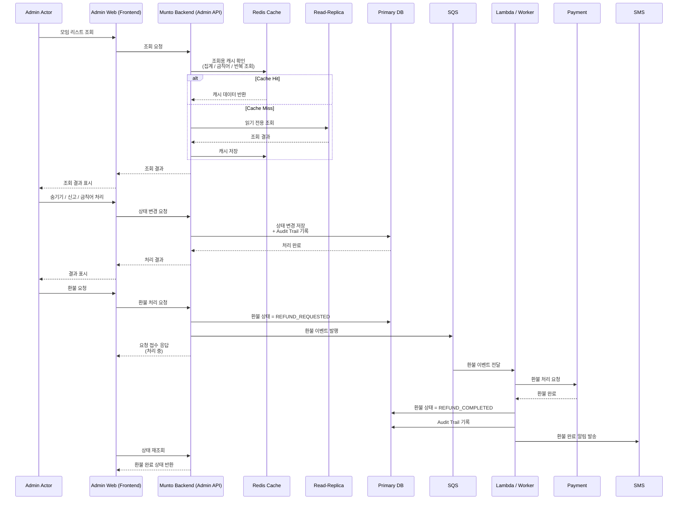
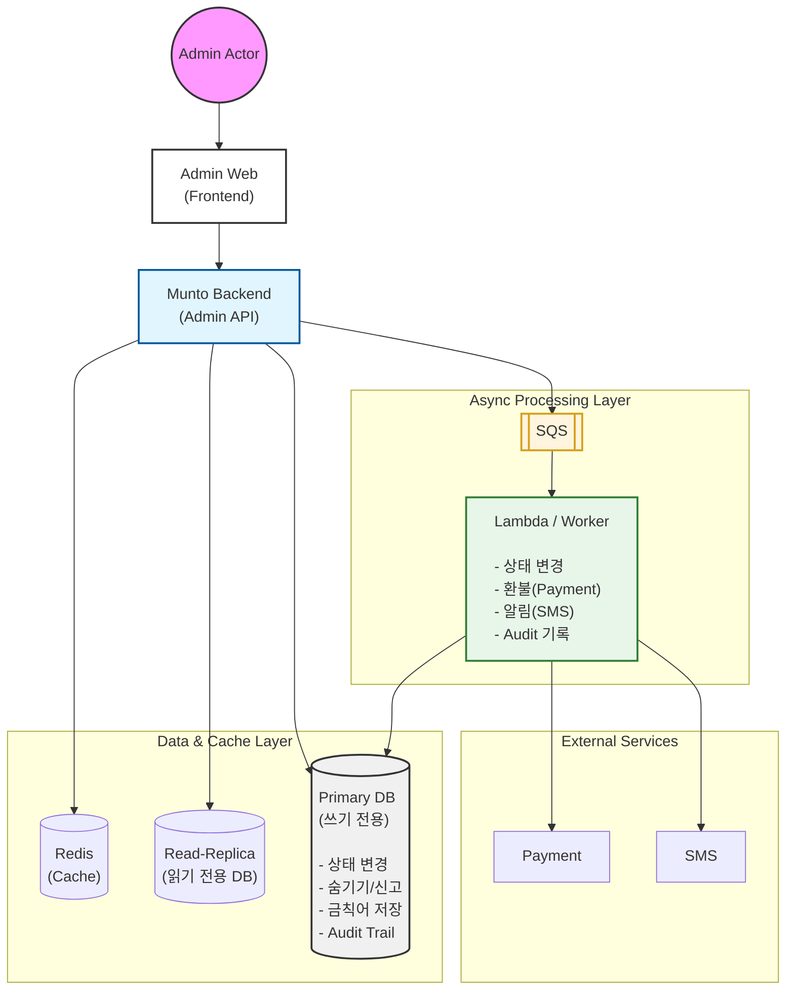

# 백오피스 소셜링/클럽/챌린지/마감 모니터링 및 관리 기능 어드민 이관 Onepager

분류: SRS
작성자: 김세현
최초 작성일: 2026년 1월 27일 오후 12:14
최근 수정일: 2026년 4월 6일 오후 12:30
문서 상태: Archive
생성 일시: 2026년 1월 27일 오후 12:14
최종 편집자: 김세현

# Project Name

**[백오피스] 소셜링/클럽/챌린지 통합 모니터링 시스템 구축**

---

## Date

2026-01-27

---

## Submitter Info

김세현

---

## Project Description

본 프로젝트는 **소셜링, 클럽, 챌린지 모니터링 기능을 통합**하고,

금칙어 감지 및 제재 이력을 백오피스에서 즉시 확인할 수 있도록 개선하는 작업입니다.

주요 목표는:

- 통합 모니터링 화면 제공
- 금칙어 자동 감지 및 필터링
- 콘텐츠 및 이미지 미리보기
- 키보드 단축키 지원
- 모니터링 집계 정보 표시
- 제재 이력 백오피스 통합 저장

---

## Business and Marketing Justification

기존 모니터링 프로세스는:

- 스프레드시트와 백오피스가 분리되어 있어 업무 비효율 발생
- 제재 이력과 금칙어 감지 기능 부족
- 수작업 기반으로 운영 및 고객 대응에 시간 소요

개선 후에는:

- 단일 화면에서 모든 모니터링 처리 가능
- 금칙어 자동 감지 및 필터링으로 운영 효율 향상
- 제재 이력 백오피스 통합 저장으로 즉시 확인 가능
- 고객 대응 및 모니터링 시간 단축

---

## Risk Assessment

- 신규 API 도입 필요
- 기존 데이터와 혼용하지 않고 백오피스 전용 기능으로 분리
- 금칙어 감지 및 필터링 로직 안정성 확보 필요
- 이미지 미리보기 모달 처리 시 성능 고려

→ 운영 시스템에 영향이 가지 않도록 개발해야 함. 백오피스 기능으로 외부 노출 리스크 없음

---

## Resource and Scheduling Details

| 기능 | 구분 | 주요 작업 | 예상 소요 시간  | 비고 |
| --- | --- | --- | --- | --- |
| 통합 모니터링 리스트 조회 | 백엔드 | 통합 조회 API, 페이징, 필터, Read-Replica/인덱스 최적화 | 7 | 대량 데이터 최적화 포함 |
| 모니터링 상세 조회 | 백엔드 | 상세 조회 API, Audit Trail 기록 | 3.5 | 금칙어 하이라이트 포함 |
| 금칙어 감지/필터링 | 백엔드 | 소개글/신청질문 감지, 하이라이트, 필터 옵션, 배치 처리 | 7 | 배치/실시간 처리 포함 |
| 항목 숨기기/신고 처리 | 백엔드 | 숨기기/신고 API, Audit Trail 기록, 기존 신고 플로우 연계 | 3.5 | 멱등성 처리 포함 |
| 모니터링 집계 정보 | 백엔드 | 모집 상태별/금칙어 포함 건수 집계, Read-Replica 조회 | 3.5 | 대시보드용 데이터 제공 |
| 마감/폐강 연쇄 처리 | 백엔드 | 상태 변경, 환불, 알림(SQS), Audit Trail, 멱등성, 오류 처리 | 10.5 | 비동기 처리 포함 |
| 통합 모니터링 UI | 프론트엔드 | 리스트/탭/필터, 페이지네이션, 대시보드 집계 | 4 | Figma 기준 디자인 |
| 콘텐츠 미리보기 | 프론트엔드 | 텍스트 미리보기 패널, 탭 구성, HTML 제거, 금칙어 문장 요약 | 3.5 | 리스트 행 클릭 시 표시 |
| 이미지 미리보기 | 프론트엔드 | 이미지 Y/N 표시, 모달, 다중 이미지 URL 처리 | 3.5 | 모달 UX 구현 |
| 키보드 단축키 | 프론트엔드 | Enter/Shift+Enter/←→ 탭 전환 이벤트 처리 | 1.75 | UI 상호작용 |
| 테스트/검증 | 테스트 | 금칙어 감지, 이벤트 처리, UI/UX, 성능 검증 | 10 | QA/운영 검증 포함 |

합계 61.25시간 소요 예정

---

## Technical Description

### 1. AS-IS

- 소셜링/클럽/챌린지 모니터링 분리
- 스프레드시트 다운로드 후 수작업 필터링
- 제재 이력 확인 불가
- 금칙어 감지 및 콘텐츠 미리보기 기능 없음
- 마감/폐강 시 환불·알림 수작업 의존 → 타임아웃 가능

---

### 2. TO-BE

- 통합 모니터링 화면 제공
- 금칙어 자동 감지 및 하이라이팅 + 필터링 (소개글/신청질문)
- 콘텐츠/이미지 미리보기
- 키보드 단축키 지원
- 모니터링 집계 정보 표시
- 숨기기/신고 원클릭 처리
- 제재/상태 변경 이력(Audit Trail) 기록
- 마감/폐강 → 환불/알림 비동기 처리 (SQS)
- DB 부하 방지: 인덱스 최적화, Read-Replica 조회

### 3. 주요 개선 사항 요약

1. 통합 모니터링 페이지
2. 금칙어 자동 감지 및 필터링
3. 콘텐츠 미리보기
4. 이미지 미리보기
5. 키보드 단축키
6. 모니터링 집계 정보 표시
7. 숨기기/신고 원클릭 처리

### 4. 상세 개선 사항

### 4.1 금칙어 모니터링 페이지

- 검색어 (휴대폰/모임명/주최자), 시작일-종료일, 구분/상태 체크박스
- 집계는 기획 변경으로 포함하지 않음.
- 10개/50개/100개 리스트 페이지네이션
- 대시보드 구현
    
    
    

### 4.2 금칙어 모니터링 상세 페이지


### 4.2 금칙어 감지 및 필터링

- 감지 범위: 소개글 + 신청질문
- 금칙어 목록: `연락처|폰번호|챗방|토스|입금|환급|전번|전화번호|dm|카카오|카톡|1:1|1대1|http|오픈|페플|소모임|페어플레이|동시|동아리|폼`
- UI 하이라이트: 빨간색 + 굵게
- 필터 옵션: 금칙어 있는 건만 보기 (기본 true)

### 4.3 콘텐츠 미리보기

- 행 클릭 시 텍스트 미리보기 패널 표시
- 신청 질문 / 소개글 탭 구성
- HTML 제거 후 텍스트만 표시
- 금칙어 포함 문장 상단 요약

### 4.4 이미지 미리보기

- 리스트 이미지 Y/N 표시
- Y 클릭 시 이미지 모달 제공
- 이미지 URL 배열 제공

### 4.5 키보드 단축키

- Enter: 다음 금칙어
- Shift+Enter: 이전 금칙어
- ←/→: 탭 전환

### 4.6 모니터링 집계 정보

- 모집중 / 진행확정 개수
- 금칙어 포함 건수
- 타입별 집계
- 대시보드 상단 고정 노출

### 4.7 숨기기 / 신고 처리

- 숨기기: 리스트에서 즉시 처리
- 신고: 기존 신고 플로우 활용

### 4.8 마감/폐강 연쇄 처리

### 처리 대상 이벤트

| 이벤트 | 설명 |
| --- | --- |
| 모집 마감 | 모집 마감 시 상태 변경, 참여자 알림 |
| 진행 확정 → 폐강 | 폐강 처리, 참여자 환불, 알림 발송 |
| 제재/숨김 연계 | 금칙어 위반이나 관리자 제재 시 참여 제한 적용 |

### 처리 방식

1. **이벤트 발생**
    - 관리자 UI, 배치, 스케줄러에서 마감/폐강 명령 발생
    - 백오피스 시스템에서 **SQS 메시지 발행**
        
        ```
        {
        "eventType":"MEETING_CLOSE",
        "entityType":"SOCIALING",
        "entityId":"123",
        "triggeredBy":"Admin:456",
        "timestamp":"2026-02-05T12:00:00Z"
        }
        
        ```
        
2. **비동기 처리 (Worker / Lambda)**
    - SQS 큐에 메시지 수신 후 비동기 처리
    - 처리 항목:
        - 상태 변경 (`CONFIRMED` → `CLOSED` 또는 `CANCELLED`)
        - 참여자 환불 처리 (결제 기록 연동)
        - 알리고 SMS / 앱 알림 발송
        - Audit 로그 기록
        - 연쇄 이벤트: 예를 들어 금칙어 숨김/신고 상태와 연동
3. **멱등성 보장**
    - 동일 메시지 재처리 시 중복 환불/알림 방지
    - DB 또는 Redis에서 **처리 완료 여부 flag** 확인 후 처리
        
        ```
        if notalreadyProcessed(messageId):
        processEvent()
        markProcessed(messageId)
        
        ```
        
4. **오류 처리**
    - 처리 실패 시 DLQ (Dead Letter Queue) 적재
    - 운영자 알림 및 재처리 가능
    - 예외 발생 시 최소 단위 트랜잭션으로 롤백
    

### 4.9 감사 로그

- 모든 **상태 변경**(모집 상태, 금칙어 숨기기/신고, 마감/폐강 등) 기록
- 운영자/개발자가 **운영 이력 검증** 가능
- **문제 발생 시 원인 추적** 가능
- 외부 감사, 정책 준수 기록 확보

### 기록 대상 이벤트

| 이벤트 종류 | 설명 |
| --- | --- |
| 상태 변경 | 모집중 → 진행확정, 진행확정 → 마감/폐강, 숨기기 처리 |
| 제재 처리 | 금칙어 위반 신고, 관리자 제재/숨김 |
| 마감/폐강 연쇄 처리 | 환불, 알림(SQS) 발행, 상태 변경 |
| 배치 처리 | 금칙어 감지 배치 실행 |



### Component Diagram



## 🔹 Performance Consideration (운영 DB 부하 방지)

- **대량 데이터 조회 최적화**
    - 모니터링 리스트 조회 시 **인덱스 최적화** 필수
        - 검색 기준 컬럼: 모임명, 주최자, 휴대폰 번호, 금칙어 포함 여부
        - 상태/구분/날짜 필터 컬럼별 복합 인덱스 적용
    - 페이징 처리 (10/50/100) 및 불필요한 컬럼 조회 제한
- **Read-Replica 활용**
    - 운영 DB에 직접 부하를 주지 않도록 조회 전용 Read-Replica 사용
    - 집계/금칙어 필터링/리스트 조회는 **Read-Replica**로 처리
    - 쓰기 작업(상태 변경, 제재/숨기기, Audit Trail 등)만 메인 DB 사용
- **캐싱 고려**
    - 빈번한 동일 쿼리(금칙어 목록)는 Redis 등 캐시 활용
    - 조회 성능 향상 및 운영 DB 부하 최소화
- **비동기 처리**
    - 마감/폐강 연쇄 로직, 환불, 알림 발송 등은 **SQS 기반 비동기 처리**
    - 조회 처리와 분리하여 타임아웃 방지
- **모니터링 및 알림**
    - 조회 쿼리 실행 시간, Read-Replica lag 모니터링
    - 지연 발생 시 운영자 알림 및 임시 캐싱 사용 고려

### 6. API 설계

- 모두 신규 API 필요
    
    [문토 백오피스 모니터링 통합 기능 전용 API ](https://www.notion.so/API-2f6e2bc7639d802b9705ce1d30d9212b?pvs=21)
    

### 7. UI

[https://www.figma.com/design/ueFxMzWeXyBsPm2iVQspH8/%EC%96%B4%EB%93%9C%EB%AF%BC?node-id=3145-23751&p=f&m=dev](https://www.figma.com/design/ueFxMzWeXyBsPm2iVQspH8/%EC%96%B4%EB%93%9C%EB%AF%BC?node-id=3145-23751&p=f&m=dev)

---

## 6. 변경 이력

| 버전 | 일자 | 변경자 | 변경 내용 |
| --- | --- | --- | --- |
| v1.0.0 | 2026-01-27 | 김세현 | 최초 작성 |
| v1.0.1 | 2026-02-02 | 김세현 | 피드백 및 템플릿 적용 |
| v1.1.0 | 2026-02-05 | 김세현 |   • 인덱스 최적화 및 Read-Replica 활용 
  • SQS 기반 비동기 처리 설계
  • Audit Trail 기록 구조 적용
  • 레거시 마감 로직 정합성 점검
  • Sequence Diagram 보완 |