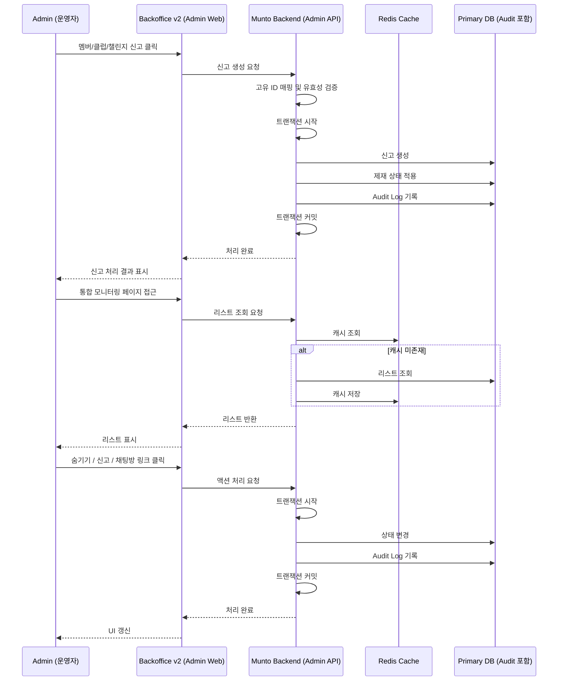
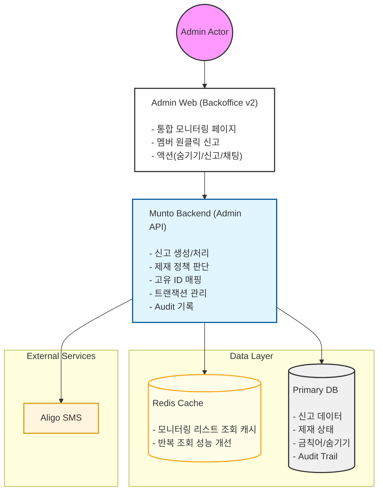

# 백오피스 신고 관리 통합 처리 기능 Onepager

분류: SRS
작성자: 김세현
최초 작성일: 2026년 1월 27일 오후 2:09
최근 수정일: 2026년 4월 6일 오후 12:30
문서 상태: Archive
생성 일시: 2026년 1월 27일 오후 2:09
최종 편집자: 김세현

# Project Name

**[백오피스] v2 클럽·챌린지·멤버 신고 통합 처리 시스템 구축**

---

# Date

2026-01-28

---

# Submitter Info

김세현

---

# Project Description

본 프로젝트는 **클럽, 챌린지, 멤버 신고를 백오피스 내에서 통합 처리**할 수 있도록 개선하는 작업입니다.

현재 소셜링 신고는 기존 백오피스 v1에서 처리 가능하지만, 다른 항목은 앱에서 검색 후 처리해야 하는 비효율 구조를 개선합니다.

주요 목표는:

- 클럽·챌린지·멤버 신고 백오피스 v2 내 직접 처리
- 멤버 상세 페이지에서 원클릭 신고
- 신고 처리 속도 단축 및 식별 오류 방지

---

# Business and Marketing Justification

- 현재 신고 처리 업무는 소셜링 관련 신고만 백오피스 v1 내에서 처리 가능하며, 클럽, 챌린지, 멤버 신고는 관리자가 앱에서 검색한 뒤 처리할 수 있음.
- 멤버 신고 시 동명이인 및 프로필 대조로 인한 식별 오류 발생 가능
- 이로 인해 신고 처리 소요시간 증가

본 프로젝트를 통해:

- 신고 처리 시간을 단축 (평균 15초 → 5초 이하)
- 백오피스 v2 내 처리 가능률 100% 달성
- 신고 누락률 최소화 (월 3건 이상 → 0건 목표)
- 운영 효율성 및 사용자 신뢰도 향상

---

# Risk Assessment

- 신규 API 도입 필요 (백오피스 통합 리스트, 필터, 액션)
- **감사 로그(Audit Trail)**
    - 신고 생성/처리/제재/종결 등 운영 이력 추적 필수
    - **신고 생성 단계**
        - 신고 생성과 동시에 Audit Log 기록 → 변경 전/후 상태를 JSON 형태로 저장
    - **제재 + 알리고 SMS 원자적 처리**
        - 트랜잭션 시작 → 제재 적용 → SMS 발송 → Audit Log 기록
        - SMS 실패 시 **롤백** 및 실패 로그 기록 → 재시도 가능
    - **통합 모니터링 페이지 액션**
        - 숨기기, 신고, 채팅 링크 클릭 시 **모든 액션 로그 기록**
        - 리스트 조회/필터 적용도 Audit Trail로 추적 가능
- **트랜잭션 원자성 확보 필요**
    - 제재 액션과 알리고 SMS 발송 로직 연계
    - 실패 시 롤백 및 예외 처리 로직 필요
- 멤버 원클릭 신고 시 식별 오류 방지 로직 필수
    - 정확한 **고유 ID 매핑 로직 확정 필요**
    - 동명이인 식별 오류 완전 제거
- 이용정지 예정자/이용정지자 필터링 처리 미흡 시 신고 리스트 정확도 저하 가능
- 백오피스 UI/UX와 앱 간 연계 문제 주의

→ 운영 시스템 및 사용자 서비스 영향 최소화

- **excludeSuspended 필터 적용**
    - 기 제재 유저 신규 신고 방치 방지 → 일괄 종결 로직 검토

---

# Resource and Scheduling Details

**투입 리소스**

- **백엔드 개발**
    - 신고 처리 API 신규 개발
    - 제재 액션 + 알리고 SMS 트랜잭션 연계 및 예외 처리
    - 고유 ID 기반 멤버 식별 로직
    - 신고 리스트 조회/검색/필터 로직
    - 이용정지 예정자/이용정지자 일괄 종결 처리
    - 감사 로그(Audit Trail) 구조 구현
- **프론트엔드 개발**
    - 통합 모니터링 페이지
    - 멤버 상세 페이지 원클릭 신고
    - 리스트/상세 페이지 액션: 숨기기, 신고, 채팅방 링크
    - 신고 처리 결과 표시 및 상태 라벨링
- **기획/검증**
    - 테스트 시나리오 정의
    - 고유 ID 매핑 정확도 검증
    - 트랜잭션 실패 시 롤백/예외 처리 테스트
    - KPI 모니터링: 처리 속도, 누락률, 오류율

**예상 일정**: 37~40시간 

**인프라**: 기존 백오피스 환경 내 구현 가능

---

# Technical Description

### 1. AS-IS

- 소셜링 신고: 백오피스 내 처리 가능
- 클럽/챌린지/멤버 신고: 앱에서 개별 검색 후 확인 → 백오피스 이동 → 처리
- 멤버 식별 오류 가능성 존재 (동명이인/프로필 확인)
- 신고 처리 소요 시간 증가

### 2. TO-BE

- 백오피스 내 통합 모니터링 페이지 제공 (소셜링 | 클럽 | 챌린지 탭)
- 멤버 상세 페이지에서 원클릭 신고 가능
- 통합 리스트 조회, 검색/필터, 액션(숨기기, 신고, 채팅방 링크)
- 신고 처리 속도 단축 및 식별 오류 최소화

### 3. 주요 개선 사항 요약

1. 소셜링 모니터링 페이지에 클럽/챌린지 탭 추가
2. 클럽/챌린지 컬럼 구성 및 필수 데이터 반영
3. 클럽/챌린지 검색 및 필터 기능 구현
4. 액션 기능 (숨기기, 신고, 채팅방 링크 이동)
5. 멤버 상세 프로필 원클릭 신고 버튼 추가

### 4. 상세 개선 사항

### 4.1 통합 모니터링 페이지

- 경로: 운영관리 > 모니터링 > 소셜링 | 클럽 | 챌린지
- 타입별 필터링 (`type` 파라미터)
- 필수 컬럼: 상태, 가격/구분, 소개글, 승인제질문, 이미지 여부 등

### 4.2 컬럼 구성

- 클럽: 상태 | 가격 | 구분 | 소개글 | 승인제질문 | 클럽명 | 장소 | 클럽 인원 | 클럽장 | 전화번호 | 클럽 생성일 | 이미지 | 숨기기 | 신고 | 채팅방 링크
- 챌린지: 상태 | 가격 | 이름 | 소개글 | 승인제질문 | 모집구분 | 기간 | 주최자 | 연락처 | 정원 | 참여인원 | 생성일 | 이미지 | 숨기기 | 신고 | 채팅방 링크

### 4.3 검색 및 필터

- 키워드 검색: 모임명/주최자/연락처
- 기간 필터: 모임일/생성일
- 상태 필터: 모집 상태 (RECRUITING/CONFIRMED)
- 모집구분 필터: 모집 방식

### 4.4 액션 처리

- 숨기기: 즉시 처리, 리스트에서 제외 또는 상태 변경
- 신고: 신고 팝업 표시 후 생성, 리스트 즉시 반영
- 채팅방 링크: 클릭 시 새 창/탭으로 이동
- **트랜잭션**: 신고 생성 → 제재 액션 → 알리고 SMS **원자적 처리**, 실패 시 롤백

### 4.5 멤버 상세 페이지 원클릭 신고

- 클릭 시 신고 팝업 표시
- **고유 ID 매핑 로직 적용** → 동명이인 식별 오류 제거
- 신고 리스트 즉시 반영
- 이용정지 예정자/이용정지자 제외 필터 적용
- **일괄 종결 로직** → 기존 제재 유저 신고 방치 방지
- 신고 리스트 조회 API: `excludeSuspended=true`

### 5. API 설계

- 모든 기능 신규 API 개발 필요
    
    [신고 관리 통합 API ](https://www.notion.so/API-2f6e2bc7639d8054a05af63301b64fdd?pvs=21)
    

### 6. UI

[https://www.figma.com/design/ueFxMzWeXyBsPm2iVQspH8/%EC%96%B4%EB%93%9C%EB%AF%BC?node-id=3145-23751&p=f&m=dev](https://www.figma.com/design/ueFxMzWeXyBsPm2iVQspH8/%EC%96%B4%EB%93%9C%EB%AF%BC?node-id=3145-23751&p=f&m=dev)

### 7. Sequence Diagram (통합 프로세스)

- 모니터링 페이지: 조회 → 필터 → 액션(숨기기/신고/채팅 링크) → 트랜잭션 → Audit Log 기록

### Component Diagram

---

# 변경 이력

| 버전 | 일자 | 변경자 | 변경 내용 |
| --- | --- | --- | --- |
| v1.0.0 | 2026-01-28 | 김세현 | 최초 작성 |
| v1.1.0 | 2026-02-05 | 김세현 |  |

---

# 문서 관리 규칙

1. 프로젝트 담당자(PM) 사전 협의 필수
2. 변경 시 Slack 공유
3. 변경 이력 테이블 필수 기록
4. Notion 내 변경 포인트 명시
5. 정책 판단 기준은 CX 가이드 우선