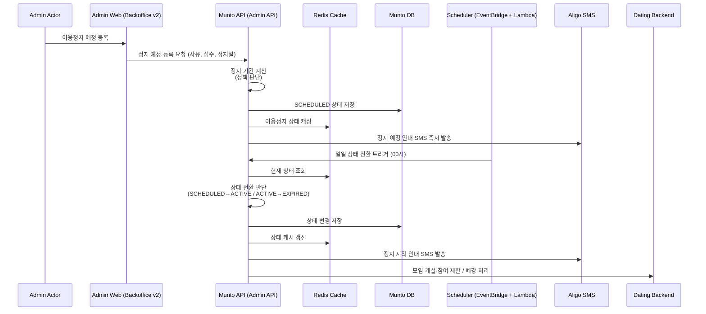
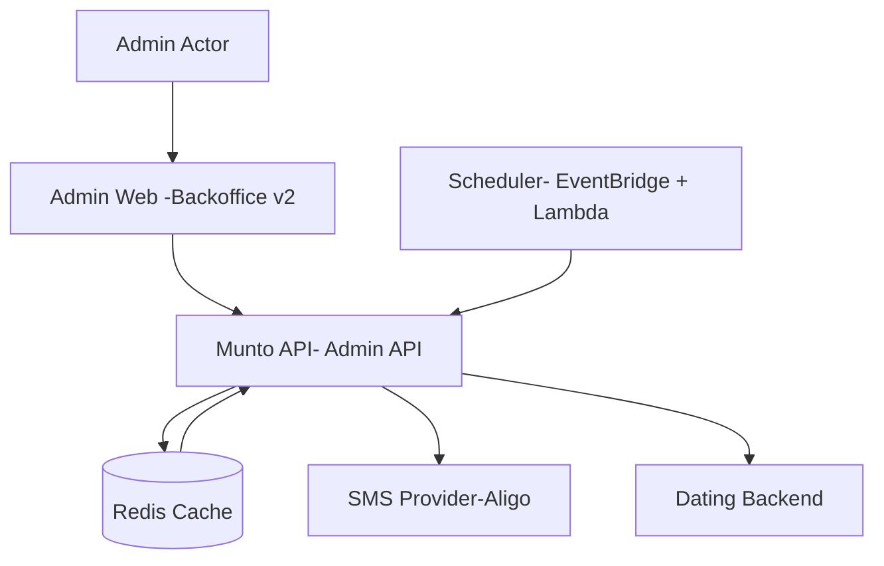

# 백오피스 이용정지 예정자 사전 제한 기능 Onepagerㅂ

분류: SRS
작성자: 김세현
최초 작성일: 2026년 1월 27일 오전 11:09
최근 수정일: 2026년 4월 15일 오후 12:09
문서 상태: Archive
생성 일시: 2026년 1월 27일 오전 11:09
최종 편집자: 김세현

## Date

2026-02-05

## Submitter Info

김세현

---

## Project Description

본 프로젝트는 문토 서비스 **이용정지 예정 단계를 사전에 관리**하기 위한

**백오피스 전용 이용정지 관리 시스템 개선 작업**입니다.

관리자는 이용정지 예정자를 등록하며,

시스템은 정지 시작·해제 및 사용자 안내를 **자동으로 처리**합니다.

---

## Business and Marketing Justification

현재 이용정지 프로세스는 **정지 시작 이후에만 활동 제한이 적용**되어,

정지 예정 기간에도 모임 개설·신청이 가능한 문제가 존재합니다.

또한,

- 정지 종료일을 수동으로 계산해야 하여 운영 오류 가능성이 높고
- 사용자에게 정지 일정이 명확히 전달되지 않아 혼선이 발생하고 있습니다.

본 프로젝트를 통해:

- 정지 일정 및 영향을 사전에 명확히 관리
- 사용자에게 정지 정보를 미리 고지하여 불필요한 CS 감소
- 이용정지 관리 프로세스 자동화로 운영 효율 향상

---

## Risk Assessment

- 정지 정책은 **기존 커뮤니티 가이드 기준** 그대로 사용
- 신규 정책 도입 없이 자동화 및 상태 관리만 개선

→ 서비스 안정성 저하나 오남용 리스크 없음

---

## Resource and Scheduling Details

### 투입 리소스

**백엔드**

- 정지 종료일 자동 계산 로직
- 이용정지 상태 관리 (`SCHEDULED / ACTIVE / EXPIRED`)
- 상태 전환 스케줄러 (EventBridge + Lambda 권장, CDK 기반)
- 알리고 문자 연동 (즉시 발송 / 예약 발송)

**프론트엔드**

- 이용정지 관리 화면 상태 표시

**검증**

- 정책 기준 검증
- 테스트 시나리오 정리 (정상 / 예외 케이스 포함)

### 예상 일정

- 개발 및 테스트: 1~2일
- 별도 인프라 증설 없음

---

## Technical Description

### 1. 배경 (AS-IS)

- 정지 종료일 수동 계산
- 정지 예정 상태 개념 없음
- 정지 시작 이후에만 활동 제한 적용
- 정지 예정자에 대한 사전 안내 없음

### 2. 개선 방향 (TO-BE)

- 정지 예정 상태(`SCHEDULED`) 도입
- 정지 예정 → 정지 중 → 정지 해제 **자동 상태 전환**
- 정지 종료일 **자동 계산**
- 정지 예정 기간 중 모임 활동 사전 제한
- 알리고 문자 자동 발송 (2회)
- 스케줄러, 보안, Backfill, 예외 처리 로직 보완

### 3. 상태 정의

| 상태 | 설명 |
| --- | --- |
| `SCHEDULED` | 정지 예정 |
| `ACTIVE` | 정지 중 |
| `EXPIRED` | 정지 해제 |

---

### 4. 주요 동작 상세

### 4.1 정지 예정 등록 시 정지 종료일 자동 계산

**처리 흐름**

- 신고 처리 화면에서 점수·사유·정지 예정일 입력
- 처리 버튼 클릭 시 정지 예정 등록
- 이 시점에 **정지 종료일 자동 계산**

**정지 기간 계산 로직 (60일 누적 경고 점수 기준)**

| 누적 경고 점수 | 정지 기간 |
| --- | --- |
| 5점 이상 | 7일 |
| 7점 이상 | 14일 |
| 10점 이상 | 30일 |
| 20점 이상 | 영구 정지 |
| 커뮤니티 가이드 중대 위반 | 최대 영구 정지 |

**계산 우선순위**

1. 커뮤니티 가이드 중대 위반 여부
2. 누적 경고 점수 기준
3. 동일 구간 내 가장 긴 기간 적용

**정지 종료일 계산**

```
일반정지:suspendedUntil=suspendedAt+정지기간
영구정지:suspendedUntil=9999-12-31

```

---

### 4.2 상태 자동 전환 (스케줄러)

- **실행 시각**: 매일 00시
- **SCHEDULED → ACTIVE**
    - 조건: `suspendedAt <= 오늘`
    - 처리: 기존 정지 시작 로직 실행 (폐강·환불)
- **ACTIVE → EXPIRED**
    - 조건: `suspendedUntil < 오늘` & `suspendedUntil != '9999-12-31'`
- **영구 정지**
    - 자동 해제 없음
    - 관리자 수동 해제 시 ACTIVE → EXPIRED, 해제 사유 필수 입력

**Backfill 로직 (멱등성 보장)**

```
for user in users where status='SCHEDULED' and suspendedAt <= today:
    if not already ACTIVE:
        set status = ACTIVE
        trigger 폐강/환불 처리

```

- 실패 시 EventBridge 재시도 또는 DLQ 처리

---

### 4.3 알리고 문자 자동 발송 (2회)

- 발송 시점
    1. 정지 예정 등록 시점 → 즉시 발송
    2. 정지 시작 시점(00시) → 예약 발송
- 관리자 취소 시 예약 문자 자동 취소 (Aligo API 연동)
- 사용자에게 정지 일정 명확히 고지

---

### 4.4 활동 제한 적용 (예고형 제한)

**제한 대상**

- 상태: `SCHEDULED`, `ACTIVE`
- 정지 기간과 겹치는 모임 일정

**제한 내용**

- 모임 개설 / 신청 / 참여 불가
- 팝업 안내 노출
- 앱 띠배너 안내
- 백엔드 API 레벨에서 호출 차단

---

### 5. 스케줄러 아키텍처

| 항목 | 기존 방식 (Cron) | 권장 방식 (EventBridge + Lambda) | 비고 |
| --- | --- | --- | --- |
| 실행 방식 | 서버 내 Cron | 이벤트 기반 서버리스 | 서버 인프라 관리 부담 최소화 |
| 확장성 | 단일 서버 의존, 트래픽 증가 시 부담 | Lambda 확장 가능, 이벤트 트리거 활용 용이 | 멀티 리전 적용 가능 |
| 실패 처리 | 수동 Backfill 필요 | Lambda 재시도 + DLQ 활용 | 실행 보장 강화 |
| 관리 | 별도 인프라 관리 | CDK 기반 인프라 코드화 필수 | 버전 관리 가능 |

**권장**: EventBridge + Lambda, CDK 기반 구축

---

### 6. 보안성 vs 성능

| 항목 | Client-only 처리 | 서버사이드 체크 (Redis) | 권장 전략 |
| --- | --- | --- | --- |
| 보안성 | 낮음, API 직접 호출 가능 | Redis에서 상태값 확인 → 안전 | 서버사이드 체크 병행 |
| 성능 | DB 부담 없음 | Redis 캐시 조회 → 부담 최소화 | 제한 유저 비중 낮음 → 부담 미미 |
| 안정성 | 낮음 | 상태 변동 즉시 반영, 멱등성 보장 | 서비스 신뢰도 우선 |
| 구현 난이도 | 낮음 | 중간 | 단기 개발 가능 |

### 설계 과정

1. **전제 확인:**
    - 백오피스 전용 기능 → 일반 유저 접근 불가 → 악용 가능성 낮음
2. **Client-only 체크만 쓰면?**
    - 장점: 구현 간단
    - 단점: 기술 지식 있는 유저가 API 직접 호출 시 우회 가능 → 보안 홀 발생
3. **JWT만 쓰면?**
    - 장점: 서버 조회 최소화
    - 단점: 상태 변동 반영 늦음, 변조 가능성 있음 → 백오피스 환경에는 과도한 설계
4. **Redis만 쓰면?**
    - 장점: 서버에서 안전하게 상태 확인, 멱등성 보장, DB 부담 최소화
    - 단점: 구현 약간 복잡 → 백오피스 환경에서 충분히 감당 가능
5. **결론:**
    - **Redis만 사용**
    - Client-only 처리보다 안전, JWT는 선택 사항 → 필요 시 확장 가능

---

### 7. 비즈니스 예외 처리

| 상황 | 처리 로직 |
| --- | --- |
| 중복 정지 / 점수 합산 | 최종 종료일로 갱신, 점수 누적에 따른 기간 계산 |
| SMS 예약 / 등록 취소 | 관리자 취소 시 예약 문자 자동 취소 (Aligo API 연동) |
| 영구 정지 | 자동 해제 없음, 수동 해제 시 ACTIVE → EXPIRED, 사유 필수 입력 |

---

### Sequence Diagram



---

### Component Diagram



---

## 기대 효과

- 정지 기간 계산 오류 방지
- 정지 예정 기간 중 부적절한 활동 사전 차단
- 사용자 정지 일정 명확 안내
- 이용정지 관리 자동화로 운영 효율성 향상

---

### API 및 UI 설계

- [이용정지 예정자 사전 제한 API](https://www.notion.so/API-2f5e2bc7639d8089af98f250e696acee?pvs=21)
- [Figma 설계](https://www.figma.com/design/ueFxMzWeXyBsPm2iVQspH8/%EC%96%B4%EB%93%9C%EB%AF%BC?node-id=3145-23751&p=f&m=dev)

---

## 문서 관리 규칙

1. PM 사전 협의 필수
2. 변경 시 Slack 공유
3. 변경 이력 테이블 필수
4. Notion 변경 포인트 명시
5. 정책 판단 기준은 CX 가이드 우선

---

## 변경 이력

| 버전 | 일자 | 변경자 | 변경 내용 |
| --- | --- | --- | --- |
| v1.0.0 | 2026-01-27 | 김세현 | 최초 작성 |
| v1.0.1 | 2026-02-02 | 김세현 | 피드백 반영 |
| v1.1.0 | 2026-02-05 | 김세현 | 스케줄러/보안/Backfill/예외 처리 기술 보완 |

[이용정지 예정자 사전 제한 API ](https://www.notion.so/API-2f5e2bc7639d8089af98f250e696acee?pvs=21)