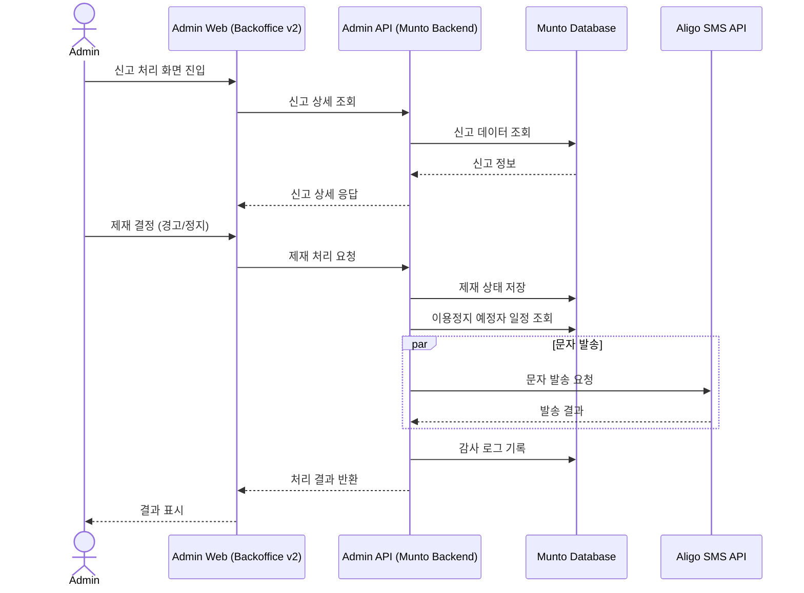
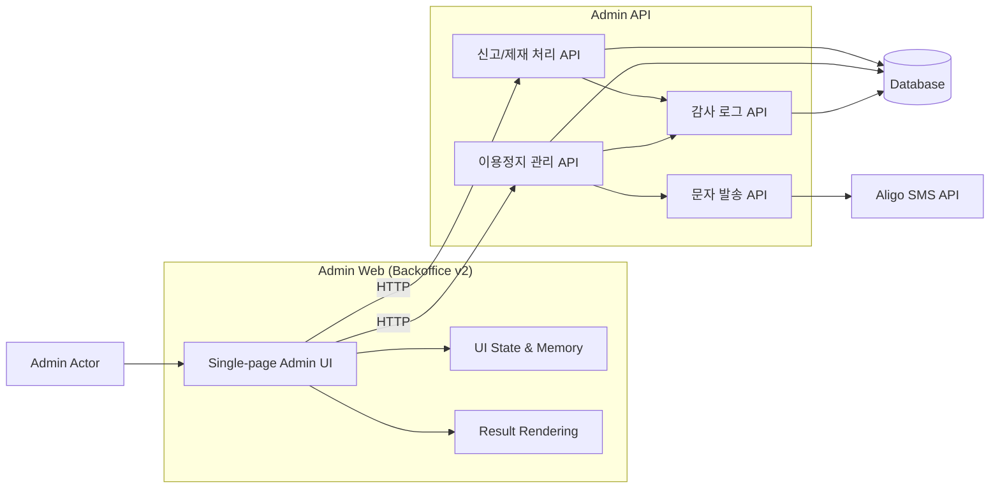

# 백오피스 제재 관리 통합 시스템 개선 Onepager

분류: SRS
작성자: 김세현
최초 작성일: 2026년 1월 26일 오전 11:05
최근 수정일: 2026년 4월 6일 오후 12:30
문서 상태: Archive
생성 일시: 2026년 1월 26일 오전 11:05
최종 편집자: 김세현

# Project Name

**[백오피스] v2 신고 관리 단일 화면 통합 및 이용정지 예정자 처리 개선**

---

## Date

2026-01-26 (최초 작성)

2026-01-27 (기획 변경 반영)

---

## Submitter Info

김세현

---

## Project Description

본 프로젝트는 **CX팀 신고 처리 업무의 효율성 및 정확성 향상**을 위해

백오피스의 신고, 경고, 정지, 문자 발송 기능을 v2에서 **단일 화면·단일 흐름으로 통합**하는 개선 작업입니다.

주요 목표는:

- 판단에 필요한 정보를 한 화면에서 제공
- 반복적 수작업 자동화
- 이용정지 예정자 처리 시 소셜링 일정 자동 표시

관리자는 신고 접수 후 **신고 처리 → 제재 → 결과 확인**까지 한 화면에서 진행할 수 있으며,

시스템은 정지 예정자 처리 및 알리고 문자 발송을 **자동화**합니다.

---

## Business and Marketing Justification

현재 CX팀 신고 처리 업무는:

- 신고·경고·정지·문자 발송 기능이 여러 화면으로 분산
- 다중 탭 이동과 수작업 판단 의존
- 업무 처리 시간 증가 및 휴먼 에러 가능성

개선 후에는:

- 단일 화면·단일 플로우로 업무 처리
- 반복 수작업 자동화로 오류 감소
- 신고 처리 결과 데이터 집계 자동화
- 운영 지표 가시성 확보

---

## Risk Assessment

- 기존 커뮤니티 가이드 기반 점수 산정 유지
- 자동화 및 단일 화면 통합으로도 **서비스 안정성 저하 없음**
- 관리 권한 외 접근 경로 없음 → 외부 노출/오남용 리스크 없음

---

## Resource and Scheduling Details

**투입 리소스**

- **백엔드 개발 : 총 17시간 소요 예상**
    - 신고/제재 처리 Api : 총 6시간 소요 예상
        - 신고 상세 조회
        - 제재 (경고/정지) 처리
        - 처리 결과 DB 저장
        - 감사 로그 호출 연동
    - 이용정지 관리 API : 총 6시간 소요 예상
        - 신규 정지/정지 예정자 등록
        - 일정 조회 및 상태 관리
        - 중복 등록 방지, 활동 제한 적용
        - 감사 로그 호출
    - 문자 발송 API : 총 5시간 소요 예상
        - 알리고 문자 연동 (즉시/예약)
        - 실패 시 재시도/큐 적재
        - DLQ, 로그 관리
    - 알리고 문자 연동 (즉시 발송 / 예약 발송)
- **프론트엔드: 총 9시간 예상**
    - 이용 정지 관리 페이지 : 총 5.5시간
        - 검색 칼럼 구현 : 1.5시간
        - 리스트 칼럼 구현 : 1시간
        - 페이지네이션 구현 : 2시간
        - 페이지당 행 수 선택 기능 구현 : 1시간
    - 이용 정지 상세 페이지 : 총 3.5시간
        - 이용 정지 대상 정보 표시 : 0.5시간
        - 상세 정보 표시 : 1시간
        - 정지 이력 리스트 구현 : 1시간
        - 경고 점수 리스트 구현 : 1시간
- **기획/검증 : 총 3시간 예상**
    - 정책 기준 검증 : 1시간
    - 테스트 시나리오 정의 및 결과 검증 : 2시간

**예상 일정**: 총 29시간 예상 

---

## Technical Description

### 1. AS-IS (현황)

- 신고/경고/정지/문자 발송 화면 분리
- 기능별 개별 화면 이동 필요
- 판단 정보 분산
- 이용정지 예정자 관련 정보 및 소셜링 일정 미노출

### 2. TO-BE (개선 방향)

- 신고 관리 중심 **단일 처리 플로우**
    - 신고 → 판단 → 제재 → 결과 확인
- 반복적 수작업 자동화
- 이용정지 예정자 처리 시 소셜링 일정 자동 표시
- 알리고 문자 발송 자동화 (등록 시점 / 정지 시작 시점)

### 3. 주요 개선 사항 요약

1. 신고 관리 리스트 필터링 (기본값 ‘미처리’ 상태)
2. 신고 관리 리스트 컬럼 간소화
3. 경고 점수 이력 표시 방식 개선
4. 이용정지 예정자 처리 시 소셜링 일정 자동 표시

### 4. 개선 사항 상세

### 4.1 신고 관리 리스트 필터링

- 상태 기본값 ‘미처리’로 설정
- 이용정지 예정자/정지자 비노출 (`excludeSuspended` 파라미터 활용)

### 4.2 신고 관리 리스트 컬럼 간소화

- AS-IS: `신고 접수일 | 신고 ID | 구분 | 피신고자 | 대표 신고 항목 | 신고 수 | 처리자 | 처리 상태 | 처리 결과 | 처리일`
- TO-BE: `신고 접수일 | 신고 ID | 구분 | 피신고자 | 대표 신고 항목 | 신고 수 | 처리 상태 | 처리 결과`

### 4.3 경고 점수 이력 표시 방식 개선

- 리스트 조회 시 최신 경고 점수 1건만 조회
- `GET /api/admin/reports/:id` 응답에 `warningHistory` 배열 포함

### 4.4 이용정지 예정자 처리 시 소셜링 일정 자동 표시

- 신고 처리 후 이용정지 예정자로 설정
- 소셜링 일정 자동 조회 (폐강 제외)
- 알리고 문자 발송 자동화

---

### 5.1 트랜잭션 원자성

- 신고 처리(제재) + 문자 발송을 하나의 트랜잭션으로 처리
- 문자 API 실패 시 재시도 큐 적재 및 운영자 알림
- 트랜잭션 롤백 및 실패 로그 기록

### 5.2 상세 감사 로그 (Audit Trail)

- 자동 계산된 정지 종료일 수동 수정 시:
    - 수정 전/후 데이터, 수정자 ID, 수정 사유, 일시 기록
- 데이터 정합성 검증 및 추적 가능

### 5.3 신고 처리 누락 방지

- `excludeSuspended` 필터 적용 시 신규 신고 건 방치 방지
- 신규 신고 → 일괄 종결 또는 재심사 큐 적재
- 상태 변경 로그 기록

### 5.4 이용정지 예정자 사전 제한 기능과의 정합성 설계

- 백오피스 이용정지 관리 시스템과 사전 제한 기능이 **서로 상태, 일정, 문자 발송 등에서 충돌하지 않도록 설계**

**체크 포인트**

| 항목 | 기능1: 백오피스 전용 관리 | 기능2: 사전 제한 API | 설계 시 유의점 |
| --- | --- | --- | --- |
| 상태 정의 | `SCHEDULED / ACTIVE / EXPIRED` | 동일 상태 적용 | 상태 변경 시 DB 멱등성 보장 |
| 중복 등록 | 백오피스에서 신규 등록 가능 | API에서도 신규 등록 가능 | `userId + suspendedAt` 기준 중복 등록 방지 |
| 모임 활동 제한 | SCHEDULED/ACTIVE 상태의 일정 차단 | API 호출 시 동일 제약 적용 | 두 시스템 조회 결과 일치하도록 통합 |
| 문자 발송 | 2회 자동 발송 (등록/정지 시작) | API 예약 문자 발송 가능 | 동일 유저 중복 문자 발송 방지 |
| 상태 전환 | 스케줄러/Backfill로 자동 전환 | API 호출 시 상태 갱신 | 서로 다른 스케줄러 간 충돌 방지, 멱등성 확보 |
| 예외 처리 | Lambda 재시도, DLQ 처리 | 동일 | 처리 실패 시 재시도/알림 기준 통합 |

**설계 가이드라인**

1. **중복 등록 방지**
    - 신규 등록 전 동일 유저/동일 기간 상태 확인
    - 존재 시 기간 갱신 또는 별도 큐에 적재
2. **활동 제한 일관성**
    - 백오피스와 API 모두 동일 기준으로 일정 조회 및 차단
    - 폐강 제외, 정지 기간 겹침 여부 확인
3. **문자 발송 동기화**
    - 백오피스와 API 발송 예약 상태 동기화
    - 실패 시 재시도/DLQ 통합 처리
4. **상태 전환 멱등성**
    - SCHEDULED → ACTIVE → EXPIRED 전환 시 DB 상태 확인 후 처리
    - 중복 실행 방지
5. **테스트 시나리오**
    - 신규 등록, 중복 등록, 스케줄러 실행, 문자 발송 실패, 수동 해제 포함

### 5.5 통합 플로우 가시화

### 5.6 Component Diagram

### 6. API 설계

[신고 관리 API](https://www.notion.so/2f5e2bc7639d801a90b5cff98aa212d0?pvs=21)

### 7. UI 설계

[https://www.figma.com/design/ueFxMzWeXyBsPm2iVQspH8/%EC%96%B4%EB%93%9C%EB%AF%BC?node-id=3145-23751&p=f&m=dev](https://www.figma.com/design/ueFxMzWeXyBsPm2iVQspH8/%EC%96%B4%EB%93%9C%EB%AF%BC?node-id=3145-23751&p=f&m=dev)

---

## 6. 변경 이력

| 버전 | 일자 | 변경자 | 변경 내용 |
| --- | --- | --- | --- |
| v1.0.0 | 2025-01-26 | 김세현 | 최초 작성 |
| v1.1.0 | 2025-01-27 | 김세현 | 기획 변경 반영 |
| v1.1.1 | 2025-02-02 | 김세현 | 템플릿 적용 |
| v.1.2.0 | 2025-02-06 | 김세현 | 일정 재산정 및 다이어그램 추가  |

---

## 7. 문서 관리 규칙

1. PM 사전 협의 필수
2. 변경 시 Slack 공유
3. 변경 이력 테이블 필수 기록
4. Notion 내 변경 포인트 명시
5. 정책 판단 기준은 CX 가이드 우선