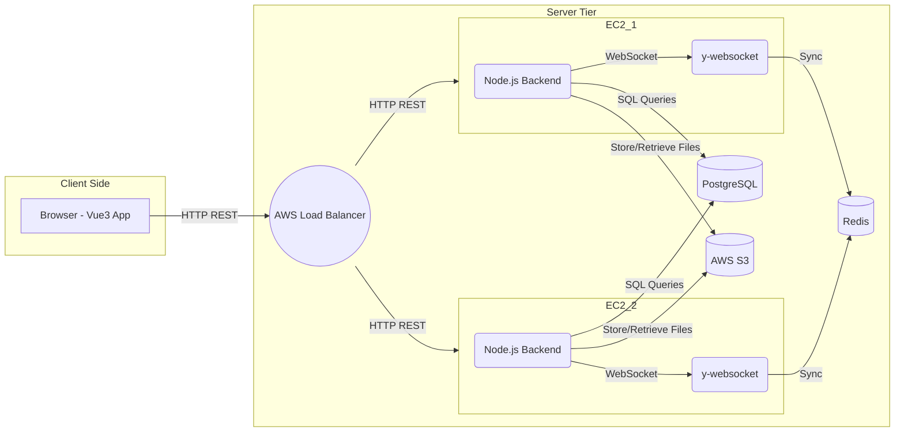
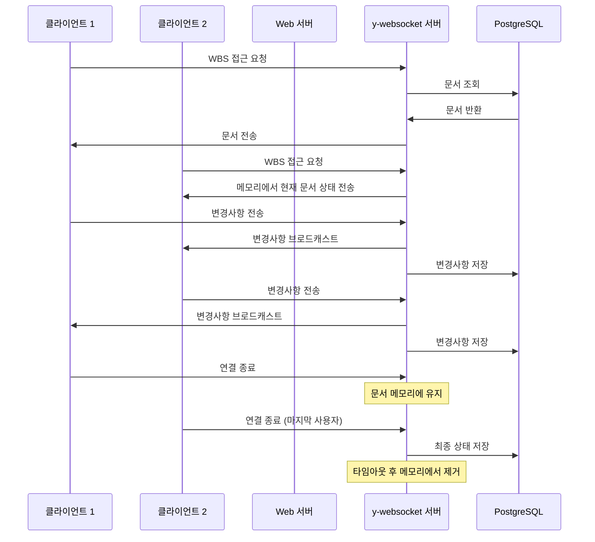
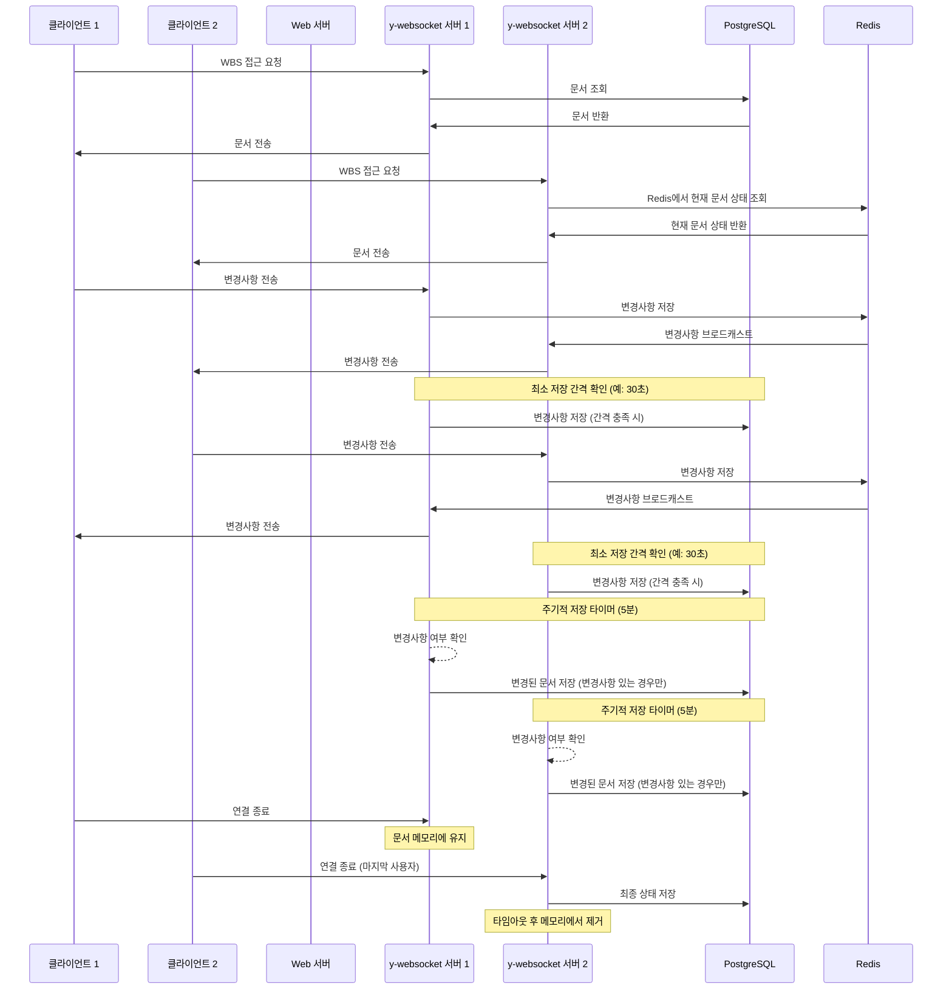
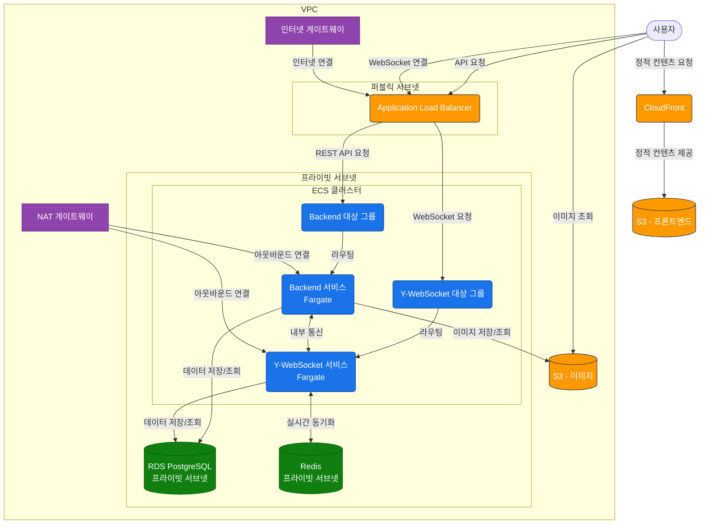

# 목적

- 현재 개발 중인 WBS 관리 시스템이 궁금한 사람을 위한 스펙 공유
- 추후 스펙 교육 및 학습의 참고 자료

---

# **1 Introduction (개요)**

## **1.1 Purpose (목표)**

- 시범 프로젝트의 성격으로 SRS를 학습하는데 도움이 되도록 한다.

## **1.2 Product Scope (범위)**

- WBS(Work Breakdown Structure)를 체계적으로 관리하여 프로젝트 및 인력 운영의 효율화를 도모한다.
- 프로젝트 전체 일정, 업무 총량, 인력 리소스 등을 종합적으로 관리하여 정확한 일정 예측과 효율적인 리소스 배분을 목표로 한다.
- 기존에는 Excel로 관리하는 WBS를 웹서비스화하여 좀더 편리하게 사용할 수 있도록 한다.

## **1.3 Document Conventions (문서규칙)**

- 우선 순위를 기록한다.
  - P1 ~ P3

## **1.4 Terms and Abbreviations (정의 및 약어)**

- SRS (Software Requirements Specification)
- WBS (Work Breakdown Structure)
- FS (Finish to Start)
- SS (Start to Start)
- FF (Finish to Finish)
- MVP (Minimum Viable Product)
- YJS (실시간 동기화 라이브러리)
- RDB (관계형 데이터베이스)
- NoSQL (문서/키-값 형식 DB)
- S3 (AWS Simple Storage Service)
- JWT (JSON Web Token)
- Task(작업) WBS내의 작업 항목 한개

## **1.5 Related Documents (관련문서)**

[WBS_ABCTech_Template_v1.5.xlsx](https://file+.vscode-resource.vscode-cdn.net/Users/gracegyu/Documents/Git/abc-wbs/frontend/docs/docs/WBS_ABCTech_Template_v1.5.xlsx)

## **1.6 Intended Audience and Reading Suggestions (대상 및 읽는 방법)**

- 개발자
  - 완벽히 이해한다.
- SRS 교육 대상자
  - 작성법을 이해한다.

## **1.7 Project Output (프로젝트 산출물)**

- Web 서비스이다.
  - Frontend App과 Backend Service로 구성된다.

### **1.7.1 Output Format (산출물 형태)**

### **1.7.2 Output Name and Version (산출물명(가칭) 및 버전)**

- ABC WBS

### **1.7.3 Patent Information (특허 출원 유무 및 내용)**

- None

# **2 Overall Description (전체 설명)**

## **2.1 Product Perspective (제품 조망)**



- 주요 요소
  - Vue3 App
  - NestJS REST API (프로젝트/유저/Task/통계/로그 관리)
  - y-websocket 서버 (동시편집)
  - PostgreSQL: 모든 데이터 저장
  - Redis: y-websocket 서버 간의 동기화
  - AWS S3(이미지/파일)
  - AWS EC2(N개) + Load Balancer

## **2.2 Overall System Configuration (전체 시스템 구성)**

### **Node.js 서버**

- NestJS 프레임워크를 사용하여 REST API 제공
- PostgreSQL을 사용하여 데이터 저장 및 관리
- Redis를 사용하여 y-websocket 서버 간의 동기화 지원

### **y-websocket 서버**

- 실시간 동시편집을 위한 WebSocket 서버
- Redis를 통해 서버 간 동기화 및 상태 관리
- PostgreSQL과 연동하여 데이터 저장

### **Frontend**

- Vue 3 + Vite + TypeScript 기반의 SPA
- Naive UI를 사용하여 현대적이고 반응형 UI 제공
- Axios를 통해 백엔드 API와 통신

## **2.3 Overall Operation (전체 동작방식)**

### **2.3.1 사용자 인증 및 기본 데이터 흐름**

- **회원가입**은 다음 두 가지 방식으로 가능합니다:
  - 기존 조직 가입: 조직 ID를 입력하여 PROJECT_MEMBER 역할로 가입
  - 새 조직 생성과 함께 가입: 조직을 새로 생성하면서 ORGANIZATION_ADMIN 역할로 가입
- **사용자 인증 및 기본 데이터 접근 흐름**:
  1. 사용자는 브라우저에서 Vue3 앱에 접속하여 로그인(JWT 인증)을 진행합니다.
  2. 로그인 완료 후, Backend(NestJS) API를 호출하여 프로젝트, 작업, 캘린더 등의 데이터를 요청합니다.
  3. Node.js(NestJS) 서버는 PostgreSQL에서 사용자, 프로젝트, 작업 등의 관계형 데이터를 조회/갱신합니다.

### **2.3.2 WBS 접근 및 동작 프로세스**

### **WBS 문서를 RDB(Postgresql)에 추가하는 흐름**

1. **프로젝트 생성 시**
   - 프로젝트 생성
     - 사용자가 프론트엔드 인터페이스를 통해 새 프로젝트를 생성한다.
     - 프로젝트 생성 요청은 백엔드 서버로 전송된다.
   - WBS 문서 생성
     - 백엔드 서버는 프로젝트에 대한 빈 WBS 문서를 RDB에 생성한다.
     - RDB는 WBS 문서에 대한 고유 식별자(ObjectId)를 자동 생성하여 반환한다. (예 64a2b74d9f3edc87654321ab)
   - 프로젝트 메타데이터 저장
     - 백엔드 서버는 프로젝트 메타데이터(wbs_id, 이름, 설명, 시작일, 종료일 등)를 관계형 데이터베이스(RDB)에 저장한다.
     - 시스템은 프로젝트에 고유 식별자(project_id)를 할당한다.
   - WBS 문서 접근
     - 사용자가 프론트엔드에서 프로젝트 Key를 통해 WBS 편집 화면에 접근한다.
     - 프론트엔드는 백엔드 API를 통해 프로젝트 정보를 요청하고, 응답에서 wbs_id를 추출한다.
   - 실시간 협업 연결
     - 프론트엔드는 추출한 wbs_id를 사용하여 Y-WebSocket 서버에 실시간 협업 세션을 요청한다.
     - 요청 시 wbs_id를 문서 식별자로 사용하여 특정 WBS 문서에 대한 연결을 설정한다.
   - 문서 로딩 및 캐싱
     - Y-WebSocket 서버는 요청된 wbs_id에 해당하는 문서가 서버 메모리에 존재하는지 확인한다.
     - 문서가 메모리에 없는 경우, 서버는 RDB에서 해당 ObjectId를 가진 WBS 문서를 조회하여 메모리에 로드한다.
     - 문서가 메모리에 있는 경우, 기존 문서 인스턴스를 사용하여 클라이언트 요청에 응답한다.
   - 실시간 동기화
     - Y-WebSocket 서버는 로드된 WBS 문서를 Y.js 형식으로 변환하여 클라이언트와 실시간 동기화를 시작한다.
     - 여러 사용자가 동시에 같은 WBS 문서에 접근할 경우, 모든 변경 사항이 실시간으로 동기화된다.
   - 주기적 저장
     - Y-WebSocket 서버는 메모리에 있는 WBS 문서의 변경 사항을 주기적으로 RDB에 저장하여 데이터 지속성을 보장한다.

### **WBS 접근 흐름**

1. **첫 번째 사용자 접속 시**:
   - 사용자가 `http://localhost:5173/wbs/{projectKey}` URL로 접근합니다.
   - 프론트엔드는 y-websocket 서버에 WebSocket 연결을 설정합니다.
   - y-websocket 서버는 해당 문서가 메모리에 없음을 확인합니다.
   - 문서가 메모리에 없는 경우, 서버는 RDB에서 WBS 문서를 조회하여 메모리에 로드합니다.
   - 문서를 YDoc 형태로 변환하여 메모리에 로드하고 사용자에게 전송합니다.
   - 사용자는 실시간으로 WBS를 편집할 수 있습니다.
2. **두 번째 이후 사용자 접속 시**:
   - 사용자가 동일한 URL로 접근합니다.
   - y-websocket 서버는 이미 메모리에 로드된 YDoc을 확인합니다.
   - 현재 문서 상태를 새로운 사용자에게 전송합니다.
   - 모든 사용자의 변경사항은 실시간으로 동기화됩니다.
3. **사용자 접속 해제 시**:
   - 사용자가 페이지를 닫거나 연결이 끊어집니다.
   - y-websocket 서버는 해당 사용자의 연결을 제거합니다.
   - 다른 사용자가 여전히 연결되어 있다면 문서는 메모리에 유지됩니다.
4. **마지막 사용자 접속 해제 시**:
   - 모든 사용자의 연결이 종료됩니다.
   - y-websocket 서버는 일정 시간(타임아웃) 후 메모리에서 문서를 제거합니다.
   - 최종 상태는 RDB에 저장됩니다.
5. **주기적 저장**:
   - y-websocket 서버는 주기적으로(예: 1분마다) 메모리에 있는 WBS 문서의 변경 사항을 RDB에 저장하여 데이터 지속성을 보장합니다.
   - 주기적 저장을 통해 서버 장애 시에도 데이터 손실을 최소화합니다.

### **2.3.4 멀티서버 환경에서의 WBS 동시편집**

- **멀티서버 환경에서의 동기화**:
  - 여러 y-websocket 서버가 로드 밸런싱을 위해 배포될 수 있습니다.
  - Redis를 통해 서버 간 실시간 동기화가 이루어집니다.
  - 한 서버에서 발생한 변경사항은 Redis에 저장되고, 다른 서버에 연결된 클라이언트에게도 전파됩니다.
- **서버 장애 대응**:
  - 서버 장애 발생 시 클라이언트는 다른 서버로 자동 재연결됩니다.
  - 재연결 시 Redis에서 최신 상태를 로드하여 작업을 계속할 수 있습니다.
  - YJS의 CRDT 알고리즘을 통해 오프라인 상태에서의 변경사항도 충돌 없이 병합됩니다.

### **2.3.5 시스템 흐름 다이어그램**

### **2.3.5.1 단일 서버에서 WBS Flow**



### **2.3.5.2 멀티 서버에서 WBS Flow**



### **2.3.6 기타 시스템 시나리오**

// … 다른 시나리오가 있다면 여기에 추가 …

## **2.4 Product Functions (제품 주요 기능)**

- 조직 관리
- 인력 관리
- 캘린더 관리
- 프로젝트 관리
- WBS 관리 (동시 편집 지원)
- 포트폴리오 관리

## **2.5 User Classes and Characteristics (사용자 계층과 특징)**

### **사용자 계층**

- ADMIN(관리자)
- ORGANIZATION_ADMIN(조직관리자)
- MANAGER(매니저)
- PORTFOLIO_LEADER(포트폴리오 리더)
- PROJECT_LEADER(프로젝트 리더)
- PROJECT_MEMBER(프로젝트 멤버)

### **사용자 권한 테이블**

| **기능**                             | **관리자** | **조직관리자** | **매니저** | **포트폴리오 리더** | **프로젝트 리더** | **프로젝트 맴버** |
| ------------------------------------ | ---------- | -------------- | ---------- | ------------------- | ----------------- | ----------------- |
| 전체 시스템 관리                     | O          | X              | X          | X                   | X                 | X                 |
| 모든 조직 관리                       | O          | X              | X          | X                   | X                 | X                 |
| 모든 인력 관리                       | O          | X              | X          | X                   | X                 | X                 |
| 내 조직 관리                         | O          | O              | X          | X                   | X                 | X                 |
| 내 조직 인력 관리                    | O          | O              | X          | X                   | X                 | X                 |
| 조직 캘린더 관리                     | X          | O              | O          | X                   | X                 | X                 |
| 포트폴리오 생성 및 관리 (WBS)        | X          | X              | O          | X                   | X                 | X                 |
| 프로젝트 생성 및 관리 (WBS)          | X          | X              | O          | X                   | X                 | X                 |
| 내 조직의 프로젝트의 시간, 인력 관리 | X          | X              | O          | X                   | O                 | X                 |
| 내가 리더인 포트폴리오 관리          | X          | X              | X          | O                   | X                 | X                 |
| 내가 리더인 프로젝트(WBS) 관리       | X          | X              | X          | X                   | O                 | X                 |
| 내 조직의 모든 WBS 업데이트          | X          | X              | O          | X                   | X                 | X                 |
| 프로젝트의 Task(작업) 수행           | X          | X              | O          | X                   | O                 | O                 |
| 자신이 속한 프로젝트의 WBS 업데이트  | X          | X              | O          | X                   | O                 | O                 |

## **2.6 Assumptions and Dependencies (가정과 종속 관계)**

- None

## **2.7 Apportioning of Requirements (단계별 요구사항)**

- **1단계**: 기본 WBS + 인증 + 프로젝트/인력 관리
  - 프로젝트/인력/조직 테이블(RDB) 설계
  - WBS CRUD(간단 버전), 동시편집(YJS 단일 서버)
  - **Task**를 RDB에 저장 (통계용 메타 데이터)
  - 프로젝트 별 기본 통계(총 작업 시간, 남은 시간 등)
  - 사용자 등록 및 인증 (즉시 가입)
  - 다국어 지원 구조
  - 캘린더 통합
  - 기본 백오피스
- **2단계**: 승인 프로세스 + 고급 기능
  - 사용자 등록 승인 프로세스
    - 기존 조직 가입: ORGANIZATION_ADMIN과 ADMIN의 승인 필요
    - 새 조직 생성 가입: ADMIN의 승인 필요
  - 고급 WBS 기능
  - 포트폴리오 관리
  - 알림
- **3단계**: 오프라인 지원, 멀티 서버 확장
  - PWA(오프라인 작업)
  - 멀티 서버(AWS Load Balancer, Redis)
  - 고급 통계(지연 위험 예측, 일정 자동 재배정)
- **추가 고도화**
  - 칸반 보드, 대시보드 커스터마이징
  - AD/LDAP/MS 계정 연동
  - 다국어 지원 확대
  - 고급 백오피스

## **2.8 Backward compatibility (하위 호환성)**

- **API 버전 관리**
  - 모든 API 경로에 `/v1` 접두사를 사용하여 버전 관리
  - 향후 API 변경 시 하위 호환성을 유지하면서 `/v2`, `/v3` 등으로 버전 업그레이드 가능
  - 버전 관리 전략:
    - 기존 API에 영향을 주지 않는 작은 변경사항: 기존 버전 내에서 처리
    - 기존 API와 호환되지 않는 변경사항: 새로운 버전으로 릴리스
    - 이전 버전은 일정 기간(최소 6개월) 동안 지원하며 점진적으로 마이그레이션 유도
  - 클라이언트는 필요에 따라 적절한 API 버전을 선택하여 사용 가능
- **데이터베이스 마이그레이션**
  - 스키마 변경 시 이전 버전과의 호환성 유지
  - 마이그레이션 스크립트 제공
  - 롤백 계획 수립

# **3 Environment (환경)**

## **3.1 Operating Environment (운영 환경)**

### **3.1.1 Hardware Environment (하드웨어 환경)**

- Backend 서버(EC2 인스턴스): 최소 2 vCPU, 4GB RAM 이상의 환경 권장

### **3.1.2 Software Environment (소프트웨어 환경)**

- **Backend:**
  - OS:
    - Linux (Ubuntu 20.04 LTS 혹은 Amazon Linux 2) 기반 권장
  - Runtime & Framework:
    - Node.js 18.x LTS 버전 권장 (최소 16.x LTS)
    - NestJS 프레임워크 최신 안정 버전
  - 패키지 매니저:
    - pnpm (빠른 설치 및 디스크 공간 효율화)
- **Database & Cache:**
  - PostgreSQL:
    - 개발 환경: PostgreSQL 14+ (로컬 설치)
    - 운영 환경: AWS RDS PostgreSQL 14+ (t3.medium 이상 권장)
    - 고가용성: Multi-AZ 구성 권장
  - Redis:
    - 개발 환경: Redis (로컬 설치)
    - 운영 환경: AWS ElastiCache for Redis (M5 이상 인스턴스 권장)
    - 고가용성: Redis Cluster 구성 가능
    - y-websocket 멀티 서버 확장 시 싱크 제공
- **Frontend:**
  - Framework:
    - Vue 3 + Vite + TypeScript + Pinia + Tailwind CSS + Axios
  - UI Framework: Naive UI
    - Vue 3 및 TypeScript에 최적화된 현대적 UI 프레임워크
    - 풍부한 엔터프라이즈급 컴포넌트 제공 (Tree, DataTable 등)
    - 가벼운 번들 사이즈와 높은 성능
    - 커스터마이징이 용이한 테마 시스템
  - 브라우저 지원:
    - Chrome/Edge/Safari/Firefox 최신 버전
    - 최소 2개 메이저 버전 이전까지 지원
  - SSR(서버사이드렌더링) 불필요
- **개발 도구:**
  - 버전 관리: Git 2.x+
  - 컨테이너화: Docker 24.x+, Docker Compose v2
  - IDE: VSCode 권장 (ESLint, Prettier 플러그인 필수)
- **CI/CD & 모니터링:**
  - CI/CD: GitHub Actions
  - 로그 수집: CloudWatch Logs
  - 모니터링:
    - CloudWatch 대시보드
- **보안:**
  - SSL/TLS: AWS Certificate Manager
  - WAF: AWS WAF
  - 시크릿 관리: AWS Secrets Manager 또는 Parameter Store

## **3.2 Product Installation and Configuration (제품 설치 및 설정)**

### **3.2.1 Backend 설치 (ECS 기반)**

- **사전 요구사항**
  - AWS 계정 및 필요한 IAM 권한
  - Docker 환경
  - GitHub 저장소 접근 권한
- **설치 개요**
  1. AWS 인프라 구성 (VPC, RDS, ECS 클러스터)
  2. 환경 변수 및 보안 설정
  3. 컨테이너 이미지 빌드 및 배포
  4. 모니터링 및 로깅 설정
- **AWS 구축 아키텍처 조망**



### **3.2.2 S3**

- **조직 로고, 사용자 아바타 저장을 위한 S3 구성**
  - 개발/프로덕션 환경별 S3 버킷 구성 (`abc-wbs-{environment}`)
  - 이미지 최적화 및 보안 설정 적용 (상세 내용은 `deploy.md` 참조)
  - 조직 로고 및 사용자 아바타용 전용 경로 구조 사용

## **3.3 Distribution Environment (배포 환경)**

### **3.3.1 Master Configuration (마스터 구성)**

None(생략한다)

### **3.3.2 Distribution Method (배포 방법)**

- **SW 배포 프로세스**
  1. GitHub Actions를 통한 CI/CD 파이프라인
     - 코드 테스트 및 빌드
     - Docker 이미지 생성 및 ECR 푸시
     - ECS 서비스 자동 업데이트
  2. Blue-Green 배포 방식 사용
     - 무중단 배포 지원
     - 롤백 용이성 확보
  3. 배포 모니터링
     - CloudWatch를 통한 배포 상태 확인
     - 자동 롤백 설정 (필요시)
  4. API 버전 관리
     - 모든 API 경로에 `/v1` 접두사 사용
     - 새로운 API 버전 배포 시 기존 버전과 병행 운영
     - 클라이언트 애플리케이션의 점진적 마이그레이션 지원
     - 버전별 사용량 모니터링 및 지원 종료 계획 수립

### **3.3.3 Patch/Update Method (패치와 업데이트 방법)**

- **패치 배포 프로세스**
  1. 긴급 버그 수정
     - Hotfix 브랜치에서 수정 작업
     - 테스트 환경 검증 후 main 브랜치에 병합
     - GitHub Actions를 통한 자동 배포
  2. 일반 업데이트
     - develop 브랜치에서 기능 개발
     - QA 환경에서 테스트 완료 후 main 브랜치 병합
     - 정기 배포 일정에 맞춰 배포
- **무중단 업데이트**
  - Blue-Green 배포 방식 활용
  - 신규 버전 배포 중 문제 발생 시 즉시 이전 버전으로 롤백
- **데이터베이스 마이그레이션**
  - TypeORM 마이그레이션 스크립트 사용
  - 무중단 마이그레이션 지원 (backward compatible)
  - 롤백 스크립트 필수 작성
- **업데이트 알림**
  - 사용자에게 시스템 업데이트 공지
  - 주요 변경사항 및 개선사항 안내
  - 필요시 사용자 매뉴얼 업데이트

## **3.4 Development Environment (개발 환경)**

### **3.4.1 Hardware Environment (하드웨어 환경)**

None(생략)

### **3.4.2 Software Environment (소프트웨어 환경)**

- **Frontend:**
  - Framework:
    - Vue 3 + Vite + TypeScript + Pinia + Tailwind CSS + Axios
  - UI Framework: Naive UI
    - Vue 3 및 TypeScript에 최적화된 현대적 UI 프레임워크
    - 풍부한 엔터프라이즈급 컴포넌트 제공 (Tree, DataTable 등)
    - 가벼운 번들 사이즈와 높은 성능
    - 커스터마이징이 용이한 테마 시스템
  - 브라우저 지원:
    - Chrome/Edge/Safari/Firefox 최신 버전
    - 최소 2개 메이저 버전 이전까지 지원
  - SSR(서버사이드렌더링) 불필요
- **Backend**
  - Node.js(NestJS) 기반 REST API 서버
  - y-websocket 서버(멀티 서버 간 동기화를 위해 Redis 활용)
  - pnpm 패키지 매니저 사용 (빠른 설치, 디스크 공간 효율화)
- **Database**
  - **RDB: PostgreSQL** (프로젝트, 유저, Task 관리, 종료된 WBS 문서 저장)
  - **NoSQL: Redis** (활성 상태의 WBS 문서 저장 및 실시간 동기화)
- **이미지**: AWS S3
- **소스코드 관리**: GitHub
- **개발 환경**:
  - **필수 도구 및 소프트웨어**:
    - Node.js 16+ 및 pnpm 패키지 매니저
    - Docker Desktop (개발 환경 컨테이너화)
    - Git (버전 관리)
    - PostgreSQL 클라이언트 (libpq) - 마이그레이션 실행용
    - Redis 클라이언트 (redis-cli) - 데이터베이스 관리용
      - 또는 RedisInsight (GUI 도구)
  - **권장 개발 도구**:
    - VS Code 또는 WebStorm (IDE)
    - Postico 또는 pgAdmin (PostgreSQL GUI 도구)
    - RedisInsight (Redis GUI 도구)
    - Postman 또는 Insomnia (API 테스트)
    - Docker Desktop (컨테이너 관리)
  - **개발 환경 구성 방식**:
    - Docker 컨테이너 기반 개발 환경 (권장)
    - 필요시 로컬 설치 가능 (상세 내용은 [README.md](http://readme.md/) 참조)
- **운영 환경**:
  - AWS EC2, Load Balancer
  - RDS(PostgreSQL)
  - Redis (AWS ElastiCache)
  - AWS S3

## **3.5 Test Environment (테스트 환경)**

### **3.5.1 Hardware Environment (하드웨어 환경)**

TBD

### **3.5.2 Software Environment (소프트웨어 환경)**

TBD

## **3.6 Configuration Management (형상관리)**

### **3.6.1 Location of Outputs (산출물 위치)**

- Repository 하나로 관리
  - https://github.com/gracegyu/abc-wbs
  - 디렉토리 구조:
    ```
    abc-wbs/
    ├── backend/         # NestJS 백엔드 프로젝트
    ├── frontend/        # Vue3 프론트엔드 프로젝트
    ├── y-websocket/     # 커스텀 y-websocket 서버 프로젝트
    └── docs/            # 문서 (SRS, API 명세, ERD 등)

    ```
  - bacend, frontend에 docs의 symbolic link를 생성

### **3.6.2 Build Environment (빌드 환경)**

- **CI/CD 플랫폼**: GitHub Actions 사용
- **빌드 파이프라인**:
  1. **Backend (Node.js)**
     - Node.js 18.x 환경에서 빌드
     - pnpm install로 의존성 설치
     - 테스트 실행 및 코드 커버리지 검사
     - Docker 이미지 빌드 및 ECR 푸시
     - ECS 서비스 업데이트
  2. **Frontend (Vue3)**
     - Node.js 18.x 환경에서 빌드
     - pnpm install로 의존성 설치
     - 테스트 실행
     - 프로덕션 빌드 (Vite)
     - S3 배포 및 CloudFront 캐시 무효화
- **빌드 트리거**:
  - main 브랜치 푸시/PR 병합 시 자동 실행
  - 수동 트리거 옵션 제공 (workflow_dispatch)
- **환경 변수 관리**:
  - GitHub Secrets에서 관리
  - AWS 인증 정보
  - 배포 환경별 설정 값

## **3.7 Bugtrack System (버그트래킹)**

- GitHub Issues 사용

## **3.8 Other Environment (기타 환경)**

None

# **4 External Interface Requirements (외부 인터페이스 요구사항)**

## **4.1 System Interfaces (시스템 인터페이스)**

### **4.1.1 API 표준화**

- **HTTP 상태 코드 표준화**
  - 201: 리소스 생성 성공
  - 200: 조회/수정 성공
  - 204: 삭제 성공
  - 400: 잘못된 요청
  - 401: 인증 실패
  - 403: 권한 없음
  - 404: 리소스 없음
  - 409: 충돌 (중복 데이터 등)
- **응답 메시지 표준화**
  - 성공 응답: “~가 성공적으로 생성/수정/삭제됨”
  - 실패 응답: “~를 찾을 수 없음”, “~할 권한이 없음” 등
- **API 버전 관리**
  - 모든 API 경로에 `/v1` 접두사를 사용 (예: `/v1/organizations`, `/v1/users`)
  - 향후 API 변경 시 하위 호환성을 유지하면서 `/v2`, `/v3` 등으로 버전 업그레이드 가능
  - 버전 관리 전략:
    - 기존 API에 영향을 주지 않는 작은 변경사항: 기존 버전 내에서 처리
    - 기존 API와 호환되지 않는 변경사항: 새로운 버전으로 릴리스
    - 이전 버전은 일정 기간(최소 6개월) 동안 지원하며 점진적으로 마이그레이션 유도
  - 클라이언트는 필요에 따라 적절한 API 버전을 선택하여 사용 가능

### **4.1.2 API 공통 기능**

- **페이지네이션 표준화**
  - 모든 목록 조회 API는 페이지네이션을 지원한다.
  - 공통 파라미터:
    - `page`: 페이지 번호 (0부터 시작, 기본값: 0)
    - `limit`: 페이지당 항목 수 (기본값: 10)
    - `orderBy`: 정렬 기준 필드 (기본값: 리소스별 기본 필드)
    - `orderTo`: 정렬 방향 (`ASC` 또는 `DESC`, 기본값: `ASC`)
  - 응답 형식:
    ```json
    {  "items": [...],  // 현재 페이지의 항목들  "meta": {    "totalItems": 100,  // 전체 항목 수    "itemCount": 10,    // 현재 페이지 항목 수    "itemsPerPage": 10, // 페이지당 항목 수    "totalPages": 10,   // 전체 페이지 수    "currentPage": 0    // 현재 페이지 (0부터 시작)  },  "links": {    "first": "http://example.com/api?limit=10",    "previous": "http://example.com/api?page=1&limit=10",    "next": "http://example.com/api?page=3&limit=10",    "last": "http://example.com/api?page=5&limit=10"  }}
    ```
- **검색 및 필터링 기능**
  - **사용자 검색**:
    - `name`: 사용자 이름 부분 일치 검색
    - `email`: 사용자 이메일 부분 일치 검색
    - `role`: 사용자 역할 필터링 (`ADMIN`, `ORGANIZATION_ADMIN`, `MANAGER` 등), 단일 역할만 지정 가능
    - `searchOperator`: 검색 조건 결합 방식 (`AND` 또는 `OR`, 기본값: `AND`)
  - **조직 검색**:
    - `name`: 조직 이름 부분 일치 검색
  - **포트폴리오 검색 및 필터링**:
    - `name`: 포트폴리오 이름 부분 일치 검색
    - `status`: 포트폴리오 상태 필터링 (`PLANNED`, `IN_PROGRESS`, `COMPLETED`, `CLOSED`, `REOPENED`, `CANCELLED`)
  - **프로젝트 검색 및 필터링**:
    - `name`: 프로젝트 이름 부분 일치 검색
    - `status`: 프로젝트 상태 필터링 (`PLANNED`, `IN_PROGRESS`, `COMPLETED`, `CLOSED`, `REOPENED`, `CANCELLED`)
    - `portfolioId`: 특정 포트폴리오에 속한 프로젝트만 필터링
- **상태 관리 표준화**
  - 포트폴리오와 프로젝트는 동일한 상태 값을 사용한다:
    - `PLANNED`: 계획 단계 (시작일 이전)
    - `IN_PROGRESS`: 진행 중 (시작일과 종료일 사이)
    - `COMPLETED`: 완료 (모든 작업 완료, 검증/승인 필요)
    - `CLOSED`: 종료 (검증/승인 완료, 수동으로 설정)
    - `REOPENED`: 재개 (완료 후 추가 작업 필요)
    - `CANCELLED`: 취소 (더 이상 진행하지 않기로 결정)
  - 이러한 상태 값은 시간적 흐름을 반영하며, 시작일과 종료일에 따라 자동으로 변경될 수 있다.

### **4.1.3 API 명세 (Swagger)**

- Web frontend → Node.js backend
- JWT에 company id를 넣어서 Tenant를 구분한다.
- [API 명세](https://file+.vscode-resource.vscode-cdn.net/Users/gracegyu/Documents/Git/abc-wbs/frontend/docs/api.yaml) 참조

## **4.2 User Interface (사용자 인터페이스)**

- **MVP로 빠른 출시** 후 피드백 반영
- 주요 화면은 Figma 등으로 디자인 가능
- 마감 임박 작업은 **시각적 강조**(빨간색 등)
- (P2) 대시보드 커스터마이징, 칸반 보드 뷰 지원
- 사이드바 메뉴 구조
  - 관리자 기능 (ADMIN만 표시)
    - 전체 조직 관리
    - 전체 인력 관리
  - 조직 관리 (ORGANIZATION_ADMIN만 표시) -> 내 조직 정보
  - 인력 관리 (ORGANIZATION_ADMIN만 표시) -> 내 조직 인력 관리
  - 조직 캘린더 관리 (ORGANIZATION_ADMIN, MANAGER만 표시) -> 조직의 공통 휴일 관리
  - 포트폴리오 관리 (MANAGER, PORTFOLIO_MANAGER 가능, 미완료 포트폴리오 관리자인 경우)
  - 프로젝트 목록 (MANAGER, PROJECT_LEADER 가능, 미완료 프로젝트 관리자인 경우)
  - WBS 관리 (조직의 모든 인원 표시, Role에 따라 표시되는 WBS 목록이 다름)
    - MANAGER: 모든 프로젝트의 WBS 표시
    - PORTFOLIO_MANAGER: 관리하는 포트폴리오에 속한 모든 프로젝트의 WBS 표시
    - PROJECT_LEADER: 관리하는 모든 프로젝트의 WBS 표시
    - 일반 멤버: 멤버로 속한 모든 프로젝트의 WBS 표시

## **4.3 Hardware Interface (하드웨어 인터페이스)**

None

## **4.4 Software Interface (소프트웨어 인터페이스)**

None

## **4.5 Communication Interface (통신 인터페이스)**

None

## **4.6 Other Interface (기타 인터페이스)**

None

# **5 Performance requirements (성능 요구사항)**

## **5.1 Throughput (작업처리량)**

- 동시에 100~200명 수준의 사용자 요청 처리 가능 (목표)

## **5.2 Concurrent Session (동시 세션)**

- 약 200~300 동시 접속 시에도 원활한 동시편집(WBS) 제공

## **5.3 Response Time (대응시간)**

- 대부분의 API는 1초 이내 처리, WBS 동시편집은 300ms 이하 레이턴시 목표

## **5.4 Performance Dependency (성능 종속 관계)**

None

## **5.5 Other Performance Requirements (기타 성능 요구사항)**

None

# **6 Non-Functional Requirements (기능 이외의 요구사항)**

## **6.1 Safety requirements (안전성 요구사항)**

- 이중화 및 백업 기능을 통해서 데이터가 유실되어도 복구 가능하도록 한다.

## **6.2 Security Requirements (보안 요구사항)**

- Authentication
  - JWT 토큰에 만료시간 설정(예: 1시간)
  - HTTPS 프로토콜(TLS) 사용하여 전송 구간 암호화
  - 비밀번호는 Bcrypt/Scrypt 등 강력 해싱 적용
  - 서비스 계정 인증 시스템
    - Backend와 y-websocket 서버 간 인증을 위한 서비스 계정 구현
    - 환경 변수를 통해 안전하게 인증 정보 관리 (SERVICE_ID, SERVICE_SECRET, SERVICE_JWT_EXPIRES_IN)
    - 토큰 만료 전 자동 갱신 메커니즘 구현
    - 서비스 계정 토큰은 일반 사용자 토큰보다 긴 유효 기간 설정 가능 (예: 24시간)
- Authorization
  - RBAC(Role-Based Access Control) 적용 (Admin, Developer 등)
    - admin, 조직 관리자, 경영자. 프로젝트 리더. 개발자
  - y-websocket 서버 권한 관리
    - WBS 권한이 있는 사용자만 접속 가능하다.
    - y-websocket 서버는 서비스 계정을 통해 Backend API 접근
    - 서비스 계정에는 최소 권한 원칙 적용:
      - 프로젝트 일부 필드 갱신 권한 (PATCH /projects/{projectId})
      - WBS 문서 조회 및 갱신 권한 (GET/PUT /wbs/{docId})
    - 향후 필요시 서비스 계정별 세부 권한 관리 확장 가능 (P2)
      - 컨텍스트 기반 역할 관리
        - 속한 포트폴리오, 프로젝트에 따라서 역할 변화
        - 예
          - project:create - 프로젝트 생성
          - project:read - 프로젝트 조회
          - project:update - 프로젝트 수정
          - project:delete - 프로젝트 삭제
          - project:list - 프로젝트 목록 조회
- 보안 취약점(OWASP Top 10 등)에 대비한 점검 수행

## **6.3 Software System Attributes (소프트웨어 시스템 특성)**

### **6.3.1 Availability (가용성)**

- 24/7 사용 가능해야 한다.
- AWS RDS Multi-AZ를 통해 PostgreSQL DB 장애에도 고가용성 유지
- AWS EC2 Auto Scaling을 통해 서버 인스턴스의 고가용성 유지
- Redis Cluster를 통해 y-websocket 서버 간 동기화의 고가용성 확보

### **6.3.2 Maintainability (유지보수성)**

- 유지 보수를 위해서 가장 익숙한 기술을 사용한다.
  - Vue3, Node.js, YJS
- NestJS의 Swagger 자동 생성 기능 활용
  - 코드의 데코레이터를 통해 API 문서 자동 생성
  - TypeScript 타입 정보를 활용한 DTO/엔티티 스키마 자동 추출
  - API 변경 시 문서 동기화 자동화로 유지보수성 향상
- 테스트 코드 작성으로 유지보수성 향상
  - 단위 테스트 (Unit Test)
    - 각 모듈의 독립적인 기능 테스트
    - Jest를 사용한 테스트 자동화
  - E2E 테스트 (End-to-End Test)
    - 실제 HTTP 요청을 통한 API 엔드포인트 테스트
    - 실제 사용자 시나리오 기반 테스트
  - 데이터베이스 스키마 관리
    - TypeORM 마이그레이션을 통한 스키마 버전 관리
    - 변경 이력 추적 및 롤백 지원
    - 팀 간 스키마 동기화 자동화
    - 운영 환경 무중단 배포 지원

### **6.3.3 Portability (이식성)**

- Docker 컨테이너 기반으로 구현되어, AWS 이외에 On-Premise 환경이나 GCP, Azure 등에서도 이식 가능
- 클라이언트(Vue3 앱)는 브라우저 호환성(Chrome/Edge/Safari/Firefox) 유지

### **6.3.4 Reliability (신뢰성)**

- 주기적 백업 스냅샷(자동 스냅샷 + 수동 스냅샷)
- y-websocket 다중 서버 간 동기화를 위해 Redis 활용
- 주기적 데이터 저장을 통해 데이터 손실 방지
- 고가용성 및 데이터 복구를 위한 AWS ElastiCache for Redis와 RDS(PostgreSQL) 사용

### **6.3.5 Remaining Attributes (나머지 특성)**

### **Correctness (정확성)**

- WBS 작업 시간 계산의 정확성 보장
- 실시간 동기화 시 데이터 일관성 유지
- 다중 사용자 편집 시 충돌 해결의 정확성

### **Testability (테스트 용이성)**

- 단위 테스트 커버리지 80% 이상 유지
- E2E 테스트 시나리오 자동화
- 실시간 동기화 기능 테스트를 위한 환경 구성

### **Usability (사용성)**

- 모바일 환경 지원 (반응형 UI)
- 직관적인 드래그 앤 드롭 인터페이스
- 실시간 작업 현황 시각화
- 단축키 지원으로 빠른 작업 가능
- 오프라인 모드 지원 (PWA)

## **6.4 Logical Database Requirements (데이터베이스 요구사항)**

### **6.4.1 데이터베이스 아키텍처**

본 시스템은 PostgreSQL(RDB)과 Redis를 함께 사용하는 데이터베이스 아키텍처를 채택한다.

### **데이터베이스 선택 기준**

- **PostgreSQL(RDB) 적용 영역**
  - 조직, 인력, 포트폴리오, 프로젝트 관리 데이터
  - 워크 아이템 메타데이터 및 통계 데이터
  - 모든 WBS 문서의 저장 및 관리
- **Redis 적용 영역**
  - y-websocket 서버 간 실시간 동기화
  - 실시간 동시편집 데이터 캐싱 및 변경사항 전파

### **아키텍처 채택 이유**

1. **성능 최적화**
   - PostgreSQL: 복잡한 조인, 트랜잭션, 통계 분석에 최적화
   - Redis: 실시간 데이터 변경 및 동기화에 최적화
2. **확장성 확보**
   - 대규모 데이터 처리(조직 1000개, 인력 n만명, 프로젝트 10만개, 워크 아이템 1000만개)
   - PostgreSQL의 강력한 인덱싱 및 쿼리 최적화
   - Redis의 빠른 데이터 접근 속도와 실시간 동기화 지원
3. **실시간 협업 지원**
   - Redis를 활용한 멀티서버 환경에서의 실시간 동기화
   - y-websocket 서버 간 WBS 문서 변경사항 효율적 전파
4. **데이터 생명주기 관리**
   - 모든 WBS 문서는 PostgreSQL에 저장하여 데이터의 일관성과 안정성 확보
   - 실시간 협업 데이터는 Redis를 통해 빠르게 동기화
5. **비용 효율성**
   - PostgreSQL을 통해 데이터 저장 비용 최적화
   - Redis를 통해 실시간 데이터 동기화 비용 절감

### **데이터 동기화 전략**

- WBS 문서 구조는 PostgreSQL에 저장하고, 실시간 동기화는 Redis를 통해 수행
- 주기적 데이터 저장 및 이벤트 기반 동기화 병행
- 프로젝트 상태 변경 시 자동으로 데이터 동기화 수행

### **6.4.2 WBS 문서 구조**

WBS 문서는 YJS 기반의 CRDT 구조로 PostgreSQL에 저장됩니다. 문서의 상세 구조는 다음 문서를 참조하십시오:

- 실시간 협업을 위한 동적 Y.Doc 구조
  - 시스템은 PostgreSQL 문서와 Y.Doc 간의 양방향 변환을 위해 재귀적 동적 매핑을 구현한다.
  - JSON 객체의 모든 중첩 구조는 Y.Map 인스턴스로 자동 변환된다.
  - **WBS JSON은 배열 구조를 사용하지 않으며, 모든 컬렉션 데이터는 키-값 형태의 맵 구조로 표현한다.**
  - 멤버, 작업, 카테고리 등의 컬렉션은 고유 ID를 키로 하는 맵 구조를 사용한다.
  - 이 접근법은 하드코딩 없이 문서 구조 변경에 자동 대응한다.
  - 새로운 필드 추가나 구조 변경 시 코드 수정 없이 즉시 클라이언트-서버 간 동기화가 가능하다.
  - 클라이언트는 서버와 동일한 동적 변환 로직을 사용해 구조 일관성을 유지한다.
  - 사용자는 WBS 문서의 구조(structure) 부분만 공동 편집할 수 있다.
- WBS JSON 구조

```json
{
  // 프로젝트 ID (참조용)
  "projectId": 1,

  "calendarLastUpdated": "2025-03-14",

  // 번다운 차트 데이터
  // 주의: 프로젝트 시작 시 자동 생성되며, 매일 자정에 갱신
  "burndownData": {
    "2025-01-01": 320, // 전체 Task의 현재 예상 시간 합계
    "2025-01-02": 321, // 전체 Task의 현재 예상 시간 합계
    "2025-01-03": 322 // 전체 Task의 현재 예상 시간 합계
  },

  // 작업 항목 카테고리 목록
  // 주의: 카테고리 이름은 WBS 내에서 고유해야 함
  // 클라이언트에서 카테고리 추가/수정 시 중복 검사 필요
  "categories": {
    "1": {
      "name": "DB",
      "color": "#2196f3",
      "order": 1,
      "parentId": null,
      "createdAt": "2025-03-17T06:13:46.583Z",
      "updatedAt": "2025-03-17T06:13:46.583Z",
      "description": ""
    },
    "2": {
      "name": "설계",
      "color": "#f47f1f",
      "order": 2,
      "parentId": null,
      "createdAt": "2025-03-17T06:13:52.405Z",
      "updatedAt": "2025-03-17T06:13:52.405Z",
      "description": ""
    },
    "3": {
      "name": "UI",
      "color": "#d1f41f",
      "order": 1,
      "parentId": "1",
      "createdAt": "2025-03-17T12:15:54.437Z",
      "updatedAt": "2025-03-17T12:15:54.437Z",
      "description": ""
    }
  },

  // WBS 작업 항목 정보
  // 주의: categoryId + name(작업 항목명)의 조합이 WBS 내에서 고유해야 함
  // 클라이언트에서 작업 항목 추가/수정 시 중복 검사 필요
  "tasks": {
    "1": {
      // 기본 정보
      "categoryId": 1, // 카테고리 ID (categories 배열의 id 참조)
      "name": "로그인 화면 및 처리", // 작업 항목명

      // 중요도/난이도
      "priority": 1, // 우선순위 (1: P1-높음, 2: P2-중간, 3: P3-낮음)
      "difficulty": 1, // 난이도 (1: High, 2: Mid, 3: Low)

      // 담당자/일정
      "assignee": 1, // 담당자 ID (members 배열의 id 참조)
      "dueDate": "2024-02-01", // 마감일
      "doneDate": null, // 실제 완료일, 없으면 필드 생략 가능

      // 시간 추정/실적
      "orgEst": 40, // 최초 예측 시간(h)
      "curEst": 48, // 현재 예측 시간(h)
      "elapsed": 32, // 소요 시간(h)

      // 자동 계산 항목 (캐싱)
      "remain": 16, // 남은 시간(h) = curEst - elapsed
      "status": "IN_PROGRESS", // 상태 : PLANNED, IN_PROGRESS, COMPLETED, CLOSED, REOPENED, CANCELLED

      // 설명
      "details": "...", // 상세 설명
      "remarks": "..." // 비고
    }
    // 추가 작업 항목들...
  }
}
```

### **6.4.3 ERD**

- DBML

```json
Table organizations {
  id int [pk, increment]
  name varchar [not null]          // 조직 이름
  logo_url varchar [null]          // 조직 로고 이미지 URL (S3에 저장된 전체 URL)
  domain varchar [null]            // 도메인 (예: example.com)
  default_working_hours decimal(3,1) [not null, default: 8.0]  // 하루 WBS 기준시간 (1~24 시간)
  weekend_days int[] [not null, default: '{0,6}']  // 휴무요일 (0: 일요일, 1: 월요일, ..., 6: 토요일)
  work_week_start_day int [not null, default: 1]   // 업무 주의 시작 요일 (1: 월요일, 2: 화요일, ...)
  created_at timestamp
  updated_at timestamp

  indexes {
    name                           // 정렬 및 검색용 인덱스
    (name) [name: 'idx_organizations_name_gin', type: gin, using: 'gin (name gin_trgm_ops)'] // N-gram 부분 일치 검색용
    (name) [name: 'idx_organizations_name_ngram', type: gin, using: 'gin (f_unaccent_ngram(name) gin_trgm_ops)'] // 한국어 N-gram 검색용
    created_at                     // 정렬용 인덱스
  }
}

Table calendars {
  id int [pk, increment]
  org_id int                     // FK -> organizations
  date date [not null]           // 날짜
  is_holiday boolean [not null, default: true]  // 휴일 여부
  working_hours decimal(3,1) [null]  // 근무 시간 (null이면 기본값 사용)
  holiday_name varchar [null]    // 휴일 이름
  description varchar [null]     // 설명
  created_at timestamp
  updated_at timestamp

  indexes {
    (org_id, date) [unique]      // 조직별 날짜는 유일해야 함
    date                         // 날짜 검색용 인덱스
  }
}

Table users {
  id int [pk, increment]
  org_id int                       // FK -> organizations
  public_id varchar(10) [not null, unique] // 외부에 노출되는 고유 식별자 (숫자+알파벳 조합)
  email varchar [not null, unique] // 로그인 ID로 사용, 고유값으로 설정
  password varchar [not null]      // bcrypt로 해시되어 저장
  name varchar [not null]          // 사용자 이름
  avatar_url varchar [null]        // 사용자 프로필 이미지 URL (S3에 저장된 전체 URL)
  phone_number varchar [null]      // 전화번호
  roles varchar[] [null]           // ['ADMIN', 'ORGANIZATION_ADMIN', 'MANAGER']
  locale varchar(2) [not null, default: 'en']  // 사용자 언어 설정 (ko: 한국어, en: 영어)
  name_tsv tsvector [generated: 'ALWAYS AS (to_tsvector(\'korean\', immutable_unaccent(name))) STORED'] // 전문 검색용 컬럼
  created_at timestamp
  updated_at timestamp

  indexes {
    email                          // 정렬 및 검색용 인덱스
    name                           // 정렬 및 검색용 인덱스
    public_id                      // 외부 식별자 검색용 인덱스
    (name) [name: 'idx_users_name_gin', type: gin, using: 'gin (name gin_trgm_ops)'] // N-gram 부분 일치 검색용
    (email) [name: 'idx_users_email_gin', type: gin, using: 'gin (email gin_trgm_ops)'] // 이메일 부분 일치 검색용
    (name_tsv) [name: 'idx_users_name_fts', type: gin] // 전문 검색용 인덱스
    (name) [name: 'idx_users_name_ngram', type: gin, using: 'gin (f_unaccent_ngram(name) gin_trgm_ops)'] // 한국어 N-gram 검색용
    created_at                     // 정렬용 인덱스
    updated_at                     // 정렬용 인덱스
  }
}

Table portfolios {
  id int [pk, increment]
  org_id int                       // FK -> organizations
  name varchar [not null]          // 포트폴리오 이름
  description text [null]          // 포트폴리오 설명
  portfolio_leader_id int [null]   // FK -> users
  start_date date [null, note: '자동 계산 - 포트폴리오에 속한 프로젝트들의 시작일 중 가장 빠른 날짜']  // 시작일 - 자동 계산
  end_date date [null, note: '자동 계산 - 포트폴리오에 속한 프로젝트들의 종료일 중 가장 늦은 날짜']   // 종료일 - 자동 계산
  status varchar [not null, default: 'PLANNED', note: '자동 계산 - PLANNED(모든 프로젝트가 PLANNED), IN_PROGRESS(일부 프로젝트 진행 중), CLOSED(모든 프로젝트가 CLOSED 또는 CANCELLED)']  // 상태 - 자동 계산
  name_tsv tsvector [generated: 'ALWAYS AS (to_tsvector(\'korean\', immutable_unaccent(name))) STORED'] // 전문 검색용 컬럼
  created_at timestamp
  updated_at timestamp

  indexes {
    name                           // 정렬 및 검색용 인덱스
    start_date                     // 정렬용 인덱스
    end_date                       // 정렬용 인덱스
    status                        // 상태 검색용 인덱스
    (name) [name: 'idx_portfolios_name_gin', type: gin, using: 'gin (name gin_trgm_ops)'] // N-gram 부분 일치 검색용
    (name_tsv) [name: 'idx_portfolios_name_fts', type: gin] // 전문 검색용 인덱스
    (name) [name: 'idx_portfolios_name_ngram', type: gin, using: 'gin (f_unaccent_ngram(name) gin_trgm_ops)'] // 한국어 N-gram 검색용
    created_at                     // 정렬용 인덱스
  }

  note: '포트폴리오 테이블. start_date, end_date, status는 포함된 프로젝트들의 상태에 따라 자동으로 계산됩니다. 이는 트리거로 구현됩니다.'
}

Table projects {
  id int [pk, increment]
  org_id int                     // FK -> organizations
  name varchar
  description text [null]        // 프로젝트 설명
  key varchar(10) [not null]     // 프로젝트 고유 키 (예: ABC, PROJECT1) - 대문자와 숫자만 허용, 대문자로 시작, 생성 후 변경 불가
  project_leader_id int [null]   // FK -> users
  icon varchar [null]
  start_date date [null]
  end_date date [null]
  status varchar [default: 'PLANNED']
    // 상태 - PLANNED(계획), IN_PROGRESS(진행), COMPLETED(완료), CLOSED(종료), REOPENED(재개), CANCELLED(취소)
  original_total_hours float [default: 0]
  current_total_hours float [default: 0]
  progress_hours float [default: 0]
  remaining_hours float [default: 0, note: '자동 계산(current_total_hours - progress_hours) - 트리거에 의해 계산됨']
  estimated_completion_date date [null]
  available_resource_hours float [null]  // +면 여유, -면 부족
  name_tsv tsvector [generated: 'ALWAYS AS (to_tsvector(\'korean\', immutable_unaccent(name))) STORED'] // 전문 검색용 컬럼
  created_at timestamp
  updated_at timestamp

  indexes {
    name                           // 정렬 및 검색용 인덱스
    status                         // 정렬용 인덱스
    start_date                     // 정렬용 인덱스
    end_date                       // 정렬용 인덱스
    (org_id, key) [unique]         // 조직 내에서 프로젝트 키는 유일해야 함
    (key) [name: 'idx_projects_key_gin', type: gin, using: 'gin (key gin_trgm_ops)'] // 프로젝트 키 부분 일치 검색용
    (name) [name: 'idx_projects_name_gin', type: gin, using: 'gin (name gin_trgm_ops)'] // N-gram 부분 일치 검색용
    (name_tsv) [name: 'idx_projects_name_fts', type: gin] // 전문 검색용 인덱스
    (name) [name: 'idx_projects_name_ngram', type: gin, using: 'gin (f_unaccent_ngram(name) gin_trgm_ops)'] // 한국어 N-gram 검색용
    created_at                     // 정렬용 인덱스
  }
}

// 포트폴리오와 프로젝트 간의 N:N 관계를 위한 테이블
Table portfolio_projects {
  id int [pk, increment]
  portfolio_id int [not null]    // FK -> portfolios
  project_id int [not null]      // FK -> projects
  created_at timestamp
  updated_at timestamp

  indexes {
    (portfolio_id, project_id) [unique]  // 포트폴리오와 프로젝트 조합은 유일해야 함
    portfolio_id                  // 포트폴리오별 프로젝트 조회를 위한 인덱스
    project_id                    // 프로젝트별 포트폴리오 조회를 위한 인덱스
  }
}

Table project_members {
  id int [pk, increment]
  project_id int                 // FK -> projects
  user_id int                    // FK -> users
  allocated_ratio float [default: 1.0]   // 이 멤버가 이 프로젝트에 배정된 비율 (참고용)
  created_at timestamp
  updated_at timestamp

  indexes {
    (project_id, user_id) [unique]  // 프로젝트와 사용자 조합은 유일해야 함
  }
}

Table member_calendars {
  id int [pk, increment]
  project_id int [not null]  // FK -> projects
  user_id int [not null]    // FK -> users
  date date [not null]      // YYYY-MM-DD
  org_hours decimal(3,1) [not null]  // 최초 계획 시간. 예) 8.0
  cur_hours decimal(3,1) [not null]  // 현재 계획 시간. 예) 7.0
  description varchar [null]  // 설명
  created_at timestamp
  updated_at timestamp

  indexes {
    (project_id, user_id, date) [unique]  // 프로젝트와 사용자, date 조합은 유일해야 함
    project_id
    user_id
    date                         // 날짜별 조회를 위한 인덱스
    (project_id, date)           // 프로젝트별 날짜 범위 조회를 위한 인덱스
    (user_id, date)              // 사용자별 날짜 범위 조회를 위한 인덱스
  }
}

// WBS 문서 테이블 - 현재 활성화된 WBS 데이터 저장
Table wbs {
  project_id int [pk]  // 프로젝트 ID를 PK로 설정 (1:1 관계)
  content jsonb [not null]  // WBS 문서 내용 (YJS 문서)
  version int [not null, default: 1]  // 현재 문서 버전
  last_modified_at timestamp [not null]  // 마지막 수정 시간
  last_modified_by int [null, ref: > users.id]  // 마지막 수정 사용자
  is_snapshot boolean [not null, default: false]  // 스냅샷 여부
  created_at timestamp [not null]
  updated_at timestamp [not null]

  indexes {
    last_modified_at
    version
  }
}

// WBS 문서 변경 이력 테이블 - 중요 변경사항 기록
Table wbs_history {
  id int [pk, increment]
  project_id int [not null]  // WBS 문서(프로젝트) 외래 키
  version int [not null]  // 이 변경사항의 버전
  change_type varchar [not null]  // 변경 유형 (SAVE, SNAPSHOT, MILESTONE 등)
  content jsonb [not null]  // 변경 당시의 WBS 문서 내용
  description varchar [null]  // 변경 설명 (선택사항)
  created_by int [null, ref: > users.id]  // 변경 생성 사용자
  created_at timestamp [not null]

  indexes {
    project_id
    version
    created_at
  }
}

// WBS 문서 메타데이터 테이블 - 검색 및 요약 정보
Table wbs_metadata {
  project_id int [pk]  // WBS 문서(프로젝트) 외래 키, PK로 설정 (1:1 관계)
  task_count int [not null, default: 0]  // 총 작업 수
  completed_task_count int [not null, default: 0]  // 완료된 작업 수
  original_hours float [not null, default: 0]  // 원본 계획 시간
  current_hours float [not null, default: 0]  // 현재 계획 시간
  progress_hours float [not null, default: 0]  // 진행 시간
  remaining_hours float [not null, default: 0]  // 남은 시간
  work_categories jsonb [null]  // 작업 카테고리 통계
  resource_allocation jsonb [null]  // 리소스 할당 통계
  last_updated_at timestamp [not null]
}

Table task_index {
  id int [pk, increment]
  org_id int [not null]          // FK -> organizations
  project_id int [not null]      // FK -> projects
  name varchar [not null]
  description text [null]

  // 담당자 정보
  assigned_to int [null]         // FK -> users

  // 상태 정보
  status varchar [not null]      // PLANNED, IN_PROGRESS, COMPLETED, CLOSED, REOPENED, CANCELLED 등
  priority smallint [default: 2] // 1(P1), 2(P2), 3(P3)
  difficulty smallint [default: 2] // 1(High), 2(Mid), 3(Low)

  // 일정 정보
  due_date date [null]
  start_date date [null]
  actual_completion_date date [null]

  // 시간 정보
  estimated_time float [default: 0]
  logged_time float [default: 0]
  remaining_time float [default: 0]

  // 경로 정보
  wbs_path varchar [null]        // MongoDB 문서 내 경로
  parent_id varchar [null]       // 상위 작업 ID

  // 동기화 정보
  last_sync_at timestamp [not null]

  created_at timestamp [not null]
  updated_at timestamp [not null]

  indexes {
    (project_id) [unique]
    assigned_to
    status
    due_date
    (project_id, status)
    name
    (name) [name: 'idx_task_index_name_gin', type: gin, using: 'gin (name gin_trgm_ops)']
    created_at
  }
}

Table history_logs {
  id int [pk, increment]
  entity_type varchar [not null]   // 'organization', 'user', 'portfolio', 'project', 'task'
  entity_id int [not null]         // 해당 엔티티의 ID
  action varchar [not null]        // 'create', 'update', 'delete', 'login', 'status_change' 등
  user_id int [not null]           // 변경을 수행한 사용자
  ip_address varchar [null]        // 사용자 IP 주소
  session_id varchar [null]        // 세션 ID
  change_reason varchar [null]     // 변경 사유
  change_method varchar [null]     // 'ui', 'api', 'system' 등
  changed_fields jsonb [null]      // 변경된 필드 목록
  previous_values jsonb [null]     // 변경 전 값
  new_values jsonb [null]          // 변경 후 값
  created_at timestamp [not null]  // 로그 생성 시간

  indexes {
    (entity_type, entity_id)       // 엔티티별 조회용 인덱스
    user_id                        // 사용자별 조회용 인덱스
    created_at                     // 시간순 조회용 인덱스
    (entity_type, action)          // 액션 타입별 조회용 인덱스
  }
}

/*
────────────────────────────────────────────────
 Relationships
────────────────────────────────────────────────
*/
Ref: users.org_id > organizations.id [delete: restrict, update: cascade]

Ref: portfolios.org_id > organizations.id [delete: restrict, update: cascade]
Ref: portfolios.portfolio_leader_id > users.id [delete: set null, update: cascade]

Ref: projects.org_id > organizations.id [delete: restrict, update: cascade]
Ref: projects.project_leader_id > users.id [delete: set null, update: cascade]

// 포트폴리오-프로젝트 N:N 관계
Ref: portfolio_projects.portfolio_id > portfolios.id [delete: cascade, update: cascade]
Ref: portfolio_projects.project_id > projects.id [delete: cascade, update: cascade]

Ref: project_members.project_id > projects.id [delete: cascade, update: cascade]
Ref: project_members.user_id > users.id [delete: cascade, update: cascade]

Ref: member_calendars.project_id > projects.id [delete: cascade, update: cascade]
Ref: member_calendars.user_id > users.id [delete: cascade, update: cascade]

Ref: wbs.project_id > projects.id [delete: cascade, update: cascade]
Ref: wbs_history.project_id > projects.id [delete: cascade, update: cascade]
Ref: wbs_metadata.project_id > projects.id [delete: cascade, update: cascade]

Ref: task_index.org_id > organizations.id [delete: cascade, update: cascade]
Ref: task_index.project_id > projects.id [delete: cascade, update: cascade]
Ref: task_index.assigned_to > users.id [delete: set null, update: cascade]

Ref: calendars.org_id > organizations.id [delete: cascade, update: cascade]

Ref: history_logs.user_id > users.id [delete: set null, update: cascade]

/*
────────────────────────────────────────────────
 검색 기능 관련 설명
────────────────────────────────────────────────
*/
// 1. 한국어 검색 지원
//    - 한국어 검색을 위한 N-gram 인덱싱 적용 (f_unaccent_ngram 함수 사용)
//    - 한국어 전문 검색을 위한 tsvector 컬럼 및 GIN 인덱스 추가
//    - 'korean' 텍스트 검색 설정 사용

// 2. 검색 우선순위
//    - N-gram 인덱스 (부분 문자열 검색, 한국어 지원) - 최우선
//    - 전문 검색 인덱스 (단어 단위 검색) - 차선
//    - ILIKE 검색 (기본 검색) - 최후

// 3. 검색 연산자
//    - AND: 모든 검색 조건을 만족하는 결과 (기본값)
//    - OR: 하나 이상의 검색 조건을 만족하는 결과

// 4. 정렬 지원
//    - 모든 주요 필드에 대한 정렬 인덱스 추가
//    - ASC(오름차순), DESC(내림차순) 정렬 지원

```

- ERD


### **6.4.5 S3**

- S3에 파일을 저장하는 구조

```
   s3://your-bucket/
   ├── organizations/
   │   ├── {org_id}/
   │   │   └── logo.{extension}
   ├── users/
   │   ├── {user_id}/
   │   │   └── avatar.{extension}

```

## **6.5 Business Rules (비즈니스 규칙)**

None

## **6.6 Design and Implementation Constraints (설계와 구현 제한사항)**

Specify design constraints that can be imposed by other standards, hardware limitations, etc.

### **6.6.1 Standards Compliance (표준준수)**

Non

### **6.6.2 Other Constraints (기타 제한 사항)**

- 코딩 컨벤션: ESLint, Prettier 적용
- Node.js 16+ 버전을 사용 (하위 버전 미지원)
- 명명 규칙(Naming Convention):
  - 데이터베이스: snake_case 사용
    - 테이블명: `organizations`, `users`, `projects`
    - 컬럼명: `project_id`, `created_at`, `portfolio_leader_id`
  - 소스코드: camelCase 사용
    - 변수/속성명: `projectId`, `createdAt`, `portfolioLeaderId`
    - TypeORM Entity 클래스에서는 `@Column({ name: 'project_leader_id' }) projectLeaderId: number;`와 같이 매핑
  - 이러한 차이는 각 환경의 관례를 존중하기 위함이며, ORM을 통해 자동 변환됨

## **6.7 Memory Constraints (메모리 제한 사항)**

- EC2 인스턴스별로 최소 4GB 이상의 RAM 확보 권장
- 대규모 Task(수천~수만 건) 편집 시, Node.js 프로세스 메모리 확인 필요

## **6.8 Operations (운영 요구사항)**

- Auto Scaling 그룹을 구성해 사용자가 증가하면 EC2 인스턴스 자동 확장
- EKS(Kubernetes) 등 컨테이너 오케스트레이션 도입을 고려(확장성)
- 운영 로그(Access Log, Error Log)는 CloudWatch Logs 또는 ELK Stack 사용

## **6.9 Site Adaptation Requirements (사이트 적용 요구사항)**

None

## **6.10 Internationalization Requirements (다국어 지원 요구사항)**

- 아래 언어를 지원한다.
  - 영어 (기본값)
  - 한국어
- 다국어 지원을 위한 기술 스택:
  - vue-i18n: Vue.js 공식 다국어 라이브러리
  - xgettext: PO 파일 기반 번역 메시지 추출
  - po2json: PO 파일을 JSON으로 변환
  - 커스텀 변환 스크립트: po2json 출력을 vue-i18n 호환 형식으로 변환
  - 작업 흐름:
  ```mermaid
  graph TD
        A[Vue 소스코드] --> B[메시지 추출<br/>xgettext]
        B --> C[PO 파일 생성/업데이트]
        C --> D[번역 작업<br/>Poedit 등]
        D --> E[JSON 변환<br/>po2json]
        E --> F[포맷 변환<br/>커스텀 스크립트]
        F --> G[vue-i18n<br/>런타임 번역]
  ```
  - 언어 선택 기능:
    - 애플리케이션 상단에 언어 선택 드롭다운 메뉴 제공
    - 선택한 언어는 localStorage에 저장되어 페이지 새로고침 후에도 유지
    - 사용자 프로필의 locale 설정과 연동
    - 초기 언어 설정 우선순위:
      1. 사용자 프로필 설정
      2. localStorage에 저장된 설정
      3. 브라우저 언어 설정
      4. 기본값 (영어)
  - 장점:
    - PO 파일의 체계적인 번역 관리
    - 자동 메시지 추출
    - 전문 번역 도구 사용 가능
    - Vue.js 최신 기능 활용
    - 사용자별 언어 설정 유지

## **6.11 Unicode Support (유니코드 지원)**

- DB, 애플리케이션 모두 UTF-8(Unicode) 지원
- 이모지(emoji) 입력 시에도 정상 처리 가능해야 함

## **6.12 64bit Support (64비트 지원)**

- None

## **6.13 Certification (제품 인증)**

- None

## **6.14 Field Test (필드 테스트)**

- None

## **6.15 Other Requirements (기타 요구 사항)**

- None

# **7 Functional Requirements (기능요구사항)**

### **7.1 전체 설정**

### **7.1.1 하루 작업 시간 설정 (P2)**

- **조직(회사) 단위**로 초기 "하루 WBS 기준시간(예: 8h, 7h, 6h 등)"을 설정한다.
  - 기본값은 **8h**로 한다.
  - 예시: IT 회사는 8시간, 외주 업체는 7시간 등.
- **프로젝트 생성 시점**에, 해당 조직이 가지고 있는 "하루 작업 시간" 값을 **프로젝트 기록**에 저장한다.
  - 이후, 조직(회사) 차원에서 하루 작업 시간을 변경해도, 이미 진행 중인 프로젝트는 **기존에 설정된 값**을 유지한다.
  - 새로 생성되는 프로젝트에는 변경된 값이 적용된다.
- \*조직(회사)**가 하루 작업 시간을 **변경\*\*하려 할 경우:
  - **강력하게 경고**한다. 예) "현재 진행 중인 프로젝트에는 반영되지 않으며, 이미 산정된 소요시간이나 예측 일정이 달라지지 않습니다."
  - 진행 중인 프로젝트의 하루 WBS 기준시간은 변경되지 않고, **신규 프로젝트**에만 새 기준이 적용된다.
- 통계(프로젝트 통계, 포트폴리오 통계, 전체 통계, 사용자별 통계 등)를 **일(day)** 단위로 표시할 때는,
  - 내부적으로 **시간(hour) 단위**로 계산해 합산한 뒤,
  - 해당 프로젝트(또는 조직)에서 설정된 **하루 작업 시간**으로 **나누어서** 일(day)로 변환한다.
  - 여러 프로젝트가 섞여 있는 경우, 가장 안전한 방식은 "총 시간 합계"를 표시하거나, 프로젝트별 `일`을 따로 표기하는 방식을 택한다.

### **7.2 조직 관리 (테넌트)**

- 회사별 로고, 이름, 도메인 등을 설정 가능
- 타임존 지정
- 시간 vs 일 지정. (P2)
  - 시간일 경우 하루 업무 hour
  - 1단계 일 단위 지정
    - 최소 단위 지정
    - 예. 0.25. 0.1
  - 최대 업무량.
    - 예 5d
    - 초과 입력 가능 경고 vs 초과 입력 금지

### **7.3 인력 관리**

### **7.3.1 사용자 관리**

- **사용자 기본 정보 관리**
  - id (DB 관리용)
  - public_id (외부 노출용)
  - 이메일 (고유 식별자로 사용, 로그인 시 사용)
  - 이름
  - 비밀번호 (bcrypt로 암호화)
  - 전화번호 (선택)
  - 소속 조직 ID
  - 역할 (복수 지정 가능)
  - 일일 작업 시간
- **사용자 역할 관리**
  - 역할 관리 방식
    - 한 사용자는 여러 역할을 가질 수 있음
  - 지원 역할:
    - ADMIN: 전체 시스템 관리
    - ORGANIZATION_ADMIN: 자신의 조직 설정 관리
    - MANAGER: 여러 프로젝트를 종합하여 관리
    - PROJECT_LEADER: 프로젝트의 시간, 인력 관리
    - PROJECT_MEMBER: 프로젝트의 Task(작업)를 수행
  - (P2) Audit 로깅 기능
    - 역할 변경 이력 추적 (누가, 언제, 어떤 역할을 변경했는지)
    - 별도의 audit 테이블을 통해 관리
- **보안**
  - 비밀번호 암호화 저장
  - JWT 기반 인증
  - API 접근 권한 제어
- **인력별 프로젝트 투입 현황** 관리
  - 한 명의 인력이 여러 프로젝트에 동시에 투입될 수 있음
  - 날짜별 투입 가능 시간을 세분화하여 관리(예: 하루 8시간 중 4시간은 Project A, 2시간은 Project B 등)
- **사용자 프로필 사진** 포함
- **통계 제공**
  - 인력별 일정 예측 정확성 분석
  - 업무 부하 분석(담당자별 과부하 여부 자동 감지)
  - 작업 분배 자동화(담당자의 일정이 가득 찬 경우 다른 팀원에게 자동 분배)
  - **(변경)** DB에 **Task**가 저장되므로, **"개발자가 여러 프로젝트에 걸쳐 작업하고 있는 상황"**을 정확히 통계화 가능
  - 날짜별 투입 가능 시간을 세분화하여 관리
- **사용자 정보 수정**
  - 본인의 정보를 수정할 수 있다.
    - email은 수정하지 못한다. 필요 시 ORGANIZATION_ADMIN에게 요청해야 한다.
  - ADMIN은 모든 사용자 정보를 수정할 수 있다.
  - ORGANIZATION_ADMIN 자신의 조직의 사용자 정보를 수정할 수 있다.

### **7.4 캘린더 관리**

### **7.4.1 조직 캘린더 설계**

- **조직 기본 설정**
  - 각 조직(회사)은 다음과 같은 기본 설정을 가짐:
    - `defaultWorkingHours`: 하루 WBS 기준시간 (기본값: 8.0, 범위: 1~24시간)
    - `weekendDays`: 주말로 간주할 요일 배열 (기본값: [0, 6] - 일요일, 토요일)
    - `workWeekStartDay`: 업무 주의 시작 요일 (기본값: 1 - 월요일)
- **예외 기반 캘린더 관리**
  - 모든 날짜의 근무 시간을 저장하는 대신, 예외 사항만 저장하는 방식 채택
  - 예외 사항의 종류:
    - 공휴일: `isHoliday = true`로 설정
    - 특별 근무일: 기본 근무 시간과 다른 시간을 적용하는 날 (예: 4시간 근무)
    - 휴일 근무일: 비근무 요일인데 특별히 일하는 날로 지정하는 경우 (예: 일요일 근무일 지정)
- **근무일/시간 계산 로직**
  - 특정 날짜가 캘린더 항목에 있는지 확인
    - 있으면 해당 설정 적용 (휴일이면 0시간, 특별 근무일이면 지정된 시간)
  - 없으면 해당 날짜가 휴무일인지 확인
    - 휴무일이면 0시간
    - 휴무일이 아니면 기본 근무 시간 적용
- **부분 근무일 처리**
  - 반차, 단축 근무 등은 `workingHours` 필드에 실제 근무 시간 지정
  - 근무일 계산 시 비율로 환산 (예: 4시간 근무는 0.5일)
- **기타 기능**
  - 회사의 **공통 휴무**(공휴일 등) 관리
  - **국가 달력 연동**(API 호출 등을 통해 자동 공휴일 반영)
  - **프로젝트별 공휴일 설정**(국가별 공휴일 적용 가능) (P2)

### **7.4.2 프로젝트 멤버 캘린더 설계**

- **기본 개념**
  - 프로젝트 멤버별로 일별 투입 시간을 명시적으로 기록
  - 조직 캘린더는 근무 가능 시간의 기준이 됨
  - 실제 프로젝트 투입 시간은 프로젝트 멤버 캘린더에서 관리
- **프로젝트 할당 비율**
  - 프로젝트 멤버 등록 시 개념적인 할당 비율 설정 (예: 0.5 = 50% 할당)
  - 할당 비율은 리소스 계획 수립 시 참고 자료로 활용
  - 실제 투입 시간은 프로젝트 멤버 캘린더에서 별도 관리
- **일별 투입 시간 관리**
  - 프로젝트 멤버는 모든 근무일의 투입 시간을 반드시 기록
  - 투입 시간은 시간(hour) 단위로 상세 기록
  - 여러 프로젝트 참여 시 각 프로젝트별 투입 시간 별도 기록
- **투입 시간 제약**
  - 특정일의 전체 프로젝트 투입 시간 합계는 해당일의 개인 근무 가능 시간을 초과할 수 없음
  - 초과 설정 시도 시 경고 메시지 표시
  - 조직 캘린더의 휴일라도 투입 시간 입력 가능 (경고 표시)
- **모니터링 및 알림**
  - 일별 투입 시간 초과 시 실시간 알림
  - 주간/월간 단위 투입 시간 리포트 제공
  - 프로젝트 관리자에게 멤버별 투입 현황 대시보드 제공
  - 할당 비율 대비 실제 투입 시간 비교 분석 제공

### **7.4.4 프로젝트 멤버 캘린더 추가 로직**

- **기본 원칙**
  - 프로젝트 멤버의 캘린더는 프로젝트 기간(startDate ~ endDate) 동안의 모든 날짜에 대해 초기화
  - 조직의 기본 근무시간(defaultWorkingHours)과 주말(weekendDays)을 기준으로 설정
  - 멤버의 프로젝트 할당 비율(allocatedRatio)을 모든 근무시간에 반영
  - 조직 캘린더의 특수일정(휴일, 단축 근무 등)을 반영
- **초기화 프로세스**
  1. 기본 근무시간 설정
     - 프로젝트 전체 기간에 대해 조직의 defaultWorkingHours 적용
     - 각 날짜의 근무시간에 멤버의 allocatedRatio를 곱하여 설정
  2. 주말 처리
     - 조직의 weekendDays에 해당하는 모든 날짜의 근무시간을 0으로 설정
  3. 조직 캘린더 반영
     - 프로젝트 기간 내의 모든 조직 캘린더 데이터 조회
     - 조직 캘린더의 workingHours로 해당 날짜의 근무시간 덮어쓰기
     - 수정된 근무시간에 멤버의 allocatedRatio 곱하여 최종 설정
- **트리거 시나리오**
  1. 신규 멤버 추가 시
     - 해당 멤버에 대해 프로젝트 전체 기간의 캘린더 신규 생성
     - 위의 초기화 프로세스 전체 실행
  2. 프로젝트 시작일(startDate) 변경 시
     - 앞당기는 경우
       - 새로운 시작일부터 기존 시작일 전날까지의 기간에 대해
       - 모든 멤버의 캘린더 추가 생성
       - 추가된 기간에 대해 초기화 프로세스 실행
     - 늦추는 경우
       - 기존 시작일부터 새로운 시작일 전날까지의 기간에 대해
       - 모든 멤버의 캘린더 데이터 삭제
  3. 프로젝트 종료일(endDate) 변경 시
     - 연장하는 경우
       - 기존 종료일 다음날부터 새로운 종료일까지의 기간에 대해
       - 모든 멤버의 캘린더 추가 생성
       - 추가된 기간에 대해 초기화 프로세스 실행
     - 단축하는 경우
       - 새로운 종료일 다음날부터 기존 종료일까지의 기간에 대해
       - 모든 멤버의 캘린더 데이터 삭제
- **제약 사항**
  - 모든 날짜는 'YYYY-MM-DD' 형식으로 저장
  - 근무시간은 소수점 첫째 자리까지 허용 (예: 7.5시간)
  - allocatedRatio는 0.0 ~ 1.0 사이의 값으로 제한

### **7.4.4 API 제공**

- **캘린더 관리 API**
  - 조직 캘린더 관리 (공휴일, 특별 근무일 등)
  - 프로젝트 멤버 캘린더 관리 (휴가, 근무시간 조정 등 감안하여 일별 투입 시간)
- **조회 및 계산 API**
  - 특정 기간의 근무일 수 계산 (WBS의 엠버 캘린더와 비교)
  - 특정 기간의 총 근무 가능 시간 계산 (WBS의 엠버 캘린더와 비교)
  - 개인별/조직별 근무 가능 시간 조회 (관리자, 프로젝트 리더가 프로젝트에 인력 안배에 사용)
  - 프로젝트별 멤버 투입 시간 조회 (프로젝트 인력 비용 계산)
  - 개인별 프로젝트 투입 현황 조회 (멤버별 일정 관리)
- **검증 API**
  - 투입 시간 유효성 검사
  - 초과 투입 여부 확인
  - 휴일/휴가 충돌 검사

### **7.5 프로젝트 관리**

### **7.5.1 프로젝트 관리 기능**

- **기능**
  - 프로젝트 생성, 수정, 삭제
  - 프로젝트 상태 관리 (PLANNED, IN_PROGRESS, COMPLETED, CLOSED, REOPENED, CANCELLED)
  - 프로젝트 담당자 지정
  - 프로젝트 기간 설정
  - 프로젝트 진행률 자동 계산
  - 프로젝트 완료 예상일 자동 계산
- **프로젝트 속성**
  - 프로젝트 이름 / 아이콘 / 리더
  - 포트폴리오 연결 (여러 포트폴리오에 속할 수 있음)
  - 프로젝트 기간(기획, 구현, 테스트 등 단계별 구분 가능)
  - 프로젝트 상태
    - 상태는 사용자가 직접 변경하는 것이 기본
    - 자동 상태 변경 규칙:
      - WBS에 작업 진행 시간(elapsed time)이 하나라도 입력되면 자동으로 'PLANNED'에서 'IN_PROGRESS'로 변경
      - elapsed는 IN_PROGRESS 상태에서만 입력 가능
      - 프로젝트 시작일이 되면 자동으로 'PLANNED'에서 'IN_PROGRESS'로 변경
      - remain 합계가 0이 되면 자동으로 COMPLETED로 변경
    - 상태 전환 제약사항:
      - 시작일이 지났으면 'IN_PROGRESS' 상태에서 'PLANNED' 상태로 전환 불가
      - 'CLOSED'에서 'REOPENED'로 변경 가능 (추가 작업 허용)
      - 미완료 작업이 있는 프로젝트의 'CLOSED' 처리:
        - 해야 할 일이 남은 상태에서도 'CLOSED' 처리 허용
        - 사용자에게 미완료 작업 목록 표시 및 경고
        - 사용자 확인 후 최종 'CLOSED' 처리 진행
    - 수동 상태 전환 규칙:
      - PLANNED:
        - IN_PROGRESS, CANCELLED만 가능
      - IN_PROGRESS:
        - CLOSED, CANCELLED만 가능
      - COMPLETED:
        - CLOSED, CANCELLED만 가능
      - CLOSED:
        - REOPENED만 가능
      - REOPENED:
        - IN_PROGRESS, CANCELLED만 가능
      - CANCELLED:
        - REOPENED만 가능
  - 변경 요청 관리(P2)
  - 다양한 권한 설정
  - 프로젝트 지연 위험 감지 하기
- **프로젝트 참여 인력**
  - 여러 프로젝트 간 중복 투입 가능
  - 날짜별 투입 비율 조정 가능
    - 인원 별 날짜별 프로젝트 투입률 입력
    - 입력 권한은 누구에게
      - 프로젝트 리더. Vs 프로젝트 멤버 아무나 vs 본인 것만
    - 지나간 날짜의 프로젝트 특정 인원 투입율을 수정 할 수 있는가?
      - 프로젝트 리더. Vs 프로젝트 멤버 아무나 vs 본인 것만
  - 전체. 포트폴리오. 프로젝트
    - 모든 인력 날짜별 투입률
    - 내 정보만 보기
- **통계 제공**
  - 우선순위별, 난이도별 통계
  - 담당자별 일정 현황 분석, 리소스 여유도, 투입 정확도 등
  - 종료 일정 예측
- **차트 제공**
  - 번다운 차트
    - 번다운 차트 데이터 생성은 저녁에 하루 업무를 마친 후다.
    - remain이 0이 되는 날이 모든 작업이 끝나는 날이다.
  - 인력-날짜별 투입 계획(개인 및 전체)
  - 리스크 평가(리소스 부족 위험, 일정 초과 위험 표시)
- **번다운 차트 작성 원리**
- WBS내 자료 구조

```
// 번다운 차트 데이터
// 주의: 프로젝트 시작 시 자동 생성되며, 매일 자정에 갱신
burndownData: {
  '2025-01-01': 320, // 전체 Task의 현재 예상 시간 합계
  '2025-01-02': 321, // 전체 Task의 현재 예상 시간 합계
  '2025-01-03': 322, // 전체 Task의 현재 예상 시간 합계
},

```

- 프로젝트 기간 내내 curEst가 바뀌면 이것을 위처럼 날짜별로 그날의 curEst를 기록한다.
- 기록이 없는 날은 이전의 마지막 curEst와 같다.
-

### **7.5.2 프로젝트 키 관리**

- **프로젝트 키 개요**
  - 각 프로젝트는 고유한 키(key)를 가지며, 이는 작업 식별 등에 사용됩니다.
  - 프로젝트 키는 생성 후 변경할 수 없습니다. 키를 변경해야 하는 경우 새 프로젝트를 생성하고 데이터를 이동해야 합니다.
- **프로젝트 키 규칙**
  - 최소 길이: 2자
  - 최대 길이: 10자
  - 허용 문자: 알파벳 대문자(A–Z) 및 숫자(0–9)
  - 필수 조건: 반드시 알파벳 대문자로 시작해야 함
  - 허용되지 않는 문자: 소문자(a–z), 특수 문자(\_, -, @ 등)
  - 고유성: 같은 조직 내에서만 고유함 (서로 다른 조직에서는 동일한 프로젝트 키 사용 가능)
  - 불변성: 프로젝트 생성 후에는 키를 변경할 수 없음
  - 유효한 예: "ABC", "PROJECT1", "DEVOPS2024"
  - 유효하지 않은 예: "abc"(소문자), "PR-001"(특수 문자), "1PROJECT"(숫자로 시작), "A" (2자 미만)
- **프로젝트 키 활용 계획**
  - Frontend에서 WBS 접근 URL로 사용
    - 예) http://localhost:5173/wbs/ABC
  - 작업과 Git 커밋 연동
    - 커밋 메시지에 작업 키를 포함하여 작업과 코드 변경 사항 연결
    - 작업별 커밋 수, 코드 라인 변경 통계(추가, 삭제) 집계
    - 프로젝트별 코드 변경 통계 집계
    - 개발자별 코딩 활동 통계 집계

### **7.5.3 프로젝트의 옵션**

- **프로젝트 옵션 설정 항목**
  - 작업 생성 권한
    - 리더 vs 아무나
  - 작업 수정
    - 리더 vs 본인 이슈 vs 아무나
  - 담당자 지정(담당자별 최대 동시 작업 개수 제한)
    - 리더가 지정 vs 본인 지정 vs 아무나 지정
  - COMPLETED 사용 여부
    - 자동으로 CLOSED가 된다.
  - 작업 REOPEN 권한
    - 리더가 vs 본인 vs 아무나
  - 작업 CLOSED 권한
    - 리더가 vs 본인 vs 아무나
  - Private 프로젝트 (P2s)
    - 내용을 Manager, Leader, member만 볼 수 있다.
  - 작업 완료하면 자동으로 종료
    - COMPLETED 단계 생략
  - 프로젝트 시장 이후 일정 연장 시 개발자 투입 계획을
    - 0으로 둔다 vs. 투입 비율 대로 채워 넣는다. (예. 8h, 4h)
  - 투입 일정 수정 권한
    - 리더+본인 vs. 멤버 아무나
  - Task 수정 권한
    - 리더+본인 vs. 멤버 아무나
  - WBS Task에 stateDate를 관리한다. (P2)
    - plannedStartDate, realStartDate
    - 참조)
      - 계획: plannedStartDate ~ dueDate
      - 살제(자동 기록) realStartDate ~ doneDate
    - WBS Task 예
      - plannedStartDate: "2024-05-01" # 처음 계획된 시작일
      - realStartDate: "2024-05-03" # 실제 시작된 날짜
      - dueDate: "2024-05-10" # 마감 예정일
      - doneDate: "2024-05-12" # 완료된 날짜
  - Task est(h) 최소, 최대 설정
    - 없으면 제한 없음

### **7.6 WBS 관리**

- **YJS(YDoc) 기반 동시편집**
  - 프로젝트마다 WBS 문서를 YJS로 관리하여, **실시간 협업** 가능
  - 전체 구조는 JSON 등으로 관리하면서 동시편집 충돌을 자동 해결
- **Task**의 메타 데이터를 **RDB**에 저장 (TBD)
  - **기존에는 Task 전체를 문서로만 관리**할 수 있었으나,
  - **정확한 통계/검색/분석**을 위해 **Task의 메타데이터를 RDB 테이블**에 **행(Row)**으로 저장
  - 이로써 **개발자가 여러 프로젝트를 동시 진행**하더라도, RDB 쿼리를 통해 **정확한 통계**를 낼 수 있음
- **Task(작업) 속성**
  - 우선순위(P1~P3)
  - 난이도(상/중/하)
  - 담당자 지정
  - 예측 시간(초기/현재),
    - 종료한 테스크를 다시 진행할 수 있다.
    - 프로젝트가 PLANNED이면 초기/현재 값이 같다.
  - 실제 투입 시간,
  - 남은 시간(자동 계산)
  - 살제 일한 날짜. 목록. 자동 기록?
    - 자신이 자신의 작업을 기록하는 것이 원칙
  - 상태
    - 'PLANNED': 작업이 할당되었지만 아직 시작되지 않은 상태
      - 프로젝트가 PLANNED 상태이면 모든 이슈는 이상태다. 변환을 못한다.
    - 'IN_PROGRESS': 작업이 진행 중인 상태
      - 실제 투입 시간 > 0
    - 'COMPLETED': 작업자가 작업을 완료했지만 검증/승인이 필요한 상태
      - 실제 투입 시간 == 현재 예측 시간
      - 실제 투입 시간 입력 시 현재 예측 시간 수정하라고 안내
    - 'CLOSED': 작업이 검증/승인되어 완전히 종료된 상태
      - 종료 시 실제 투입 시간과 현재 예측 시간이 다르면 현재 예측 시간을 수정하여 같게 함 (알림 메시지 표시)
      - 종료된 Task는 수정하지 못한다. 수정할려면, REOPEN해야 한다.
    - 'REOPENED': 완료 후 추가 작업이 필요하여 다시 열린 상태
      - 'COMPLETED' 또는 'CLOSED' 상태에서 추가 작업 필요 시 이 상태로 변경
      - 작업 이력 추적 및 통계 목적으로 사용
    - 'CANCELLED': 작업이 취소된 상태
      - 더 이상 진행하지 않기로 결정된 작업
      - 리소스 재할당 및 프로젝트 계획 조정에 활용
      - CurEst를 elapsed와 동일하게 설정한다.
  - 상태 자동 변경 규칙
    - elapsed 추가 (감소는 해당 안됨)
      - elapsed가 0보다 크고 curEst보다 작다.
        - PLANNED -> IN_PROGRESS
        - REOPENED -> IN_PROGRESS
        - 기타 상태 -> IN_PROGRESS
      - elapsed가 0보다 크고 curEst와 같다.
        - task 상태는 COMPLETED (doneDate에 오늘날짜 지정)
        - UI상으로 입력은 안되지만, curEst보다 elapsed를 크게 바꾸면 elapsed를 curEst와 같에 같게 하고 task 상태는 COMPLETED로 한다.
    - elaped를 줄인다.
      - elapsed가 0이 되면
        - task 상태는 PLANNED로 바꾼다.
        - UI상으로 입력은 안되지만, elapsed가 0보다 작게 설정되면, 0으로 바꾸고 task 상태는 PLANNED로 바꾼다.
      - elapsed가 0보다 크고 curEst보다 작으면
        - task 상태는 IN_PROGRESS로 바꾼다.
      - elapsed가 0보다 크고 curEst와 같다.
        - task 상태는 COMPLETED (doneDate에 오늘날짜 지정)
    - curEst 추가
      - curEst가 elapsed보다 크면
        - elapsed가 0이면
          - task 상태는 PLANNED로 바꾼다. (또는 유지)
        - elapsed가 0보다 크면
          - task 상태는 IN_PROGRESS로 바꾼다.
      - curEst가 elapsed보다 작으면
        - UI 상으로 작게 할 수 없지만, curEst를 elapsed만큼 키운다.
    - curEst를 줄인다.
      - curEst가 elapsed와 같아지면
        - task 상태는 COMPLETED로 변경한다. (doneDate에 오늘날짜 지정)
  - 상태 수동 변경 경로 (from -> to)
    - PLANNED -> CANCELLED
    - IN_PROGRESS -> CANCELLED
    - COMPLETED -> CLOSED
    - CLOSED -> REOPENED
    - REOPENED -> X
      - elapsed를 추가하면 IN_PROGRESS가 된다.
    - CANCELLED -> REOPENED
  - 작업 상태 보정 (상태 오류 수정)
    - PLANNED : elapsed가 0이 아니면 IN_PROGRESS로 바꾼다
    - COMPLETED : remain이 0이 아니면 IN_PROGRESS로 바꾼다. 이때 elapsed가 0이면 PLANNED로 바꾼다.
    - IN_PROGRESS : elapsed가 0이면 PLANNED로 바꾼다.
  - 작업 상태별 제약 사항
    - PLANNED : 일반 규칙 적용
    - IN_PROGRESS : OrgEst를 수정할 수 없다. 추가 작업만 OrgEst를 지정하여 추가할 수 있다.
    - COMPLETED : OrgEst를 늘릴 수는 있어도 줄일 수 없다.
    - CLOSED : 해당 작업 어느 부분도 수정할 수 없다. REOPEN해야 수정할 수 있다.
    - CANCELLED : 해당 작업 어느 부분도 수정할 수 없다. REOPEN해야 수정할 수 있다.
    - REOPENED : 일반 규칙 적용
  - 작업 상태별 허용 사항
    - PLANNED : 작업을 삭제할 수 있다.
      - 프로젝트 상태도 PLANNED 여야지 삭제할 수 있다.
        - 프로젝트 계획 단계에서는 task를 삭제할 수 있지만, 일단 시작하면 삭제하지 못한다. 삭제하고 싶으면 취소를 하면 된다.
    - 그외 : 작업을 삭제할 수 없다.
  - Due date (선택)
  - 실제 작업 완료일 (자동 기록)
    - elpase를 기록하여 remain이 0이되면 그 날짜를 YYYY-MM-DD 형식으로 저장한다.
  - 카테고리
    - Task에 선택하여 지정한다.
    - 카테고리를 지정하지 않은 Task도 있을 수 있다.
    - 카테고리의 순서를 정할 수 있다.
      - 가나다 순서 배치는 불편할 수 있다.
    - 카테고리 2 level까지 가능하다.
      ```
      categories: {
        "1": {
          name: "설계",
          description: "시스템 설계 관련 작업",
          color: "#4CAF50", // 녹색
          order: 1,
          createdAt: "2023-06-01T09:00:00.000Z",
          updatedAt: "2023-06-01T09:00:00.000Z"
        },
        "2": {
          name: "개발",
          description: "코딩 및 구현 작업",
          color: "#2196F3", // 파란색
          order: 2,
          createdAt: "2023-06-01T09:00:00.000Z",
          updatedAt: "2023-06-01T09:00:00.000Z"
        },
        "3": {
          name: "테스트",
          description: "QA 및 테스트 작업",
          color: "#FFC107", // 노란색
          order: 3,
          createdAt: "2023-06-01T09:00:00.000Z",
          updatedAt: "2023-06-01T09:00:00.000Z"
        },
        "4": {
          name: "DB 설계",
          description: "데이터베이스 모델링 및 설계",
          color: "#8BC34A", // 연한 녹색
          order: 1, // 하위 카테고리 내에서의 순서
          parentId: "1", // 설계의 하위 카테고리
          createdAt: "2023-06-01T09:00:00.000Z",
          updatedAt: "2023-06-01T09:00:00.000Z"
        },
        "5": {
          name: "UI 설계",
          description: "사용자 인터페이스 디자인",
          color: "#9C27B0", // 보라색
          order: 2, // 하위 카테고리 내에서의 순서
          parentId: "1", // 설계의 하위 카테고리
          createdAt: "2023-06-01T09:00:00.000Z",
          updatedAt: "2023-06-01T09:00:00.000Z"
        },
        "6": {
          name: "프론트엔드 개발",
          description: "클라이언트 측 개발",
          color: "#03A9F4", // 하늘색
          order: 1, // 하위 카테고리 내에서의 순서
          parentId: "2", // 개발의 하위 카테고리
          createdAt: "2023-06-01T09:00:00.000Z",
          updatedAt: "2023-06-01T09:00:00.000Z"
        },
        "7": {
          name: "백엔드 개발",
          description: "서버 측 개발",
          color: "#3F51B5", // 남색
          order: 2, // 하위 카테고리 내에서의 순서
          parentId: "2", // 개발의 하위 카테고리
          createdAt: "2023-06-01T09:00:00.000Z",
          updatedAt: "2023-06-01T09:00:00.000Z"
        }
      }

      ```
    - 작업에서 부모 카테고리도 선택할 수 있다.
  - 세부 내용(비고), 히스토리 기록(아이템 추가/변경/삭제)
  - 종속성(SS, FS, FF 등 선행 조건) (P2)
  - PR 연동 (P3)
  - UX
    - Task와 투입 통계 한화면에 보기
      - 모든멤버 데이터
      - 나만의 데이터
- **Sub-Task(하위 작업) 속성(P3)**
  - Task를 진행하다가 담당자를 바꿀 때 일을 쪼갤 수 있다. 이때 하위 작업으로 만들면 편리하다.
- **통계 제공**
  - **우선순위(Priority)별 통계**
    - 우선순위별 작업 항목 수와 비율
    - 우선순위별 시간 정보
      - 최초 예상 시간(Org Est.)
      - 현재 예상 시간(Cur Est.)
      - 투입 시간(Elapsed)
      - 남은 시간(Remain)
      - 남은 일수(MM)
    - 우선순위별 진행률과 지연 현황
    - 우선순위 분포의 적정성 검토 (P1 비중이 과도하지 않은지 등)
  - **난이도(Difficulty)별 통계**
    - 난이도별 작업 항목 수와 비율
    - 난이도별 시간 정보
      - 최초 예상 시간(Org Est.)
      - 현재 예상 시간(Cur Est.)
      - 투입 시간(Elapsed)
      - 남은 시간(Remain)
      - 남은 일수(MM)
    - 난이도별 진행률과 지연 현황
    - 팀 역량 대비 난이도 분포의 적정성 검토
  - **담당자(Member)별 일정 현황**
    - 기본 시간 정보
      - 최초 예상 시간(Org Est.)
      - 현재 예상 시간(Cur Est.)
      - 투입 시간(Elapsed)
      - 남은 시간(Remain)
      - 남은 MM(Remain MM)
    - 리소스 여유도(Resource Margin)
      - 단위: 시간(h)
      - 계산: (계획된 리소스) - (실제 필요 리소스)
      - 의미:
        - 양수: 리소스 여유 있음 (일정 앞당김 가능)
        - 0: 정확히 계획대로 진행
        - 음수: 리소스 부족 (일정 지연 위험)
      - 모니터링:
        - 일별/주별 리소스 여유도 추이
        - 리소스 부족 시 조기 경고
    - 투입 정확도(Input Accuracy)
      - 단위: 시간(h)
      - 계산: (실제 투입) - (계획된 투입)
      - 의미:
        - 0: 계획된 투입이 정확히 입력됨
        - 음수: 투입 시간 미입력 또는 계획 미달
        - 양수: 계획 대비 초과 투입
      - 관리 기준:
        - 아침 기준: 전일까지의 투입 완료 여부 확인
        - 저녁 기준: 당일 계획 대비 실제 투입 확인
      - 조치 사항:
        - 음수 발생 시: 누락된 투입 시간 확인 및 입력
        - 지속적 음수: 투입 계획 현실화 필요
        - 양수 발생 시: 향후 계획 조정 검토
    - 경고 시스템
      - 아침 체크:
        - 전일 투입 시간 누락 확인
        - 계획 대비 미달 사항 체크
      - 저녁 체크:
        - 당일 투입 계획 대비 실제 투입 비교
        - 리소스 여유도 변화 모니터링
  - **통계 갱신 및 관리**
    - 실시간 갱신 트리거
      - Task 정보 변경 시 (예상 시간, 상태 등)
      - MemberCalendar 변경 시 (실제 투입 시간)
    - 자동 계산 항목
      - 남은 시간과 일수
      - 리소스 여유도
      - 투입 정확도
    - 현재까지의 진척률 기준 예측
    - 리소스 가용성 고려한 예측
    - 위험 요소 분석
- **자동 작업 재분배**
  - 우선순위 높은 작업이 일정 부족으로 밀리는 경우, 다른 리소스로 재분배
- **작업 쪼개기(P2)**
  - 한작업을 여러명이 수행
- **작업 합치기(P2)**
  - 이미시작했고 다른 사람 담당이면 합치치 못함
- **동시편집 (YJS)와 RDB의 연동**
  - YJS 문서를 통해 작업들이 **실시간으로 편집**되더라도,
  - 최종 결과(Task 정보)는 RDB와 동기화하여 **집계/로그/통계**에 활용
- **버전관리와 롤백**(섹션 7.13 참고)
- **히스토리(History) 관리**
  - WBS 통째로 히스토리 관리 ? Vs.
  - Task 변경 사항을 RDB에 로깅(P2)
  - 누가 언제 어떤 변경을 했는지(필드 단위) 추적 가능
- **WBS format**
- [샘플 WBS JSON 파일](https://file+.vscode-resource.vscode-cdn.net/Users/gracegyu/Documents/Git/abc-wbs/backend/docs/wsb.json5) 참조

### **7.7 포트폴리오 관리**

- **프로젝트와의 관계**
  - N:N 관계로 하나의 프로젝트가 여러 포트폴리오에 속할 수 있다.
  - 프로젝트는 포트폴리오에 속하지 않을 수도 있다.
  - 포트폴리오는 프로젝트들을 그룹화하는 상위 개념으로 사용된다.
- **포트폴리오 속성**
  - 이름
  - 설명 (description)
  - 리더
  - 시작일/종료일 (자동 계산)
    - 시작일: 포함된 프로젝트들의 시작일 중 가장 빠른 날짜
    - 종료일: 포함된 프로젝트들의 종료일 중 가장 늦은 날짜
  - 상태 (자동 계산)
    - PLANNED: 모든 프로젝트가 PLANNED 상태인 경우
    - IN_PROGRESS: 일부 프로젝트가 진행 중인 경우
    - CLOSED: 모든 프로젝트가 CLOSED 또는 CANCELLED 상태인 경우
- **기본 포트폴리오** 제공
  - 회사(조직) 단위로 전체 프로젝트를 한 번에 볼 수 있는 뷰
  - 포트폴리오에 속하지 않은 프로젝트도 확인 가능
- **프로젝트 목록**
  - 상태별 분류, 프로젝트 요약 정보(날짜, 리더 등)
  - 일정 예측 및 인력 부족 여부 표시
  - 일정 지연 위험 분석
  - 프로젝트가 속한 다른 포트폴리오 정보 표시
- **통계 제공**(P2)
  - 인력 투입 현황 분석(보고서, 차트)
  - RDB에 저장된 Task 정보를 기반으로 다양한 교차 통계 제공
  - 포트폴리오별, 프로젝트별 진행 상황 비교 분석
  - 포트폴리오 내 프로젝트들의 상태 분포 분석
- **차트 제공**
  - 프로젝트별 일정 투입 그래프
  - 프로젝트 간 리소스 공유 현황
  - 포트폴리오 전체 진행률 추이
  - 포트폴리오별 프로젝트 상태 분포도

### **7.8 기타 기능**

- **범례(Legend) 보기 기능**
  - 우선순위, 난이도 등 색상/아이콘 안내
- **백오피스 제공**
  - 조직 관리통계
  - 인력 관리
  - 대시 보드
- **인증**
  - 1단계 수동 입력(사용자명/비밀번호)
  - OAuth2(Google 등) 연동 (P2)
  - AD, LDAP, MS 계정 연동 (P3)
- **보안**
  - 역할별 권한(Admin, Developer)
  - 프로젝트별 권한(Project Leader, Project Member)
- **알림 기능**(P2)
  - 수단: Email, Teams, Slack 등
  - 경고 알림(일정 지연 위험, WBS 미 업데이트 등)
  - 보고서 자동 발송(어제의 프로젝트 진척 현황)

### **7.9 검색 기능 (Search Functionality)**

- **한국어 검색 지원**
  - 모든 주요 엔티티(사용자, 조직, 포트폴리오, 프로젝트, 작업)의 이름 필드에 대해 한국어 검색 지원
  - N-gram 인덱싱을 통한 부분 문자열 검색 지원 (예: "전규현"에서 "규현" 검색 가능)
  - 한국어 전문 검색(Full-Text Search)을 위한 'korean' 설정 적용
  - 액센트 무시 검색 지원 (예: "resume"와 "résumé" 동일 취급)
- **검색 우선순위**
  - N-gram 인덱스 (부분 문자열 검색, 한국어 지원) - 최우선
  - 전문 검색 인덱스 (단어 단위 검색) - 차선
  - ILIKE 검색 (기본 검색) - 최후
- **검색 연산자**
  - AND: 모든 검색 조건을 만족하는 결과 (기본값)
  - OR: 하나 이상의 검색 조건을 만족하는 결과
  - 예: 이름과 이메일 필드 검색 시 AND/OR 연산자 선택 가능
- **정렬 기능**
  - 모든 주요 필드에 대한 정렬 지원
  - ASC(오름차순), DESC(내림차순) 정렬 지원
  - 정렬 필드와 방향을 API 파라미터로 지정 가능

### **7.10 WBS 동시 편집 및 데이터 저장 방식**

- **프로젝트별 YJS 문서**
  - 동시편집용: 실시간 동기화(YJS)
  - 변경사항은 주기적으로 **Task RDB**와 동기화
- **WBS 집계 데이터 관리**
  - Task meta data가 RDB에 저장되므로, `projects` 테이블 내에`original_total_hours`, `current_total_hours`, `progress_hours`, `remaining_hours` 등집계 컬럼을 **정확하게 업데이트** 가능
- **Task(작업) 수정 로그(P2)**
  - 추후 추가

### **7.11 YJS 문서를 DB에 저장하는 방법**

> WBS 전체 구조(트리나 계층적 정보)는 여전히 YJS 문서로 관리할 수 있음.
>
> 단, **Task의 메타 데이터는 RDB에 저장**하여 통계/검색을 강화.
>
> 모든 WBS 문서는 PostgreSQL에 저장되며, y-websocket 서버 간 동기화는 Redis를 통해 이루어집니다.

### **7.11.1 방식 간 비교**

- YJS Persistence Adapter
  - LevelDB, Redis, IndexedDB 등 YJS 공식 어댑터 사용 가능
  - 백엔드 스케줄러를 통해 RDB에 정기 백업 가능
  - 우리는 Redis를 이용하는 y-websocket 어댑터를 사용
- RDB(JSONB) 방식
  - wbs_documents 테이블에 JSONB 컬럼을 사용하여 YJS 문서 전체를 저장
  - Task 필드는 RDB task_index 테이블과 동기화(중복) 관리
  - 모든 WBS 문서의 영구 저장소 역할 수행
- Redis 기반 동기화
  - y-websocket 서버 간의 실시간 동기화에 Redis 사용
  - 높은 처리량과 낮은 지연시간으로 실시간 협업에 최적화
  - 인메모리 특성으로 빠른 데이터 접근 및 동기화 가능
  - 클러스터 구성을 통한 고가용성 지원
- 백엔드 API 연동
  - `PUT /projects/{project_id}/wbs` 등의 API로 프론트엔드 YJS 변경사항을 서버에 전달
  - 서버가 YJS 문서를 RDB에 저장, Task 필드를 RDB에 업데이트

### **7.12 버전 관리 및 롤백 (P3)**

- **버전 스냅샷**
  - 주기(예: 매일 0시)나 특정 이벤트(마일스톤 종료 등)에 YJS 문서 스냅샷을 저장
- **Diff 로그**
  - Task 변경 이력을 RDB에 기록
  - 특정 시점까지 되돌리기 가능
- **롤백 절차**
  1. 스냅샷 목록 중 롤백 대상 버전 선택
  2. WBS 문서를 해당 스냅샷으로 교체
  3. Task 메타데이터 인덱스 재동기화

### **7.13 WBS Excel 문서 임포트 (P3)**

- **Excel Import 기능**
  - Excel의 열(Column)을 Task 속성(우선순위, 난이도, 담당자, 예상 시간 등)과 매핑
  - 매핑 뒤, RDB의 WBS 문서에 일괄 추가 및 메타데이터 인덱스 동기화
- **중복/오류 처리**
  - 담당자명이 DB 사용자 목록과 매칭되지 않을 경우 사용자 생성/에러 처리
  - 숫자 형식 오류 시 에러 등

### **7.14 오프라인 지원 (P3)**

- **PWA(Progressive Web App) 옵션**(선택)
  - 오프라인에서도 WBS 수정 가능
  - 재연결 시 YJS 프로토콜 통해 충돌 자동 해결
- **기술 스택**
  - Service Worker, IndexedDB Persistence Adapter 활용

### **7.15 Audit 로깅 및 변경 History (P3)**

- **목적**
  - 시스템 내 모든 주요 변경 사항을 추적하고 감사할 수 있도록 함
  - 보안 사고 발생 시 원인 파악 및 책임 소재 규명
  - 규정 준수(Compliance) 요구사항 충족
  - 데이터 변경 패턴 분석 및 프로젝트 진행 상황 모니터링
- **주요 Audit 대상**
  - **사용자 관련**
    - 사용자 생성/수정/삭제
    - 역할 변경
    - 비밀번호 변경
    - 로그인 시도(성공/실패)
  - **조직 관련**
    - 조직 생성/수정/삭제
    - 조직 설정 변경(로고, 도메인 등)
    - 공휴일 설정 변경
  - **포트폴리오 관련**
    - 포트폴리오 생성/수정/삭제
    - 리더 변경
    - 프로젝트 추가/제거
  - **프로젝트 관련**
    - 프로젝트 생성/수정/삭제
    - 리더 변경
    - 멤버 추가/제거
    - 상태 변경
  - **WBS 관련**
    - WBS 구조 변경
    - 작업 추가/삭제/이동
    - 실시간 협업 편집 내역
  - **Task 관련**
    - Task 생성/수정/삭제
    - 담당자 변경
    - 상태 변경
    - 예상 시간 변경
- **저장 전략**
  - **통합 데이터 구조**
    - 기본 History 데이터: 변경 시간, 변경된 필드, 이전 값, 새 값
    - Audit 데이터: 변경 주체, IP 주소, 세션 ID, 변경 방법, 변경 사유
- **로그 보존 정책**
  - 기본 3년 보관
  - 3년 이상 된 로그는 아카이브 스토리지로 이동
  - 아카이브된 로그는 5년간 추가 보관
- **접근 권한**
  - ADMIN: 모든 Audit 로그 조회 가능
  - ORGANIZATION_ADMIN: 자신의 조직 관련 로그만 조회 가능
  - 일반 사용자: 자신의 행동 관련 로그만 조회 가능
- **조회 인터페이스**
  - **Audit 뷰 (보안/규정 준수 중심)**
    - 엔티티 타입, 기간, 사용자, 액션 타입 등으로 필터링
    - CSV/Excel 형식 다운로드 지원
    - 상세 로그 조회 시 변경 전/후 값 비교 뷰 제공
  - **History 뷰 (데이터 변경 중심)**
    - 엔티티별 변경 이력 타임라인 보기
    - 변경 패턴 분석 및 시각화
    - 프로젝트 진행 상황 모니터링

### **7.16 대시보드 및 통계 (P2)**

- **목적**
  - 프로젝트 및 포트폴리오 현황을 한눈에 파악
  - 리소스 할당 및 작업 진행 상황 모니터링
  - 위험 요소 조기 발견 및 대응
- **대시보드 유형**
  - **프로젝트 대시보드**
    - 프로젝트 진행률 및 상태
    - 작업 상태별 분포(준비, 진행 중, 완료 등)
    - 위험 작업 목록(지연, 마감 임박)
    - 멤버별 작업 할당 현황
  - **사용자 대시보드**
    - 할당된 작업 목록 및 상태
    - 프로젝트별 작업 분포
    - 마감 임박 작업 알림
    - 작업량 및 부하 지표
  - **포트폴리오 대시보드**
    - 포트폴리오 내 프로젝트 현황
    - 전체 진행률 및 위험 지표
    - 프로젝트별 비교 분석
  - **조직 대시보드**
    - 전체 프로젝트 및 포트폴리오 현황
    - 인력 할당 및 부하 상태
    - 위험 프로젝트 목록
- **통계 기능**
  - **시계열 분석**
    - 일/주/월 단위 진행 추이
    - 작업 완료율 변화 그래프
  - **비교 분석**
    - 프로젝트/포트폴리오 간 비교
    - 계획 대비 실제 진행률 비교
  - **리소스 분석**
    - 인력 활용도 및 효율성 분석
    - 병목 구간 식별
- **기술 구현**
  - 미리 계산된 통계 데이터 활용으로 빠른 로딩 속도
  - 차트 및 그래프 시각화 (Chart.js, D3.js 등)
  - 필터링 및 드릴다운 기능

### **7.17 WBS 저장 및 동기화 (P1)**

- **Task 메타데이터 인덱싱 (PostgreSQL)**
  - WBS 내 Task의 핵심 메타데이터만 PostgreSQL에 저장
  - 저장 항목: ID, 이름, 담당자, 상태, 우선순위, 마감일, 예상시간, 진행시간 등
  - 주기적 동기화(10분마다) + 중요 이벤트 발생 시 즉시 동기화
  - 빠른 조회 및 필터링을 위한 인덱스 최적화
- **통계 데이터 관리 (PostgreSQL)**
  - 프로젝트, 사용자, 포트폴리오, 조직 단위의 일일 통계 데이터 저장
  - 매일 자정에 자동 생성되는 집계 데이터
  - 대시보드 및 보고서 성능 최적화를 위한 미리 계산된 지표
  - **일일 통계 생성 프로세스**
    - **데이터 수집**
      - Task 메타데이터 인덱스에서 최신 데이터 조회
      - 프로젝트, 포트폴리오, 사용자 정보 조회
    - **프로젝트별 통계 계산**
      - 각 프로젝트의 작업 상태별 개수 집계 (준비, 진행 중, 완료)
      - 시간 관련 통계 계산 (예상 시간, 기록 시간, 남은 시간)
      - 진행률 및 위험 지표 계산 (완료율, 지연 작업 수, 위험 작업 수)
    - **사용자별 통계 계산**
      - 각 사용자의 작업 할당 상태 집계
      - 작업량 및 부하 지표 계산 (할당된 시간 / 가용 시간)
    - **포트폴리오 및 조직 통계 계산**
      - 프로젝트 통계를 기반으로 상위 통계 집계
      - 조직 전체 현황 및 리소스 활용도 계산
  - **증분 업데이트 프로세스**
    - **중요 이벤트 감지**
      - 작업 상태 변경, 담당자 변경, 마감일 변경 등
    - **관련 메타데이터 업데이트**
      - Task 메타데이터 인덱스 업데이트
      - 위험 작업 목록 증분 업데이트
      - 위험 상태 변경 시 즉시 반영
- **위험 작업 관리 (PostgreSQL)**
  - 지연 작업, 마감 임박 작업 등 위험 작업 목록 별도 관리
  - 실시간 모니터링 및 알림을 위한 인덱스 최적화
  - **위험 작업 식별 기준**
    - **지연 작업(delayed)**: 마감일이 지났으나 완료되지 않은 작업
    - **마감 임박 작업(at_risk)**: 마감일까지 3일 이내 남았으나 진행 중이거나 시작되지 않은 작업
    - **미할당 작업(unassigned)**: 담당자가 지정되지 않은 작업 중 마감일이 7일 이내인 작업
    - **차단된 작업(blocked)**: 다른 작업에 의존하여 진행이 차단된 작업
  - **위험 작업 목록 업데이트**
    - 일일 통계 생성 시 전체 위험 작업 목록 갱신
    - 작업 상태, 담당자, 마감일 변경 시 해당 작업의 위험 상태 즉시 재평가
    - 위험 상태 변경 시 관련 사용자에게 알림 발송
