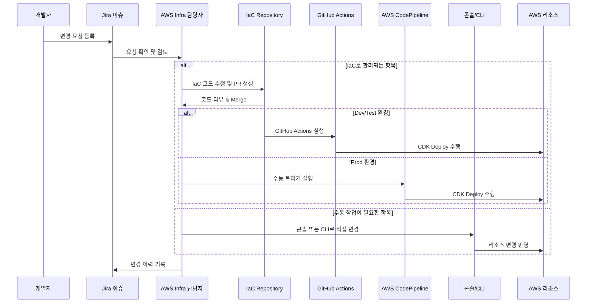

# IaC 환경에서 반드시 알아야 할 콘솔 변경 유의사항

> "IaC를 도입했다면, 더 이상 과거처럼 콘솔에서 수동 변경하는 습관은 버려야 합니다."

---

## 1. 문서 목적

IaC(Infrastructure as Code) 기반 운영 체계로 전환한 이후에도 AWS 콘솔을 통한 수동 설정 변경이 반복적으로 발생하고 있습니다. 이 문서는 왜 콘솔 수동 변경이 문제가 되는지, 어떤 항목은 예외적으로 허용될 수 있는지, 그리고 개발자가 어떻게 마인드를 전환해야 하는지에 대해 명확한 기준을 제시합니다.

---

## 2. 왜 이런 문제가 발생하는가?

### 기존 습관의 관성

- 콘솔을 통한 설정 변경은 빠르고 익숙한 방식입니다.
- 과거에는 운영 속도를 위해 개발자 재량으로 설정을 변경하는 것이 관행이었습니다.

### IaC 체계에 대한 인식 부족

- IaC로 변경되었음에도 불구하고, 그 의미와 영향도를 충분히 이해하지 못한 경우가 많습니다.

---

## 3. 콘솔에서 수동 변경하면 발생하는 문제

| 항목               | 설명                                                                                         |
| ------------------ | -------------------------------------------------------------------------------------------- |
| **상태 불일치**    | 콘솔에서 수정한 내용이 코드와 동기화되지 않음 → 다음 `cdk deploy` 시 덮어써짐 또는 에러 발생 |
| **감사 추적 불가** | 누가 언제 어떤 이유로 변경했는지 추적 불가 → 보안 및 운영 리스크 증가                        |
| **재현 불가능성**  | 동일 설정을 다른 환경(예: Test → Prod)으로 확장할 수 없음                                    |
| **팀 협업 파괴**   | 코드 리뷰, 승인, 기록 없는 개인 행위는 DevOps 원칙에 반함                                    |

---

## 4. 콘솔에서 작업해도 되는 것 vs 하면 안되는 것

### ✅ 콘솔에서 예외적으로 허용되는 작업

- CloudWatch Log 확인, Metric 분석
- 긴급 이슈 대응 시 수동 조치 (단, 사후 반드시 기록 남김)
- 일부 **비영속적 설정** (ex. 일회성 테스트용 리소스)

### ❌ 절대 콘솔에서 수정하면 안 되는 항목

- IAM Role, Policy, Trust Relationship
- VPC, Subnet, Routing, Security Group
- S3 Bucket 설정, Lambda 설정, API Gateway 경로 및 권한
- CDK로 관리 중인 모든 리소스

---

## 5. 개발자 마인드셋 전환 및 훈련

> "IaC는 단지 도구가 아니라 문화이자 습관입니다."

### 권장 행동

- 모든 변경은 Jira 이슈 등록 → PR → 리뷰 → Merge → CDK Deploy 순으로 처리
- 수동 변경 전에는 반드시 코드로 먼저 반영 가능한지 확인하고, CDK 적용 여부를 담당자와 협의
- 변경이 급한 경우에도 **Jira**에 사전 협의 및 기록 필수

### 마인드셋 훈련 팁

- "콘솔은 확인용 도구이지, 변경 도구가 아니다"라고 생각하기
- `cdk diff` 결과를 먼저 보며 변경사항을 예측하는 습관 들이기
- 동료와 페어로 IaC 코드 리뷰 자주 해보기

### Infra 변경 프로세스 요약

- 모든 인프라 변경 요청은 **반드시 Jira를 통해 접수**해야 하며,
- AWS 담당자가 변경 사항을 검토 후 수동과 CDK 작업으로 분류하여 진행
- 수동이 필요한 작업은 담당자가 Console 또는 CLI로 직접 수행
- **Prod 계정은 여전히 수동 관리 항목이 많기 때문에, 반드시 담당자 수행 원칙 유지**

---

## 6. 추가 권장사항

- 신규 입사자 온보딩 시, 콘솔 수동 변경 금지 원칙과 함께 관련 리소스에 대한 수동 변경이 원천적으로 불가능하도록 권한을 제한하는 정책을 병행하여 적용
- Jira를 통한 변경 기록 문화 정착
- Terraform, Pulumi 등 다른 IaC 툴을 사용할 때도 동일 원칙 적용

---

## 📌 결론

IaC 기반의 인프라는 협업, 재현성, 추적 가능성을 전제로 합니다. 콘솔에서의 임의 수정을 허용하는 순간 IaC의 근본 취지가 무너집니다. 개발자 한 사람의 작은 수동 조작이 전체 인프라 신뢰도를 무너뜨릴 수 있음을 반드시 인식하고, IaC 체계에 맞는 행동과 문화를 습관화해야 합니다.
