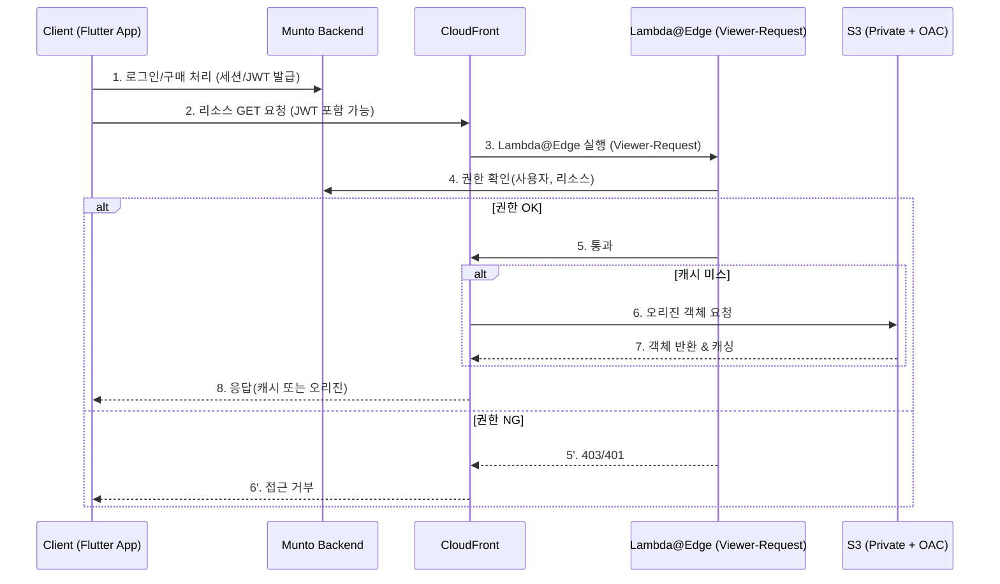
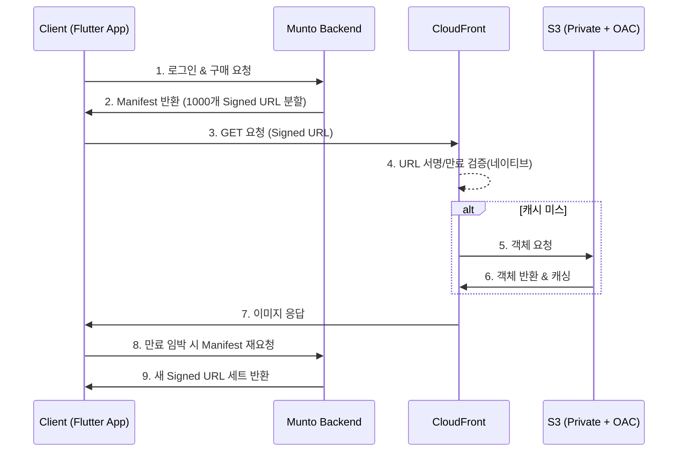
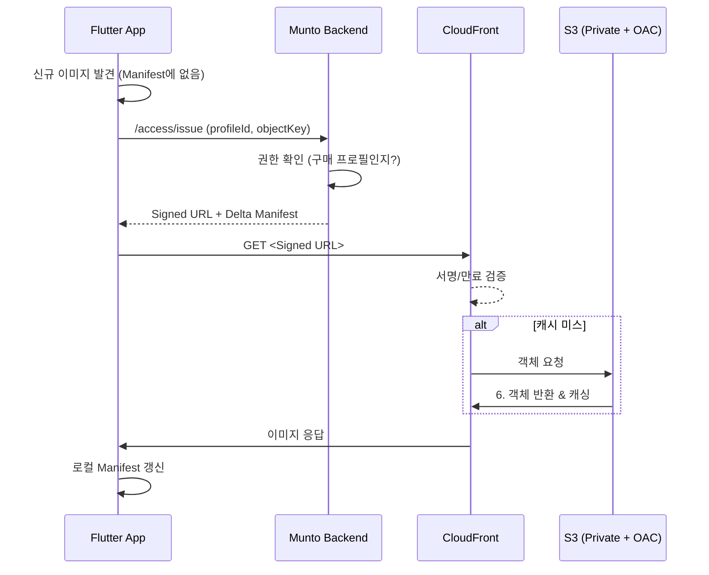
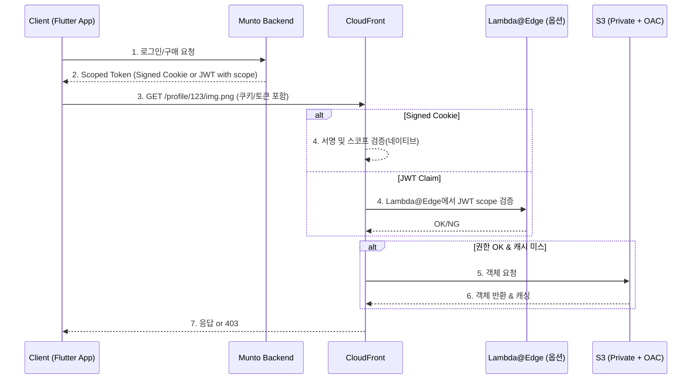

# VOD/이미지 다운로드 권한 검증 아키텍처 조사

아래 내용은 Jira 이슈와 별도 문서로, **기본 Flow**와 **Per-Resource Signed URL(단기 스냅샷 접근 제어)** 방안을 도식과 함께 정리한 것입니다.

---

## 1) 기본 Flow (BE 권한 확인 경유)

### 목적

- **CloudFront + Lambda@Edge + Backend**를 통해 **다운로드 시점에 권한을 확인**하여 응답.
- 권한 상태(구매/환불 등)가 바뀌면 즉시 차단 가능(다만 BE 호출로 오버헤드 존재).

### Mermaid 다이어그램

### 특성

- **장점**: 환불/권한 변경 즉시 반영(매 요청 BE 확인).
- **단점**: BE 호출로 **지연/비용** 증가. 트래픽 증가 시 확장성 이슈 → 아래 2)~4) 방안으로 오버헤드 절감 검토.

---

## 2) Per-Resource Signed URL (단기 스냅샷 접근 제어)

### 목적

- **BE 호출 오버헤드 없이** CloudFront가 **네이티브 서명 검증**으로 응답.
- 권한 부여/회수는 **다음 URL 발급분**부터 즉시 반영.

### 핵심 아이디어

- 백엔드가 권한 확인 후 **객체별 CloudFront Signed URL**을 발급.
- 클라이언트는 Manifest(JSON)로 일괄 수신 후 사용.
- 서명 파라미터는 **검증에는 사용**되지만 **캐시 키에서는 제외**하여 공유 캐시 유지.

### Mermaid 다이어그램 (일괄 다운로드)

### Mermaid 다이어그램 (신규 이미지 Lazy Issuance)

### 특성

- **장점**: λ 불필요(네이티브 검증) → **지연/비용 최소**. 캐시 효율↑로 **S3 DTO 절감**.
- **단점**: 이미 발급된 URL의 **TTL 내 즉시 회수는 어렵고**, TTL 전략에 따라 반영 속도가 달라짐.
- **TTL 고려**:
  - 5~15분: 환불 즉시성 강화, 하지만 발급/재요청 오버헤드 증가.
  - 30분~1시간: BE 부하 완화, 일반 서비스에 적합.
  - 1일: 보안 리스크 커지지만, 네트워크 안정성과 비용 절감 극대화.
  - 즉, **보안(권한 회수 속도)**과 **비용/시스템 부하**의 균형점을 상황별로 선택해야 함.
- **적합도**: 이미지·개별 VOD 다운로드 시나리오에 최적. HLS 스트리밍은 별도 고려 필요.

---

## 3) Scoped Token Authorization (개요)

목적

- 리소스 그룹 단위(예: 특정 프로필, 특정 VOD 시리즈)로 권한을 부여.
- 개별 오브젝트별 Signed URL이 아닌, 스코프 기반 토큰을 통해 일괄 접근 허용.

구현 방식

- CloudFront Signed Cookie를 사용하여 특정 경로(prefix)에 대한 접근 권한을 부여.
- 또는 Lambda@Edge에서 JWT Claim의 scope 필드를 검증하여 해당 경로 접근 허용 여부 확인.

### Mermaid 다이어그램

### 특성

- 장점: 신규로 추가된 객체도 자동 커버, 관리 편의성 높음.
- 단점:
  - 권한 회수는 쿠키/JWT 만료에 의존 → TTL 전략 중요.
  - 사용자별로 권한이 서로 다른 수백 개의 개별 파일 접근 제어에는 적합하지 않음.

---

## 4) Manifest-based Access Control (개요)

### 목적

- 허용된 리소스 목록을 **Manifest(JSON)**으로 주기적으로 제공.
- Manifest 자체는 **권한 정보를 전달**하는 역할만 하며, **보안 집행은 Signed URL/쿠키/Lambda 검증**이 수행.

### 구현 방식

- 백엔드에서 구매/권한 상태에 맞춰 Manifest를 발급.
- Manifest 항목에 **Per-Resource Signed URL**을 포함하거나, **리소스 키만 담고 요청 시 Lazy Issuance**로 URL 발급.
- 클라이언트는 Manifest 기반으로만 요청하며, URL 검증은 CloudFront가 수행.
- Manifest 만료 시 갱신 요청 → 권한 회수 반영.

### 특성

- **장점**: 대규모 리소스 관리 효율, 증분 갱신으로 오버헤드 감소.
- **단점**:
  - Manifest만으로는 권한 제어 불가 → 반드시 Signed URL/쿠키 병행 필요.
  - 결국 보안은 **Signed URL이 책임지고**, Manifest는 관리 효율을 높이는 수단에 불과.
  - **인증 캐싱 기법 아님** → BE 발급 요청은 여전히 필요.

---

## 문토 서비스 상황별 적합도

| 방안                             | 데이팅 이미지 | VOD 다운로드 | VOD HLS 스트리밍 | 특징/비고                            |
| -------------------------------- | ------------- | ------------ | ---------------- | ------------------------------------ |
| 1) 기본 Flow                     | △             | △            | △                | BE 오버헤드 크고 확장성 낮음         |
| 2) Per-Resource Signed URL       | ◎             | ◎            | △                | TTL 전략 중요, 보안↔비용 균형 필요   |
| 3) Scoped Token Authorization    | △             | △            | ○                | Scope 단위 관리, 개별 구매 단위 불가 |
| 4) Manifest-based Access Control | ○             | ○            | ○                | 관리 보조 수단, Signed URL 필수 병행 |

---

## 부록: 설정 체크리스트 (공통)

- **S3는 OAC로 직접 접근 차단**, 모든 다운로드는 CF 경유.
- **Cache-Key에서 서명 파라미터 제외** → 캐시 파편화 방지.
- **TTL 전략**: 서비스 특성에 따라 **수분~1일**까지 조정 가능.
  - **즉시 권한 회수 필요**: 5~10분.
  - **BE 부하/비용 최소화**: 30분~1일.
- **모니터링**: CF 로그 기반 히트율, 403 비율, 발급 API QPS, S3 DTO, p95 지연 대시보드 구성.
